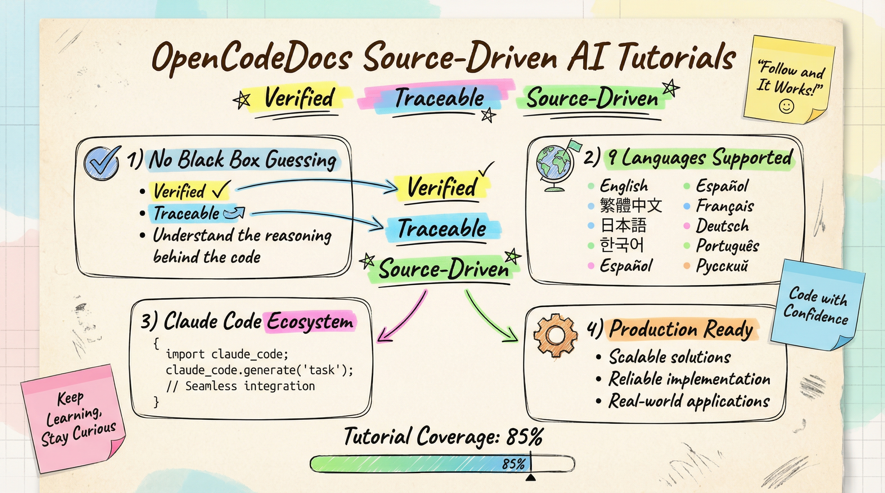

<div align="center">

# 🔥 OpenCodeDocs




**🎯 #1 AI Ecosystem Tutorial Site · Source-Driven · 100% Runnable**

AI tools iterating too fast? Official docs can't keep up? Tutorials online are outdated?

We deeply analyze open source project source code, and every line of code is verified.
**✅ Follow along, succeed on the first try, no detours.**

[🚀 Get Started](https://opencodedocs.com) · [⭐ Star This Repo](../../) · [💬 Join Discussion](../../discussions)

</div>

## 语言

[简体中文](README.zh-CN.md) · [English](README.md) · [日本語](README.ja.md) · [한국어](README.ko.md) · [Español](README.es.md) · [Français](README.fr.md) · [Deutsch](README.de.md) · [Português](README.pt.md) · [Русский](README.ru.md) · [繁體中文](README.zh-TW.md)

---

## 💡 Have you encountered these situations?

- ❌ Official docs lag behind, following tutorials but can't get it working?
- ❌ Online tutorials are just copy-paste, code won't run?
- ❌ Encounter errors, search everywhere but can't find solutions?
- ❌ Want to advance, but can't find practical guidance diving into source code?

**OpenCodeDocs is specifically designed to solve these problems.**

---

## ✨ Why Choose OpenCodeDocs?

### 🎯 Source-Verified, No Hallucinations

> Not copied from the internet, but core logic derived from **real source code**

We deeply analyze open source project source code, ensuring every line of code passes automated verification. **Tutorials specify the exact Git Commit version**, so you know exactly which version the code is based on.

### 🚀 Continuous Updates, Synchronized Upgrades

> When tools update, tutorials update automatically

When projects release new versions, our tutorials update synchronously. You don't need to worry about outdated tutorials—always learn the latest content.

> 💡 **Our tutorials are rapidly updating, continuously adding more high-quality projects!**

### 🌍 10+ Languages, Globally Accessible

> Chinese, English, Japanese, Korean, Spanish, French, German, Portuguese, Russian, Traditional Chinese...

No matter where you're from, learn AI tools in your native language.

### ✅ 100% Runnable, Zero Trial-and-Error

> Follow along, succeed on the first try, no guessing, no trial and error

Every step of our tutorials is verified, from installation to deployment. Just follow along and it will work. **No frustration, no pitfalls, no detours.**

---

## 👤 Which category do you belong to?

### 🌱 AI Tool Beginners

**Can't install? Can't configure? Don't worry, we have step-by-step tutorials**

- Zero knowledge needed to get started
- Detailed explanations for every step
- Solutions for common errors

### 💻 Advanced Developers

**Want to advance? Let's dive deep into source code**

- Multi-account rotation techniques
- Token-saving secrets
- Agent automation in practice
- Deep analysis at source code level

### 🏢 Tech Teams

**Need unified standards for team collaboration?**

- Reusable best practices
- Complete project structure
- Production deployment guide

---

## 🚀 Get Started in 3 Minutes

### Step 1: Clone Repository

```bash
git clone https://github.com/vbgate/opencodedocs.git
cd opencodedocs/site
```

### Step 2: Install Dependencies

```bash
npm install
```

### Step 3: Start Development Server

```bash
npm run dev
```

Visit `http://localhost:5173` and start your AI tool learning journey! 🎉

---

> 💡 **Tip**: You can also visit [opencodedocs.com](https://opencodedocs.com) to view online documentation.

---

## 📂 Project Structure

```
site/
├── docs/                      # Documentation root
│   ├── zh/                    # Chinese tutorials 🇨🇳
│   ├── en/                    # English tutorials 🇺🇸
│   ├── ja/                    # Japanese tutorials 🇯🇵
│   ├── ko/                    # Korean tutorials 🇰🇷
│   ├── es/                    # Spanish tutorials 🇪🇸
│   ├── fr/                    # French tutorials 🇫🇷
│   ├── de/                    # German tutorials 🇩🇪
│   ├── pt/                    # Portuguese tutorials 🇵🇹
│   ├── ru/                    # Russian tutorials 🇷🇺
│   ├── zh-tw/                 # Traditional Chinese tutorials 🇹🇼
│   ├── .vitepress/            # VitePress configuration
│   │   ├── config.mts         # Main config file
│   │   ├── sidebar.config.ts  # Sidebar auto-generation
│   │   └── theme/             # Custom theme components
│   ├── about.md               # About us
│   └── terms.md               # Terms of service
├── scripts/                   # Utility scripts
│   ├── add-order-to-md.ts     # Add order field
│   ├── check-frontmatter.ts   # Check Frontmatter
│   └── create-category-indexes.ts  # Create category indexes
├── package.json               # Project configuration
├── tailwind.config.js         # Tailwind CSS configuration
└── postcss.config.js          # PostCSS configuration
```

---

## 🛠️ Tech Stack

| Technology | Version | Description |
|:---:|:---:|:---|
|  | 1.x | Static site generator · Lightning-fast builds |
|  | 3.4+ | Frontend framework · Composition API |
|  | 4.x | Styling system · CSS-first configuration |
|  | 5.9+ | Type safety · Compile-time checking |
|  | 11.x | Diagram support · Flowchart visualization |
|  | Pages | Global CDN · 200+ edge nodes |

---

## 📚 Development Guide

### ➕ Add New Tutorial

1. **Create directory structure**
   ```
   docs/zh/[owner]/[repo]/
   ├── index.md          # Project homepage
   ├── start/            # Quick start
   ├── features/         # Feature introduction
   └── faq/              # FAQ
   ```

2. **Write Frontmatter**
   ```yaml
   ---
   title: "Tutorial Title"              # 2-6 Chinese characters or 4-12 English words
   order: 10                            # Sort order (10, 20, 30...)
   sidebarTitle: "Sidebar Title"        # Optional
   description: "SEO description"       # Search engine optimization
   ---
   ```

3. **Verify Build**
   ```bash
   npm run docs:build
   ```

### 🌍 Add Multi-Language Support

Add project in `docs/.vitepress/sidebar.config.ts`:
```typescript
const projects = [
  'owner/repo',  // Add your project
]
```

Then translate `home-config.[lang].json` files.

### 🎨 Customize Theme

- **Component location**: `docs/.vitepress/theme/components/`
- **Style file**: `docs/.vitepress/theme/custom.css`
- **Tailwind v4**: Use CSS-first configuration

---

## 🚀 Deployment Guide

### Local Build

```bash
npm run docs:build
```

Build output is located in `docs/.vitepress/dist/` directory.

### Deploy to Cloudflare Pages

```bash
# Auto deploy
npm run deploy
```

### Preview Build Results

```bash
npm run docs:preview
```

### ⚡ Performance Optimization

- **Image optimization**: Use WebP format, compress under 200KB
- **Code splitting**: VitePress automatically splits by route
- **CDN acceleration**: Static assets automatically uploaded to Cloudflare CDN
- **Prerendering**: Core pages prerendered, first-screen load < 500ms

---

> ✅ **Our site is deployed on a global CDN with lightning-fast access speed!**

---

## 🤝 Contributing

We welcome community contributions! Submit your tutorials, fix bugs, add new features.

### Contribution Workflow

1. **Fork this repository**
   ```bash
   # Click the Fork button on GitHub page
   ```

2. **Create feature branch**
   ```bash
   git checkout -b feature/amazing-feature
   ```

3. **Commit changes**
   ```bash
   git commit -m 'Add amazing feature'
   ```

4. **Push to branch**
   ```bash
   git push origin feature/amazing-feature
   ```

5. **Submit Pull Request**
   - Click the "Pull Request" button on GitHub
   - Fill in PR description, explain your changes

---

> 🌟 **Your contribution will help developers worldwide better use AI tools!**

---

## 📥 Submit Tutorial Request

Want high-quality tutorials for your project? Just 3 steps!

### 📝 Submission Process

**Step 1: Submit Issue**

1. Visit [GitHub Issues](https://github.com/vbgate/opencodedocs/issues)
2. Click "New Issue"
3. Use the following template:

```markdown
**Project Name**: [Project Name]
**GitHub Repository**: https://github.com/[owner]/[repo]
**Project Description**: [1-2 sentences describing project purpose]
**Target Audience**: [Beginner/Intermediate/Expert/All]
**Tutorial Language**: [Chinese/English/Other]
**Notes**: [Additional information]
```

**Step 2: Team Review**

- We review your application within 1-3 business days
- Evaluate whether the project is suitable for inclusion
- Confirm project source code quality and activity

**Step 3: Tutorial Launch**

- After approval, we automatically generate tutorials
- Verify runnable nature of every step
- Publish to official website, support multiple languages

### ⏱️ Processing Time

- **Review cycle**: 1-3 business days
- **Tutorial generation**: 3-7 business days
- **Launch time**: Immediately published after approval

### ❓ FAQ

**Q: What types of projects are suitable for inclusion?**
A: Open source AI tools, development tools, libraries, frameworks, etc. Must have certain technical depth and usage value.

**Q: Are tutorials free?**
A: Yes, our tutorials are completely free and will be continuously updated and maintained.

**Q: Can I specify tutorial language?**
A: Yes, we support 10 languages. You can specify needed language in Issue.

---

> 🎯 **Submit now: [Create Issue →](https://github.com/vbgate/opencodedocs/issues/new)**

---

## 📄 License

### Site Code

[MIT License](LICENSE)

### Tutorial Content

[CC-BY-NC-SA 4.0](https://creativecommons.org/licenses/by-nc-sa/4.0/)

**Attribution - NonCommercial - ShareAlike**

✅ You can:
- 📋 Share: Freely share and adapt
- 🔧 Modify: Create derivative works based on tutorial content
- 👥 Contribute: Submit your improvements

❌ You cannot:
- 💰 Commercial use: Unauthorized use for commercial purposes is prohibited

---

> 💡 **If you want to use tutorials for commercial purposes, please contact us: [vbgatecom@gmail.com](mailto:vbgatecom@gmail.com)**

---

## 📞 Contact Us

Any questions or suggestions? Feel free to contact us!

- 📧 **Email**: [vbgatecom@gmail.com](mailto:vbgatecom@gmail.com)
- 🐦 **Twitter**: [@codingzys](https://x.com/codingzys)
- 💻 **GitHub**: [vbgate/opencodedocs](https://github.com/vbgate/opencodedocs)
- 📥 **Submit Tutorial**: [GitHub Issues](https://github.com/vbgate/opencodedocs/issues)
- 🌐 **Website**: [opencodedocs.com](https://opencodedocs.com)

---

<div align="center">

**🎉 Thank you for choosing OpenCodeDocs!**

**From first line of code to production-grade apps, we provide tutorials for every stage.**

[⭐ Star This Repo](../../) · [📥 Submit Tutorial Request](https://github.com/vbgate/opencodedocs/issues/new) · [💬 Join Discussion](../../discussions)

Made with ❤️ by [OpenCodeDocs Team](https://github.com/vbgate/opencodedocs)

</div>
