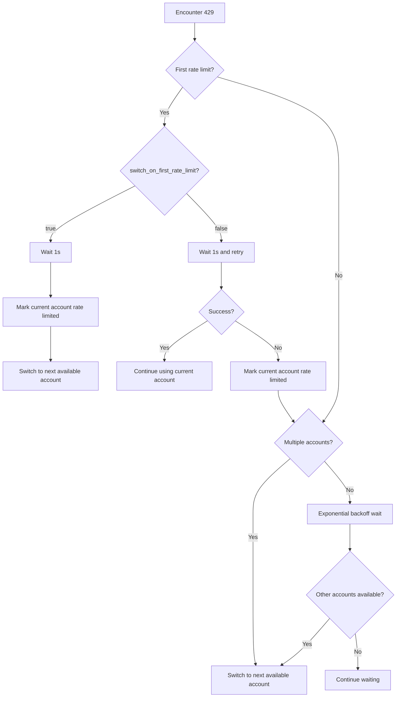

# Rate Limit Handling: Auto-Retry and Account Switching

## What You'll Learn

Master Antigravity Auth's intelligent rate limit handling mechanism:
- Distinguish 5 different types of 429 errors (quota exhaustion, rate limiting, capacity exhaustion, etc.)
- Understand the exponential backoff algorithm for auto-retry
- Master automatic account switching logic in multi-account scenarios
- Configure immediate switching on first rate limit or switch after 2 retries
- Use Gemini dual quota pool fallback to improve availability

No longer struggle with "all accounts rate limited but quota not fully utilized."

## Your Current Challenge

When using multiple Google accounts, you may encounter:

- Frequent 429 rate limits, unsure whether to retry or switch accounts
- Significantly different wait times for different 429 types, unsure how long to wait
- All accounts rate limited but actual quota unused due to inaccurate rate limit detection
- Unclear Gemini dual quota pool switch timing, leading to quota waste

## When to Use This

When you:
- Have configured multiple accounts but frequently encounter 429 errors
- Want to optimize request success rates in multi-account scenarios
- Need to adjust retry strategies (e.g., immediate switch on first rate limit)
- Use Gemini models and want to leverage dual quota pools

## Core Approach

### What is Rate Limit Handling

When the Antigravity Auth plugin encounters a 429 error, it automatically performs the following actions:

1. **Detect Rate Limit Type**: Parse the `reason` or `message` from the response to distinguish 5 rate limit types
2. **Calculate Backoff Time**: Intelligently calculate wait time based on rate limit type and failure count
3. **Execute Strategy**:
   - **Multi-Account**: Prioritize switching to available accounts
   - **Single Account**: Exponential backoff retry
4. **Record State**: Update the account's rate limit status for future request reference

::: info Why Intelligent Handling?
Google has rate limits for each account. Simply "switch on 429" may cause frequent switching, missing quickly recovering accounts. Simply "wait and retry" may waste quota from other available accounts. Intelligent handling needs to find the optimal balance between "switching" and "waiting."
:::

### 5 Rate Limit Types

Antigravity Auth distinguishes 5 rate limit types based on the `reason` field or `message` content in API responses:

| Type | Reason | Backoff Strategy | Typical Scenario |
|--- | --- | --- | ---|
| `QUOTA_EXHAUSTED` | Quota exhausted (daily or monthly) | Incremental backoff: 1min → 5min → 30min → 120min | Daily quota exhausted |
| `RATE_LIMIT_EXCEEDED` | Requests too fast (per minute limit) | Fixed 30 seconds | Short burst of requests |
| `MODEL_CAPACITY_EXHAUSTED` | Model server capacity insufficient | Fixed 15 seconds | Peak hours |
| `SERVER_ERROR` | Server internal error (5xx) | Fixed 20 seconds | Service instability |
| `UNKNOWN` | Unknown cause | Fixed 60 seconds | Unparseable error |

**Backoff Time Formula** (accounts.ts:51-75):

```typescript
// QUOTA_EXHAUSTED: Incremental backoff (based on consecutive failures)
// Fail 1 time: 1min (60_000ms)
// Fail 2 times: 5min (300_000ms)
// Fail 3 times: 30min (1_800_000ms)
// Fail 4+ times: 120min (7_200_000ms)

// Other types: Fixed backoff
// RATE_LIMIT_EXCEEDED: 30s
// MODEL_CAPACITY_EXHAUSTED: 15s
// SERVER_ERROR: 20s
// UNKNOWN: 60s
```

### Exponential Backoff Algorithm

Antigravity Auth uses a **deduplicated exponential backoff** algorithm:

**Core Logic** (plugin.ts:509-567):

```typescript
// 1. Deduplication window: Concurrent 429s within 2 seconds treated as same event
const RATE_LIMIT_DEDUP_WINDOW_MS = 2000;

// 2. State reset: Reset counter after 2 minutes without 429
const RATE_LIMIT_STATE_RESET_MS = 120_000;

// 3. Exponential backoff: baseDelay * 2^(attempt-1), max 60s
const expBackoff = Math.min(baseDelay * Math.pow(2, attempt - 1), 60000);
```

**Why Deduplication Window?**

Suppose you have 3 concurrent requests all triggering 429:
- **Without deduplication**: Each request increments counter, resulting in attempt=3, backoff 4s (2^2 × 1s)
- **With deduplication**: Treated as same event, attempt=1, backoff 1s

The deduplication window avoids concurrent requests excessively amplifying backoff time.

### Multi-Account Switching Logic

Antigravity Auth adopts a **"prioritize switching, retry as fallback"** strategy in multi-account scenarios:

**Decision Flow**:



**Key Configurations** (config/schema.ts:256-259):

| Config | Default | Description |
|--- | --- | ---|
| `switch_on_first_rate_limit` | `true` | Whether to immediately switch account on first rate limit (after waiting 1s) |
| `max_rate_limit_wait_seconds` | `300` | Maximum wait time when all accounts rate limited (5 minutes) |

**Recommended Configuration**:

- **Multi-Account (2+)**: `switch_on_first_rate_limit: true`, immediate switch to avoid wasting quota
- **Single Account**: This config is invalid, automatically uses exponential backoff retry

### Gemini Dual Quota Pool Fallback

Gemini models support two independent quota pools:
- **Antigravity Quota Pool**: Used first, but smaller capacity
- **Gemini CLI Quota Pool**: Used as fallback, larger capacity

**Fallback Logic** (plugin.ts:1318-1345):

```
1. Make request using Antigravity quota pool
2. Encounter 429 rate limit
3. Check if other accounts' Antigravity quota available
   - Yes: Switch account, continue using Antigravity
   - No: If quota_fallback=true, switch to Gemini CLI quota pool
```

**Configuration Option** (config/schema.ts:179):

```json
{
  "quota_fallback": true  // Default false
}
```

**Example**:

You have 2 accounts, both encounter 429:

| Status | quota_fallback=false | quota_fallback=true |
|--- | --- | ---|
| Account 1 (Antigravity) | Rate limited | Rate limited → Try Gemini CLI |
| Account 2 (Antigravity) | Rate limited | Rate limited → Try Gemini CLI |
| Result | Wait 5 minutes then retry | Switch to Gemini CLI, no wait needed |

::: tip Advantages of Dual Quota Pool
Gemini CLI quota pool is typically larger, and fallback can significantly improve request success rates. Note:
- Models with explicit `:antigravity` suffix will not fallback
- Fallback only happens when all accounts' Antigravity quota is exhausted
:::

### Single Account Retry Logic

If only one account exists, Antigravity Auth uses **exponential backoff retry**:

**Retry Formula** (plugin.ts:1373-1375):

```typescript
// First: 1s
// 2nd: 2s (1s × 2^1)
// 3rd: 4s (1s × 2^2)
// 4th: 8s (1s × 2^3)
// ...
// Max: 60s
const expBackoffMs = Math.min(1000 * Math.pow(2, attempt - 1), 60000);
```

**Retry Flow**:

```
1st: Encounter 429
  ↓ Wait 1s and retry (quick retry)
2nd: Still 429
  ↓ Wait 2s and retry
3rd: Still 429
  ↓ Wait 4s and retry
...
```

**Difference from Multi-Account**:

| Scenario | Strategy | Wait Time |
|--- | --- | ---|
| Single Account | Exponential backoff retry | 1s → 2s → 4s → 8s → ... → 60s |
| Multi-Account | Switch account | 1s (first) or 5s (2nd) |

## 🎒 Preparation

::: warning Prerequisites Check
Ensure you have completed:
- [x] Multi-account setup (at least 2 Google accounts)
- [x] Understand [Account Selection Strategies](/NoeFabris/opencode-antigravity-auth/advanced/account-selection-strategies/)
- [x] Understand [Dual Quota System](/NoeFabris/opencode-antigravity-auth/platforms/dual-quota-system/)
:::

## Follow Along

### Step 1: Enable Debug Logs to Observe Rate Limits

**Why**
Debug logs show detailed rate limit information, helping you understand how the plugin works.

**How**

Enable debug logs:

```bash
export OPENCODE_ANTIGRAVITY_DEBUG=1
```

Trigger rate limits with concurrent requests:

```bash
# Send multiple concurrent requests (ensure triggering 429)
for i in {1..10}; do
  opencode run "Test $i" --model=google/antigravity-gemini-3-pro &
done
wait
```

**You should see**:

```
[RateLimit] 429 on Account 0 family=claude retryAfterMs=60000
  message: You have exceeded the quota for this request.
  quotaResetTime: 2026-01-23T12:00:00Z
  retryDelayMs: 60000
  reason: QUOTA_EXHAUSTED

Rate limited. Quick retry in 1s... (toast notification)
```

**Log Interpretation**:

- `429 on Account 0 family=claude`: Account 0's Claude model rate limited
- `retryAfterMs=60000`: Server suggests waiting 60 seconds
- `reason: QUOTA_EXHAUSTED`: Quota exhausted (incremental backoff)

### Step 2: Configure Immediate Switch on First Rate Limit

**Why**
With multiple accounts, immediate switching on first rate limit maximizes quota utilization, avoiding waiting.

**How**

Modify configuration file:

```bash
cat > ~/.config/opencode/antigravity.json << 'EOF'
{
  "$schema": "https://raw.githubusercontent.com/NoeFabris/opencode-antigravity-auth/main/assets/antigravity.schema.json",
  "switch_on_first_rate_limit": true
}
EOF
```

**You should see**: Configuration file updated.

**Verify Configuration Takes Effect**:

Send multiple requests, observe behavior after first rate limit:

```bash
export OPENCODE_ANTIGRAVITY_DEBUG=1
for i in {1..5}; do
  opencode run "Test $i" --model=google/antigravity-gemini-3-pro &
done
wait
```

**You should see**:

```
[RateLimit] 429 on Account 0 family=gemini retryAfterMs=30000
Server at capacity. Switching account in 1s... (toast notification)
[AccountContext] Selected account: user2@gmail.com (index: 1)
```

**Key Points**:
- Wait 1s after first 429
- Automatically switch to next available account (index: 1)
- No retry of current account

### Step 3: Disable Immediate Switch on First Rate Limit

**Why**
If you want to retry the current account first (avoiding frequent switching), you can disable this option.

**How**

Modify configuration file:

```bash
cat > ~/.config/opencode/antigravity.json << 'EOF'
{
  "$schema": "https://raw.githubusercontent.com/NoeFabris/opencode-antigravity-auth/main/assets/antigravity.schema.json",
  "switch_on_first_rate_limit": false
}
EOF
```

**You should see**: Configuration file updated.

**Verify Configuration Takes Effect**:

Send multiple requests again:

```bash
export OPENCODE_ANTIGRAVITY_DEBUG=1
for i in {1..5}; do
  opencode run "Test $i" --model=google/antigravity-gemini-3-pro &
done
wait
```

**You should see**:

```
[RateLimit] 429 on Account 0 family=gemini retryAfterMs=30000
Rate limited. Quick retry in 1s... (toast notification)
[RateLimit] 429 on Account 0 family=gemini retryAfterMs=30000
Rate limited again. Switching account in 5s... (toast notification)
[AccountContext] Selected account: user2@gmail.com (index: 1)
```

**Key Points**:
- First 429: Wait 1s and **retry current account**
- 2nd 429: Wait 5s then **switch account**
- If retry succeeds, continue using current account

### Step 4: Enable Gemini Dual Quota Pool Fallback

**Why**
Gemini models support dual quota pools, and enabling fallback can significantly improve request success rates.

**How**

Modify configuration file:

```bash
cat > ~/.config/opencode/antigravity.json << 'EOF'
{
  "$schema": "https://raw.githubusercontent.com/NoeFabris/opencode-antigravity-auth/main/assets/antigravity.schema.json",
  "quota_fallback": true
}
EOF
```

**You should see**: Configuration file updated.

**Verify Configuration Takes Effect**:

Send Gemini requests (ensure triggering Antigravity quota pool rate limit):

```bash
export OPENCODE_ANTIGRAVITY_DEBUG=1
for i in {1..5}; do
  opencode run "Test $i" --model=google/antigravity-gemini-3-pro &
done
wait
```

**You should see**:

```
[RateLimit] 429 on Account 0 family=gemini retryAfterMs=30000
Antigravity quota exhausted for gemini-3-pro. Switching to Gemini CLI quota... (toast notification)
[DEBUG] quota fallback: gemini-cli
```

**Key Points**:
- After all accounts' Antigravity quota is exhausted
- Automatically switch to Gemini CLI quota pool
- No wait, direct retry

**Force Using Antigravity Quota** (no fallback):

```bash
# Use explicit suffix :antigravity
opencode run "Test" --model=google/antigravity-gemini-3-pro:antigravity
```

### Step 5: Configure Maximum Wait Time

**Why**
When all accounts are rate limited, the plugin waits for the shortest reset time. You can configure a maximum wait time to avoid infinite waiting.

**How**

Modify configuration file:

```bash
cat > ~/.config/opencode/antigravity.json << 'EOF'
{
  "$schema": "https://raw.githubusercontent.com/NoeFabris/opencode-antigravity-auth/main/assets/antigravity.schema.json",
  "max_rate_limit_wait_seconds": 60
}
EOF
```

**You should see**: Configuration file updated.

**Verify Configuration Takes Effect**:

Trigger rate limits on all accounts:

```bash
export OPENCODE_ANTIGRAVITY_DEBUG=1
for i in {1..20}; do
  opencode run "Test $i" --model=google/antigravity-claude-opus-4.5 &
done
wait
```

**You should see**:

```
[RateLimit] 429 on Account 0 family=claude retryAfterMs=60000
[RateLimit] 429 on Account 1 family=claude retryAfterMs=60000
[DEBUG] All accounts rate limited. Min wait time: 60s, max wait: 60s
Rate limited. Retrying in 60s... (toast notification)
```

**Key Points**:
- When all accounts rate limited, wait for the shortest reset time
- If shortest reset time > `max_rate_limit_wait_seconds`, use the maximum value
- Default maximum wait is 300 seconds (5 minutes)

## Checkpoint ✅

::: tip How to Verify Configuration Takes Effect?
1. Check configuration file to confirm config items are correct
2. Enable debug logs: `OPENCODE_ANTIGRAVITY_DEBUG=1`
3. Observe `[RateLimit]` events in logs
4. Observe account switching behavior (`AccountContext` logs)
5. Check if toast notifications display as expected
:::

## Common Pitfalls

### ❌ Ignoring Deduplication Window, Misunderstanding Backoff Time

**Incorrect Behavior**:
- Send 10 concurrent requests, all encounter 429
- Think backoff time is 2^10 × 1s = 1024s
- Actually it's 1s (because of deduplication window)

**Correct Approach**: Understand the 2-second deduplication window, concurrent requests won't be counted multiple times.

### ❌ Mixing `switch_on_first_rate_limit` with Single Account

**Incorrect Behavior**:
- Only have 1 account, but configured `switch_on_first_rate_limit: true`
- Think it will switch accounts, but no other accounts available

**Correct Approach**: In single-account scenarios, this config is invalid, automatically uses exponential backoff retry.

### ❌ Gemini Explicit Suffix Blocks Fallback

**Incorrect Behavior**:
- Use `google/antigravity-gemini-3-pro:antigravity`
- Configured `quota_fallback: true`
- But won't fallback to Gemini CLI when encountering 429

**Correct Approach**: Explicit suffix forces using specified quota pool. If you need fallback, don't use the suffix.

### ❌ Wait Time Too Long When All Accounts Rate Limited

**Incorrect Behavior**:
- Configured `max_rate_limit_wait_seconds: 600` (10 minutes)
- All accounts rate limited for 60s, but waited 10 minutes

**Correct Approach**: `max_rate_limit_wait_seconds` is the **maximum value**. Actual wait time is the shortest reset time, never exceeding the maximum.

## Summary

| Mechanism | Core Feature | Use Case |
|--- | --- | ---|
| **Rate Limit Detection** | Distinguish 5 types (QUOTA_EXHAUSTED, RATE_LIMIT_EXCEEDED, etc.) | All scenarios |
| **Exponential Backoff** | More failures = longer wait (1s → 2s → 4s → ... → 60s) | Single account |
| **Account Switching** | Multi-account prioritizes switching, single account retries | Multi-account |
| **Deduplication Window** | Concurrent 429s within 2 seconds treated as same event | Concurrent scenarios |
| **Dual Quota Pool Fallback** | Try Gemini CLI after Antigravity rate limited | Gemini models |

**Key Configurations**:

| Config | Default | Recommended | Description |
|--- | --- | --- | ---|
| `switch_on_first_rate_limit` | `true` | `true` (multi-account) | Immediate switch on first rate limit |
| `quota_fallback` | `false` | `true` (Gemini) | Enable dual quota pool fallback |
| `max_rate_limit_wait_seconds` | `300` | `300` | Maximum wait time (seconds) |

**Debug Methods**:

- Enable debug logs: `OPENCODE_ANTIGRAVITY_DEBUG=1`
- Check `[RateLimit]` events: Understand rate limit type and backoff time
- Check `[AccountContext]` logs: Observe account switching behavior

## Coming Up Next

> Next lesson: **[Session Recovery](/NoeFabris/opencode-antigravity-auth/advanced/session-recovery/)**
>
> You'll learn:
> - How to automatically resume interrupted tool calls
> - Session recovery mechanism for Thinking models
> - Synthetic tool_result injection principles

---

## Appendix: Source Code Reference

<details>
<summary><strong>Click to expand source code locations</strong></summary>

> Last updated: 2026-01-23

| Feature | File Path | Lines |
|--- | --- | ---|
| Rate limit type definition | [`src/plugin/accounts.ts`](https://github.com/NoeFabris/opencode-antigravity-auth/blob/main/src/plugin/accounts.ts#L10-L20) | 10-20 |
| Parse rate limit reason | [`src/plugin/accounts.ts`](https://github.com/NoeFabris/opencode-antigravity-auth/blob/main/src/plugin/accounts.ts#L29-L49) | 29-49 |
| Calculate backoff time | [`src/plugin/accounts.ts`](https://github.com/NoeFabris/opencode-antigravity-auth/blob/main/src/plugin/accounts.ts#L51-L75) | 51-75 |
| Exponential backoff algorithm | [`src/plugin.ts`](https://github.com/NoeFabris/opencode-antigravity-auth/blob/main/src/plugin.ts#L532-L567) | 532-567 |
| Mark account rate limited | [`src/plugin/accounts.ts`](https://github.com/NoeFabris/opencode-antigravity-auth/blob/main/src/plugin/accounts.ts#L434-L461) | 434-461 |
| Check if account rate limited | [`src/plugin/accounts.ts`](https://github.com/NoeFabris/opencode-antigravity-auth/blob/main/src/plugin/accounts.ts#L134-L152) | 134-152 |
| 429 error handling | [`src/plugin.ts`](https://github.com/NoeFabris/opencode-antigravity-auth/blob/main/src/plugin.ts#L1260-L1396) | 1260-1396 |
| Gemini dual quota pool fallback | [`src/plugin.ts`](https://github.com/NoeFabris/opencode-antigravity-auth/blob/main/src/plugin.ts#L1318-L1345) | 1318-1345 |
| Rate limit logging | [`src/plugin/debug.ts`](https://github.com/NoeFabris/opencode-antigravity-auth/blob/main/src/plugin/debug.ts#L354-L396) | 354-396 |
| Config Schema | [`src/plugin/config/schema.ts`](https://github.com/NoeFabris/opencode-antigravity-auth/blob/main/src/plugin/config/schema.ts#L256-L221) | 256-221 |

**Key Constants**:

- `QUOTA_EXHAUSTED_BACKOFFS = [60_000, 300_000, 1_800_000, 7_200_000]`: Incremental backoff times for quota exhaustion (accounts.ts:22)
- `RATE_LIMIT_EXCEEDED_BACKOFF = 30_000`: Fixed 30s backoff for rate limit (accounts.ts:23)
- `MODEL_CAPACITY_EXHAUSTED_BACKOFF = 15_000`: Fixed 15s backoff for capacity exhaustion (accounts.ts:24)
- `SERVER_ERROR_BACKOFF = 20_000`: Fixed 20s backoff for server error (accounts.ts:25)
- `RATE_LIMIT_DEDUP_WINDOW_MS = 2000`: 2s deduplication window (plugin.ts:509)
- `RATE_LIMIT_STATE_RESET_MS = 120_000`: 2-minute state reset (plugin.ts:510)
- `FIRST_RETRY_DELAY_MS = 1000`: 1s first quick retry (plugin.ts:1304)

**Key Functions**:

- `parseRateLimitReason(reason?, message?)`: Parse rate limit reason (accounts.ts:29)
- `calculateBackoffMs(reason, consecutiveFailures, retryAfterMs?)`: Calculate backoff time (accounts.ts:51)
- `markRateLimitedWithReason(account, family, headerStyle, model, reason, retryAfterMs?)`: Mark account rate limited (accounts.ts:445)
- `isRateLimitedForHeaderStyle(account, family, headerStyle, model?)`: Check if account rate limited (accounts.ts:536)
- `getRateLimitBackoff(accountIndex, quotaKey, serverRetryAfterMs)`: Get deduplicated backoff time (plugin.ts:532)
- `resetRateLimitState(accountIndex, quotaKey)`: Reset rate limit state (plugin.ts:573)

</details>
