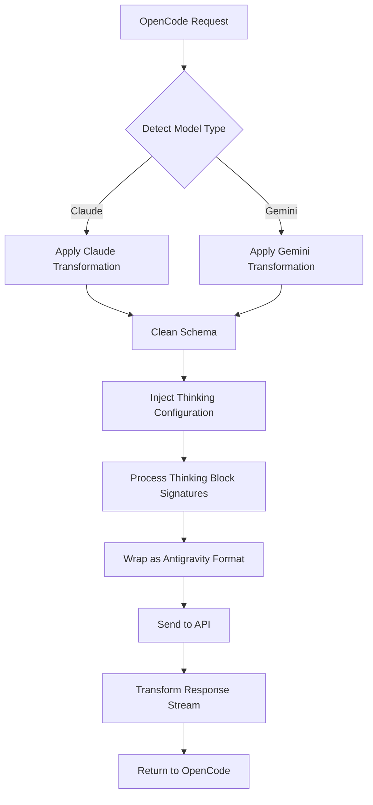

# Request Transformation: Multi-Model Protocol Bridge

## What You'll Learn

- Understand how the plugin transforms request formats between OpenCode and Antigravity API
- Master Claude and Gemini model protocol differences and transformation rules
- Troubleshoot 400 errors caused by schema incompatibilities
- Optimize Thinking configuration for best performance

## Your Current Challenge

You may encounter these issues:

- ❌ MCP server returns `400 Unknown name 'parameters'` error
- ❌ Using Gemini models triggers `400 Unknown name 'const'`
- ❌ Thinking model thinking blocks display incorrectly
- ❌ Tool calls fail with signature verification errors
- ❌ Unclear why the plugin supports both Claude and Gemini

## When to Use This

When you need:

| Scenario | Why Understand Transformation Mechanism |
|--- | ---|
| Developing custom MCP servers | Ensure tool schema is compatible with Antigravity API |
| Troubleshooting 400/500 errors | Determine if it's a schema issue or transformation logic issue |
| Optimizing Thinking performance | Understand thinking block signature and caching mechanism |
| Debugging tool call failures | Check tool ID allocation and parameter signatures |

::: warning Prerequisites
Before starting this tutorial, ensure you have:
- ✅ Installed the opencode-antigravity-auth plugin
- ✅ Understood available models and their variants
- ✅ Grasped basic concepts of Thinking models

[Available Models Tutorial](../../platforms/available-models/) | [Thinking Models Tutorial](../../platforms/thinking-models/)
:::

## Core Concept

Request transformation is the plugin's core mechanism. It does four things:

1. **Intercept OpenCode requests** — Intercept `fetch(generativeLanguage.googleapis.com)` calls
2. **Apply model transformation** — Transform format based on model type (Claude/Gemini)
3. **Wrap and send** — Wrap as Antigravity format and call API
4. **Transform response** — Convert response back to OpenCode-recognizable format

**Transformation Flow**:



**Key Transformation Points**:

| Transformation Type | Purpose | Source Location |
|--- | --- | ---|
| Schema cleaning | Remove fields not supported by Antigravity API | `src/plugin/request-helpers.ts` |
| Thinking configuration | Inject correct thinking config based on model family | `src/plugin/transform/claude.ts`, `src/plugin/transform/gemini.ts` |
| Thinking block processing | Strip historical thinking blocks and inject signatures | `src/plugin/request.ts` |
| Response stream transformation | Convert SSE events to OpenCode format | `src/plugin/core/streaming.ts` |

## Let's Walk Through It

### Step 1: Understand Claude Transformation Rules

**Why**
Claude models use different protocol formats (snake_case, VALIDATED mode), requiring special handling.

**Key Transformation Rules**

| Original Format | Transformed Format | Description |
|--- | --- | ---|
| `toolConfig.functionCallingConfig.mode` | `"VALIDATED"` | Force enable tool call verification |
| `thinkingConfig.includeThoughts` | `include_thoughts` | snake_case format |
| `thinkingConfig.thinkingBudget` | `thinking_budget` | snake_case format |
| `maxOutputTokens` | Auto-adjust to 64,000 | Thinking models need larger output space |

**Code location**: [`src/plugin/transform/claude.ts:43-56`](https://github.com/NoeFabris/opencode-antigravity-auth/blob/main/src/plugin/transform/claude.ts#L43-L56)

**Example**

```typescript
// Before transformation (OpenCode format)
{
  "toolConfig": {
    "functionCallingConfig": {
      "mode": "AUTO"
    }
  },
  "thinkingConfig": {
    "includeThoughts": true,
    "thinkingBudget": 32000
  }
}

// After transformation (Antigravity format)
{
  "toolConfig": {
    "functionCallingConfig": {
      "mode": "VALIDATED"  // Force VALIDATED
    }
  },
  "thinkingConfig": {
    "include_thoughts": true,  // snake_case
    "thinking_budget": 32000   // snake_case
  },
  "generationConfig": {
    "maxOutputTokens": 64000   // Auto-adjust for Thinking models
  }
}
```

**You should see**:
- All Claude model transformations follow snake_case naming
- `maxOutputTokens` is automatically adjusted to a sufficiently large value (`CLAUDE_THINKING_MAX_OUTPUT_TOKENS = 64,000`)

### Step 2: Understand Gemini Transformation Rules

**Why**
Gemini models use camelCase format and have strict requirements for JSON Schema (uppercase types).

**Key Transformation Rules**

| Original Format | Transformed Format | Description |
|--- | --- | ---|
| JSON Schema `type: "object"` | `type: "OBJECT"` | Types must be uppercase |
| `additionalProperties: false` | Remove | Gemini API doesn't support |
| `$ref: "#/$defs/Foo"` | Convert to `description: "See: Foo"` | References converted to description |
| `const: "foo"` | `enum: ["foo"]` | const converted to enum |
| `enum: ["a", "b"]` | Add description hint `(Allowed: a, b)` | Enums with 2-10 items get automatic hints |

**Code location**: [`src/plugin/transform/gemini.ts:52-124`](https://github.com/NoeFabris/opencode-antigravity-auth/blob/main/src/plugin/transform/gemini.ts#L52-L124)

**Example**

```json
// Before transformation (OpenCode format)
{
  "parameters": {
    "type": "object",
    "properties": {
      "status": {
        "type": "string",
        "const": "active",
        "enum": ["active", "inactive"]
      }
    }
  }
}

// After transformation (Gemini format)
{
  "parameters": {
    "type": "OBJECT",  // Uppercase
    "properties": {
      "status": {
        "type": "STRING",  // Uppercase
        "enum": ["active", "inactive"],  // const removed
        "description": "(Allowed: active, inactive)"  // Auto-added hint
      }
    }
  }
}
```

**You should see**:
- All Gemini Schema types are converted to uppercase (`STRING`, `OBJECT`, `ARRAY`)
- `const` fields are removed and converted to `enum`
- Unsupported fields (`$ref`, `additionalProperties`) are removed

### Step 3: Understand Schema Cleaning Process

**Why**
Antigravity API uses strict protobuf-backed validation and doesn't support all fields from standard JSON Schema.

**Four-Phase Cleaning Process**

1. **Phase 1a: Convert $ref to description**
   - `$ref: "#/$defs/Foo"` → `{ description: "See: Foo" }`

2. **Phase 1b: Convert const to enum**
   - `const: "foo"` → `enum: ["foo"]`

3. **Phase 1c: Add enum hints**
   - `enum: ["a", "b"]` → Add `(Allowed: a, b)` to description

4. **Phase 1d: Remove unsupported fields**
   - Delete: `$schema`, `$defs`, `additionalProperties`, `pattern`, `minLength`, `maxLength`, etc.

**Code location**: [`src/plugin/request-helpers.ts:20-280`](https://github.com/NoeFabris/opencode-antigravity-auth/blob/main/src/plugin/request-helpers.ts#L20-L280)

**Unsupported Fields List**:

| Field | Why Unsupported | Alternative |
|--- | --- | ---|
| `$ref` | References not allowed | Convert to description hint |
| `const` | Constants not allowed | Use `enum` |
| `additionalProperties` | Doesn't validate extra properties | Note in description |
| `$schema`, `$defs` | Doesn't use JSON Draft | Remove |
| `pattern`, `minLength`, `maxLength` | String constraints handled by server | Remove |
| `minItems`, `maxItems` | Array constraints handled by server | Remove |

**You should see**:
- MCP server schemas are cleaned to Antigravity-compatible format
- 400 errors are reduced, with clearer error messages

### Step 4: Understand Thinking Block Processing Mechanism

**Why**
Claude and Gemini 3 models require stable thinking block signatures, otherwise signature verification errors occur.

**Three-Step Processing Flow**

1. **Strip historical thinking blocks**
   - Recursively remove all historical `thinking` blocks (avoid signature conflicts)
   - Use cache to verify signature validity

2. **Inject new thinking signatures**
   - Generate stable signatures for new thinking blocks
   - Cache signatures for multi-turn conversations

3. **Ensure thinking block ordering**
   - Claude: thinking must come before tool_use
   - Gemini: thinking can appear anywhere

**Code location**:
- [`src/plugin/request.ts:711-724`](https://github.com/NoeFabris/opencode-antigravity-auth/blob/main/src/plugin/request.ts#L711-L724)

**Thinking Block Signature Example**:

```typescript
// Claude Thinking block format
{
  "type": "thinking",
  "text": "Need to analyze user requirements...",
  "signature": "sig-abc123",  // Plugin-injected signature
  "cache_control": { "type": "ephemeral" }  // Cache control
}

// Historical thinking block (stripped)
{
  "type": "thinking",
  "text": "Old analysis...",  // Removed
  "signature": "sig-old456"  // Signature invalid
}
```

**You should see**:
- In multi-turn conversations, historical thinking blocks don't repeat
- New thinking blocks have correct signatures
- Complete thinking process appears before tool calls

### Step 5: Understand Response Streaming Transformation

**Why**
Antigravity API returns SSE (Server-Sent Events) streams, which need to be converted to OpenCode-recognizable format.

**Key Transformation Rules**

| Original Format | Transformed Format | Description |
|--- | --- | ---|
| `thought: true` | `type: "reasoning"` | Thinking block format conversion |
| `text` | Keep unchanged | Text content |
| `tool_use` | Keep unchanged | Tool calls |
| `tool_result` | Keep unchanged | Tool results |

**Code location**: [`src/plugin/core/streaming.ts`](https://github.com/NoeFabris/opencode-antigravity-auth/blob/main/src/plugin/core/streaming.ts)

**SSE Event Example**:

```
// Returned by Antigravity API
data: {"type": "thinking", "text": "Analyzing...", "thought": true}

// After transformation
data: {"type": "reasoning", "text": "Analyzing..."}

// Text event
data: {"type": "text", "text": "Hello"}

// Tool call event
data: {"type": "tool_use", "id": "tool-123", "name": "my_function"}
```

**You should see**:
- Thinking blocks display correctly as `reasoning` type in the interface
- Streaming responses have no latency, converted line by line
- Tool call events are in correct format

## Checkpoint ✅

After completing the steps above, you should be able to answer:

- [ ] What will Claude model's `toolConfig.mode` be set to?
- [ ] What will Gemini Schema's `type: "string"` be converted to?
- [ ] Why strip historical thinking blocks?
- [ ] What format will `const` fields be converted to?
- [ ] What is the purpose of thinking block signatures?

## Common Pitfalls

### Pitfall 1: MCP Schema contains $ref causing 400 errors

**Error message**: `400 Unknown name 'parameters'`

**Cause**: MCP server uses JSON Schema's `$ref` references, which Antigravity API doesn't support.

**Solution**:
- Check MCP server's schema definition
- Remove `$ref`, directly expand object structure
- Or modify MCP server code

**Example**:

```json
// ❌ Wrong: Using $ref
{
  "properties": {
    "data": { "$ref": "#/$defs/DataModel" }
  },
  "$defs": {
    "DataModel": { "type": "string" }
  }
}

// ✅ Correct: Directly expanded
{
  "properties": {
    "data": { "type": "string" }
  }
}
```

### Pitfall 2: const field causes Gemini model 400 errors

**Error message**: `400 Unknown name 'const'`

**Cause**: Antigravity API's Gemini endpoint doesn't support `const` fields.

**Solution**:
- Manually convert `const` to `enum`
- Or rely on plugin's automatic conversion (already implemented)

**Example**:

```json
// ❌ Wrong: Using const
{
  "properties": {
    "status": { "type": "string", "const": "active" }
  }
}

// ✅ Correct: Using enum
{
  "properties": {
    "status": { "type": "string", "enum": ["active"] }
  }
}
```

### Pitfall 3: Thinking model displays garbled text

**Error message**: Thinking blocks display as `[object Object]` or incorrect format

**Cause**: Response transformation logic has a bug, or signature cache is invalid.

**Solution**:
1. Check debug logs: `opencode --debug`
2. Clear signature cache: Remove cache fields in `~/.config/opencode/antigravity-accounts.json`
3. Restart OpenCode

### Pitfall 4: Tool call fails with signature error

**Error message**: `tool_result_missing` or signature verification failed

**Cause**:
- Incorrect thinking block ordering (thinking must come before tool_use)
- Signature cache inconsistency
- Tool ID allocation error

**Solution**:
- Plugin will automatically retry (session recovery mechanism)
- Enable debug mode to view detailed errors
- Check if tool definitions are correct

## Lesson Summary

Key points of request transformation mechanism:

1. **Model family determines transformation rules** — Claude (snake_case, VALIDATED) vs Gemini (camelCase, Schema uppercase)
2. **Schema cleaning is essential** — Remove unsupported fields like `$ref`, `const`, `additionalProperties`
3. **Thinking block signatures are critical** — Stable signatures ensure multi-turn conversation consistency
4. **Response streaming transformation** — Convert SSE events to OpenCode format in real-time

**Key source code locations**:
- Main request transformation: [`src/plugin/request.ts:585`](https://github.com/NoeFabris/opencode-antigravity-auth/blob/main/src/plugin/request.ts#L585)
- Claude transformation: [`src/plugin/transform/claude.ts`](https://github.com/NoeFabris/opencode-antigravity-auth/blob/main/src/plugin/transform/claude.ts)
- Gemini transformation: [`src/plugin/transform/gemini.ts`](https://github.com/NoeFabris/opencode-antigravity-auth/blob/main/src/plugin/transform/gemini.ts)
- Schema cleaning: [`src/plugin/request-helpers.ts`](https://github.com/NoeFabris/opencode-antigravity-auth/blob/main/src/plugin/request-helpers.ts)
- Streaming transformation: [`src/plugin/core/streaming.ts`](https://github.com/NoeFabris/opencode-antigravity-auth/blob/main/src/plugin/core/streaming.ts)

## Coming Up Next

> In the next lesson, we'll learn **[Session Recovery Mechanism](../session-recovery/)**.
>
> You'll learn:
> - How session recovery works
> - How to automatically handle tool call failures
> - How to fix corrupted thinking block ordering

---

## Appendix: Source Code Reference

<details>
<summary><strong>Click to view source code locations</strong></summary>

> Updated: 2026-01-23

| Feature | File Path | Line Numbers |
|--- | --- | ---|
| Main request transformation entry | [`src/plugin/request.ts`](https://github.com/NoeFabris/opencode-antigravity-auth/blob/main/src/plugin/request.ts#L585) | 585-1443 |
| Response transformation entry | [`src/plugin/request.ts`](https://github.com/NoeFabris/opencode-antigravity-auth/blob/main/src/plugin/request.ts#L1445) | 1445-1663 |
| Claude model detection | [`src/plugin/transform/claude.ts`](https://github.com/NoeFabris/opencode-antigravity-auth/blob/main/src/plugin/transform/claude.ts#L27) | 27-29 |
| Claude Thinking configuration | [`src/plugin/transform/claude.ts`](https://github.com/NoeFabris/opencode-antigravity-auth/blob/main/src/plugin/transform/claude.ts#L62) | 62-72 |
| Claude Tool configuration | [`src/plugin/transform/claude.ts`](https://github.com/NoeFabris/opencode-antigravity-auth/blob/main/src/plugin/transform/claude.ts#L43) | 43-57 |
| Gemini model detection | [`src/plugin/transform/gemini.ts`](https://github.com/NoeFabris/opencode-antigravity-auth/blob/main/src/plugin/transform/gemini.ts#L129) | 129-132 |
| Gemini 3 Thinking configuration | [`src/plugin/transform/gemini.ts`](https://github.com/NoeFabris/opencode-antigravity-auth/blob/main/src/plugin/transform/gemini.ts) | Find `buildGemini3ThinkingConfig` |
| Gemini Schema transformation | [`src/plugin/transform/gemini.ts`](https://github.com/NoeFabris/opencode-antigravity-auth/blob/main/src/plugin/transform/gemini.ts#L52) | 52-124 |
|--- | --- | ---|
|--- | --- | ---|
|--- | --- | ---|
| Thinking block stripping | [`src/plugin/request-helpers.ts`](https://github.com/NoeFabris/opencode-antigravity-auth/blob/main/src/plugin/request-helpers.ts) | Find `deepFilterThinkingBlocks` |
| Thinking block signature injection | [`src/plugin/request.ts`](https://github.com/NoeFabris/opencode-antigravity-auth/blob/main/src/plugin/request.ts#L715) | 715-720 |
| Streaming response transformation | [`src/plugin/core/streaming.ts`](https://github.com/NoeFabris/opencode-antigravity-auth/blob/main/src/plugin/core/streaming.ts) | Full file |

**Key Constants**:
- `CLAUDE_THINKING_MAX_OUTPUT_TOKENS = 64_000` ([`src/plugin/transform/claude.ts:18`](https://github.com/NoeFabris/opencode-antigravity-auth/blob/main/src/plugin/transform/claude.ts#L18)): Maximum output token limit for Claude Thinking models
- `UNSUPPORTED_SCHEMA_FIELDS` ([`src/plugin/transform/gemini.ts:27`](https://github.com/NoeFabris/opencode-antigravity-auth/blob/main/src/plugin/transform/gemini.ts#L27)): Set of Schema fields not supported by Gemini API

**Key Functions**:
- `prepareAntigravityRequest()` ([`src/plugin/request.ts:585`](https://github.com/NoeFabris/opencode-antigravity-auth/blob/main/src/plugin/request.ts#L585)): Main function to prepare Antigravity API request
- `transformAntigravityResponse()` ([`src/plugin/request.ts:1445`](https://github.com/NoeFabris/opencode-antigravity-auth/blob/main/src/plugin/request.ts#L1445)): Main function to transform Antigravity API response
- `toGeminiSchema()` ([`src/plugin/transform/gemini.ts:52`](https://github.com/NoeFabris/opencode-antigravity-auth/blob/main/src/plugin/transform/gemini.ts#L52)): Convert JSON Schema to Gemini-compatible format
- `cleanJSONSchemaForAntigravity()` ([`src/plugin/request-helpers.ts`](https://github.com/NoeFabris/opencode-antigravity-auth/blob/main/src/plugin/request-helpers.ts)): Four-phase schema cleaning
- `createStreamingTransformer()` ([`src/plugin/core/streaming.ts`](https://github.com/NoeFabris/opencode-antigravity-auth/blob/main/src/plugin/core/streaming.ts)): Create SSE streaming transformer

</details>
