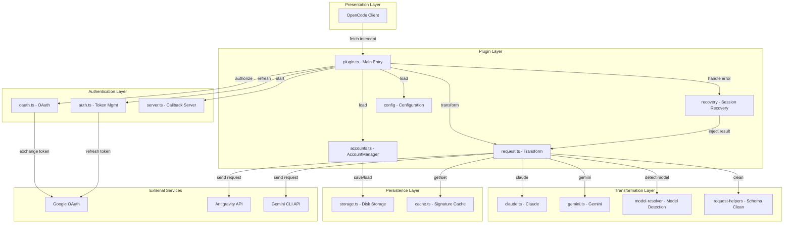
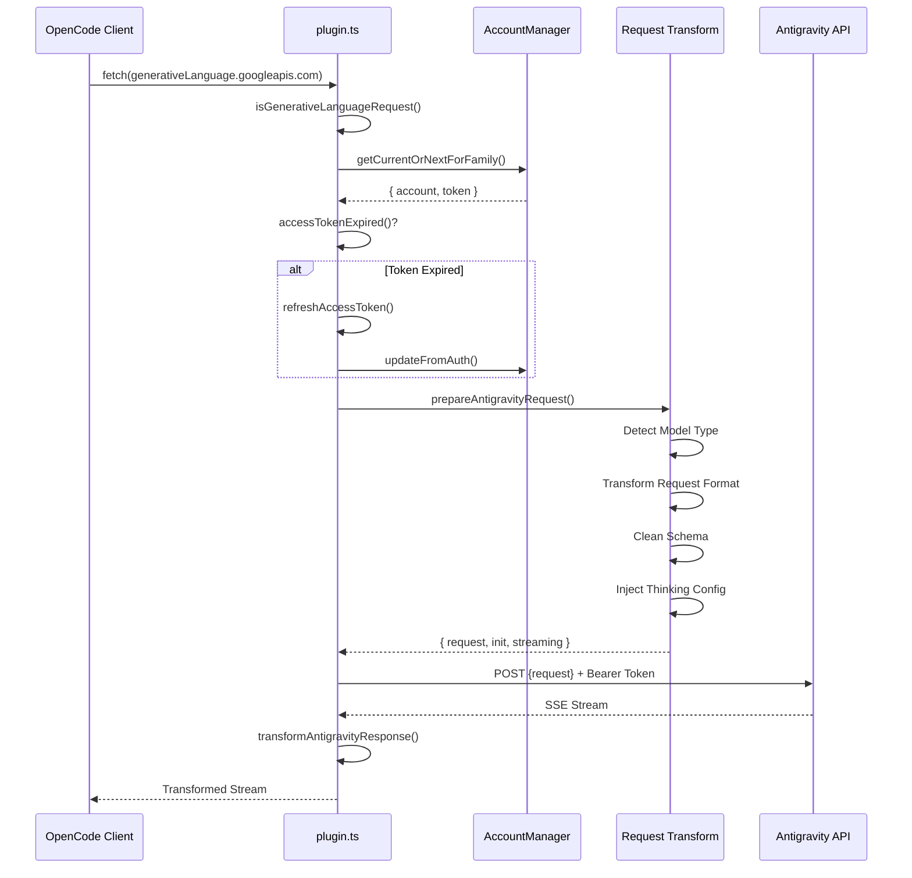
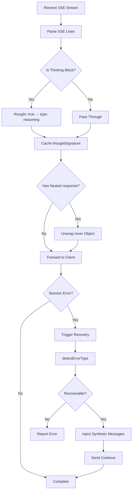

# Plugin Architecture Overview: Understanding the Internal Design of OpenCode Antigravity Auth

## What You'll Learn

This course will guide you through the architecture design and internal working principles of the Antigravity Auth plugin. After completing this course, you will be able to:

- Understand the plugin's module structure and the responsibilities of each module
- Master the complete processing flow of requests from OpenCode to Antigravity API
- Learn about the load balancing mechanism for multi-account management
- Understand the working principles of session recovery
- Master the technical details of request format transformation

## Core Value of the Plugin

The core role of the Antigravity Auth plugin is to build a "translation bridge" between OpenCode and Antigravity API:

1. **Protocol Transformation** - Convert OpenCode request formats to formats required by Antigravity API
2. **Authentication Management** - Securely obtain and refresh access tokens through Google OAuth 2.0 PKCE
3. **Load Balancing** - Pool multiple accounts with automatic rotation to avoid rate limits
4. **Error Recovery** - Automatically detect and repair session interruption issues

::: info Why Understand the Architecture?
Understanding the plugin architecture helps you:
- Quickly locate the module where a problem occurs
- Understand the scope of configuration options
- Optimize multi-account usage strategies
- Participate in plugin development and debugging
:::

## Module Structure Overview

The plugin adopts a layered architecture with clear responsibilities for each module:



### Module Responsibilities

| Module | File | Responsibilities |
|--- | --- | ---|
| **Main Entry** | `plugin.ts` | Fetch interceptor, plugin initialization, event handling |
| **Account Management** | `accounts.ts` | Multi-account pool, load balancing strategy, rate limit tracking |
| **Request Transformation** | `request.ts` | Request format transformation, response streaming |
| **Model Transformation** | `transform/` | Claude/Gemini-specific transformation logic |
| **OAuth Authentication** | `antigravity/oauth.ts` | PKCE authentication flow, token exchange |
| **Session Recovery** | `recovery/` | Error detection, automatic repair of interrupted sessions |
| **Configuration Management** | `config/` | Configuration loading, Schema validation |
| **Storage Layer** | `storage.ts` | Account persistence (JSON file) |
| **Cache Layer** | `cache.ts` | Signature caching, reduce redundant computation |
| **Debug Logging** | `debug.ts` | Structured logging, troubleshooting |
## Request Processing Flow

When a model request is sent from OpenCode, the plugin goes through a complete processing chain:



### Step Details

**Step 1: Request Interception**
- The plugin captures all requests to `generativelanguage.googleapis.com` through the `fetch` interceptor
- Uses `isGenerativeLanguageRequest()` to determine if it's an Antigravity-related request
- Non-target requests are passed through directly to avoid affecting other functionality

**Step 2: Account Selection**
- Selects an available account from the account pool (based on configured strategy: sticky/round-robin/hybrid)
- Checks if the token is expired, and automatically refreshes if so
- Applies PID offset (if enabled) to ensure even account distribution in multi-agent scenarios

**Step 3: Request Transformation** (`request.ts`)
- **Model Detection**: Identify whether it's a Claude or Gemini model
- **Thinking Handling**:
  - Claude: Strip all historical thinking blocks to avoid signature conflicts
  - Gemini: Add `thinkingConfig` configuration
- **Tool Transformation**: Convert OpenCode tools to `functionDeclarations` format
- **Schema Cleaning**: Remove unsupported JSON Schema fields (`const`, `$ref`, `$defs`, etc.)
- **Request Wrapping**: Encapsulate as `{ project, model, request: {...} }` format

**Step 4: Send Request**
- Add Antigravity-specific headers (User-Agent, Client-Metadata)
- Use Bearer Token authentication
- Support endpoint fallback (daily → autopush → prod)

**Step 5: Response Transformation**
- SSE streaming reception, line-by-line transformation
- Convert `thought: true` to `type: "reasoning"`
- Cache thinking signature for subsequent requests
- Unwrap inner `response` object to maintain format consistency
## Response Processing Flow

Response processing mainly involves streaming transformation and session recovery:



### Key Processing Mechanisms

**1. Thinking Block Transformation**

The thinking block format returned by Antigravity API is:
```json
{ "thought": true, "text": "thinking content" }
```

The plugin transforms it to OpenCode-compatible format:
```json
{ "type": "reasoning", "reasoning": "thinking content" }
```

**2. Signature Caching**

Claude and Gemini 3 models require matching thinking block signatures in multi-turn conversations:
- Extract `thoughtSignature` from response
- Store to memory and disk using `cacheSignature()`
- Retrieve and inject via `getCachedSignature()` in next request

::: tip Why Need Signature Caching?
Claude and Gemini 3 APIs require thinking blocks before tool calls to have correct signatures. Caching signatures can:
- Avoid request failures caused by signature errors
- Reduce redundant generation of identical thinking content
- Improve continuity of multi-turn conversations
:::

**3. Session Recovery**

When a session error is detected:
1. Capture error through `session.error` event
2. Call `detectErrorType()` to determine if recoverable
3. For `tool_result_missing` error:
   - Extract failed `tool_use` IDs
   - Inject synthetic `tool_result` messages
   - Automatically send "continue" (if enabled)
4. For thinking block order errors:
   - Analyze conversation state
   - Close damaged turn
   - Start new turn for model to regenerate
## Core Mechanisms

### OAuth Authentication Mechanism

The plugin uses OAuth 2.0 with PKCE (Proof Key for Code Exchange) flow:

```mermaid
flowchart LR
    A[User runs opencode auth login] --> B[Generate PKCE Key Pair]
    B --> C[Build Authorization URL]
    C --> D[Start Local Server]
    D --> E[Open Browser Authorization Page]
    E --> F[User Authorizes]
    F --> G[Receive Callback Code]
    G --> H[Exchange Access Token]
    H --> I[Get Project ID]
    I --> J[Store to antigravity-accounts.json]
```



**PKCE Security**:
- Generate random `code_verifier` and `code_challenge`
- Authorization URL contains `code_challenge` to prevent man-in-the-middle attacks
- Verify `code_verifier` during token exchange to ensure request comes from same client

**Token Management**:
- Access Token: Default 1-hour expiration, automatically refresh 30 minutes before expiration
- Refresh Token: Long-term valid, used to obtain new Access Token
- Persisted to `~/.config/opencode/antigravity-accounts.json`

### Multi-Account Management Mechanism

Multi-account management is one of the core features of the plugin, consisting of the following key components:

**1. Account Pool Structure**

```typescript
interface AccountPool {
  version: 3;
  accounts: Account[];
  activeIndex: number;
  activeIndexByFamily: {
    claude: number;
    gemini: number;
  };
}
```

**2. Account Selection Strategy**

| Strategy | Description | Use Case |
|--- | --- | ---|
| **sticky** | Keep current account until rate limit | Single session use, preserve prompt cache |
| **round-robin** | Rotate to next account per request | Multi-session parallel, maximize throughput |
| **hybrid** | Health score + Token bucket + LRU combined decision | Default strategy, balance performance and reliability |

**3. Rate Limit Tracking**

Each account tracks independently by model family:
- `claude`: Claude model quota
- `gemini-antigravity`: Gemini Antigravity quota
- `gemini-cli`: Gemini CLI quota

Rate limit status includes:
- `rateLimitResetTimes`: Reset times for each quota
- `cooldownEndAt`: Account cooldown end time
- `consecutiveFailures`: Number of consecutive failures

**4. Dual Quota Pool (Gemini-Specific)**

Gemini models support two independent quota pools:
- **Antigravity Quota**: Daily sandbox environment
- **Gemini CLI Quota**: Production environment

Through `quota_fallback` configuration:
- Prioritize primary quota (determined by model suffix)
- Try fallback quota when primary quota is exhausted
- Switch to next account when both pools are exhausted

**5. PID Offset Optimization**

When `pid_offset_enabled` is enabled:
- Agents from different processes (PIDs) start from different accounts
- Avoid all agents competing for the same account
- Suitable for multi-agent parallel scenarios
### Request Transformation Mechanism

Request transformation is the most complex part of the plugin, handling protocol differences between different models:

**Claude Model Transformation Key Points**:

1. **Thinking Block Handling**
   ```typescript
   // Strip all historical thinking blocks (avoid signature conflicts)
   const filteredContents = deepFilterThinkingBlocks(contents);

   // Build new thinkingConfig
   const thinkingConfig = {
     budgetTokens: variantThinkingConfig?.budget || DEFAULT_THINKING_BUDGET,
   };
   ```

2. **Tool Schema Cleaning**
   - Whitelist retain: `type`, `properties`, `required`, `description`, `enum`, `items`
   - Remove fields: `const`, `$ref`, `$defs`, `default`, `examples`, `additionalProperties`, `$schema`, `title`
   - Special transformation: `const: "value"` → `enum: ["value"]`

3. **Tool Injection Parameter Signature**
   ```typescript
   injectParameterSignatures(tool, signature) {
     tool.description += `\n\nParameters: ${signature}`;
   }
   ```

**Gemini Model Transformation Key Points**:

1. **Thinking Configuration**
   ```typescript
   // Gemini 3 Pro/Flash
   if (isGemini3Model(model)) {
     request.thinkingConfig = {
       thinkingLevel: "high" | "medium" | "low" | "minimal",
     };
   }

   // Gemini 2.5
   else if (isGemini2Model(model)) {
     request.thinkingConfig = {
       thinkingLevel: "high" | "medium" | "low",
     };
   }
   ```

2. **Google Search Grounding**
   ```typescript
   if (webSearchConfig) {
     request.generationConfig = {
       ...request.generationConfig,
       dynamicRetrievalConfig: {
         mode: webSearchConfig.mode, // "auto" | "off"
         dynamicRetrievalConfig: {
           scoreThreshold: webSearchConfig.threshold, // 0.0 - 1.0
         },
       },
     };
   }
   ```

3. **Image Generation Configuration**
   ```typescript
   if (isImageGenerationModel(model)) {
     request.generationConfig = {
       ...request.generationConfig,
       responseModalities: ["IMAGE", "TEXT"],
     };
   }
   ```

### Session Recovery Mechanism

The session recovery mechanism ensures conversations can continue after unexpected interruptions:

**1. Error Detection**

```typescript
function detectErrorType(error: unknown): RecoverableError | null {
  if (errorString.includes("tool_use ids were found without tool_result")) {
    return { type: "tool_result_missing" };
  }
  if (errorString.includes("Expected thinking but found text")) {
    return { type: "thinking_order_error" };
  }
  return null;
}
```

**2. Turn Boundary Detection**

```typescript
// Turn boundary = first assistant message after user message
function analyzeConversationState(messages: Message[]): ConversationState {
  const lastUserMessage = findLastMessageByRole(messages, "user");
  const firstAssistantAfterUser = messages.find(m =>
    m.role === "assistant" && m.timestamp > lastUserMessage.timestamp
  );

  return {
    isTurnStart: true,
    turnAssistantMessage: firstAssistantAfterUser,
  };
}
```

**3. Synthetic Message Injection**

```typescript
// Inject synthetic tool_result
function createSyntheticErrorResponse(toolUseIds: string[]): Message[] {
  return toolUseIds.map(id => ({
    type: "tool_result",
    tool_use_id: id,
    content: "Operation cancelled",
    isSynthetic: true,
  }));
}

// Close damaged turn
function closeToolLoopForThinking(sessionId: string): Message[] {
  return [
    {
      type: "text",
      text: "[Conversation turn closed due to error]",
      isSynthetic: true,
    },
  ];
}
```

**4. Auto-Resume**

When `auto_resume` is enabled, the recovery process automatically sends a continue instruction:
```typescript
await client.session.prompt({
  path: { id: sessionID },
  body: { parts: [{ type: "text", text: config.resume_text }] },
  query: { directory },
});
```
## Summary

This course has provided an in-depth analysis of the Antigravity Auth plugin's architecture design:

**Core Architecture**:
- Layered module design with clear responsibilities
- Plugin layer, authentication layer, transformation layer, and persistence layer each perform their duties
- Use `plugin.ts` as the unified entry point to coordinate all modules

**Request Flow**:
- Interception → Account selection → Token refresh → Request transformation → Send request → Response transformation
- Each step has detailed error handling and retry mechanisms

**Key Mechanisms**:
- **OAuth 2.0 PKCE**: Secure authentication flow
- **Multi-Account Management**: Load balancing, rate limit tracking, dual quota pools
- **Request Transformation**: Protocol compatibility, Schema cleaning, Thinking handling
- **Session Recovery**: Automatic error detection, synthetic message injection, Auto-Resume

Understanding these mechanisms will help you better use and optimize plugin configuration, as well as participate in plugin development and debugging.

## Next Lesson

> In the next lesson, we will learn **[Antigravity API Internal Specification](../api-spec/)**.
>
> You will learn:
> - Request and response formats of Antigravity API
> - Functions and parameters of each endpoint
> - Error code and status code meanings
> - Advanced features and experimental capabilities

---

## Appendix: Source Code Reference

<details>
<summary><strong>Click to expand source code locations</strong></summary>

> Last updated: 2026-01-23

| Feature | File Path | Line Numbers |
|--- | --- | ---|
| Plugin main entry, fetch interceptor | [`src/plugin.ts`](https://github.com/NoeFabris/opencode-antigravity-auth/blob/main/src/plugin.ts) | 654-1334 |
| Account manager, load balancing | [`src/plugin/accounts.ts`](https://github.com/NoeFabris/opencode-antigravity-auth/blob/main/src/plugin/accounts.ts) | 1-715 |
| Request transformation, response streaming | [`src/plugin/request.ts`](https://github.com/NoeFabris/opencode-antigravity-auth/blob/main/src/plugin/request.ts) | 1-1664 |
| Claude model transformation | [`src/plugin/transform/claude.ts`](https://github.com/NoeFabris/opencode-antigravity-auth/blob/main/src/plugin/transform/claude.ts) | Full file |
| Gemini model transformation | [`src/plugin/transform/gemini.ts`](https://github.com/NoeFabris/opencode-antigravity-auth/blob/main/src/plugin/transform/gemini.ts) | Full file |
| Session recovery | [`src/plugin/recovery/index.ts`](https://github.com/NoeFabris/opencode-antigravity-auth/blob/main/src/plugin/recovery/index.ts) | Full file |
| Thinking block recovery | [`src/plugin/recovery/thinking-recovery.ts`](https://github.com/NoeFabris/opencode-antigravity-auth/blob/main/src/plugin/recovery/thinking-recovery.ts) | Full file |
| OAuth authentication | [`src/antigravity/oauth.ts`](https://github.com/NoeFabris/opencode-antigravity-auth/blob/main/src/antigravity/oauth.ts) | 1-271 |
| Token management | [`src/plugin/token.ts`](https://github.com/NoeFabris/opencode-antigravity-auth/blob/main/src/plugin/token.ts) | Full file |
| Configuration Schema | [`src/plugin/config/schema.ts`](https://github.com/NoeFabris/opencode-antigravity-auth/blob/main/src/plugin/config/schema.ts) | 1-373 |
| Account storage | [`src/plugin/storage.ts`](https://github.com/NoeFabris/opencode-antigravity-auth/blob/main/src/plugin/storage.ts) | Full file |
| Signature cache | [`src/plugin/cache.ts`](https://github.com/NoeFabris/opencode-antigravity-auth/blob/main/src/plugin/cache.ts) | Full file |
| Debug logging | [`src/plugin/debug.ts`](https://github.com/NoeFabris/opencode-antigravity-auth/blob/main/src/plugin/debug.ts) | Full file |

**Key Constants**:
- `MAX_OAUTH_ACCOUNTS = 10`: Maximum number of accounts
- `RATE_LIMIT_DEDUP_WINDOW_MS = 2000`: Rate limit deduplication window (2 seconds)
- `RATE_LIMIT_STATE_RESET_MS = 120000`: Rate limit state reset time (2 minutes)
- `FAILURE_COOLDOWN_MS = 30000`: Account cooldown time (30 seconds)

**Key Functions**:
- `createAntigravityPlugin()`: Plugin main entry function
- `prepareAntigravityRequest()`: Request transformation main function
- `transformAntigravityResponse()`: Response streaming transformation function
- `AccountManager.getCurrentOrNextForFamily()`: Account selection function
- `handleSessionRecovery()`: Session recovery handling function
- `refreshAccessToken()`: Token refresh function

</details>
