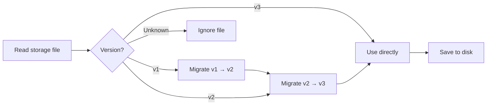

# Account Storage Format and Version Management

## What You'll Learn

- Understand the structure of account storage files and field meanings
- Manually edit storage files (only when necessary)
- Understand version migration mechanism and compatibility
- Migrate account configurations across machines

## Your Current Challenge

You may encounter these situations:

- Want to back up or migrate accounts to another machine
- Manually modify `projectId` or delete invalid accounts
- See version warnings or migration logs and want to understand what happened
- Synchronize account status across multiple machines

## File Location

Account storage files are located at:

| OS | Path |
|--- | ---|
| macOS/Linux | `~/.config/opencode/antigravity-accounts.json` |
| Windows | `%APPDATA%\opencode\antigravity-accounts.json` |

::: warning Security Alert
This file contains **OAuth refresh tokens**, equivalent to password files. Do not share with others or commit to Git repositories.
:::

## Storage Format Versions

The storage format has version control, currently at **v3**. The plugin automatically handles version migration without manual intervention.

### v3 Format (Current Version)

```json
{
  "version": 3,
  "accounts": [
    {
      "email": "user1@gmail.com",
      "refreshToken": "1//0abc...",
      "projectId": "my-gcp-project",
      "managedProjectId": "managed-project-123",
      "addedAt": 1737600000000,
      "lastUsed": 1737603600000,
      "lastSwitchReason": "initial",
      "rateLimitResetTimes": {
        "claude": 1737607200000,
        "gemini-antigravity": 1737607200000,
        "gemini-cli": 1737607200000
      },
      "coolingDownUntil": 1737600000000,
      "cooldownReason": "auth-failure"
    }
  ],
  "activeIndex": 0,
  "activeIndexByFamily": {
    "claude": 0,
    "gemini": 0
  }
}
```

**Field Description**:

| Field | Type | Required | Description |
|--- | --- | --- | ---|
| `version` | number | Y | Storage format version (fixed at 3) |
| `accounts` | array | Y | Account list |
| `activeIndex` | number | Y | Current active account index (starting from 0) |
| `activeIndexByFamily` | object | N | Track active accounts by model family (`claude`/`gemini`) |

**Account Object Fields**:

| Field | Type | Required | Description |
|--- | --- | --- | ---|
| `email` | string | N | Google account email |
| `refreshToken` | string | Y | OAuth refresh token (unique identifier) |
| `projectId` | string | N | GCP project ID (required for Gemini CLI models) |
| `managedProjectId` | string | N | Managed project ID |
| `addedAt` | number | Y | Add timestamp (Unix milliseconds) |
| `lastUsed` | number | Y | Last used timestamp |
| `lastSwitchReason` | string | N | Switch reason: `"rate-limit"` / `"initial"` / `"rotation"` |
| `rateLimitResetTimes` | object | N | Rate limit reset times (tracked separately by quota pool) |
| `coolingDownUntil` | number | N | Account cooldown end timestamp |
| `cooldownReason` | string | N | Cooldown reason: `"auth-failure"` / `"network-error"` / `"project-error"` |

### v2 Format (Legacy Version)

v2 format is similar to v3, but with the following differences:

- `rateLimitResetTimes` only has `claude` and `gemini` fields
- No `coolingDownUntil` and `cooldownReason`
- No `activeIndexByFamily` (all models share one active account)

During migration, the `gemini` field is mapped to `gemini-antigravity`, and the `gemini-cli` quota pool is initialized as empty.

### v1 Format (Legacy Version)

v1 format uses boolean flags and a single timestamp:

```json
{
  "version": 1,
  "accounts": [
    {
      "email": "user1@gmail.com",
      "refreshToken": "1//0abc...",
      "isRateLimited": true,
      "rateLimitResetTime": 1737607200000
    }
  ],
  "activeIndex": 0
}
```

During migration, if `isRateLimited` is `true` and `rateLimitResetTime` has not expired, both `claude` and `gemini` reset times are set.

## Version Migration Mechanism

The plugin automatically detects the version and performs migration when loading the storage file:



**Migration Rules**:

1. **Automatic migration**: After migration, the new format is automatically saved to disk
2. **Data preservation**: Unexpired rate limit states are preserved
3. **Failure fallback**: If saving fails, continue using migrated data in memory
4. **Forward compatibility**: New version plugins can read old format files

## Storage Mechanism Details

### File Locking

Uses `proper-lockfile` to ensure safe multi-process access:

- **Locking mechanism**: Creates lock file when writing (`.antigravity-accounts.json.lock`)
- **Timeout setting**: Lock file expires after 10 seconds (prevents deadlocks)
- **Retry strategy**: Retry up to 5 times, backoff time 100ms → 1000ms
- **Atomic write**: Write to temporary file (`.tmp`) first, then rename to target file

### Account Merging

When multiple processes write to the storage file simultaneously, a merge strategy is executed:

```typescript
// Merge logic
function mergeAccountStorage(existing, incoming) {
  // Merge accounts using refreshToken as key
  // Preserve manually configured projectId/managedProjectId
  // Merge rateLimitResetTimes
  // Preserve larger lastUsed
}
```

### Deduplication Mechanism

Deduplication based on `email`, keeping the latest account for each email (by `lastUsed`, then by `addedAt`):

```typescript
// Deduplication rules
1. Accounts without email → Keep (cannot deduplicate)
2. Accounts with same email → Keep the one with largest lastUsed
3. Same lastUsed → Keep the one with largest addedAt
```

## Manual Editing Guide

::: danger Manual Editing Risk
When editing the storage file, the plugin process should not be running, otherwise changes may be overwritten. It's recommended to stop OpenCode before editing.
:::

### Adding Accounts

When manually adding accounts, at minimum provide `refreshToken`:

```json
{
  "accounts": [
    {
      "refreshToken": "Copy from another machine or get from OAuth flow",
      "email": "user@example.com",
      "addedAt": Date.now(),
      "lastUsed": Date.now()
    }
  ]
}
```

### Deleting Accounts

Remove the corresponding entry from the `accounts` array, then adjust `activeIndex`:

```json
{
  "accounts": [
    { "email": "user1@gmail.com", "refreshToken": "..." },  // Keep
    // { "email": "user2@gmail.com", "refreshToken": "..." },  // Delete
    { "email": "user3@gmail.com", "refreshToken": "..." }   // Keep
  ],
  "activeIndex": 0  // Ensure index is within valid range
}
```

### Modifying projectId

Add or modify `projectId` for an account:

```json
{
  "accounts": [
    {
      "email": "user@gmail.com",
      "refreshToken": "1//0abc...",
      "projectId": "your-gcp-project-id"  // Add or modify
    }
  ]
}
```

### Clearing Rate Limit Status

Manually clear rate limit flags:

```json
{
  "accounts": [
    {
      "email": "user@gmail.com",
      "refreshToken": "1//0abc...",
      "rateLimitResetTimes": {}  // Clear or delete this field
    }
  ]
}
```

## Cross-Machine Migration

### Simple Migration

Directly copy the storage file to the target machine's configuration directory:

```bash
# macOS/Linux
cp ~/.config/opencode/antigravity-accounts.json /path/to/backup/

# Windows
copy %APPDATA%\opencode\antigravity-accounts.json backup\
```

### Merging Accounts

If the target machine already has accounts, the plugin will automatically merge (deduplicate based on `refreshToken`).

**Manual Merge Steps**:

1. Backup storage files on both machines
2. Open both files, copy target account array to source file
3. Adjust `activeIndex` and `activeIndexByFamily`
4. Save and restart the plugin

## Common Questions

### What to Do if Migration Fails?

If migration fails, the plugin will log a warning:

```
Failed to persist migrated storage: { error: "..." }
```

**Solutions**:

1. Check file permissions
2. Confirm sufficient disk space
3. Backup the old file manually, delete it, and re-add accounts

### Version Incompatibility Error

If you see an "Unknown storage version" error:

```json
{
  "version": 99  // Unknown version
}
```

**Solutions**:

1. Backup the current file
2. Manually change `version` to `2` or `3`
3. Restart the plugin to trigger migration
4. If migration fails, delete the file and re-add accounts

### Account Deduplication Loss

If you find duplicate accounts have been deleted:

**Cause**: The plugin deduplicates based on `email`, keeping the most recently used account.

**Solution**: If you need to keep two accounts with the same email (rare scenario), manually edit the file to ensure the `email` field is empty or different.

## Lesson Summary

- Storage file location: `~/.config/opencode/antigravity-accounts.json`
- Current version: v3, supports dual quota pools and cooldown mechanism
- Automatic migration: v1/v2 automatically upgrade to v3
- File locking: Uses `proper-lockfile` to ensure concurrency safety
- Manual editing: Recommended to stop the plugin before editing to avoid being overwritten

## Coming Up Next

> In the next lesson, we'll learn **[All Configuration Options](../all-config-options/)**.
>
> You'll learn:
> - Complete list of configuration options
> - Default values and scope for each option
> - Advanced configuration techniques

---

## Appendix: Source Code Reference

<details>
<summary><strong>Click to expand source code locations</strong></summary>

> Last updated: 2026-01-23

| Feature | File Path | Line Numbers |
|--- | --- | ---|
| Storage format definition | [`src/plugin/storage.ts`](https://github.com/NoeFabris/opencode-antigravity-auth/blob/main/src/plugin/storage.ts) | 128-198 |
| v1 → v2 migration | [`src/plugin/storage.ts`](https://github.com/NoeFabris/opencode-antigravity-auth/blob/main/src/plugin/storage.ts) | 366-395 |
| v2 → v3 migration | [`src/plugin/storage.ts`](https://github.com/NoeFabris/opencode-antigravity-auth/blob/main/src/plugin/storage.ts) | 397-431 |
| Load accounts | [`src/plugin/storage.ts`](https://github.com/NoeFabris/opencode-antigravity-auth/blob/main/src/plugin/storage.ts) | 433-518 |
| Save accounts | [`src/plugin/storage.ts`](https://github.com/NoeFabris/opencode-antigravity-auth/blob/main/src/plugin/storage.ts) | 520-536 |
| File locking mechanism | [`src/plugin/storage.ts`](https://github.com/NoeFabris/opencode-antigravity-auth/blob/main/src/plugin/storage.ts) | 219-257 |
| Account merging | [`src/plugin/storage.ts`](https://github.com/NoeFabris/opencode-antigravity-auth/blob/main/src/plugin/storage.ts) | 259-299 |
| Deduplication mechanism | [`src/plugin/storage.ts`](https://github.com/NoeFabris/opencode-antigravity-auth/blob/main/src/plugin/storage.ts) | 301-364 |

**Key Type Definitions**:

- `AccountStorageV1`: v1 storage format
- `AccountStorageV2`: v2 storage format
- `AccountStorageV3`: v3 storage format (current)
- `RateLimitStateV3`: v3 rate limit state (supports multiple quota pools)

**Key Functions**:

- `loadAccounts()`: Load accounts and perform migration
- `saveAccounts()`: Save accounts (with file locking and merging)
- `migrateV1ToV2()`: v1 → v2 migration
- `migrateV2ToV3()`: v2 → v3 migration
- `mergeAccountStorage()`: Merge two storage objects
- `deduplicateAccountsByEmail()`: Deduplicate by email

</details>
