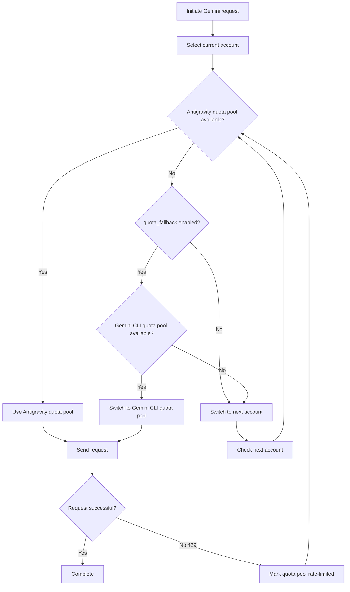

# Dual Quota System: Understanding Antigravity and Gemini CLI Quota Pools

## What You'll Learn

- Understand how each account has two independent Gemini quota pools
- Enable automatic fallback between Antigravity and Gemini CLI quota pools
- Explicitly specify which quota pool to use for a model
- Maximize your quota utilization through the dual quota system

---

## Your Current Challenge

You're using the Antigravity Auth plugin to call Gemini models, frequently encountering quota limits, but might not understand the **dual quota system**:

- After one request is rate-limited, you need to wait for quota reset to continue
- Although you've configured multiple accounts, each account's Gemini quota still isn't enough
- You're unsure why some models can make requests while others frequently get 429 errors

**Core Pain Point**: You might think each account has only one Gemini quota pool, but in reality each account has **two independent** quota pools. With proper configuration, you can double your Gemini quota.

---

## Core Concept

### What is the Dual Quota System?

The **dual quota system** is a mechanism where the Antigravity Auth plugin maintains two independent Gemini quota pools for each account. Antigravity and Gemini CLI quota pools track rate limiting status independently, and when Antigravity is rate-limited, you can switch to the CLI quota pool, effectively doubling your quota.

The Antigravity Auth plugin maintains **two independent Gemini quota pools** for each Google account:

| Quota Pool | Type | Priority | Reset Rule |
|--- | --- | --- | ---|
| **Antigravity** | Primary quota pool | Use first | Dynamically calculated based on reset time returned by server |
| **Gemini CLI** | Backup quota pool | fallback use | Dynamically calculated based on reset time returned by server |

Each quota pool's rate limit status is tracked independently, without mutual interference. This means:

- When the Antigravity quota pool is rate-limited, if the Gemini CLI quota pool is still available, it can automatically switch
- This is equivalent to doubling each account's Gemini quota

### Explicit Specification vs Automatic Fallback

There are two ways to use the dual quota system:

1. **Explicit specification**: Add `:antigravity` or `:gemini-cli` suffix to the model name to force using a specific quota pool
2. **Automatic fallback**: Enable `quota_fallback` configuration to let the plugin automatically switch between the two quota pools

**Default behavior**: Automatic fallback is disabled, using only the Antigravity quota pool

---

## Follow Along

### Step 1: Enable Automatic Fallback

Open your `~/.config/opencode/antigravity.json` configuration file:

```bash
cat ~/.config/opencode/antigravity.json
```

Add or modify the `quota_fallback` configuration:

```json
{
  "quota_fallback": true
}
```

**Why**: By default `quota_fallback` is `false`, and the plugin only uses the Antigravity quota pool. After enabling this, when Antigravity is rate-limited, it will automatically try the Gemini CLI quota pool.

You should see the configuration file updated.

---

### Step 2: Observe Automatic Fallback Behavior

Initiate a Gemini model request (for example, using Gemini 3 Flash):

```bash
opencode run "Explain quantum computing" --model=google/antigravity-gemini-3-flash
```

If the Antigravity quota pool is rate-limited, you'll see the following automatic fallback behavior:

```
[Toast notification] Antigravity quota exhausted, using Gemini CLI quota
```

The plugin will:

1. Detect that the Antigravity quota pool is rate-limited (429 response)
2. Attempt to switch to the Gemini CLI quota pool (if not rate-limited)
3. Resend the request using the new quota pool
4. Display a toast notification to inform you of the switch

**Why**: This is the core logic of automatic fallback—switching between the two quota pools of the same account, rather than immediately switching to the next account.

You should see the request complete successfully, rather than failing due to quota limits.

---

### Step 3: Explicitly Specify Quota Pool

If you want to force using a specific quota pool, you can add a suffix to the model name:

**Use Antigravity quota pool** (via `antigravity-` prefix):

```bash
opencode run "Explain quantum computing" --model=google/antigravity-gemini-3-flash
```

**Use Gemini CLI quota pool** (without `antigravity-` prefix):

```bash
opencode run "Explain quantum computing" --model=google/gemini-3-flash-preview
```

**Why**: Through the `antigravity-` prefix, you can explicitly specify using the Antigravity quota pool; without the prefix, the Gemini CLI quota pool is used. At this point, the plugin will ignore the `quota_fallback` configuration. If the specified quota pool is rate-limited, it will immediately switch to the next account, rather than trying the other quota pool.

You should see the request routed to the specified quota pool.

---

### Step 4: View Quota Status (Debug Mode)

If you want to view the rate limit status of each quota pool, enable debug mode:

Edit `~/.config/opencode/antigravity.json`:

```json
{
  "quota_fallback": true,
  "debug": true
}
```

After making a request, check the log file:

```bash
tail -f ~/.config/opencode/antigravity-logs/*.log
```

You'll see similar logs:

```
[DEBUG] headerStyle=antigravity explicit=false
[DEBUG] quota fallback: gemini-cli
[INFO] rate-limit triggered for account 0, family gemini, quota: gemini-antigravity
```

**Why**: Debug logs let you clearly see which quota pool the plugin selected and when fallback was triggered. This is very helpful for troubleshooting quota issues.

You should see detailed quota switching logs.

---

## Checkpoint ✅

### Verify Automatic Fallback is Enabled

```bash
cat ~/.config/opencode/antigravity.json | grep quota_fallback
```

You should see:

```json
"quota_fallback": true
```

### Verify Explicit Specification Suffix

Try using a model name with a suffix to confirm no errors:

```bash
opencode run "Test" --model=google/antigravity-gemini-3-flash:gemini-cli
```

You should see the request complete successfully.

### Verify Debug Logs

```bash
ls -la ~/.config/opencode/antigravity-logs/
```

You should see the log file exists and contains quota switching related information.

---

## Common Pitfalls

### Pitfall 1: Explicit Suffix Doesn't Fallback

**Issue**: You added `:antigravity` or `:gemini-cli` suffix to the model name, but `quota_fallback` doesn't seem to work.

**Cause**: When explicitly specifying a suffix, the plugin ignores the `quota_fallback` configuration and forces using the specified quota pool. If that quota pool is rate-limited, it will immediately switch to the next account, rather than trying the other quota pool.

**Solution**:
- If you want to use automatic fallback, don't add a suffix to the model name
- If you want to force using a specific quota pool, add the suffix

### Pitfall 2: Claude Models Don't Have Dual Quota System

**Issue**: You enabled `quota_fallback`, but Claude models don't seem to have fallback behavior.

**Cause**: The dual quota system **only applies to Gemini models**. Claude models only use the Antigravity quota pool and don't have a Gemini CLI quota pool.

**Solution**:
- Claude models don't need dual quota system configuration
- Only multi-account rotation can improve Claude quota

### Pitfall 3: Debug Logs Too Many Affect Performance

**Issue**: You enabled `debug: true`, but log files grow too fast.

**Cause**: Debug mode logs all request details, including quota switching, account selection, etc.

**Solution**:
- After debugging, disable the `debug` configuration
- Or periodically clean up log files: `rm ~/.config/opencode/antigravity-logs/*.log`

---

## Dual Quota System Workflow Diagram

The following is the automatic fallback workflow:



---

## Independent Tracking Mechanism of Dual Quota Pools

### Quota Key Definition

The plugin uses the following quota keys to track rate limiting (source code: `accounts.ts:77`):

| Quota Key | Meaning |
|--- | ---|
| `claude` | Claude model quota |
| `gemini-antigravity` | Gemini Antigravity quota pool |
| `gemini-cli` | Gemini CLI quota pool |

Each account's `rateLimitResetTimes` object stores the reset timestamps for these quota keys:

```json
{
  "rateLimitResetTimes": {
    "claude": 1234567890,
    "gemini-antigravity": 1234567890,
    "gemini-cli": 1234567890
  }
}
```

### Available Quota Pool Check

When selecting a quota pool, the plugin checks in the following order (source code: `accounts.ts:545-557`):

1. **Antigravity quota pool**: If not rate-limited, use directly
2. **Gemini CLI quota pool**: If Antigravity is rate-limited and this pool is available, use this pool
3. **Return null**: Both pools are rate-limited, trigger account switching

---

## Trigger Conditions for Quota Pool Switching

Automatic fallback triggers when the following conditions are met:

| Condition | Description | Source Location |
|--- | --- | ---|
| `quota_fallback = true` | Automatic fallback enabled in configuration | `config/schema.ts:234` |
| Current account's Antigravity quota pool rate-limited | Received 429 response | `plugin.ts:1149` |
| Model doesn't explicitly specify quota pool | Model name doesn't contain `:antigravity` or `:gemini-cli` suffix | `plugin.ts:1151` |
| Current account's Gemini CLI quota pool available | Not rate-limited | `accounts.ts:553` |

If any condition is not met, the plugin will directly switch to the next account rather than attempting fallback.

---

## Lesson Summary

In this lesson, we learned the dual quota system of the Antigravity Auth plugin:

- **Dual quota pools**: Each account has two independent Gemini quota pools (Antigravity and Gemini CLI)
- **Automatic fallback**: After enabling `quota_fallback`, when Antigravity is rate-limited, automatically try the Gemini CLI quota pool
- **Explicit specification**: Use `:antigravity` or `:gemini-cli` suffix to force using a specific quota pool
- **Independent tracking**: Each quota pool's rate limit status is stored and checked independently
- **Gemini only**: The dual quota system only applies to Gemini models; Claude models only have the Antigravity quota pool

By properly using the dual quota system, you can double each account's Gemini quota and reduce request failures due to quota limits.

---

## Next Lesson Preview

> In the next lesson, we'll learn **[Multi-Account Setup: Configure Load Balancing to Boost Quota](../../advanced/multi-account-setup/)**.
>
> You'll learn:
> - How to add multiple Google accounts
> - Best practices for configuring different account selection strategies
> - Quota pool usage techniques in multi-account scenarios

---

## Appendix: Source Code Reference

<details>
<summary><strong>Click to expand source code locations</strong></summary>

> Last updated: 2026-01-23

| Function | File Path | Line Numbers |
|--- | --- | ---|
| Quota key definition (BaseQuotaKey) | [`src/plugin/accounts.ts`](https://github.com/NoeFabris/opencode-antigravity-auth/blob/main/src/plugin/accounts.ts#L77-L78) | 77-78 |
| Get quota key (getQuotaKey) | [`src/plugin/accounts.ts`](https://github.com/NoeFabris/opencode-antigravity-auth/blob/main/src/plugin/accounts.ts#L107-L116) | 107-116 |
| Check quota pool rate limit status | [`src/plugin/accounts.ts`](https://github.com/NoeFabris/opencode-antigravity-auth/blob/main/src/plugin/accounts.ts#L134-L152) | 134-152 |
| Get available quota pool | [`src/plugin/accounts.ts`](https://github.com/NoeFabris/opencode-antigravity-auth/blob/main/src/plugin/accounts.ts#L545-L557) | 545-557 |
| quota_fallback configuration definition | [`src/plugin/config/schema.ts`](https://github.com/NoeFabris/opencode-antigravity-auth/blob/main/src/plugin/config/schema.ts#L224-L234) | 224-234 |
| Automatic fallback logic | [`src/plugin/plugin.ts`](https://github.com/NoeFabris/opencode-antigravity-auth/blob/main/src/plugin/plugin.ts#L1151-L1163) | 1151-1163 |
| Dual quota system documentation | [`docs/MULTI-ACCOUNT.md`](https://github.com/NoeFabris/opencode-antigravity-auth/blob/main/docs/MULTI-ACCOUNT.md#L21-L31) | 21-31 |

**Key Constants**:
- `BaseQuotaKey = "claude" | "gemini-antigravity" | "gemini-cli"`: Quota key type definition

**Key Functions**:
- `getAvailableHeaderStyle()`: Returns available quota pool based on current account's quota pool status
- `isRateLimitedForHeaderStyle()`: Checks if specified quota pool is rate-limited
- `getQuotaKey()`: Generates quota key based on model family and headerStyle

</details>
