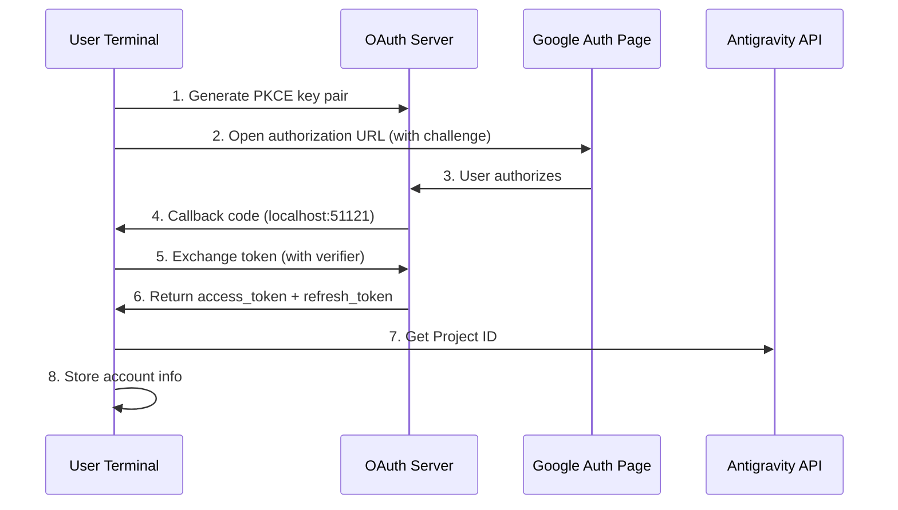

# OAuth 2.0 PKCE Authentication: Complete First Login

## What You'll Learn

- Understand the security mechanisms of OAuth 2.0 PKCE authentication flow
- Complete first-time plugin login and obtain Antigravity API access
- Understand automatic Project ID retrieval and storage mechanism
- Learn about automated token refresh handling

## Your Current Challenge

You've installed the plugin and configured model definitions, but haven't actually used it yet. Every time you run `opencode run`, it prompts "authentication required," but you're unsure:

- What is OAuth? Why use such a complex authentication method?
- What happens during the authentication process? Is it secure?
- What preparation is needed for the first login? What options are available?
- What should I do if the token expires? Do I need to log in again?

## When to Use This

- **After first plugin installation**: Authentication must be completed before first use
- **When adding new accounts**: Configuring multi-account rotation requires individual authentication
- **After token invalidation**: If account is revoked or password changed, re-authentication is required
- **When switching to new device**: Account migration requires re-login on new device

## 🎒 Prerequisites

::: warning Prerequisites Check

Please confirm the following steps are completed:

1. **Plugin installed**: Refer to [Quick Install](/NoeFabris/opencode-antigravity-auth/start/quick-install/)
2. **Models configured**: Model definitions have been added to `~/.config/opencode/opencode.json`
3. **Available Google account**: Use an established trusted account, avoid newly created accounts

:::

## Core Approach

### What is OAuth 2.0 PKCE?

**OAuth 2.0** (Open Authorization 2.0) is an authorization protocol that allows third-party applications (this plugin) to obtain access to Google APIs without directly acquiring user passwords.

**PKCE** (Proof Key for Code Exchange) is a security extension of OAuth 2.0, designed for public clients (like CLI tools). It prevents authorization code interception attacks through the following mechanism:

```
┌─────────────────────────────────────────────────────────────────┐
│  PKCE Protection Mechanism                                    │
├─────────────────────────────────────────────────────────────────┤
│  1. Client generates a key pair:                            │
│     - code_verifier (random string, kept secret)             │
│     - code_challenge (hash of verifier, public)              │
│  2. Authorization URL includes code_challenge                │
│  3. Callback server receives code, then verifies with verifier│
│  4. Attacker cannot exchange token without verifier even if  │
│     code is intercepted                                      │
└─────────────────────────────────────────────────────────────────┘
```

::: info

**PKCE vs Traditional OAuth**

Traditional OAuth uses `client_secret` to verify identity, but this requires the client to securely store the secret key. CLI tools cannot achieve this, so PKCE uses dynamically generated `verifier` instead of static keys—equally secure without relying on pre-stored secrets.

:::

### Authentication Flow Overview



## Follow Along

### Step 1: Start OAuth Login

**Why**

The `opencode auth login` command starts a local OAuth server, generates an authorization URL, and waits for Google's callback.

**Execute command**:

```bash
opencode auth login
```

**You should see**:

```
🔑 Initializing Antigravity OAuth...
📋 Starting local OAuth server on http://127.0.0.1:51121
🌐 Opening browser for authorization...

If the browser doesn't open, visit this URL manually:
https://accounts.google.com/o/oauth2/v2/auth?client_id=...&code_challenge=...
```

::: tip

**Environment Detection**

The plugin automatically detects the runtime environment:

| Environment | Bind Address | Reason |
|--- | --- | ---|
| Local macOS/Linux/Windows | `127.0.0.1` | Most secure, only accepts local connections |
| WSL / Docker / SSH Remote | `0.0.0.0` | Allows browser access from host machine |

You can override the default setting via the environment variable `OPENCODE_ANTIGRAVITY_OAUTH_BIND`.

:::

### Step 2: Authorize in Browser

**Why**

The Google authorization page displays the permissions (scopes) requested by the plugin, requiring your explicit consent.

**You will see**:

Google OAuth authorization page displaying:
- Requester: Antigravity Auth Plugin
- Requested permissions:
  - View your email address
  - View your profile information
  - Access your Cloud Platform projects
  - Access Google Cloud logs and experiment configuration

**Action**:

1. Confirm that requested permissions meet expectations (no out-of-scope sensitive permissions)
2. Click "Allow" or "Authorize" button
3. Wait for the page to redirect to `http://localhost:51121/oauth-callback`

**You should see**:

```html
<!DOCTYPE html>
<html>
  <!-- ... -->
  <h1>All set!</h1>
  <p>You've successfully authenticated with Antigravity.</p>
  <!-- ... -->
</html>
```

::: warning

**Authorization Page Closing Issue**

If the browser doesn't automatically close after successful authorization, manually close the tab. This is a browser security restriction and doesn't affect authentication results.

:::

### Step 3: Automatic Token Exchange and Project ID Retrieval

**Why**

The authorization code is only a temporary credential that needs to be exchanged for a long-term `refresh_token`, while also obtaining the `Project ID` required by the Antigravity project.

**Automatic background process**:

The plugin will automatically perform the following operations (no intervention required):

1. **Verify PKCE**: Verify authorization code validity with `code_verifier`
2. **Exchange token**: Send POST request to `oauth2.googleapis.com/token`

   ```typescript
   // Source: src/antigravity/oauth.ts:209
   POST https://oauth2.googleapis.com/token
   Content-Type: application/x-www-form-urlencoded

   {
     client_id: "...",
     client_secret: "...",
     code: "authorization_code",
     grant_type: "authorization_code",
     redirect_uri: "http://localhost:51121/oauth-callback",
     code_verifier: "PKCE verifier"
   }
   ```

3. **Get user info**: Verify email address

   ```typescript
   // Source: src/antigravity/oauth.ts:231
   GET https://www.googleapis.com/oauth2/v1/userinfo?alt=json
   Authorization: Bearer {access_token}
   ```

4. **Auto-fetch Project ID**: Attempt to retrieve your project ID from Antigravity API

   ```typescript
   // Source: src/antigravity/oauth.ts:131
   // Try multiple endpoints by priority
   - https://cloudcode-pa.googleapis.com/v1internal:loadCodeAssist (prod)
   - https://daily-cloudcode-pa.sandbox.googleapis.com/v1internal:loadCodeAssist (daily)
   - https://autopush-cloudcode-pa.sandbox.googleapis.com/v1internal:loadCodeAssist (autopush)
   ```

5. **Store account info**: Save to `~/.config/opencode/antigravity-accounts.json`

   ```json
   {
     "version": 3,
     "accounts": [
       {
         "email": "your.email@gmail.com",
         "refreshToken": "1//0g...|rising-fact-p41fc",
         "projectId": "rising-fact-p41fc",
         "addedAt": 1737609600000,
         "lastUsed": 1737609600000
       }
     ]
   }
   ```

::: details

**Purpose of Project ID**

Project ID is the unique identifier for Google Cloud projects, used to determine which project API calls belong to. Antigravity tracks quota usage based on Project ID.

- **Auto-fetch successful**: Use your real Project ID (recommended)
- **Auto-fetch failed**: Use default Project ID (`rising-fact-p41fc`)

:::

**You should see**:

```
✅ Authentication successful
📧 Account: your.email@gmail.com
🆔 Project ID: rising-fact-p41fc
💾 Saved to: ~/.config/opencode/antigravity-accounts.json
```

### Checkpoint ✅

**Verify account is correctly stored**:

```bash
cat ~/.config/opencode/antigravity-accounts.json
```

**Expected output**:

```json
{
  "version": 3,
  "accounts": [
    {
      "email": "your.email@gmail.com",
      "refreshToken": "1//0g...|rising-fact-p41fc",
      "projectId": "rising-fact-p41fc",
      "addedAt": 1737609600000,
      "lastUsed": 1737609600000
    }
  ]
}
```

::: tip

**Account Storage Format**

The `refreshToken` field format is: `{refresh_token}|{project_id}`. This design allows storing both token and project ID in a single field, simplifying storage logic.

:::

## Common Pitfalls

### Issue 1: Port Already in Use

**Error message**:

```
❌ Port 51121 is already in use.
Another process is occupying this port.
```

**Cause**: Another OpenCode process is running, or another program is occupying the port.

**Solutions**:

1. Check and terminate the process occupying the port:

   ```bash
   # macOS/Linux
   lsof -ti:51121 | xargs kill -9

   # Windows
   netstat -ano | findstr :51121
   taskkill /PID <PID> /F
   ```

2. Rerun `opencode auth login`

### Issue 2: Browser Doesn't Open Automatically

**Cause**: In WSL, Docker, or remote environments, `localhost` is not equal to the host machine address.

**Solutions**:

The plugin will automatically detect the environment and display a manual access URL:

```
🌐 Opening browser for authorization...

If the browser doesn't open, visit this URL manually:
https://accounts.google.com/o/oauth2/v2/auth?...
```

Copy the URL and visit it in your host machine's browser.

### Issue 3: Project ID Retrieval Failed

**Warning message**:

```
⚠️ Failed to resolve Antigravity project via loadCodeAssist
Using default project ID: rising-fact-p41fc
```

**Cause**: Under certain enterprise accounts or special permission configurations, the `loadCodeAssist` API cannot be accessed.

**Solutions**:

1. If only using Antigravity models (with `:antigravity` suffix), you can use the default Project ID
2. If you need to use Gemini CLI models (like `gemini-2.5-pro`), manually configure Project ID:

   ```json
   // Edit ~/.config/opencode/antigravity-accounts.json
   {
     "accounts": [
       {
         "email": "your.email@gmail.com",
         "refreshToken": "1//0g...|your-custom-project-id",
         "projectId": "your-custom-project-id"
       }
     ]
   }
   ```

   Steps to get Project ID:
   - Visit [Google Cloud Console](https://console.cloud.google.com/)
   - Create or select a project
   - Enable **Gemini for Google Cloud API**
   - Copy Project ID (format: `rising-fact-p41fc`)

### Issue 4: invalid_grant Error

**Error message**:

```
❌ Token exchange failed: invalid_grant
```

**Causes**:
- Authorization code has expired (usually valid for 10 minutes)
- User revoked app access after authorization
- Account password changed or security event triggered

**Solutions**: Rerun `opencode auth login`

## Token Refresh Mechanism

**Automatic refresh**: You don't need to worry about token expiration.

The plugin will automatically refresh in the following situations:

| Trigger Condition | Action | Source Location |
|--- | --- | ---|
| Token expires in 60 seconds | Auto-refresh | `src/plugin/auth.ts:33` |
| Receive 401 Unauthorized | Attempt refresh | `src/plugin/auth.ts:33` |
| Refresh failed | Prompt user to re-login | `src/plugin.ts:995` |

**Refresh logic**:

```typescript
// Source: src/plugin/auth.ts:33
export function accessTokenExpired(auth: OAuthAuthDetails): boolean {
  // Refresh 60 seconds early (allow for clock skew)
  return auth.expires <= Date.now() + 60 * 1000;
}
```

## Summary

Key points of the OAuth 2.0 PKCE authentication flow:

1. **PKCE security mechanism**: Uses dynamic `verifier` instead of static keys to prevent authorization code interception
2. **Local callback server**: Listens on `localhost:51121` to receive Google authorization callbacks
3. **Token exchange**: Exchanges authorization code for `access_token` and `refresh_token`
4. **Auto Project ID**: Attempts to retrieve from Antigravity API, falls back to default value on failure
5. **Auto refresh**: Automatically refreshes 60 seconds before token expiration, no manual intervention needed
6. **Account storage**: All information saved in `~/.config/opencode/antigravity-accounts.json`

You can now initiate your first model request!

## Next Lesson Preview

> In the next lesson, we'll learn **[First Model Request](/NoeFabris/opencode-antigravity-auth/start/first-request/)**.
>
> You'll learn:
> - How to use `opencode run` to send requests
> - Verify authentication success
> - Understand model variant configuration

---

## Appendix: Source Code Reference

<details>
<summary><strong>Click to expand source code locations</strong></summary>

> Last updated: 2026-01-23

| Feature | File Path | Lines |
|--- | --- | ---|
| PKCE key generation | [`src/antigravity/oauth.ts`](https://github.com/NoeFabris/opencode-antigravity-auth/blob/main/src/antigravity/oauth.ts#L91-L113) | 91-113  |
| Build authorization URL | [`src/antigravity/oauth.ts`](https://github.com/NoeFabris/opencode-antigravity-auth/blob/main/src/antigravity/oauth.ts#L91-L113) | 91-113  |
| Exchange token | [`src/antigravity/oauth.ts`](https://github.com/NoeFabris/opencode-antigravity-auth/blob/main/src/antigravity/oauth.ts#L201-L270) | 201-270 |
| Get user info | [`src/antigravity/oauth.ts`](https://github.com/NoeFabris/opencode-antigravity-auth/blob/main/src/antigravity/oauth.ts#L231-L242) | 231-242 |
|--- | --- | ---|
| Environment detection | [`src/plugin/server.ts`](https://github.com/NoeFabris/opencode-antigravity-auth/blob/main/src/plugin/server.ts#L31-L134) | 31-134  |
| OAuth callback server | [`src/plugin/server.ts`](https://github.com/NoeFabris/opencode-antigravity-auth/blob/main/src/plugin/server.ts#L140-L366) | 140-366 |
| Token expiration check | [`src/plugin/auth.ts`](https://github.com/NoeFabris/opencode-antigravity-auth/blob/main/src/plugin/auth.ts#L33-L38) | 33-38   |
| Calculate token expiration | [`src/plugin/auth.ts`](https://github.com/NoeFabris/opencode-antigravity-auth/blob/main/src/plugin/auth.ts#L45-L52) | 45-52   |

**Key Constants**:
- `ANTIGRAVITY_CLIENT_ID`: OAuth client ID (`constants.ts:4`)
- `ANTIGRAVITY_CLIENT_SECRET`: OAuth client secret (`constants.ts:9`)
- `ANTIGRAVITY_REDIRECT_URI`: OAuth callback address `http://localhost:51121/oauth-callback` (`constants.ts:25`)
- `ANTIGRAVITY_SCOPES`: List of requested permissions (`constants.ts:14-20`)
- `ANTIGRAVITY_DEFAULT_PROJECT_ID`: Default project ID `rising-fact-p41fc` (`constants.ts:71`)

**Key Functions**:
- `authorizeAntigravity()`: Generate PKCE key pair and authorization URL (`oauth.ts:91`)
- `exchangeAntigravity()`: Exchange authorization code for access token (`oauth.ts:201`)
- `fetchProjectID()`: Get project ID from Antigravity API (`oauth.ts:131`)
- `startOAuthListener()`: Start local OAuth server (`server.ts:140`)
- `accessTokenExpired()`: Check if token is expired (`auth.ts:33`)

**Important business rules**:
- PKCE uses S256 hash algorithm (`oauth.ts:100`)
- Auto-refresh 60 seconds before token expiration (`auth.ts:3`)
- Supports offline access (`access_type=offline`) (`oauth.ts:105`)
- Project ID endpoint fallback order: prod → daily → autopush (`oauth.ts:141-143`)

</details>
