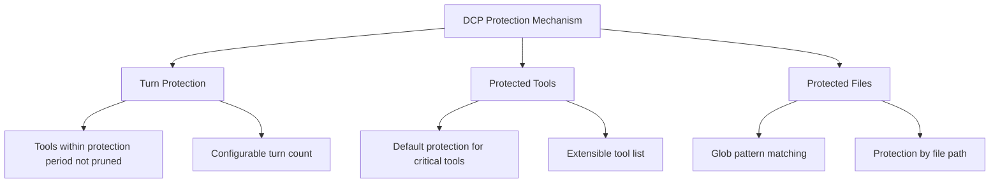

# Protection Mechanisms: Prevent Accidental Pruning of Critical Content

## What You'll Learn

- Configure turn protection to give AI time to reference recent tool outputs
- Extend the protected tools list to prevent critical operations from being pruned
- Set protected file patterns to prevent specific files from being accidentally pruned
- Understand the subagent protection mechanism to avoid affecting summarization behavior

## Your Current Challenges

DCP automatically prunes redundant tool calls from conversation history, which saves Tokens, but sometimes problems arise:

- AI just read a file and wants to analyze based on the content, but it gets pruned by DCP
- You used the `write` tool to write a configuration file and need to read it later, but after pruning, the file path is gone
- AI says "based on the code above," but the code is no longer in the context

These situations all indicate: **Some content must be protected and cannot be pruned**.

## When to Use This

- When AI needs to reference previously read file contents
- When protecting critical operations (such as writing configurations, task planning)
- When certain file paths (like secrets, keys) need special protection
- When developing subagent functionality (DCP automatically skips this)

## Core Concept

DCP provides a **three-layer protection mechanism** that prevents critical content from being accidentally pruned from different dimensions:



**Protection Layers**:
1. **Turn Protection** (time dimension): Tools from the last N turns are automatically protected
2. **Tool Protection** (tool dimension): Specific tools are never pruned
3. **File Protection** (path dimension): Tools operating on specific files are not pruned

These three can be combined to form a multi-layer protection net.

---

## Turn Protection

### What is Turn Protection

Turn Protection is a **time window protection mechanism** provided by DCP. When enabled, tool calls within the protection period are not added to the pruning cache, and thus will not be pruned by any strategy.

**Purpose**: Give the AI time to reference recent tool outputs, avoiding the awkward situation of "deleting immediately after saying."

### Configuring Turn Protection

Add to your configuration file:

```jsonc
{
  "turnProtection": {
    "enabled": true,
    "turns": 4
  }
}
```

**Parameter explanations**:
- `enabled`: Whether to enable turn protection (default `false`)
- `turns`: Number of turns to protect (default `4`), meaning tools from the last 4 turns will not be pruned

### How Turn Protection Works

When DCP synchronizes the tool cache (before each AI message), it calculates the turn count for each tool:

```typescript
// If current turn - tool creation turn < protection turn count
// Then the tool will not be pruned
state.currentTurn - turnCounter < turnProtectionTurns
```

**Example**:
- Current turn: 10
- Tool creation turn: 8
- Protection turn count: 4
- Result: 10 - 8 = 2 < 4 → **Protected, not pruned**

**Effects**:
- During the protection period, tools will not appear in the `<prunable-tools>` list
- Not affected by automatic strategies (deduplication, overwrite writes, purge errors)
- AI cannot prune them with `discard`/`extract` tools

### Recommended Configuration

| Scenario                     | Recommended Turns | Explanation                             |
|--- | --- | ---|
| Long conversations (10+ turns)      | 4-6        | Give AI enough time to reference historical content       |
| Short conversations (< 5 turns)      | 2-3        | No need for too long a protection period               |
| Highly context-dependent tasks     | 6-8        | Like code refactoring, long document analysis         |
| Default (context-independent)     | 0-2        | Don't enable or use minimum value                |

::: tip Note
Turn protection increases context size because more tool outputs will be retained. If you notice significant Token consumption growth, you can appropriately reduce the protection turn count.
:::

---

## Protected Tools

### Default Protected Tools

DCP protects the following tools by default, which are **never** pruned:

| Tool Name       | Explanation                             |
|--- | ---|
| `task`       | Task management tool                       |
| `todowrite`  | Write todo items                     |
| `todoread`   | Read todo items                     |
| `discard`    | DCP's discard tool (pruning operation itself)     |
| `extract`    | DCP's extract tool (pruning operation itself)     |
| `batch`      | Batch operation tool                     |
| `write`      | Write file tool                     |
| `edit`       | Edit file tool                     |
| `plan_enter` | Planning entry marker                     |
| `plan_exit`  | Planning exit marker                     |

**Why these tools are protected**:
- `task`, `todowrite`, `todoread`: Task management is the core of session state, deleting it leads to context loss
- `discard`, `extract`: They are DCP's own pruning tools, cannot prune themselves
- `batch`, `write`, `edit`: File operations are the core of AI-user code interaction
- `plan_enter`, `plan_exit`: Planning markers help understand session structure

### Extending Protected Tools List

If you need to protect more tools, you can extend them in the configuration:

```jsonc
{
  "tools": {
    "settings": {
      "protectedTools": [
        "task",
        "todowrite",
        "todoread",
        "discard",
        "extract",
        "batch",
        "write",
        "edit",
        "plan_enter",
        "plan_exit",
        // Add tools you need to protect
        "read",
        "filesearch"
      ]
    }
  }
}
```

**Global tool protection**:
- Tools in `tools.settings.protectedTools` will be protected in all strategies
- Suitable for tools you don't want any strategy to prune

### Strategy-Level Tool Protection

You can also set protected tools for specific strategies:

```jsonc
{
  "strategies": {
    "deduplication": {
      "enabled": true,
      "protectedTools": [
        "read",  // Protect read tool during deduplication
        "filesearch"
      ]
    },
    "purgeErrors": {
      "enabled": true,
      "turns": 4,
      "protectedTools": [
        "write"  // Protect write tool during error purging
      ]
    }
  }
}
```

**Use cases**:
- Only protect tools in a specific strategy, other strategies can prune them
- For example: Allow deduplication to prune `read`, but purge errors strategy cannot prune `write`

::: info Difference between tool protection and turn protection
- **Tool protection**: Regardless of which turn a tool was created in, as long as it's in the protection list, it will never be pruned
- **Turn protection**: All tools (except protected tools) are not pruned within the protection period, but can be pruned after the protection period ends
:::

---

## Protected File Patterns

### What are Protected File Patterns

Protected file patterns allow you to use Glob patterns to **protect operations on specific file paths from being pruned**.

**Use cases**:
- Protect key files (`.env`, `secrets.json`)
- Protect configuration files (important configurations cannot be lost)
- Protect project core files (entry files, core libraries)
- Protect sensitive directories (like `src/api/`, `tests/fixtures/`)

### Configuring Protected File Patterns

Add to your configuration file:

```jsonc
{
  "protectedFilePatterns": [
    "**/.env*",
    "**/secrets.json",
    "**/config/*.json",
    "src/core/**/*.ts",
    "tests/fixtures/**/*"
  ]
}
```

### Glob Pattern Explanation

DCP supports standard Glob patterns:

| Pattern       | Explanation                       | Example Match Paths                           |
|--- | --- | ---|
| `**`       | Match directories at any level         | `src/`, `src/components/`, `a/b/c/`   |
| `*`        | Match any file under a single directory   | `src/*.ts` matches `src/index.ts`        |
| `?`        | Match a single character             | `file?.txt` matches `file1.txt`, `file2.txt` |
| `*.json`   | Match specific extension           | `config.json`, `data.json`             |
| `**/*.json` | Match JSON files at any level | `a/b/c.json`, `d.json`                |

**Important notes**:
- `*` and `?` do not match `/` (directory separator)
- Matching is performed against the complete file path
- Path separators are unified as `/` (even on Windows)

### Practical Examples

#### Example 1: Protect Environment Variable Files

```jsonc
{
  "protectedFilePatterns": [
    "**/.env",
    "**/.env.local",
    "**/.env.production"
  ]
}
```

**Effect**: Any tool operating on `.env` files will not be pruned.

#### Example 2: Protect Project Core Files

```jsonc
{
  "protectedFilePatterns": [
    "src/index.ts",
    "src/core/**/*.ts",
    "src/api/**/*.ts"
  ]
}
```

**Effect**: Tool outputs operating on core modules and APIs will be retained, ensuring AI can always see the project structure.

#### Example 3: Protect Test Fixture Data

```jsonc
{
  "protectedFilePatterns": [
    "tests/fixtures/**/*",
    "tests/mocks/**/*.json"
  ]
}
```

**Effect**: Mock data and fixed inputs for testing will not be pruned, avoiding inconsistent test results.

---

## Subagent Protection

### What is a Subagent

A subagent is an OpenCode mechanism where the main agent can dispatch subagents to handle specific tasks (such as file search, code analysis). Subagents return results as summaries to the main agent.

### DCP's Subagent Protection

DCP automatically detects subagent sessions and **skips all pruning operations**.

**Implementation principle**:
```typescript
// lib/state/utils.ts
export async function isSubAgentSession(client: any, sessionID: string): Promise<boolean> {
    const result = await client.session.get({ path: { id: sessionID } })
    return !!result.data?.parentID  // If there's a parentID, it's a subagent
}
```

**Why protection is needed**:
- Subagent outputs are summaries for the main agent
- If subagent tool outputs are pruned, the main agent may not understand the context
- The subagent's task is "efficient execution," not "saving Tokens"

::: info User perception
Subagent protection is automatic, you don't need to configure anything. DCP will log detected subagent sessions in the logs.
:::

---

## Follow Along: Configuring Protection Mechanisms

### Step 1: Edit Configuration File

Open the global configuration file (or project configuration file):

```bash
# macOS/Linux
code ~/.config/opencode/dcp.jsonc

# Windows
code $env:APPDATA\opencode\dcp.jsonc
```

### Step 2: Add Protection Configuration

```jsonc
{
  "$schema": "https://raw.githubusercontent.com/Opencode-DCP/opencode-dynamic-context-pruning/main/dcp.schema.json",
  "enabled": true,
  "debug": false,

  // Turn protection
  "turnProtection": {
    "enabled": true,
    "turns": 4
  },

  // Protected file patterns
  "protectedFilePatterns": [
    "**/.env*",
    "**/secrets.json"
  ],

  // Extend protected tools
  "tools": {
    "settings": {
      "nudgeEnabled": true,
      "nudgeFrequency": 10,
      "protectedTools": [
        "task",
        "todowrite",
        "todoread",
        "discard",
        "extract",
        "batch",
        "write",
        "edit",
        "plan_enter",
        "plan_exit",
        "read"
      ]
    },
    "discard": {
      "enabled": true
    },
    "extract": {
      "enabled": true,
      "showDistillation": false
    }
  },

  // Strategy-level protection
  "strategies": {
    "deduplication": {
      "enabled": true,
      "protectedTools": ["filesearch"]
    },
    "supersedeWrites": {
      "enabled": false
    },
    "purgeErrors": {
      "enabled": true,
      "turns": 4,
      "protectedTools": ["write"]
    }
  }
}
```

### Step 3: Restart OpenCode

After modifying the configuration, restart OpenCode to make the configuration take effect:

- macOS/Linux: Right-click OpenCode icon in Dock → Quit → Reopen
- Windows: Right-click OpenCode in taskbar → Close window → Reopen

### Step 4: Verify Protection Mechanism

Enter `/dcp context` in the OpenCode conversation to view the current context analysis:

```
Session Context Breakdown:
──────────────────────────────────────────────────────────

System         15.2% │████████████████▒▒▒▒▒▒▒▒▒▒▒▒▒▒▒▒▒▒▒▒▒▒▒│  25.1K tokens
User            5.1% │████▒▒▒▒▒▒▒▒▒▒▒▒▒▒▒▒▒▒▒▒▒▒▒▒▒▒▒▒▒▒▒▒▒▒▒▒▒▒│   8.4K tokens
Assistant       35.8% │██████████████████████████████████████▒▒▒▒▒▒▒│  59.2K tokens
Tools (45)      43.9% │████████████████████████████████████████████████│  72.6K tokens

──────────────────────────────────────────────────────────

Summary:
  Pruned:          12 tools (~15.2K tokens)
  Current context: ~165.3K tokens
  Without DCP:     ~180.5K tokens
```

**You should see**:
- `Pruned` count may decrease (because protected tools won't be pruned)
- `Current context` may increase (because turn protection retains more content)

---

## Common Pitfalls

### ❌ Pitfall 1: Over-Protection Leads to Token Waste

**Problem**: Setting too long a protection turn count or adding too many protected tools, causing the context to always be large.

**Solution**:
- Turn protection is generally set to 2-4 turns
- Only protect truly critical tools (like `task`, `write`)
- Regularly check `/dcp context` to monitor context size

### ❌ Pitfall 2: Glob Pattern Matching Fails

**Problem**: Set `*.json`, but some JSON files are still being pruned.

**Cause**: `*` doesn't match `/`, so `a/b/c.json` won't be matched.

**Solution**: Use `**/*.json` to match JSON files at any level.

### ❌ Pitfall 3: Forgetting to Restart OpenCode

**Problem**: After modifying the configuration, the protection mechanism doesn't take effect.

**Cause**: DCP only loads the configuration file at startup.

**Solution**: You must restart OpenCode after modifying the configuration.

### ❌ Pitfall 4: Protected Tools Appearing in Pruning List

**Problem**: Set protected tools, but they still appear in the `<prunable-tools>` list.

**Cause**: Protected tools won't be pruned, but if they're outside the protection period, they'll still appear in the `<prunable-tools>` list (for AI to view), only the AI will fail when trying to prune them.

**Solution**: This is normal behavior. When the AI attempts to prune protected tools, DCP will reject the operation and return an error.

---

## Lesson Summary

DCP's protection mechanism includes three layers:

1. **Turn Protection**: Tools within the protection period are not pruned, giving AI time to reference historical content
2. **Protected Tools**: Specific tools (like `task`, `write`) are never pruned, with an extensible custom list
3. **Protected File Patterns**: Protect operations on specific file paths through Glob patterns
4. **Subagent Protection**: DCP automatically detects and skips pruning operations for subagent sessions

**Recommended configuration strategy**:
- Development phase: Enable turn protection (2-4 turns), protect configuration files and core modules
- Production phase: Adjust based on actual needs, balancing Token savings and context integrity
- Critical tasks: Enable all protection mechanisms to ensure critical content won't be lost

---

## Next Lesson Preview

> In the next lesson, we'll learn **[State Persistence](../state-persistence/)**.
>
> You'll learn:
> - How DCP persists pruning state and statistics across sessions
> - Location and format of persistence files
> - How to view cumulative Token savings
> - Methods to clean up persistence data

---

## Appendix: Source Code Reference

<details>
<summary><strong>Click to expand source code locations</strong></summary>

> Last updated: 2026-01-23

| Feature             | File Path                                                                                              | Line Numbers     |
|--- | --- | ---|
| Turn protection logic     | [`lib/state/tool-cache.ts`](https://github.com/Opencode-DCP/opencode-dynamic-context-pruning/blob/main/lib/state/tool-cache.ts#L39-L44) | 39-44    |
| Default protected tools   | [`lib/config.ts`](https://github.com/Opencode-DCP/opencode-dynamic-context-pruning/blob/main/lib/config.ts#L68-L79)         | 68-79    |
| Protected file matching   | [`lib/protected-file-patterns.ts`](https://github.com/Opencode-DCP/opencode-dynamic-context-pruning/blob/main/lib/protected-file-patterns.ts#L77-L82) | 77-82    |
| Subagent detection       | [`lib/state/utils.ts`](https://github.com/Opencode-DCP/opencode-dynamic-context-pruning/blob/main/lib/state/utils.ts#L1-L8)           | 1-8      |
| Deduplication strategy protection check | [`lib/strategies/deduplication.ts`](https://github.com/Opencode-DCP/opencode-dynamic-context-pruning/blob/main/lib/strategies/deduplication.ts#L49-L57) | 49-57    |
| Discard tool protection check | [`lib/strategies/tools.ts`](https://github.com/Opencode-DCP/opencode-dynamic-context-pruning/blob/main/lib/strategies/tools.ts#L89-L112)   | 89-112   |

**Key Constants**:
- `DEFAULT_PROTECTED_TOOLS = ["task", "todowrite", "todoread", "discard", "extract", "batch", "write", "edit", "plan_enter", "plan_exit"]`: Default protected tools list

**Key Functions**:
- `isProtectedFilePath(filePath, patterns)`: Check if file path matches protection patterns
- `isSubAgentSession(client, sessionID)`: Detect if session is a subagent

</details>
