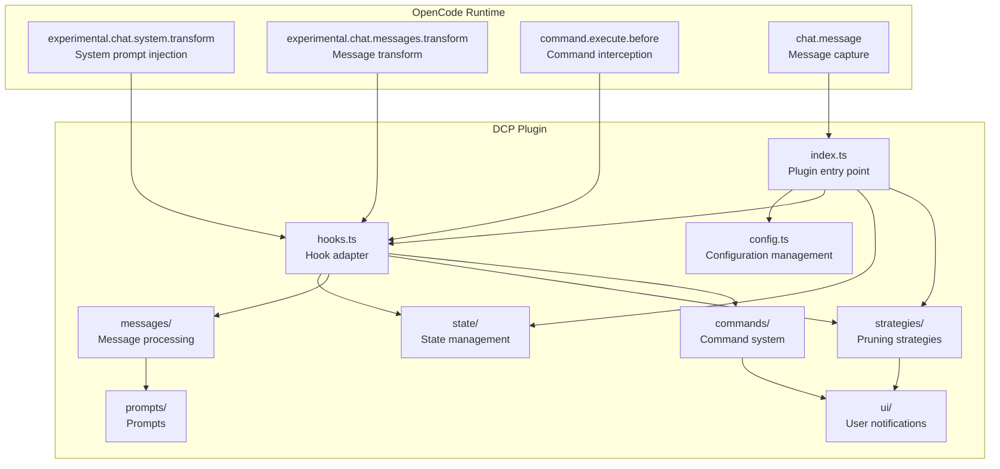
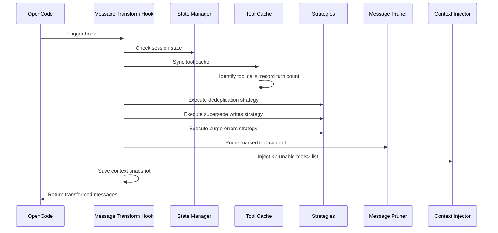
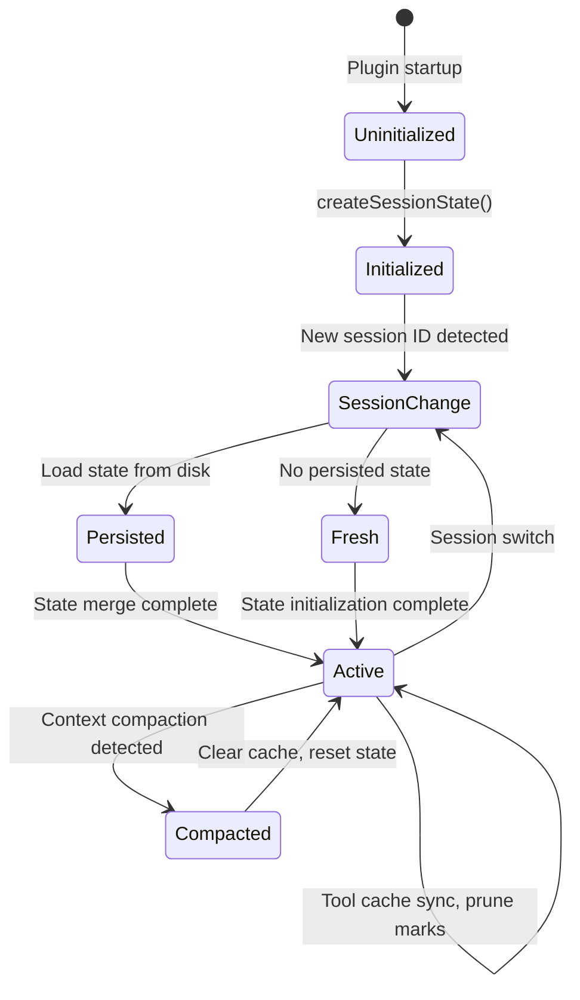
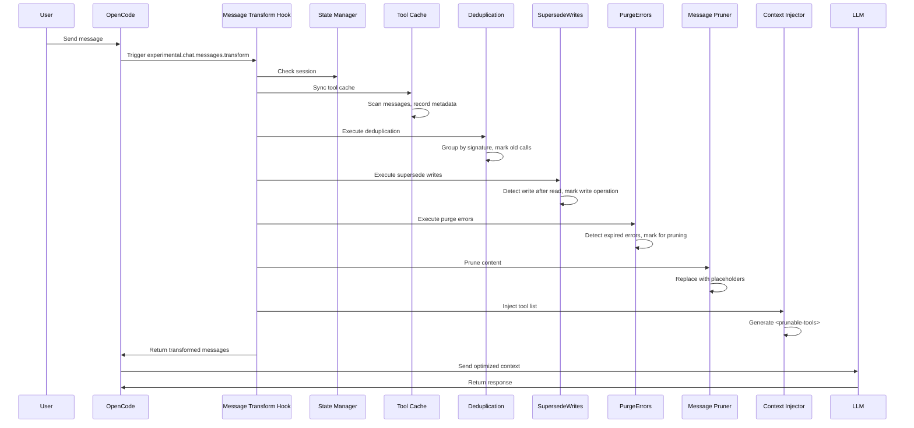
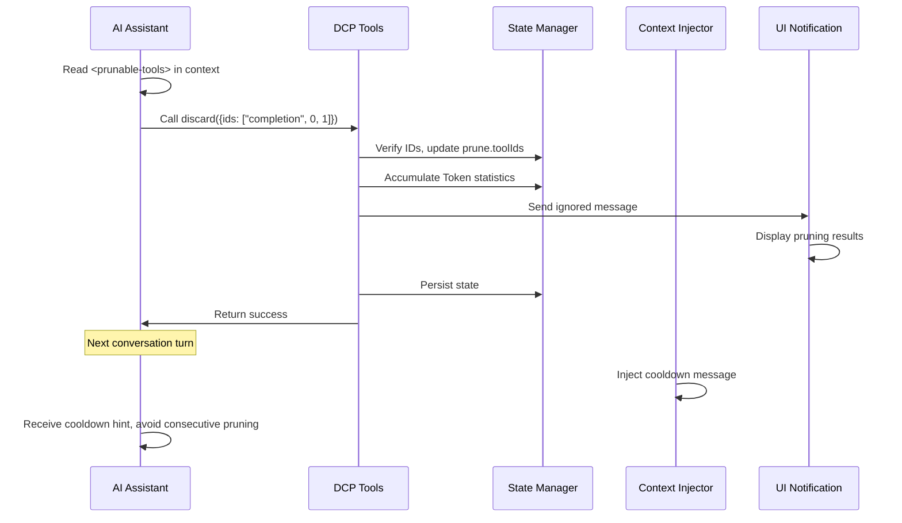

# Architecture Overview: How DCP Works Internally

## What You'll Learn

This section doesn't involve operations but helps you deeply understand DCP's internal design. After completing this, you will be able to:
- Understand how DCP integrates with conversation flow through OpenCode's hook system
- Master the responsibility boundaries and interaction patterns of each module
- Understand the complete call chain from message reception to pruning completion
- Learn the design philosophy behind state management, message processing, and pruning strategies

## Core Concept

DCP is a plugin based on OpenCode Plugin SDK that extends OpenCode's conversation capabilities by registering hooks and tools. The entire system revolves around the core concept of "message transform"—each time AI prepares to respond to a user, DCP scans, analyzes, and prunes the conversation history before sending the optimized context to the LLM.

::: info Why "Message Transform"?

OpenCode provides the `experimental.chat.messages.transform` hook, allowing plugins to modify messages before they are sent to the LLM. This is exactly the capability DCP needs—removing redundant tool calls before the LLM sees the context.

:::

The system uses a modular design with clear responsibilities for each module:
- **config**: Configuration management, supporting multi-level overrides
- **state**: State management, maintaining session-level runtime state
- **messages**: Message processing, executing actual pruning and injection operations
- **strategies**: Pruning strategies, defining automatic cleanup rules
- **commands**: Command system, providing manual control and statistics queries
- **hooks**: Hook adapter, connecting OpenCode and DCP modules
- **ui**: User notifications, displaying pruning results and statistics
## Module Architecture Diagram



## Plugin Entry Point and Initialization

The plugin entry point is defined in `index.ts`, which is the only connection point between DCP and the OpenCode Plugin API.

### Plugin Registration Flow

```typescript
const plugin: Plugin = (async (ctx) => {
    const config = getConfig(ctx)
    if (!config.enabled) {
        return {}
    }

    const logger = new Logger(config.debug)
    const state = createSessionState()

    return {
        "experimental.chat.system.transform": createSystemPromptHandler(...),
        "experimental.chat.messages.transform": createChatMessageTransformHandler(...),
        "chat.message": async (input, _output) => { /* Cache variant */ },
        "command.execute.before": createCommandExecuteHandler(...),
        tool: {
            discard: createDiscardTool(...),
            extract: createExtractTool(...),
        },
        config: async (opencodeConfig) => { /* Modify OpenCode configuration */ },
    }
}) satisfies Plugin
```

**Initialization Phase**:
1. Load configuration (supports multi-level merge: defaults → global → environment variables → project)
2. If plugin is disabled, return empty object immediately
3. Create logging system and session state object
4. Register four hooks and two tools

**Configuration Modification Phase**:
- Through `config` hook, add `discard` and `extract` tools to `experimental.primary_tools`
- Register `/dcp` command

## Hook System and Message Transform

`hooks.ts` is responsible for converting OpenCode hook events into DCP internal module calls. This is DCP's core dispatch layer.

### System Prompt Injection Hook

```typescript
createSystemPromptHandler(state, logger, config)
```

**Trigger Timing**: Every time the system prompt is built

**Main Responsibilities**:
1. Detect sub-agent sessions (skip injection if it's a sub-agent)
2. Detect internal agents (e.g., conversation summary generator, skip injection)
3. Select appropriate prompt template based on configuration:
   - Both discard and extract enabled: `system/system-prompt-both`
   - Only discard enabled: `system/system-prompt-discard`
   - Only extract enabled: `system/system-prompt-extract`
4. Inject tool descriptions into the system prompt

**Why is System Prompt Injection Needed?**

The AI needs to know that it can use `discard` and `extract` tools to optimize context. By describing the purpose of these tools in the system prompt, the AI can autonomously decide when to call them.

### Message Transform Hook

```typescript
createChatMessageTransformHandler(ctx.client, state, logger, config)
```

**Trigger Timing**: Every time AI prepares to respond to a message (before sending to LLM)

**Processing Flow**:



**Core Steps**:

1. **Session Check** (`checkSession`)
   - Check if session ID has changed
   - If new session, load persisted state from disk
   - Detect context compression (OpenCode's summary mechanism), clear tool cache if compression detected

2. **Tool Cache Sync** (`syncToolCache`)
   - Scan all tool calls in messages
   - Record each tool's `callID`, tool name, parameters, status, turn count
   - Skip protected tools and tools within turn protection period
   - Maintain `nudgeCounter` (count of unpruned tools)

3. **Execute Automatic Strategies**
   - `deduplicate`: Remove duplicates, keep latest call
   - `supersedeWrites`: Clean up write operations that have been overwritten by reads
   - `purgeErrors`: Clean up expired error tool inputs

4. **Prune Content** (`prune`)
   - Replace marked tools' `output` with placeholders
   - Replace error tools' `input` with placeholders

5. **Inject Tool List** (`insertPruneToolContext`)
   - Generate `<prunable-tools>` list (containing numeric IDs, tool names, parameter summaries)
   - Inject reminder message as needed (nudge)
   - If last operation was pruning, inject cooldown message

6. **Save Context Snapshot**
   - Save transformed messages to log directory for debugging

### Command Interception Hook

```typescript
createCommandExecuteHandler(ctx.client, state, logger, config, ctx.directory)
```

**Trigger Timing**: When user executes a command

**Main Responsibilities**:
- Intercept commands starting with `/dcp`
- Dispatch to corresponding command handlers:
  - `/dcp` → Show help
  - `/dcp context` → Show Token usage analysis
  - `/dcp stats` → Show cumulative pruning statistics
  - `/dcp sweep [n]` → Manually prune tools
- Prevent OpenCode from executing default command handling by throwing special error (`__DCP_*_HANDLED__`)

## State Management

The `state/` module is responsible for maintaining session-level runtime state and persistence.

### Core Data Structures

**SessionState** (In-memory state):
```typescript
{
    sessionId: string | null,           // Current session ID
    isSubAgent: boolean,               // Whether it's a sub-agent session
    prune: { toolIds: string[] },       // List of tool IDs marked for pruning
    stats: {
        pruneTokenCounter: number,      // Pruned Token count in current session
        totalPruneTokens: number,       // Historical cumulative pruned Token count
    },
    toolParameters: Map<string, ToolParameterEntry>,  // Tool call cache
    nudgeCounter: number,               // Unpruned tool count (for triggering reminders)
    lastToolPrune: boolean,             // Whether last operation was tool pruning
    lastCompaction: number,             // Last context compaction timestamp
    currentTurn: number,                // Current turn count
    variant: string | undefined,       // Model variant (e.g., claude-3.5-sonnet)
}
```

**ToolParameterEntry** (Tool metadata):
```typescript
{
    tool: string,                       // Tool name
    parameters: any,                    // Tool parameters
    status: ToolStatus | undefined,     // Execution status
    error: string | undefined,          // Error message
    turn: number,                       // Turn count when this call was created
}
```

### State Lifecycle



**Key State Transitions**:

1. **Session Initialization** (`ensureSessionInitialized`)
   - Detect `sessionID` change
   - Detect if it's a sub-agent (via `session.parentID`)
   - Load `PersistedSessionState` from disk
   - Initialize turn counter and compaction timestamp

2. **Context Compaction Handling**
   - Detect OpenCode's `summary` message (`msg.info.summary === true`)
   - Clear tool cache and prune list
   - Record compaction timestamp to prevent duplicate cleanup

3. **Persistence**
   - Asynchronously save to `~/.local/share/opencode/storage/plugin/dcp/{sessionId}.json` after pruning operation completes
   - Contains session name, prune list, statistics, last update time

## Message Processing Module

The `messages/` module is responsible for actual pruning and injection operations.

### Pruning Operations (prune.ts)

**Core Function**: `prune(state, logger, config, messages)`

**Three Sub-functions**:

1. **`pruneToolOutputs`**
   - Replace marked tools' `output` with placeholders
   - Only process tools with status `completed`
   - Skip `question` tools (special handling for question tools)

2. **`pruneToolInputs`**
   - Only process `question` tools
   - Replace `questions` field with placeholder (preserve user answers)

3. **`pruneToolErrors`**
   - Clean up input parameters of error tools
   - Preserve error messages, only remove string inputs (potentially large parameters)

**Placeholder Design**:
```
[Output removed to save context - information superseded or no longer needed]
[input removed due to failed tool call]
[questions removed - see output for user's answers]
```

### Context Injection (inject.ts)

**Core Function**: `insertPruneToolContext(state, config, logger, messages)`

**Flow**:

1. **Generate Tool List** (`buildPrunableToolsList`)
   - Iterate through tool cache, excluding:
     - Already pruned tools
     - Protected tools (`task`, `write`, `edit`, etc.)
     - Protected file paths (matching `protectedFilePatterns`)
   - Generate description for each tool: `{numericId}: {toolName}, {paramKey}`
   - Example: `3: read, src/config.ts`

2. **Wrap in `<prunable-tools>` Tag**
    ```html
    <prunable-tools>
    The following tools have been invoked and are available for pruning. This list does not mandate immediate action. Consider your current goals and resources you need before discarding valuable tool inputs or outputs. Consolidate your prunes for efficiency; it is rarely worth pruning a single tiny tool output. Keep your context free of noise.
    0: read, src/config.ts
    1: read, src/config.ts
    2: read, src/utils.ts
    </prunable-tools>
    ```

3. **Handle Cooldown State**
   - If last operation was `discard` or `extract`, inject cooldown message:
    ```html
    <prunable-tools>
    Context management was just performed. Do not use discard or extract tools again. A fresh list will be available after your next tool use.
    </prunable-tools>
    ```

4. **Inject Reminder Message**
   - If `nudgeCounter >= nudgeFrequency`, append reminder text
   - Reminder format: `"You have not used context pruning in a while. Consider using discard/extract tools to reduce token usage."`

5. **Select Message Insertion Position**
   - If last message is a user message, insert synthetic user message
   - Otherwise, insert synthetic assistant message
   - Use `variant` to ensure message format compatibility with different models

## Pruning Strategies Module

The `strategies/` module defines automatic cleanup rules.

### Deduplication Strategy (deduplication.ts)

**Core Function**: `deduplicate(state, logger, config, messages)`

**Algorithm**:
1. Build a chronological list of all tool IDs
2. Calculate a "signature" for each tool: `tool::normalizedParameters`
   - Normalize parameters: remove `null`/`undefined`
   - Sort key order: ensure `{"b":1,"a":2}` and `{"a":2,"b":1}` generate the same signature
3. Group by signature
4. Within each group, keep the last one (latest), mark others for pruning

**Example**:
```typescript
// Original tool calls
Tool Call 1: read({filePath: "src/config.ts"})
Tool Call 2: read({filePath: "src/config.ts"})
Tool Call 3: read({filePath: "src/utils.ts"})

// Signature grouping
Signature 1: "read::{\"filePath\":\"src/config.ts\"}" → [Tool Call 1, Tool Call 2]
Signature 2: "read::{\"filePath\":\"src/utils.ts\"}" → [Tool Call 3]

// Pruning result
Mark for pruning: [Tool Call 1]  // Keep Tool Call 2 (latest)
Keep: [Tool Call 2, Tool Call 3]
```

### Supersede Writes Strategy (supersede-writes.ts)

**Core Function**: `supersedeWrites(state, logger, config, messages)`

**Algorithm**:
1. Scan all tool calls, in chronological order
2. Maintain file tracking table:
    ```typescript
    {
        "src/config.ts": {
            lastWrite: callId,
            lastWriteTime: timestamp,
            lastRead: callId,
            lastReadTime: timestamp,
        }
    }
    ```
3. Detect patterns:
   - If file's `lastWriteTime < lastReadTime`, it means the write operation has been overwritten by a read
   - Mark that write operation's `input` for pruning

**Scenario**:
```typescript
// Timeline
Turn 1: write({filePath: "src/config.ts", content: "..."})  // lastWrite = call1
Turn 2: read({filePath: "src/config.ts"})                 // lastRead = call2 (overwrites write operation)
Turn 3: read({filePath: "src/config.ts"})                 // Keep latest read

// Pruning result
Mark for pruning: [Turn 1's write call]
```

### Purge Errors Strategy (purge-errors.ts)

**Core Function**: `purgeErrors(state, logger, config, messages)`

**Algorithm**:
1. Scan all tools with status `error`
2. Check the difference between current turn count and tool creation turn
3. If difference > `strategies.purgeErrors.turns` (default 4), mark for pruning

**Protection Mechanism**:
- Error messages preserved (`part.state.error`)
- Only remove input parameters (`part.state.input`), because error inputs can be large

**Scenario**:
```typescript
Turn 1: read({filePath: "nonexistent.txt"}) → error
Turn 2-5: Other operations
Turn 6: User continues conversation

// If purgeErrors.turns = 4
// Turn 6 - Turn 1 = 5 > 4
// Mark Turn 1's error input for pruning
```

### LLM-Driven Tools (tools.ts)

**Discard Tool**:
```typescript
{
    name: "discard",
    description: "Remove completed task or noise tool outputs",
    parameters: {
        ids: ["completion", 0, 1, 2]  // First element is reason: 'completion' or 'noise'
    }
}
```

**Extract Tool**:
```typescript
{
    name: "extract",
    description: "Extract key findings then remove original tool outputs",
    parameters: {
        ids: [0, 1, 2],
        distillation: ["key finding 1", "key finding 2", "key finding 3"]
    }
}
```

**Processing Flow**:
1. AI calls tool, providing a list of numeric IDs
2. Map numeric IDs back to real `callID`
3. Verify tool is not in protection list
4. Update `prune.toolIds`
5. Display pruning results through `ignored message`
6. Persist state

## Command System

The `commands/` module provides manual control and statistics queries.

### Context Command

```bash
/dcp context
```

**Output**: Token usage analysis (bar chart)
```
╭───────────────────────────────────────────────────────────╮
│                  DCP Context Analysis                     │
╰───────────────────────────────────────────────────────────╯

Session Context Breakdown:
───────────────────────────────────────────────────────────

System         15.2% │████████████████▒▒▒▒▒▒▒▒▒▒▒▒▒▒▒▒▒▒▒▒▒▒▒│  25.1K tokens
User            5.1% │████▒▒▒▒▒▒▒▒▒▒▒▒▒▒▒▒▒▒▒▒▒▒▒▒▒▒▒▒▒▒▒▒▒▒▒▒▒▒│   8.4K tokens
Assistant       35.8% │██████████████████████████████████████▒▒▒▒▒▒▒│  59.2K tokens
Tools (45)      43.9% │████████████████████████████████████████████████│  72.6K tokens

───────────────────────────────────────────────────────────

Summary:
  Pruned:          12 tools (~15.2K tokens)
  Current context: ~165.3K tokens
  Without DCP:     ~180.5K tokens
```

**Calculation Logic**:
- System: `firstAssistant.input + cache.read - tokenizer(firstUserMessage)`
- User: `tokenizer(all user messages)`
- Tools: `tokenizer(toolInputs + toolOutputs) - prunedTokens`
- Assistant: Residual calculation

### Stats Command

```bash
/dcp stats
```

**Output**: Cumulative pruning statistics
```
╭───────────────────────────────────────────────────────────╮
│                      DCP Statistics                      │
╰───────────────────────────────────────────────────────────╯

Session Pruning:
  Tools pruned: 12
  Tokens saved: ~15.2K
  Last prune:   discard (2 turns ago)

Lifetime Statistics:
  Total tokens saved: ~145.8K
```

### Sweep Command

```bash
/dcp sweep [n]
```

**Two Modes**:
1. Default: Prune all tools after the last user message
2. Specified: `/dcp sweep 5`, prune the last 5 tools

**Processing Flow**:
1. Find the position of the last user message
2. Extract subsequent tool calls
3. Filter protected tools and protected files
4. Mark for pruning
5. Display results and Token savings

## Configuration System

`config.ts` is responsible for configuration loading and validation.

### Configuration Priority

```
Defaults (1) < Global (2) < Environment Variables (3) < Project (4)
```

**Configuration Paths**:
- Global: `~/.config/opencode/dcp.jsonc`
- Environment Variables: `$OPENCODE_CONFIG_DIR/dcp.jsonc`
- Project: `<project>/.opencode/dcp.jsonc`

### Configuration Merge Flow

```typescript
const defaultConfig = { /* Hardcoded defaults */ }
const globalConfig = loadConfig(globalPath) || {}
const envConfig = loadConfig(envPath) || {}
const projectConfig = loadConfig(projectPath) || {}

const finalConfig = {
    ...defaultConfig,
    ...globalConfig,
    ...envConfig,
    ...projectConfig,
}
```

### Validation Mechanism

- Use Zod Schema to define configuration structure
- If configuration is invalid, use Toast warning and fall back to defaults
- Automatically create default configuration when configuration file doesn't exist

## Module Dependency Relationships

| Module     | Responsibility         | Dependent Modules                         | Depended By               |
| ---------- | ---------------------- | ----------------------------------------- | ------------------------- |
| config     | Configuration management | -                                         | index, hooks, strategies, commands |
| hooks      | Hook adapter           | config, state, logger, messages, strategies, commands | index |
| state      | State management       | logger                                    | index, hooks, strategies  |
| messages   | Message processing     | state, logger, prompts, ui, protected-file-patterns | hooks |
| strategies | Pruning strategies     | state, logger, messages, ui, protected-file-patterns | hooks |
| commands   | Command handling       | state, logger, messages, ui, strategies   | hooks |
| ui         | User notifications     | state, logger, prompts                   | strategies, commands      |
| prompts    | Prompt management      | -                                         | hooks, messages, strategies |
| logger     | Logging system         | -                                         | index, config, hooks, strategies, state, ui, commands |

## Complete Call Chain

### Automatic Pruning Flow



### LLM-Driven Pruning Flow



## Performance Considerations

### Tool Cache Limits

- Maximum capacity: 1000 entries (`MAX_TOOL_CACHE_SIZE`)
- Cleanup strategy: FIFO (First In, First Out)
- Trigger condition: Check size after each sync

### Logging System

- Debug logs: `~/.config/opencode/logs/dcp/daily/YYYY-MM-DD.log`
- Context snapshots: `~/.config/opencode/logs/dcp/context/{sessionId}/`
- Log level: Configurable (`config.debug`)

### Sub-Agent Detection

- Detection method: Whether `session.parentID` exists
- Handling strategy: Skip all pruning operations (avoid duplicate pruning)

## Lesson Summary

DCP's architecture design revolves around the core concept of "message transform," seamlessly integrating with the conversation flow through OpenCode's hook system. The system uses a modular design with clear responsibilities for each module:

- **Plugin Entry Point** (`index.ts`) registers hooks and tools
- **Hook System** (`hooks.ts`) handles event dispatch and scheduling
- **State Management** (`state/`) manages session-level state and persistence
- **Message Processing** (`messages/`) performs actual pruning and injection
- **Pruning Strategies** (`strategies/`) defines automatic cleanup rules
- **Command System** (`commands/`) provides manual control
- **Configuration System** (`config.ts`) supports multi-level configuration

The entire flow is completed in the `experimental.chat.messages.transform` hook: tool cache sync → automatic strategy execution → content pruning → tool list injection. This design ensures DCP completes optimization before the LLM sees the context, while maintaining plugin maintainability and extensibility.

---

## Appendix: Source Code Reference

<details>
<summary><strong>Click to expand source code locations</strong></summary>

> Last updated: 2026-01-23

| Function             | File Path                                                                                    | Line Number |
| -------------------- | ------------------------------------------------------------------------------------------- | ---------- |
| Plugin entry and hook registration | [`index.ts`](https://github.com/Opencode-DCP/opencode-dynamic-context-pruning/blob/main/index.ts) | 12-102     |
| System prompt injection hook | [`lib/hooks.ts`](https://github.com/Opencode-DCP/opencode-dynamic-context-pruning/blob/main/lib/hooks.ts) | 20-53      |
| Message transform hook | [`lib/hooks.ts`](https://github.com/Opencode-DCP/opencode-dynamic-context-pruning/blob/main/lib/hooks.ts) | 55-82      |
| Command interception hook | [`lib/hooks.ts`](https://github.com/Opencode-DCP/opencode-dynamic-context-pruning/blob/main/lib/hooks.ts) | 84-156     |
| Session state management | [`lib/state/state.ts`](https://github.com/Opencode-DCP/opencode-dynamic-context-pruning/blob/main/lib/state/state.ts) | 7-143      |
| Tool cache sync | [`lib/state/tool-cache.ts`](https://github.com/Opencode-DCP/opencode-dynamic-context-pruning/blob/main/lib/state/tool-cache.ts) | 11-86      |
| State persistence | [`lib/state/persistence.ts`](https://github.com/Opencode-DCP/opencode-dynamic-context-pruning/blob/main/lib/state/persistence.ts) | -          |
| Message pruning | [`lib/messages/prune.ts`](https://github.com/Opencode-DCP/opencode-dynamic-context-pruning/blob/main/lib/messages/prune.ts) | 11-106     |
| Context injection | [`lib/messages/inject.ts`](https://github.com/Opencode-DCP/opencode-dynamic-context-pruning/blob/main/lib/messages/inject.ts) | 102-157    |
| Deduplication strategy | [`lib/strategies/deduplication.ts`](https://github.com/Opencode-DCP/opencode-dynamic-context-pruning/blob/main/lib/strategies/deduplication.ts) | 13-83      |
| Supersede writes strategy | [`lib/strategies/supersede-writes.ts`](https://github.com/Opencode-DCP/opencode-dynamic-context-pruning/blob/main/lib/strategies/supersede-writes.ts) | -          |
| Purge errors strategy | [`lib/strategies/purge-errors.ts`](https://github.com/Opencode-DCP/opencode-dynamic-context-pruning/blob/main/lib/strategies/purge-errors.ts) | -          |
| LLM-driven tools | [`lib/strategies/tools.ts`](https://github.com/Opencode-DCP/opencode-dynamic-context-pruning/blob/main/lib/strategies/tools.ts) | -          |
| Context command | [`lib/commands/context.ts`](https://github.com/Opencode-DCP/opencode-dynamic-context-pruning/blob/main/lib/commands/context.ts) | -          |
| Stats command | [`lib/commands/stats.ts`](https://github.com/Opencode-DCP/opencode-dynamic-context-pruning/blob/main/lib/commands/stats.ts) | -          |
| Sweep command | [`lib/commands/sweep.ts`](https://github.com/Opencode-DCP/opencode-dynamic-context-pruning/blob/main/lib/commands/sweep.ts) | -          |
| Configuration management | [`lib/config.ts`](https://github.com/Opencode-DCP/opencode-dynamic-context-pruning/blob/main/lib/config.ts) | -          |
| Logging system | [`lib/logger.ts`](https://github.com/Opencode-DCP/opencode-dynamic-context-pruning/blob/main/lib/logger.ts) | -          |

**Key Constants**:
- `MAX_TOOL_CACHE_SIZE = 1000`: Maximum tool cache capacity, preventing unlimited memory growth (`lib/state/tool-cache.ts:6`)

**Key Functions**:
- `createSystemPromptHandler()`: Creates system prompt injection hook, responsible for explaining available pruning tools to AI (`lib/hooks.ts:20-53`)
- `createChatMessageTransformHandler()`: Creates message transform hook, DCP's core dispatcher, coordinating state management, strategy execution, message pruning, and context injection (`lib/hooks.ts:55-82`)
- `syncToolCache()`: Syncs tool parameter cache, recording metadata for each tool call (callID, parameters, status, turn count) for subsequent pruning strategies (`lib/state/tool-cache.ts:11-86`)
- `deduplicate()`: Deduplication strategy, identifying duplicate tool calls via signature matching, keeping the latest (`lib/strategies/deduplication.ts:13-83`)
- `supersedeWrites()`: Supersede writes strategy, cleaning up write operation inputs that have been overwritten by subsequent reads (`lib/strategies/supersede-writes.ts`)
- `purgeErrors()`: Purge errors strategy, cleaning up expired error tool input parameters (`lib/strategies/purge-errors.ts`)
- `prune()`: Message pruning main function, calling three sub-functions to prune tool outputs, tool inputs, and error inputs (`lib/messages/prune.ts:11-20`)
- `insertPruneToolContext()`: Injects `<prunable-tools>` list into context, providing AI with identification of prunable tools (`lib/messages/inject.ts:102-157`)
- `createDiscardTool()`: Creates discard tool specification, allowing AI to remove completed task or noise tool outputs (`lib/strategies/tools.ts`)
- `createExtractTool()`: Creates extract tool specification, allowing AI to extract key findings then remove original tool outputs (`lib/strategies/tools.ts`)
- `createSessionState()`: Creates new session state object, initializing all state fields (`lib/state/state.ts:42-60`)
- `ensureSessionInitialized()`: Ensures session initialization, handling session switching, sub-agent detection, state loading (`lib/state/state.ts:80-116`)

**Key Data Structures**:
- `SessionState`: Session-level runtime state, containing sessionId, prune list, statistics, tool cache, turn counter, etc. (`lib/state/types.ts:27-38`)
- `ToolParameterEntry`: Metadata cache for a single tool call, containing tool name, parameters, status, error info, turn count (`lib/state/types.ts:10-16`)
- `Prune`: Pruning state, recording list of tool call IDs marked for pruning (`lib/state/types.ts:23-25`)
- `SessionStats`: Session statistics, containing current session pruned Token count and historical cumulative pruned Token count (`lib/state/types.ts:18-21`)

**Key Type Definitions**:
- `ToolStatus`: Tool execution status enum, including pending (waiting to execute), running (executing), completed (completed), error (failed) (`lib/state/types.ts:8`)

</details>

---

## Next Lesson Preview

> Next lesson we learn **[Token Calculation Principles](../token-calculation/)**.
>
> You will learn:
> - How DCP accurately calculates Token usage
> - Calculation methods for different message types (System, User, Assistant, Tools)
> - Accumulation mechanism of Token savings statistics
> - How to debug Token calculation issues
