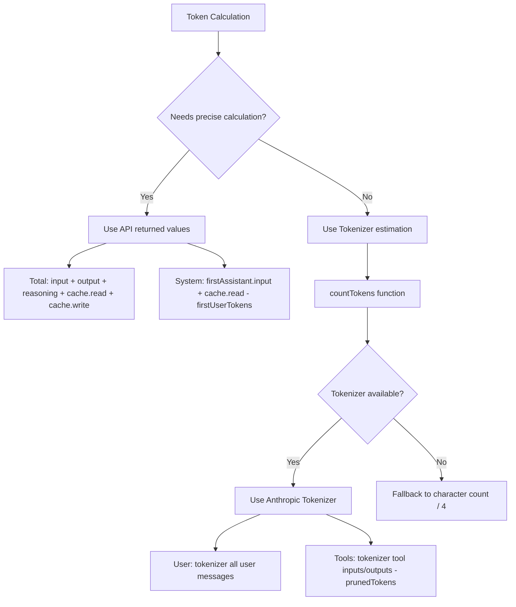

# Token Calculation

## What You'll Learn

- Understand DCP's token calculation strategy (API values vs estimates)
- Read the token distribution in `/dcp context` output
- Know the error range and optimization methods for token estimation
- Accurately evaluate DCP's savings effectiveness

## Your Current Challenge

You look at the `/dcp context` output—a bunch of numbers and percentages—but don't know how they're calculated:

```
Session Context Breakdown:
─────────────────────────────────────────────────────────

System         15.2% │████████████████▒▒▒▒▒▒▒▒▒▒▒▒▒▒▒▒▒▒▒▒▒│  25.1K tokens
User            5.1% │████▒▒▒▒▒▒▒▒▒▒▒▒▒▒▒▒▒▒▒▒▒▒▒▒▒▒▒▒▒▒▒▒▒▒▒▒▒▒▒▒▒│   8.4K tokens
Assistant       35.8% │██████████████████████████████████████▒▒▒▒▒▒│  59.2K tokens
Tools (45)      43.9% │████████████████████████████████████████████████│  72.6K tokens
─────────────────────────────────────────────────────────

Summary:
  Pruned:          12 tools (~15.2K tokens)
  Current context: ~165.3K tokens
  Without DCP:     ~180.5K tokens
```

Where do these numbers come from? Why is Assistant "residual calculation"? How is `prunedTokens` calculated?

## When to Use This

- When you want to accurately evaluate DCP's savings effectiveness
- When you need to analyze token consumption structure (which part uses the most)
- When you suspect token calculation errors and want to verify accuracy
- When you need to report DCP's optimization results to your team

## Core Concept

DCP's token calculation uses a **hybrid strategy**: **prioritize using API-returned exact values, use estimates when necessary**.



**Key Principles**:
1. **API values first**: Total and System use exact API returned values
2. **Estimates supplement**: User and Tools use tokenizer estimates (because API doesn't provide these values)
3. **Residual calculation**: Assistant is calculated by Total - System - User - Tools

---

## Token Calculation Strategy

### API-Returned Exact Values

OpenCode API returns precise token statistics for each AI response:

| Field                | Description                                     | Source             |
|--- | --- | ---|
| `tokens.input`       | Input token count for this request              | API exact value    |
| `tokens.output`      | Output token count generated this request       | API exact value    |
| `tokens.reasoning`   | Reasoning token count (e.g., Claude 3.5 thinking) | API exact value (if applicable) |
| `tokens.cache.read`  | Cache read token count                          | API exact value    |
| `tokens.cache.write` | Cache write token count                         | API exact value    |

**These values are exact** because they come directly from the LLM provider's billing system.

### Estimation Calculation Method

For values not provided by API (like user messages, tool calls), DCP uses **Anthropic Tokenizer** for estimation.

**Implementation code** (`lib/strategies/utils.ts:36-43`):

```typescript
export function countTokens(text: string): number {
    if (!text) return 0
    try {
        // Prefer Anthropic Tokenizer
        return anthropicCountTokens(text)
    } catch {
        // Fallback to character count / 4 on failure
        return Math.round(text.length / 4)
    }
}
```

**Why use character count/4 as backup**:
- Average token ratio for English text is about 4 characters = 1 token
- This is just a rough estimate and may have errors
- Only used when Tokenizer is unavailable (e.g., network issues, library loading failure)

---

## Token Calculation Logic by Category

### Total (Total Token Count)

**Calculation formula**:

```typescript
total = input + output + reasoning + cache.read + cache.write
```

**Implementation code** (`lib/commands/context.ts:103-108`):

```typescript
const apiInput = lastAssistant?.tokens?.input || 0
const apiOutput = lastAssistant?.tokens?.output || 0
const apiReasoning = lastAssistant?.tokens?.reasoning || 0
const apiCacheRead = lastAssistant?.tokens?.cache?.read || 0
const apiCacheWrite = lastAssistant?.tokens?.cache?.write || 0
breakdown.total = apiInput + apiOutput + apiReasoning + apiCacheRead + apiCacheWrite
```

**Explanation**:
- Uses token statistics from the last Assistant response
- Includes all API-returned values
- Consistent with the total token count displayed in OpenCode UI

### System (System Prompt Tokens)

**Calculation formula**:

```typescript
system = firstAssistant.input + firstAssistant.cache.read - firstUserTokens
```

**Implementation code** (`lib/commands/context.ts:161-165`):

```typescript
if (firstAssistant) {
    const firstInput =
        (firstAssistant.tokens?.input || 0) + (firstAssistant.tokens?.cache?.read || 0)
    breakdown.system = Math.max(0, firstInput - firstUserTokens)
}
```

**Principle**:
1. **First Assistant response's input** contains: system prompt + first user message
2. **Subtract first user message's token count** (estimated by tokenizer) to get pure system prompt token count
3. **Add cache.read** (cache reads also count as system tokens)

::: info Why residual calculation?
API doesn't directly provide "system prompt" token count, so we can only calculate by "first response's input - first user message". This is the standard estimation method.
:::

### User (User Message Tokens)

**Calculation formula**:

```typescript
user = tokenizer(all user messages)
```

**Implementation code** (`lib/commands/context.ts:110-157`):

```typescript
const userTextParts: string[] = []

for (const msg of messages) {
    if (isMessageCompacted(state, msg)) continue
    if (msg.info.role === "user" && isIgnoredUserMessage(msg)) continue

    const parts = Array.isArray(msg.parts) ? msg.parts : []
    for (const part of parts) {
        if (part.type === "text" && msg.info.role === "user") {
            const textPart = part as TextPart
            const text = textPart.text || ""
            userTextParts.push(text)
        }
    }
}

breakdown.user = countTokens(userTextParts.join("\n"))
```

**Explanation**:
- Uses tokenizer to calculate token count for all user messages
- Skips messages already compacted (`isMessageCompacted`)
- Skips ignored messages (system internal messages)

### Tools (Tool Call Tokens)

**Calculation formula**:

```typescript
tools = tokenizer(toolInputs + toolOutputs) - prunedTokens
```

**Implementation code** (`lib/commands/context.ts:110-167`):

```typescript
const toolInputParts: string[] = []
const toolOutputParts: string[] = []

for (const msg of messages) {
    if (isMessageCompacted(state, msg)) continue

    const parts = Array.isArray(msg.parts) ? msg.parts : []
    for (const part of parts) {
        if (part.type === "tool") {
            const toolPart = part as ToolPart
            breakdown.toolCount++

            // Extract tool input
            if (toolPart.state?.input) {
                const inputStr =
                    typeof toolPart.state.input === "string"
                        ? toolPart.state.input
                        : JSON.stringify(toolPart.state.input)
                toolInputParts.push(inputStr)
            }

            // Extract tool output (only for completed status)
            if (toolPart.state?.status === "completed" && toolPart.state?.output) {
                const outputStr =
                    typeof toolPart.state.output === "string"
                        ? toolPart.state.output
                        : JSON.stringify(toolPart.state.output)
                toolOutputParts.push(outputStr)
            }
        }
    }
}

const toolInputTokens = countTokens(toolInputParts.join("\n"))
const toolOutputTokens = countTokens(toolOutputParts.join("\n"))
breakdown.tools = Math.max(0, toolInputTokens + toolOutputTokens - breakdown.prunedTokens)
```

**Explanation**:
- Calculates tokens for all tool inputs and outputs
- Subtracts tokens for pruned tools (`prunedTokens`)
- Only counts tool outputs with `status === "completed"`

### Assistant (Assistant Message Tokens)

**Calculation formula**:

```typescript
assistant = total - system - user - tools
```

**Implementation code** (`lib/commands/context.ts:168-171`):

```typescript
breakdown.assistant = Math.max(
    0,
    breakdown.total - breakdown.system - breakdown.user - breakdown.tools,
)
```

**Principle**:
- Assistant uses **residual calculation**
- Subtract System, User, Tools from Total, and the remainder is Assistant

::: info Why does Assistant include reasoning tokens?
If the model persists reasoning tokens in the context, they belong to "Assistant-generated content" and are therefore categorized under Assistant. This is reasonable because reasoning is the assistant "thinking".
:::

---

## Token Savings Calculation

### prunedTokens Calculation

**Function signature** (`lib/strategies/utils.ts:49-94`):

```typescript
export const calculateTokensSaved = (
    state: SessionState,
    messages: WithParts[],
    pruneToolIds: string[],
): number
```

**Calculation logic**:

1. Iterate through all messages
2. Find pruned tools (match `part.callID` via `pruneToolIds`)
3. Extract tool input and output content
4. Use `countTokens` to calculate token count
5. Accumulate token count for all pruned tools

**Implementation code**:

```typescript
export const calculateTokensSaved = (
    state: SessionState,
    messages: WithParts[],
    pruneToolIds: string[],
): number => {
    try {
        const contents: string[] = []
        for (const msg of messages) {
            if (isMessageCompacted(state, msg)) {
                continue
            }
            const parts = Array.isArray(msg.parts) ? msg.parts : []
            for (const part of parts) {
                if (part.type !== "tool" || !pruneToolIds.includes(part.callID)) {
                    continue
                }
                // Handle question tool special case
                if (part.tool === "question") {
                    const questions = part.state.input?.questions
                    if (questions !== undefined) {
                        const content =
                            typeof questions === "string" ? questions : JSON.stringify(questions)
                        contents.push(content)
                    }
                    continue
                }
                // Extract completed tool output
                if (part.state.status === "completed") {
                    const content =
                        typeof part.state.output === "string"
                            ? part.state.output
                            : JSON.stringify(part.state.output)
                    contents.push(content)
                } else if (part.state.status === "error") {
                    // Extract error tool error message
                    const content =
                        typeof part.state.error === "string"
                            ? part.state.error
                            : JSON.stringify(part.state.error)
                    contents.push(content)
                }
            }
        }
        const tokenCounts: number[] = estimateTokensBatch(contents)
        return tokenCounts.reduce((sum, count) => sum + count, 0)
    } catch (error: any) {
        return 0
    }
}
```

**Explanation**:
- Only calculates token count for pruned tools
- For completed tools, calculates their output
- For error tools, calculates their error messages
- Returns 0 if calculation fails (exception)

---

## Token Calculation Error Range

### Estimation Error Sources

| Category   | Precision | Error Source                                | Impact   |
|--- | --- | --- | ---|
| Total      | 100%      | API exact value, no error                    | None     |
| System     | 95-98%    | First user message token estimation has slight error | Very small |
| User       | 90-95%    | Tokenizer may differ from actual model tokenization | Medium   |
| Tools      | 90-95%    | Tokenizer + tool parameter serialization format impact | Medium   |
| Assistant  | 90-95%    | Affected by User and Tools error propagation | Medium   |

### Error Control

**DCP uses multiple methods to control errors**:

1. **Use Anthropic Tokenizer**:
   - Closest to Claude's actual tokenization logic
   - May have slight differences for OpenAI, Gemini

2. **Skip system internal messages**:
   - `isIgnoredUserMessage` filters out OpenCode internal messages
   - Avoids calculating irrelevant tokens

3. **Math.max(0, ...)**:
   - Ensures result is not negative
   - Prevents abnormal situations

::: tip Actual Error Observation
In tests, the difference between DCP's token estimation and OpenCode UI display is usually within ±5%. For estimating token savings effectiveness, this accuracy is sufficient.
:::

---

## /dcp Context Output Interpretation

### Token Distribution Chart

```
System         15.2% │████████████████▒▒▒▒▒▒▒▒▒▒▒▒▒▒▒▒▒▒▒▒▒│  25.1K tokens
User            5.1% │████▒▒▒▒▒▒▒▒▒▒▒▒▒▒▒▒▒▒▒▒▒▒▒▒▒▒▒▒▒▒▒▒▒▒▒▒▒▒▒▒▒│   8.4K tokens
Assistant       35.8% │██████████████████████████████████████▒▒▒▒▒▒│  59.2K tokens
Tools (45)      43.9% │████████████████████████████████████████████████│  72.6K tokens
```

**Meaning of each item**:

| Item          | Description                                 | Normal Range |
|--- | --- | ---|
| System        | System prompt tokens                        | 10-20%       |
| User          | All user message tokens                     | 3-8%         |
| Assistant     | Assistant text output + reasoning tokens    | 30-40%       |
| Tools (n)     | Tool call tokens (n = number of tools in context) | 40-50%   |

### Summary Interpretation

```
Summary:
  Pruned:          12 tools (~15.2K tokens)
  Current context: ~165.3K tokens
  Without DCP:     ~180.5K tokens
```

**Meaning of each item**:

| Item            | Calculation Method                                        | Description                                   |
|--- | --- | ---|
| Pruned          | `state.prune.toolIds.length` tool count + `prunedTokens`  | Number of pruned tools and saved token count  |
| Current context | `breakdown.total` (API exact value)                       | Actual token count of current context        |
| Without DCP     | `total + prunedTokens`                                    | Theoretical token count without DCP          |

**Savings rate calculation**:

```
Savings rate = prunedTokens / Without DCP
            = 15.2K / 180.5K
            ≈ 8.4%
```

::: tip Savings Rate Reference
- Light usage: 5-10% (occasionally reading files repeatedly)
- Moderate usage: 10-20% (frequent deduplication, supersede write pruning)
- Heavy usage: 20-30% (lots of tool calls, AI-driven active pruning)
:::

---

##实战：Analyze Token Distribution

### Scenario 1: Too Many Tool Calls

**Problem**: `Tools` percentage exceeds 60%, very large context.

```
Tools (120)     65.2% │████████████████████████████████████████████████│  120.5K tokens
```

**Possible causes**:
- Many tools called in conversation (e.g., reading files multiple times, searching)
- Tool outputs are large (e.g., reading long files)

**Optimization suggestions**:
- Enable **deduplication strategy** (`strategies.deduplication.enabled: true`)
- Enable **supersede write strategy** (`strategies.supersedeWrites.enabled: true`)
- Use `/dcp sweep` to manually clean old tools

### Scenario 2: Assistant Percentage Too High

**Problem**: `Assistant` percentage exceeds 50%, possibly reasoning tokens.

```
Assistant       52.3% │██████████████████████████████████████████████▒▒▒▒▒▒│  95.2K tokens
```

**Possible causes**:
- Using a model with reasoning (e.g., Claude 3.5)
- Assistant outputs lots of text

**Optimization suggestions**:
- Reasoning tokens cannot be pruned (they belong to Assistant-generated content)
- Can reduce by shortening assistant output (make AI more concise)
- Check for redundant tool calls (prune via deduplication)

### Scenario 3: Low Savings Rate

**Problem**: `Pruned` is very small, savings rate < 5%.

```
Summary:
  Pruned:          2 tools (~1.2K tokens)
  Current context: ~165.3K tokens
  Without DCP:     ~166.5K tokens
```

**Possible causes**:
- Rarely have duplicate tool calls in conversation
- Automatic strategies not enabled (deduplication, supersede writes, purge errors)
- AI hasn't actively called `discard`/`extract` tools

**Optimization suggestions**:
- Enable all automatic strategies:
  ```jsonc
  {
    "strategies": {
      "deduplication": { "enabled": true },
      "supersedeWrites": { "enabled": true },
      "purgeErrors": { "enabled": true }
    }
  }
  ```
- Enable **nudge feature** (`tools.settings.nudgeEnabled: true`), let AI actively prune

---

## Common Pitfalls

### ❌ Pitfall 1: Expecting 100% Precision

**Problem**: Expecting token calculation to completely match API billing.

**Reality**: DCP's calculation is an **estimate**, with ±5% error.

**Solution**:
- Use DCP's statistics as **relative reference** (e.g., savings rate)
- Don't use for precise billing audits
- API billing is the only accurate consumption record

### ❌ Pitfall 2: Ignoring Reasoning Tokens

**Problem**: Reasoning tokens are categorized under Assistant, but users think they're missed.

**Reality**: Reasoning tokens are part of Assistant generation, so categorization is reasonable.

**Solution**:
- Reasoning tokens cannot be pruned (they don't belong to any tool)
- If reasoning token percentage is too high (> 30%), you can try:
  - Using a model without reasoning
  - Simplifying tasks to reduce reasoning needs

### ❌ Pitfall 3: Cache Tokens Not Counted in Total

**Problem**: Thinking `cache.read` isn't counted in `Total`, causing misunderstanding.

**Reality**: `cache.read` is counted in `Total` but doesn't generate actual charges (because it's cached).

**Solution**:
- `Total` is **context size**, not **actual charges**
- Cache hit tokens still occupy context space
- If you need to optimize costs, check cumulative savings in `/dcp stats`

### ❌ Pitfall 4: Tool Input Pruned, Tokens Don't Decrease

**Problem**: DCP pruned tool input, but `Current context` in `/dcp context` didn't change.

**Reality**: `Current context` displays **tokens sent to LLM**, pruned content is not included.

**Solution**:
- `Current context` = `Without DCP` - `prunedTokens`
- If `prunedTokens` increases, pruning is effective
- If `Current context` doesn't decrease, `prunedTokens` might be too small, or new messages added tokens

---

## Summary

DCP's token calculation uses a hybrid strategy:

1. **API exact values**: Total and System use API-returned exact values
2. **Tokenizer estimates**: User and Tools use Anthropic Tokenizer estimates
3. **Residual calculation**: Assistant is calculated by Total - System - User - Tools

**Key functions**:
- `countTokens()`: Calculate text token count (prioritize Anthropic Tokenizer)
- `calculateTokensSaved()`: Calculate saved token count for pruned tools
- `analyzeTokens()`: Analyze context token distribution

**Error range**:
- Total: 100% exact (API value)
- Other categories: 90-98% (estimate)
- Overall error: ±5%

**Usage scenarios**:
- Use `/dcp context` to view token distribution
- Optimize strategy configuration based on distribution
- Use `/dcp stats` to view cumulative savings

---

## Coming Up Next

> In the next lesson, we'll learn **[API Reference](../api-reference/)**
>
> You'll learn:
> - DCP plugin API interface documentation
> - Complete configuration option descriptions
> - State management interfaces
> - Extension points provided for plugin developers

---

## Appendix: Source Code Reference

<details>
<summary><strong>Click to expand source code locations</strong></summary>

> Last updated: 2026-01-23

| Feature              | File Path                                                                                                        | Line Range |
|--- | --- | ---|
| countTokens function | [`lib/strategies/utils.ts`](https://github.com/Opencode-DCP/opencode-dynamic-context-pruning/blob/main/lib/strategies/utils.ts#L36-L43)       | 36-43      |
| calculateTokensSaved | [`lib/strategies/utils.ts`](https://github.com/Opencode-DCP/opencode-dynamic-context-pruning/blob/main/lib/strategies/utils.ts#L49-L94) | 49-94      |
| analyzeTokens function | [`lib/commands/context.ts`](https://github.com/Opencode-DCP/opencode-dynamic-context-pruning/blob/main/lib/commands/context.ts#L68-L174)   | 68-174     |
| Token calculation strategy comments | [`lib/commands/context.ts`](https://github.com/Opencode-DCP/opencode-dynamic-context-pruning/blob/main/lib/commands/context.ts#L5-L38)    | 5-38       |
| handleContextCommand | [`lib/commands/context.ts`](https://github.com/Opencode-DCP/opencode-dynamic-context-pruning/blob/main/lib/commands/context.ts#L238-L247) | 238-247    |

**Key functions**:
- `countTokens(text: string): number`: Calculate text token count, using Anthropic Tokenizer or fallback to character count/4
- `calculateTokensSaved(state, messages, pruneToolIds): number`: Calculate saved token count for pruned tools
- `analyzeTokens(state, messages): TokenBreakdown`: Analyze context token distribution

**Key interfaces**:
- `TokenBreakdown`: Token distribution analysis result
  ```typescript
  interface TokenBreakdown {
      system: number
      user: number
      assistant: number
      tools: number
      toolCount: number
      prunedTokens: number
      prunedCount: number
      total: number
  }
  ```

</details>
