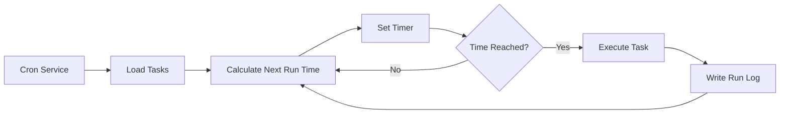

# Cron Scheduled Tasks and Webhook

## What You'll Learn

After completing this lesson, you will be able to:

- Create Cron scheduled tasks that automatically execute AI tasks at specified times or intervals
- Understand the use cases for three scheduling methods (at, every, cron)
- Configure Webhooks to receive external event triggers
- Set up Gmail Pub/Sub integration for email-triggered AI responses
- Manage task execution history and logs

## The Problem

You might encounter these situations:

- Need to remind yourself to handle certain tasks at a fixed time
- Want to regularly summarize work progress or generate reports
- Need to automatically trigger AI analysis when receiving specific emails
- Don't want to manually send messages to AI every time

## When to Use This

**Cron Scheduled Tasks** are suitable for these scenarios:

| Scenario | Example | Scheduling Method |
|----------|---------|-------------------|
| One-time reminder | "Remind me tomorrow at 9 AM to attend the meeting" | at |
| Periodic check | "Check system status every 30 minutes" | every |
| Scheduled execution | "Generate daily report every day at 5 PM" | cron |
| Complex schedule | "Every Monday to Friday at 9 AM" | cron |

**Webhooks** are suitable for these scenarios:

- Receive GitHub/GitLab push notifications
- Receive Stripe payment success notifications
- Receive Twilio incoming call notifications
- Any service capable of sending HTTP POST requests

**Gmail Pub/Sub** is suitable for these scenarios:

- Automatically analyze when receiving important emails
- Email classification and auto-reply
- Email content extraction and archiving

---

## Core Concepts

### Cron Task Workflow



### Comparison of Three Scheduling Methods

| Method | Use Case | Example | Precision |
|--------|----------|---------|-----------|
| `at` | One-time task | 2026-01-27 09:00:00 | Millisecond |
| `every` | Fixed interval | Every 30 minutes | Millisecond |
| `cron` | Complex schedule | Every day at 9 AM | Minute-level |

### Two Session Targets

| Session Target | Payload Type | Description |
|---------------|--------------|-------------|
| `main` | `systemEvent` | Inject system events into main session |
| `isolated` | `agentTurn` | Run Agent in isolated session |

**Key Constraints**:
- `sessionTarget="main"` must use `payload.kind="systemEvent"`
- `sessionTarget="isolated"` must use `payload.kind="agentTurn"`

---

## 🎒 Prerequisites

Before starting, please ensure:

::: warning Prerequisites
- [ ] Gateway is running ([Start Gateway](../../start/gateway-startup/))
- [ ] AI model is configured ([AI Model Configuration](../models-auth/))
- [ ] Understand basic Cron expression syntax (if using cron scheduling)
:::

---

## Step-by-Step

### Step 1: Check Cron Service Status

**Why**: Confirm that the Cron service is enabled and running

```bash
## Check Cron status using CLI
clawdbot cron status
```

**You should see**:

```
✓ Cron enabled
  Store: ~/.clawdbot/cron.json
  Jobs: 0
  Next wake: null
```

If it shows `disabled`, you need to enable it in the configuration file:

```json
{
  "cron": {
    "enabled": true,
    "store": "~/.clawdbot/cron.json",
    "maxConcurrentRuns": 5
  }
}
```

---

### Step 2: Create One-time Scheduled Task

**Why**: Learn the basic `at` scheduling method

Use the cron tool to add a task that executes in 1 minute:

```json
{
  "action": "add",
  "job": {
    "name": "Test Reminder",
    "enabled": true,
    "schedule": {
      "kind": "at",
      "atMs": 1738000000000
    },
    "sessionTarget": "main",
    "wakeMode": "next-heartbeat",
    "payload": {
      "kind": "systemEvent",
      "text": "This is a test reminder: Check work progress"
    }
  }
}
```

**You should see**:

```
✓ Job added: job_xxx
  Name: Test Reminder
  Next run: 2026-01-27 10:00:00
```

**Tip**: `atMs` is a Unix timestamp (in milliseconds). You can calculate it using JavaScript:

```javascript
Date.now() + 60 * 1000  // 1 minute later
```

---

### Step 3: Create Repeated Interval Task

**Why**: Learn the `every` scheduling method, suitable for periodic checks

Create a task that executes every 30 minutes:

```json
{
  "action": "add",
  "job": {
    "name": "Check System Every 30 Minutes",
    "enabled": true,
    "schedule": {
      "kind": "every",
      "everyMs": 1800000
    },
    "sessionTarget": "main",
    "wakeMode": "next-heartbeat",
    "payload": {
      "kind": "systemEvent",
      "text": "Check system status: CPU, memory, disk"
    }
  }
}
```

**You should see**:

```
✓ Job added: job_xxx
  Name: Check System Every 30 Minutes
  Interval: 30 minutes
  Next run: 2026-01-27 10:00:00
```

**Parameter Explanation**:
- `everyMs`: Interval time (milliseconds)
  - 1 minute = 60,000 ms
  - 5 minutes = 300,000 ms
  - 30 minutes = 1,800,000 ms
  - 1 hour = 3,600,000 ms
- `anchorMs` (optional): Start time for the first run

---

### Step 4: Create Cron Expression Task

**Why**: Learn the `cron` scheduling method, suitable for complex schedules

Create a task that executes every day at 9 AM:

```json
{
  "action": "add",
  "job": {
    "name": "Daily Report at 9 AM",
    "enabled": true,
    "schedule": {
      "kind": "cron",
      "expr": "0 9 * * *",
      "tz": "Asia/Shanghai"
    },
    "sessionTarget": "main",
    "wakeMode": "next-heartbeat",
    "payload": {
      "kind": "systemEvent",
      "text": "Generate today's work daily report"
    }
  }
}
```

**You should see**:

```
✓ Job added: job_xxx
  Name: Daily Report at 9 AM
  Schedule: 0 9 * * * (Asia/Shanghai)
  Next run: 2026-01-27 09:00:00
```

**Cron Expression Format**:

```
┌───────────── minute (0 - 59)
│ ┌─────────── hour (0 - 23)
│ │ ┌───────── day of month (1 - 31)
│ │ │ ┌─────── month (1 - 12)
│ │ │ │ ┌───── day of week (0 - 7, both 0 and 7 represent Sunday)
│ │ │ │ │
* * * * *
```

**Common Expressions**:

| Expression | Description |
|------------|-------------|
| `0 9 * * *` | Every day at 9 AM |
| `0 9 * * 1-5` | Monday to Friday at 9 AM |
| `0 */6 * * *` | Every 6 hours |
| `0 0 * * 0` | Every Sunday midnight |
| `0 9,17 * * *` | Every day at 9 AM and 5 PM |

::: info Time Zone Settings
Cron expressions use UTC timezone by default. Use the `tz` field to specify a timezone (such as `"Asia/Shanghai"`) to ensure tasks run at your expected time.
:::

---

### Step 5: Execute Tasks in Isolated Session

**Why**: Run AI tasks in an isolated environment to avoid interfering with the main session

Create a task that runs in an isolated session:

```json
{
  "action": "add",
  "job": {
    "name": "Daily Summary",
    "enabled": true,
    "schedule": {
      "kind": "cron",
      "expr": "0 18 * * *",
      "tz": "Asia/Shanghai"
    },
    "sessionTarget": "isolated",
    "wakeMode": "next-heartbeat",
    "payload": {
      "kind": "agentTurn",
      "message": "Summarize today's work: 1. Completed tasks 2. Issues encountered 3. Tomorrow's plan",
      "model": "anthropic/claude-sonnet-4-20250514",
      "thinking": "low"
    }
  }
}
```

**You should see**:

```
✓ Job added: job_xxx
  Name: Daily Summary
  Session: isolated
  Next run: 2026-01-27 18:00:00
```

**`agentTurn` Payload Parameters**:

| Parameter | Type | Description |
|-----------|------|-------------|
| `message` | string | Prompt sent to the Agent |
| `model` | string | Override the model to use (optional) |
| `thinking` | string | Thinking level: "off" \| "minimal" \| "low" \| "medium" \| "high" |
| `timeoutSeconds` | number | Timeout duration (seconds) |
| `deliver` | boolean | Whether to send the result to a channel |
| `channel` | string | Target channel (e.g., "whatsapp", "telegram") |
| `to` | string | Recipient identifier |
| `bestEffortDeliver` | boolean | Whether to try other channels if unable to send to the specified channel |

**Isolated Session Configuration** (optional):

```json
{
  "isolation": {
    "postToMainPrefix": "📊 Daily Summary:",
    "postToMainMode": "summary",
    "postToMainMaxChars": 8000
  }
}
```

| Parameter | Description |
|-----------|-------------|
| `postToMainPrefix` | Prefix when posting results back to main session |
| `postToMainMode` | "summary" (summary) or "full" (full text) |
| `postToMainMaxChars` | Maximum character count when `postToMainMode="full"` |

---

### Step 6: List and Manage Tasks

**Why**: View all tasks and manage their status

**List all tasks**:

```bash
clawdbot cron list
```

**You should see**:

```
Jobs: 3
  ✓ job_xxx: Test Reminder (enabled, next: 2026-01-27 10:00:00)
  ✓ job_yyy: Check System Every 30 Minutes (enabled, next: 2026-01-27 10:00:00)
  ✓ job_zzz: Daily Report at 9 AM (enabled, next: 2026-01-27 09:00:00)
```

**Include disabled tasks**:

```bash
clawdbot cron list --include-disabled
```

**Disable task**:

```json
{
  "action": "update",
  "jobId": "job_xxx",
  "patch": {
    "enabled": false
  }
}
```

**Enable task**:

```json
{
  "action": "update",
  "jobId": "job_xxx",
  "patch": {
    "enabled": true
  }
}
```

**Delete task**:

```json
{
  "action": "remove",
  "jobId": "job_xxx"
}
```

---

### Step 7: Run Task Immediately

**Why**: Test if the task works correctly without waiting for scheduling

```json
{
  "action": "run",
  "jobId": "job_xxx"
}
```

**You should see**:

```
✓ Job ran: job_xxx
  Status: ok
  Duration: 1234ms
```

**View run history**:

```json
{
  "action": "runs",
  "jobId": "job_xxx",
  "limit": 10
}
```

**You should see**:

```
Runs for job_xxx (10 most recent):
  2026-01-27 10:00:00 - ok - 1234ms
  2026-01-26 10:00:00 - ok - 1189ms
  2026-01-25 10:00:00 - ok - 1245ms
```

---

### Step 8: Add Context to Reminder Tasks

**Why**: Let AI understand recent conversation context to provide more relevant reminders

Use the `contextMessages` parameter to add recent message history:

```json
{
  "action": "add",
  "job": {
    "name": "Task Follow-up Reminder",
    "enabled": true,
    "schedule": {
      "kind": "cron",
      "expr": "0 10,16 * * *",
      "tz": "Asia/Shanghai"
    },
    "sessionTarget": "main",
    "wakeMode": "next-heartbeat",
    "payload": {
      "kind": "systemEvent",
      "text": "Follow up on your task progress: 1. Check to-do items 2. Update project status"
    },
    "contextMessages": 5
  }
}
```

**Context Message Limits**:
- Maximum number of messages: 10
- Maximum characters per message: 220
- Total character limit: 700
- Format: `- User: ...\n- Assistant: ...`

**Automatically Added Context**:

```
Follow up on your task progress: 1. Check to-do items 2. Update project status

Recent context:
- User: I need to complete the report today
- Assistant: Got it, what type of report do you need to write?
- User: It's a weekly report, including a summary of this week's work
```

---

## Webhook Configuration

### Webhook Overview

Webhooks allow external services to trigger Clawdbot's internal events via HTTP POST requests. Common use cases:

- **GitHub/GitLab**: Push notifications trigger CI/CD workflows
- **Stripe**: Payment success notifications trigger order processing
- **Twilio**: Incoming call notifications trigger AI voice response
- **Jira**: Ticket creation notifications trigger auto-reply

### Configure Webhook

**Enable Hooks System**:

```json
{
  "hooks": {
    "enabled": true,
    "path": "/hooks",
    "token": "your-secret-token-here"
  }
}
```

**Configure Mapping Rules**:

```json
{
  "hooks": {
    "enabled": true,
    "token": "your-secret-token-here",
    "mappings": [
      {
        "id": "github-push",
        "match": {
          "path": "/hooks/github"
        },
        "action": "wake",
        "wakeMode": "now",
        "sessionKey": "main",
        "messageTemplate": "GitHub push notification: {{ repository }} - {{ ref }}"
      }
    ]
  }
}
```

**Mapping Configuration Parameters**:

| Parameter | Description |
|-----------|-------------|
| `match.path` | Matching URL path |
| `match.source` | Matching request source header |
| `action` | `"wake"` or `"agent"` |
| `wakeMode` | `"now"` or `"next-heartbeat"` |
| `sessionKey` | Target session key (e.g., "main") |
| `messageTemplate` | Message template using Mustache syntax |
| `deliver` | Whether to send to a channel |
| `channel` | Target channel (e.g., "whatsapp") |
| `to` | Recipient identifier |
| `transform` | Transform module (process request body) |

---

## Gmail Pub/Sub Integration

### Gmail Pub/Sub Overview

Gmail Pub/Sub allows you to trigger Clawdbot in real-time when receiving new emails, enabling email-driven AI responses.

### Configure Gmail Pub/Sub

**Basic Configuration**:

```json
{
  "hooks": {
    "enabled": true,
    "token": "your-hook-token",
    "gmail": {
      "account": "your-email@gmail.com",
      "label": "INBOX",
      "topic": "projects/your-project-id/topics/gmail-topic",
      "subscription": "gmail-subscription",
      "pushToken": "your-push-token",
      "hookUrl": "http://127.0.0.1:18789/hooks/gmail",
      "includeBody": true,
      "maxBytes": 20000,
      "renewEveryMinutes": 720
    }
  }
}
```

**Configuration Parameters Explanation**:

| Parameter | Description | Default |
|-----------|-------------|---------|
| `account` | Gmail account address | - |
| `label` | Gmail label to monitor | `INBOX` |
| `topic` | Google Cloud Pub/Sub topic path | - |
| `subscription` | Pub/Sub subscription name | `gmail-subscription` |
| `pushToken` | Gmail push token | - |
| `hookUrl` | Webhook receiving URL | Auto-generated |
| `includeBody` | Whether to include email body | `true` |
| `maxBytes` | Maximum email bytes | `20000` |
| `renewEveryMinutes` | Subscription renewal interval (minutes) | `720` (12 hours) |

### Tailscale Integration (Optional)

**Use Tailscale Serve to Expose Webhook**:

```json
{
  "hooks": {
    "gmail": {
      "tailscale": {
        "mode": "serve",
        "path": "/gmail-pubsub",
        "target": "10000"
      }
    }
  }
}
```

**Use Tailscale Funnel**:

```json
{
  "hooks": {
    "gmail": {
      "tailscale": {
        "mode": "funnel",
        "path": "/gmail-pubsub"
      }
    }
  }
}
```

| Mode | Description |
|------|-------------|
| `off` | Don't use Tailscale |
| `serve` | Expose local service via Tailscale Serve |
| `funnel` | Access from public internet via Tailscale Funnel |

### Start Gmail Watcher

**Start Gmail Watcher Service**:

```bash
clawdbot hooks gmail-watch
```

**You should see**:

```
✓ Gmail watcher started
  Account: your-email@gmail.com
  Label: INBOX
  Watching...
```

**Gmail Watcher will**:
1. Subscribe to Gmail label changes
2. Receive new email pushes
3. Send email information to the Webhook
4. Trigger Clawdbot's internal events

---

## Checkpoint ✅

**Confirm you have mastered**:

- [ ] Able to create three types of Cron tasks (at, every, cron)
- [ ] Understand the difference between `main` and `isolated` session targets
- [ ] Able to list, enable, disable, and delete tasks
- [ ] Able to view task execution history
- [ ] Understand Webhook configuration and working principles
- [ ] Able to configure Gmail Pub/Sub integration

---

## Troubleshooting

### Task Not Executing

**Problem**: Task is added but never runs

**Possible Causes**:

| Cause | Solution |
|-------|----------|
| Cron service not enabled | Check `cron.enabled` configuration |
| Time not reached | Use `clawdbot cron list` to check next run time |
| Wrong timezone | Check if `tz` field is correct |
| Task disabled | Use `--include-disabled` to check task status |

### Cron Expression Error

**Problem**: Task runs at the wrong time

**Common Errors**:

| Wrong | Correct | Description |
|-------|---------|-------------|
| `9 * * *` | `0 9 * * *` | Missing minute field |
| `0 9 * * * *` | `0 9 * * *` | Extra field |
| `0 9 1-5 * *` | `0 9 * * 1-5` | Wrong day of week field position |

**Validation Tool**: Use [crontab.guru](https://crontab.guru/) to validate Cron expressions.

### Gmail Pub/Sub Not Working

**Problem**: Receiving emails but not triggering

**Checklist**:

- [ ] Is Gmail Watcher service running
- [ ] Is `hookUrl` accessible (test with curl)
- [ ] Is `token` configured correctly
- [ ] Are Pub/Sub topic and subscription created correctly
- [ ] Is network connection normal (when using Tailscale)

### Isolated Session Not Responding

**Problem**: Tasks with `sessionTarget="isolated"` have no output

**Possible Causes**:

- Missing `model` field, using default model but not configured
- `message` prompt is not clear enough
- `timeoutSeconds` is too short, task times out
- `deliver=false` but `postToMainMode` not configured

**Solutions**:

1. Increase log verbosity
2. Check Gateway logs
3. Use `bestEffortDeliver=true` to ensure results can at least be sent back to main session

---

## Summary

Cron and Webhooks are powerful automation tools in Clawdbot:

**Cron System**:
- Three scheduling methods: `at` (one-time), `every` (interval), `cron` (complex schedule)
- Two session targets: `main` (inject system events), `isolated` (run Agent)
- Supports task history and run logs
- Can add context messages for more relevant reminders

**Webhook System**:
- Receives external HTTP POST requests
- Supports mapping rules and message templates
- Can configure Tailscale for public internet access

**Gmail Pub/Sub**:
- Real-time monitoring of new emails
- Supports label filtering
- Integrates with Tailscale Serve/Funnel

By properly configuring these features, you can build a fully automated AI assistant that responds at the right time.

---

## Next Up

> In the next lesson, we'll learn **[Memory System and Vector Search](../memory-system/)**.
>
> You will learn:
> - File structure and indexing mechanisms of the memory system
> - Configure vector search providers (OpenAI, Gemini, local)
> - Use hybrid search (BM25 + vector) to improve retrieval accuracy
> - Manage memory indexes and search via CLI

---

## Appendix: Source Code Reference

<details>
<summary><strong>Click to expand source code locations</strong></summary>

> Last updated: 2026-01-27

| Function | File Path | Line Numbers |
|----------|-----------|--------------|
| Cron configuration type definitions | [`src/config/types.cron.ts`](https://github.com/clawdbot/clawdbot/blob/main/src/config/types.cron.ts#L1-L6) | 1-6 |
| Cron core type definitions | [`src/cron/types.ts`](https://github.com/clawdbot/clawdbot/blob/main/src/cron/types.ts#L1-L95) | 1-95 |
| Cron Service | [`src/cron/service.ts`](https://github.com/clawdbot/clawdbot/blob/main/src/cron/service.ts#L1-L49) | 1-49 |
| Cron operation implementation | [`src/cron/service/ops.ts`](https://github.com/clawdbot/clawdbot/blob/main/src/cron/service/ops.ts#L1-L141) | 1-141 |
| Cron tool implementation | [`src/agents/tools/cron-tool.ts`](https://github.com/clawdbot/clawdbot/blob/main/src/agents/tools/cron-tool.ts#L1-L291) | 1-291 |
| Gateway Cron methods | [`src/gateway/server-methods/cron.ts`](https://github.com/clawdbot/clawdbot/blob/main/src/gateway/server-methods/cron.ts#L1-L205) | 1-205 |
| Hooks configuration type definitions | [`src/config/types.hooks.ts`](https://github.com/clawdbot/clawdbot/blob/main/src/config/types.hooks.ts#L1-L125) | 1-125 |
| Hooks Gmail tool | [`src/hooks/gmail.ts`](https://github.com/clawdbot/clawdbot/blob/main/src/hooks/gmail.ts#L1-L267) | 1-267 |
| Hooks internal events | [`src/hooks/hooks.ts`](https://github.com/clawdbot/clawdbot/blob/main/src/hooks/hooks.ts#L1-L15) | 1-15 |
| Hooks CLI commands | [`src/cli/hooks-cli.ts`](https://github.com/clawdbot/clawdbot/blob/main/src/cli/hooks-cli.ts#L1-L839) | 1-839 |

**Key Constants**:
- `DEFAULT_GMAIL_LABEL = "INBOX"`: Gmail default label
- `DEFAULT_GMAIL_TOPIC = "gog-gmail-watch"`: Gmail default topic name
- `DEFAULT_GMAIL_SUBSCRIPTION = "gog-gmail-watch-push"`: Gmail default subscription name
- `DEFAULT_GMAIL_MAX_BYTES = 20000`: Gmail default maximum email bytes
- `DEFAULT_GMAIL_RENEW_MINUTES = 720`: Gmail default renewal interval (12 hours)

**Key Functions**:
- `CronService.start()`: Start Cron service
- `CronService.add()`: Add scheduled task
- `CronService.update()`: Update task
- `CronService.remove()`: Delete task
- `CronService.run()`: Run task immediately
- `createCronTool()`: Create Cron tool
- `resolveGmailHookRuntimeConfig()`: Resolve Gmail Hook configuration
- `buildGogWatchStartArgs()`: Build Gmail Watch startup parameters
- `buildGogWatchServeArgs()`: Build Gmail Watch service parameters

</details>
