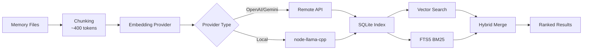

# Memory System and Vector Search: Complete Guide

## What You'll Learn

After completing this lesson, you will be able to:

- Understand Clawdbot's memory system file structure and indexing mechanism
- Configure vector search providers (OpenAI, Gemini, local)
- Use hybrid search (BM25 + vector) to improve retrieval accuracy
- Manage memory indexes and search via CLI
- Adjust embedding caching and indexing performance

## Your Current Challenge

You may be facing these situations:

- AI "forgets" previous conversation content in new sessions
- Want AI to remember persistent knowledge and preferences
- Unsure how to make AI "learn" and remember important information
- Can't find relevant context when searching historical conversations

## When to Use This

**Memory System** is suitable for these scenarios:

| Scenario | Example | Storage Location |
|--- | --- | ---|
| Persistent Knowledge | "I'm vegetarian, remember this" | MEMORY.md |
| Daily Notes | "Today's work progress and todos" | memory/YYYY-MM-DD.md |
| Session Retrieval | "What was the API endpoint we discussed last time" | Vector Index |
| Configuration Info | "Gateway running on port 18789" | MEMORY.md |

---

## Core Concepts

### Two-Layer Memory System Structure

Clawdbot uses **two layers of data** to manage long-term memory:

| Layer | File Path | Purpose | Loading Time |
|--- | --- | --- | ---|
| **Long-term Memory** | `MEMORY.md` | Selected knowledge, preferences, important facts | Loaded when main session starts |
| **Daily Logs** | `memory/YYYY-MM-DD.md` | Daily notes, runtime context | Loads today + yesterday |

::: info Why Two Layers?
`MEMORY.md` acts like a "knowledge base"—only loaded into the main session to ensure sensitive information doesn't leak into group conversations. `memory/*.md` is a "diary" that records daily activities for easy backtracking.
:::

### Vector Index Workflow



### Hybrid Search: BM25 + Vector

Vector search excels at "semantic matching" but is weak at "exact matching":

| Query Type | Vector Search | BM25 Full-Text | Hybrid Search |
|--- | --- | --- | ---|
| "Server IP address" | ❌ Weak | ✅ Strong | ✅ Best |
| "How to deploy Gateway" | ✅ Strong | ⚠️ Moderate | ✅ Best |
| "API endpoint a828e60" | ❌ Weak | ✅ Strong | ✅ Best |

**Fusion Formula**:
```javascript
finalScore = vectorWeight × vectorScore + textWeight × textScore
```

- `vectorWeight + textWeight` automatically normalizes to 1.0
- Default: 70% vector + 30% keywords
- Adjustable via `agents.defaults.memorySearch.query.hybrid.*`

---

## 🎒 Prerequisites

Before starting, please ensure:

::: warning Prerequisites Check
- [ ] Gateway is running ([Start Gateway](../../start/gateway-startup/))
- [ ] AI model is configured ([AI Model Configuration](../models-auth/))
- [ ] Familiar with basic Markdown file editing
:::

::: tip Recommended Configuration
- Prioritize OpenAI or Gemini embeddings (fast, high quality)
- Local embeddings require `pnpm rebuild node-llama-cpp`
- Initial indexing may take a few minutes, subsequent incremental updates are fast
:::

---

## Follow Along

### Step 1: Create Memory Files

**Why**: AI only indexes existing files—create memory content first

Create files in your Agent working directory (default `~/clawd`):

```bash
# Create long-term memory file
cat > ~/clawd/MEMORY.md << 'EOF'
# Personal Preferences

- Dietary preference: Vegetarian, no spicy food
- Working hours: 9 AM to 6 PM
- Common command: `clawdbot gateway status`

# Important Configuration

- Gateway port: 18789
- Database: PostgreSQL 15
EOF

# Create today's log
cat > ~/clawd/memory/$(date +%Y-%m-%d).md << 'EOF'
# Today's Work Progress

- Completed Gateway configuration
- Learned memory system
- Todo: Read model authentication documentation
EOF
```

**You should see**:

```bash
# View file structure
tree ~/clawd/
# or
ls -la ~/clawd/
ls -la ~/clawd/memory/

# Example output
~/clawd/
├── MEMORY.md
└── memory/
    └── 2026-01-27.md
```

### Step 2: Check Memory System Status

**Why**: Confirm embedding provider and index status

```bash
# Basic status check
clawdbot memory status

# Deep check (probe provider availability)
clawdbot memory status --deep

# Deep check + force re-indexing
clawdbot memory status --deep --index
```

**You should see**:

```bash
✓ Memory Search enabled
  Store: ~/.clawdbot/memory/main.sqlite
  Provider: openai
  Model: text-embedding-3-small
  Fallback: openai
  Hybrid: enabled (vectorWeight: 0.7, textWeight: 0.3)
  Cache: enabled (maxEntries: 50000)
  Sources: memory
  Indexed: 2 files, 5 chunks
```

::: tip Deep Check
- `--deep` probes whether OpenAI/Gemini/Local embeddings are available
- `--index` automatically re-indexes when "dirty" index is detected
- First run may take a few minutes
:::

### Step 3: Manually Trigger Indexing

**Why**: Ensure newly created memory files are indexed

```bash
# Manually trigger indexing
clawdbot memory index

# With detailed logs
clawdbot memory index --verbose

# Only for specific agent
clawdbot memory index --agent main
```

**You should see**:

```bash
Indexing memory for agent: main
  Provider: openai (text-embedding-3-small)
  Sources: memory
  - MEMORY.md (2 chunks)
  - memory/2026-01-27.md (3 chunks)
✓ Indexed 2 files, 5 chunks
```

### Step 4: Test Semantic Search

**Why**: Verify vector search and hybrid search work correctly

```bash
# Basic search
clawdbot memory search "vegetarian"

# Search exact match (test BM25)
clawdbot memory search "Gateway port"

# Search fuzzy semantics (test vector)
clawdbot memory search "what do I like to eat"

# View detailed results
clawdbot memory search "Gateway" --verbose
```

**You should see**:

```bash
Searching memory for: "vegetarian"

Results (2):

[1] MEMORY.md:3-5 (score: 0.842)
  - Dietary preference: Vegetarian, no spicy food

[2] memory/2026-01-27.md:1-3 (score: 0.615)
  - Completed Gateway configuration
  - Learned memory system
```

### Step 5: Configure Embedding Provider

**Why**: Choose the most suitable provider based on your needs (remote vs local)

#### Option A: OpenAI embeddings (Recommended)

Edit configuration file `~/.clawdbot/clawdbot.json`:

```json
{
  "agents": {
    "defaults": {
      "memorySearch": {
        "enabled": true,
        "provider": "openai",
        "model": "text-embedding-3-small",
        "fallback": "openai",
        "remote": {
          "apiKey": "YOUR_OPENAI_API_KEY",
          "batch": {
            "enabled": true,
            "concurrency": 2
          }
        }
      }
    }
  }
}
```

**Pros**:
- Fast, high quality
- Supports batch indexing (cost-effective)
- Suitable for large-scale backfilling

#### Option B: Gemini embeddings

```json
{
  "agents": {
    "defaults": {
      "memorySearch": {
        "provider": "gemini",
        "model": "gemini-embedding-001",
        "remote": {
          "apiKey": "YOUR_GEMINI_API_KEY"
        },
        "fallback": "openai"
      }
    }
  }
}
```

#### Option C: Local embeddings (Privacy First)

```json
{
  "agents": {
    "defaults": {
      "memorySearch": {
        "provider": "local",
        "local": {
          "modelPath": "hf:ggml-org/embeddinggemma-300M-GGUF/embeddinggemma-300M-Q8_0.gguf",
          "modelCacheDir": "~/.cache/embeddings"
        },
        "fallback": "none"
      }
    }
  }
}
```

**Notes**:

```bash
# First use of local embeddings requires building
pnpm approve-builds
# Select node-llama-cpp
pnpm rebuild node-llama-cpp
```

**You should see**:

```bash
✓ node-llama-cpp installed
✓ Local embedding model ready
```

::: warning Local Embeddings
- First run automatically downloads model (~600MB)
- Requires compiling node-llama-cpp (depends on system environment)
- Slower than remote, but fully offline and privacy-first
:::

### Step 6: Configure Hybrid Search Weights

**Why**: Adjust the weight ratio between semantic and keyword matching based on your use case

Edit configuration:

```json
{
  "agents": {
    "defaults": {
      "memorySearch": {
        "query": {
          "hybrid": {
            "enabled": true,
            "vectorWeight": 0.7,
            "textWeight": 0.3,
            "candidateMultiplier": 4
          }
        }
      }
    }
  }
}
```

**Parameter Explanation**:

| Parameter | Default | Description | Adjustment Suggestion |
|--- | --- | --- | ---|
| `vectorWeight` | 0.7 | Semantic search weight | Increase to 0.8 for "natural language" queries |
| `textWeight` | 0.3 | Keyword search weight | Increase to 0.5 for "code/ID" queries |
| `candidateMultiplier` | 4 | Candidate multiplier | Increase to 6 to improve recall |

**Compare Effects**:

```bash
# Test semantic query
clawdbot memory search "method to deploy Gateway"
# vectorWeight: 0.7 → finds semantically related results
# textWeight: 0.5 → finds "deploy", "Gateway" keywords

# Test exact query
clawdbot memory search "API endpoint a828e60"
# vectorWeight: 0.3 → ignore semantics, prioritize matching
# textWeight: 0.7 → exact match "a828e60"
```

### Step 7: Enable SQLite-vec Acceleration

**Why**: Push vector queries to SQLite to avoid loading all embeddings

Edit configuration:

```json
{
  "agents": {
    "defaults": {
      "memorySearch": {
        "store": {
          "vector": {
            "enabled": true,
            "extensionPath": "/path/to/sqlite-vec"
          }
        }
      }
    }
  }
}
```

**Check if sqlite-vec is available**:

```bash
# View index status
clawdbot memory status --deep

# If available, you'll see
✓ SQLite-vec extension loaded
  Vector table: chunks_vec
```

::: info SQLite-vec
- Attempts to load automatically by default
- Falls back to JS calculation if loading fails (no impact on functionality)
- Custom path only for special builds or non-standard installations
:::

---

## Checkpoint ✅

After completing the above steps, verify the following:

| Check Item | Verification Method | Expected Result |
|--- | --- | ---|
| Memory files exist | `ls ~/clawd/` | MEMORY.md and memory/ directory exist |
| Index created | `clawdbot memory status` | Shows Indexed > 0 chunks |
| Search works | `clawdbot memory search "..."` | Returns relevant results |
| Provider normal | `clawdbot memory status --deep` | Shows Provider type |

---

## Common Pitfalls

### Pitfall 1: Embedding Provider Failure

**Symptom**:

```bash
✗ Memory Search disabled
  Error: No API key found for provider
```

**Solution**:

```bash
# Check configuration
cat ~/.clawdbot/clawdbot.json | grep -A 5 "memorySearch"

# Confirm apiKey exists
# Or set environment variable
export OPENAI_API_KEY="sk-..."
export GEMINI_API_KEY="..."
```

### Pitfall 2: Local Embeddings Won't Load

**Symptom**:

```bash
✗ Local embedding provider failed
  Error: Cannot find module 'node-llama-cpp'
```

**Solution**:

```bash
# Approve builds
pnpm approve-builds

# Rebuild
pnpm rebuild node-llama-cpp
```

### Pitfall 3: Index Not Updating

**Symptom**:

```bash
# Modified MEMORY.md
# But search results are still old
```

**Solution**:

```bash
# Method 1: Manually trigger indexing
clawdbot memory index

# Method 2: Restart Gateway (triggers onSessionStart indexing)
clawdbot gateway restart

# Method 3: Check file watching
clawdbot memory status --verbose
# Check "Watch: true"
```

### Pitfall 4: Irrelevant Search Results

**Symptom**: Searching "Gateway" returns "work progress"

**Possible Causes**:

1. **Improper Hybrid Weights**:
    - Semantic query ("how to deploy") → Increase `vectorWeight`
    - Keyword query ("API endpoint") → Increase `textWeight`

2. **Index Not Fully Updated**:
    ```bash
    # Force re-indexing
    rm ~/.clawdbot/memory/main.sqlite
    clawdbot memory index
    ```

3. **Chunk Granularity Issue**:
    - Default 400 tokens, may cut off context
    - Adjust `agents.defaults.memorySearch.chunking.tokens`

---

## Summary

In this lesson, we learned:

1. **Memory System Architecture**
   - Two-layer data structure (MEMORY.md + memory/*.md)
   - Vector index + FTS5 full-text search
   - Hybrid retrieval (BM25 + vector)

2. **Embedding Provider Configuration**
   - Three options: OpenAI/Gemini/Local
   - Batch indexing acceleration
   - Fallback mechanism

3. **CLI Tool Usage**
   - `clawdbot memory status` to check status
   - `clawdbot memory index` to trigger indexing
   - `clawdbot memory search` to test search

4. **Performance Optimization**
   - SQLite-vec vector acceleration
   - Embedding caching
   - Hybrid weight tuning

---

## Next Lesson

> In the next lesson, we'll learn **[Security and Sandbox Isolation](../security-sandbox/)**.
>
> You'll learn:
> - Tool permission control and allowlist
> - Sandbox session isolation
> - Exec approval mechanism
> - Docker deployment
> - Tailscale authentication

---

## Appendix: Source Code Reference

<details>
<summary><strong>Click to expand source code locations</strong></summary>

> Last updated: 2026-01-27

| Function | File Path | Lines |
|--- | --- | ---|
| Memory Manager | [`src/memory/manager.ts`](https://github.com/clawdbot/clawdbot/blob/main/src/memory/manager.ts) | 1-200 |
| Hybrid Search | [`src/memory/hybrid.ts`](https://github.com/clawdbot/clawdbot/blob/main/src/memory/hybrid.ts) | 1-112 |
| Embedding Provider | [`src/memory/embeddings.ts`](https://github.com/clawdbot/clawdbot/blob/main/src/memory/embeddings.ts) | 1-80 |
| OpenAI embeddings | [`src/memory/embeddings-openai.ts`](https://github.com/clawdbot/clawdbot/blob/main/src/memory/embeddings-openai.ts) | Full |
| Gemini embeddings | [`src/memory/embeddings-gemini.ts`](https://github.com/clawdbot/clawdbot/blob/main/src/memory/embeddings-gemini.ts) | Full |
| Local embeddings | [`src/memory/node-llama.ts`](https://github.com/clawdbot/clawdbot/blob/main/src/memory/node-llama.ts) | Full |
| SQLite-vec | [`src/memory/sqlite-vec.ts`](https://github.com/clawdbot/clawdbot/blob/main/src/memory/sqlite-vec.ts) | Full |
| Batch Indexing (OpenAI) | [`src/memory/batch-openai.ts`](https://github.com/clawdbot/clawdbot/blob/main/src/memory/batch-openai.ts) | Full |
| Batch Indexing (Gemini) | [`src/memory/batch-gemini.ts`](https://github.com/clawdbot/clawdbot/blob/main/src/memory/batch-gemini.ts) | Full |
| Search Manager | [`src/memory/manager-search.ts`](https://github.com/clawdbot/clawdbot/blob/main/src/memory/manager-search.ts) | Full |
| Memory Schema | [`src/memory/memory-schema.ts`](https://github.com/clawdbot/clawdbot/blob/main/src/memory/memory-schema.ts) | Full |

**Key Configuration**:
- `agents.defaults.memorySearch.enabled`: Enable/disable memory search
- `agents.defaults.memorySearch.provider`: Embedding provider ("openai", "gemini", "local")
- `agents.defaults.memorySearch.query.hybrid.vectorWeight`: Vector search weight (default 0.7)
- `agents.defaults.memorySearch.query.hybrid.textWeight`: BM25 search weight (default 0.3)
- `agents.defaults.memorySearch.cache.enabled`: Embedding cache (default true)
- `agents.defaults.memorySearch.store.vector.enabled`: SQLite-vec acceleration (default true)

**Key Functions**:
- `mergeHybridResults()`: Merge vector + BM25 results (`src/memory/hybrid.ts:39-111`)
- `bm25RankToScore()`: Convert BM25 rank to score (`src/memory/hybrid.ts:34-37`)
- `createEmbeddingProvider()`: Create embedding provider (`src/memory/embeddings.ts`)
- `getMemorySearchManager()`: Get memory search manager (`src/memory/search-manager.ts`)

**CLI Commands**:
- `clawdbot memory status`: Check status (`src/cli/commands/memory-cli.ts`)
- `clawdbot memory index`: Trigger indexing (`src/cli/commands/memory-cli.ts`)
- `clawdbot memory search`: Search memory (`src/cli/commands/memory-cli.ts`)

</details>
