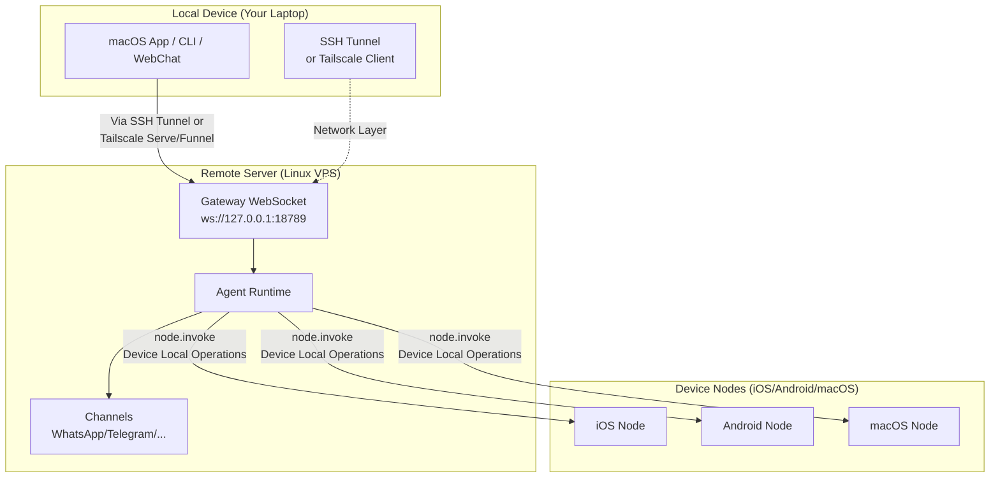

# Remote Gateway: Access Clawdbot via Tailscale and SSH Tunnel | Clawdbot Tutorial

## What You'll Learn

**Remote Gateway** frees you from device limitations by deploying your AI assistant to an Always-on Linux server. After completing this lesson, you will be able to:

- ✅ Run Clawdbot Gateway on Linux servers or VPS
- ✅ Expose Gateway to the network securely via Tailscale Serve/Funnel
- ✅ Connect to remote Gateway from clients using SSH tunnel
- ✅ Understand Gateway vs Node architecture differences (where exec runs, where device operations run)
- ✅ Configure secure remote access policies

## Your Current Challenge

You may be facing these issues:

- 🤔 "My laptop sleeps frequently, but I want the AI assistant to stay online"
- 🤔 "I want to run Gateway on a cheap VPS, but I don't know how to access it securely"
- 🤔 "What's the difference between Tailscale Serve and Funnel? Which one should I use?"
- 🤔 "SSH tunneling is too troublesome, is there a more automated solution?"

## When to Use This

**Remote Gateway** is suitable for these scenarios:

| Scenario | Recommended Solution | Reason |
|--- | --- | ---|
| Laptop sleeps frequently, need AI always online | **Tailscale Serve + Linux VPS** | VPS doesn't sleep, access securely via tailnet |
| Home desktop runs Gateway, laptop controls remotely | **SSH Tunnel** or **Tailscale Serve** | Unified Gateway session and configuration |
| Need public internet access (temporary testing) | **Tailscale Funnel + Password** | Quick exposure, but requires password protection |
| Multiple devices share one AI assistant | **Always-on Gateway** | All sessions, configurations, and history centrally managed |

::: warning Not Recommended Scenarios
If you only have one device and carry it with you frequently, you **do not need** remote Gateway. Just run Gateway directly on your local machine.
:::

## 🎒 Prerequisites

Before starting, please confirm:

- [ ] Completed **[Start Gateway](/clawdbot/clawdbot/start/gateway-startup/)** tutorial
- [ ] Basic knowledge of SSH commands (optional, if using SSH tunnel)
- [ ] (If using Tailscale) Tailscale CLI installed and logged in
- [ ] Remote Linux server or VPS ready (Ubuntu/Debian recommended)

---

## Core Concepts

### Remote Gateway Architecture

The core philosophy of Remote Gateway is: **Gateway is the control center, clients are terminals**.



### Three Key Concepts

| Concept | Explanation | Example |
|--- | --- | ---|
| **Gateway Host** | Machine running the Gateway service, owns sessions, authentication, channels, and state | Linux VPS, home desktop |
| **Client** | Tool connecting to Gateway (macOS App, CLI, WebChat) | Your laptop, phone |
| **Device Node** | Peripheral device connecting via Gateway WebSocket, executes device local operations | iOS device, Android device, macOS Node mode |

### Where Do Commands Execute?

This is the most common point of confusion:

| Operation Type | Where It Executes | Reason |
|--- | --- | ---|
| `exec` tool | **Gateway Host** | Shell commands run on the Gateway machine |
| `browser` tool | **Gateway Host** (or separate browser control server) | Browser launches on the Gateway machine |
| Node operations (`camera.snap`, `system.run`) | **Device Node** | Needs access to device local resources |

**Remember in one sentence**:
- Gateway Host → Executes general commands and runs AI
- Device Nodes → Execute device-specific local operations

---

## Follow Along

### Step 1: Install Clawdbot on Remote Server

**Why**
Linux servers are more suitable for running long-online Gateway services.

Execute on the remote server:

```bash
# 1. Install Node.js (≥22)
curl -fsSL https://deb.nodesource.com/setup_22.x | sudo -E bash -
sudo apt-get install -y nodejs

# 2. Install Clawdbot
npm install -g @clawdbot/cli

# 3. Verify installation
clawdbot --version
```

**You should see**:
```
clawdbot CLI v<version>
```

### Step 2: Run the Onboarding Wizard

**Why**
Quickly configure basic settings via an interactive wizard.

```bash
clawdbot onboard
```

Complete the wizard by:
- Selecting channels (e.g., Telegram)
- Configuring AI models (e.g., OpenAI, Anthropic)
- Setting up Gateway authentication (Token or Password)

::: tip Recommended
Configure `gateway.auth.mode: "password"` for convenient password authentication during remote connections:
```bash
export CLAWDBOT_GATEWAY_PASSWORD="your-secure-password"
```
:::

**You should see**:
```
✅ Gateway configured successfully
✅ Channels configured: telegram
✅ AI model configured: openai:gpt-4o-mini
```

### Step 3: Start Gateway Daemon

**Why**
Gateway needs to run continuously in the background.

```bash
# Start Gateway (binds to loopback by default: 127.0.0.1:18789)
clawdbot gateway start
```

**You should see**:
```
🚀 Gateway starting...
📡 WebSocket: ws://127.0.0.1:18789
🔒 Auth mode: password
```

::: tip Use systemd for Auto-start (Linux)
Create service file `/etc/systemd/system/clawdbot.service`:

```ini
[Unit]
Description=Clawdbot Gateway
After=network.target

[Service]
Type=simple
User=your-user
ExecStart=/usr/bin/clawdbot gateway start
Restart=on-failure
RestartSec=5s
Environment="CLAWDBOT_GATEWAY_PASSWORD=your-secure-password"

[Install]
WantedBy=multi-user.target
```

Start the service:
```bash
sudo systemctl enable clawdbot
sudo systemctl start clawdbot
sudo systemctl status clawdbot
```
:::

---

### Solution A: Use Tailscale Serve (Recommended)

#### Step 4: Install and Log in to Tailscale

**Why**
Tailscale Serve provides secure HTTPS access without requiring a public IP.

```bash
# Install Tailscale CLI
curl -fsSL https://tailscale.com/install.sh | sh

# Log in to Tailscale
sudo tailscale up
```

**You should see**:
```
To authenticate, visit:

    https://login.tailscale.com/a/xxxxx

----------------------------------------------------
Copy the URL and open it in your browser.
```

#### Step 5: Configure Tailscale Serve

**Why**
Expose Gateway to tailnet via Tailscale Serve while keeping Gateway loopback-only (most secure).

Modify configuration file `~/.clawdbot/clawdbot.json`:

```json5
{
  "gateway": {
    "bind": "loopback",
    "tailscale": {
      "mode": "serve",
      "resetOnExit": true
    },
    "auth": {
      "mode": "password"
    }
  }
}
```

**Configuration Explanation**:
- `bind: "loopback"`: Gateway only listens on local loopback (most secure)
- `tailscale.mode: "serve"`: Expose to tailnet via Tailscale Serve
- `resetOnExit: true`: Revoke Serve configuration on exit

#### Step 6: Restart Gateway

**Why**
Apply new Tailscale configuration.

```bash
# If using systemd
sudo systemctl restart clawdbot

# Or restart directly (if running in foreground)
clawdbot gateway restart
```

**You should see**:
```
🚀 Gateway starting...
📡 WebSocket: ws://127.0.0.1:18789
🌐 Tailscale Serve: https://your-tailnet-name.tailnet-name.ts.net/
🔒 Auth mode: password
```

#### Step 7: Connect from Client

**Why**
Verify remote Gateway accessibility.

On the client machine:

1. **Ensure joined the same Tailscale tailnet**
2. **Access Control UI**:
   ```
   https://<magicdns>/  # or https://<tailnet-ip>:18789/
   ```
3. **Connect WebSocket**:
   ```bash
   # Verify connection
   clawdbot health --url ws://<tailnet-ip>:18789 --password your-secure-password
   ```

**You should see**:
```
✅ Gateway is healthy
✅ Authenticated successfully
✅ Channels: telegram (connected)
```

---

### Solution B: Use SSH Tunnel (Universal Fallback)

#### Step 4: Configure SSH Key Authentication

**Why**
SSH key authentication is more secure than password and can be automated.

Generate key pair on the client machine:

```bash
# Generate key pair (if not already done)
ssh-keygen -t rsa -b 4096 -f ~/.ssh/clawdbot_gateway
```

**You should see**:
```
Generating public/private rsa key pair.
Enter passphrase (empty for no passphrase): [Press Enter]
Enter same passphrase again: [Press Enter]
Your identification has been saved in ~/.ssh/clawdbot_gateway
Your public key has been saved in ~/.ssh/clawdbot_gateway.pub
```

#### Step 5: Copy Public Key to Remote Server

**Why**
Make the remote server trust your client key.

```bash
# Copy public key to remote server
ssh-copy-id -i ~/.ssh/clawdbot_gateway.pub your-user@remote-server-ip
```

**You should see**:
```
Number of key(s) added: 1
Now try logging into the machine with:   "ssh 'your-user@remote-server-ip'"
```

#### Step 6: Create SSH Configuration

**Why**
Simplify SSH connection commands for future use.

Edit `~/.ssh/config` on the client machine:

```txt
Host clawdbot-remote
    HostName <remote-server-ip>
    User your-user
    IdentityFile ~/.ssh/clawdbot_gateway
    LocalForward 18789 127.0.0.1:18789
    ServerAliveInterval 60
    ServerAliveCountMax 3
```

**Configuration Explanation**:
- `LocalForward 18789 127.0.0.1:18789`: Forward local port 18789 to remote 18789
- `ServerAliveInterval 60`: Send heartbeat every 60 seconds to keep connection alive

#### Step 7: Establish SSH Tunnel

**Why**
Create a secure channel from local to remote Gateway.

```bash
# Start SSH tunnel (run in background)
ssh -N -f clawdbot-remote
```

**You should see**:
(No output, command runs in background)

#### Step 8: Verify Connection

**Why**
Confirm SSH tunnel and Gateway are both working properly.

```bash
# Check if local port forwarding succeeded
lsof -i :18789

# Test Gateway connection
clawdbot health --url ws://127.0.0.1:18789 --password your-secure-password
```

**You should see**:
```
COMMAND   PID   USER   FD   TYPE DEVICE SIZE/OFF NODE NAME
ssh      12345  user   4u  IPv4  0x1234      0t0 TCP *:18789 (LISTEN)

✅ Gateway is healthy
✅ Authenticated successfully
```

#### Step 9: Auto-start SSH Tunnel (macOS)

**Why**
Auto-start on boot without manual intervention.

Create `~/Library/LaunchAgents/com.clawdbot.ssh-tunnel.plist`:

```xml
<?xml version="1.0" encoding="UTF-8"?>
<!DOCTYPE plist PUBLIC "-//Apple//DTD PLIST 1.0//EN" "http://www.apple.com/DTDs/PropertyList-1.0.dtd">
<plist version="1.0">
<dict>
    <key>Label</key>
    <string>com.clawdbot.ssh-tunnel</string>
    <key>ProgramArguments</key>
    <array>
        <string>/usr/bin/ssh</string>
        <string>-N</string>
        <string>-f</string>
        <string>clawdbot-remote</string>
    </array>
    <key>KeepAlive</key>
    <true/>
    <key>RunAtLoad</key>
    <true/>
</dict>
</plist>
```

Load Launch Agent:

```bash
launchctl bootstrap gui/$UID ~/Library/LaunchAgents/com.clawdbot.ssh-tunnel.plist
```

**You should see**:
(No output, tunnel runs automatically in background)

::: tip Linux Auto-start (systemd user service)
Create `~/.config/systemd/user/clawdbot-ssh-tunnel.service`:

```ini
[Unit]
Description=Clawdbot SSH Tunnel
After=network.target

[Service]
Type=simple
ExecStart=/usr/bin/ssh -N clawdbot-remote
Restart=on-failure
RestartSec=5s

[Install]
WantedBy=default.target
```

Start the service:
```bash
systemctl --user enable clawdbot-ssh-tunnel
systemctl --user start clawdbot-ssh-tunnel
```
:::

---

### Solution C: Use Tailscale Funnel (Public Access, Requires Password)

::: danger Security Warning
Tailscale Funnel will expose Gateway to the public internet!
- **Must** use password authentication (`gateway.auth.mode: "password"`)
- **Only recommended** for temporary testing, not for production environments
:::

#### Step 4: Configure Funnel

**Why**
Provide public HTTPS access via Tailscale Funnel.

Modify configuration file `~/.clawdbot/clawdbot.json`:

```json5
{
  "gateway": {
    "bind": "loopback",
    "tailscale": {
      "mode": "funnel",
      "resetOnExit": true
    },
    "auth": {
      "mode": "password",
      "password": "${CLAWDBOT_GATEWAY_PASSWORD}"
    }
  }
}
```

**Important**:
- `tailscale.mode: "funnel"`: Use Tailscale Funnel (public internet access)
- `auth.mode: "password"`: Funnel requires password (otherwise refuses to start)

#### Step 5: Restart Gateway

```bash
sudo systemctl restart clawdbot
```

**You should see**:
```
🚀 Gateway starting...
🌐 Tailscale Funnel: https://your-funnel-url.ts.net/
🔒 Auth mode: password
```

#### Step 6: Connect from Public Internet

```bash
clawdbot health --url wss://your-funnel-url.ts.net --password your-secure-password
```

---

## Checkpoint ✅

After completing any of the above solutions, verify the following:

| Check Item | Command | Expected Result |
|--- | --- | ---|
| Gateway is running | `clawdbot gateway status` | ✅ Running |
| WebSocket is accessible | `clawdbot health --url <url>` | ✅ Healthy |
| Channels are connected | `clawdbot channels status` | ✅ connected |
| Nodes can be paired | `clawdbot nodes list` | Shows node list |

---

## Pitfalls

### Pitfall 1: Gateway Bound to Non-loopback

**Problem**:
```json5
{
  "gateway": {
    "bind": "lan"  // ❌ Dangerous!
  }
}
```

**Consequences**:
- Gateway listens on LAN/public IP, anyone can connect
- If authentication is not configured, **serious security risk**

**Correct Approach**:
```json5
{
  "gateway": {
    "bind": "loopback",  // ✅ Most secure
    "tailscale": {
      "mode": "serve"  // ✅ Expose via Tailscale Serve
    }
  }
}
```

### Pitfall 2: Tailscale Funnel Without Password

**Problem**:
```json5
{
  "gateway": {
    "auth": {
      "mode": "token"  // ❌ Funnel doesn't allow this!
    },
    "tailscale": {
      "mode": "funnel"
    }
  }
}
```

**Consequences**:
- Gateway refuses to start (Funnel requires password)

**Correct Approach**:
```json5
{
  "gateway": {
    "auth": {
      "mode": "password",  // ✅ Funnel must use password
      "password": "${CLAWDBOT_GATEWAY_PASSWORD}"
    },
    "tailscale": {
      "mode": "funnel"
    }
  }
}
```

### Pitfall 3: SSH Tunnel Port Conflict

**Problem**:
```
channel_setup_fwd: listen 127.0.0.1:18789: cannot listen to port: Address already in use
```

**Cause**: Local port 18789 already in use

**Solution**:
```bash
# Find process occupying the port
lsof -i :18789

# Kill conflicting process
kill -9 <PID>

# Or use a different port forwarding (need to modify client URL simultaneously)
ssh -N -L 18790:127.0.0.1:18789 clawdbot-remote
```

### Pitfall 4: macOS App Remote over SSH Not Working

**Problem**: macOS App shows "Unable to connect to Gateway"

**Check**:
1. SSH tunnel is running:
   ```bash
   ps aux | grep "ssh -N clawdbot-remote" | grep -v grep
   ```
2. Gateway Token is set:
   ```bash
   launchctl getenv CLAWDBOT_GATEWAY_TOKEN
   ```
3. App settings are correct:
   - Settings → General → "Clawdbot runs" → "On a remote machine over SSH"

**Solution**:
- Restart SSH tunnel
- Quit and restart macOS App

---

## Summary

### Key Points

- ✅ **Remote Gateway** keeps AI assistant always online, clients can connect anytime
- ✅ **Tailscale Serve** is the most secure solution (tailnet-only + HTTPS + loopback)
- ✅ **SSH Tunnel** is the universal fallback solution (no Tailscale needed)
- ✅ **Tailscale Funnel** is suitable for temporary public access (must use password)
- ✅ **Gateway Host** executes `exec` and general commands, **Device Nodes** execute device local operations

### Configuration Comparison

| Solution | Security | Access Scope | Configuration Complexity | Recommended Scenarios |
|--- | --- | --- | --- | ---|
| Tailscale Serve | ⭐⭐⭐⭐⭐ | Tailnet | Medium | **Recommended**: Always-on Gateway |
| SSH Tunnel | ⭐⭐⭐⭐ | SSH connection reachable | Low | Universal fallback, home desktop remote control |
| Tailscale Funnel | ⭐⭐ | Public Internet | Low | Temporary testing, Demo |

### Security Checklist

- [ ] Gateway bound to `loopback`
- [ ] Tailscale Funnel uses password authentication
- [ ] SSH key configured (if using SSH tunnel)
- [ ] Password set via environment variable (not written to config file)
- [ ] Regularly run `clawdbot security audit`

---

## Next Up

> In the next lesson, we'll learn **[Skill Platform and ClawdHub](../skills-platform/)**.
>
> You'll learn:
> - Skill system concepts (Bundled/Managed/Workspace)
> - How to install third-party skills from ClawdHub
> - How to create and manage custom skills
> - Skill permissions and isolation mechanisms

---

## Appendix: Source Code Reference

<details>
<summary><strong>Click to expand source code locations</strong></summary>

> Last Updated: 2026-01-27

| Feature | File Path | Line Numbers |
|--- | --- | ---|
| Gateway Remote Configuration Schema | [`src/config/types.gateway.ts`](https://github.com/clawdbot/clawdbot/blob/main/src/config/types.gateway.ts) | 200-220 |
| Gateway Tailscale Configuration Schema | [`src/config/types.gateway.ts`](https://github.com/clawdbot/clawdbot/blob/main/src/config/types.gateway.ts) | 150-180 |
| Tailscale Integration | [`src/infra/tailscale.ts`](https://github.com/clawdbot/clawdbot/blob/main/src/infra/tailscale.ts) | 1-100 |
| Remote Gateway Documentation | [`docs/gateway/remote.md`](https://github.com/clawdbot/clawdbot/blob/main/docs/gateway/remote.md) | 1-123 |
| Tailscale Documentation | [`docs/gateway/tailscale.md`](https://github.com/clawdbot/clawdbot/blob/main/docs/gateway/tailscale.md) | 1-147 |
| macOS App Remote Access Documentation | [`docs/gateway/remote-gateway-readme.md`](https://github.com/clawdbot/clawdbot/blob/main/docs/gateway/remote-gateway-readme.md) | 1-154 |
| Security Documentation | [`docs/gateway/security.md`](https://github.com/clawdbot/clawdbot/blob/main/docs/gateway/security.md) | 1-100 |

**Key Configuration Fields**:

- `gateway.bind`: Gateway bind address (`loopback`/`lan`/`tailnet`/`auto`)
- `gateway.tailscale.mode`: Tailscale mode (`off`/`serve`/`funnel`)
- `gateway.auth.mode`: Authentication mode (`token`/`password`)
- `gateway.auth.allowTailscale`: Whether to allow Tailscale identity headers (`true`/`false`)
- `gateway.remote.url`: Remote Gateway URL (CLI default)
- `gateway.remote.token`: Remote Gateway Token (CLI authentication)
- `gateway.tailscale.resetOnExit`: Revoke Serve/Funnel configuration on exit (`true`/`false`)

**Key Business Rules**:

- Gateway defaults to binding to loopback (`127.0.0.1`) [Fact]
- Tailscale Serve provides tailnet-only HTTPS access [Fact]
- Tailscale Funnel requires password authentication (`gateway.auth.mode: "password"`) [Fact]
- `gateway.remote.token` is only for remote CLI calls, does not enable local authentication [Fact]
- `gateway.bind: "tailnet"` binds directly to Tailnet IP (no Serve/Funnel needed) [Fact]

**Security Rules**:

- Loopback + SSH/Tailscale Serve is the most secure default configuration [Fact]
- Non-binding configurations (`lan`/`tailnet`/`custom`) must use authentication tokens or passwords [Fact]
- Tailscale Serve can authenticate via identity headers (`gateway.auth.allowTailscale: true`) [Fact]
- Funnel does not inject Tailscale identity headers [Fact]

</details>
