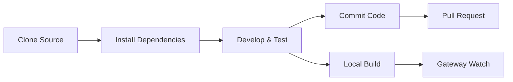

# Development Guide: From Source Build to Contributing

## What You'll Learn

After completing this tutorial, you will be able to:

- Build and run Clawdbot from source
- Develop custom plugins (channels, tools, RPC methods)
- Run unit tests and end-to-end tests
- Submit Pull Requests and contribute code to the project
- Understand project architecture and plugin system

## Your Current Challenge

You are a developer who wants to:

- Customize or extend Clawdbot functionality
- Understand how the project works internally
- Contribute code to the open-source community
- But don't know where to start: build, test, submission process?

## When to Use This

- When you need to modify source code or add new features
- When you want to develop custom plugins or channels
- When you need to debug or fix bugs
- When you want to contribute code to the project

## 🎒 Prerequisites

::: warning Prerequisites
This tutorial assumes you have the following:
:::

- **Node.js ≥22** installed (project requirement)
- **pnpm** package manager installed (recommended for building from source)
- Basic **Git** operations knowledge
- **TypeScript** development experience
- Terminal command-line proficiency

Recommended environment:
- macOS / Linux (primary development platform)
- Windows via WSL2

## Core Concepts

### Development Workflow Overview

Clawdbot's development workflow consists of four main phases:



### Key Concepts

- **Build System**: Compiles TypeScript, outputs to `dist/` directory
- **Plugin Architecture**: TypeScript modules loaded at runtime, supports extensibility
- **Gateway Daemon**: Singleton pattern, control plane and message routing
- **Test Framework**: Vitest for unit tests, Docker for end-to-end tests

### Project Structure Highlights

| Directory | Purpose |
|-----------|---------|
| `src/` | All source code (2475 TypeScript files) |
| `src/gateway/` | Gateway WebSocket server |
| `src/channels/` | Channel plugin system |
| `src/agents/` | AI Agent runtime |
| `src/plugin-sdk/` | Plugin development SDK |
| `extensions/` | Built-in plugins (e.g., voice-call) |
| `tests/` | Test files |

## Step-by-Step

### Step 1: Clone Source and Install Dependencies

**Why**
Get the latest source code and install all dependencies—the first step of development.

```bash
## Clone repository
git clone https://github.com/clawdbot/clawdbot.git
cd clawdbot

## Install dependencies (pnpm recommended)
pnpm install
```

**What you should see**: Dependencies installed successfully, no error messages.

::: info Bun Support
If you use Bun, you can run TypeScript directly without building (using `tsx`).
:::

### Step 2: Build Project

**Why**
Compile TypeScript to JavaScript and generate the distributable `dist/` directory.

```bash
## Full build
pnpm build
```

**What you should see**:
```
src/cli/entry.ts → dist/cli/entry.js
src/gateway/server.ts → dist/gateway/server.js
...
Build completed in X seconds
```

::: tip UI Build
Running `pnpm ui:build` for the first time automatically installs UI dependencies.
:::

### Step 3: Start Development Mode

**Why**
Development mode supports automatic reload without manual rebuild.

```bash
## Start Gateway development mode (auto reload)
pnpm gateway:watch

## Or start CLI development mode
CLAWDBOT_PROFILE=dev pnpm clawdbot --dev
```

**What you should see**:
- Gateway starts and listens on `ws://127.0.0.1:18789`
- Automatically recompiles and restarts when files are modified

::: tip Skip Channel Loading
Use `CLAWDBOT_SKIP_CHANNELS=1` during development to skip channel initialization and speed up startup.
:::

**Checkpoint ✅**
- Gateway successfully started and listening on port 18789
- Automatically recompiles after modifying TypeScript files

### Step 4: Run Tests

**Why**
Ensure code modifications don't break existing functionality.

#### Unit Tests

```bash
## Run all tests
pnpm test

## Run tests and watch for changes
pnpm test:watch

## Generate coverage report
pnpm test:coverage
```

**What you should see**: Test pass rate and coverage statistics.

#### End-to-End Tests

```bash
## Run Docker end-to-end tests
pnpm test:docker:all

## Or run single test suite
pnpm test:docker:live-models
```

**What you should see**: All Docker test containers run successfully and exit.

::: warning Test Requirements
End-to-end tests require Docker installed and running.
:::

**Checkpoint ✅**
- All unit tests pass
- Test coverage meets requirements (≥70%)
- End-to-end tests pass

### Step 5: Code Linting and Formatting

**Why**
Maintain consistent code style and type safety.

```bash
## Run linter
pnpm lint

## Format code
pnpm format:fix

## Run Swift linter (macOS/iOS development)
pnpm lint:swift
```

**What you should see**: No lint errors, code formatted.

::: tip Auto Formatting
Project configures pre-commit git hooks to automatically format staged files before commit.
:::

### Step 6: Develop Plugins (Optional)

**Why**
Extend Clawdbot functionality or integrate external services.

#### Quick Plugin Creation

1. Create plugin directory:
```bash
mkdir extensions/my-plugin
cd extensions/my-plugin
```

2. Create `clawdbot.plugin.json`:
```json
{
  "id": "my-plugin",
  "name": "My Plugin",
  "version": "1.0.0",
  "configSchema": {
    "type": "object",
    "properties": {
      "apiKey": { "type": "string" }
    }
  }
}
```

3. Create plugin entry `index.ts`:
```typescript
export default function (api) {
  console.log("My plugin loaded!");
  
  // Register tool
  api.registerTool({
    name: "my_tool",
    description: "My custom tool",
    execute: async (params) => {
      return { result: "Hello from my tool!" };
    }
  });
  
  // Register RPC method
  api.registerGatewayMethod("myplugin.status", ({ respond }) => {
    respond({ ok: true, status: "running" });
  });
}
```

4. Install and test:
```bash
## Development mode: link plugin
clawdbot plugins install -l extensions/my-plugin

## Restart Gateway
pnpm gateway:watch
```

::: details Plugin Types
Clawdbot supports the following plugin types:

- **Agent Tools**: Tools callable by AI
- **Channel Plugins**: New message channels (WhatsApp, Telegram, etc.)
- **Gateway RPC**: WebSocket endpoints
- **CLI Commands**: Command-line tools
- **Background Services**: Background tasks
- **Auto-reply Commands**: Quick commands without AI

See [Plugin Documentation](https://github.com/clawdbot/clawdbot/blob/main/docs/plugin.md) for details.
:::

**Checkpoint ✅**
- Plugin successfully loaded
- Can call plugin functionality via CLI or Gateway
- Plugin configuration works properly

### Step 7: Commit Code and Pull Request

**Why**
Submit your contributions to the community.

```bash
## Create feature branch
git checkout -b feature/my-feature

## Commit changes
git add .
git commit -m "feat: add my new feature"

## Push to GitHub
git push origin feature/my-feature
```

Then create a Pull Request on GitHub.

::: tip PR Guidelines
In your PR description, explain:
- **What**: Description of feature or fix
- **Why**: What problem it solves
- **Test status**: untested / lightly tested / fully tested
- **AI assistance**: Whether AI tools assisted development
:::

**Checkpoint ✅**
- Code pushed to GitHub
- Pull Request created successfully
- CI/CD checks pass (if applicable)

## Common Pitfalls

### Common Errors

| Error | Cause | Solution |
|-------|-------|----------|
| `Cannot find module 'xxx'` | Dependencies not installed | Run `pnpm install` |
| `Port 18789 already in use` | Gateway already running | Check and close old instance |
| TypeScript compilation error | Type definition issue | Run `pnpm lint` to check |
| Test timeout | Docker not started or network issue | Check Docker status |

### Development Best Practices

- **Small commits**: Each PR should do one thing for easier review
- **Write tests**: New features must have test coverage
- **Follow style**: Use project-configured linter and formatter
- **Update docs**: Update relevant documentation when modifying code
- **AI attribution**: Mark when AI tools assist development in PR

## Summary

This tutorial covered the complete Clawdbot development workflow:

✅ **Build from source**: Use `pnpm install` and `pnpm build`
✅ **Development mode**: Use `pnpm gateway:watch` for auto reload
✅ **Test framework**: Vitest unit tests + Docker end-to-end tests
✅ **Plugin development**: Extensible plugin system based on TypeScript
✅ **Contribution workflow**: Git workflow and Pull Request guidelines

Quick command reference:

| Task | Command |
|------|---------|
| Install dependencies | `pnpm install` |
| Build | `pnpm build` |
| Development mode | `pnpm gateway:watch` |
| Unit tests | `pnpm test` |
| Code linting | `pnpm lint` |
| Format | `pnpm format:fix` |

## Next Steps

Congratulations on completing the development guide! You now have:

- Ability to build and run Clawdbot from source
- Foundation for developing custom plugins
- Workflow for running tests and contributing code

Next, you might want to dive deeper into:

- [Configuration Reference](../config-reference/) - Complete configuration documentation
- [Gateway API Protocol](../api-protocol/) - WebSocket protocol specification
- [Deployment Options](../deployment/) - Docker, Nix, and other deployment methods

Keep exploring and let Clawdbot work for you!

---

## Appendix: Source Code Reference

<details>
<summary><strong>Click to expand source code locations</strong></summary>

> Last updated: 2026-01-27

| Feature | File Path | Lines |
|---------|-----------|-------|
| Build scripts | [`package.json`](https://github.com/clawdbot/clawdbot/blob/main/package.json) | 77-44 |
| Install from source | [`README.md`](https://github.com/clawdbot/clawdbot/blob/main/README.md) | 83-99 |
| Plugin documentation | [`docs/plugin.md`](https://github.com/clawdbot/clawdbot/blob/main/docs/plugin.md) | 1-639 |
| Contributing guide | [`CONTRIBUTING.md`](https://github.com/clawdbot/clawdbot/blob/main/CONTRIBUTING.md) | 1-53 |
| Architecture documentation | [`docs/concepts/architecture.md`](https://github.com/clawdbot/clawdbot/blob/main/docs/concepts/architecture.md) | 1-123 |

**Key commands**:
- `pnpm build` - Full build (package.json:85)
- `pnpm gateway:watch` - Development mode auto reload (package.json:93)
- `pnpm test` - Run unit tests (package.json:118)
- `pnpm lint` - Code linting (package.json:110)

**Key directories**:
- `src/` - Source code root (2475 TypeScript files)
- `src/plugin-sdk/` - Plugin development SDK
- `extensions/` - Built-in plugins
- `tests/` - Test files
- `dist/` - Build output directory

**Plugin-related**:
- Plugin manifest format: `clawdbot.plugin.json` (plugin.md:8-10)
- Plugin API: `api.registerTool()`, `api.registerGatewayMethod()` (plugin.md:591-600)
- Plugin config schema: JSON Schema + `uiHints` (plugin.md:36-48)

</details>
