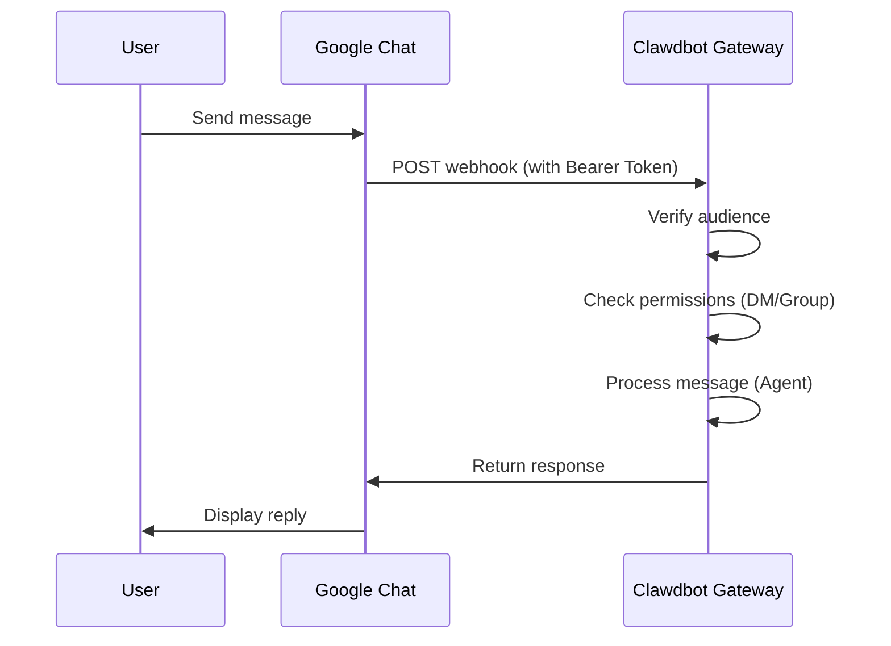

# Google Chat Channel Configuration

## What You'll Learn

- Chat 1:1 with your AI assistant in Google Chat
- Trigger AI assistant with @mentions in Google Chat Spaces
- Master Service Account authentication and Webhook configuration methods
- Learn to securely expose public URLs using Tailscale Funnel

## Your Current Situation

You want to use an AI assistant through Google Chat in your company or team, but don't know how to:

- Create and configure a Google Cloud project
- Set up Service Account authentication
- Configure Webhook to connect Google Chat to your Gateway
- Securely expose Gateway to the public internet

## When to Use This

**Scenarios suitable for using Google Chat channel**:

- Your team primarily uses Google Chat for communication
- Need to use AI assistant in Google Workspace environment
- Want to collaborate through Google Chat Spaces
- Need to receive Google Chat messages via public Webhook

**Not suitable scenarios**:

- Personal use (WebChat, Telegram, WhatsApp recommended)
- Need OAuth user authorization (Google Chat only supports Service Account)

## Core Concepts

Google Chat channel workflow:



**Key Concepts**:

| Concept | Description |
| ------- | ----------- |
| **Service Account** | Google Cloud authentication method for bot identity verification |
| **Webhook** | HTTP endpoint where Google Chat POSTs messages to Gateway |
| **Audience** | Target used to verify webhook requests (app-url or project-number) |
| **DM Pairing** | Default security mechanism, unknown senders require approval |

::: tip
Google Chat channel only supports Service Account authentication, not OAuth user authorization. If you need user-level permissions, consider using other channels.
:::

## 🎒 Prerequisites

Ensure you have:

- ✅ Completed [Quick Start](../../start/getting-started/) and installed Clawdbot
- ✅ Gateway is running (`clawdbot gateway --port 18789`)
- ✅ Have access to a Google Cloud account
- ✅ Understand basic terminal command usage

::: warning
Google Chat Webhook requires a public HTTPS endpoint. This tutorial will cover how to use Tailscale Funnel or reverse proxy to securely expose the service.
:::

## Follow Along

### Step 1: Create Google Cloud Project and Enable Chat API

**Why**
You first need a Google Cloud project to host the Chat application and Service Account.

1. Visit [Google Chat API Credentials](https://console.cloud.google.com/apis/api/chat.googleapis.com/credentials)
2. If the API is not enabled, click **Enable API**

**You Should See**:
- Chat API is enabled and displays "API enabled"
- Enter Credentials management page

### Step 2: Create Service Account

**Why**
Service Account is the bot identity used to authenticate webhook requests.

1. On the Credentials page, click **Create Credentials** > **Service Account**
2. Enter a name (e.g., `clawdbot-chat`)
3. Click **Continue** (skip permission settings)
4. Keep access control empty, click **Done**

**You Should See**:
- The newly created Service Account appears in the list

### Step 3: Create and Download JSON Key

**Why**
JSON Key contains authentication credentials, which Clawdbot needs to verify Google Chat requests.

1. Click the Service Account you just created
2. Go to **Keys** tab
3. Click **Add Key** > **Create new key**
4. Select **JSON** format, click **Create**
5. The downloaded JSON file will be automatically saved

**You Should See**:
- Browser downloads a `.json` file

::: warning
⚠️ Important: This JSON Key can only be downloaded once, please keep it safe! If lost, you must recreate it.
:::

### Step 4: Store Service Account File

**Why**
Clawdbot needs to read the Key file to verify Google Chat requests.

1. Move the downloaded JSON file to a secure location:
   ```bash
   mv ~/Downloads/*.json ~/.clawdbot/googlechat-service-account.json
   ```
2. Set file permissions (optional but recommended):
   ```bash
   chmod 600 ~/.clawdbot/googlechat-service-account.json
   ```

**You Should See**:
- File is stored in `~/.clawdbot/` directory
- Permissions set to read/write for owner only

### Step 5: Create Google Chat Application

**Why**
Chat App defines the bot's appearance, behavior, and webhook URL.

1. Visit [Google Cloud Console Chat Configuration](https://console.cloud.google.com/apis/api/chat.googleapis.com/hangouts-chat)
2. Fill in **Application info**:
   - **App name**: `Clawdbot` (or other name)
   - **Avatar URL**: `https://clawd.bot/logo.png` (optional)
   - **Description**: `Personal AI Assistant` (optional)
3. Enable **Interactive features**
4. Under **Functionality**, check **Join spaces and group conversations**
5. Under **Connection settings**, select **HTTP endpoint URL**
6. Under **Visibility**, select **Make this Chat app available to specific people and groups in &lt;Your Domain&gt;**
7. Enter your Google Workspace email (e.g., `user@example.com`)
8. Click **Save** at the bottom of the page

**You Should See**:
- App configuration is saved
- Page displays "App status" section

### Step 6: Configure Webhook Triggers

**Why**
Triggers define when Google Chat sends messages to Gateway.

1. Refresh the page after saving
2. Find **App status** section (usually at top or bottom)
3. Change status to **Live - available to users**
4. Click **Save** again

**You Should See**:
- App status shows as "Live - available to users"

::: info
💡 Tip: Webhook URL will be configured in Step 7. If uncertain, you can use a placeholder `https://example.com/googlechat` first and update it later.
:::

### Step 7: Get Gateway's Public URL

**Why**
Google Chat needs a public HTTPS URL to send webhook requests.

Run the following command to view Gateway's public URL:

```bash
clawdbot status
```

**You Should See**:
- Output contains public URL (e.g., `https://your-node.tailnet.ts.net`)

::: warning
If Gateway is not configured with Tailscale or reverse proxy, you need to set up public access first (see next step).
:::

### Step 8: Expose Webhook Endpoint (Choose One)

::: tip
Tailscale Funnel is recommended, as it can only expose the `/googlechat` path, keeping other endpoints private.
:::

#### Option A: Tailscale Funnel (Recommended)

**Why Tailscale Funnel**
- Only exposes specific paths, improving security
- Internal Gateway remains private, only Webhook is accessible
- No need to purchase domain and configure SSL

1. **Check Gateway bind address**:
   ```bash
   ss -tlnp | grep 18789
   ```
   Note down the IP address (e.g., `127.0.0.1`, `0.0.0.0` or Tailscale IP like `100.x.x.x`)

2. **Expose control panel to tailnet only** (port 8443):
   ```bash
   # If binding to localhost (127.0.0.1 or 0.0.0.0):
   tailscale serve --bg --https 8443 http://127.0.0.1:18789
   
   # If binding to Tailscale IP (e.g., 100.106.161.80):
   tailscale serve --bg --https 8443 http://100.106.161.80:18789
   ```

3. **Expose Webhook path publicly**:
   ```bash
   # If binding to localhost (127.0.0.1 or 0.0.0.0):
   tailscale funnel --bg --set-path /googlechat http://127.0.0.1:18789/googlechat
   
   # If binding to Tailscale IP (e.g., 100.106.161.80):
   tailscale funnel --bg --set-path /googlechat http://100.106.161.80:18789/googlechat
   ```

4. **Authorize node to access Funnel** (if prompted):
   - Visit the authorization URL shown in the output
   - Enable Funnel for that node in Tailscale admin panel

5. **Verify configuration**:
   ```bash
   tailscale serve status
   tailscale funnel status
   ```

**You Should See**:
- Both Serve and Funnel are running
- Public Webhook URL: `https://<node-name>.<tailnet>.ts.net/googlechat`
- Private control panel: `https://<node-name>.<tailnet>.ts.net:8443/`

#### Option B: Caddy Reverse Proxy

**Why Caddy**
- Supports automatic HTTPS
- Flexible path routing configuration

1. Create Caddyfile:
   ```txt
   your-domain.com {
       reverse_proxy /googlechat* localhost:18789
   }
   ```

2. Start Caddy:
   ```bash
   caddy run --config Caddyfile
   ```

**You Should See**:
- Caddy has started and is listening on port 443
- Only `your-domain.com/googlechat` path routes to Gateway

#### Option C: Cloudflare Tunnel

**Why Cloudflare Tunnel**
- Free global CDN
- Simple path rule configuration

1. Configure tunnel ingress rules:
   - **Path**: `/googlechat` -> `http://localhost:18789/googlechat`
   - **Default Rule**: HTTP 404 (Not Found)

### Step 9: Update Google Chat Webhook URL

**Why**
Now that you have a public URL, update Chat App configuration to point to the correct endpoint.

1. Return to Google Cloud Console Chat Configuration page
2. In **Triggers** section:
   - Select **Use a common HTTP endpoint URL for all triggers**
   - Set to: `<your public URL>/googlechat`
   - Example: `https://your-node.tailnet.ts.net/googlechat`
3. Click **Save**

**You Should See**:
- Triggers are updated and saved

### Step 10: Configure Clawdbot

**Why**
Tell Clawdbot which Service Account and Webhook path to use.

**Method A: Environment Variables**

```bash
export GOOGLE_CHAT_SERVICE_ACCOUNT_FILE="/path/to/service-account.json"
clawdbot gateway restart
```

**Method B: Configuration File**

Edit `~/.clawdbot/clawdbot.json`:

```json5
{
  channels: {
    googlechat: {
      enabled: true,
      serviceAccountFile: "/Users/yourname/.clawdbot/googlechat-service-account.json",
      audienceType: "app-url",
      audience: "https://your-node.tailnet.ts.net/googlechat",
      webhookPath: "/googlechat",
      dm: {
        policy: "pairing",
        allowFrom: ["users/1234567890", "your-email@example.com"]
      },
      groupPolicy: "allowlist",
      groups: {
        "spaces/AAAA": {
          allow: true,
          requireMention: true,
          users: ["users/1234567890"],
          systemPrompt: "Short answers only."
        }
      }
    }
  }
}
```

**Restart Gateway**:

```bash
clawdbot gateway restart
```

**You Should See**:
- Gateway starts and displays "Google Chat default: enabled, configured, ..."
- No error logs

### Step 11: Add Bot to Google Chat

**Why**
Final step: find and add the bot in Google Chat.

1. Visit [Google Chat](https://chat.google.com/)
2. Click **+** (plus sign) icon next to **Direct Messages**
3. Enter **App name** (name configured in Step 5) in the search box (usually where you add contacts)
   - **Note**: The bot will not appear in the "Marketplace" browsing list because it's a private app. You must search by name.
4. Select your bot from the results
5. Click **Add** or **Chat** to start 1:1 conversation

**You Should See**:
- Bot appears in contacts list
- Chat window opens

### Step 12: Send Test Message

**Why**
Verify configuration is correct and messages are being delivered properly.

Enter in the chat window:

```
Hello
```

**You Should See**:
- Bot responds with greeting or confirmation message
- Gateway logs show received and processed messages

## Checkpoint ✅

Verify configuration success:

```bash
# Check channel status
clawdbot channels status

# Should display:
# Google Chat default: enabled, configured, webhook listening
```

::: info
If you see errors, run `clawdbot channels status --probe` to view detailed diagnostic information.
:::

## Configuration Details

### Service Account Authentication

| Config | Type | Default | Description |
| ------ | ---- | ------- | ----------- |
| `serviceAccountFile` | string | - | Service Account JSON file path |
| `serviceAccount` | string\|object | - | Inline JSON credentials (alternative to file path) |
| `audienceType` | "app-url"\|"project-number" | "app-url" | Verification type: URL or project number |
| `audience` | string | - | Audience value (URL or project number) |

### DM Policy

By default, unknown senders need pairing:

| Config | Type | Default | Description |
| ------ | ---- | ------- | ----------- |
| `dm.enabled` | boolean | undefined | Whether to enable DM receiving |
| `dm.policy` | "pairing"|"open" | "pairing" | Access policy: pairing or open |
| `dm.allowFrom` | array | [] | Allowed sender list (user IDs or emails) |

**Pair new senders**:

```bash
clawdbot pairing approve googlechat <pairing code>
```

### Group Policy

| Config | Type | Default | Description |
| ------ | ---- | ------- | ----------- |
| `groupPolicy` | "allowlist"|"disabled" | "allowlist" | Group policy: allowlist or disabled |
| `requireMention` | boolean | true | Whether @mention is required to trigger |
| `groups` | object | {} | Configuration by space ID |

**Allow specific groups**:

```json5
{
  channels: {
    googlechat: {
      groups: {
        "spaces/AAAA": {
          allow: true,
          requireMention: true,
          users: ["users/1234567890"],
          systemPrompt: "Short answers only."
        }
      }
    }
  }
}
```

### Other Configuration

| Config | Type | Default | Description |
| ------ | ---- | ------- | ----------- |
| `webhookPath` | string | "/googlechat" | Webhook path |
| `botUser` | string | - | Bot user resource name (for mention detection) |
| `typingIndicator` | "none"|"message"|"reaction" | "message" | Typing indicator mode |
| `actions.reactions` | boolean | false | Whether to support emoji reactions |
| `mediaMaxMb` | number | undefined | Maximum media file size (MB) |

## Common Pitfalls

### 405 Method Not Allowed

**Symptom**: Google Cloud Logs Explorer shows `405 Method Not Allowed`

**Cause**: Webhook handler not registered

**Solution**:

1. Confirm `channels.googlechat` section exists in configuration:
   ```bash
   clawdbot config get channels.googlechat
   ```

2. Check plugin status:
   ```bash
   clawdbot plugins list | grep googlechat
   ```

3. If shows "disabled", add configuration:
   ```json5
   {
     plugins: {
       entries: {
         googlechat: {
           enabled: true
         }
       }
     }
   }
   ```

4. Restart Gateway:
   ```bash
   clawdbot gateway restart
   ```

### No Messages Received

**Symptom**: No response after sending messages

**Troubleshooting Steps**:

1. Run `clawdbot logs --follow` and send a test message
2. Confirm Chat App's Webhook URL and event subscription
3. Check if `audience` configuration is correct
4. If mention gating blocks replies, set `botUser` and verify `requireMention`

### Tailscale Funnel Cannot Start

**Symptom**: `tailscale funnel` reports error

**Cause**: Password authentication not set

**Solution**:

Add to `~/.clawdbot/clawdbot.json`:

```json5
{
  gateway: {
    auth: {
      mode: "password"
    }
  }
}
```

## Lesson Summary

- Created Google Cloud project and Service Account
- Configured Google Chat App and Webhook
- Exposed endpoint using Tailscale Funnel or reverse proxy
- Configured Clawdbot to use Service Account authentication
- Learned DM pairing and group @mention mechanism
- Tested 1:1 and group messages

## Next Lesson Preview

> In the next lesson, we'll learn about **[Signal Channel](../signal/)**.
>
> You'll learn:
> - How to install and configure signal-cli
> - Signal channel permissions and access control
> - Configuration differences compared to Google Chat

---

## Appendix: Source Code Reference

<details>
<summary><strong>Click to expand source code locations</strong></summary>

> Last updated: 2026-01-27

| Feature | File Path | Lines |
| ------- | --------- | ----- |
| Google Chat Config Type Definition | [`src/config/types.googlechat.ts`](https://github.com/clawdbot/clawdbot/blob/main/src/config/types.googlechat.ts) | 1-109 |
| Google Chat Zod Schema | [`src/config/zod-schema.providers-core.ts`](https://github.com/clawdbot/clawdbot/blob/main/src/config/zod-schema.providers-core.ts) | 273-341 |
| Channel Registry | [`src/channels/registry.ts`](https://github.com/clawdbot/clawdbot/blob/main/src/channels/registry.ts) | 61-67 |
| Group Mention Parsing | [`src/channels/plugins/group-mentions.ts`](https://github.com/clawdbot/clawdbot/blob/main/src/channels/plugins/group-mentions.ts) | 158-175 |
| Google Chat Documentation | [`docs/channels/googlechat.md`](https://github.com/clawdbot/clawdbot/blob/main/docs/channels/googlechat.md) | 1-221 |

**Key Types**:
- `GoogleChatConfig`: Complete Google Chat configuration interface
- `GoogleChatDmConfig`: DM access policy configuration
- `GoogleChatGroupConfig`: Group space configuration
- `GoogleChatActionConfig`: Action configuration (such as emoji reactions)

**Key Configuration Fields**:
- `audienceType`: "app-url" or "project-number", used to verify webhook requests
- `audience`: Webhook URL or project number, paired with `audienceType`
- `dm.policy`: Default "pairing", controls unknown DM access
- `groupPolicy`: Group access policy, "allowlist" or "disabled"

**Authentication Mechanism**:
- Uses Google Service Account JSON credentials
- Webhook requests verified via `Authorization: Bearer <token>` header
- Token compared against `audience` configuration to ensure requests come from legitimate sources

</details>
