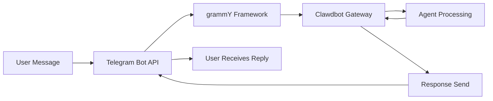

# Telegram Channel Configuration & Usage

## What You'll Learn

- 🤖 Create a Bot in Telegram and obtain Bot Token
- ⚙️ Configure Telegram channel connection to Clawdbot
- 🔒 Control DM and group access permissions (pairing mechanism and allowlist)
- 📡 Set up group mention rules and response strategies
- 🔌 Configure Webhook mode (optional)
- 🎯 Use Telegram Bot API features (inline buttons, topics, replies)

## Your Current Situation

You're already using Clawdbot on Telegram, but facing these issues:

- ❌ Unsure how to correctly configure Bot Token
- ❌ Bot doesn't respond when strangers send messages
- ❌ In groups, Bot doesn't respond to non-mention messages
- ❌ Want fine-grained control over who can access the Bot, but don't know how to configure it
- ❌ Heard about the difference between Webhook and Long-polling, but don't know which to choose

This tutorial will help you solve these problems step by step.

## When to Use This

Scenarios suitable for using Telegram channel:

- ✅ You're already using Telegram and want to chat with AI assistant on this platform
- ✅ You need Bot to respond to specific users or commands in groups
- ✅ You want to use special Telegram Bot API features (inline buttons, Forum topics)
- ✅ Your server's network environment is suitable for Long-polling or Webhook

**If you primarily use WhatsApp or other channels**: You can skip this lesson and focus on the channel you use.

## 🎒 Prerequisites

Before starting, make sure you have:

- [ ] Completed the [Quick Start](../../start/getting-started/) tutorial, Clawdbot is installed and can be started
- [ ] A Telegram account (Premium not required)
- [ ] Understanding of basic Telegram Bot concepts (Bot, Token, Privacy Mode)

::: info Configuration File Location
By default, Clawdbot's configuration file is located at:
- **Linux/macOS**: `~/.clawdbot/clawdbot.json`
- **Windows**: `%USERPROFILE%\.clawdbot\clawdbot.json`
:::

## Core Concepts

### Telegram Bot API vs Other Channels

Unlike other instant messaging platforms, Telegram uses a **Bot API** architecture:

| Feature | Telegram | WhatsApp | Slack |
| ------- | -------- | -------- | ---- |
| Connection | Bot API (HTTP) | Web Client | Bot API + WebSocket |
| Message Mode | Push (Bot actively sends) | Pull (listen to Web Client) | Pull (listen to WebSocket) |
| Privacy Mode | **Supported** (Bot optional) | N/A | N/A |
| Group Support | SuperGroup + Forum | Groups | Channels + Workspace |
| Special Features | Forum topics, inline buttons | - | - |

### Clawdbot's Integration Approach

Clawdbot integrates with Telegram using the [grammY](https://grammy.dev/) Bot API framework:



**Key Points**:
- **Long-polling**: Default mode, Clawdbot actively pulls Telegram updates
- **Webhook**: Optional mode, Telegram pushes updates to your server
- **DM Pairing**: Enabled by default, strangers must pair before sending messages
- **Group Mentions**: Enabled by default, Bot only responds to `@botname` or configured mention patterns

### Access Control Mechanism

Clawdbot provides three layers of access control:

1. **DM Level** (`dmPolicy`)
   - `pairing`: Unknown users receive a pairing code and must be approved first
   - `allowlist`: Only allow users on the allowlist
   - `open`: Allow all DMs (requires configuring `allowFrom: ["*"]`)

2. **Group Level** (`groups` + `groupPolicy`)
   - List which groups can access the Bot
   - Set `requireMention` rules for each group

3. **Sender Level** (`allowFrom` + `groupAllowFrom`)
   - Further restrict who can send messages within allowed DMs/groups

::: warning Secure Default
The default DM policy is `pairing`, which is the most secure default. Messages from strangers are ignored until you approve the pairing code.
:::

## Follow Along

### Step 1: Create Telegram Bot and Get Token

**Why**
Telegram Bot needs Bot Token to access and send messages through the Bot API. This Token is equivalent to the Bot's "identity credential."

**Steps**

1. Search and open **@BotFather** in Telegram
2. Send command `/newbot`
3. Follow the prompts:
   - Enter Bot name (e.g., `My Clawdbot Assistant`)
   - Enter Bot username (must end with `bot`, e.g., `my_clawdbot_bot`)
4. BotFather will return Bot Token, formatted like: `123456:ABC-DEF123456`

**You Should See**:
```
Done! Congratulations on your new bot.

You can find it at t.me/my_clawdbot_bot. You can now add a description,
about section and profile picture for it, see /help for a list of commands.

Use this token to access the HTTP API:
123456:ABC-DEF1234567890

Keep your token secure and store it safely, it can be used by anyone
to control your bot.
```

::: tip Security Advice
- 🔐 Immediately copy and save the Token to a secure place (like a password manager)
- ⚠️ **Never** share your Token in public repositories, social media, or with others
- 🔄 If Token is leaked, immediately use the `/revoke` command in @BotFather to revoke it
:::

**Optional BotFather Configuration** (Recommended)

1. Set group permissions:
   - `/setjoingroups` → Choose whether to allow Bot to be added to groups
   - `/setprivacy` → Control whether to see all group messages

2. Set Bot information:
   - `/setdescription` → Add description
   - `/setabouttext` → Add about text
   - `/setuserpic` → Upload profile picture

### Step 2: Configure Telegram Channel

**Why**
Configuration file tells Clawdbot how to connect to Telegram Bot API, and how to handle messages and permissions.

**Steps**

Create or edit `~/.clawdbot/clawdbot.json`:

```json5
{
  "channels": {
    "telegram": {
      "enabled": true,
      "botToken": "123456:ABC-DEF1234567890",
      "dmPolicy": "pairing"
    }
  }
}
```

**Configuration Field Description**:

| Field | Type | Default | Description |
| ----- | ---- | ------- | ----------- |
| `enabled` | boolean | `true` | Whether to enable Telegram channel |
| `botToken` | string | - | Bot Token (required) |
| `dmPolicy` | string | `"pairing"` | DM access policy |
| `allowFrom` | array | `[]` | DM allowlist (user ID or @username) |
| `groupPolicy` | string | `"allowlist"` | Group access policy |
| `groupAllowFrom` | array | `[]` | Group sender allowlist |
| `groups` | object | `{}` | Group detailed configuration |

**Environment Variable Method** (Optional)

You can also use environment variables (for default account):

```bash
export TELEGRAM_BOT_TOKEN="123456:ABC-DEF1234567890"
```

::: tip Environment Variable Priority
If both environment variables and configuration file are configured:
- **Configuration file takes priority** (`channels.telegram.botToken`)
- Environment variable serves as **fallback for default account**
:::

### Step 3: Start Gateway and Verify Connection

**Why**
Starting Gateway allows it to connect to Telegram Bot API based on configuration and start listening for messages.

**Steps**

1. Start Gateway in terminal:

```bash
# Method 1: Direct start
clawdbot gateway --verbose

# Method 2: Using daemon
clawdbot gateway --port 18789 --verbose
```

2. Observe Gateway's startup logs, look for Telegram-related information

**You Should See**:
```
[INFO] Starting Gateway...
[INFO] Loading config from ~/.clawdbot/clawdbot.json
[INFO] Starting channels...
[INFO] Starting Telegram channel...
[INFO] Telegram bot connected: @my_clawdbot_bot
[INFO] Listening for updates (long-polling)...
```

::: tip View Detailed Logs
Using the `--verbose` flag shows more detailed logs, including:
- Every received message
- Session routing decisions
- Permission check results
:::

**Checkpoint ✅**

- [ ] Gateway starts successfully without errors
- [ ] Logs show "Telegram bot connected"
- [ ] No "Authentication failed" or "Invalid token" errors

### Step 4: Test Bot in Telegram

**Why**
Send the first message to verify Bot is correctly connected, configuration takes effect, and can receive and reply to messages.

**Steps**

1. Search for your Bot username in Telegram (e.g., `@my_clawdbot_bot`)
2. Click "Start" button or send `/start` command
3. If it's the first DM contact, you should receive a pairing code

**You Should See**:
```
👋 Hi! I'm your Clawdbot assistant.

To get started, please approve this pairing code:
CLAW-ABC123

Run this command in your terminal:
clawdbot pairing approve telegram CLAW-ABC123
```

**If Bot Doesn't Respond**:

| Issue | Possible Cause | Solution |
| ----- | ------------- | -------- |
| Bot unresponsive | Bot Token incorrect | Check `botToken` value in `clawdbot.json` |
| Bot unresponsive | Gateway not started | Run `clawdbot gateway --verbose` to view errors |
| Bot unresponsive | Network issues | Check if server can access `api.telegram.org` |
| Bot unresponsive | Bot blocked | Check Bot status in @BotFather |

### Step 5: Approve DM Pairing (If Applicable)

**Why**
Default DM policy is `pairing`, strangers need your approval before sending messages to the Bot. This ensures security.

**Steps**

1. Run pairing command in terminal:

```bash
# View pending pairings
clawdbot pairing list telegram

# Approve pairing code
clawdbot pairing approve telegram CLAW-ABC123
```

2. After successful pairing, users can send messages to Bot normally

**You Should See**:
```
✅ Pairing approved: telegram:user:123456789

User @username can now send messages to the bot.
```

::: tip Pairing Code Expiration
Pairing codes expire after 1 hour. Users need to send `/start` command again to get a new code.
:::

## Group Configuration

### Get Group Chat ID

To configure group access control, you first need to know the group's Chat ID.

**Method 1: Use Third-Party Bot** (Fast but not recommended)

1. Add your Bot to the group
2. Forward any message from the group to `@userinfobot`
3. Bot will return group information, including Chat ID

**Method 2: Use Gateway Logs** (Recommended)

1. Send any message to Bot in the group
2. Run:

```bash
clawdbot logs --follow
```

3. Look for `chat.id` field in logs, group ID is usually negative (e.g., `-1001234567890`)

**You Should See**:
```
[INFO] Received message from chat: -1001234567890
```

### Configure Group Access

**Method 1: Allow All Groups**

```json5
{
  "channels": {
    "telegram": {
      "groups": {
        "*": {
          "requireMention": true
        }
      }
    }
  }
}
```

**Method 2: Allow Only Specific Groups**

```json5
{
  "channels": {
    "telegram": {
      "groups": {
        "-1001234567890": {
          "requireMention": false
        },
        "-1009876543210": {
          "requireMention": true
        }
      }
    }
  }
}
```

**Method 3: Always Respond in Group** (No mention required)

```json5
{
  "channels": {
    "telegram": {
      "groups": {
        "-1001234567890": {
          "requireMention": false
        }
      }
    }
  }
}
```

### Telegram Privacy Mode Settings

If Bot **doesn't respond to non-mention messages** in groups, it might be privacy mode restriction.

**Check Steps**:

1. Run `/setprivacy` in @BotFather
2. Select **Disable** (turn off privacy mode)
3. **Important**: Telegram requires you to remove and re-add Bot from the group for settings to take effect
4. Re-add Bot to the group

::: warning Privacy Mode Impact
- ✅ **Privacy Mode OFF**: Bot can see all group messages (requires `requireMention: false` to respond to all messages)
- ⚠️ **Privacy Mode ON**: Bot only sees @mentions or messages where Bot is replied to (default)
- 🛡️ **Bot is Admin**: Admin Bot can see all messages regardless of privacy mode
:::

### In-Session Group Activation

You can also use commands to dynamically switch group response behavior (session level, lost after restart):

- `/activation always` — Respond to all messages in group
- `/activation mention` — Only respond to mentions (default)

::: tip Recommended Configuration
For persistent behavior, it's recommended to configure `groups.requireMention` in `clawdbot.json` rather than relying on commands.
:::

## Advanced Configuration

### Webhook Mode (Optional)

By default, **Long-polling** is used (actively pulling updates). If you have a public server, you can use Webhook mode.

**Configure Webhook**:

```json5
{
  "channels": {
    "telegram": {
      "webhookUrl": "https://your-domain.com/telegram-webhook",
      "webhookSecret": "your-secret-token"
    }
  }
}
```

**Webhook vs Long-polling**:

| Feature | Long-polling | Webhook |
| ------- | ------------ | ------- |
| Network Requirement | Need to actively access `api.telegram.org` | Need public HTTPS endpoint |
| Latency | ~1-3 second polling interval | Near real-time push |
| Server Resources | Higher (continuous polling) | Lower (passive receive) |
| Suitable Scenarios | Home server, no public IP | VPS, has domain |

::: tip Local Webhook Testing
If you want to test Webhook locally:
- Use `ngrok` or `localtunnel` to create temporary tunnel
- Configure tunnel URL as `webhookUrl`
- Gateway will listen to `/telegram-webhook` on `0.0.0.0:8787`
:::

### Media Size Limit

Control media file size sent and received in Telegram:

```json5
{
  "channels": {
    "telegram": {
      "mediaMaxMb": 10
    }
  }
}
```

- Default: 5MB
- Media exceeding limit will be rejected

### Message Chunking Configuration

Telegram has a limit on text length per message (about 4096 characters). Clawdbot automatically chunks long messages.

```json5
{
  "channels": {
    "telegram": {
      "textChunkLimit": 4000,
      "chunkMode": "length"
    }
  }
}
```

**Chunking Modes**:

- `"length"`: Chunk by character count (default)
- `"newline"`: First split by blank lines (preserve paragraphs), then chunk by length

### Forum Topic Support

Telegram Forum supergroups support topics. Clawdbot creates independent sessions for each topic.

```json5
{
  "channels": {
    "telegram": {
      "groups": {
        "-1001234567890": {
          "topics": {
            "12345": {
              "requireMention": false,
              "systemPrompt": "You are a specialist in this topic."
            }
          }
        }
      }
    }
  }
}
```

**Topic Session Key Format**:
```
agent:main:telegram:group:-1001234567890:topic:12345
```

### Inline Buttons

Telegram supports interactive buttons (Inline Buttons).

**Enable Buttons**:

```json5
{
  "channels": {
    "telegram": {
      "capabilities": {
        "inlineButtons": "allowlist"
      }
    }
  }
}
```

**Button Scope**:

- `"off"`: Disable buttons
- `"dm"`: Only allow in DMs
- `"group"`: Only allow in groups
- `"all"`: DM + groups
- `"allowlist"`: DM + groups, but only allow senders in `allowFrom`

**Send Buttons via Agent**:

Use `sendMessage` action of `telegram` tool:

```json5
{
  "action": "send",
  "channel": "telegram",
  "to": "123456789",
  "message": "Choose an option:",
  "buttons": [
    [
      {"text": "Yes", "callback_data": "yes"},
      {"text": "No", "callback_data": "no"}
    ],
    [
      {"text": "Cancel", "callback_data": "cancel"}
    ]
  ]
}
```

**Button Callback Handling**:

When user clicks a button, Agent receives a message formatted like `callback_data: value`.

### Reaction Notifications

Control whether Agent receives user reactions (emoji) to messages.

```json5
{
  "channels": {
    "telegram": {
      "reactionNotifications": "all",
      "reactionLevel": "minimal"
    }
  }
}
```

**Reaction Notification Modes**:

- `"off"`: Ignore all reactions
- `"own"`: Only notify reactions to Bot messages (default)
- `"all"`: Notify all reactions

**Agent Reaction Level**:

- `"off"`: Agent cannot send reactions
- `"ack"`: Send acknowledgement reaction 👀 when processing
- `"minimal"`: Use reactions sparingly (once every 5-10 exchanges, default)
- `"extensive"`: Use reactions freely

## Common Pitfalls

### Common Configuration Errors

| Error | Symptom | Cause | Solution |
| ----- | ------- | ----- | -------- |
| Token format error | "Invalid token" error | Copied incomplete Token | Check if Token is complete (includes colon) |
| Environment variable conflict | Bot uses different Token | Environment variable overrides config file | Prioritize using `channels.telegram.botToken` |
| Group unresponsive | Bot doesn't process group messages | Privacy mode not turned off | Run `/setprivacy` in @BotFather |
| Webhook failure | "Webhook setup failed" | URL not accessible or HTTPS incorrect | Check server and certificate |

### Network Issues

**IPv6 Routing Problem**:

Some servers prioritize IPv6 for resolving `api.telegram.org`, if IPv6 network has issues it will cause request failures.

**Symptoms**:
- Bot starts but quickly stops responding
- Logs show "HttpError: Network request failed"

**Solutions**:

1. Check DNS resolution:

```bash
dig +short api.telegram.org A    # IPv4
dig +short api.telegram.org AAAA # IPv6
```

2. Force IPv4 (add to `/etc/hosts` or modify DNS config)

```bash
# /etc/hosts example
123.45.67.89 api.telegram.org
```

3. Restart Gateway

### Privacy Mode Trap

**Issue**:
- After turning off privacy mode, Bot still doesn't see group messages

**Cause**:
- Telegram requires you to **remove and re-add** Bot from the group

**Solution**:
1. Remove Bot from group
2. Re-add Bot to group
3. Wait 30 seconds and test

## Lesson Summary

In this lesson, you learned:

- ✅ Create a Bot in Telegram and obtain Token
- ✅ Configure Clawdbot to connect to Telegram Bot API
- ✅ Understand and use DM pairing mechanism
- ✅ Configure group access control (allowlist + mention rules)
- ✅ Understand the difference between Webhook and Long-polling
- ✅ Configure advanced features (media limits, chunking, Forum topics, inline buttons)
- ✅ Handle common network and configuration issues

**Key Configuration Fields Review**:

| Field | Recommended Value | Description |
| ----- | ----------------- | ----------- |
| `dmPolicy` | `"pairing"` | Most secure default DM policy |
| `groups.*.requireMention` | `true` | Group default requires mention |
| `reactionNotifications` | `"own"` | Only respond to reactions to Bot messages |
| `streamMode` | `"partial"` | Enable draft streaming updates |

## Next Lesson Preview

> In the next lesson, we'll learn about **[Slack Channel](../../platforms/slack/)**.
>
> You'll learn:
> - How to create Slack App and get Bot Token
> - Configure Slack Bot Token and App Token
> - Understand Slack's Workspace and Channel concepts
> - Set up Slack-specific features (threads, shortcuts, App Home)

---

## Appendix: Source Code Reference

<details>
<summary><strong>Click to expand source code locations</strong></summary>

> Last updated: 2026-01-27

| Feature | File Path | Lines |
| ------- | --------- | ----- |
| Telegram Bot Creation | [`src/telegram/bot.ts`](https://github.com/clawdbot/clawdbot/blob/main/src/telegram/bot.ts) | 106-452 |
| Configuration Type Definition | [`src/config/types.telegram.ts`](https://github.com/clawdbot/clawdbot/blob/main/src/config/types.telegram.ts) | 14-157 |
| Telegram Documentation | [`docs/channels/telegram.md`](https://github.com/clawdbot/clawdbot/blob/main/docs/channels/telegram.md) | 1-547 |
| Bot Message Handler | [`src/telegram/bot-message.ts`](https://github.com/clawdbot/clawdbot/blob/main/src/telegram/bot-message.ts) | Full file |
| Bot Command Handler | [`src/telegram/bot-handlers.ts`](https://github.com/clawdbot/clawdbot/blob/main/src/telegram/bot-handlers.ts) | Full file |
| Native Command Registration | [`src/telegram/bot-native-commands.ts`](https://github.com/clawdbot/clawdbot/blob/main/src/telegram/bot-native-commands.ts) | Full file |

**Key Configuration Fields**:

- `dmPolicy`: DM access policy (`"pairing"` | `"allowlist"` | `"open"` | `"disabled"`)
- `groupPolicy`: Group policy (`"open"` | `"allowlist"` | `"disabled"`)
- `requireMention`: Whether group requires mention (`boolean`)
- `reactionNotifications`: Reaction notification mode (`"off"` | `"own"` | `"all"`)
- `reactionLevel`: Agent reaction level (`"off"` | `"ack"` | `"minimal"` | `"extensive"`)

**Key Functions**:

- `createTelegramBot()`: Create Telegram Bot instance and configure grammY framework
- `createTelegramWebhookCallback()`: Create Webhook callback handler
- `getTelegramSequentialKey()`: Generate session key, supports Forum topics and regular groups

**Dependencies**:

- [grammY](https://grammy.dev/): Telegram Bot API framework
- @grammyjs/runner: Sequentialize update processing
- @grammyjs/transformer-throttler: API throttling limits

</details>
