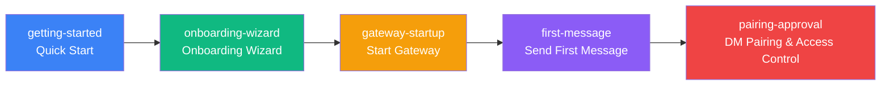

# Quick Start: From Installation to Your First Message

Welcome to Clawdbot! This chapter will guide you through the complete process of using Clawdbot from scratch. Whether you want to quickly experience an AI assistant or dive deep into configuration options, we have corresponding tutorials for you.

---

## Chapter Overview

This chapter contains 5 tutorials covering the complete onboarding flow for Clawdbot: from installing software, configuring AI models and communication channels, to starting the Gateway daemon, sending your first message, and finally understanding the default security protection mechanism. After completing this chapter, you will have a fully functional personal AI assistant.

---

## Recommended Learning Path

We recommend following these tutorials in order:

**Learning Sequence**:

1. **Quick Start** (required): Complete basic installation and configuration, prerequisite for all subsequent learning
2. **Onboarding Wizard** (recommended): Deep dive into wizard options, for users who want fine-grained configuration
3. **Start Gateway** (required): Learn how to start and manage the Gateway daemon
4. **Send First Message** (required): Verify configuration is correct and start using the AI assistant
5. **DM Pairing & Access Control** (recommended): Understand the default security mechanism to protect your AI assistant

::: tip Fast Track
If you just want to quickly experience it, you can learn only the "Quick Start" and "Start Gateway" tutorials, then send messages directly. Other tutorials can be learned on-demand later.
:::

---

## Prerequisites

Before starting this chapter, please ensure:

- **Node.js**: ≥ 22.12.0 (check with `node -v`)
- **Operating System**: macOS / Linux / Windows (WSL2)
- **Package Manager**: npm / pnpm / bun
- **AI Model Account** (recommended):
  - Anthropic Claude account (Pro/Max subscription), supports OAuth flow
  - Or prepare API Key from OpenAI / DeepSeek / OpenRouter and other providers

::: warning Windows Users Notice
**WSL2** is strongly recommended on Windows because:
- Many channels depend on local binaries
- Daemons (launchd/systemd) are not available on Windows
:::

---

## Sub-page Navigation

### [1. Quick Start](./getting-started/) ⭐ Core Tutorial

**What You'll Learn**:
- ✅ Install Clawdbot on your device
- ✅ Configure AI model authentication (Anthropic / OpenAI / other providers)
- ✅ Start the Gateway daemon
- ✅ Send your first message via WebChat or configured channels

**Target Audience**: All users, must-read tutorial

**Estimated Time**: 15-20 minutes

**Main Content**:
- Install Clawdbot using npm/pnpm/bun
- Run onboarding wizard to complete basic configuration
- Start Gateway and verify status
- Send test messages via CLI or channels

**Prerequisites**: None

---

### [2. Onboarding Wizard](./onboarding-wizard/)

**What You'll Learn**:
- ✅ Complete full configuration using the interactive wizard
- ✅ Understand the difference between QuickStart and Manual modes
- ✅ Configure Gateway networking, authentication, and Tailscale
- ✅ Set up AI model providers (setup-token and API Key)
- ✅ Enable communication channels (WhatsApp, Telegram, etc.)
- ✅ Install and manage skill packages

**Target Audience**: Users who want fine-grained configuration, understand advanced options

**Estimated Time**: 20-30 minutes

**Main Content**:
- QuickStart vs Manual mode selection
- Gateway network configuration (ports, binding, authentication)
- AI model authentication methods (setup-token recommended)
- Communication channel configuration flow
- Skill system introduction

**Prerequisites**: [Quick Start](./getting-started/)

---

### [3. Start Gateway](./gateway-startup/) ⭐ Core Tutorial

**What You'll Learn**:
- ✅ Start Gateway foreground process using command line
- ✅ Configure Gateway as background daemon (macOS LaunchAgent / Linux systemd / Windows Scheduled Task)
- ✅ Understand different binding modes (loopback / LAN / Tailnet) and authentication methods
- ✅ Switch between development mode and production mode
- ✅ Use `--force` to forcefully release occupied ports

**Target Audience**: All users, must-read tutorial

**Estimated Time**: 15-20 minutes

**Main Content**:
- Foreground mode vs daemon mode
- Binding mode selection (loopback / LAN / Tailnet / Auto)
- Authentication method configuration (Token / Password / Tailscale Identity)
- Development mode (`--dev`) vs production mode
- Service management commands (install / start / stop / restart)
- Port conflict handling (`--force`)

**Prerequisites**: [Onboarding Wizard](./onboarding-wizard/)

---

### [4. Send First Message](./first-message/) ⭐ Core Tutorial

**What You'll Learn**:
- ✅ Send messages via WebChat interface
- ✅ Chat with AI assistant via configured channels (WhatsApp / Telegram / Slack, etc.)
- ✅ Understand message routing and response flow
- ✅ Use AI assistant to execute basic tasks (query, summarize, code generation, etc.)

**Target Audience**: All users, must-read tutorial

**Estimated Time**: 10-15 minutes

**Main Content**:
- WebChat interface usage
- Message sending methods for each channel
- Message format and reply mechanism
- Common task examples (query information, generate code, summarize text)
- Debugging and troubleshooting

**Prerequisites**: [Start Gateway](./gateway-startup/)

---

### [5. DM Pairing & Access Control](./pairing-approval/)

**What You'll Learn**:
- ✅ Understand the default DM pairing protection mechanism
- ✅ Approve or reject pairing requests from unknown senders
- ✅ Configure allowlist and blocklist
- ✅ Set up access control policies
- ✅ Understand pairing modes and security best practices

**Target Audience**: Users concerned about security, recommended learning

**Estimated Time**: 10-15 minutes

**Main Content**:
- DM pairing mechanism principles
- Pairing flow and user experience
- Allowlist and blocklist configuration
- Access control policy settings
- Security best practices

**Prerequisites**: [Send First Message](./first-message/)

---

## Frequently Asked Questions

### Q: Should I learn all tutorials?

**A**: Not necessarily. If you want to get started quickly, you only need to learn the two core tutorials "Quick Start" and "Start Gateway", then you can start using Clawdbot. Other tutorials can be learned on-demand as needed.

### Q: Will skipping certain tutorials have any impact?

**A**: No. Each tutorial is independent, but "Quick Start" is the foundation and includes installation and basic configuration, so it's recommended to learn it first. Other tutorials can be selectively learned based on your needs.

### Q: I'm already familiar with AI assistants, can I skip the basic tutorials?

**A**: Yes. If you're already familiar with similar AI assistant tools, you can skip "Quick Start" and directly learn "Onboarding Wizard" and "Start Gateway" to understand Clawdbot's specific configuration and startup methods.

### Q: What can I do after completing this chapter?

**A**: After completing this chapter, you will have a fully functional Clawdbot system that can:
- Chat with AI assistant via WebChat or multiple channels
- Let AI execute basic tasks (query information, generate code, summarize text, etc.)
- Use DM pairing mechanism to protect security
- Continue learning advanced features (multi-channel configuration, tool system, skill platform, etc.)

---

## Next Steps

After completing this chapter, you can continue learning:

- **[Multi-channel System Overview](../../platforms/channels-overview/)**: Learn about all communication channels supported by Clawdbot and their characteristics
- **[WhatsApp Channel](../../platforms/whatsapp/)**: Deep dive into WhatsApp channel configuration and usage
- **[Telegram Channel](../../platforms/telegram/)**: Deep dive into Telegram channel configuration and usage
- **[WebChat Interface](../../platforms/webchat/)**: Learn about the built-in WebChat interface features

::: tip Tip
Choose the corresponding channel for in-depth learning based on your usage needs. If you primarily use a certain channel (such as WhatsApp or Telegram), you can prioritize learning that channel's dedicated tutorial.
:::
