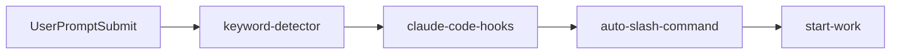
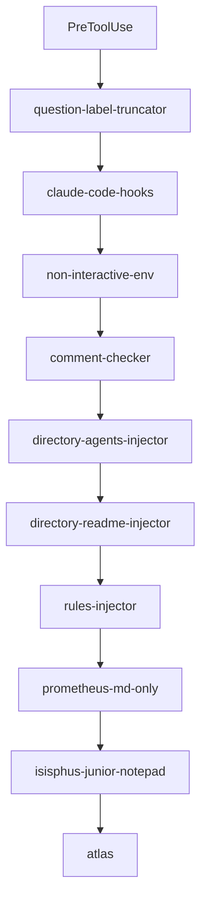
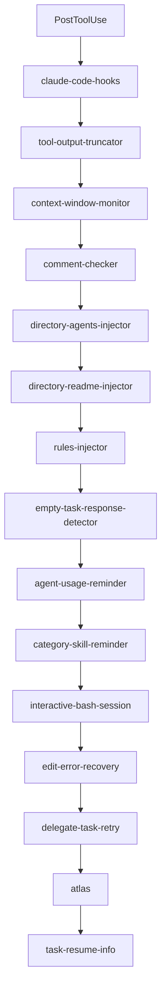
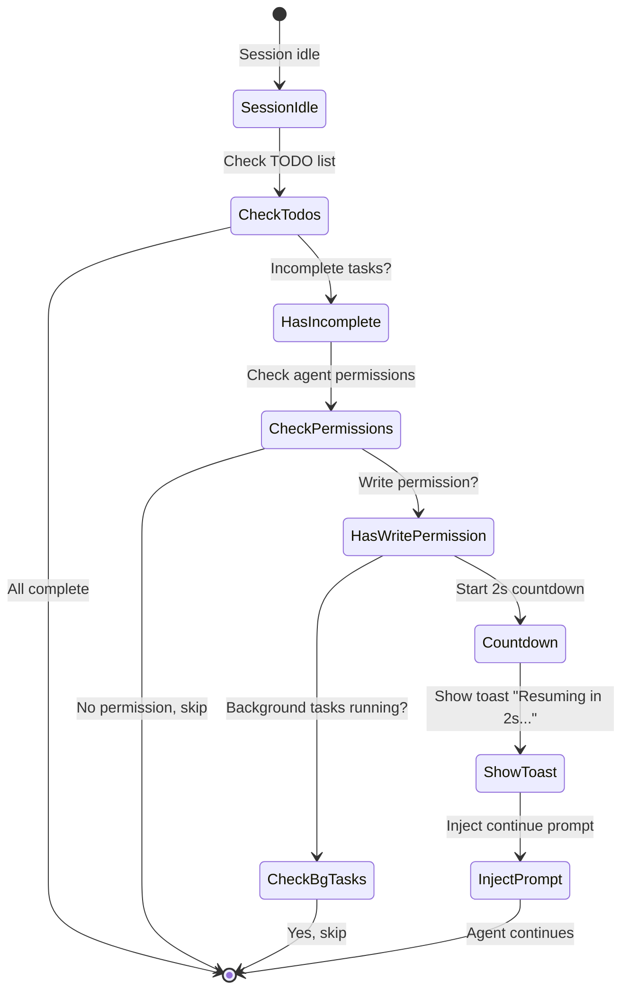
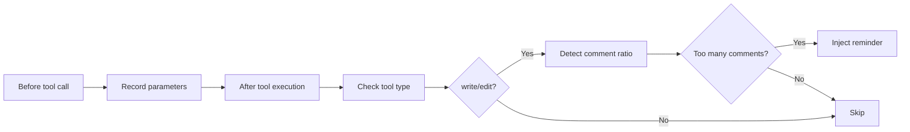

# Lifecycle Hooks: Automated Context and Quality Control

## What You'll Learn

- Automatically inject project context (AGENTS.md, README.md) for AI agents
- Prevent agents from giving up halfway, forcing TODO list completion
- Automatically truncate oversized tool outputs to avoid context window overflow
- Enable Ultrawork mode to activate all professional agents with one click
- Customize hook configuration to disable unwanted features

## Your Current Pain Points

Have you encountered these problems?

- AI agents always forget project specifications and repeat mistakes?
- Agents stop halfway through work, leaving TODO lists incomplete?
- Codebase search output is too large, bloating the context window?
- You have to manually tell agents which mode to work in every time?

## When to Use This Technique

Lifecycle hooks are suitable for these scenarios:

::: tip Typical Use Cases
- **Project context management**: Automatically inject AGENTS.md and README.md
- **Quality control**: Check code comments, verify thinking blocks
- **Task continuity**: Force agents to complete all TODO tasks
- **Performance optimization**: Dynamic output truncation, context window management
- **Workflow automation**: Keyword-triggered modes, automatic command execution
:::

## Core Concept

### What Are Lifecycle Hooks?

**Lifecycle hooks** are an event-driven mechanism that allows you to insert custom logic at key points during an agent's workflow. For example, automatically injecting project documentation, forcing TODO task completion, truncating oversized outputs, etc. These hooks listen to 4 event types: before tool execution, after tool execution, when user submits prompts, and when session is idle. By configuring hooks appropriately, you can make AI agents smarter and better aligned with your work habits.

::: info Hooks vs Middleware
Hooks are similar to middleware in web frameworks—both are mechanisms for "doing specific things at specific moments." The difference is:
- **Middleware**: Linear execution, can interrupt requests
- **Hooks**: Event-driven, cannot interrupt, only modify data
:::

### 32 Hooks Across 7 Categories

oh-my-opencode provides 32 built-in hooks divided into 7 categories:

| Category | Hook Count | Primary Function |
|----------|------------|-------------------|
| **Context Injection** | 4 | Auto-inject project docs, rules |
| **Productivity & Control** | 6 | Keyword detection, mode switching, loop management |
| **Quality & Security** | 4 | Code comment checking, thinking block verification |
| **Recovery & Stability** | 3 | Session recovery, error handling |
| **Truncation & Context Management** | 2 | Output truncation, window monitoring |
| **Notifications & UX** | 3 | Version updates, background task notifications, idle reminders |
| **Task Management** | 2 | Task recovery, delegate retry |

## Hook Event Types

Hooks listen to these 4 event types:

### 1. PreToolUse (Before Tool Execution)

**Trigger**: Before the agent calls a tool

**What You Can Do**:
- Prevent tool execution
- Modify tool parameters
- Inject context

**Example Hooks**: `comment-checker`, `directory-agents-injector`

### 2. PostToolUse (After Tool Execution)

**Trigger**: After tool execution completes

**What You Can Do**:
- Modify tool output
- Add warning messages
- Inject follow-up instructions

**Example Hooks**: `tool-output-truncator`, `directory-readme-injector`

### 3. UserPromptSubmit (When User Submits Prompt)

**Trigger**: When user sends a message to the session

**What You Can Do**:
- Prevent submission (rare)
- Modify prompt content
- Inject system messages
- Activate work modes

**Example Hooks**: `keyword-detector`, `auto-slash-command`

### 4. Stop (When Session Is Idle)

**Trigger**: When agent stops working and session enters idle state

**What You Can Do**:
- Inject follow-up prompts
- Send notifications
- Check task status

**Example Hooks**: `todo-continuation-enforcer`, `session-notification`

## Hook Execution Order

Hooks execute in a fixed order to ensure logical correctness:

### UserPromptSubmit Event



**Order Explanation**:
1. `keyword-detector`: Detect keywords (ultrawork, search, analyze)
2. `claude-code-hooks`: Execute Claude Code compatibility layer hooks
3. `auto-slash-command`: Auto-execute slash commands
4. `start-work`: Handle `/start-work` command

### PreToolUse Event



**Order Explanation**:
1. `question-label-truncator`: Truncate tool labels
2. `claude-code-hooks`: Claude Code compatibility layer
3. `non-interactive-env`: Handle non-interactive environments
4. `comment-checker`: Check code comments
5. `directory-agents-injector`: Inject AGENTS.md
6. `directory-readme-injector`: Inject README.md
7. `rules-injector`: Inject project rules
8. `prometheus-md-only`: Force Prometheus to output only Markdown
9. `sisyphus-junior-notepad`: Inject hints for Sisyphus Junior
10. `atlas`: Atlas main orchestration logic

### PostToolUse Event



**Order Explanation**:
1. `claude-code-hooks`: Claude Code compatibility layer
2. `tool-output-truncator`: Truncate tool outputs
3. `context-window-monitor`: Monitor context window
4. `comment-checker`: Check code comments
5. `directory-agents-injector`: Inject AGENTS.md
6. `directory-readme-injector`: Inject README.md
7. `rules-injector`: Inject project rules
8. `empty-task-response-detector`: Detect empty responses
9. `agent-usage-reminder`: Remind to use professional agents
10. `category-skill-reminder`: Remind to use Category/Skill
11. `interactive-bash-session`: Manage interactive Bash sessions
12. `edit-error-recovery`: Recover from edit errors
13. `delegate-task-retry`: Retry failed delegate tasks
14. `atlas`: Atlas main orchestration logic
15. `task-resume-info`: Provide task resumption info

## Core Hooks Deep Dive

### 1. directory-agents-injector (AGENTS.md Injection)

**Trigger Event**: PostToolUse

**Function**: When the agent reads a file, it automatically traverses from the file's directory up to the project root, collects all `AGENTS.md` files along the path, and injects them into the agent's context.

**Workflow**:

```mermaid
flowchart TD
    A[Agent reads file] --> B[Find file's directory]
    B --> C[Traverse up directory tree]
    C --> D[Found AGENTS.md?]
    D -->|Yes| E[Record path]
    D -->|No| F[Reached project root?]
    E --> F
    F -->|No| C
    F -->|Yes| G[Sort by proximity (nearest first)]
    G --> H[Read content and inject]
    H --> I[Cache injected directories]
```

**Example**:

Project structure:
```
project/
├── AGENTS.md              # Project-level context
├── src/
│   ├── AGENTS.md          # src-level context
│   └── components/
│       ├── AGENTS.md      # components-level context
│       └── Button.tsx
```

When the agent reads `Button.tsx`, it will automatically inject:
1. `components/AGENTS.md` (first)
2. `src/AGENTS.md`
3. `AGENTS.md` (project root)

::: tip Best Practices
- Create `AGENTS.md` in each major directory to explain responsibilities and specifications
- AGENTS.md follows "nearest first" principle—closest takes priority
- Injected directories are cached to avoid duplicate injection
:::

**Source Location**: `src/hooks/directory-agents-injector/index.ts` (183 lines)

### 2. todo-continuation-enforcer (TODO Enforcement)

**Trigger Event**: Stop

**Function**: Checks the agent's TODO list. If there are incomplete TODOs, forces the agent to continue working to prevent giving up halfway.

**Workflow**:



**Countdown Mechanism**:
- Default countdown: 2 seconds
- Toast message: "Resuming in 2s... (X tasks remaining)"
- User can manually cancel during countdown

**Skip Conditions**:
1. Agent has no write permission (read-only agents)
2. Agent is in skip list (prometheus, compaction)
3. Background tasks are running
4. Session is recovering

**Source Location**: `src/hooks/todo-continuation-enforcer.ts` (490 lines)

### 3. keyword-detector (Keyword Detection)

**Trigger Event**: UserPromptSubmit

**Function**: Detects keywords in user prompts and automatically activates corresponding modes:

| Keyword | Activates Mode | Description |
|---------|----------------|-------------|
| `ultrawork` / `ulw` | **Maximum Performance Mode** | Activate all professional agents and parallel tasks |
| `search` / `find` | **Parallel Exploration Mode** | Parallel launch explore/librarian |
| `analyze` / `investigate` | **Deep Analysis Mode** | Activate deep exploration and analysis |

**Usage Example**:

```
User input:
ultrawork develop a REST API with authentication and authorization

System response:
[✅ Ultrawork Mode Activated]
Maximum precision engaged. All agents at your disposal.
```

**Implementation Details**:
- Keyword detection supports variants (ultrawork = ulw)
- Main sessions and non-main sessions are handled differently
- Mode settings are passed to agents via `message.variant`
- Background task sessions don't perform keyword detection

**Source Location**: `src/hooks/keyword-detector/index.ts` (101 lines)

### 4. tool-output-truncator (Tool Output Truncation)

**Trigger Event**: PostToolUse

**Function**: Dynamically truncates oversized tool outputs, preserving 50% context window headroom, max truncation to 50k tokens.

**Supported Tools**:

```typescript
const TRUNCATABLE_TOOLS = [
  "grep", "Grep", "safe_grep",
  "glob", "Glob", "safe_glob",
  "lsp_diagnostics",
  "ast_grep_search",
  "interactive_bash", "Interactive_bash",
  "skill_mcp",
  "webfetch", "WebFetch",
]
```

**Special Limits**:
- `webfetch` max 10k tokens (web content needs more aggressive truncation)
- Other tools max 50k tokens

**Truncation Strategy**:
1. Dynamically calculate truncation point based on remaining context window
2. Keep output head and tail, replace middle with ellipsis
3. Add truncation note: `[Note: Content was truncated to save context window space. For full context, please read file directly: {path}]`

::: warning Enable More Aggressive Truncation
Configure in `oh-my-opencode.json`:
```json
{
  "experimental": {
    "truncate_all_tool_outputs": true
  }
}
```
This truncates all tool outputs, not just those in the TRUNCATABLE_TOOLS list.
:::

**Source Location**: `src/hooks/tool-output-truncator.ts` (62 lines)

### 5. comment-checker (Code Comment Checking)

**Trigger Event**: PreToolUse / PostToolUse

**Function**: Checks if the agent writes too many comments, intelligently ignoring BDD, directives, and docstrings.

**Workflow**:



**Smart Ignore Rules**:
- BDD (Behavior-Driven Development) comments
- Directive comments (e.g., `// TODO`, `// FIXME`)
- Docstrings

**Configuration**:

```json
{
  "comment_checker": {
    "custom_prompt": "Your custom prompt"
  }
}
```

**Source Location**: `src/hooks/comment-checker/index.ts` (172 lines)

## Hook Configuration

### Enable/Disable Hooks

Configure in `oh-my-opencode.json`:

```json
{
  "disabled_hooks": [
    "comment-checker",
    "auto-update-checker",
    "keyword-detector"
  ]
}
```

### Common Configuration Scenarios

#### Scenario 1: Disable Comment Checking

```json
{
  "disabled_hooks": ["comment-checker"]
}
```

#### Scenario 2: Disable Keyword Detection

```json
{
  "disabled_hooks": ["keyword-detector"]
}
```

#### Scenario 3: Disable TODO Enforcement

```json
{
  "disabled_hooks": ["todo-continuation-enforcer"]
}
```

#### Scenario 4: Enable Aggressive Output Truncation

```json
{
  "experimental": {
    "truncate_all_tool_outputs": true
  }
}
```

## Summary

This lesson introduced oh-my-opencode's 32 lifecycle hooks:

**Core Concepts**:
- Hooks are event-driven interception mechanisms
- 4 event types: PreToolUse, PostToolUse, UserPromptSubmit, Stop
- Execute in fixed order to ensure logical correctness

**Commonly Used Hooks**:
- `directory-agents-injector`: Auto-inject AGENTS.md
- `todo-continuation-enforcer`: Force TODO list completion
- `keyword-detector`: Keyword detection to activate modes
- `tool-output-truncator`: Dynamic output truncation
- `comment-checker`: Check code comments

**Configuration Methods**:
- Disable unwanted hooks via `disabled_hooks` array
- Enable experimental features via `experimental` configuration

## Next Lesson Preview

> Next, we'll learn **[Slash Commands: Preset Workflows](../slash-commands/)**.
>
> You'll learn:
> - How to use 6 built-in slash commands
> - `/ralph-loop` automatic work completion
> - `/refactor` intelligent refactoring
> - `/start-work` execute Prometheus plans
> - How to create custom slash commands

---

## Appendix: Source Code Reference

<details>
<summary><strong>Click to expand source code locations</strong></summary>

> Last Updated: 2026-01-26

| Function | File Path | Line Number |
|----------|-----------|-------------|
| directory-agents-injector | [`src/hooks/directory-agents-injector/index.ts`](https://github.com/code-yeongyu/oh-my-opencode/blob/main/src/hooks/directory-agents-injector/index.ts) | 1-183 |
| todo-continuation-enforcer | [`src/hooks/todo-continuation-enforcer.ts`](https://github.com/code-yeongyu/oh-my-opencode/blob/main/src/hooks/todo-continuation-enforcer.ts) | 1-490 |
| keyword-detector | [`src/hooks/keyword-detector/index.ts`](https://github.com/code-yeongyu/oh-my-opencode/blob/main/src/hooks/keyword-detector/index.ts) | 1-101 |
| tool-output-truncator | [`src/hooks/tool-output-truncator.ts`](https://github.com/code-yeongyu/oh-my-opencode/blob/main/src/hooks/tool-output-truncator.ts) | 1-62 |
| comment-checker | [`src/hooks/comment-checker/index.ts`](https://github.com/code-yeongyu/oh-my-opencode/blob/main/src/hooks/comment-checker/index.ts) | 1-172 |
| context-window-monitor | [`src/hooks/context-window-monitor.ts`](https://github.com/code-yeongyu/oh-my-opencode/blob/main/src/hooks/context-window-monitor.ts) | - |
| session-recovery | [`src/hooks/session-recovery/index.ts`](https://github.com/code-yeongyu/oh-my-opencode/blob/main/src/hooks/session-recovery/index.ts) | - |
| claude-code-hooks | [`src/hooks/claude-code-hooks/`](https://github.com/code-yeongyu/oh-my-opencode/blob/main/src/hooks/claude-code-hooks) | - |

**Key Constants**:
- `AGENTS_FILENAME = "AGENTS.md"`: Agent context file name (`src/hooks/directory-agents-injector/constants.ts`)
- `DEFAULT_MAX_TOKENS = 50_000`: Default max truncation tokens (`src/hooks/tool-output-truncator.ts`)
- `WEBFETCH_MAX_TOKENS = 10_000`: webfetch max truncation tokens (`src/hooks/tool-output-truncator.ts`)
- `COUNTDOWN_SECONDS = 2`: TODO continuation countdown seconds (`src/hooks/todo-continuation-enforcer.ts`)

**Key Functions**:
- `createDirectoryAgentsInjectorHook(ctx)`: Create AGENTS.md injection hook
- `createTodoContinuationEnforcer(ctx, options)`: Create TODO enforcement hook
- `createKeywordDetectorHook(ctx, collector)`: Create keyword detection hook
- `createToolOutputTruncatorHook(ctx, options)`: Create tool output truncation hook
- `createCommentCheckerHooks(config)`: Create code comment checking hooks

</details>
