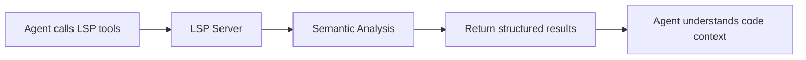
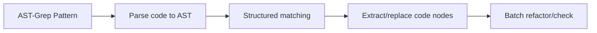

# LSP and AST-Grep: IDE-Level Code Analysis and Operations

## What You'll Learn

- Use LSP tools to navigate codebases, find symbols, and get diagnostics
- Use AST-Grep for precise code pattern search and replacement
- Understand the differences between LSP and AST-Grep and their use cases
- Enable agents with IDE-level code understanding and manipulation capabilities

## Your Current Challenges

Traditional code search and refactoring tools have obvious limitations:

| Problem | Traditional Solution | Actual Need |
|--- | --- | ---|
| **Inaccurate symbol navigation** | Simple string matching | Need semantic understanding, navigate to true definitions |
| **Missing references** | Regex search | Need precise cross-file, cross-scope reference tracking |
| **Unsafe refactoring** | Manual replacement + grep | Need to understand code structure, avoid breaking changes |
| **Clumsy pattern matching** | Regex | Need AST-based structural pattern matching |

::: info Key Concepts
**LSP (Language Server Protocol)** is the standard protocol between IDEs and language servers. It provides unified interfaces for code completion, go-to-definition, find-references, rename symbols, diagnostics, symbol outline, and more, enabling editors with powerful code understanding capabilities. It also supports advanced features like type information and inheritance relationships. **AST-Grep** is an AST-based code pattern matching tool that understands code structure rather than just text. It supports using meta-variables (such as `$VAR` to match a single node, `$$$` to match multiple nodes) for flexible pattern matching and batch refactoring. It covers 25 programming languages (including TypeScript, Python, Go, Rust, etc.), making it a powerful tool for code refactoring, style checking, and structured search.
:::

## When to Use Which Tool

| Tool | Use Case | Example |
|--- | --- | ---|
| **LSP Tools** | When you need IDE functionality | Go-to-definition, find all references, get error list, rename symbols |
| **AST-Grep** | When you need code pattern matching | Search for specific code structures, batch refactor, check code standards |
| **Grep/Glob** | Simple text search | Find function names, filename matching |

## 🎒 Prerequisites

Before using LSP and AST-Grep tools, ensure:

1. **Language Server Installed**
   - TypeScript/JavaScript: `npm install -g typescript-language-server`
   - Python: `pip install basedpyright` or `pip install ruff`
   - Go: `go install golang.org/x/tools/gopls@latest`
   - Rust: `rustup component add rust-analyzer`

2. **AST-Grep CLI Installed**
   ```bash
   bun add -D @ast-grep/cli
   ```

3. **LSP Server Configured**
   - LSP server configuration is in OpenCode's `opencode.json`
   - oh-my-opencode will automatically read and use these configurations

::: tip Check Environment
Use the following commands to check your environment:
```bash
# Check LSP server
oh-my-opencode doctor

# Check AST-Grep
which sg
```
:::

## Core Concepts

### LSP Tools: IDE-Level Code Understanding

LSP tools give AI agents the same code understanding capabilities as IDEs:



**Key Advantages**:
- ✅ Semantic understanding, not simple string matching
- ✅ Precise cross-file, cross-scope tracking
- ✅ Supports advanced features like type information and inheritance relationships
- ✅ Fully consistent with project configuration (uses the same LSP servers)

### AST-Grep: Structured Code Pattern Matching

AST-Grep enables AI agents to perform precise code structure matching:



**Key Advantages**:
- ✅ Based on code structure, not text
- ✅ Supports meta-variables (`$VAR`, `$$$`) for pattern matching
- ✅ Supports multiple languages (25)
- ✅ Can be used for refactoring, checking, and code style verification

## Follow Along

### Step 1: Use LSP to Go to Definition

**Why**
When you need to see where a symbol is defined, LSP's `goto_definition` tool provides precise navigation, more reliable than string search.

In OpenCode, agents can automatically call:

```typescript
// Agent will automatically call
lsp_goto_definition({
  filePath: "src/utils.ts",
  line: 15,
  character: 10
})
```

**You should see**:
```
→ Definition found:
  File: src/types.ts
  Line: 45
  Text: export interface UserConfig {
```

::: tip In Practice
You don't need to manually call these tools. AI agents will automatically use them to understand code. You can directly ask: "Jump to the definition of this function" or "Where is this variable defined?"
:::

### Step 2: Find All References

**Why**
When you need to modify a symbol, finding all references first ensures that changes won't break usage elsewhere.

Agents can call:

```typescript
lsp_find_references({
  filePath: "src/api.ts",
  line: 10,
  character: 5,
  includeDeclaration: true  // Whether to include the definition itself
})
```

**You should see**:
```
Found 15 references (showing first 200):
  src/api.ts:10:5  - [definition] fetchData
  src/components/List.tsx:23:12 - [usage] fetchData()
  src/pages/Home.tsx:45:8 - [usage] fetchData()
  ...
```

### Step 3: Get File Symbols and Workspace Symbols

**Why**
When understanding file structure or searching for specific symbol types throughout the project, the `lsp_symbols` tool is very useful.

**File outline** (scope="document"):

```typescript
lsp_symbols({
  filePath: "src/app.tsx",
  scope: "document"
})
```

**You should see**:
```
Found 12 symbols:
  [Component] App (line: 10-150)
    [Function] useEffect (line: 25-35)
    [Function] handleClick (line: 40-55)
    [Variable] count (line: 15)
  ...
```

**Workspace search** (scope="workspace"):

```typescript
lsp_symbols({
  filePath: "src/app.tsx",
  scope: "workspace",
  query: "fetchData"
})
```

### Step 4: Get Diagnostics

**Why**
Before running code, LSP's diagnostic tools can discover errors, warnings, and hints in advance.

```typescript
lsp_diagnostics({
  filePath: "src/utils.ts",
  severity: "error"  // Optional: "error", "warning", "information", "hint", "all"
})
```

**You should see**:
```
Found 3 diagnostics:
  [Error] src/utils.ts:23:5 - 'result' is used before being assigned
  [Warning] src/utils.ts:45:12 - Unused variable 'temp'
  [Hint] src/utils.ts:67:8 - This can be simplified to const x = value
```

::: tip Pre-check
Have AI agents use `lsp_diagnostics` to check for potential issues before writing code to avoid repetitive modifications.
:::

### Step 5: Safely Rename Symbols

**Why**
Renaming symbols is a common refactoring operation, but manual replacement is error-prone. LSP's `lsp_rename` tool can safely rename symbols across the entire workspace.

**Step 1: Validate rename**

```typescript
lsp_prepare_rename({
  filePath: "src/api.ts",
  line: 10,
  character: 5
})
```

**You should see**:
```
Rename validation:
  Current name: fetchData
  Placeholder range: line 10, column 5-14
  Status: ✅ Valid
```

**Step 2: Execute rename**

```typescript
lsp_rename({
  filePath: "src/api.ts",
  line: 10,
  character: 5,
  newName: "fetchUserData"
})
```

**You should see**:
```
Applied rename to 15 files:
  src/api.ts:10:5 - fetchData → fetchUserData
  src/components/List.tsx:23:12 - fetchData() → fetchUserData()
  src/pages/Home.tsx:45:8 - fetchData → fetchUserData()
  ...
```

### Step 6: Use AST-Grep to Search Code Patterns

**Why**
When you need to find specific code structures (such as all places using `console.log`), AST-Grep is more precise than grep.

**Basic pattern search**:

```typescript
ast_grep_search({
  pattern: "console.log($MSG)",
  lang: "typescript",
  paths: ["src"],
  context: 2  // Show context lines before and after matches
})
```

**You should see**:
```
src/utils.ts:15:
  13 | function debug(message) {
  14 |   console.log(message)
  15 |   console.log("Debug mode")
  16 | }
  17 | }

src/components/App.tsx:23:
  21 | useEffect(() => {
  22 |   console.log("Component mounted")
  23 | }, [])
```

**Using meta-variables**:

```typescript
// Match all function calls
ast_grep_search({
  pattern: "$FUNC($$$)",
  lang: "typescript",
  paths: ["src"]
})
```

```typescript
// Match all async functions
ast_grep_search({
  pattern: "async function $NAME($$$) { $$$ }",
  lang: "typescript",
  paths: ["src"]
})
```

::: warning Important: Pattern must be a complete AST node
❌ Wrong: `export async function $NAME`
✅ Correct: `export async function $NAME($$$) { $$$ }`

Patterns must be valid code snippets, including complete function signatures and function bodies.
:::

### Step 7: Use AST-Grep for Batch Replacement

**Why**
When you need to batch refactor code (such as replacing all `console.log` with `logger.info`), AST-Grep's replacement functionality is very powerful.

**Preview replacement** (dry-run):

```typescript
ast_grep_replace({
  pattern: "console.log($MSG)",
  rewrite: "logger.info($MSG)",
  lang: "typescript",
  paths: ["src"],
  dryRun: true  // Default is true, preview only, no modifications
})
```

**You should see**:
```
Preview changes (dry-run):
  src/utils.ts:15:2 - console.log("Debug mode")
                 → logger.info("Debug mode")
  src/components/App.tsx:23:4 - console.log("Component mounted")
                              → logger.info("Component mounted")

Total: 2 changes
```

**Apply replacement**:

```typescript
ast_grep_replace({
  pattern: "console.log($MSG)",
  rewrite: "logger.info($MSG)",
  lang: "typescript",
  paths: ["src"],
  dryRun: false  // Set to false to apply changes
})
```

**You should see**:
```
Applied 2 changes:
  src/utils.ts:15:2 - console.log("Debug mode")
                 → logger.info("Debug mode")
  src/components/App.tsx:23:4 - console.log("Component mounted")
                              → logger.info("Component mounted")
```

::: danger Destructive Operation
`ast_grep_replace` with `dryRun: false` directly modifies files. Recommended:
1. First preview with `dryRun: true`
2. Confirm before applying
3. If project uses Git, commit current state first
:::

## Checkpoint ✅

**Verify LSP Tools**:
- [ ] Can you navigate to symbol definitions?
- [ ] Can you find all references?
- [ ] Can you get diagnostic information?
- [ ] Can you safely rename symbols?

**Verify AST-Grep Tools**:
- [ ] Can you search code patterns?
- [ ] Can you use meta-variables for matching?
- [ ] Can you preview and execute replacements?

## Common Pitfalls

### LSP Tool Common Issues

| Problem | Cause | Solution |
|--- | --- | ---|
| **Cannot find definition** | LSP server not started or misconfigured | Check LSP configuration in `opencode.json` |
| **Incomplete reference list** | Code has errors, LSP server not fully analyzed | Fix errors in code first |
| **Rename failed** | New name conflicts with existing symbol | Use more specific name |

### AST-Grep Common Issues

| Problem | Cause | Solution |
|--- | --- | ---|
| **Pattern not matching** | Pattern incomplete or syntax error | Ensure pattern is a complete AST node |
| **Python pattern trailing colon** | Python's `def` and `class` don't need colons | ❌ `def func():` → ✅ `def func($$$):` |
| **Too many matches** | Pattern too broad | Use more specific context or limit paths |

### Performance Optimization Tips

```typescript
// ✅ Good: Limit search scope
ast_grep_search({
  pattern: "$FUNC($$$)",
  lang: "typescript",
  paths: ["src/api"],  // Only search specific directory
  globs: ["*.ts"]      // Only match specific files
})

// ❌ Bad: Search entire project
ast_grep_search({
  pattern: "$FUNC($$$)",
  lang: "typescript",
  paths: ["./"]  // Search all files
})
```

## Complete LSP Tool List

| Tool | Function | Parameters |
|--- | --- | ---|
| `lsp_goto_definition` | Navigate to symbol definition | `filePath`, `line`, `character` |
| `lsp_find_references` | Find all references | `filePath`, `line`, `character`, `includeDeclaration?` |
| `lsp_symbols` | Get file outline or workspace symbols | `filePath`, `scope`, `query?`, `limit?` |
| `lsp_diagnostics` | Get errors and warnings | `filePath`, `severity?` |
| `lsp_prepare_rename` | Validate rename operation | `filePath`, `line`, `character` |
| `lsp_rename` | Execute rename operation | `filePath`, `line`, `character`, `newName` |

**Limits**:
- Maximum 200 symbols, references, or diagnostics returned (configurable)
- LSP server must be configured and running

## Complete AST-Grep Tool List

| Tool | Function | Parameters |
|--- | --- | ---|
| `ast_grep_search` | AST pattern search | `pattern`, `lang`, `paths?`, `globs?`, `context?` |
| `ast_grep_replace` | AST pattern replacement | `pattern`, `rewrite`, `lang`, `paths?`, `globs?`, `dryRun?` |

**Supported Languages** (25):
`bash`, `c`, `cpp`, `csharp`, `css`, `elixir`, `go`, `haskell`, `html`, `java`, `javascript`, `json`, `kotlin`, `lua`, `nix`, `php`, `python`, `ruby`, `rust`, `scala`, `solidity`, `swift`, `typescript`, `tsx`, `yaml`

**Meta-variables**:
- `$VAR` - Match a single node
- `$$$` - Match multiple nodes

## Real-World Examples

### Example 1: Refactor API Calls

**Scenario**: Add error handling to all `fetch` calls

**Use AST-Grep to find pattern**:

```typescript
ast_grep_search({
  pattern: "fetch($URL).then($RES => $BODY)",
  lang: "typescript",
  paths: ["src/api"]
})
```

**Use AST-Grep to replace**:

```typescript
ast_grep_replace({
  pattern: "fetch($URL).then($RES => $BODY)",
  rewrite: "fetch($URL).then($RES => $BODY).catch(err => handleError(err))",
  lang: "typescript",
  paths: ["src/api"],
  dryRun: true  // Preview first
})
```

### Example 2: Find Unused Imports

**Use LSP to find references**:

```typescript
// For each import
lsp_find_references({
  filePath: "src/utils.ts",
  line: 1,  // Line where import is
  character: 10
})

// If only 1 reference returned (the import itself), it's unused
```

### Example 3: Rename Configuration Variable

**Step 1: Validate rename**

```typescript
lsp_prepare_rename({
  filePath: "src/config.ts",
  line: 10,
  character: 4
})
```

**Step 2: Execute rename**

```typescript
lsp_rename({
  filePath: "src/config.ts",
  line: 10,
  character: 4,
  newName: "API_BASE_URL"
})
```

## Lesson Summary

This lesson introduced oh-my-opencode's LSP tools and AST-Grep tools:

**LSP Tools**:
- Provide IDE-level code understanding and manipulation capabilities
- Support go-to-definition, find-references, diagnostics, rename symbols
- Use project-configured LSP servers, consistent with IDE behavior

**AST-Grep Tools**:
- AST-based structured code pattern matching
- Support meta-variables for flexible matching
- Support batch replacement and refactoring

**Best Practices**:
- Use LSP for scenarios requiring semantic understanding
- Use AST-Grep for structured code refactoring
- Preview with dryRun before applying replacements

## Next Lesson Preview

> Next, we'll learn **[Categories and Skills: Dynamic Agent Composition](../categories-skills/)**.
>
> You'll learn:
> - How to use Categories to automatically select the optimal model
> - How to combine different Skills to create specialized agents
> - Practical applications of v3.0 new features

---

## Appendix: Source Code Reference

<details>
<summary><strong>Click to expand source code locations</strong></summary>

> Last Updated: 2026-01-26

### LSP Tools

| Function | File Path | Line Number |
|--- | --- | ---|
| LSP tool definitions | [`src/tools/lsp/tools.ts`](https://github.com/code-yeongyu/oh-my-opencode/blob/main/src/tools/lsp/tools.ts) | 29-261 |
| LSP client implementation | [`src/tools/lsp/client.ts`](https://github.com/code-yeongyu/oh-my-opencode/blob/main/src/tools/lsp/client.ts) | 1-596 |
| LSP constants | [`src/tools/lsp/constants.ts`](https://github.com/code-yeongyu/oh-my-opencode/blob/main/src/tools/lsp/constants.ts) | 1-391 |
| LSP type definitions | [`src/tools/lsp/types.ts`](https://github.com/code-yeongyu/oh-my-opencode/blob/main/src/tools/lsp/types.ts) | 1-246 |

### AST-Grep Tools

| Function | File Path | Line Number |
|--- | --- | ---|
|--- | --- | ---|
|--- | --- | ---|
|--- | --- | ---|
|--- | --- | ---|

**Key Constants**:
- `DEFAULT_MAX_REFERENCES = 200` - Maximum returned references
- `DEFAULT_MAX_SYMBOLS = 200` - Maximum returned symbols
- `DEFAULT_MAX_DIAGNOSTICS = 200` - Maximum returned diagnostics
- `CLI_LANGUAGES` - List of 25 supported languages
- `DEFAULT_MAX_MATCHES = 500` - AST-Grep maximum matches

**Key Tool Functions**:
- `withLspClient()` - Get LSP client and execute operations
- `runSg()` - Execute AST-Grep CLI commands
- `formatLocation()` - Format location information
- `formatDiagnostic()` - Format diagnostic information

**Supported LSP Servers** (partial):
- TypeScript: `typescript-language-server`
- Python: `basedpyright`, `pyright`, `ty`, `ruff`
- Go: `gopls`
- Rust: `rust-analyzer`
- C/C++: `clangd`

</details>
