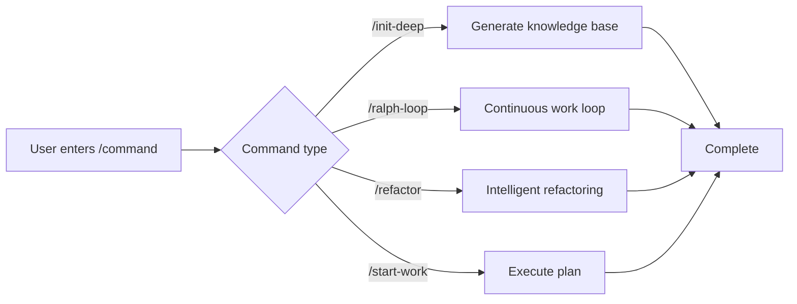

# Slash Commands: Preset Workflows for One-Click Execution

## What You'll Learn

- Use `/init-deep` to generate project knowledge base with one click
- Use `/ralph-loop` to make agents work continuously until tasks complete
- Execute intelligent refactoring with `/refactor`, automatically validating each step
- Use `/start-work` to start systematic development from Prometheus plans

## Your Current Challenge

When repeatedly executing the same complex tasks, you have to type long instructions every time:

```
"Please help me analyze this project's structure, find all key modules, generate AGENTS.md for each directory, then parallel explore the codebase patterns..."
```

Such long instructions waste time and are prone to missing steps.

## When to Use This Approach

**Slash commands** are preset workflow templates that trigger complex tasks with one click. These commands cover common development scenarios:

| Scenario | Command to Use |
|--- | ---|
| Initialize project knowledge base | `/init-deep` |
| Make AI work continuously | `/ralph-loop` |
| Intelligently refactor code | `/refactor` |
| Start working from a plan | `/start-work` |

## Core Concepts

**Slash commands** are predefined workflow templates that execute complex tasks quickly through trigger words starting with `/`.

**How it works**:



oh-my-opencode includes 6 built-in slash commands:

| Command | Function | Complexity |
|--- | --- | ---|
| `/init-deep` | Generate hierarchical AGENTS.md files | Medium |
| `/ralph-loop` | Self-referential development loop | High |
| `/ulw-loop` | Ultrawork version of ralph-loop | High |
| `/cancel-ralph` | Cancel active Ralph Loop | Low |
| `/refactor` | Intelligent refactoring with complete toolchain | High |
| `/start-work` | Start working from Prometheus plan | Medium |

::: info Custom Commands
Besides built-in commands, you can create custom commands (Markdown files) in the `.opencode/command/` or `.claude/commands/` directories.
:::

## 🎒 Prerequisites

- ✅ oh-my-opencode installed
- ✅ At least one AI Provider configured
- ✅ Basic understanding of agent usage (recommended to learn [Getting Started with Sisyphus: The Main Orchestrator](../sisyphus-orchestrator/) first)

## Follow Along

### Step 1: Generate Project Knowledge Base

**Why**
AI agents need to understand project structure and conventions to work efficiently. The `/init-deep` command automatically analyzes the project and generates hierarchical AGENTS.md files.

**Enter in OpenCode**:

```
/init-deep
```

**You Should See**: The agent starts parallel analysis of project structure, explores code patterns, and generates AGENTS.md files.

**Advanced Usage**:

```bash
# Regenerate all files (delete existing ones)
/init-deep --create-new

# Limit generation depth
/init-deep --max-depth=2
```

**Output Example**:

```
=== init-deep Complete ===

Mode: update

Files:
  [OK] ./AGENTS.md (root, 120 lines)
  [OK] ./src/hooks/AGENTS.md (45 lines)
  [OK] ./src/agents/AGENTS.md (38 lines)

Dirs Analyzed: 12
AGENTS.md Created: 3
```

### Step 2: Make AI Work Continuously

**Why**
Some tasks require multiple iterations to complete (like fixing complex bugs). The `/ralph-loop` command makes the agent work continuously until the task is done, rather than stopping midway.

**Enter in OpenCode**:

```
/ralph-loop "Fix the authentication issue on the login page, ensure all error cases are handled"
```

**You Should See**: The agent starts working and automatically continues after completion until the completion marker is output.

**Advanced Usage**:

```bash
# Custom completion marker
/ralph-loop "Write unit tests" --completion-promise="TESTS_DONE"

# Limit maximum iterations
/ralph-loop "Optimize performance" --max-iterations=50
```

**Ultrawork Version** (activates all professional agents):

```bash
/ulw-loop "Develop REST API with authentication, authorization, and rate limiting"
```

**Checkpoint** ✅

- Does the agent automatically continue after each iteration?
- Do you see the "Ralph Loop Complete!" prompt when done?

### Step 3: Cancel Loop

**Why**
If the task direction is wrong or you want manual intervention, you need to cancel the loop.

**Enter in OpenCode**:

```
/cancel-ralph
```

**You Should See**: The loop stops and state files are cleaned up.

### Step 4: Intelligent Refactoring

**Why**
When refactoring code, blind modifications can introduce bugs. The `/refactor` command uses a complete toolchain (LSP, AST-Grep, test validation) to ensure safe refactoring.

**Enter in OpenCode**:

```bash
# Rename symbol
/refactor "Refactor AuthService class to UserService"

# Refactor module
/refactor src/auth --scope=module --strategy=safe

# Pattern matching refactoring
/refactor "Migrate all places using deprecated API to new API"
```

**You Should See**: The agent executes a 6-phase refactoring process:

1. **Intent Gateway** - Confirm refactoring goals
2. **Codebase Analysis** - Parallel exploration of dependencies
3. **Codemap Construction** - Map impact scope
4. **Test Assessment** - Check test coverage
5. **Plan Generation** - Create detailed refactoring plan
6. **Execute Refactoring** - Step-by-step execution with validation

**Advanced Usage**:

```bash
# Aggressive strategy (allows larger changes)
/refactor "Architecture refactoring" --strategy=aggressive

# File scope
/refactor "Optimize functions in utils.ts" --scope=file
```

::: warning Test Coverage Requirement
If target code's test coverage is below 50%, `/refactor` will refuse to execute aggressive strategy. It's recommended to add tests first.
:::

### Step 5: Start Working from a Plan

**Why**
After planning with Prometheus, you need to systematically execute tasks from the plan. The `/start-work` command automatically loads the plan and uses the Atlas agent to execute it.

**Enter in OpenCode**:

```bash
# Auto-select single plan
/start-work

# Select specific plan
/start-work "auth-api-plan"
```

**You Should See**:

- If only one plan: Auto-select and start execution
- If multiple plans: List all plans for selection

**Output Example**:

```
Available Work Plans

Current Time: 2026-01-26T10:30:00Z
Session ID: abc123

1. [auth-api-plan.md] - Modified: 2026-01-25 - Progress: 3/10 tasks
2. [migration-plan.md] - Modified: 2026-01-26 - Progress: 0/5 tasks

Which plan would you like to work on? (Enter number or plan name)
```

**Checkpoint** ✅

- Is the plan correctly loaded?
- Are tasks executed in order?
- Are completed tasks marked?

## Common Pitfalls

### Pitfall 1: `/init-deep` Ignores Existing Files

**Problem**: In default mode, `/init-deep` preserves existing AGENTS.md files, only updating or creating missing parts.

**Solution**: Use the `--create-new` parameter to regenerate all files.

### Pitfall 2: `/ralph-loop` Infinite Loop

**Problem**: If the agent cannot complete the task, the loop continues to the maximum iteration count (default 100).

**Solution**:
- Set a reasonable `--max-iterations` (e.g., 20-30)
- Use `/cancel-ralph` to manually cancel
- Provide clearer task description

### Pitfall 3: `/refactor` Low Test Coverage

**Problem**: Target code has no tests, refactoring will fail.

**Solution**:
```bash
# Let agent add tests first
"Please add comprehensive unit tests for AuthService, covering all edge cases"

# Then refactor
/refactor "Refactor AuthService class"
```

### Pitfall 4: `/start-work` Can't Find Plan

**Problem**: Prometheus-generated plans are not saved in the `.sisyphus/plans/` directory.

**Solution**:
- Check if Prometheus output includes plan file path
- Confirm plan file extension is `.md`

### Pitfall 5: Incorrect Command Parameter Format

**Problem**: Parameter position or format is incorrect.

**Solution**:
```bash
# ✅ Correct
/ralph-loop "Task description" --completion-promise=DONE

# ❌ Wrong
/ralph-loop --completion-promise=DONE "Task description"
```

## Summary

| Command | Core Function | Usage Frequency |
|--- | --- | ---|
| `/init-deep` | Auto-generate project knowledge base | Initial setup |
| `/ralph-loop` | Continuous work loop | High |
| `/ulw-loop` | Ultrawork version of loop | Medium |
| `/cancel-ralph` | Cancel loop | Low |
| `/refactor` | Safe intelligent refactoring | High |
| `/start-work` | Execute Prometheus plans | Medium |

**Best Practices**:
- Use `/init-deep` on new projects to establish knowledge base
- Use `/ralph-loop` for complex tasks to let AI work continuously
- Prefer `/refactor` when refactoring code to ensure safety
- Use `/start-work` with Prometheus for systematic development

## Coming Up Next

> In the next lesson, we'll learn **[Advanced Configuration](../advanced-configuration/)**.
>
> You'll learn:
> - How to override agent default models and prompts
> - How to configure permissions and security restrictions
> - How to customize Categories and Skills
> - How to adjust background task concurrency control

---

## Appendix: Source Code Reference

<details>
<summary><strong>Click to expand source code locations</strong></summary>

> Updated: 2026-01-26

| Feature | File Path | Line Numbers |
|--- | --- | ---|
| Command definitions | [`src/features/builtin-commands/commands.ts`](https://github.com/code-yeongyu/oh-my-opencode/blob/main/src/features/builtin-commands/commands.ts) | 8-73 |
| Command loader | [`src/features/builtin-commands/index.ts`](https://github.com/code-yeongyu/oh-my-opencode/blob/main/src/features/builtin-commands/index.ts) | 75-89 |
| init-deep template | [`src/features/builtin-commands/templates/init-deep.ts`](https://github.com/code-yeongyu/oh-my-opencode/blob/main/src/features/builtin-commands/templates/init-deep.ts) | Full text |
| ralph-loop template | [`src/features/builtin-commands/templates/ralph-loop.ts`](https://github.com/code-yeongyu/oh-my-opencode/blob/main/src/features/builtin-commands/templates/ralph-loop.ts) | Full text |
| refactor template | [`src/features/builtin-commands/templates/refactor.ts`](https://github.com/code-yeongyu/oh-my-opencode/blob/main/src/features/builtin-commands/templates/refactor.ts) | Full text |
| start-work template | [`src/features/builtin-commands/templates/start-work.ts`](https://github.com/code-yeongyu/oh-my-opencode/blob/main/src/features/builtin-commands/templates/start-work.ts) | Full text |
| Ralph Loop Hook implementation | [`src/hooks/ralph-loop/index.ts`](https://github.com/code-yeongyu/oh-my-opencode/blob/main/src/hooks/ralph-loop/index.ts) | Full text |
| Command type definitions | [`src/features/builtin-commands/types.ts`](https://github.com/code-yeongyu/oh-my-opencode/blob/main/src/features/builtin-commands/types.ts) | Full text |

**Key Functions**:
- `loadBuiltinCommands()`: Load built-in command definitions, supports disabling specific commands
- `createRalphLoopHook()`: Create Ralph Loop lifecycle hooks
- `startLoop()`: Start loop, set state and parameters
- `cancelLoop()`: Cancel active loop, clean up state files

**Key Constants**:
- `DEFAULT_MAX_ITERATIONS = 100`: Default maximum iteration count
- `DEFAULT_COMPLETION_PROMISE = "DONE"`: Default completion marker

**Configuration Location**:
- Disable commands: `disabled_commands` field in `oh-my-opencode.json`
- Loop configuration: `ralph_loop` object in `oh-my-opencode.json`

</details>
