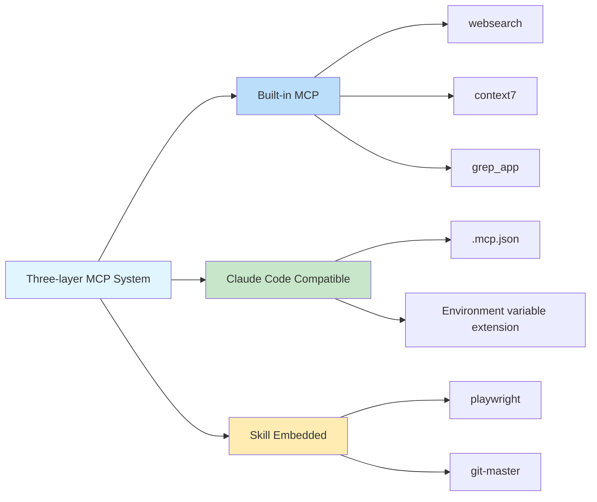

# Built-in MCP Servers: Web Search, Documentation Query, and Code Search

## What You'll Learn

- ✅ Understand the 3 built-in MCP servers and their use cases
- ✅ Know how to configure Exa Websearch API Key
- ✅ Learn to disable unnecessary MCP services
- ✅ Understand the architecture and working principles of the three-layer MCP system

## Your Current Challenge

AI agents can only access local files and make network requests, but they lack professional search and documentation query capabilities. You want agents to be able to:
- Search the web in real-time for the latest information
- Consult official documentation for accurate API descriptions
- Search GitHub repositories for implementation examples

But implementing these features manually adds development complexity.

## When to Use This Approach

When you need to extend AI agent capabilities:

| Scenario | Recommended MCP |
|----------|----------------|
| Need to get the latest technical information, news, or industry trends | **websearch** (Exa) |
| Query official API documentation for libraries or frameworks | **context7** |
| Find implementation examples in GitHub repositories | **grep_app** (Grep.app) |

## Core Concepts: What is MCP?

**MCP (Model Context Protocol)** is a standard protocol that allows AI agents to access external tools and data sources. Simply put:

::: info What is MCP?
MCP is like equipping an AI agent with a "toolbox" containing various professional tools (search, databases, APIs, etc.). Agents can call these tools on demand to access capabilities not available locally.
:::

Oh-My-OpenCode provides a **three-layer MCP system**:



**This lesson focuses on the first layer: built-in MCP servers.**

---

## Three Built-in MCP Servers

Oh-My-OpenCode includes 3 remote MCP servers that work out of the box (some require API Key configuration).

### 1. websearch (Exa AI)

**Function**: Real-time web search powered by [Exa AI](https://exa.ai).

**Use Cases**:
- Search for the latest technical articles and news
- Find solutions to specific problems
- Get industry trends and best practices

**Configuration Requirements**:

You need to set the `EXA_API_KEY` environment variable:

::: code-group

```bash [macOS/Linux]
export EXA_API_KEY="your-api-key-here"
```

```powershell [Windows]
setx EXA_API_KEY "your-api-key-here"
```

:::

::: tip Getting Exa API Key
1. Visit [Exa AI](https://exa.ai)
2. Sign up for an account
3. Create an API Key in Dashboard
4. Add the Key to environment variables
:::

**Source Location**: `src/mcp/websearch.ts` (lines 1-11)

---

### 2. context7

**Function**: Official documentation query, supporting any programming library or framework.

**Use Cases**:
- Query API documentation for React, Vue, Next.js, etc.
- Get official documentation for runtimes like Node.js, Python
- Consult usage guides for open source projects

**Configuration Requirements**: No configuration required, works out of the box.

**Source Location**: `src/mcp/context7.ts` (lines 1-7)

---

### 3. grep_app (Grep.app)

**Function**: Ultra-fast GitHub code search for finding implementation examples.

**Use Cases**:
- Find specific pattern implementations in open source projects
- Learn how others write code
- Find code snippets to solve specific problems

**Configuration Requirements**: No configuration required, works out of the box.

**Source Location**: `src/mcp/grep-app.ts` (lines 1-7)

---

## Configuring and Disabling MCPs

### Default Behavior

All built-in MCP servers are **enabled by default**. Oh-My-OpenCode automatically registers these services on startup.

### Disabling Unnecessary MCPs

If certain MCP services are not needed, you can disable them in the configuration file:

```jsonc
// ~/.config/opencode/oh-my-opencode.json or .opencode/oh-my-opencode.json
{
  "$schema": "./assets/oh-my-opencode.schema.json",

  // Disable unnecessary MCP servers
  "disabled_mcps": [
    "websearch",    // Disable web search (if you don't have Exa API Key)
    "grep_app"      // Disable GitHub code search
  ]
}
```

::: warning Why Disable MCPs?
Disabling unnecessary MCPs can:
1. **Save resources**: Reduce unnecessary connections and requests
2. **Simplify configuration**: Avoid prompts for unset API Keys
3. **Improve stability**: Reduce potential network failure points
:::

### Configuration Priority

The disable configuration priority for built-in MCPs:

| Configuration Location | Priority |
|------------------------|----------|
| User config `~/.config/opencode/oh-my-opencode.json` | High (overrides project config) |
| Project config `.opencode/oh-my-opencode.json` | Medium |
| Code default | Low (all enabled) |

---

## How It Works: Remote MCP Configuration

All built-in MCP servers use **remote (remote) mode**, connecting to external services via HTTP/SSE protocol.

**Configuration Mode** (source code definition):

```typescript
// src/mcp/websearch.ts
export const websearch = {
  type: "remote" as const,        // Fixed to "remote"
  url: "https://mcp.exa.ai/mcp?tools=web_search_exa",  // MCP server address
  enabled: true,                   // Enabled status (overridden by disabled_mcps)
  headers: process.env.EXA_API_KEY  // Optional request headers (API Key)
    ? { "x-api-key": process.env.EXA_API_KEY }
    : undefined,
  oauth: false as const,            // Disable OAuth auto-detection
}
```

**Configuration Field Descriptions**:

| Field | Type | Description |
|-------|------|-------------|
| `type` | `"remote"` | Fixed value, indicating remote MCP |
| `url` | `string` | HTTP address of the MCP server |
| `enabled` | `boolean` | Whether enabled (fixed as `true` in code, controlled by `disabled_mcps`) |
| `headers` | `object` | Optional HTTP request headers (for authentication) |
| `oauth` | `false` | Disable OAuth auto-detection (Exa uses API Key) |

---

## Common Pitfalls

### Pitfall 1: websearch Requires API Key

**Symptom**: Agent fails when attempting to use websearch, prompting for missing API Key.

**Solution**:

```bash
# Check if environment variable is set
echo $EXA_API_KEY

# If empty, set API Key
export EXA_API_KEY="your-actual-api-key"

# Or add permanently to shell config (~/.bashrc, ~/.zshrc, etc.)
echo 'export EXA_API_KEY="your-actual-api-key"' >> ~/.zshrc
```

::: tip Verify API Key
After setting, you can restart OpenCode or run diagnostic command to verify:
```bash
oh-my-opencode doctor --verbose
```
:::

### Pitfall 2: MCP Still Prompted After Disabling

**Symptom**: Even after disabling an MCP, the agent still tries to use it.

**Solution**:

1. Check if configuration file path is correct:
   - User config: `~/.config/opencode/oh-my-opencode.json`
   - Project config: `.opencode/oh-my-opencode.json`

2. Confirm JSON format is correct (note commas and quotes):

```jsonc
{
  "disabled_mcps": ["websearch"]  // ✅ Correct
  // "disabled_mcps": ["websearch"],  // ❌ Error: no trailing comma allowed
}
```

3. Restart OpenCode for configuration to take effect.

### Pitfall 3: Grep.app Results Inaccurate

**Symptom**: grep_app returns results that don't match expectations.

**Possible Causes**:
- Search keywords too generic
- Target repository inactive or deleted
- Incorrect search syntax

**Solution**:
- Use more specific search terms
- Specify file type or language when searching
- Visit [Grep.app](https://grep.app) directly to manually verify

---

## Summary

This lesson introduced Oh-My-OpenCode's 3 built-in MCP servers:

| MCP | Function | Configuration Requirements | Main Use |
|-----|----------|---------------------------|----------|
| **websearch** | Real-time web search | EXA_API_KEY | Get latest information |
| **context7** | Official documentation query | None | Consult API documentation |
| **grep_app** | GitHub code search | None | Find implementation examples |

**Key Takeaways**:

1. **Three-layer MCP System**: Built-in → Claude Code Compatible → Skill Embedded
2. **Enabled by Default**: All built-in MCPs are enabled by default and can be disabled via `disabled_mcps`
3. **Remote Mode**: All built-in MCPs use HTTP/SSE protocol to connect to external services
4. **Exa Requires Key**: websearch requires the `EXA_API_KEY` environment variable

These MCP servers significantly expand AI agent capabilities, allowing them to access real-time information and professional knowledge bases.

---

## Appendix: Source Code Reference

<details>
<summary><strong>Click to expand source code locations</strong></summary>

> Updated: 2026-01-26

| Function | File Path | Line Numbers |
|----------|-----------|--------------|
| MCP factory function | [`src/mcp/index.ts`](https://github.com/code-yeongyu/oh-my-opencode/blob/main/src/mcp/index.ts) | 22-32 |
| websearch configuration | [`src/mcp/websearch.ts`](https://github.com/code-yeongyu/oh-my-opencode/blob/main/src/mcp/websearch.ts) | 1-11 |
| context7 configuration | [`src/mcp/context7.ts`](https://github.com/code-yeongyu/oh-my-opencode/blob/main/src/mcp/context7.ts) | 1-7 |
| grep_app configuration | [`src/mcp/grep-app.ts`](https://github.com/code-yeongyu/oh-my-opencode/blob/main/src/mcp/grep-app.ts) | 1-7 |
| McpNameSchema | [`src/mcp/types.ts`](https://github.com/code-yeongyu/oh-my-opencode/blob/main/src/mcp/types.ts) | 1-10 |
| disabled_mcps field | [`src/config/schema.ts`](https://github.com/code-yeongyu/oh-my-opencode/blob/main/src/config/schema.ts) | 331 |

**Key Constants**:
- `allBuiltinMcps`: Built-in MCP configuration object, including websearch, context7, grep_app (`src/mcp/index.ts:16-20`)

**Key Functions**:
- `createBuiltinMcps(disabledMcps)`: Create list of enabled MCPs, filtering out disabled MCPs (`src/mcp/index.ts:22-32`)

</details>
