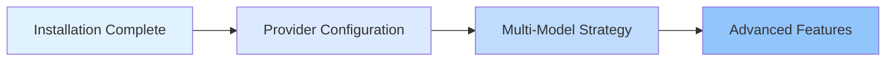

# Platforms and Integrations

This chapter introduces how to configure and manage multiple AI Providers (Anthropic, OpenAI, Google, GitHub Copilot, etc.), as well as oh-my-opencode's multi-model automatic fallback mechanism.

By completing this chapter, you will master how to enable the system to intelligently select the most suitable AI model based on task type and available models, building efficient and reliable multi-model orchestration workflows.

## What This Chapter Covers

This chapter is divided into two parts:

### 1. [Provider Configuration](provider-setup/)

Learn how to configure various AI Providers, including:
- Anthropic Claude (primary orchestrator's first choice)
- OpenAI ChatGPT (specialized for architecture review)
- Google Gemini (frontend and media analysis)
- GitHub Copilot (backup Provider)
- Z.ai Coding Plan and OpenCode Zen (optional services)

**What You'll Learn**:
- ✅ Configure 6 mainstream AI Providers
- ✅ Use the interactive installer for quick setup
- ✅ Specify the most suitable models for different agents
- ✅ Use the `doctor` command to diagnose configuration issues

**Estimated Time**: 25-30 minutes

### 2. [Multi-Model Strategy](model-resolution/)

Deep dive into the three-step priority mechanism of the model resolution system:
- User override (precise control)
- Provider fallback (automatic fault tolerance)
- System default (fallback solution)

**What You'll Learn**:
- ✅ Understand the complete workflow of model resolution
- ✅ Manually specify models based on task requirements
- ✅ Leverage Provider fallback to improve system robustness
- ✅ Diagnose and resolve model resolution issues

**Estimated Time**: 30-35 minutes

## Recommended Learning Path

We recommend following this order when learning this chapter:

**Why this order?**

1. **Configure first, understand later**: Learn how to configure each Provider first, then understand the underlying resolution mechanism
2. **From simple to complex**: Provider configuration is basic operations, multi-model strategy is an advanced concept
3. **Practice validates theory**: After configuring Providers, you can use the `doctor` command to verify the effectiveness of multi-model strategy

::: tip Quick Start Path
If you just want to get started quickly, you can complete steps 1-4 of [Provider Configuration](provider-setup/) (configure basic Providers), and learn other content as needed later.
:::

## Prerequisites

Before learning this chapter, please ensure:

- ✅ Completed [Installation and Initial Configuration](../installation/)
- ✅ Installed OpenCode (version >= 1.0.150)
- ✅ Understand basic JSON/JSONC configuration file formats
- ✅ Have at least one AI Provider account subscription (Anthropic Claude recommended)

::: warning What if I don't have a Provider account?
You can learn the configuration steps first without actually connecting to a Provider. The system will use OpenCode's default model as a fallback.
:::

## Frequently Asked Questions

<strong>Do I need to configure all Providers?</strong>

No. You can configure only the Providers you use most (for example, only Anthropic Claude). oh-my-opencode's Provider fallback mechanism will automatically use available Providers.

However, if you want to fully leverage the advantages of multi-model orchestration, we recommend configuring at least 2-3 Providers, so the system can automatically select the most suitable model based on task type.

<strong>What's the difference between Provider configuration and model resolution?</strong>

- **Provider Configuration**: The "installation step," telling the system which AI services you have available
- **Model Resolution**: The "decision logic," how the system selects which Provider to use for each agent

Analogy: Provider configuration is "hiring team members," model resolution is "assigning tasks."

<strong>Can I modify the configuration at any time?</strong>

You can modify the configuration file at any time:
- User configuration: `~/.config/opencode/oh-my-opencode.json`
- Project configuration: `.opencode/oh-my-opencode.json`

Changes take effect automatically the next time you use an agent. If you modified Provider authentication, you need to run `opencode auth login` to re-authenticate.

## Next Steps

After completing this chapter, you can:

### Recommended Path: Learn AI Agent Team

Continue learning [AI Agent Team: 10 Experts Overview](../../advanced/ai-agents-overview/) to understand how to use different agents for specialized tasks.

### Advanced Path: Deep Customization

If you're already familiar with basic configuration, you can jump to [Configuration Deep Dive: Agent and Permission Management](../../advanced/advanced-configuration/) to learn:
- How to customize agent prompts
- How to set agent permissions and access scopes
- How to create custom agents and Categories

### Practical Path: Use Prometheus Planning

Start using [Prometheus Planning: Interview-Style Requirement Gathering](../../advanced/prometheus-planning/) to experience the power of multi-model orchestration through actual agent collaboration.

---

**Get Started**: Begin your multi-model orchestration journey with [Provider Configuration](provider-setup/)!
