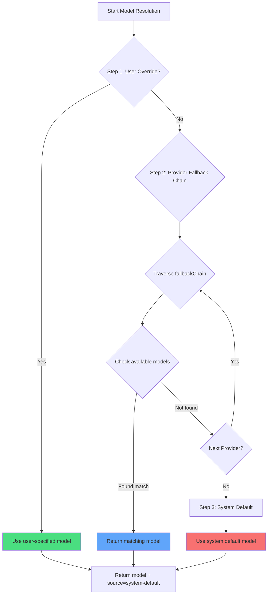

# Multi-Model Strategy: Automatic Fallback and Priority

## What You'll Learn

- Understand how oh-my-opencode automatically selects the most suitable AI model for each agent
- Master the three-step model resolution mechanism (User Override → Provider Fallback → System Default)
- Learn to configure model overrides for agents and Categories
- Use the `doctor` command to verify model resolution results
- Manually specify models based on task requirements to optimize cost and performance

## Your Current Struggles

After configuring multiple AI Providers (Anthropic, OpenAI, Google, etc.), you might encounter these confusions:

- **Unclear model selection**: Which model do agents like Sisyphus, Oracle, and Librarian actually use?
- **Tedious manual configuration**: Each agent requires individual model specification, and all need adjustment when Providers change
- **Uncontrollable costs**: Not knowing which tasks used expensive models (e.g., Claude Opus)
- **Provider outages affecting experience**: When one Provider's API goes down, the entire system stops working
- **Opaque multi-model collaboration**: It's unclear which models different agents used in parallel tasks

These issues prevent you from unleashing the true power of multi-model orchestration.

## Core Concept

**Model Resolution System** is oh-my-opencode's "intelligent model selector." It dynamically determines which model each agent and Category uses based on your configuration and available models.

::: info What is Model Resolution?
Model Resolution is the process of selecting a specific AI model for each agent or Category at runtime. It's not hard-coded but dynamically computed based on your configuration, available Providers, model names, and more.
:::

### Three-Step Resolution Process

Model resolution is achieved through three priority steps:



**Step 1: User Override**
- If you explicitly specify a `model` for an agent or Category in `oh-my-opencode.json`, the system uses that model directly
- Skips the Provider fallback chain
- This has the highest priority

**Step 2: Provider Fallback**
- If there's no user override, the system tries according to a predefined Provider priority chain
- Each agent or Category has a `fallbackChain` that defines its preferred Provider order
- The system tries each Provider in sequence until it finds an available model

**Step 3: System Default**
- If all Providers have no available models, use OpenCode's default model
- This is the final fallback

### Agent Provider Priority Chains

Each agent has its own preferred Provider order, which depends on the agent's task type and required capabilities:

| Agent | Recommended Model (no prefix) | Provider Fallback Chain | Variant |
|------|-------------------------------|-------------------------|---------|
| **Sisyphus** | `claude-opus-4-5` | anthropic → github-copilot → opencode → zai-coding-plan | max |
| **Oracle** | `gpt-5.2` | openai → anthropic → google | high |
| **Librarian** | `big-pickle` | zai-coding-plan → opencode → anthropic | - |
| **Explore** | `claude-haiku-4-5` | anthropic → opencode → github-copilot | - |
| **Multimodal Looker** | `gemini-3-flash` | google → openai → zai-coding-plan → anthropic → opencode | - |
| **Prometheus** | `claude-opus-4-5` | anthropic → github-copilot → opencode → google | max |
| **Metis** | `claude-opus-4-5` | anthropic → github-copilot → opencode → google | max |
| **Momus** | `gpt-5.2` | openai → anthropic → google | medium |
| **Atlas** | `claude-sonnet-4-5` | anthropic → github-copilot → opencode → google | - |

::: tip Why Does Sisyphus Prefer Anthropic?
Sisyphus is the main orchestrator and needs powerful reasoning capabilities. Claude Opus is the model most suitable for complex orchestration tasks, so Anthropic ranks first in its fallback chain. If your Anthropic quota is insufficient, the system will automatically fall back to other Providers.
:::

### Category Provider Priority Chains

Categories follow the same resolution logic:

| Category | Recommended Model (no prefix) | Provider Fallback Chain | Variant |
|----------|-------------------------------|-------------------------|---------|
| **visual-engineering** | `gemini-3-pro` | google → anthropic → openai | - |
| **ultrabrain** | `gpt-5.2-codex` | openai → anthropic → google | xhigh |
| **artistry** | `gemini-3-pro` | google → anthropic → openai | max |
| **quick** | `claude-haiku-4-5` | anthropic → google → opencode | - |
| **unspecified-low** | `claude-sonnet-4-5` | anthropic → openai → google | - |
| **unspecified-high** | `claude-opus-4-5` | anthropic → openai → google | max |
| **writing** | `gemini-3-flash` | google → anthropic → zai-coding-plan → openai | - |

::: tip Advantage of Categories
When delegating tasks via `delegate_task(category="quick", ...)`, the system automatically uses the quick Category's Provider fallback chain. This means you don't need to remember each agent's configuration, just select the appropriate Category based on task type.
:::

## Follow Along

### Step 1: Check Current Model Resolution Status

Use the `doctor` command to view the model resolution results for each agent and Category:

```bash
bunx oh-my-opencode doctor --verbose
```

**You should see** output similar to this:

```
✅ Model Resolution Check
━━━━━━━━━━━━━━━━━━━━━━━━━━━━━━━━━━━━━━━━━━━━━━━━━━━

Agent: sisyphus
  Requirement: claude-opus-4-5 (variant: max)
  Fallback Chain: anthropic → github-copilot → opencode → zai-coding-plan → openai → google
  User Override: (none)
  Resolved Model: anthropic/claude-opus-4-5
  Source: provider-fallback
  Variant: max

Agent: oracle
  Requirement: gpt-5.2 (variant: high)
  Fallback Chain: openai → anthropic → google
  User Override: (none)
  Resolved Model: openai/gpt-5.2
  Source: provider-fallback
  Variant: high

Category: quick
  Requirement: claude-haiku-4-5
  Fallback Chain: anthropic → google → opencode
  User Override: (none)
  Resolved Model: anthropic/claude-haiku-4-5
  Source: provider-fallback
  Variant: high
```

This output shows:
- Model requirements for each agent/Category
- Order of Provider fallback chains
- Whether there's a user override configuration
- Final resolved model and source (override/provider-fallback/system-default)

### Step 2: Manually Override Agent Model

Suppose you want Oracle to use OpenAI's latest model instead of the default GPT-5.2:

Edit `~/.config/opencode/oh-my-opencode.json` or `.opencode/oh-my-opencode.json`:

```jsonc
{
  "$schema": "https://raw.githubusercontent.com/code-yeongyu/oh-my-opencode/master/assets/oh-my-opencode.schema.json",

  "agents": {
    "oracle": {
      "model": "openai/o3"  // Override to o3 model
    },
    "explore": {
      "model": "opencode/gpt-5-nano"  // Use free model
    }
  }
}
```

::: info Step 1 Priority
When you set `agents.oracle.model`, the system uses this model directly in Step 1, skipping the Provider fallback chain. Even if Anthropic's Claude Opus is available, Oracle will use the OpenAI o3 you specified.
:::

**You should see**: When running the `doctor` command again, Oracle's resolution result changes to:

```
Agent: oracle
  Requirement: gpt-5.2 (variant: high)
  Fallback Chain: openai → anthropic → google
  User Override: openai/o3  // ← User override takes effect
  Resolved Model: openai/o3
  Source: override  // ← Source becomes override
  Variant: high
```

### Step 3: Manually Override Category Model

Suppose you want the `quick` Category to use the free GPT-5 Nano:

```jsonc
{
  "$schema": "https://raw.githubusercontent.com/code-yeongyu/oh-my-opencode/master/assets/oh-my-opencode.schema.json",

  "categories": {
    "quick": {
      "model": "opencode/gpt-5-nano"  // Override to free model
    },
    "visual-engineering": {
      "model": "anthropic/claude-opus-4-5"  // Force use Opus
    }
  }
}
```

**You should see**: When you use `delegate_task(category="quick", ...)`, the system uses `opencode/gpt-5-nano`, even if Anthropic's Haiku is available.

### Step 4: Simulate Provider Failure

The best way to understand the Provider fallback mechanism is to simulate failure scenarios.

Suppose you only configured OpenAI but want to see which model Sisyphus (which prefers Anthropic) will use:

**Current Configuration**:
```jsonc
{
  // oh-my-opencode.json
  // Only configured openai provider
}
```

**Run doctor**:

```
Agent: sisyphus
  Requirement: claude-opus-4-5 (variant: max)
  Fallback Chain: anthropic → github-copilot → opencode → zai-coding-plan → openai → google
  User Override: (none)
  
  // Round 1 attempt: anthropic/claude-opus-4-5
  // Result: unavailable (not configured)
  
  // Round 2 attempt: github-copilot/claude-opus-4-5
  // Result: unavailable (not configured)
  
  // Round 3 attempt: opencode/claude-opus-4-5
  // Result: unavailable (not configured)
  
  // Round 4 attempt: zai-coding-plan/glm-4.7
  // Result: unavailable (not configured)
  
  // Round 5 attempt: openai/gpt-5.2-codex (from 5th entry in fallbackChain)
  // Result: Found!
  
  Resolved Model: openai/gpt-5.2-codex
  Source: provider-fallback
  Variant: medium
```

**You should see**: Although Sisyphus prefers Claude Opus, because Anthropic is unavailable, the system falls back to OpenAI's GPT-5.2 Codex.

::: tip Advantage of Automatic Fallback
The Provider fallback mechanism ensures system robustness. Even if a Provider fails or quota runs out, the system can automatically switch to backup Providers without manual intervention.
:::

### Step 5: Verify System Default Fallback

Suppose you haven't configured any Provider, or all Providers have failed:

**Run doctor**:

```
Agent: sisyphus
  Requirement: claude-opus-4-5
  Fallback Chain: anthropic → github-copilot → ...
  
  // All Provider attempts failed
  
  Resolved Model: anthropic/claude-opus-4-5  // Use system default
  Source: system-default  // ← Source is system-default
  Variant: max
```

**You should see**: The system uses the default model configured by OpenCode. This is the final safety net.

## Checkpoint ✅

After completing the above steps, verify:

- [ ] Running `doctor --verbose` shows model resolution results for all agents and Categories
- [ ] After manually overriding agent models, `Source` becomes `override`
- [ ] After manually overriding Category models, `delegate_task` uses the specified model
- [ ] When simulating Provider failure, the system correctly falls back to the next available Provider
- [ ] When all Providers are unavailable, the system uses `system-default`

If any item fails, check:
- Whether the configuration file path is correct (`~/.config/opencode/oh-my-opencode.json` or `.opencode/oh-my-opencode.json`)
- Whether Providers are correctly configured (API keys, environment variables, etc.)
- Whether model names are correct (including Provider prefixes, e.g., `anthropic/claude-opus-4-5`)

## When to Use This

| Scenario | Manually Override Model | Use Provider Fallback |
|----------|-------------------------|-----------------------|
| **Cost-sensitive tasks** | ✅ Specify cheap model | ❌ Might choose expensive model |
| **Performance-sensitive tasks** | ✅ Specify strongest model | ❌ Might fall back to weak model |
| **Testing new models** | ✅ Specify experimental model | ❌ Won't auto-select |
| **Daily development** | ❌ Over-configuration | ✅ Auto-select optimal |
| **Provider failure** | ❌ Manual change needed | ✅ Auto fallback |
| **Multi-Provider environment** | ❌ Over-configuration | ✅ Auto load balancing |

**Rule of Thumb**:
- Only use manual override when you need precise control over models
- In other cases, let the system auto-select and enjoy Provider fallback robustness
- For cost-sensitive tasks, override to the `quick` Category or specify cheap models
- For highest performance tasks, override to `claude-opus-4-5` or `gpt-5.2`

## Common Pitfalls

::: warning Common Errors

**1. Missing Provider Prefix in Model Name**

```jsonc
// ❌ Wrong: Missing Provider prefix
{
  "agents": {
    "oracle": {
      "model": "gpt-5.2"  // Missing openai/ prefix
    }
  }
}

// ✅ Correct: Include full path
{
  "agents": {
    "oracle": {
      "model": "openai/gpt-5.2"  // Complete model path
    }
  }
}
```

**2. Overriding Non-Existent Models**

```jsonc
// ❌ Wrong: Model name typo
{
  "agents": {
    "oracle": {
      "model": "openai/gpt-6"  // GPT-6 doesn't exist
    }
  }
}

// ✅ Correct: Use real model
{
  "agents": {
    "oracle": {
      "model": "openai/gpt-5.2"  // Real model
    }
  }
}
```

**3. Ignoring Variant Configuration**

Some agents and Categories have recommended Variants (e.g., `max`, `high`, `medium`), which affect model reasoning capabilities. Be mindful when manually overriding:

```jsonc
// ✅ Recommended: Keep default Variant
{
  "agents": {
    "oracle": {
      "model": "openai/gpt-5.2"
      // Variant inherits from fallbackChain: high
    }
  }
}

// ✅ Optional: Manually specify Variant
{
  "agents": {
    "oracle": {
      "model": "openai/gpt-5.2",
      "variant": "max"  // Override default value
    }
  }
}
```

**4. Relying on System Default Without Configuring Providers**

System default models come from OpenCode's configuration. If you haven't configured any Provider, OpenCode might also use a default model, but that might not be what you want.

**Recommendations**:
- Configure at least one Provider (Anthropic, OpenAI, Google, etc.)
- Use the `doctor` command to regularly check model resolution results
:::

## Summary

The model resolution system achieves intelligent model selection through a three-step priority mechanism:

- **Step 1: User Override**: Models you specify have highest priority, fully controllable
- **Step 2: Provider Fallback**: Automatic fallback by predefined priority chains, ensuring robustness
- **Step 3: System Default**: Final fallback ensures the system always has a model available

Each agent and Category has its own Provider fallback chain, designed based on the agent's task type and required capabilities. Sisyphus prefers Anthropic (complex reasoning), Oracle prefers OpenAI (strategic consulting), Librarian prefers zai-coding-plan (multi-repo research).

Remember:
- **Daily Development**: Let the system auto-select and enjoy Provider fallback
- **Precise Control**: Manually override models to optimize cost and performance
- **Failure Recovery**: Provider fallback handles automatically, no manual intervention needed
- **Verification Tools**: Use `doctor` command to check model resolution results

## Next Up

> Next lesson: **[AI Agent Teams: 10 Experts Overview](../../advanced/ai-agents-overview/)**
>
> You'll learn:
> - Functions, use cases, and permission configuration for 10 built-in agents
> - How to select appropriate agents based on task type
> - Collaboration patterns and best practices between agents

---

## Appendix: Source Code Reference

<details>
<summary><strong>Click to expand source code locations</strong></summary>

> Last updated: 2026-01-26

| Feature | File Path | Line Numbers |
|---------|-----------|--------------|
| Model resolution core function | [`src/shared/model-resolver.ts`](https://github.com/code-yeongyu/oh-my-opencode/blob/main/src/shared/model-resolver.ts) | 43-98 |
| Agent model requirements definition | [`src/shared/model-requirements.ts`](https://github.com/code-yeongyu/oh-my-opencode/blob/main/src/shared/model-requirements.ts) | 12-79 |
| Category model requirements definition | [`src/shared/model-requirements.ts`](https://github.com/code-yeongyu/oh-my-opencode/blob/main/src/shared/model-requirements.ts) | 81-133 |
| Model resolution during agent creation | [`src/agents/utils.ts`](https://github.com/code-yeongyu/oh-my-opencode/blob/main/src/agents/utils.ts) | 203-208, 245-250, 284-289 |
| Model resolution during Category delegation | [`src/tools/delegate-task/tools.ts`](https://github.com/code-yeongyu/oh-my-opencode/blob/main/src/tools/delegate-task/tools.ts) | 532-540 |
| Model resolution check in doctor command | [`src/cli/doctor/checks/model-resolution.ts`](https://github.com/code-yeongyu/oh-my-opencode/blob/main/src/cli/doctor/checks/model-resolution.ts) | 130-160 |

**Key Type Definitions**:
- `ModelResolutionInput`: Model resolution input parameters (`src/shared/model-resolver.ts:6-10`)
- `ExtendedModelResolutionInput`: Extended model resolution input, including fallbackChain and availableModels (`src/shared/model-resolver.ts:23-28`)
- `ModelResolutionResult`: Model resolution result, including model, source, variant (`src/shared/model-resolver.ts:17-21`)
- `ModelSource`: Model source enum (`override`/`provider-fallback`/`system-default`) (`src/shared/model-resolver.ts:12-16`)
- `FallbackEntry`: Provider fallback chain entry, including providers, model, variant (`src/shared/model-requirements.ts:1-5`)
- `ModelRequirement`: Model requirement definition, including fallbackChain and default variant (`src/shared/model-requirements.ts:7-10`)

**Key Constants**:
- `AGENT_MODEL_REQUIREMENTS`: Model requirement definitions for all agents, including fallbackChain (`src/shared/model-requirements.ts:12-79`)
- `CATEGORY_MODEL_REQUIREMENTS`: Model requirement definitions for all Categories (`src/shared/model-requirements.ts:81-133`)

**Key Functions**:
- `resolveModelWithFallback()`: Core model resolution function, implementing three-step priority mechanism (`src/shared/model-resolver.ts:43-98`)
- `resolveModel()`: Simple model resolution, for cases without fallbackChain (`src/shared/model-resolver.ts:35-41`)
- `normalizeModel()`: Normalize model name, remove leading/trailing whitespace (`src/shared/model-resolver.ts:30-33`)
- `createBuiltinAgents()`: Create all built-in agents, call model resolver to determine models (`src/agents/utils.ts:143-313`)

**Business Rules**:
| Rule ID | Rule Description | Tag |
|---------|------------------|-----|
| BR-4.1-7 | Model resolution priority: user override > Provider fallback > system default | [Fact] |
| BR-4.1-7-1 | Return directly on user override, skip Provider fallback chain | [Fact] |
| BR-4.1-7-2 | Try each Provider in order during Provider fallback | [Fact] |
| BR-4.1-7-3 | Check availableModels cache during Provider fallback, if empty check connectedProviders | [Fact] |
| BR-4.1-7-4 | Use systemDefaultModel when all Providers are unavailable | [Fact] |
| BR-4.1-7-5 | Sisyphus fallbackChain: anthropic → github-copilot → opencode → zai-coding-plan → openai → google | [Fact] |
| BR-4.1-7-6 | Oracle fallbackChain: openai → anthropic → google | [Fact] |
| BR-4.1-7-7 | Librarian fallbackChain: zai-coding-plan → opencode → anthropic | [Fact] |
| BR-4.1-7-8 | Explore fallbackChain: anthropic → opencode → github-copilot | [Fact] |
| BR-4.1-7-9 | Multimodal Looker fallbackChain: google → openai → zai-coding-plan → anthropic → opencode | [Fact] |

</details>
