# Main Orchestrator: Think and Execute Like a Senior Engineer

## What You'll Learn

- Understand how Sisyphus coordinates work like a real development team
- Master best practices for task delegation, enabling different expert agents to collaboratively complete complex tasks
- Learn how to significantly improve development efficiency through parallel background tasks
- Know when to let agents handle tasks themselves and when to delegate to experts

## Your Current Struggles

You may have encountered these problems:

- AI agents "give up halfway" and forget their goals while writing
- The same file gets modified repeatedly, requiring re-reading context each time
- You want AI to handle many tasks but can only queue them one by one
- Agents write code, but you still have to verify whether it's correct and if it breaks other features

**Root Cause**: You're asking a "jack-of-all-trades" to do all the work, but only experts truly understand specialized tasks.

## When to Use This

Sisyphus is your main orchestrator, suitable for these scenarios:

| Scenario | Suitable | Alternative |
|----------|----------|-------------|
| Complex feature development (3+ steps) | ✅ Highly Recommended | Prometheus + Atlas (requires detailed planning) |
| Quick fix of known bugs | ✅ Appropriate | Let Sisyphus handle it directly |
| Need to research multiple repos/docs | ✅ Highly Recommended | Use Sisyphus parallel delegation |
| Simple single-file modifications | ✅ Acceptable | Direct editing (simpler) |
| Need detailed project planning | ⚠️ Not Recommended | Use Prometheus to generate plan first |

## Core Concepts

**Sisyphus** is the main orchestrator agent that coordinates multiple AI experts like a real development team. Through responsibility separation and parallel delegation mechanisms, it enables professional sub-agents to leverage their respective strengths, achieving efficient collaboration.

Sisyphus is not a "smarter AI"—it's an **orchestration system**.

### Responsibility Separation

```mermaid
flowchart LR
    User[👤 You] --> Sisyphus[⚡ Sisyphus<br/>Main Orchestrator]
    
    Sisyphus --> Explore[🔍 Explore<br/>Codebase Search]
    Sisyphus --> Librarian[📚 Librarian<br/>Documentation Research]
    Sisyphus --> Oracle[🧠 Oracle<br/>Architecture Consultation]
    Sisyphus --> Junior[🪨 Sisyphus-Junior<br/>Task Execution]
    
    Explore -.Parallel.-> Sisyphus
    Librarian -.Parallel.-> Sisyphus
    Oracle -.-> Sisyphus
    Junior -.-> Sisyphus
```



**Sisyphus doesn't write code**. It's responsible for:

1. **Understanding your real needs** (not just surface-level requests)
2. **Determining who's best suited for the task** (not doing everything itself)
3. **Delegating tasks in parallel** (letting multiple experts work simultaneously)
4. **Verifying results** (never blindly trusting "I'm done")

### Why the Name Sisyphus?

In Greek mythology, Sisyphus was punished to endlessly push a boulder up a mountain.

This system's design philosophy: **Agents must complete all TODOs (finish pushing the boulder) before they can stop**.

::: info
This isn't punishment—it's a quality assurance mechanism. You don't want AI to give up halfway and leave a mess behind.
:::

### 32k Thinking Budget

Sisyphus uses **Claude Opus 4.5 + 32k thinking budget**.

What's the benefit?

| Low Budget (No Thinking) | 32k Thinking Budget |
|--------------------------|---------------------|
| Starts writing code directly | First deeply analyzes requirements, assesses complexity, breaks down tasks |
| Prone to missing edge cases | Proactively identifies potential issues and risks |
| Realizes it's on the wrong track halfway | Chooses the optimal approach from the start |

::: tip
Strongly recommend configuring **Opus 4.5** model for Sisyphus. The experience will be significantly worse with other models.
:::

## Follow Along

### Step 1: Create a Test Project

**Why**
You need a runnable project to observe Sisyphus's behavior.

```bash
mkdir my-app && cd my-app
npm create next-app@latest . -- --typescript --tailwind --eslint --no-src-dir
npm install
```

**You should see**: Project initialization complete, you can run `npm run dev` to start.

### Step 2: Give Sisyphus a Complex Task

Open the project in OpenCode and enter:

```
Add user login functionality, including:
- Email/password login
- JWT token storage
- Protected routes
- Login status check
```

Observe Sisyphus's response.

**You should see**:

1. Sisyphus doesn't immediately start writing code
2. It first creates a TODO list (detailed task breakdown)
3. Evaluates codebase patterns (checks configuration, file structure)
4. May ask you a few clarifying questions

**Checkpoint ✅**: Check OpenCode's TODO panel, you should see something like:

```
□ Install necessary dependencies (bcrypt, jsonwebtoken)
□ Create user model and type definitions
□ Implement login API endpoint
□ Create JWT signing and verification utilities
□ Add protected route middleware
□ Implement frontend login form
□ Add login state management
```

### Step 3: Observe Parallel Delegation (Critical Moment)

During implementation, Sisyphus may:

```
[Background Task Started]
- Task ID: bg_abc123
- Agent: explore
- Prompt: "Find existing auth patterns in this codebase..."

[Background Task Started]
- Task ID: bg_def456
- Agent: librarian
- Prompt: "Research JWT best practices for Next.js..."
```

**This is key**: Sisyphus **doesn't wait** for these tasks to complete—it continues working.

When you need results, it calls `background_output(task_id="...")` to retrieve them.

**Why is this faster?**

| Serial Approach (Traditional) | Parallel Approach (Sisyphus) |
|-------------------------------|------------------------------|
| Codebase search (2 min) | ⏳ Codebase search (2 min) |
| Waiting... | ⏳ Documentation research (2 min, concurrent) |
| Documentation research (2 min) | Start implementation (total 2 min) |
| Start implementation (2 min) |  |
| **Total: 6 min** | **Total: 4 min (33% saved)** |

### Step 4: Verification Mechanism

When Sisyphus claims "task complete", it will:

1. Run `lsp_diagnostics` to check for errors
2. Run `npm run build` to ensure build passes
3. Run test suite if tests exist
4. Mark TODO as `completed`

**Checkpoint ✅**: Check terminal output, you should see something like:

```
✓ Running diagnostics on changed files...
✓ No errors found
✓ Build passed (exit code 0)
✓ All tests passed
```

If any verification fails, Sisyphus will immediately fix it—never leaving a mess behind.

### Step 5: Common Pitfalls

#### ❌ Wrong Practice: Interrupt Sisyphus's TODO Tracking

You see Sisyphus working on tasks and you're impatient:

```
Hurry up and write code! Stop planning!
```

**Problem**: Sisyphus will skip TODOs and write code directly, potentially missing edge cases.

**Correct Practice**:

```
Wait for Sisyphus to finish planning. If you think the plan is wrong, give specific improvement suggestions:
"Step 3 in the TODO should consider the database migration plan first."
```

#### ❌ Wrong Practice: Not Letting Sisyphus Delegate

You disable all expert agents in configuration, leaving only Sisyphus.

**Problem**: Sisyphus will try to do everything itself, but may not be professional enough.

**Correct Practice**:

Keep default configuration and let Sisyphus automatically delegate to experts:

| Task | Sisyphus Itself | Delegate to Expert |
|------|-----------------|-------------------|
| Simple single-file modification | ✅ OK | Not needed |
| Codebase search | ⚠️ Slow | ✅ Explore (faster) |
| Documentation research | ⚠️ May be inaccurate | ✅ Librarian (more professional) |
| Architecture decisions | ❌ Not recommended | ✅ Oracle (more authoritative) |

## Lesson Summary

Sisyphus's power doesn't come from being "smarter", but from:

1. **Responsibility Separation**: Main orchestrator + professional team, not working alone
2. **Deep Thinking**: 32k thinking budget ensures no details are missed
3. **Parallel Execution**: Background tasks let multiple experts work simultaneously
4. **Mandatory Verification**: No evidence = task not complete
5. **TODO Tracking**: Giving up halfway is not allowed

**Core Principles**:

::: tip
**Delegate by Default**: Unless the task is extremely simple (single file, known location), prioritize delegating to experts or using Category+Skill.
:::

## Preview Next Lesson

> Next lesson, we'll learn **[Ultrawork Mode](../ultrawork-mode/)** to activate all features with one click, letting Sisyphus go all-out to complete complex tasks.
>
> You'll learn:
> - How to quickly start tasks using the `ultrawork` keyword
> - What additional capabilities Ultrawork mode activates
> - When to use Ultrawork vs. when to use Prometheus

---

## Appendix: Source Code Reference

<details>
<summary><strong>Click to expand source code locations</strong></summary>

> Last updated: 2026-01-26

| Feature | File Path | Lines |
|---------|-----------|-------|
| Sisyphus agent factory | [`src/agents/sisyphus.ts`](https://github.com/code-yeongyu/oh-my-opencode/blob/main/src/agents/sisyphus.ts) | 419-450 |
| Sisyphus core prompt | [`src/agents/sisyphus.ts`](https://github.com/code-yeongyu/oh-my-opencode/blob/main/src/agents/sisyphus.ts) | 17-416 |
| Agent metadata and model configuration | [`src/agents/AGENTS.md`](https://github.com/code-yeongyu/oh-my-opencode/blob/main/src/agents/AGENTS.md) | 24-36 |
| Tool permission restrictions | [`src/agents/AGENTS.md`](https://github.com/code-yeongyu/oh-my-opencode/blob/main/src/agents/AGENTS.md) | 44-51 |

**Key Configuration**:
- **Thinking Budget**: 32k tokens (Anthropic models only)
- **Temperature**: 0.1 (code agents fixed low temperature)
- **Max Tokens**: 64000
- **Recommended Model**: anthropic/claude-opus-4-5

**Core Workflow** (from source code):
- **Phase 0**: Intent Gate (intent classification, lines 53-103)
- **Phase 1**: Codebase Assessment (codebase evaluation, lines 107-130)
- **Phase 2A**: Exploration & Research (lines 132-172)
- **Phase 2B**: Implementation (lines 176-263)
- **Phase 2C**: Failure Recovery (lines 266-283)
- **Phase 3**: Completion (lines 286-302)

**Key Constraints**:
- **Non-trivial tasks must create TODO** (line 311)
- **Background tasks must be parallel** (lines 144-162)
- **Must verify results** (lines 254-262)

</details>
