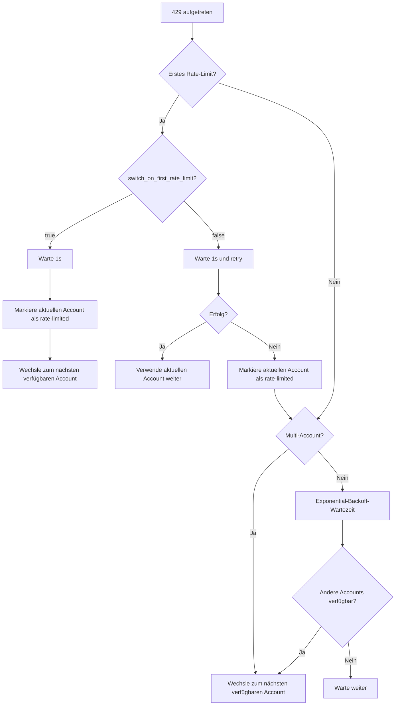

# Rate-Limiting-Behandlung: Automatischer Retry und Account-Switching-Mechanismus

## Was Sie lernen werden

Verstehen und beherrschen Sie den intelligenten Rate-Limiting-Behandlungsmechanismus von Antigravity Auth:
- Unterscheiden Sie 5 verschiedene Arten von 429-Fehlern (Quota erschöpft, Rate-Limit überschritten, Kapazität erschöpft usw.)
- Verstehen Sie den Exponential-Backoff-Algorithmus für automatische Retries
- Beherrschen Sie die automatische Switching-Logik in Multi-Account-Szenarien
- Konfigurieren Sie sofortiges Switching beim ersten Rate-Limit oder Switching nach zwei Retries
- Verwenden Sie den Gemini Dual-Quota-Pool-Fallback zur Verbesserung der Verfügbarkeit

Sie werden nicht mehr von "Alle Accounts sind rate-limited, aber das Quota ist noch nicht aufgebraucht" frustriert sein.

## Ihre aktuelle Herausforderung

Bei der Verwendung mehrerer Google-Accounts stoßen Sie auf:
- Häufige 429 Rate-Limits, ohne zu wissen, ob Sie retryen oder den Account wechseln sollen
- Große Unterschiede in den Wartezeiten für verschiedene 429-Typen, ohne zu wissen, wie lange gewartet werden muss
- Alle Accounts sind rate-limited, aber das tatsächliche Quota ist nicht aufgebraucht, weil die Rate-Limit-Erkennung ungenau ist
- Unklare Timing für den Gemini Dual-Quota-Pool-Switch, was zu Quota-Verschwendung führt

## Wann Sie diese Technik anwenden sollten

Wenn Sie:
- Mehrere Accounts konfiguriert haben, aber häufig 429-Fehler erhalten
- Die Erfolgsrate von Anfragen in Multi-Account-Szenarien optimieren möchten
- Retry-Strategien anpassen müssen (z.B. sofortiges Switching beim ersten Rate-Limit)
- Gemini-Modelle verwenden und den Dual-Quota-Pool nutzen möchten

## Kernkonzept

### Was ist Rate-Limiting-Behandlung

Wenn das Antigravity Auth-Plugin auf einen 429-Fehler stößt, führt es automatisch die folgenden Aktionen aus:

1. **Rate-Limit-Typ erkennen**: Analysieren Sie `reason` oder `message` in der Antwort, um 5 Arten von Rate-Limits zu unterscheiden
2. **Backoff-Zeit berechnen**: Intelligente Berechnung der Wartezeit basierend auf Rate-Limit-Typ und Anzahl der Fehlversuche
3. **Strategie ausführen**:
   - **Multi-Account**: Bevorzugter Wechsel zu verfügbaren Accounts
   - **Single-Account**: Exponential-Backoff-Retry
4. **Status aufzeichnen**: Aktualisieren Sie den Rate-Limit-Status des Accounts für zukünftige Anfragen

::: info Warum ist intelligente Behandlung erforderlich?
Google hat Rate-Limits für jeden Account. Wenn Sie einfach "bei 429 wechseln", kann dies zu häufigem Wechseln führen und schnell wiederhergestellte Accounts verpassen; wenn Sie einfach "warten und retryen", können Sie Quotas anderer verfügbarer Accounts verschwenden. Intelligente Behandlung muss das optimale Gleichgewicht zwischen "Wechseln" und "Warten" finden.
:::

### 5 Arten von Rate-Limit-Typen

Antigravity Auth unterscheidet die folgenden 5 Arten von Rate-Limits basierend auf dem `reason`-Feld oder dem `message`-Inhalt in der API-Antwort:

| Typ | Ursache | Backoff-Strategie | Typisches Szenario |
| --- | --- | --- | --- |
| `QUOTA_EXHAUSTED` | Quota aufgebraucht (Tages- oder Monatsquota) | Inkrementeller Backoff: 1min → 5min → 30min → 120min | Tagesquota erschöpft |
| `RATE_LIMIT_EXCEEDED` | Anfragen zu schnell (pro Minute begrenzt) | Fest 30 Sekunden | Kurzzeitig viele Anfragen |
| `MODEL_CAPACITY_EXHAUSTED` | Model-Server-Kapazität unzureichend | Fest 15 Sekunden | Spitzenzeiten |
| `SERVER_ERROR` | Interner Serverfehler (5xx) | Fest 20 Sekunden | Instabiler Service |
| `UNKNOWN` | Unbekannte Ursache | Fest 60 Sekunden | Nicht parsbarer Fehler |

**Backoff-Zeit-Berechnungsformel** (accounts.ts:51-75):

```typescript
// QUOTA_EXHAUSTED: Inkrementeller Backoff (basierend auf aufeinanderfolgenden Fehlversuchen)
// 1 Fehler: 1min (60_000ms)
// 2 Fehler: 5min (300_000ms)
// 3 Fehler: 30min (1_800_000ms)
// 4+ Fehler: 120min (7_200_000ms)

// Andere Typen: Fester Backoff
// RATE_LIMIT_EXCEEDED: 30s
// MODEL_CAPACITY_EXHAUSTED: 15s
// SERVER_ERROR: 20s
// UNKNOWN: 60s
```

### Exponential-Backoff-Algorithmus

Antigravity Auth verwendet einen **deduplizierten Exponential-Backoff**-Algorithmus:

**Kernlogik** (plugin.ts:509-567):

```typescript
// 1. Deduplizierungsfenster: Gleichzeitige 429 innerhalb von 2 Sekunden werden als ein Ereignis betrachtet
const RATE_LIMIT_DEDUP_WINDOW_MS = 2000;

// 2. Status-Reset: Zurücksetzen des Zählers nach 2 Minuten ohne 429
const RATE_LIMIT_STATE_RESET_MS = 120_000;

// 3. Exponential-Backoff: baseDelay * 2^(attempt-1), maximal 60s
const expBackoff = Math.min(baseDelay * Math.pow(2, attempt - 1), 60000);
```

**Warum wird ein Deduplizierungsfenster benötigt?**

Angenommen, Sie haben 3 gleichzeitige Anfragen, die gleichzeitig 429 auslösen:
- **Ohne Deduplizierung**: Jede Anfrage erhöht den Zähler um 1, was zu attempt=3 führt, Backoff 4s (2^2 × 1s)
- **Mit Deduplizierung**: Betrachtet als ein Ereignis, attempt=1, Backoff 1s

Das Deduplizierungsfenster kann verhindern, dass gleichzeitige Anfragen die Backoff-Zeit übermäßig verlängern.

### Multi-Account-Switching-Logik

Antigravity Auth verwendet eine **Priorisierung des Switchings, Retry als Fallback**-Strategie in Multi-Account-Szenarien:

**Entscheidungsfluss**:



**Schlüsselkonfiguration** (config/schema.ts:256-259):

| Konfiguration | Standardwert | Beschreibung |
| --- | --- | --- |
| `switch_on_first_rate_limit` | `true` | Beim ersten Rate-Limit sofort Account wechseln (nach 1s Wartezeit) |
| `max_rate_limit_wait_seconds` | `300` | Maximale Wartezeit, wenn alle Accounts rate-limited sind (5 Minuten) |

**Empfohlene Konfiguration**:

- **Multi-Account (2+)**：`switch_on_first_rate_limit: true`, sofort wechseln, um Quota-Verschwendung zu vermeiden
- **Single-Account**：Diese Konfiguration ist wirkungslos, automatischer Exponential-Backoff-Retry wird verwendet

### Gemini Dual-Quota-Pool Fallback

Gemini-Modelle unterstützen zwei unabhängige Quota-Pools:
- **Antigravity-Quota-Pool**：Prioritätsnutzung, aber kleinere Kapazität
- **Gemini CLI-Quota-Pool**：Alternative Nutzung, größere Kapazität

**Fallback-Logik** (plugin.ts:1318-1345):

```
1. Anfrage mit Antigravity-Quota-Pool initiieren
2. 429 Rate-Limit aufgetreten
3. Prüfen, ob andere Accounts Antigravity-Quota verfügbar haben
   - Ja: Account wechseln, Antigravity weiterverwenden
   - Nein: Wenn quota_fallback=true, zu Gemini CLI-Quota-Pool wechseln
```

**Konfigurationsoption** (config/schema.ts:179):

```json
{
  "quota_fallback": true  // Standard false
}
```

**Beispiel**:

Sie haben 2 Accounts, beide treffen auf 429:

| Status | quota_fallback=false | quota_fallback=true |
| --- | --- | --- |
| Account 1 (Antigravity) | Rate-limited | Rate-limited → Versuch Gemini CLI |
| Account 2 (Antigravity) | Rate-limited | Rate-limited → Versuch Gemini CLI |
| Ergebnis | 5 Minuten warten und retry | Zu Gemini CLI wechseln, kein Warten |

::: tip Vorteile des Dual-Quota-Pool
Der Gemini CLI-Quota-Pool ist normalerweise größer, Fallback kann die Anfrageerfolgsrate erheblich verbessern. Aber beachten Sie:
- Modelle mit explizitem `:antigravity`-Suffix werden nicht fallbacken
- Fallback erfolgt nur, wenn alle Accounts Antigravity-Quota aufgebraucht haben
:::

### Single-Account-Retry-Logik

Wenn nur ein Account vorhanden ist, verwendet Antigravity Auth **Exponential-Backoff-Retry**:

**Retry-Formel** (plugin.ts:1373-1375):

```typescript
// Erstes Mal: 1s
// 2. Mal: 2s (1s × 2^1)
// 3. Mal: 4s (1s × 2^2)
// 4. Mal: 8s (1s × 2^3)
// ...
// Maximum: 60s
const expBackoffMs = Math.min(1000 * Math.pow(2, attempt - 1), 60000);
```

**Retry-Ablauf**:

```
1. Mal: 429 aufgetreten
  ↓ 1s warten und retry (schneller Retry)
2. Mal: Immer noch 429
  ↓ 2s warten und retry
3. Mal: Immer noch 429
  ↓ 4s warten und retry
...
```

**Unterschied zu Multi-Account**:

| Szenario | Strategie | Wartezeit |
| --- | --- | --- |
| Single-Account | Exponential-Backoff-Retry | 1s → 2s → 4s → 8s → ... → 60s |
| Multi-Account | Account wechseln | 1s (erstes Mal) oder 5s (2. Mal) |

## 🎒 Vorbereitung vor dem Start

::: warning Voraussetzungen prüfen
Stellen Sie sicher, dass Sie abgeschlossen haben:
- [x] Multi-Account-Setup (mindestens 2 Google-Accounts)
- [x] Verständnis der [Account-Auswahlstrategien](/de/NoeFabris/opencode-antigravity-auth/advanced/account-selection-strategies/)
- [x] Verständnis des [Dual-Quota-Systems](/de/NoeFabris/opencode-antigravity-auth/platforms/dual-quota-system/)
:::

## Schritt-für-Schritt-Anleitung

### Schritt 1: Debug-Logging aktivieren, um Rate-Limits zu beobachten

**Warum**
Debug-Logs können detaillierte Rate-Limit-Informationen anzeigen und helfen Ihnen, die Funktionsweise des Plugins zu verstehen.

**Aktion**

Debug-Logging aktivieren:

```bash
export OPENCODE_ANTIGRAVITY_DEBUG=1
```

Anfrage initiieren, um Rate-Limit auszulösen:

```bash
# Mehrere parallele Anfragen initiieren (stellen Sie sicher, dass 429 ausgelöst wird)
for i in {1..10}; do
  opencode run "Test $i" --model=google/antigravity-gemini-3-pro &
done
wait
```

**Sie sollten sehen**:

```
[RateLimit] 429 on Account 0 family=claude retryAfterMs=60000
  message: You have exceeded the quota for this request.
  quotaResetTime: 2026-01-23T12:00:00Z
  retryDelayMs: 60000
  reason: QUOTA_EXHAUSTED

Rate limited. Quick retry in 1s... (Toast-Benachrichtigung)
```

**Log-Interpretation**:

- `429 on Account 0 family=claude`: Rate-Limit für Account 0, Claude-Modell
- `retryAfterMs=60000`: Server empfiehlt 60 Sekunden Wartezeit
- `reason: QUOTA_EXHAUSTED`: Quota aufgebraucht (Backoff-Zeit erhöht sich)

### Schritt 2: Sofortiges Switching beim ersten Rate-Limit konfigurieren

**Warum**
Wenn Sie mehrere Accounts haben, kann sofortiges Switching beim ersten Rate-Limit die Quota-Nutzung maximieren und Wartezeiten vermeiden.

**Aktion**

Konfigurationsdatei ändern:

```bash
cat > ~/.config/opencode/antigravity.json << 'EOF'
{
  "$schema": "https://raw.githubusercontent.com/NoeFabris/opencode-antigravity-auth/main/assets/antigravity.schema.json",
  "switch_on_first_rate_limit": true
}
EOF
```

**Sie sollten sehen**: Konfigurationsdatei wurde aktualisiert.

**Konfiguration überprüfen**:

Mehrere Anfragen initiieren und das Verhalten nach dem ersten Rate-Limit beobachten:

```bash
export OPENCODE_ANTIGRAVITY_DEBUG=1
for i in {1..5}; do
  opencode run "Test $i" --model=google/antigravity-gemini-3-pro &
done
wait
```

**Sie sollten sehen**:

```
[RateLimit] 429 on Account 0 family=gemini retryAfterMs=30000
Server at capacity. Switching account in 1s... (Toast-Benachrichtigung)
[AccountContext] Selected account: user2@gmail.com (index: 1)
```

**Schlüsselpunkte**:
- 1s Wartezeit nach erstem 429
- Automatischer Wechsel zum nächsten verfügbaren Account (index: 1)
- Kein erneuter Retry des aktuellen Accounts

### Schritt 3: Deaktivierung des sofortigen Switching beim ersten Rate-Limit

**Warum**
Wenn Sie zuerst den aktuellen Account retryen möchten (um häufiges Wechseln zu vermeiden), können Sie diese Option deaktivieren.

**Aktion**

Konfigurationsdatei ändern:

```bash
cat > ~/.config/opencode/antigravity.json << 'EOF'
{
  "$schema": "https://raw.githubusercontent.com/NoeFabris/opencode-antigravity-auth/main/assets/antigravity.schema.json",
  "switch_on_first_rate_limit": false
}
EOF
```

**Sie sollten sehen**: Konfigurationsdatei wurde aktualisiert.

**Konfiguration überprüfen**:

Erneut mehrere Anfragen initiieren:

```bash
export OPENCODE_ANTIGRAVITY_DEBUG=1
for i in {1..5}; do
  opencode run "Test $i" --model=google/antigravity-gemini-3-pro &
done
wait
```

**Sie sollten sehen**:

```
[RateLimit] 429 on Account 0 family=gemini retryAfterMs=30000
Rate limited. Quick retry in 1s... (Toast-Benachrichtigung)
[RateLimit] 429 on Account 0 family=gemini retryAfterMs=30000
Rate limited again. Switching account in 5s... (Toast-Benachrichtigung)
[AccountContext] Selected account: user2@gmail.com (index: 1)
```

**Schlüsselpunkte**:
- Erstes 429: 1s warten und **aktuellen Account retryen**
- Zweites 429: 5s warten und dann **Account wechseln**
- Wenn Retry erfolgreich, aktuellen Account weiterverwenden

### Schritt 4: Aktivierung des Gemini Dual-Quota-Pool Fallback

**Warum**
Gemini-Modelle unterstützen Dual-Quota-Pools, die Aktivierung von Fallback kann die Anfrageerfolgsrate erheblich verbessern.

**Aktion**

Konfigurationsdatei ändern:

```bash
cat > ~/.config/opencode/antigravity.json << 'EOF'
{
  "$schema": "https://raw.githubusercontent.com/NoeFabris/opencode-antigravity-auth/main/assets/antigravity.schema.json",
  "quota_fallback": true
}
EOF
```

**Sie sollten sehen**: Konfigurationsdatei wurde aktualisiert.

**Konfiguration überprüfen**:

Gemini-Anfrage initiieren (stellen Sie sicher, dass Antigravity-Quota-Pool-Rate-Limit ausgelöst wird):

```bash
export OPENCODE_ANTIGRAVITY_DEBUG=1
for i in {1..5}; do
  opencode run "Test $i" --model=google/antigravity-gemini-3-pro &
done
wait
```

**Sie sollten sehen**:

```
[RateLimit] 429 on Account 0 family=gemini retryAfterMs=30000
Antigravity quota exhausted for gemini-3-pro. Switching to Gemini CLI quota... (Toast-Benachrichtigung)
[DEBUG] quota fallback: gemini-cli
```

**Schlüsselpunkte**:
- Nachdem alle Accounts Antigravity-Quota aufgebraucht haben
- Automatischer Wechsel zum Gemini CLI-Quota-Pool
- Kein Warten erforderlich, direkter Retry

**Antigravity-Quota erzwingen** (kein Fallback):

```bash
# Explizites Suffix :antigravity verwenden
opencode run "Test" --model=google/antigravity-gemini-3-pro:antigravity
```

### Schritt 5: Konfiguration der maximalen Wartezeit

**Warum**
Wenn alle Accounts rate-limited sind, wartet das Plugin auf die kürzeste Reset-Zeit. Sie können die maximale Wartezeit konfigurieren, um unendliches Warten zu vermeiden.

**Aktion**

Konfigurationsdatei ändern:

```bash
cat > ~/.config/opencode/antigravity.json << 'EOF'
{
  "$schema": "https://raw.githubusercontent.com/NoeFabris/opencode-antigravity-auth/main/assets/antigravity.schema.json",
  "max_rate_limit_wait_seconds": 60
}
EOF
```

**Sie sollten sehen**: Konfigurationsdatei wurde aktualisiert.

**Konfiguration überprüfen**:

Alle Accounts rate-limited auslösen:

```bash
export OPENCODE_ANTIGRAVITY_DEBUG=1
for i in {1..20}; do
  opencode run "Test $i" --model=google/antigravity-claude-opus-4.5 &
done
wait
```

**Sie sollten sehen**:

```
[RateLimit] 429 on Account 0 family=claude retryAfterMs=60000
[RateLimit] 429 on Account 1 family=claude retryAfterMs=60000
[DEBUG] All accounts rate limited. Min wait time: 60s, max wait: 60s
Rate limited. Retrying in 60s... (Toast-Benachrichtigung)
```

**Schlüsselpunkte**:
- Wenn alle Accounts rate-limited sind, wird die kürzeste Reset-Zeit gewartet
- Wenn kürzeste Reset-Zeit > `max_rate_limit_wait_seconds`, wird der Maximalwert verwendet
- Standardmäßige maximale Wartezeit 300 Sekunden (5 Minuten)

## Prüfpunkt ✅

::: tip Wie überprüfe ich, ob die Konfiguration wirksam ist?
1. Konfigurationsdatei anzeigen, um sicherzustellen, dass Konfigurationselemente korrekt sind
2. Debug-Logging aktivieren: `OPENCODE_ANTIGRAVITY_DEBUG=1`
3. `[RateLimit]`-Ereignisse in den Logs beobachten
4. Account-Switching-Verhalten beobachten (`AccountContext`-Logs)
5. Überprüfen, ob Toast-Benachrichtigungen wie erwartet angezeigt werden
:::

## Häufige Fehler

### ❌ Deduplizierungsfenster ignorieren, Backoff-Zeit falsch verstehen

**Falsches Verhalten**:
- 10 gleichzeitige Anfragen initiieren, alle treffen auf 429
- Glauben, Backoff-Zeit ist 2^10 × 1s = 1024s
- Tatsächlich ist es 1s (wegen Deduplizierungsfenster)

**Richtige Vorgehensweise**: Verstehen Sie das 2-Sekunden-Deduplizierungsfenster, gleichzeitige Anfragen werden nicht doppelt gezählt.

### ❌ `switch_on_first_rate_limit` mit Single-Account verwechseln

**Falsches Verhalten**:
- Nur 1 Account, aber `switch_on_first_rate_limit: true` konfiguriert
- Glauben, Account wird gewechselt, aber es gibt keinen anderen Account zum Wechseln

**Richtige Vorgehensweise**: In Single-Account-Szenarien ist diese Konfiguration wirkungslos, automatischer Exponential-Backoff-Retry wird verwendet.

### ❌ Explizites Suffix verhindert Fallback

**Falsches Verhalten**:
- `google/antigravity-gemini-3-pro:antigravity` verwenden
- `quota_fallback: true` konfiguriert
- Aber bei 429 wird nicht zu Gemini CLI gefallbackt

**Richtige Vorgehensweise**: Explizite Suffixe erzwingen die Verwendung des angegebenen Quota-Pools, wenn Fallback benötigt wird, verwenden Sie kein Suffix.

### ❌ Zu lange Wartezeit nachdem alle Accounts rate-limited sind

**Falsches Verhalten**:
- `max_rate_limit_wait_seconds: 600` (10 Minuten) konfiguriert
- Alle Accounts 60s rate-limited, aber 10 Minuten gewartet

**Richtige Vorgehensweise**: `max_rate_limit_wait_seconds` ist der **Maximalwert**, die tatsächliche Wartezeit ist die kürzeste Reset-Zeit, die den Maximalwert nicht überschreitet.

## Zusammenfassung dieser Lektion

| Mechanismus | Kernmerkmal | Anwendungsszenario |
| --- | --- | --- |
| **Rate-Limit-Erkennung** | Unterscheidet 5 Typen (QUOTA_EXHAUSTED, RATE_LIMIT_EXCEEDED usw.) | Alle Szenarien |
| **Exponential-Backoff** | Mehr Fehlversuche, längere Wartezeit (1s → 2s → 4s → ... → 60s) | Single-Account |
| **Account-Switching** | Multi-Account priorisiert Switching, Single-Account Backoff-Retry | Multi-Account |
| **Deduplizierungsfenster** | Gleichzeitige 429 innerhalb von 2 Sekunden als ein Ereignis betrachtet | Gleichzeitige Szenarien |
| **Dual-Quota-Pool-Fallback** | Nach Antigravity-Rate-Limit zu Gemini CLI versuchen | Gemini-Modelle |

**Schlüsselkonfiguration**:

| Konfiguration | Standardwert | Empfohlener Wert | Beschreibung |
| --- | --- | --- | --- |
| `switch_on_first_rate_limit` | `true` | `true` (Multi-Account) | Beim ersten Rate-Limit sofort wechseln |
| `quota_fallback` | `false` | `true` (Gemini) | Dual-Quota-Pool-Fallback aktivieren |
| `max_rate_limit_wait_seconds` | `300` | `300` | Maximale Wartezeit (Sekunden) |

**Debug-Methoden**:

- Debug-Logging aktivieren: `OPENCODE_ANTIGRAVITY_DEBUG=1`
- `[RateLimit]`-Ereignisse anzeigen: Rate-Limit-Typ und Backoff-Zeit verstehen
- `[AccountContext]`-Logs anzeigen: Account-Switching-Verhalten beobachten

## Vorschau auf die nächste Lektion

> In der nächsten Lektion lernen wir **[Session-Recovery](/de/NoeFabris/opencode-antigravity-auth/advanced/session-recovery/)**.
>
> Sie werden lernen:
> - Wie unterbrochene Tool-Aufrufe automatisch wiederhergestellt werden
> - Session-Recovery-Mechanismus für Thinking-Modelle
> - Synthetic tool_result Injection-Prinzip

---

## Anhang: Quellcode-Referenz

<details>
<summary><strong>Klicken Sie, um Quellcode-Positionen anzuzeigen</strong></summary>

> Aktualisiert: 2026-01-23

| Funktion | Dateipfad | Zeilennummer |
| --- | --- | --- |
| Rate-Limit-Typ-Definition | [`src/plugin/accounts.ts`](https://github.com/NoeFabris/opencode-antigravity-auth/blob/main/src/plugin/accounts.ts#L10-L20) | 10-20 |
| Rate-Limit-Grund analysieren | [`src/plugin/accounts.ts`](https://github.com/NoeFabris/opencode-antigravity-auth/blob/main/src/plugin/accounts.ts#L29-L49) | 29-49 |
| Backoff-Zeit berechnen | [`src/plugin/accounts.ts`](https://github.com/NoeFabris/opencode-antigravity-auth/blob/main/src/plugin/accounts.ts#L51-L75) | 51-75 |
| Exponential-Backoff-Algorithmus | [`src/plugin.ts`](https://github.com/NoeFabris/opencode-antigravity-auth/blob/main/src/plugin.ts#L532-L567) | 532-567 |
| Account als rate-limited markieren | [`src/plugin/accounts.ts`](https://github.com/NoeFabris/opencode-antigravity-auth/blob/main/src/plugin/accounts.ts#L434-L461) | 434-461 |
| Prüfen, ob Account rate-limited ist | [`src/plugin/accounts.ts`](https://github.com/NoeFabris/opencode-antigravity-auth/blob/main/src/plugin/accounts.ts#L134-L152) | 134-152 |
| 429-Fehlerbehandlung | [`src/plugin.ts`](https://github.com/NoeFabris/opencode-antigravity-auth/blob/main/src/plugin.ts#L1260-L1396) | 1260-1396 |
| Gemini Dual-Quota-Pool-Fallback | [`src/plugin.ts`](https://github.com/NoeFabris/opencode-antigravity-auth/blob/main/src/plugin.ts#L1318-L1345) | 1318-1345 |
| Rate-Limit-Logging | [`src/plugin/debug.ts`](https://github.com/NoeFabris/opencode-antigravity-auth/blob/main/src/plugin/debug.ts#L354-L396) | 354-396 |
| Konfiguration Schema | [`src/plugin/config/schema.ts`](https://github.com/NoeFabris/opencode-antigravity-auth/blob/main/src/plugin/config/schema.ts#L256-L221) | 256-221 |

**Schlüsselkonstanten**:

- `QUOTA_EXHAUSTED_BACKOFFS = [60_000, 300_000, 1_800_000, 7_200_000]`: Inkrementelle Backoff-Zeiten bei Quota-Erschöpfung (accounts.ts:22)
- `RATE_LIMIT_EXCEEDED_BACKOFF = 30_000`: Fester Backoff bei Rate-Limit 30 Sekunden (accounts.ts:23)
- `MODEL_CAPACITY_EXHAUSTED_BACKOFF = 15_000`: Fester Backoff bei Kapazitätserschöpfung 15 Sekunden (accounts.ts:24)
- `SERVER_ERROR_BACKOFF = 20_000`: Fester Backoff bei Serverfehler 20 Sekunden (accounts.ts:25)
- `RATE_LIMIT_DEDUP_WINDOW_MS = 2000`: Deduplizierungsfenster 2 Sekunden (plugin.ts:509)
- `RATE_LIMIT_STATE_RESET_MS = 120_000`: Status-Reset 2 Minuten (plugin.ts:510)
- `FIRST_RETRY_DELAY_MS = 1000`: Erster schneller Retry 1 Sekunde (plugin.ts:1304)

**Schlüsselfunktionen**:

- `parseRateLimitReason(reason?, message?)`: Rate-Limit-Grund analysieren (accounts.ts:29)
- `calculateBackoffMs(reason, consecutiveFailures, retryAfterMs?)`: Backoff-Zeit berechnen (accounts.ts:51)
- `markRateLimitedWithReason(account, family, headerStyle, model, reason, retryAfterMs?)`: Account als rate-limited markieren (accounts.ts:445)
- `isRateLimitedForHeaderStyle(account, family, headerStyle, model?)`: Prüfen, ob Account rate-limited ist (accounts.ts:536)
- `getRateLimitBackoff(accountIndex, quotaKey, serverRetryAfterMs)`: Deduplizierte Backoff-Zeit abrufen (plugin.ts:532)
- `resetRateLimitState(accountIndex, quotaKey)`: Rate-Limit-Status zurücksetzen (plugin.ts:573)

</details>
