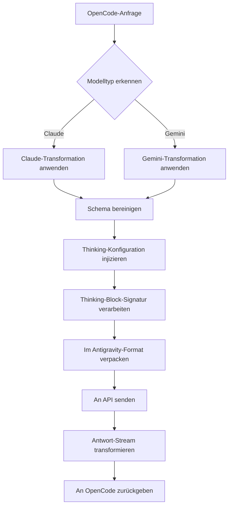

# Anfrage-Transformationsmechanismus: Multi-Modell-Protokollkompatibilität

## Was Sie nach diesem Tutorial können

- Verstehen, wie das Plugin Anfrageformate zwischen OpenCode und der Antigravity-API transformiert
- Die Protokollunterschiede zwischen Claude- und Gemini-Modellen sowie die Transformationsregeln beherrschen
- 400-Fehler aufgrund von Schema-Inkompatibilitäten beheben
- Thinking-Konfigurationen für optimale Leistung einrichten

## Ihre aktuelle Herausforderung

Möglicherweise sind Ihnen diese Probleme begegnet:

- ❌ Der MCP-Server gibt den Fehler `400 Unknown name 'parameters'` zurück
- ❌ Bei Verwendung des Gemini-Modells wird `400 Unknown name 'const'` angezeigt
- ❌ Die Thinking-Blöcke des Thinking-Modells werden nicht korrekt formatiert angezeigt
- ❌ Tool-Aufrufe schlagen mit der Meldung "Signatur-Validierungsfehler" fehl
- ❌ Sie verstehen nicht, warum das Plugin gleichzeitig Claude und Gemini unterstützt

## Wann Sie diese Technik anwenden

Wenn Sie Folgendes benötigen:

| Szenario | Warum Sie den Transformationsmechanismus verstehen müssen |
|----------|-------------------------------------------------------------|
| Entwicklung benutzerdefinierter MCP-Server | Sicherstellen, dass Tool-Schemas mit der Antigravity-API kompatibel sind |
| Fehlerbehebung bei 400/500-Fehlern | Feststellen, ob es sich um ein Schema- oder ein Transformationslogik-Problem handelt |
| Optimierung der Thinking-Leistung | Verstehen des Thinking-Block-Signatur- und Cache-Mechanismus |
| Debugging fehlgeschlagener Tool-Aufrufe | Überprüfung der Tool-ID-Zuweisung und Parametern-Signatur |

::: warning Voraussetzungen
Bevor Sie mit diesem Tutorial beginnen, stellen Sie sicher, dass Sie:
- ✅ Das Plugin `opencode-antigravity-auth` installiert haben
- ✅ Die verfügbaren Modelle und deren Varianten kennen
- ✅ Das Grundkonzept von Thinking-Modellen verstehen

[Tutorial zur Modellliste](../../platforms/available-models/) | [Tutorial zu Thinking-Modellen](../../platforms/thinking-models/)
:::

## Kernkonzept

Die Anfrage-Transformation ist der Kernmechanismus des Plugins. Er erledigt drei Dinge:

1. **OpenCode-Anfragen abfangen** — Abfangen des Aufrufs `fetch(generativeLanguage.googleapis.com)`
2. **Modell-Transformation anwenden** — Format je nach Modelltyp (Claude/Gemini) transformieren
3. **Verpacken und senden** — Im Antigravity-Format verpacken und an API senden
4. **Antwort transformieren** — Antwort zurück in ein von OpenCode erkennbares Format umwandeln

**Transformationsablauf-Diagramm**:



**Wichtige Transformationspunkte**:

| Transformationstyp | Zweck | Quellcode-Position |
|----------------------|-------|--------------------|
| Schema-Bereinigung | Entfernen von Feldern, die die Antigravity-API nicht unterstützt | `src/plugin/request-helpers.ts` |
| Thinking-Konfiguration | Je nach Modellfamilie korrekte Thinking-Konfiguration injizieren | `src/plugin/transform/claude.ts`, `src/plugin/transform/gemini.ts` |
| Thinking-Block-Verarbeitung | Historische Thinking-Blöcke entfernen und Signaturen injizieren | `src/plugin/request.ts` |
| Antwort-Stream-Transformation | SSE-Ereignisse in OpenCode-Format konvertieren | `src/plugin/core/streaming.ts` |

## Schritt-für-Schritt-Anleitung

### Schritt 1: Die Claude-Transformationsregeln verstehen

**Warum**
Claude-Modelle verwenden ein anderes Protokollformat (snake_case, VALIDATED-Modus) und erfordern eine spezielle Behandlung.

**Wichtige Transformationsregeln**

| Ursprüngliches Format | Transformiertes Format | Beschreibung |
|-----------------------|------------------------|--------------|
| `toolConfig.functionCallingConfig.mode` | `"VALIDATED"` | Tool-Aufruf-Validierung wird erzwungen |
| `thinkingConfig.includeThoughts` | `include_thoughts` | snake_case-Format |
| `thinkingConfig.thinkingBudget` | `thinking_budget` | snake_case-Format |
| `maxOutputTokens` | Automatisch auf 64.000 angepasst | Thinking-Modelle benötigen mehr Ausgabespeicher |

**Code-Position**: [`src/plugin/transform/claude.ts:43-56`](https://github.com/NoeFabris/opencode-antigravity-auth/blob/main/src/plugin/transform/claude.ts#L43-L56)

**Beispiel**

```typescript
// Vor der Transformation (OpenCode-Format)
{
  "toolConfig": {
    "functionCallingConfig": {
      "mode": "AUTO"
    }
  },
  "thinkingConfig": {
    "includeThoughts": true,
    "thinkingBudget": 32000
  }
}

// Nach der Transformation (Antigravity-Format)
{
  "toolConfig": {
    "functionCallingConfig": {
      "mode": "VALIDATED"  // VALIDATED erzwungen
    }
  },
  "thinkingConfig": {
    "include_thoughts": true,  // snake_case
    "thinking_budget": 32000   // snake_case
  },
  "generationConfig": {
    "maxOutputTokens": 64000   // Automatische Anpassung für Thinking-Modelle
  }
}
```

**Was Sie sehen sollten**:
- Alle Transformationen für Claude-Modelle folgen dem snake_case-Namensformat
- `maxOutputTokens` wird automatisch auf einen ausreichend großen Wert angepasst (`CLAUDE_THINKING_MAX_OUTPUT_TOKENS = 64.000`)

### Schritt 2: Die Gemini-Transformationsregeln verstehen

**Warum**
Gemini-Modelle verwenden das camelCase-Format und haben strenge Anforderungen an das JSON Schema (Großbuchstaben für Typen).

**Wichtige Transformationsregeln**

| Ursprüngliches Format | Transformiertes Format | Beschreibung |
|-----------------------|------------------------|--------------|
| JSON Schema `type: "object"` | `type: "OBJECT"` | Typ muss in Großbuchstaben sein |
| `additionalProperties: false` | Entfernt | Gemini-API unterstützt dies nicht |
| `$ref: "#/$defs/Foo"` | Konvertiert zu `description: "See: Foo"` | Referenz wird zu Beschreibung |
| `const: "foo"` | `enum: ["foo"]` | const wird zu enum |
| `enum: ["a", "b"` | Beschreibungshinweis `(Allowed: a, b)` hinzugefügt | Automatischer Hinweis bei 2-10 Einträgen |

**Code-Position**: [`src/plugin/transform/gemini.ts:52-124`](https://github.com/NoeFabris/opencode-antigravity-auth/blob/main/src/plugin/transform/gemini.ts#L52-L124)

**Beispiel**

```json
// Vor der Transformation (OpenCode-Format)
{
  "parameters": {
    "type": "object",
    "properties": {
      "status": {
        "type": "string",
        "const": "active",
        "enum": ["active", "inactive"]
      }
    }
  }
}

// Nach der Transformation (Gemini-Format)
{
  "parameters": {
    "type": "OBJECT",  // Großbuchstaben
    "properties": {
      "status": {
        "type": "STRING",  // Großbuchstaben
        "enum": ["active", "inactive"],  // const entfernt
        "description": "(Allowed: active, inactive)"  // Automatischer Hinweis
      }
    }
  }
}
```

**Was Sie sehen sollten**:
- Alle Typen im Gemini-Schema sind in Großbuchstaben (`STRING`, `OBJECT`, `ARRAY`)
- Das Feld `const` wird entfernt und zu `enum` konvertiert
- Nicht unterstützte Felder (`$ref`, `additionalProperties`) werden entfernt

### Schritt 3: Den Schema-Bereinigungsprozess verstehen

**Warum**
Die Antigravity-API verwendet eine strenge protobuf-basierte Validierung und unterstützt nicht alle Felder des Standard-JSON-Schemas.

**Vierphasige Bereinigung**

1. **Phase 1a: Konvertierung von $ref zu Beschreibung**
   - `$ref: "#/$defs/Foo"` → `{ description: "See: Foo" }`

2. **Phase 1b: Konvertierung von const zu enum**
   - `const: "foo"` → `enum: ["foo"]`

3. **Phase 1c: Hinzufügen von Enum-Hinweisen**
   - `enum: ["a", "b"]` → Fügt `(Allowed: a, b)` zur Beschreibung hinzu

4. **Phase 1d: Entfernen nicht unterstützter Felder**
   - Löscht: `$schema`, `$defs`, `additionalProperties`, `pattern`, `minLength`, `maxLength` usw.

**Code-Position**: [`src/plugin/request-helpers.ts:20-280`](https://github.com/NoeFabris/opencode-antigravity-auth/blob/main/src/plugin/request-helpers.ts#L20-L280)

**Liste nicht unterstützter Felder**:

| Feld | Warum nicht unterstützt | Alternative |
|------|------------------------|-------------|
| `$ref` | Referenzen nicht erlaubt | In Beschreibungshinweis umwandeln |
| `const` | Konstanten nicht erlaubt | `enum` verwenden |
| `additionalProperties` | Zusätzliche Eigenschaften nicht validiert | In Beschreibung vermerken |
| `$schema`, `$defs` | Keine Verwendung von JSON Draft | Entfernen |
| `pattern`, `minLength`, `maxLength` | String-Einschränkungen werden vom Server verarbeitet | Entfernen |
| `minItems`, `maxItems` | Array-Einschränkungen werden vom Server verarbeitet | Entfernen |

**Was Sie sehen sollten**:
- Das Schema des MCP-Servers wird in ein Antigravity-kompatibles Format umgewandelt
- Weniger 400-Fehler, klarere Fehlermeldungen

### Schritt 4: Den Thinking-Block-Verarbeitungsmechanismus verstehen

**Warum**
Claude- und Gemini-3-Modelle benötigen stabile Thinking-Block-Signaturen, sonst treten Signaturvalidierungsfehler auf.

**Dreistufiger Verarbeitungsprozess**

1. **Historische Thinking-Blöcke entfernen**
   - Rekursives Entfernen aller historischen `thinking`-Blöcke (um Signaturkonflikte zu vermeiden)
   - Validierung der Signaturgültigkeit mit Cache

2. **Neue Thinking-Signatur injizieren**
   - Generierung stabiler Signaturen für neue Thinking-Blöcke
   - Zwischenspeichern der Signaturen für Mehrfachgespräche

3. **Thinking-Block-Reihenfolge sicherstellen**
   - Claude: thinking muss vor tool_use stehen
   - Gemini: thinking kann an beliebiger Position erscheinen

**Code-Position**:
- [`src/plugin/request.ts:711-724`](https://github.com/NoeFabris/opencode-antigravity-auth/blob/main/src/plugin/request.ts#L711-L724)

**Thinking-Block-Signaturbeispiel**:

```typescript
// Claude Thinking-Block-Format
{
  "type": "thinking",
  "text": "Benutzeranforderung analysieren...",
  "signature": "sig-abc123",  // Vom Plugin injizierte Signatur
  "cache_control": { "type": "ephemeral" }  // Cache-Steuerung
}

// Historischer Thinking-Block (wird entfernt)
{
  "type": "thinking",
  "text": "Alte Analyse...",  // Wird entfernt
  "signature": "sig-old456"  // Signatur ungültig
}
```

**Was Sie sehen sollten**:
- In Mehrfachgesprächen werden historische Thinking-Blöcke nicht wiederholt angezeigt
- Neue Thinking-Blöcke haben die korrekte Signatur
- Vor Tool-Aufrufen steht ein vollständiger Thinking-Prozess

### Schritt 5: Die Antwort-Streaming-Transformation verstehen

**Warum**
Die Antigravity-API gibt SSE (Server-Sent Events) Streams zurück, die in ein von OpenCode erkennbares Format umgewandelt werden müssen.

**Wichtige Transformationsregeln**

| Ursprüngliches Format | Transformiertes Format | Beschreibung |
|-----------------------|------------------------|--------------|
| `thought: true` | `type: "reasoning"` | Thinking-Block-Format-Konvertierung |
| `text` | Unverändert | Textinhalt |
| `tool_use` | Unverändert | Tool-Aufruf |
| `tool_result` | Unverändert | Tool-Ergebnis |

**Code-Position**: [`src/plugin/core/streaming.ts`](https://github.com/NoeFabris/opencode-antigravity-auth/blob/main/src/plugin/core/streaming.ts)

**SSE-Ereignisbeispiel**:

```
// Rückgabe von Antigravity-API
data: {"type": "thinking", "text": "Analysiere...", "thought": true}

// Nach Transformation
data: {"type": "reasoning", "text": "Analysiere..."}

// Text-Ereignis
data: {"type": "text", "text": "Hallo"}

// Tool-Aufruf-Ereignis
data: {"type": "tool_use", "id": "tool-123", "name": "my_function"}
```

**Was Sie sehen sollten**:
- Thinking-Blöcke werden korrekt als `reasoning`-Typ in der Benutzeroberfläche angezeigt
- Streaming-Antworten ohne Verzögerung, zeilenweise Transformation
- Korrektes Format für Tool-Aufruf-Ereignisse

## Kontrollpunkt ✅

Nach Abschluss der oben genannten Schritte sollten Sie die folgenden Fragen beantworten können:

- [ ] Auf welchen Wert wird `toolConfig.mode` für Claude-Modelle gesetzt?
- [ ] In was wird `type: "string"` des Gemini-Schemas umgewandelt?
- [ ] Warum werden historische Thinking-Blöcke entfernt?
- [ ] In welches Format wird das `const`-Feld umgewandelt?
- [ ] Welche Funktion hat die Signatur des Thinking-Blocks?

## Fallstricke

### Fehler 1: MCP-Schema enthält $ref, was einen 400-Fehler verursacht

**Fehlermeldung**: `400 Unknown name 'parameters'`

**Ursache**: Der MCP-Server verwendet JSON-Schema-`$ref`-Referenzen, die die Antigravity-API nicht unterstützt.

**Lösung**:
- Überprüfen Sie die Schema-Definition des MCP-Servers
- Entfernen Sie `$ref` und entfalten Sie die Objektstruktur direkt
- Oder ändern Sie den MCP-Server-Code

**Beispiel**:

```json
// ❌ Falsch: Verwendung von $ref
{
  "properties": {
    "data": { "$ref": "#/$defs/DataModel" }
  },
  "$defs": {
    "DataModel": { "type": "string" }
  }
}

// ✅ Richtig: Direkt entfalten
{
  "properties": {
    "data": { "type": "string" }
  }
}
```

### Fehler 2: const-Feld verursacht 400-Fehler bei Gemini-Modellen

**Fehlermeldung**: `400 Unknown name 'const'`

**Ursache**: Der Gemini-Endpunkt der Antigravity-API unterstützt das `const`-Feld nicht.

**Lösung**:
- Konvertieren Sie `const` manuell in `enum`
- Oder verlassen Sie sich auf die automatische Konvertierung des Plugins (bereits implementiert)

**Beispiel**:

```json
// ❌ Falsch: Verwendung von const
{
  "properties": {
    "status": { "type": "string", "const": "active" }
  }
}

// ✅ Richtig: Verwendung von enum
{
  "properties": {
    "status": { "type": "string", "enum": ["active"] }
  }
}
```

### Fehler 3: Thinking-Modelle zeigen unleserlichen Text an

**Fehlermeldung**: Thinking-Blöcke werden als `[object Object]` angezeigt oder sind falsch formatiert

**Ursache**: Die Antwort-Transformationslogik hat einen Bug oder der Signatur-Cache ist ungültig.

**Lösung**:
1. Überprüfen Sie das Debug-Log: `opencode --debug`
2. Löschen Sie den Signatur-Cache: Entfernen Sie das Cache-Feld in `~/.config/opencode/antigravity-accounts.json`
3. Starten Sie OpenCode neu

### Fehler 4: Tool-Aufruf schlägt fehl mit Signaturfehler

**Fehlermeldung**: `tool_result_missing` oder Signatur-Validierungsfehler

**Ursache**:
- Falsche Reihenfolge der Thinking-Blöcke (thinking muss vor tool_use stehen)
- Inkonsistenter Signatur-Cache
- Falsche Tool-ID-Zuweisung

**Lösung**:
- Das Plugin versucht automatisch eine Wiederherstellung (Session-Recovery-Mechanismus)
- Aktivieren Sie den Debug-Modus, um detaillierte Fehler anzuzeigen
- Überprüfen Sie, ob die Tool-Definition korrekt ist

## Zusammenfassung dieser Lektion

Kernpunkte des Anfrage-Transformationsmechanismus:

1. **Die Modellfamilie bestimmt die Transformationsregeln** — Claude (snake_case, VALIDATED) vs. Gemini (camelCase, Schema in Großbuchstaben)
2. **Schema-Bereinigung ist obligatorisch** — Entfernen von nicht unterstützten Feldern wie `$ref`, `const`, `additionalProperties`
3. **Thinking-Block-Signaturen sind entscheidend** — Stabile Signaturen sorgen für Konsistenz in Mehrfachgesprächen
4. **Antwort-Streaming-Transformation** — Echtzeit-Konvertierung von SSE-Ereignissen in OpenCode-Format

**Wichtige Quellcode-Positionen**:
- Haupt-Anfrage-Transformation: [`src/plugin/request.ts:585`](https://github.com/NoeFabris/opencode-antigravity-auth/blob/main/src/plugin/request.ts#L585)
- Claude-Transformation: [`src/plugin/transform/claude.ts`](https://github.com/NoeFabris/opencode-antigravity-auth/blob/main/src/plugin/transform/claude.ts)
- Gemini-Transformation: [`src/plugin/transform/gemini.ts`](https://github.com/NoeFabris/opencode-antigravity-auth/blob/main/src/plugin/transform/gemini.ts)
- Schema-Bereinigung: [`src/plugin/request-helpers.ts`](https://github.com/NoeFabris/opencode-antigravity-auth/blob/main/src/plugin/request-helpers.ts)
- Streaming-Transformation: [`src/plugin/core/streaming.ts`](https://github.com/NoeFabris/opencode-antigravity-auth/blob/main/src/plugin/core/streaming.ts)

## Vorschau auf die nächste Lektion

> In der nächsten Lektion lernen wir den **[Session-Recovery-Mechanismus](../session-recovery/)** kennen.
>
> Sie werden lernen:
> - Wie der Session-Recovery-Mechanismus funktioniert
> - Wie Tool-Aufruffehler automatisch behandelt werden
> - Wie beschädigte Thinking-Block-Reihenfolgen repariert werden

---

## Anhang: Quellcode-Referenz

<details>
<summary><strong>Zum Anzeigen der Quellcode-Positionen klicken</strong></summary>

> Aktualisiert am: 2026-01-23

| Funktion | Dateipfad | Zeilennummer |
|----------|-----------|--------------|
| Haupt-Eingang zur Anfrage-Transformation | [`src/plugin/request.ts`](https://github.com/NoeFabris/opencode-antigravity-auth/blob/main/src/plugin/request.ts#L585) | 585-1443 |
| Eingang zur Antwort-Transformation | [`src/plugin/request.ts`](https://github.com/NoeFabris/opencode-antigravity-auth/blob/main/src/plugin/request.ts#L1445) | 1445-1663 |
| Claude-Modell-Erkennung | [`src/plugin/transform/claude.ts`](https://github.com/NoeFabris/opencode-antigravity-auth/blob/main/src/plugin/transform/claude.ts#L27) | 27-29 |
| Claude-Thinking-Konfiguration | [`src/plugin/transform/claude.ts`](https://github.com/NoeFabris/opencode-antigravity-auth/blob/main/src/plugin/transform/claude.ts#L62) | 62-72 |
| Claude-Tool-Konfiguration | [`src/plugin/transform/claude.ts`](https://github.com/NoeFabris/opencode-antigravity-auth/blob/main/src/plugin/transform/claude.ts#L43) | 43-57 |
| Gemini-Modell-Erkennung | [`src/plugin/transform/gemini.ts`](https://github.com/NoeFabris/opencode-antigravity-auth/blob/main/src/plugin/transform/gemini.ts#L129) | 129-132 |
| Gemini-3-Thinking-Konfiguration | [`src/plugin/transform/gemini.ts`](https://github.com/NoeFabris/opencode-antigravity-auth/blob/main/src/plugin/transform/gemini.ts) | Suche nach `buildGemini3ThinkingConfig` |
| Gemini-Schema-Transformation | [`src/plugin/transform/gemini.ts`](https://github.com/NoeFabris/opencode-antigravity-auth/blob/main/src/plugin/transform/gemini.ts#L52) | 52-124 |
|---|---|---|
|---|---|---|
|---|---|---|
| Thinking-Block-Entfernung | [`src/plugin/request-helpers.ts`](https://github.com/NoeFabris/opencode-antigravity-auth/blob/main/src/plugin/request-helpers.ts) | Suche nach `deepFilterThinkingBlocks` |
| Thinking-Block-Signatur-Injektion | [`src/plugin/request.ts`](https://github.com/NoeFabris/opencode-antigravity-auth/blob/main/src/plugin/request.ts#L715) | 715-720 |
| Streaming-Antwort-Transformation | [`src/plugin/core/streaming.ts`](https://github.com/NoeFabris/opencode-antigravity-auth/blob/main/src/plugin/core/streaming.ts) | Gesamte Datei |

**Wichtige Konstanten**:
- `CLAUDE_THINKING_MAX_OUTPUT_TOKENS = 64_000` ([`src/plugin/transform/claude.ts:18`](https://github.com/NoeFabris/opencode-antigravity-auth/blob/main/src/plugin/transform/claude.ts#L18)): Maximales Ausgabe-Token-Limit für Claude-Thinking-Modelle
- `UNSUPPORTED_SCHEMA_FIELDS` ([`src/plugin/transform/gemini.ts:27`](https://github.com/NoeFabris/opencode-antigravity-auth/blob/main/src/plugin/transform/gemini.ts#L27)): Sammlung von Schema-Feldern, die von der Gemini-API nicht unterstützt werden

**Wichtige Funktionen**:
- `prepareAntigravityRequest()` ([`src/plugin/request.ts:585`](https://github.com/NoeFabris/opencode-antigravity-auth/blob/main/src/plugin/request.ts#L585)): Hauptfunktion zur Vorbereitung von Antigravity-API-Anfragen
- `transformAntigravityResponse()` ([`src/plugin/request.ts:1445`](https://github.com/NoeFabris/opencode-antigravity-auth/blob/main/src/plugin/request.ts#L1445)): Hauptfunktion zur Transformation von Antigravity-API-Antworten
- `toGeminiSchema()` ([`src/plugin/transform/gemini.ts:52`](https://github.com/NoeFabris/opencode-antigravity-auth/blob/main/src/plugin/transform/gemini.ts#L52)): Konvertiert JSON-Schema in Gemini-kompatibles Format
- `cleanJSONSchemaForAntigravity()` ([`src/plugin/request-helpers.ts`](https://github.com/NoeFabris/opencode-antigravity-auth/blob/main/src/plugin/request-helpers.ts)): Vierphasige Schema-Bereinigung
- `createStreamingTransformer()` ([`src/plugin/core/streaming.ts`](https://github.com/NoeFabris/opencode-antigravity-auth/blob/main/src/plugin/core/streaming.ts)): Erstellt SSE-Streaming-Transformer

</details>
