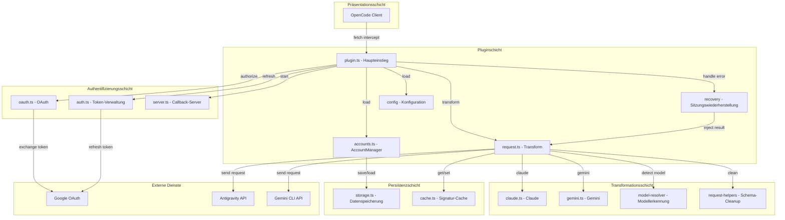
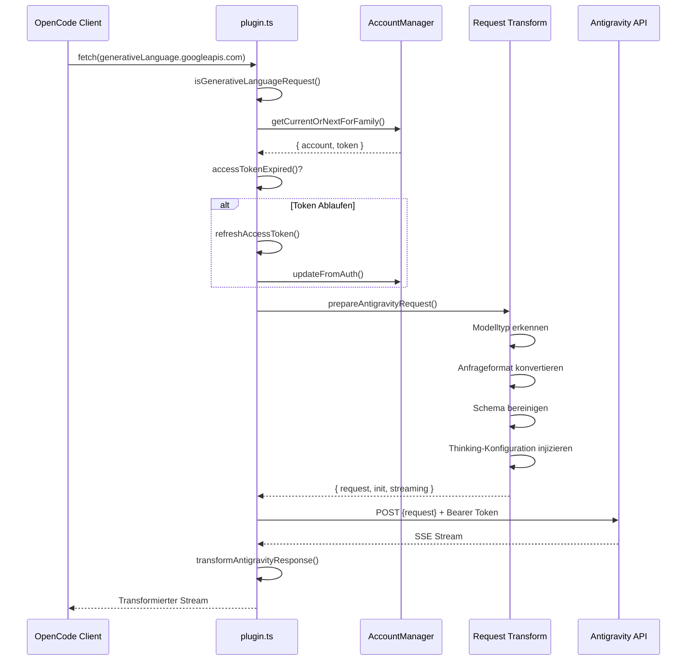
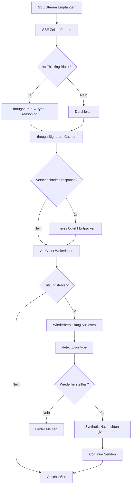

# Plugin-Architektur-Übersicht: Verstehen des internen Designs von OpenCode Antigravity Auth

## Was Sie nach dem Lernen tun können

Dieser Kurs führt Sie tief in das Architekturdesign und die internen Arbeitsprinzipien des Antigravity Auth Plugins ein. Nach Abschluss des Lernens können Sie:

- Die Modulstruktur des Plugins und die Verantwortlichkeiten jedes Moduls verstehen
- Den vollständigen Verarbeitungsfluss von Anfragen von OpenCode bis zur Antigravity API beherrschen
- Das Lastausgleichsmechanismus des Multi-Konto-Managements verstehen
- Die Arbeitsprinzipien der Sitzungswiederherstellung verstehen
- Die technischen Details der Anfrageformatkonvertierung beherrschen

## Der Kernwert des Plugins

Die Kernfunktion des Antigravity Auth Plugins besteht darin, eine "Übersetzungsbrücke" zwischen OpenCode und der Antigravity API aufzubauen:

1. **Protokollkonvertierung** - Konvertierung des OpenCode-Anfrageformats in das von der Antigravity API geforderte Format
2. **Authentifizierungsmanagement** - Sichere Beschaffung und Aktualisierung von Zugriffstoken über Google OAuth 2.0 PKCE
3. **Lastausgleich** - Pooling mehrerer Konten, automatische Rotation zur Vermeidung von Ratenbegrenzungen
4. **Fehlerwiederherstellung** - Automatische Erkennung und Reparatur von Sitzungsunterbrechungsproblemen

::: info Warum ist Architekturverständnis wichtig?
Das Verständnis der Plugin-Architektur hilft Ihnen:
- Schnell das Modul mit dem Problem zu lokalisieren
- Die Wirkungsbereiche von Konfigurationsoptionen zu verstehen
- Multi-Konto-Nutzungsstrategien zu optimieren
- An der Plugin-Entwicklung und Fehlersuche teilzunehmen
:::

## Modulstruktur-Übersicht

Das Plugin verwendet eine geschichtete Architektur mit klaren Verantwortlichkeiten für jedes Modul:



### Verantwortlichkeiten der Module

| Modul | Datei | Verantwortlichkeit |
| --- | --- | ---|
| **Haupteinstieg** | `plugin.ts` | fetch-Interceptor, Plugin-Initialisierung, Event-Handling |
| **Kontenverwaltung** | `accounts.ts` | Multi-Konto-Pool, Lastausgleichsstrategie, Ratenbegrenzungs-Tracking |
| **Anfragenkonvertierung** | `request.ts` | Anfrageformatkonvertierung, Antwort-Streaming-Verarbeitung |
| **Modellkonvertierung** | `transform/` | Claude/Gemini-spezifische Konvertierungslogik |
| **OAuth-Authentifizierung** | `antigravity/oauth.ts` | PKCE-Authentifizierungsablauf, Token-Austausch |
| **Sitzungswiederherstellung** | `recovery/` | Fehlererkennung, automatische Reparatur unterbrochener Sitzungen |
| **Konfigurationsmanagement** | `config/` | Konfigurationsladen, Schema-Validierung |
| **Speicherschicht** | `storage.ts` | Kontenpersistierung (JSON-Datei) |
| **Cache-Schicht** | `cache.ts` | Signatur-Cache, Reduzierung wiederholter Berechnungen |
| **Debug-Protokoll** | `debug.ts` | Strukturierte Protokolle, Fehlersuche |

## Anfrageverarbeitungsablauf

Wenn eine Modellanfrage von OpenCode gesendet wird, durchläuft das Plugin einen vollständigen Verarbeitungslink:



### Schritt-für-Schritt-Erklärung

**Schritt 1: Anfragen-Abfangen**
- Das Plugin fängt alle Anfragen an `generativelanguage.googleapis.com` über den `fetch`-Interceptor ab
- Verwendet `isGenerativeLanguageRequest()` zur Bestimmung, ob es eine Antigravity-bezogene Anfrage ist
- Nicht-Ziel-Anfragen werden direkt durchgeleitet, um andere Funktionen nicht zu beeinträchtigen

**Schritt 2: Kontenauswahl**
- Wählt ein verfügbares Konto aus dem Kontenpool (basierend auf der konfigurierten Strategie: sticky/round-robin/hybrid)
- Überprüft, ob das Token abgelaufen ist, und aktualisiert es automatisch, falls erforderlich
- Wendet PID-Offset an (falls aktiviert), um gleichmäßige Kontenverteilung in Multi-Agent-Szenarien zu gewährleisten

**Schritt 3: Anfragenkonvertierung** (`request.ts`)
- **Modellerkennung**: Identifiziert, ob es ein Claude- oder Gemini-Modell ist
- **Thinking-Verarbeitung**:
  - Claude: Entfernt alle historischen Thinking-Blöcke, um Signaturkonflikte zu vermeiden
  - Gemini: Fügt `thinkingConfig`-Konfiguration hinzu
- **Tool-Konvertierung**: Konvertiert OpenCode-Tools in das `functionDeclarations`-Format
- **Schema-Bereinigung**: Entfernt nicht unterstützte JSON-Schema-Felder (`const`, `$ref`, `$defs`, usw.)
- **Anfragenkapselung**: Verpackt in das Format `{ project, model, request: {...} }`

**Schritt 4: Anfrage senden**
- Fügt Antigravity-spezifische Headers hinzu (User-Agent, Client-Metadata)
- Verwendet Bearer Token zur Authentifizierung
- Unterstützt Endpoint-Fallback (daily → autopush → prod)

**Schritt 5: Antwortkonvertierung**
- Empfängt SSE-Stream, zeilenweise Konvertierung
- Konvertiert `thought: true` zu `type: "reasoning"`
- Cacht Thinking-Signaturen für nachfolgende Anfragen
- Entpackt inneres `response`-Objekt, behält Formatkonsistenz bei

## Antwortverarbeitungsablauf

Die Antwortverarbeitung umfasst hauptsächlich Stream-Konvertierung und Sitzungswiederherstellung:



### Schlüsselverarbeitungsmechanismen

**1. Thinking Block Konvertierung**

Das Thinking Block Format, das von der Antigravity API zurückgegeben wird, ist:
```json
{ "thought": true, "text": "Thinking-Inhalt" }
```

Das Plugin konvertiert es in das OpenCode-kompatible Format:
```json
{ "type": "reasoning", "reasoning": "Thinking-Inhalt" }
```

**2. Signatur-Caching**

Claude- und Gemini 3 Modelle erfordern übereinstimmende Thinking Block Signaturen in Mehrfachdialogen:
- Extrahiert `thoughtSignature` aus der Antwort
- Speichert mit `cacheSignature()` im Speicher und auf Festplatte
- Ruft beim nächsten Request mit `getCachedSignature()` ab und injiziert

::: tip Warum ist Signatur-Caching erforderlich?
Die Claude- und Gemini 3 APIs erfordern, dass Thinking-Blöcke vor Tool-Aufrufen korrekte Signaturen haben. Signatur-Caching kann:
- Anfragefehler durch Signaturfehler vermeiden
- Wiederholte Generierung desselben Thinking-Inhalts reduzieren
- Kontinuität in Mehrfachdialogen verbessern
:::

**3. Sitzungswiederherstellung**

Wenn ein Sitzungsfehler erkannt wird:
1. Fehler wird durch das `session.error` Ereignis abgefangen
2. Ruft `detectErrorType()` auf, um zu beurteilen, ob es wiederherstellbar ist
3. Für `tool_result_missing` Fehler:
   - Extrahiert fehlgeschlagene `tool_use` IDs
   - Injiziert synthetic `tool_result` Nachrichten
   - Sendet automatisch "continue" (falls aktiviert)
4. Für Thinking Block Reihenfolgefehler:
   - Analysiert Dialogzustand
   - Schließt beschädigten Turn
   - Startet neuen Turn, lässt Modell neu generieren

## Detaillierte Erklärung der Kernmechanismen

### OAuth-Authentifizierungsmechanismus

Das Plugin verwendet den OAuth 2.0 mit PKCE (Proof Key for Code Exchange) Ablauf:

```mermaid
flowchart LR
    A[Benutzer führt opencode auth login aus] --> B[PKCE-Schlüsselpaar generieren]
    B --> C[Autorisierungs-URL erstellen]
    C --> D[Lokaler Server starten]
    D --> E[Browser-Autorisierungsseite öffnen]
    E --> F[Benutzer autorisiert]
    F --> G[Callback-Code empfangen]
    G --> H[Zugriffstoken austauschen]
    H --> I[Project ID abrufen]
    I --> J[In antigravity-accounts.json speichern]
```



**PKCE-Sicherheit**:
- Generiert zufällige `code_verifier` und `code_challenge`
- Autorisierungs-URL enthält `code_challenge`, verhindert Man-in-the-Middle-Angriffe
- Beim Token-Austausch wird `code_verifier` verifiziert, stellt sicher, dass die Anfrage vom selben Client stammt

**Token-Verwaltung**:
- Access Token: Standardmäßig 1 Stunde gültig, automatische Aktualisierung 30 Minuten vor Ablauf
- Refresh Token: Langfristig gültig, zum Abrufen neuer Access Tokens
- Persistiert in `~/.config/opencode/antigravity-accounts.json`

### Multi-Konto-Verwaltungsmechanismus

Multi-Konto-Verwaltung ist eine der Kernfunktionen des Plugins und umfasst folgende Schlüsselkomponenten:

**1. Kontenpool-Struktur**

```typescript
interface AccountPool {
  version: 3;
  accounts: Account[];
  activeIndex: number;
  activeIndexByFamily: {
    claude: number;
    gemini: number;
  };
}
```

**2. Kontenauswahlstrategie**

| Strategie | Beschreibung | Anwendungsszenario |
| --- | --- | ---|
| **sticky** | Beibehaltung des aktuellen Kontos bis zur Ratenbegrenzung | Einzelne Sitzungsnutzung, Beibehaltung des Prompt-Caches |
| **round-robin** | Jede Anfrage rotiert zum nächsten Konto | Mehrere Sitzungen parallel, Maximierung des Durchsatzes |
| **hybrid** | Gesundheitsbewertung + Token-Bucket + LRU kombinierte Entscheidung | Standardstrategie, Balance zwischen Leistung und Zuverlässigkeit |

**3. Ratenbegrenzungs-Tracking**

Jedes Konto wird unabhängig nach Modellfamilie verfolgt:
- `claude`: Claude-Modellkontingent
- `gemini-antigravity`: Gemini Antigravity-Kontingent
- `gemini-cli`: Gemini CLI-Kontingent

Ratenbegrenzungsstatus enthält:
- `rateLimitResetTimes`: Zurücksetzungszeiten für jedes Kontingent
- `cooldownEndAt`: Konto-Kühlungsendzeit
- `consecutiveFailures`: Anzahl aufeinanderfolgender Fehler

**4. Dual-Kontingent-Pool (Gemini-exklusiv)**

Gemini-Modelle unterstützen zwei unabhängige Kontingentpools:
- **Antigravity-Kontingent**: Tägliche Sandbox-Umgebung
- **Gemini CLI-Kontingent**: Produktionsumgebung

Durch `quota_fallback` Konfiguration:
- Bevorzugte Nutzung des bevorzugten Kontingents (durch Modellsuffix bestimmt)
- Fallback auf Backup-Kontingent, wenn bevorzugtes erschöpft
- Wechsel zum nächsten Konto, wenn beide Pools erschöpft

**5. PID-Offset-Optimierung**

Nach Aktivierung von `pid_offset_enabled`:
- Verschiedene Prozesse (PIDs) starten mit unterschiedlichen Konten
- Vermeidung, dass alle Agenten um dasselbe Konto konkurrieren
- Geeignet für Multi-Agent-Parallelisierungsszenarien

### Anfragenkonvertierungsmechanismus

Die Anfragenkonvertierung ist der komplexeste Teil des Plugins und erfordert die Handhabung von Protokolldifferenzen zwischen verschiedenen Modellen:

**Claude-Modell-Konvertierungspunkte**:

1. **Thinking-Block-Verarbeitung**
   ```typescript
   // Entfernen aller historischen Thinking-Blöcke (Vermeidung von Signaturkonflikten)
   const filteredContents = deepFilterThinkingBlocks(contents);

   // Aufbau einer neuen thinkingConfig
   const thinkingConfig = {
     budgetTokens: variantThinkingConfig?.budget || DEFAULT_THINKING_BUDGET,
   };
   ```

2. **Tool-Schema-Bereinigung**
   - Whitelist-Beibehaltung: `type`, `properties`, `required`, `description`, `enum`, `items`
   - Entfernte Felder: `const`, `$ref`, `$defs`, `default`, `examples`, `additionalProperties`, `$schema`, `title`
   - Spezielle Konvertierung: `const: "value"` → `enum: ["value"]`

3. **Tool-Injektionsparameter-Signatur**
   ```typescript
   injectParameterSignatures(tool, signature) {
     tool.description += `\n\nParameters: ${signature}`;
   }
   ```

**Gemini-Modell-Konvertierungspunkte**:

1. **Thinking-Konfiguration**
   ```typescript
   // Gemini 3 Pro/Flash
   if (isGemini3Model(model)) {
     request.thinkingConfig = {
       thinkingLevel: "high" | "medium" | "low" | "minimal",
     };
   }

   // Gemini 2.5
   else if (isGemini2Model(model)) {
     request.thinkingConfig = {
       thinkingLevel: "high" | "medium" | "low",
     };
   }
   ```

2. **Google Search Grounding**
   ```typescript
   if (webSearchConfig) {
     request.generationConfig = {
       ...request.generationConfig,
       dynamicRetrievalConfig: {
         mode: webSearchConfig.mode, // "auto" | "off"
         dynamicRetrievalConfig: {
           scoreThreshold: webSearchConfig.threshold, // 0.0 - 1.0
         },
       },
     };
   }
   ```

3. **Bildgenerierungskonfiguration**
   ```typescript
   if (isImageGenerationModel(model)) {
     request.generationConfig = {
       ...request.generationConfig,
       responseModalities: ["IMAGE", "TEXT"],
     };
   }
   ```

### Sitzungswiederherstellungsmechanismus

Der Sitzungswiederherstellungsmechanismus stellt sicher, dass Konversationen nach unerwarteten Unterbrechungen fortgesetzt werden können:

**1. Fehlererkennung**

```typescript
function detectErrorType(error: unknown): RecoverableError | null {
  if (errorString.includes("tool_use ids were found without tool_result")) {
    return { type: "tool_result_missing" };
  }
  if (errorString.includes("Expected thinking but found text")) {
    return { type: "thinking_order_error" };
  }
  return null;
}
```

**2. Turn-Grenzerkennung**

```typescript
// Turn-Grenze = erste Assistant-Nachricht nach User-Nachricht
function analyzeConversationState(messages: Message[]): ConversationState {
  const lastUserMessage = findLastMessageByRole(messages, "user");
  const firstAssistantAfterUser = messages.find(m =>
    m.role === "assistant" && m.timestamp > lastUserMessage.timestamp
  );

  return {
    isTurnStart: true,
    turnAssistantMessage: firstAssistantAfterUser,
  };
}
```

**3. Synthetic-Nachrichten-Injektion**

```typescript
// Synthetic tool_result injizieren
function createSyntheticErrorResponse(toolUseIds: string[]): Message[] {
  return toolUseIds.map(id => ({
    type: "tool_result",
    tool_use_id: id,
    content: "Operation cancelled",
    isSynthetic: true,
  }));
}

// Beschädigten Turn schließen
function closeToolLoopForThinking(sessionId: string): Message[] {
  return [
    {
      type: "text",
      text: "[Conversation turn closed due to error]",
      isSynthetic: true,
    },
  ];
}
```

**4. Auto-Resume**

Nach Aktivierung von `auto_resume` wird der Wiederherstellungsablauf automatisch den Fortsetzungsbefehl senden:
```typescript
await client.session.prompt({
  path: { id: sessionID },
  body: { parts: [{ type: "text", text: config.resume_text }] },
  query: { directory },
});
```

## Lektionszusammenfassung

Dieser Kurs analysiert im Detail das Architekturdesign des Antigravity Auth Plugins:

**Kernarchitektur**:
- Geschichtetes Moduldesign mit klaren Verantwortlichkeiten
- Pluginschicht, Authentifizierungsschicht, Transformationsschicht, Persistenzschicht erfüllen jeweils ihre Aufgaben
- `plugin.ts` als einheitlicher Einstieg koordiniert alle Module

**Anfrageablauf**:
- Abfangen → Kontenauswahl → Token-Aktualisierung → Anfragenkonvertierung → Anfrage senden → Antwortkonvertierung
- Jeder Schritt hat detaillierte Fehlerbehandlung und Retry-Mechanismen

**Schlüsselmechanismen**:
- **OAuth 2.0 PKCE**: Sicherer Authentifizierungsablauf
- **Multi-Konto-Management**: Lastausgleich, Ratenbegrenzungs-Tracking, Dual-Kontingent-Pool
- **Anfragenkonvertierung**: Protokollkompatibilität, Schema-Bereinigung, Thinking-Verarbeitung
- **Sitzungswiederherstellung**: Automatische Fehlererkennung, Synthetic-Nachrichten-Injektion, Auto-Resume

Das Verständnis dieser Mechanismen wird Ihnen helfen, die Plugin-Konfiguration besser zu nutzen und zu optimieren sowie an der Plugin-Entwicklung und Fehlersuche teilzunehmen.

## Vorschau auf die nächste Lektion

> In der nächsten Lektion lernen wir die **[Antigravity API interne Spezifikationen](../api-spec/)** kennen.
>
> Sie werden lernen:
> - Anfrage- und Antwortformate der Antigravity API
> - Funktionen und Parameter der einzelnen Endpunkte
> - Bedeutungen von Fehlercodes und Statuscodes
> - Erweiterte Funktionen und experimentelle Features

---

## Anhang: Quellcode-Referenz

<details>
<summary><strong>Klicken Sie zum Anzeigen der Quellcode-Positionen</strong></summary>

> Aktualisiert am: 2026-01-23

| Funktion | Dateipfad | Zeilennummer |
| --- | --- | ---|
| Plugin-Haupteinstieg, fetch-Interceptor | [`src/plugin.ts`](https://github.com/NoeFabris/opencode-antigravity-auth/blob/main/src/plugin.ts) | 654-1334 |
| Konten-Manager, Lastausgleich | [`src/plugin/accounts.ts`](https://github.com/NoeFabris/opencode-antigravity-auth/blob/main/src/plugin/accounts.ts) | 1-715 |
| Anfragenkonvertierung, Antwort-Streaming | [`src/plugin/request.ts`](https://github.com/NoeFabris/opencode-antigravity-auth/blob/main/src/plugin/request.ts) | 1-1664 |
| Claude-Modellkonvertierung | [`src/plugin/transform/claude.ts`](https://github.com/NoeFabris/opencode-antigravity-auth/blob/main/src/plugin/transform/claude.ts) | Gesamt |
| Gemini-Modellkonvertierung | [`src/plugin/transform/gemini.ts`](https://github.com/NoeFabris/opencode-antigravity-auth/blob/main/src/plugin/transform/gemini.ts) | Gesamt |
| Sitzungswiederherstellung | [`src/plugin/recovery/index.ts`](https://github.com/NoeFabris/opencode-antigravity-auth/blob/main/src/plugin/recovery/index.ts) | Gesamt |
| Thinking-Block-Wiederherstellung | [`src/plugin/recovery/thinking-recovery.ts`](https://github.com/NoeFabris/opencode-antigravity-auth/blob/main/src/plugin/recovery/thinking-recovery.ts) | Gesamt |
| OAuth-Authentifizierung | [`src/antigravity/oauth.ts`](https://github.com/NoeFabris/opencode-antigravity-auth/blob/main/src/antigravity/oauth.ts) | 1-271 |
| Token-Verwaltung | [`src/plugin/token.ts`](https://github.com/NoeFabris/opencode-antigravity-auth/blob/main/src/plugin/token.ts) | Gesamt |
| Konfigurationsschema | [`src/plugin/config/schema.ts`](https://github.com/NoeFabris/opencode-antigravity-auth/blob/main/src/plugin/config/schema.ts) | 1-373 |
| Kontenspeicherung | [`src/plugin/storage.ts`](https://github.com/NoeFabris/opencode-antigravity-auth/blob/main/src/plugin/storage.ts) | Gesamt |
| Signatur-Cache | [`src/plugin/cache.ts`](https://github.com/NoeFabris/opencode-antigravity-auth/blob/main/src/plugin/cache.ts) | Gesamt |
| Debug-Protokoll | [`src/plugin/debug.ts`](https://github.com/NoeFabris/opencode-antigravity-auth/blob/main/src/plugin/debug.ts) | Gesamt |

**Schlüsselkonstanten**:
- `MAX_OAUTH_ACCOUNTS = 10`: Maximale Kontenanzahl
- `RATE_LIMIT_DEDUP_WINDOW_MS = 2000`: Ratenbegrenzungs-Deduplizierungsfenster (2 Sekunden)
- `RATE_LIMIT_STATE_RESET_MS = 120000`: Ratenbegrenzungsstatus-Zurücksetzungszeit (2 Minuten)
- `FAILURE_COOLDOWN_MS = 30000`: Konto-Kühlungszeit (30 Sekunden)

**Schlüsselfunktionen**:
- `createAntigravityPlugin()`: Plugin-Haupteinstiegsfunktion
- `prepareAntigravityRequest()`: Hauptfunktion zur Anfragenkonvertierung
- `transformAntigravityResponse()`: Funktion zur Antwort-Stream-Konvertierung
- `AccountManager.getCurrentOrNextForFamily()`: Kontenauswahlfunktion
- `handleSessionRecovery()`: Funktion zur Sitzungswiederherstellungsverarbeitung
- `refreshAccessToken()`: Token-Aktualisierungsfunktion

</details>
