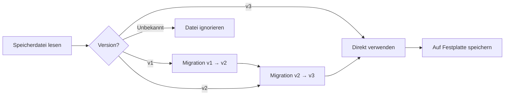

# Kontospeicherformat und Versionsverwaltung

## Was Sie nach diesem Kurs können werden

- Die Struktur der Kontospeicherdatei und die Bedeutung der Felder verstehen
- Speicherdateien manuell bearbeiten (nur wenn notwendig)
- Den Versionsmigrationsmechanismus und die Kompatibilität verstehen
- Kontokonfigurationen zwischen Rechnern migrieren

## Ihre aktuelle Herausforderung

Sie könnten auf folgende Situationen stoßen:

- Konten auf einen anderen Rechner sichern oder migrieren möchten
- `projectId` manuell ändern oder ungültige Konten löschen möchten
- Versionswarnungen oder Migrationsprotokolle sehen und verstehen möchten, was passiert ist
- Kontostatus zwischen mehreren Rechnern synchronisieren möchten

## Dateispeicherort

Die Kontospeicherdatei befindet sich unter:

| Betriebssystem | Pfad                                                       |
|--- | ---|
| macOS/Linux | `~/.config/opencode/antigravity-accounts.json`             |
| Windows    | `%APPDATA%\opencode\antigravity-accounts.json`                |

::: warning Sicherheitshinweis
Diese Datei enthält **OAuth Refresh Tokens**, was einer Passwortdatei entspricht. Teilen Sie sie nicht mit anderen und committen Sie sie nicht in ein Git-Repository.
:::

## Speicherformatversionen

Das Speicherformat hat eine Versionskontrolle, aktuell ist **v3**. Das Plugin verarbeitet Versionsmigrationen automatisch, ohne manuelle Eingriffe.

### v3 Format (aktuelle Version)

```json
{
  "version": 3,
  "accounts": [
    {
      "email": "user1@gmail.com",
      "refreshToken": "1//0abc...",
      "projectId": "my-gcp-project",
      "managedProjectId": "managed-project-123",
      "addedAt": 1737600000000,
      "lastUsed": 1737603600000,
      "lastSwitchReason": "initial",
      "rateLimitResetTimes": {
        "claude": 1737607200000,
        "gemini-antigravity": 1737607200000,
        "gemini-cli": 1737607200000
      },
      "coolingDownUntil": 1737600000000,
      "cooldownReason": "auth-failure"
    }
  ],
  "activeIndex": 0,
  "activeIndexByFamily": {
    "claude": 0,
    "gemini": 0
  }
}
```

**Feldbeschreibungen**:

| Feld                  | Typ    | Erforderlich | Beschreibung |
|--- | --- | --- | ---|
| `version`             | number  | J    | Speicherformatversion (fest auf 3) |
| `accounts`            | array   | J    | Kontoliste |
| `activeIndex`         | number  | J    | Aktueller aktiver Kontoindex (beginnt bei 0) |
| `activeIndexByFamily` | object  | N    | Verfolgt aktive Konten nach Modellfamilie (`claude`/`gemini`) |

**Kontobjektfelder**:

| Feld                  | Typ    | Erforderlich | Beschreibung |
|--- | --- | --- | ---|
| `email`               | string  | N    | Google-Konto E-Mail |
| `refreshToken`        | string  | J    | OAuth Refresh Token (eindeutige Kennung) |
| `projectId`           | string  | N    | GCP-Projekt-ID (erforderlich für Gemini CLI-Modelle) |
| `managedProjectId`     | string  | N    | Verwaltete Projekt-ID |
| `addedAt`             | number  | J    | Hinzugefügt-Zeitstempel (Unix-Millisekunden) |
| `lastUsed`            | number  | J    | Zuletzt verwendet-Zeitstempel |
| `lastSwitchReason`    | string  | N    | Wechselgrund: `"rate-limit"` / `"initial"` / `"rotation"` |
| `rateLimitResetTimes` | object  | N    | Rate-Limit-Rücksetzzeiten (separat nach Quota-Pool verfolgt) |
| `coolingDownUntil`    | number  | N    | Konto-Abkühlungs-Endzeitstempel |
| `cooldownReason`      | string  | N    | Abkühlungsgrund: `"auth-failure"` / `"network-error"` / `"project-error"` |

### v2 Format (historische Version)

Das v2-Format ist v3 ähnlich, hat aber folgende Unterschiede:

- `rateLimitResetTimes` hat nur `claude` und `gemini` Felder
- Keine `coolingDownUntil` und `cooldownReason`
- Kein `activeIndexByFamily` (alle Modelle teilen ein aktives Konto)

Bei der Migration wird das `gemini`-Feld auf `gemini-antigravity` gemappt, der `gemini-cli` Quota-Pool wird leer initialisiert.

### v1 Format (historische Version)

Das v1-Format verwendet boolesche Markierungen und einen einzelnen Zeitstempel:

```json
{
  "version": 1,
  "accounts": [
    {
      "email": "user1@gmail.com",
      "refreshToken": "1//0abc...",
      "isRateLimited": true,
      "rateLimitResetTime": 1737607200000
    }
  ],
  "activeIndex": 0
}
```

Bei der Migration werden, wenn `isRateLimited` `true` ist und `rateLimitResetTime` nicht abgelaufen ist, sowohl `claude` als auch `gemini` Rücksetzzeiten gesetzt.

## Versionsmigrationsmechanismus

Das Plugin erkennt beim Laden der Speicherdatei automatisch die Version und führt die Migration durch:



**Migrationsregeln**:

1. **Automatische Migration**: Nach der Migration wird das neue Format automatisch auf die Festplatte gespeichert
2. **Datenerhaltung**: Nicht abgelaufene Rate-Limit-Status werden beibehalten
3. **Fehler-Fallback**: Bei Speicherfehlern werden die migrierten Daten weiterhin im Speicher verwendet
4. **Vorwärtskompatibilität**: Neue Plugin-Versionen können alte Formatdateien lesen

## Details zum Speichermechanismus

### Dateisperrung

Verwendet `proper-lockfile` für sicheren Mehrprozesszugriff:

- **Sperrmechanismus**: Beim Schreiben wird eine Sperrdatei erstellt (`.antigravity-accounts.json.lock`)
- **Timeout-Einstellung**: Sperrdatei läuft nach 10 Sekunden ab (verhindert Deadlocks)
- **Wiederholungsstrategie**: Maximal 5 Wiederholungen, Backoff-Zeit 100ms → 1000ms
- **Atomares Schreiben**: Zuerst in temporäre Datei schreiben (`.tmp`), dann zur Zieldatei umbenennen

### Kontenzusammenführung

Wenn mehrere Prozesse gleichzeitig in die Speicherdatei schreiben, wird eine Zusammenführungsstrategie ausgeführt:

```typescript
// Zusammenführungslogik
function mergeAccountStorage(existing, incoming) {
  // Konten mit refreshToken als Schlüssel zusammenführen
  // Manuell konfigurierte projectId/managedProjectId beibehalten
  // rateLimitResetTimes zusammenführen
  // Größeres lastUsed beibehalten
}
```

### Deduplizierungsmechanismus

Deduplizierung basierend auf `email`, behält das neueste Konto jeder E-Mail (nach `lastUsed`, dann nach `addedAt`):

```typescript
// Deduplizierungsregeln
1. Konten ohne E-Mail → beibehalten (kann nicht dedupliziert werden)
2. Konten mit gleicher E-Mail → behalte das mit größtem lastUsed
3. Gleiches lastUsed → behalte das mit größtem addedAt
```

## Anleitung zur manuellen Bearbeitung

::: danger Risiko manueller Bearbeitung
Beim Bearbeiten der Speicherdatei sollte der Plugin-Prozess nicht laufen, sonst könnte sie überschrieben werden. Es wird empfohlen, OpenCode vor der Bearbeitung zu stoppen.
:::

### Konto hinzufügen

Beim manuellen Hinzufügen eines Kontos muss mindestens `refreshToken` angegeben werden:

```json
{
  "accounts": [
    {
      "refreshToken": "Von anderem Rechner kopiert oder aus OAuth-Flow erhalten",
      "email": "user@example.com",
      "addedAt": Date.now(),
      "lastUsed": Date.now()
    }
  ]
}
```

### Konto löschen

Löschen Sie den entsprechenden Eintrag aus dem `accounts`-Array und passen Sie dann `activeIndex` an:

```json
{
  "accounts": [
    { "email": "user1@gmail.com", "refreshToken": "..." },  // Behalten
    // { "email": "user2@gmail.com", "refreshToken": "..." },  // Löschen
    { "email": "user3@gmail.com", "refreshToken": "..." }   // Behalten
  ],
  "activeIndex": 0  // Stellen Sie sicher, dass der Index im gültigen Bereich liegt
}
```

### projectId ändern

`projectId` für ein Konto hinzufügen oder ändern:

```json
{
  "accounts": [
    {
      "email": "user@gmail.com",
      "refreshToken": "1//0abc...",
      "projectId": "your-gcp-project-id"  // Hinzufügen oder ändern
    }
  ]
}
```

### Rate-Limit-Status löschen

Rate-Limit-Markierung manuell löschen:

```json
{
  "accounts": [
    {
      "email": "user@gmail.com",
      "refreshToken": "1//0abc...",
      "rateLimitResetTimes": {}  // Leeren oder dieses Feld löschen
    }
  ]
}
```

## Migration zwischen Rechnern

### Einfache Migration

Kopieren Sie die Speicherdatei direkt in das Konfigurationsverzeichnis des Zielrechners:

```bash
# macOS/Linux
cp ~/.config/opencode/antigravity-accounts.json /path/to/backup/

# Windows
copy %APPDATA%\opencode\antigravity-accounts.json backup\
```

### Konten zusammenführen

Wenn der Zielrechner bereits Konten hat, führt das Plugin diese automatisch zusammen (Deduplizierung basierend auf `refreshToken`).

**Manuelle Zusammenführungsschritte**:

1. Sichern Sie die Speicherdateien beider Rechner
2. Öffnen Sie beide Dateien, kopieren Sie das Zielkonto-Array in die Quelldatei
3. Passen Sie `activeIndex` und `activeIndexByFamily` an
4. Speichern und Plugin neu starten

## Häufige Probleme

### Was tun bei Migrationsfehler?

Wenn die Migration fehlschlägt, protokolliert das Plugin eine Warnung:

```
Failed to persist migrated storage: { error: "..." }
```

**Lösungen**:

1. Dateiberechtigungen prüfen
2. Ausreichend Festplattenspeicher bestätigen
3. Alte Datei manuell sichern und löschen, Konten neu hinzufügen

### Versionsinkompatibilitätsfehler

Wenn Sie einen "Unknown storage version"-Fehler sehen:

```json
{
  "version": 99  // Unbekannte Version
}
```

**Lösungen**:

1. Aktuelle Datei sichern
2. `version` manuell auf `2` oder `3` ändern
3. Plugin neu starten, um Migration auszulösen
4. Bei Migrationsfehler Datei löschen und Konten neu hinzufügen

### Kontodeduplizierungsverlust

Wenn Sie feststellen, dass doppelte Konten gelöscht wurden:

**Ursache**: Das Plugin dedupliziert basierend auf `email` und behält das zuletzt verwendete Konto.

**Lösung**: Wenn Sie zwei Konten mit derselben E-Mail behalten müssen (seltenes Szenario), bearbeiten Sie die Datei manuell und stellen Sie sicher, dass das `email`-Feld leer oder unterschiedlich ist.

## Zusammenfassung dieser Lektion

- Speicherdateispeicherort: `~/.config/opencode/antigravity-accounts.json`
- Aktuelle Version: v3, unterstützt Dual-Quota-Pool und Abkühlungsmechanismus
- Automatische Migration: v1/v2 werden automatisch auf v3 aktualisiert
- Dateisperrung: Verwendet `proper-lockfile` für Nebenläufigkeitssicherheit
- Manuelle Bearbeitung: Es wird empfohlen, das Plugin vor der Bearbeitung zu stoppen, um Überschreibungen zu vermeiden

## Vorschau auf die nächste Lektion

> In der nächsten Lektion lernen wir **[Alle Konfigurationsoptionen](../all-config-options/)**.
>
> Sie werden lernen:
> - Vollständige Liste der Konfigurationsoptionen
> - Standardwerte und Geltungsbereiche jeder Option
> - Erweiterte Konfigurationstipps

---

## Anhang: Quellcode-Referenz

<details>
<summary><strong>Klicken Sie hier, um Quellcode-Speicherorte anzuzeigen</strong></summary>

> Aktualisiert am: 2026-01-23

| Funktion           | Dateipfad                                                                                                      | Zeilen    |
|--- | --- | ---|
| Speicherformatdefinition   | [`src/plugin/storage.ts`](https://github.com/NoeFabris/opencode-antigravity-auth/blob/main/src/plugin/storage.ts)      | 128-198 |
| v1 → v2 Migration  | [`src/plugin/storage.ts`](https://github.com/NoeFabris/opencode-antigravity-auth/blob/main/src/plugin/storage.ts)      | 366-395 |
| v2 → v3 Migration  | [`src/plugin/storage.ts`](https://github.com/NoeFabris/opencode-antigravity-auth/blob/main/src/plugin/storage.ts)      | 397-431 |
| Konten laden       | [`src/plugin/storage.ts`](https://github.com/NoeFabris/opencode-antigravity-auth/blob/main/src/plugin/storage.ts)      | 433-518 |
| Konten speichern       | [`src/plugin/storage.ts`](https://github.com/NoeFabris/opencode-antigravity-auth/blob/main/src/plugin/storage.ts)      | 520-536 |
| Dateisperrmechanismus   | [`src/plugin/storage.ts`](https://github.com/NoeFabris/opencode-antigravity-auth/blob/main/src/plugin/storage.ts)      | 219-257 |
| Kontenzusammenführung       | [`src/plugin/storage.ts`](https://github.com/NoeFabris/opencode-antigravity-auth/blob/main/src/plugin/storage.ts)      | 259-299 |
| Deduplizierungsmechanismus       | [`src/plugin/storage.ts`](https://github.com/NoeFabris/opencode-antigravity-auth/blob/main/src/plugin/storage.ts)      | 301-364 |

**Wichtige Typdefinitionen**:

- `AccountStorageV1`: v1 Speicherformat
- `AccountStorageV2`: v2 Speicherformat
- `AccountStorageV3`: v3 Speicherformat (aktuell)
- `RateLimitStateV3`: v3 Rate-Limit-Status (unterstützt mehrere Quota-Pools)

**Wichtige Funktionen**:

- `loadAccounts()`: Konten laden und Migration durchführen
- `saveAccounts()`: Konten speichern (mit Dateisperrung und Zusammenführung)
- `migrateV1ToV2()`: v1 → v2 Migration
- `migrateV2ToV3()`: v2 → v3 Migration
- `mergeAccountStorage()`: Zwei Speicherobjekte zusammenführen
- `deduplicateAccountsByEmail()`: Deduplizierung basierend auf E-Mail

</details>
