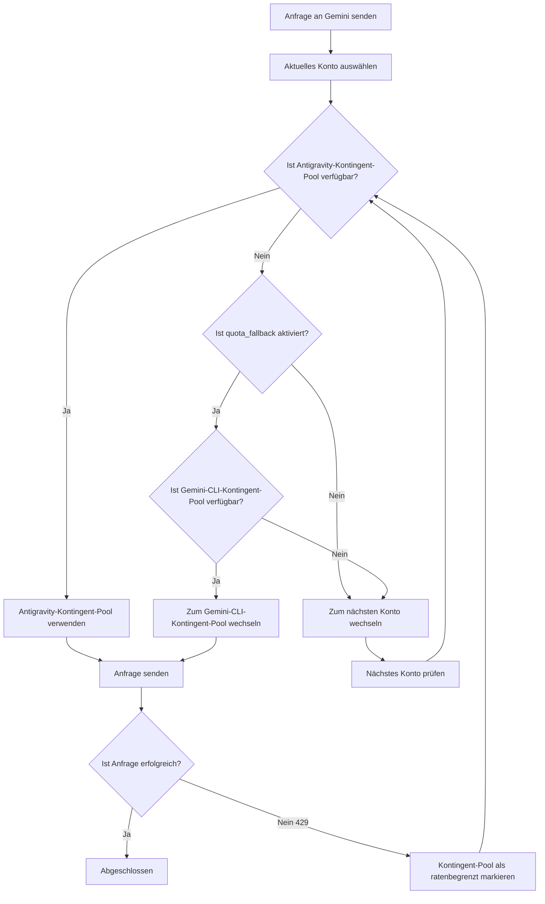

# Dual-Quota-System: Verstehen der Antigravity- und Gemini-CLI-Kontingent-Pools

## Was Sie nach diesem Kurs tun können

- Verstehen, wie jedes Konto zwei unabhängige Gemini-Kontingent-Pools besitzt
- Automatisches Fallback zwischen den Kontingent-Pools Antigravity und Gemini CLI aktivieren
- Explizit festlegen, dass ein Modell einen bestimmten Kontingent-Pool verwendet
- Die Kontingentnutzung durch das Dual-Quota-System maximieren

---

## Ihre aktuelle Situation

Sie verwenden das Antigravity-Auth-Plugin, um Gemini-Modelle aufzurufen, stoßen häufig auf Kontingentbeschränkungen, verstehen aber das **Dual-Quota-System** möglicherweise nicht:

- Nach einer ratenbegrenzten Anfrage müssen Sie warten, bis das Kontingent zurückgesetzt wird, bevor Sie fortfahren können
- Obwohl Sie mehrere Konten konfiguriert haben, reicht das Gemini-Kontingent jedes Kontos immer noch nicht aus
- Es ist unklar, warum einige Modelle Anfragen stellen können, während andere häufig 429-Fehler erhalten

**Kernschmerzpunkt**: Sie denken, dass jedes Konto nur einen Gemini-Kontingent-Pool hat, aber tatsächlich besitzt jedes Konto **zwei unabhängige** Kontingent-Pools, und wenn sie richtig konfiguriert sind, können Sie Ihr Gemini-Kontingent verdoppeln.

---

## Kerngedanke

### Was ist das Dual-Quota-System?

Das **Dual-Quota-System** ist der Mechanismus, bei dem das Antigravity-Auth-Plugin für jedes Konto zwei unabhängige Gemini-Kontingent-Pools verwaltet. Die Antigravity- und Gemini-CLI-Kontingent-Pools verfolgen ihre ratenbegrenzten Status unabhängig, und wenn Antigravity ratenbegrenzt ist, kann zum CLI-Kontingent-Pool gewechselt werden, was eine Verdopplung des Kontingents ermöglicht.

Das Antigravity-Auth-Plugin verwaltet für jedes Google-Konto **zwei unabhängige Gemini-Kontingent-Pools**:

| Kontingent-Pool | Typ | Priorität | Zurücksetzungsregeln |
| --- | --- | --- | --- |
| **Antigravity** | Primärer Kontingent-Pool | Bevorzugte Verwendung | Dynamisch basierend auf der vom Server zurückgesetzten Zeit berechnet |
| **Gemini CLI** | Backup-Kontingent-Pool | Fallback-Verwendung | Dynamisch basierend auf der vom Server zurückgesetzten Zeit berechnet |

Der ratenbegrenzte Status jedes Kontingent-Pools wird unabhängig verfolgt und beeinflusst sich nicht gegenseitig. Das bedeutet:

- Wenn der Antigravity-Kontingent-Pool ratenbegrenzt ist, kann automatisch gewechselt werden, wenn der Gemini-CLI-Kontingent-Pool noch verfügbar ist
- Das entspricht einer **Verdopplung** des Gemini-Kontingents pro Konto

### Explizite Angabe vs. automatisches Fallback

Es gibt zwei Möglichkeiten, das Dual-Quota-System zu verwenden:

1. **Explizite Angabe**: Fügen Sie das Suffix `:antigravity` oder `:gemini-cli` nach dem Modellnamen hinzu, um einen bestimmten Kontingent-Pool zu erzwingen
2. **Automatisches Fallback**: Aktivieren Sie die `quota_fallback`-Konfiguration, damit das Plugin automatisch zwischen den beiden Kontingent-Pools wechselt

**Standardverhalten**: Automatisches Fallback ist nicht aktiviert, es wird nur der Antigravity-Kontingent-Pool verwendet

---

## Mach mit

### Schritt 1: Automatisches Fallback aktivieren

Öffnen Sie Ihre Konfigurationsdatei `~/.config/opencode/antigravity.json`:

```bash
cat ~/.config/opencode/antigravity.json
```

Fügen Sie die `quota_fallback`-Konfiguration hinzu oder ändern Sie sie:

```json
{
  "quota_fallback": true
}
```

**Warum**: Standardmäßig ist `quota_fallback` auf `false` gesetzt, und das Plugin verwendet nur den Antigravity-Kontingent-Pool. Nach der Aktivierung wird, wenn Antigravity ratenbegrenzt ist, automatisch versucht, den Gemini-CLI-Kontingent-Pool zu verwenden.

Sie sollten sehen, dass die Konfigurationsdatei aktualisiert wurde.

---

### Schritt 2: Beobachten Sie das automatische Fallback-Verhalten

Starten Sie eine Gemini-Modellanfrage (z. B. mit Gemini 3 Flash):

```bash
opencode run "Erklären Sie Quantencomputing" --model=google/antigravity-gemini-3-flash
```

Wenn der Antigravity-Kontingent-Pool ratenbegrenzt ist, sehen Sie das folgende automatische Fallback-Verhalten:

```
[Toast-Benachrichtigung] Antigravity-Kontingent erschöpft, Verwendung des Gemini-CLI-Kontingents
```

Das Plugin wird:

1. Erkennen, dass der Antigravity-Kontingent-Pool ratenbegrenzt ist (429-Antwort)
2. Versuchen, zum Gemini-CLI-Kontingent-Pool zu wechseln (falls nicht ratenbegrenzt)
3. Die Anfrage mit dem neuen Kontingent-Pool erneut senden
4. Eine Toast-Benachrichtigung anzeigen, um den Wechsel zu informieren

**Warum**: Dies ist die Kernlogik des automatischen Fallback – Wechsel zwischen den beiden Kontingent-Pools desselben Kontos, anstatt sofort zum nächsten Konto zu wechseln.

Sie sollten sehen, dass die Anfrage erfolgreich abgeschlossen wird, anstatt aufgrund von Kontingentbeschränkungen zu scheitern.

---

### Schritt 3: Explizite Angabe des Kontingent-Pools

Wenn Sie einen bestimmten Kontingent-Pool erzwingen möchten, können Sie ein Suffix nach dem Modellnamen hinzufügen:

**Verwendung des Antigravity-Kontingent-Pools** (über das `antigravity-` Präfix):

```bash
opencode run "Erklären Sie Quantencomputing" --model=google/antigravity-gemini-3-flash
```

**Verwendung des Gemini-CLI-Kontingent-Pools** (ohne `antigravity-` Präfix):

```bash
opencode run "Erklären Sie Quantencomputing" --model=google/gemini-3-flash-preview
```

**Warum**: Über das `antigravity-` Präfix können Sie explizit die Verwendung des Antigravity-Kontingent-Pools angeben; ohne Präfix wird der Gemini-CLI-Kontingent-Pool verwendet. In diesem Fall ignoriert das Plugin die `quota_fallback`-Konfiguration, und wenn der angegebene Kontingent-Pool ratenbegrenzt ist, wechselt es sofort zum nächsten Konto, anstatt einen anderen Kontingent-Pool zu versuchen.

Sie sollten sehen, dass die Anfrage an den angegebenen Kontingent-Pool geroutet wird.

---

### Schritt 4: Kontingent-Status anzeigen (Debug-Modus)

Wenn Sie den ratenbegrenzten Status jedes Kontingent-Pools anzeigen möchten, aktivieren Sie den Debug-Modus:

Bearbeiten Sie `~/.config/opencode/antigravity.json`:

```json
{
  "quota_fallback": true,
  "debug": true
}
```

Nach dem Senden einer Anfrage sehen Sie sich die Log-Datei an:

```bash
tail -f ~/.config/opencode/antigravity-logs/*.log
```

Sie sehen ähnliche Protokolle:

```
[DEBUG] headerStyle=antigravity explicit=false
[DEBUG] quota fallback: gemini-cli
[INFO] rate-limit triggered for account 0, family gemini, quota: gemini-antigravity
```

**Warum**: Debug-Protokolle zeigen Ihnen klar, welchen Kontingent-Pool das Plugin ausgewählt hat und wann Fallback ausgelöst wurde. Dies ist sehr hilfreich zur Fehlerbehebung bei Kontingentproblemen.

Sie sollten detaillierte Kontingent-Wechsel-Protokolle sehen.

---

## Checkpoint ✅

### Automatisches Fallback verifizieren

```bash
cat ~/.config/opencode/antigravity.json | grep quota_fallback
```

Sie sollten sehen:

```json
"quota_fallback": true
```

### Explizite Suffix-Spezifikation verifizieren

Versuchen Sie, einen Modellnamen mit Suffix zu verwenden, um zu bestätigen, dass kein Fehler auftritt:

```bash
opencode run "Test" --model=google/antigravity-gemini-3-flash:gemini-cli
```

Sie sollten sehen, dass die Anfrage erfolgreich abgeschlossen wird.

### Debug-Protokolle verifizieren

```bash
ls -la ~/.config/opencode/antigravity-logs/
```

Sie sollten sehen, dass die Log-Dateien existieren und Informationen zur Kontingentumschaltung enthalten.

---

## Warnhinweise

### Warnung 1: Kein Fallback bei expliziter Suffix-Spezifikation

**Problem**: Sie haben das Suffix `:antigravity` oder `:gemini-cli` nach dem Modellnamen hinzugefügt, aber `quota_fallback` scheint nicht zu funktionieren.

**Ursache**: Bei expliziter Suffix-Spezifikation ignoriert das Plugin die `quota_fallback`-Konfiguration und erzwingt die Verwendung des angegebenen Kontingent-Pools. Wenn dieser Kontingent-Pool ratenbegrenzt ist, wechselt es sofort zum nächsten Konto, anstatt einen anderen Kontingent-Pool zu versuchen.

**Lösung**:
- Wenn Sie automatisches Fallback verwenden möchten, fügen Sie kein Suffix nach dem Modellnamen hinzu
- Wenn Sie einen bestimmten Kontingent-Pool erzwingen möchten, fügen Sie einfach das Suffix hinzu

### Warnung 2: Claude-Modelle haben kein Dual-Quota-System

**Problem**: Sie haben `quota_fallback` aktiviert, aber Claude-Modelle scheinen kein Fallback-Verhalten zu zeigen.

**Ursache**: Das Dual-Quota-System **gilt nur für Gemini-Modelle**. Claude-Modelle verwenden nur den Antigravity-Kontingent-Pool und haben keinen Gemini-CLI-Kontingent-Pool.

**Lösung**:
- Claude-Modelle erfordern keine Konfiguration des Dual-Quota-Systems
- Nur die Rotation mehrerer Konten kann das Claude-Kontingent erhöhen

### Warnung 3: Zu viele Debug-Protokolle beeinträchtigen die Leistung

**Problem**: Sie haben `debug: true` aktiviert, aber die Log-Dateien wachsen zu schnell.

**Ursache**: Der Debug-Modus zeichnet alle Anfragedetails auf, einschließlich Kontingentumschaltung, Kontenauswahl usw.

**Lösung**:
- Deaktivieren Sie die `debug`-Konfiguration nach Abschluss des Debuggings
- Oder bereinigen Sie die Log-Dateien regelmäßig: `rm ~/.config/opencode/antigravity-logs/*.log`

---

## Dual-Quota-System-Workflow-Diagramm

Nachfolgend ist der Workflow für automatisches Fallback dargestellt:



---

## Unabhängiges Tracking-Mechanismus der Dual-Kontingent-Pools

### Kontingent-Schlüssel-Definition

Das Plugin verwendet die folgenden Kontingent-Schlüssel, um Ratenbegrenzungen zu verfolgen (Quellcode: `accounts.ts:77`):

| Kontingent-Schlüssel | Bedeutung |
| --- | --- |
| `claude` | Claude-Modell-Kontingent |
| `gemini-antigravity` | Gemini Antigravity-Kontingent-Pool |
| `gemini-cli` | Gemini CLI-Kontingent-Pool |

Das Objekt `rateLimitResetTimes` jedes Kontos speichert die Rücksetzzeitstempel dieser Kontingent-Schlüssel:

```json
{
  "rateLimitResetTimes": {
    "claude": 1234567890,
    "gemini-antigravity": 1234567890,
    "gemini-cli": 1234567890
  }
}
```

### Verfügbarer Kontingent-Pool-Check

Bei der Auswahl eines Kontingent-Pools prüft das Plugin in der folgenden Reihenfolge (Quellcode: `accounts.ts:545-557`):

1. **Antigravity-Kontingent-Pool**: Wenn nicht ratenbegrenzt, direkt verwenden
2. **Gemini-CLI-Kontingent-Pool**: Wenn Antigravity ratenbegrenzt und dieser Pool verfügbar ist, diesen verwenden
3. **null zurückgeben**: Beide Pools sind ratenbegrenzt, Kontowechsel auslösen

---

## Auslösebedingungen für den Kontingent-Pool-Wechsel

Automatisches Fallback wird ausgelöst, wenn die folgenden Bedingungen erfüllt sind:

| Bedingung | Beschreibung | Quellcode-Position |
| --- | --- | --- |
| `quota_fallback = true` | Automatisches Fallback ist aktiviert | `config/schema.ts:234` |
| Der Antigravity-Kontingent-Pool des aktuellen Kontos ist ratenbegrenzt | 429-Antwort erhalten | `plugin.ts:1149` |
| Das Modell hat den Kontingent-Pool nicht explizit angegeben | Modellname enthält kein `:antigravity`- oder `:gemini-cli`-Suffix | `plugin.ts:1151` |
| Der Gemini-CLI-Kontingent-Pool des aktuellen Kontos ist verfügbar | Nicht ratenbegrenzt | `accounts.ts:553` |

Wenn eine dieser Bedingungen nicht erfüllt ist, wechselt das Plugin direkt zum nächsten Konto, anstatt Fallback zu versuchen.

---

## Lektionszusammenfassung

In dieser Lektion haben wir das Dual-Quota-System des Antigravity-Auth-Plugins gelernt:

- **Dual-Kontingent-Pools**: Jedes Konto verfügt über zwei unabhängige Gemini-Kontingent-Pools, Antigravity und Gemini CLI
- **Automatisches Fallback**: Wenn `quota_fallback` aktiviert ist, wird automatisch versucht, den Gemini-CLI-Kontingent-Pool zu verwenden, wenn Antigravity ratenbegrenzt ist
- **Explizite Angabe**: Verwenden Sie die Suffixe `:antigravity` oder `:gemini-cli`, um einen bestimmten Kontingent-Pool zu erzwingen
- **Unabhängiges Tracking**: Der ratenbegrenzte Status jedes Kontingent-Pools wird unabhängig gespeichert und geprüft
- **Nur für Gemini**: Das Dual-Quota-System gilt nur für Gemini-Modelle, Claude-Modelle haben nur den Antigravity-Kontingent-Pool

Durch die sinnvolle Nutzung des Dual-Quota-Systems können Sie das Gemini-Kontingent jedes Kontos verdoppeln und die aufgrund von Kontingentbeschränkungen verursachten Anfragefehler reduzieren.

---

## Vorschau auf die nächste Lektion

> In der nächsten Lektion lernen wir **[Mehrkonten-Setup: Lastenausgleich zur Erhöhung des Kontingents](../../advanced/multi-account-setup/)**.
>
> Sie werden lernen:
> - Wie Sie mehrere Google-Konten hinzufügen
> - Best Practices für die Konfiguration verschiedener Kontoauswahlstrategien
> - Tipps zur Nutzung von Kontingent-Pools in Mehrkonten-Szenarien

---

## Anhang: Quellcode-Referenz

<details>
<summary><strong>Klicken Sie, um die Quellcode-Positionen anzuzeigen</strong></summary>

> Aktualisierungszeit: 2026-01-23

| Funktion | Dateipfad | Zeilennummer |
| --- | --- | --- |
| Kontingent-Schlüssel-Definition (BaseQuotaKey) | [`src/plugin/accounts.ts`](https://github.com/NoeFabris/opencode-antigravity-auth/blob/main/src/plugin/accounts.ts#L77-L78) | 77-78 |
| Kontingent-Schlüssel abrufen (getQuotaKey) | [`src/plugin/accounts.ts`](https://github.com/NoeFabris/opencode-antigravity-auth/blob/main/src/plugin/accounts.ts#L107-L116) | 107-116 |
| Ratenbegrenzungsstatus des Kontingent-Pools prüfen | [`src/plugin/accounts.ts`](https://github.com/NoeFabris/opencode-antigravity-auth/blob/main/src/plugin/accounts.ts#L134-L152) | 134-152 |
| Verfügbaren Kontingent-Pool abrufen | [`src/plugin/accounts.ts`](https://github.com/NoeFabris/opencode-antigravity-auth/blob/main/src/plugin/accounts.ts#L545-L557) | 545-557 |
| quota_fallback-Konfigurationsdefinition | [`src/plugin/config/schema.ts`](https://github.com/NoeFabris/opencode-antigravity-auth/blob/main/src/plugin/config/schema.ts#L224-L234) | 224-234 |
| Automatische Fallback-Logik | [`src/plugin/plugin.ts`](https://github.com/NoeFabris/opencode-antigravity-auth/blob/main/src/plugin/plugin.ts#L1151-L1163) | 1151-1163 |
| Dual-Quota-System-Dokumentation | [`docs/MULTI-ACCOUNT.md`](https://github.com/NoeFabris/opencode-antigravity-auth/blob/main/docs/MULTI-ACCOUNT.md#L21-L31) | 21-31 |

**Wichtige Konstanten**:
- `BaseQuotaKey = "claude" | "gemini-antigravity" | "gemini-cli"`: Kontingent-Schlüssel-Typ-Definition

**Wichtige Funktionen**:
- `getAvailableHeaderStyle()`: Gibt den verfügbaren Kontingent-Pool basierend auf dem Status der Kontingent-Pools des aktuellen Kontos zurück
- `isRateLimitedForHeaderStyle()`: Prüft, ob der angegebene Kontingent-Pool ratenbegrenzt ist
- `getQuotaKey()`: Generiert den Kontingent-Schlüssel basierend auf der Modellfamilie und dem headerStyle

</details>
