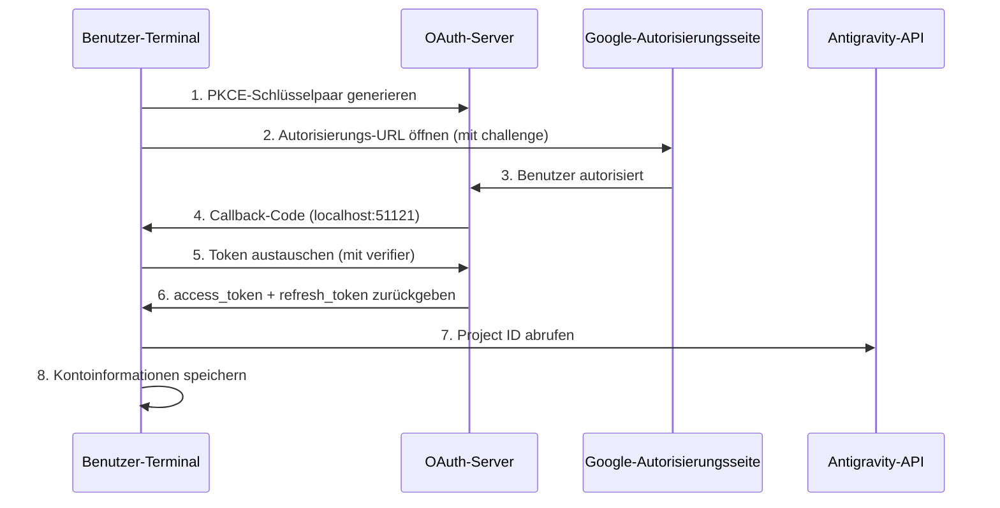

# OAuth 2.0 PKCE-Authentifizierung: Erstmalige Anmeldung abschließen

## Was Sie nach diesem Tutorial können

- Die Sicherheitsmechanismen des OAuth 2.0 PKCE-Authentifizierungsprozesses verstehen
- Die erstmalige Anmeldung des Plugins abschließen und Zugriff auf die Antigravity-API erhalten
- Den Mechanismus zum automatischen Abrufen und Speichern der Project ID verstehen
- Die automatisierte Verarbeitung der Token-Aktualisierung kennenlernen

## Ihre aktuelle Situation

Sie haben das Plugin installiert und die Modelldefinition konfiguriert, aber noch nicht wirklich verwendet. Jedes Mal, wenn Sie `opencode run` ausführen, erscheint die Meldung "Authentifizierung erforderlich", aber Sie wissen nicht:

- Was ist OAuth? Warum wird ein so komplexer Authentifizierungsweg verwendet?
- Was passiert während des Authentifizierungsprozesses? Ist es sicher?
- Was muss für die erstmalige Anmeldung vorbereitet werden? Welche Optionen gibt es?
- Was passiert, wenn der Token abläuft? Muss man sich erneut anmelden?

## Wann diese Methode verwenden

- **Nach der ersten Installation**: Die Authentifizierung muss vor der ersten Verwendung abgeschlossen werden
- **Beim Hinzufügen neuer Konten**: Bei der Konfiguration der Multi-Account-Rotation müssen Konten nacheinander authentifiziert werden
- **Nach Token-Ablauf**: Bei Widerruf des Kontos oder Änderung des Passworts muss eine erneute Authentifizierung erfolgen
- **Beim Wechsel zu einem neuen Gerät**: Bei der Migration von Konten ist eine erneute Anmeldung auf dem neuen Gerät erforderlich

## 🎒 Vorbereitungen vor dem Start

::: warning Voraussetzungen prüfen

Bitte bestätigen Sie, dass folgende Schritte abgeschlossen sind:

1. **Plugin installiert**: Siehe [Schnellinstallation](/de/NoeFabris/opencode-antigravity-auth/start/quick-install/)
2. **Modell konfiguriert**: Die Modelldefinition wurde zu `~/.config/opencode/opencode.json` hinzugefügt
3. **Verfügbares Google-Konto**: Es wird empfohlen, ein vertrauenswürdiges Konto zu verwenden und keine neu erstellten Konten zu nutzen

:::

## Kernkonzept

### Was ist OAuth 2.0 PKCE?

**OAuth 2.0** (Open Authorization 2.0) ist ein Autorisierungsprotokoll, das es Drittanbieteranwendungen (dieses Plugin) ermöglicht, Zugriff auf die Google-API zu erhalten, ohne direkt auf das Benutzerpasswort zuzugreifen.

**PKCE** (Proof Key for Code Exchange) ist eine Sicherheitserweiterung für OAuth 2.0, die speziell für öffentliche Clients (wie CLI-Tools) entwickelt wurde. Sie verhindert Autorisierungscode-Abfangangriffe durch folgende Mechanismen:

```
┌─────────────────────────────────────────────────────────────────┐
│  PKCE-Schutzmechanismus                                         │
├─────────────────────────────────────────────────────────────────┤
│  1. Client generiert ein Schlüsselpaar:                         │
│     - code_verifier (zufällige Zeichenkette, vertraulich)        │
│     - code_challenge (Hash des Verifiers, öffentlich)           │
│  2. Autorisierungs-URL enthält code_challenge                   │
│  3. Callback-Server erhält Code, verifiziert mit code_verifier  │
│  4. Angreifer, der den Code abfängt, kann ohne Verifier         │
│     keinen Token austauschen                                    │
└─────────────────────────────────────────────────────────────────┘
```

::: info

**PKCE vs. traditionelles OAuth**

Traditionelles OAuth verwendet `client_secret` zur Identitätsverifizierung, aber dies erfordert, dass der Client den Schlüssel sicher speichern kann. CLI-Tools können dies nicht leisten, daher verwendet PKCE dynamisch generierte `verifier` anstelle statischer Schlüssel - gleich sicher, aber ohne Abhängigkeit von vorgespeicherten Geheimnissen.

:::

### Authentifizierungsprozess-Überblick



