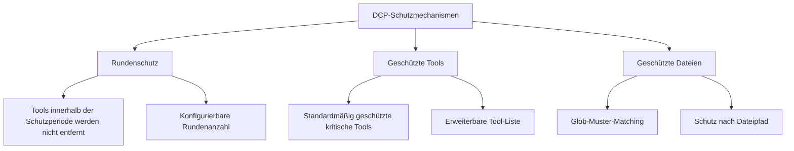

# Schutzmechanismen: Fehlerhaftes Pruning kritischer Inhalte vermeiden

## Lernziele

- Rundenschutz konfigurieren, damit die KI Zeit hat, auf aktuelle Tool-Ausgaben zu verweisen
- Die Liste geschützter Tools erweitern, um kritische Operationen vor dem Pruning zu schützen
- Geschützte Dateimuster einrichten, um bestimmte Dateien vor versehentlichem Pruning zu bewahren
- Den Sub-Agent-Schutzmechanismus verstehen, um das Zusammenfassungsverhalten nicht zu beeinträchtigen

## Das Problem

DCP entfernt automatisch redundante Tool-Aufrufe aus dem Gesprächsverlauf – das spart Tokens, kann aber manchmal Probleme verursachen:

- Die KI hat gerade eine Datei gelesen und möchte den Inhalt analysieren, aber er wurde von DCP entfernt
- Sie haben mit dem `write`-Tool eine Konfigurationsdatei geschrieben, die später noch gelesen werden soll, aber nach dem Pruning ist der Dateipfad nicht mehr auffindbar
- Die KI sagt „basierend auf dem obigen Code", aber der Code ist nicht mehr im Kontext

All diese Situationen zeigen: **Bestimmte Inhalte müssen geschützt werden und dürfen nicht entfernt werden**.

## Anwendungsfälle

- Wenn die KI auf zuvor gelesene Dateiinhalte verweisen muss
- Wenn kritische Operationen geschützt werden müssen (z.B. Konfigurationen schreiben, Aufgabenplanung)
- Wenn bestimmte Dateipfade (z.B. Secrets, Schlüssel) besonderen Schutz benötigen
- Bei der Entwicklung von Sub-Agent-Funktionen (DCP überspringt diese automatisch)

## Kernkonzept

DCP bietet **drei Schutzebenen**, die aus verschiedenen Perspektiven verhindern, dass kritische Inhalte versehentlich entfernt werden:



**Schutzebenen**:
1. **Rundenschutz** (zeitliche Dimension): Tools der letzten N Runden werden automatisch geschützt
2. **Tool-Schutz** (Tool-Dimension): Bestimmte Tools werden niemals entfernt
3. **Dateischutz** (Pfad-Dimension): Tools, die bestimmte Dateien bearbeiten, werden nicht entfernt

Alle drei können kombiniert werden, um ein mehrschichtiges Schutznetz zu bilden.

---

## Rundenschutz

### Was ist Rundenschutz?

Rundenschutz (Turn Protection) ist ein **zeitfensterbasierter Schutzmechanismus** von DCP. Wenn aktiviert, werden Tool-Aufrufe innerhalb der Schutzperiode nicht zum Pruning-Cache hinzugefügt und können daher von keiner Strategie entfernt werden.

**Zweck**: Der KI Zeit geben, auf aktuelle Tool-Ausgaben zu verweisen, um die peinliche Situation „gerade gesagt, schon gelöscht" zu vermeiden.

### Rundenschutz konfigurieren

Fügen Sie in der Konfigurationsdatei hinzu:

```jsonc
{
  "turnProtection": {
    "enabled": true,
    "turns": 4
  }
}
```

**Parameterbeschreibung**:
- `enabled`: Ob Rundenschutz aktiviert ist (Standard: `false`)
- `turns`: Anzahl der geschützten Runden (Standard: `4`), d.h. Tools der letzten 4 Runden werden nicht entfernt

### Wie Rundenschutz funktioniert

DCP berechnet beim Synchronisieren des Tool-Caches (vor jeder KI-Nachricht) die Rundenanzahl für jedes Tool:

```typescript
// Wenn aktuelle Runde - Tool-Erstellungsrunde < Schutzrundenanzahl
// wird das Tool nicht entfernt
state.currentTurn - turnCounter < turnProtectionTurns
```

**Beispiel**:
- Aktuelle Runde: 10
- Tool-Erstellungsrunde: 8
- Schutzrundenanzahl: 4
- Ergebnis: 10 - 8 = 2 < 4 → **Geschützt, wird nicht entfernt**

**Auswirkung**:
- Innerhalb der Schutzperiode erscheinen Tools nicht in der `<prunable-tools>`-Liste
- Sie werden nicht von automatischen Strategien beeinflusst (Deduplizierung, Überschreiben, Fehlerbereinigung)
- Die KI kann sie nicht mit den `discard`/`extract`-Tools entfernen

### Empfohlene Konfiguration

| Szenario | Empfohlene Rundenanzahl | Erklärung |
| --- | --- | --- |
| Lange Gespräche (10+ Runden) | 4-6 | Gibt der KI genug Zeit, auf historische Inhalte zu verweisen |
| Kurze Gespräche (< 5 Runden) | 2-3 | Keine lange Schutzperiode nötig |
| Stark kontextabhängige Aufgaben | 6-8 | Z.B. Code-Refactoring, lange Dokumentanalysen |
| Standard (nicht kontextabhängig) | 0-2 | Nicht aktivieren oder Minimalwert verwenden |

::: tip Hinweis
Rundenschutz erhöht die Kontextgröße, da mehr Tool-Ausgaben erhalten bleiben. Wenn Sie einen deutlichen Anstieg des Token-Verbrauchs feststellen, können Sie die Schutzrundenanzahl entsprechend reduzieren.
:::

---

## Geschützte Tools

### Standardmäßig geschützte Tools

DCP schützt standardmäßig die folgenden Tools, die **niemals** entfernt werden:

| Tool-Name | Beschreibung |
| --- | --- |
| `task` | Aufgabenverwaltungs-Tool |
| `todowrite` | To-Do-Einträge schreiben |
| `todoread` | To-Do-Einträge lesen |
| `discard` | DCPs Verwerfen-Tool (die Pruning-Operation selbst) |
| `extract` | DCPs Extrahieren-Tool (die Pruning-Operation selbst) |
| `batch` | Batch-Operations-Tool |
| `write` | Datei-Schreib-Tool |
| `edit` | Datei-Bearbeitungs-Tool |
| `plan_enter` | Planungs-Einstiegsmarkierung |
| `plan_exit` | Planungs-Ausstiegsmarkierung |

**Warum diese Tools geschützt sind**:
- `task`, `todowrite`, `todoread`: Aufgabenverwaltung ist der Kern des Sitzungsstatus; Löschen würde zu Kontextverlust führen
- `discard`, `extract`: Sie sind DCPs eigene Pruning-Tools und können sich nicht selbst entfernen
- `batch`, `write`, `edit`: Dateioperationen sind der Kern der Interaktion zwischen KI und Benutzercode
- `plan_enter`, `plan_exit`: Planungsmarkierungen helfen, die Sitzungsstruktur zu verstehen

### Die Liste geschützter Tools erweitern

Wenn Sie weitere Tools schützen müssen, können Sie die Konfiguration erweitern:

```jsonc
{
  "tools": {
    "settings": {
      "protectedTools": [
        "task",
        "todowrite",
        "todoread",
        "discard",
        "extract",
        "batch",
        "write",
        "edit",
        "plan_enter",
        "plan_exit",
        // Fügen Sie die Tools hinzu, die Sie schützen möchten
        "read",
        "filesearch"
      ]
    }
  }
}
```

**Globaler Tool-Schutz**:
- Tools in `tools.settings.protectedTools` sind in allen Strategien geschützt
- Geeignet für Tools, die von keiner Strategie entfernt werden sollen

### Strategieebenen-Tool-Schutz

Sie können auch geschützte Tools für bestimmte Strategien festlegen:

```jsonc
{
  "strategies": {
    "deduplication": {
      "enabled": true,
      "protectedTools": [
        "read",  // read-Tool bei Deduplizierung schützen
        "filesearch"
      ]
    },
    "purgeErrors": {
      "enabled": true,
      "turns": 4,
      "protectedTools": [
        "write"  // write-Tool bei Fehlerbereinigung schützen
      ]
    }
  }
}
```

**Anwendungsfälle**:
- Ein Tool nur in einer bestimmten Strategie schützen, andere Strategien können es entfernen
- Beispiel: Deduplizierung darf `read` entfernen, aber die Fehlerbereinigungsstrategie darf `write` nicht entfernen

::: info Unterschied zwischen Tool-Schutz und Rundenschutz
- **Tool-Schutz**: Unabhängig davon, in welcher Runde das Tool erstellt wurde – solange es in der Schutzliste steht, wird es niemals entfernt
- **Rundenschutz**: Alle Tools (außer geschützten Tools) werden innerhalb der Schutzperiode nicht entfernt, können aber nach Ablauf der Schutzperiode entfernt werden
:::

---

## Geschützte Dateimuster

### Was sind geschützte Dateimuster?

Geschützte Dateimuster ermöglichen es Ihnen, durch Glob-Muster **Operationen auf bestimmten Dateipfaden vor dem Pruning zu schützen**.

**Anwendungsfälle**:
- Schlüsseldateien schützen (`.env`, `secrets.json`)
- Konfigurationsdateien schützen (wichtige Konfigurationen dürfen nicht verloren gehen)
- Projekt-Kerndateien schützen (Einstiegsdateien, Kernbibliotheken)
- Sensible Verzeichnisse schützen (z.B. `src/api/`, `tests/fixtures/`)

### Geschützte Dateimuster konfigurieren

Fügen Sie in der Konfigurationsdatei hinzu:

```jsonc
{
  "protectedFilePatterns": [
    "**/.env*",
    "**/secrets.json",
    "**/config/*.json",
    "src/core/**/*.ts",
    "tests/fixtures/**/*"
  ]
}
```

### Glob-Muster-Erklärung

DCP unterstützt Standard-Glob-Muster:

| Muster | Beschreibung | Beispiel-Übereinstimmungen |
| --- | --- | --- |
| `**` | Beliebige Verzeichnisebenen | `src/`, `src/components/`, `a/b/c/` |
| `*` | Beliebige Dateien in einer Verzeichnisebene | `src/*.ts` trifft auf `src/index.ts` |
| `?` | Ein einzelnes Zeichen | `file?.txt` trifft auf `file1.txt`, `file2.txt` |
| `*.json` | Bestimmte Dateierweiterung | `config.json`, `data.json` |
| `**/*.json` | JSON-Dateien in beliebiger Verzeichnisebene | `a/b/c.json`, `d.json` |

**Hinweise**:
- `*` und `?` treffen nicht auf `/` (Verzeichnistrenner)
- Der Abgleich erfolgt gegen den vollständigen Dateipfad
- Pfadtrenner sind einheitlich `/` (auch unter Windows)

### Praxisbeispiele

#### Beispiel 1: Umgebungsvariablen-Dateien schützen

```jsonc
{
  "protectedFilePatterns": [
    "**/.env",
    "**/.env.local",
    "**/.env.production"
  ]
}
```

**Auswirkung**: Alle Tools, die `.env`-Dateien bearbeiten, werden nicht entfernt.

#### Beispiel 2: Projekt-Kerndateien schützen

```jsonc
{
  "protectedFilePatterns": [
    "src/index.ts",
    "src/core/**/*.ts",
    "src/api/**/*.ts"
  ]
}
```

**Auswirkung**: Tool-Ausgaben, die Kernmodule und APIs bearbeiten, bleiben erhalten, sodass die KI die Projektstruktur immer sehen kann.

#### Beispiel 3: Test-Fixtures schützen

```jsonc
{
  "protectedFilePatterns": [
    "tests/fixtures/**/*",
    "tests/mocks/**/*.json"
  ]
}
```

**Auswirkung**: Mock-Daten und feste Eingaben für Tests werden nicht entfernt, um inkonsistente Testergebnisse zu vermeiden.

---

## Sub-Agent-Schutz

### Was ist ein Sub-Agent?

Ein Sub-Agent ist ein Mechanismus in OpenCode, bei dem der Haupt-Agent Sub-Agents für bestimmte Aufgaben (wie Dateisuche, Code-Analyse) erzeugen kann. Sub-Agents fassen ihre Ergebnisse zusammen und geben sie an den Haupt-Agent zurück.

### DCPs Sub-Agent-Schutz

DCP erkennt Sub-Agent-Sitzungen automatisch und **überspringt alle Pruning-Operationen**.

**Implementierungsprinzip**:
```typescript
// lib/state/utils.ts
export async function isSubAgentSession(client: any, sessionID: string): Promise<boolean> {
    const result = await client.session.get({ path: { id: sessionID } })
    return !!result.data?.parentID  // Wenn parentID vorhanden, ist es ein Sub-Agent
}
```

**Warum Schutz nötig ist**:
- Die Ausgabe des Sub-Agents ist eine Zusammenfassung für den Haupt-Agent
- Wenn Tool-Ausgaben des Sub-Agents entfernt werden, kann der Haupt-Agent den Kontext möglicherweise nicht verstehen
- Die Aufgabe des Sub-Agents ist „effiziente Ausführung", nicht „Token sparen"

::: info Benutzerwahrnehmung
Der Sub-Agent-Schutz ist automatisch – Sie müssen nichts konfigurieren. DCP protokolliert erkannte Sub-Agent-Sitzungen in den Logs.
:::

---

## Anleitung: Schutzmechanismen konfigurieren

### Schritt 1: Konfigurationsdatei bearbeiten

Öffnen Sie die globale Konfigurationsdatei (oder Projektkonfigurationsdatei):

```bash
# macOS/Linux
code ~/.config/opencode/dcp.jsonc

# Windows
code $env:APPDATA\opencode\dcp.jsonc
```

### Schritt 2: Schutzkonfiguration hinzufügen

```jsonc
{
  "$schema": "https://raw.githubusercontent.com/Opencode-DCP/opencode-dynamic-context-pruning/main/dcp.schema.json",
  "enabled": true,
  "debug": false,

  // Rundenschutz
  "turnProtection": {
    "enabled": true,
    "turns": 4
  },

  // Geschützte Dateimuster
  "protectedFilePatterns": [
    "**/.env*",
    "**/secrets.json"
  ],

  // Erweiterte geschützte Tools
  "tools": {
    "settings": {
      "nudgeEnabled": true,
      "nudgeFrequency": 10,
      "protectedTools": [
        "task",
        "todowrite",
        "todoread",
        "discard",
        "extract",
        "batch",
        "write",
        "edit",
        "plan_enter",
        "plan_exit",
        "read"
      ]
    },
    "discard": {
      "enabled": true
    },
    "extract": {
      "enabled": true,
      "showDistillation": false
    }
  },

  // Strategieebenen-Schutz
  "strategies": {
    "deduplication": {
      "enabled": true,
      "protectedTools": ["filesearch"]
    },
    "supersedeWrites": {
      "enabled": false
    },
    "purgeErrors": {
      "enabled": true,
      "turns": 4,
      "protectedTools": ["write"]
    }
  }
}
```

### Schritt 3: OpenCode neu starten

Nach der Konfigurationsänderung starten Sie OpenCode neu, damit die Konfiguration wirksam wird:

- macOS/Linux: Rechtsklick auf das OpenCode-Symbol im Dock → Beenden → Erneut öffnen
- Windows: Rechtsklick auf OpenCode in der Taskleiste → Fenster schließen → Erneut öffnen

### Schritt 4: Schutzmechanismen überprüfen

Geben Sie im OpenCode-Dialog `/dcp context` ein, um die aktuelle Kontextanalyse anzuzeigen:

```
Session Context Breakdown:
──────────────────────────────────────────────────────────

System         15.2% │████████████████▒▒▒▒▒▒▒▒▒▒▒▒▒▒▒▒▒▒▒▒▒▒▒│  25.1K tokens
User            5.1% │████▒▒▒▒▒▒▒▒▒▒▒▒▒▒▒▒▒▒▒▒▒▒▒▒▒▒▒▒▒▒▒▒▒▒▒▒▒▒│   8.4K tokens
Assistant       35.8% │██████████████████████████████████████▒▒▒▒▒▒▒│  59.2K tokens
Tools (45)      43.9% │████████████████████████████████████████████████│  72.6K tokens

──────────────────────────────────────────────────────────

Summary:
  Pruned:          12 tools (~15.2K tokens)
  Current context: ~165.3K tokens
  Without DCP:     ~180.5K tokens
```

**Was Sie sehen sollten**:
- Die `Pruned`-Anzahl kann sinken (da geschützte Tools nicht entfernt werden)
- Der `Current context` kann größer werden (da Rundenschutz mehr Inhalte erhält)

---

## Typische Fallstricke

### ❌ Fehler 1: Übermäßiger Schutz führt zu Token-Verschwendung

**Problem**: Zu lange Schutzrundenanzahl oder zu viele geschützte Tools führen dazu, dass der Kontext immer groß bleibt.

**Lösung**:
- Rundenschutz normalerweise auf 2-4 Runden setzen
- Nur wirklich kritische Tools schützen (z.B. `task`, `write`)
- Regelmäßig `/dcp context` prüfen, um die Kontextgröße zu überwachen

### ❌ Fehler 2: Glob-Muster-Matching schlägt fehl

**Problem**: Sie haben `*.json` gesetzt, aber einige JSON-Dateien werden trotzdem entfernt.

**Ursache**: `*` trifft nicht auf `/`, daher wird `a/b/c.json` nicht getroffen.

**Lösung**: Verwenden Sie `**/*.json`, um JSON-Dateien in beliebiger Verzeichnisebene zu treffen.

### ❌ Fehler 3: Vergessen, OpenCode neu zu starten

**Problem**: Nach der Konfigurationsänderung werden die Schutzmechanismen nicht wirksam.

**Ursache**: DCP lädt die Konfigurationsdatei nur beim Start.

**Lösung**: Nach Konfigurationsänderungen muss OpenCode neu gestartet werden.

### ❌ Fehler 4: Geschützte Tools erscheinen in der Pruning-Liste

**Problem**: Sie haben geschützte Tools eingerichtet, aber sie erscheinen trotzdem in der `<prunable-tools>`-Liste.

**Ursache**: Geschützte Tools werden nicht entfernt, aber wenn sie außerhalb der Schutzperiode liegen, erscheinen sie trotzdem in der `<prunable-tools>`-Liste (zur Ansicht für die KI), nur dass der Versuch der KI, sie zu entfernen, fehlschlägt.

**Lösung**: Dies ist normales Verhalten. Wenn die KI versucht, ein geschütztes Tool zu entfernen, lehnt DCP die Operation ab und gibt einen Fehler zurück.

---

## Zusammenfassung

Die Schutzmechanismen von DCP umfassen drei Ebenen:

1. **Rundenschutz**: Tools innerhalb der Schutzperiode werden nicht entfernt, gibt der KI Zeit, auf historische Inhalte zu verweisen
2. **Geschützte Tools**: Bestimmte Tools (z.B. `task`, `write`) werden niemals entfernt, benutzerdefinierte Liste erweiterbar
3. **Geschützte Dateimuster**: Schutz von Operationen auf bestimmten Dateipfaden durch Glob-Muster
4. **Sub-Agent-Schutz**: DCP erkennt automatisch Sub-Agent-Sitzungen und überspringt deren Pruning-Operationen

**Empfohlene Konfigurationsstrategie**:
- Entwicklungsphase: Rundenschutz aktivieren (2-4 Runden), Konfigurationsdateien und Kernmodule schützen
- Produktionsphase: Nach Bedarf anpassen, Balance zwischen Token-Einsparung und Kontextintegrität
- Kritische Aufgaben: Alle Schutzmechanismen aktivieren, um sicherzustellen, dass kritische Inhalte nicht verloren gehen

---

## Vorschau auf das nächste Kapitel

> Im nächsten Kapitel lernen wir **[Zustandspersistenz](../state-persistence/)**.
>
> Sie werden lernen:
> - Wie DCP den Pruning-Status und Statistiken über Sitzungen hinweg erhält
> - Speicherort und Format der Persistenzdateien
> - Wie Sie die kumulierten Token-Einsparungen einsehen können
> - Methoden zum Bereinigen der persistierten Daten

---

## Anhang: Quellcode-Referenz

<details>
<summary><strong>Klicken Sie hier, um die Quellcode-Positionen anzuzeigen</strong></summary>

> Aktualisiert: 2026-01-23

| Funktion | Dateipfad | Zeilen |
| --- | --- | --- |
| Rundenschutz-Logik | [`lib/state/tool-cache.ts`](https://github.com/Opencode-DCP/opencode-dynamic-context-pruning/blob/main/lib/state/tool-cache.ts#L39-L44) | 39-44 |
| Standard geschützte Tools | [`lib/config.ts`](https://github.com/Opencode-DCP/opencode-dynamic-context-pruning/blob/main/lib/config.ts#L68-L79) | 68-79 |
| Geschützte Datei-Matching | [`lib/protected-file-patterns.ts`](https://github.com/Opencode-DCP/opencode-dynamic-context-pruning/blob/main/lib/protected-file-patterns.ts#L77-L82) | 77-82 |
| Sub-Agent-Erkennung | [`lib/state/utils.ts`](https://github.com/Opencode-DCP/opencode-dynamic-context-pruning/blob/main/lib/state/utils.ts#L1-L8) | 1-8 |
| Deduplizierungsstrategie-Schutzprüfung | [`lib/strategies/deduplication.ts`](https://github.com/Opencode-DCP/opencode-dynamic-context-pruning/blob/main/lib/strategies/deduplication.ts#L49-L57) | 49-57 |
| Discard-Tool-Schutzprüfung | [`lib/strategies/tools.ts`](https://github.com/Opencode-DCP/opencode-dynamic-context-pruning/blob/main/lib/strategies/tools.ts#L89-L112) | 89-112 |

**Wichtige Konstanten**:
- `DEFAULT_PROTECTED_TOOLS = ["task", "todowrite", "todoread", "discard", "extract", "batch", "write", "edit", "plan_enter", "plan_exit"]`: Standard-Liste geschützter Tools

**Wichtige Funktionen**:
- `isProtectedFilePath(filePath, patterns)`: Prüft, ob ein Dateipfad einem Schutzmuster entspricht
- `isSubAgentSession(client, sessionID)`: Erkennt, ob eine Sitzung ein Sub-Agent ist

</details>
