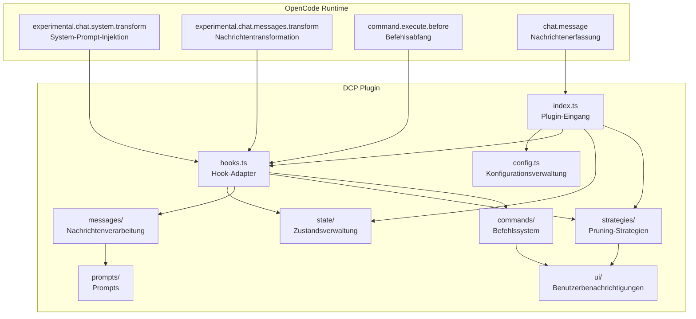
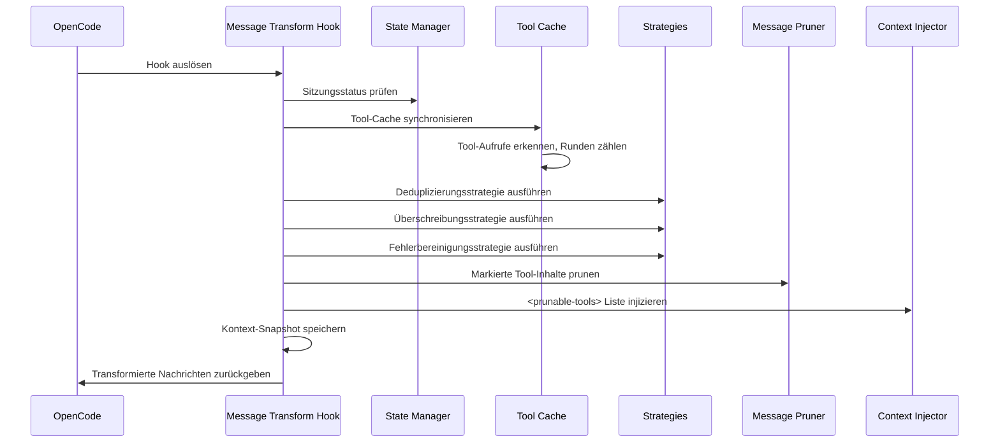
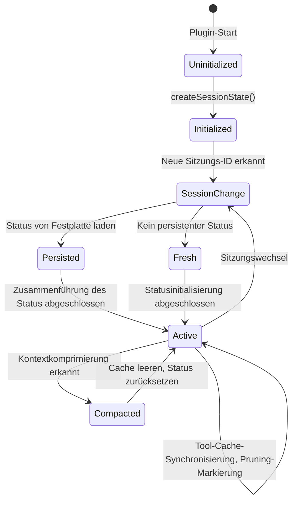
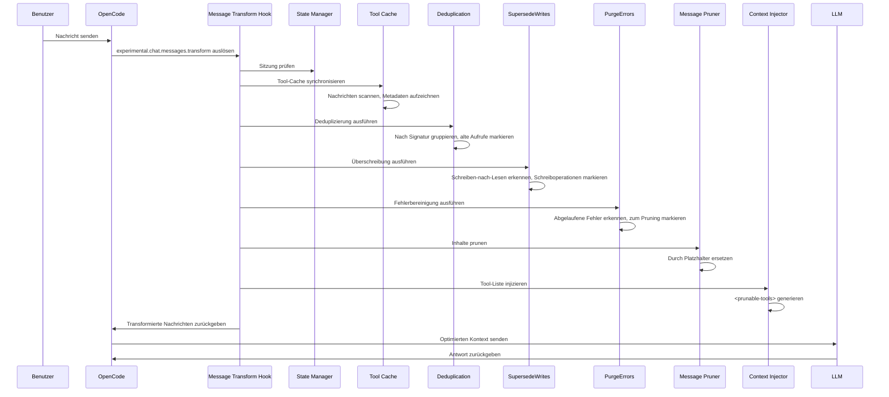
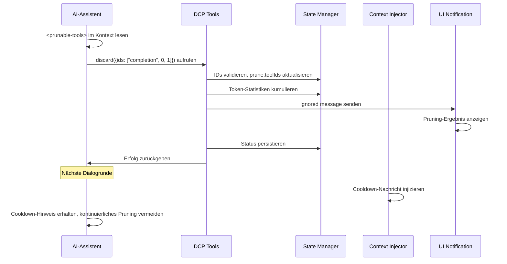

# Architekturübersicht: Wie DCP intern funktioniert

## Was Sie nach diesem Kurs können

Dieser Abschnitt behandelt keine Operationen, sondern hilft Ihnen, das interne Design von DCP zu verstehen. Nach dem Lernen werden Sie in der Lage sein:
- Zu verstehen, wie DCP über das OpenCode-Hook-System in den Dialogfluss integriert wird
- Die Verantwortungsbereiche und Interaktionsweisen der einzelnen Module zu beherrschen
- Den vollständigen Aufrufpfad von der Nachrichtenempfang bis zum Abschluss des Pruning zu verstehen
- Das Design von Zustandsverwaltung, Nachrichtenverarbeitung und Pruning-Strategien zu verstehen

## Kernkonzept

DCP ist ein Plugin basierend auf dem OpenCode Plugin SDK, das die Dialogfähigkeiten von OpenCode durch die Registrierung von Hooks und Tools erweitert. Das gesamte System dreht sich um das Kernkonzept der "Nachrichtentransformation" (message transform) – jedes Mal, bevor die AI auf den Benutzer antwortet, scannt, analysiert und pruned DCP den Dialogverlauf und sendet dann den optimierten Kontext an das LLM.

::: info Warum "Nachrichtentransformation"?

OpenCode bietet den Hook `experimental.chat.messages.transform`, der es Plugins ermöglicht, Nachrichten zu modifizieren, bevor sie an das LLM gesendet werden. Genau das ist die Fähigkeit, die DCP benötigt – redundante Tool-Aufrufe zu entfernen, bevor das LLM den Kontext sieht.

:::

Das System verwendet ein modulares Design mit klaren Verantwortlichkeiten für jedes Modul:
- **config**: Konfigurationsverwaltung mit Unterstützung für mehrschichtige Überschreibung
- **state**: Zustandsverwaltung zur Aufrechterhaltung des sitzungsbasierten Laufzeitstatus
- **messages**: Nachrichtenverarbeitung zur Durchführung der tatsächlichen Pruning- und Injektionsoperationen
- **strategies**: Pruning-Strategien zur Definition automatischer Bereinigungsregeln
- **commands**: Befehlssystem zur Bereitstellung manueller Steuerung und Statistikabfragen
- **hooks**: Hook-Adapter zur Verbindung von OpenCode und DCP-Modulen
- **ui**: Benutzerbenachrichtigungen zur Anzeige von Pruning-Ergebnissen und Statistiken

## Modularchitekturdiagramm



## Plugin-Eingang und Initialisierung

Der Plugin-Eingang ist in `index.ts` definiert und ist der einzige Verbindungspunkt zwischen DCP und der OpenCode Plugin API.

### Plugin-Registrierungsprozess

```typescript
const plugin: Plugin = (async (ctx) => {
    const config = getConfig(ctx)
    if (!config.enabled) {
        return {}
    }

    const logger = new Logger(config.debug)
    const state = createSessionState()

    return {
        "experimental.chat.system.transform": createSystemPromptHandler(...),
        "experimental.chat.messages.transform": createChatMessageTransformHandler(...),
        "chat.message": async (input, _output) => { /* Cache-Variante */ },
        "command.execute.before": createCommandExecuteHandler(...),
        tool: {
            discard: createDiscardTool(...),
            extract: createExtractTool(...),
        },
        config: async (opencodeConfig) => { /* OpenCode-Konfiguration ändern */ },
    }
}) satisfies Plugin
```

**Initialisierungsphase**:
1. Konfiguration laden (Unterstützung für mehrschichtige Zusammenführung: Standardwerte → Global → Umgebungsvariablen → Projekt)
2. Wenn das Plugin deaktiviert ist, sofort ein leeres Objekt zurückgeben
3. Log-System und Sitzungsstatusobjekt erstellen
4. Vier Hooks und zwei Tools registrieren

**Konfigurationsänderungsphase**:
- Über den `config`-Hook `discard` und `extract` Tools zu `experimental.primary_tools` hinzufügen
- `/dcp` Befehl registrieren

## Hook-System und Nachrichtentransformation

`hooks.ts` ist dafür verantwortlich, OpenCode-Hook-Ereignisse in interne DCP-Modulaufrufe zu konvertieren. Dies ist die zentrale Dispatch-Schicht von DCP.

### System-Prompt-Injektionshook

```typescript
createSystemPromptHandler(state, logger, config)
```

**Aufrufzeitpunkt**: Jedes Mal, wenn der System-Prompt erstellt wird

**Hauptaufgaben**:
1. Sub-Agent-Sitzung erkennen (überspringen, wenn Sub-Agent)
2. Internen Agent erkennen (z.B. Dialog-Zusammenfassungsgenerator, überspringen)
3. Passende Prompt-Vorlage basierend auf Konfiguration auswählen:
   - Beide discard und extract aktiviert: `system/system-prompt-both`
   - Nur discard aktiviert: `system/system-prompt-discard`
   - Nur extract aktiviert: `system/system-prompt-extract`
4. Tool-Beschreibung in den System-Prompt injizieren

**Warum ist System-Prompt-Injektion nötig?**

Die AI muss wissen, dass sie die Tools `discard` und `extract` verwenden kann, um den Kontext zu optimieren. Durch die Beschreibung dieser Tools im System-Prompt kann die AI autonom entscheiden, wann sie sie aufrufen soll.

### Nachrichtentransformationshook

```typescript
createChatMessageTransformHandler(ctx.client, state, logger, config)
```

**Aufrufzeitpunkt**: Jedes Mal, wenn die AI bereit ist, auf eine Nachricht zu antworten (vor dem Senden an das LLM)

**Verarbeitungsablauf**:



**Kernschritte**:

1. **Sitzungsprüfung** (`checkSession`)
   - Sitzungs-ID-Änderung erkennen
   - Bei neuer Sitzung persistenten Status von der Festplatte laden
   - Kontextkomprimierung erkennen (OpenCodes Summary-Mechanismus), bei Erkennung Tool-Cache leeren

2. **Tool-Cache-Synchronisierung** (`syncToolCache`)
   - Alle Tool-Aufrufe in Nachrichten scannen
   - `callID`, Tool-Name, Parameter, Status, Runden für jedes Tool aufzeichnen
   - Geschützte Tools und Tools in der Rundenschutzperiode überspringen
   - `nudgeCounter` pflegen (Zähler für ungeprunete Tools)

3. **Automatische Strategien ausführen**
   - `deduplicate`: Deduplizierung, neuesten Aufruf behalten
   - `supersedeWrites`: Bereinigung von Schreiboperationen, die durch Lesen überschrieben wurden
   - `purgeErrors`: Bereinigung von Eingaben abgelaufener Fehler-Tools

4. **Inhalte prunen** (`prune`)
   - `output` markierter Tools durch Platzhalter ersetzen
   - `input` fehlerhafter Tools durch Platzhalter ersetzen

5. **Tool-Liste injizieren** (`insertPruneToolContext`)
   - `<prunable-tools>` Liste generieren (enthält numerische ID, Tool-Name, Parameter-Zusammenfassung)
   - Erinnerungsnachrichten nach Bedarf injizieren (nudge)
   - Wenn letzte Aktion Pruning war, Cooldown-Nachricht injizieren

6. **Kontext-Snapshot speichern**
   - Transformierte Nachrichten im Log-Verzeichnis speichern, um Debugging zu erleichtern

### Befehlsabfanghook

```typescript
createCommandExecuteHandler(ctx.client, state, logger, config, ctx.directory)
```

**Aufrufzeitpunkt**: Wenn Benutzer Befehle ausführen

**Hauptaufgaben**:
- Befehle, die mit `/dcp` beginnen, abfangen
- An entsprechende Befehlsprozessoren weiterleiten:
  - `/dcp` → Hilfe anzeigen
  - `/dcp context` → Token-Nutzungsanalyse anzeigen
  - `/dcp stats` → Kumulierte Pruning-Statistiken anzeigen
  - `/dcp sweep [n]` → Tools manuell prunen
- Durch Werfen eines speziellen Fehlers (`__DCP_*_HANDLED__`) die Standardbefehlsverarbeitung von OpenCode blockieren

## Zustandsverwaltung

Das `state/`-Modul ist für die Aufrechterhaltung des sitzungsbasierten Laufzeitstatus und der Persistenz verantwortlich.

### Kern-Datenstrukturen

**SessionState** (Speicherstatus):
```typescript
{
    sessionId: string | null,           // Aktuelle Sitzungs-ID
    isSubAgent: boolean,               // Ob es eine Sub-Agent-Sitzung ist
    prune: { toolIds: string[] },       // Liste der zum Pruning markierten Tool-IDs
    stats: {
        pruneTokenCounter: number,      // Aktuelle Sitzung Pruning-Token-Anzahl
        totalPruneTokens: number,       // Historisch kumulierte Pruning-Token-Anzahl
    },
    toolParameters: Map<string, ToolParameterEntry>,  // Tool-Aufruf-Cache
    nudgeCounter: number,               // Zähler ungeprunter Tools (zur Auslösung von Erinnerungen)
    lastToolPrune: boolean,             // Ob letzte Aktion Tool-Pruning war
    lastCompaction: number,             // Zeitstempel der letzten Kontextkomprimierung
    currentTurn: number,                // Aktuelle Rundennummer
    variant: string | undefined,       // Modellvariante (z.B. claude-3.5-sonnet)
}
```

**ToolParameterEntry** (Tool-Metadaten):
```typescript
{
    tool: string,                       // Tool-Name
    parameters: any,                    // Tool-Parameter
    status: ToolStatus | undefined,     // Ausführungsstatus
    error: string | undefined,          // Fehlerinformation
    turn: number,                       // Rundennummer, in der der Aufruf erstellt wurde
}
```

### Zustandslebenszyklus



**Wichtige Zustandsübergänge**:

1. **Sitzungsinitialisierung** (`ensureSessionInitialized`)
   - `sessionID`-Änderung erkennen
   - Ob es ein Sub-Agent ist, erkennen (durch `session.parentID`)
   - `PersistedSessionState` von der Festplatte laden
   - Rundenzähler und Komprimierungszeitstempel initialisieren

2. **Kontextkomprimierungsbehandlung**
   - OpenCodes `summary`-Nachricht erkennen (`msg.info.summary === true`)
   - Tool-Cache und Pruning-Liste leeren
   - Komprimierungszeitstempel aufzeichnen, um wiederholte Bereinigung zu verhindern

3. **Persistenz**
   - Nach Abschluss des Pruning-Vorgangs asynchron in `~/.local/share/opencode/storage/plugin/dcp/{sessionId}.json` speichern
   - Enthält Sitzungsname, Pruning-Liste, Statistiken, letzte Aktualisierungszeit

## Nachrichtenverarbeitungsmodul

Das `messages/`-Modul ist für die tatsächlichen Pruning- und Injektionsoperationen verantwortlich.

### Pruning-Operation (prune.ts)

**Kernfunktion**: `prune(state, logger, config, messages)`

**Drei Unterfunktionen**:

1. **`pruneToolOutputs`**
   - `output` markierter Tools durch Platzhalter ersetzen
   - Nur Tools mit Status `completed` verarbeiten
   - `question`-Tools überspringen (spezielle Behandlung für Frage-Tools)

2. **`pruneToolInputs`**
   - Nur `question`-Tools verarbeiten
   - `questions`-Feld durch Platzhalter ersetzen (Benutzerantworten behalten)

3. **`pruneToolErrors`**
   - Eingabeparameter fehlerhafter Tools bereinigen
   - Fehlermeldungen behalten, nur String-Eingaben entfernen (möglicherweise große Parameter)

**Platzhalter-Design**:
```
[Output removed to save context - information superseded or no longer needed]
[input removed due to failed tool call]
[questions removed - see output for user's answers]
```

### Kontextinjektion (inject.ts)

**Kernfunktion**: `insertPruneToolContext(state, config, logger, messages)`

**Ablauf**:

1. **Tool-Liste generieren** (`buildPrunableToolsList`)
   - Tool-Cache durchlaufen, ausschließen:
     - Bereits geprunete Tools
     - Geschützte Tools (`task`, `write`, `edit` usw.)
     - Geschützte Dateipfade (passend zu `protectedFilePatterns`)
   - Für jedes Tool eine Beschreibung generieren: `{numericId}: {toolName}, {paramKey}`
   - Beispiel: `3: read, src/config.ts`

2. **Als `<prunable-tools>`-Tag verpacken**
   ```html
   <prunable-tools>
   The following tools have been invoked and are available for pruning. This list does not mandate immediate action. Consider your current goals and resources you need before discarding valuable tool inputs or outputs. Consolidate your prunes for efficiency; it is rarely worth pruning a single tiny tool output. Keep your context free of noise.
   0: read, src/config.ts
   1: read, src/config.ts
   2: read, src/utils.ts
   </prunable-tools>
   ```

3. **Cooldown-Status behandeln**
   - Wenn letzte Aktion `discard` oder `extract` war, Cooldown-Nachricht injizieren:
   ```html
   <prunable-tools>
   Context management was just performed. Do not use discard or extract tools again. A fresh list will be available after your next tool use.
   </prunable-tools>
   ```

4. **Erinnerungsnachrichten injizieren**
   - Wenn `nudgeCounter >= nudgeFrequency`, Erinnerungstext anhängen
   - Erinnerungsformat: `"You have not used context pruning in a while. Consider using discard/extract tools to reduce token usage."`

5. **Einfügeposition der Nachricht auswählen**
   - Wenn letzte Nachricht eine Benutzernachricht ist, synthetische Benutzernachricht einfügen
   - Andernfalls synthetische Assistentennachricht einfügen
   - `variant` verwenden, um Nachrichtenformatkompatibilität mit verschiedenen Modellen sicherzustellen

## Pruning-Strategiemodul

Das `strategies/`-Modul definiert automatische Bereinigungsregeln.

### Deduplizierungsstrategie (deduplication.ts)

**Kernfunktion**: `deduplicate(state, logger, config, messages)`

**Algorithmus**:
1. Chronologische Liste aller Tool-IDs erstellen
2. "Signatur" für jedes Tool berechnen: `tool::normalizedParameters`
   - Parameter normalisieren: `null`/`undefined` entfernen
   - Schlüsselreihenfolge sortieren: Sicherstellen, dass `{"b":1,"a":2}` und `{"a":2,"b":1}` dieselbe Signatur erzeugen
3. Nach Signatur gruppieren
4. In jeder Gruppe den letzten (neuesten) behalten, andere zum Pruning markieren

**Beispiel**:
```typescript
// Ursprüngliche Tool-Aufrufe
Tool Call 1: read({filePath: "src/config.ts"})
Tool Call 2: read({filePath: "src/config.ts"})
Tool Call 3: read({filePath: "src/utils.ts"})

// Signaturgruppierung
Signature 1: "read::{\"filePath\":\"src/config.ts\"}" → [Tool Call 1, Tool Call 2]
Signature 2: "read::{\"filePath\":\"src/utils.ts\"}" → [Tool Call 3]

// Pruning-Ergebnis
Zum Pruning markiert: [Tool Call 1]  // Tool Call 2 behalten (neuestes)
Behalten: [Tool Call 2, Tool Call 3]
```

### Überschreibungsstrategie (supersede-writes.ts)

**Kernfunktion**: `supersedeWrites(state, logger, config, messages)`

**Algorithmus**:
1. Alle Tool-Aufrufe in chronologischer Reihenfolge scannen
2. Datei-Tracking-Tabelle pflegen:
   ```typescript
   {
       "src/config.ts": {
           lastWrite: callId,
           lastWriteTime: timestamp,
           lastRead: callId,
           lastReadTime: timestamp,
       }
   }
   ```
3. Muster erkennen:
   - Wenn `lastWriteTime < lastReadTime` einer Datei, bedeutet dies, dass die Schreiboperation durch Lesen überschrieben wurde
   - `input` dieser Schreiboperation zum Pruning markieren

**Szenario**:
```typescript
// Zeitlinie
Turn 1: write({filePath: "src/config.ts", content: "..."})  // lastWrite = call1
Turn 2: read({filePath: "src/config.ts"})                 // lastRead = call2 (überschreibt Schreiboperation)
Turn 3: read({filePath: "src/config.ts"})                 // Neuestes Lesen behalten

// Pruning-Ergebnis
Zum Pruning markiert: [Turn 1 write-Aufruf]
```

### Fehlerbereinigungsstrategie (purge-errors.ts)

**Kernfunktion**: `purgeErrors(state, logger, config, messages)`

**Algorithmus**:
1. Alle Tools mit Status `error` scannen
2. Differenz zwischen aktueller Rundennummer und Tool-Erstellungsrunde prüfen
3. Wenn Differenz > `strategies.purgeErrors.turns` (Standard 4), zum Pruning markieren

**Schutzmechanismus**:
- Fehlermeldungen behalten (`part.state.error`)
- Nur Eingabeparameter entfernen (`part.state.input`), da Fehlereingaben möglicherweise groß sind

**Szenario**:
```typescript
Turn 1: read({filePath: "nonexistent.txt"}) → error
Turn 2-5: Andere Operationen
Turn 6: Benutzer setzt Dialog fort

// Wenn purgeErrors.turns = 4
// Turn 6 - Turn 1 = 5 > 4
// Turn 1 Fehlereingabe zum Pruning markieren
```

### LLM-gesteuerte Tools (tools.ts)

**Discard-Tool**:
```typescript
{
    name: "discard",
    description: "Remove completed task or noise tool outputs",
    parameters: {
        ids: ["completion", 0, 1, 2]  // Erstes Element ist Grund: 'completion' oder 'noise'
    }
}
```

**Extract-Tool**:
```typescript
{
    name: "extract",
    description: "Extract key findings then remove original tool outputs",
    parameters: {
        ids: [0, 1, 2],
        distillation: ["key finding 1", "key finding 2", "key finding 3"]
    }
}
```

**Verarbeitungsablauf**:
1. AI ruft Tool auf, bietet Liste numerischer IDs
2. Numerische IDs auf echte `callID`s abbilden
3. Überprüfen, dass Tool nicht in Schutzliste ist
4. `prune.toolIds` aktualisieren
5. Pruning-Ergebnis durch `ignored message` anzeigen
6. Status persistieren

## Befehlssystem

Das `commands/`-Modul bietet manuelle Steuerung und Statistikabfragen.

### Context-Befehl

```bash
/dcp context
```

**Ausgabe**: Token-Nutzungsanalyse (Balkendiagramm)
```
╭───────────────────────────────────────────────────────────╮
│                  DCP Context Analysis                     │
╰───────────────────────────────────────────────────────────╯

Session Context Breakdown:
───────────────────────────────────────────────────────────

System         15.2% │████████████████▒▒▒▒▒▒▒▒▒▒▒▒▒▒▒▒▒▒▒▒▒▒▒│  25.1K tokens
User            5.1% │████▒▒▒▒▒▒▒▒▒▒▒▒▒▒▒▒▒▒▒▒▒▒▒▒▒▒▒▒▒▒▒▒▒▒▒▒▒▒│   8.4K tokens
Assistant       35.8% │██████████████████████████████████████▒▒▒▒▒▒▒│  59.2K tokens
Tools (45)      43.9% │████████████████████████████████████████████████│  72.6K tokens

───────────────────────────────────────────────────────────

Summary:
  Pruned:          12 tools (~15.2K tokens)
  Current context: ~165.3K tokens
  Without DCP:     ~180.5K tokens
```

**Berechnungslogik**:
- System: `firstAssistant.input + cache.read - tokenizer(firstUserMessage)`
- User: `tokenizer(all user messages)`
- Tools: `tokenizer(toolInputs + toolOutputs) - prunedTokens`
- Assistant: Residualberechnung

### Stats-Befehl

```bash
/dcp stats
```

**Ausgabe**: Kumulierte Pruning-Statistiken
```
╭───────────────────────────────────────────────────────────╮
│                      DCP Statistics                      │
╰───────────────────────────────────────────────────────────╯

Session Pruning:
  Tools pruned: 12
  Tokens saved: ~15.2K
  Last prune:   discard (2 turns ago)

Lifetime Statistics:
  Total tokens saved: ~145.8K
```

### Sweep-Befehl

```bash
/dcp sweep [n]
```

**Zwei Modi**:
1. Standard: Alle Tools nach der letzten Benutzernachricht prunen
2. Spezifiziert: `/dcp sweep 5`, die letzten 5 Tools prunen

**Verarbeitungsablauf**:
1. Position der letzten Benutzernachricht finden
2. Nachfolgende Tool-Aufrufe extrahieren
3. Geschützte Tools und geschützte Dateien filtern
4. Zum Pruning markieren
5. Ergebnis und Token-Einsparungen anzeigen

## Konfigurationssystem

`config.ts` ist für Konfigurationsladung und -validierung verantwortlich.

### Konfigurationspriorität

```
Standardwerte (1) < Global (2) < Umgebungsvariablen (3) < Projekt (4)
```

**Konfigurationspfade**:
- Global: `~/.config/opencode/dcp.jsonc`
- Umgebungsvariablen: `$OPENCODE_CONFIG_DIR/dcp.jsonc`
- Projekt: `<project>/.opencode/dcp.jsonc`

### Konfigurationszusammenführungsablauf

```typescript
const defaultConfig = { /* Hardcodierte Standardwerte */ }
const globalConfig = loadConfig(globalPath) || {}
const envConfig = loadConfig(envPath) || {}
const projectConfig = loadConfig(projectPath) || {}

const finalConfig = {
    ...defaultConfig,
    ...globalConfig,
    ...envConfig,
    ...projectConfig,
}
```

### Validierungsmechanismus

- Zod Schema zur Definition der Konfigurationsstruktur verwenden
- Bei ungültiger Konfiguration Toast-Warnung anzeigen und auf Standardwerte zurückfallen
- Bei nicht existierender Konfigurationsdatei automatisch Standardkonfiguration erstellen

## Modulabhängigkeiten

| Modul        | Verantwortung               | Abhängige Module                              | Abhängige Module                  |
| --- | --- | --- | --- |
| config      | Konfigurationsverwaltung           | -                                     | index, hooks, strategies, commands |
| hooks       | Hook-Adapter           | config, state, logger, messages, strategies, commands | index |
| state       | Zustandsverwaltung           | logger                                | index, hooks, strategies    |
| messages    | Nachrichtenverarbeitung           | state, logger, prompts, ui, protected-file-patterns | hooks |
| strategies   | Pruning-Strategien           | state, logger, messages, ui, protected-file-patterns | hooks |
| commands     | Befehlsverarbeitung           | state, logger, messages, ui, strategies | hooks |
| ui          | Benutzerbenachrichtigungen           | state, logger, prompts                | strategies, commands        |
| prompts     | Prompt-Verwaltung         | -                                     | hooks, messages, strategies |
| logger      | Log-System           | -                                     | index, config, hooks, strategies, state, ui, commands |

## Vollständiger Aufrufpfad

### Automatischer Pruning-Ablauf



### LLM-gesteuerter Pruning-Ablauf



## Leistungsüberlegungen

### Tool-Cache-Beschränkung

- Maximale Kapazität: 1000 Einträge (`MAX_TOOL_CACHE_SIZE`)
- Bereinigungsstrategie: FIFO (First In First Out)
- Auslösebedingung: Größenprüfung nach jeder Synchronisierung

### Log-System

- Debug-Logs: `~/.config/opencode/logs/dcp/daily/YYYY-MM-DD.log`
- Kontext-Snapshots: `~/.config/opencode/logs/dcp/context/{sessionId}/`
- Log-Level: Konfigurierbar (`config.debug`)

### Sub-Agent-Erkennung

- Erkennungsmethode: Ob `session.parentID` existiert
- Behandlungsstrategie: Alle Pruning-Operationen überspringen (um doppeltes Pruning zu vermeiden)

## Zusammenfassung dieser Lektion

Die Architektur von DCP dreht sich um das Kernkonzept der "Nachrichtentransformation" und integriert sich nahtlos über das OpenCode-Hook-System in den Dialogfluss. Das System verwendet ein modulares Design mit klaren Verantwortlichkeiten für jedes Modul:

- **Plugin-Eingang** (`index.ts`) ist für die Registrierung von Hooks und Tools verantwortlich
- **Hook-System** (`hooks.ts`) ist für Ereignisverteilung und -dispatch verantwortlich
- **Zustandsverwaltung** (`state/`) ist für sitzungsbasierte Zustände und Persistenz verantwortlich
- **Nachrichtenverarbeitung** (`messages/`) ist für die tatsächliche Pruning- und Injektionsoperation verantwortlich
- **Pruning-Strategien** (`strategies/`) definieren automatische Bereinigungsregeln
- **Befehlssystem** (`commands/`) bietet manuelle Steuerung
- **Konfigurationssystem** (`config.ts`) unterstützt mehrschichtige Konfiguration

Der gesamte Ablauf wird im Hook `experimental.chat.messages.transform` abgeschlossen: Tool-Cache-Synchronisierung → Automatische Strategien ausführen → Inhalte prunen → Tool-Liste injizieren. Dieses Design stellt sicher, dass DCP die Optimierung abschließt, bevor das LLM den Kontext sieht, und behält gleichzeitig die Wartbarkeit und Erweiterbarkeit des Plugins bei.

---

## Anhang: Quellcode-Referenz

<details>
<summary><strong>Klicken zum Aufklappen der Quellcode-Positionen</strong></summary>

> Aktualisierungszeit: 2026-01-23

| Funktion        | Dateipfad                                                                                    | Zeilennummer    |
| --- | --- | --- |
| Plugin-Eingang und Hook-Registrierung | [`index.ts`](https://github.com/Opencode-DCP/opencode-dynamic-context-pruning/blob/main/index.ts) | 12-102 |
| System-Prompt-Injektionshook | [`lib/hooks.ts`](https://github.com/Opencode-DCP/opencode-dynamic-context-pruning/blob/main/lib/hooks.ts) | 20-53 |
| Nachrichtentransformationshook | [`lib/hooks.ts`](https://github.com/Opencode-DCP/opencode-dynamic-context-pruning/blob/main/lib/hooks.ts) | 55-82 |
| Befehlsabfanghook | [`lib/hooks.ts`](https://github.com/Opencode-DCP/opencode-dynamic-context-pruning/blob/main/lib/hooks.ts) | 84-156 |
| Sitzungszustandsverwaltung | [`lib/state/state.ts`](https://github.com/Opencode-DCP/opencode-dynamic-context-pruning/blob/main/lib/state/state.ts) | 7-143 |
| Tool-Cache-Synchronisierung | [`lib/state/tool-cache.ts`](https://github.com/Opencode-DCP/opencode-dynamic-context-pruning/blob/main/lib/state/tool-cache.ts) | 11-86 |
| Zustandspersistenz | [`lib/state/persistence.ts`](https://github.com/Opencode-DCP/opencode-dynamic-context-pruning/blob/main/lib/state/persistence.ts) | - |
| Nachrichtenpruning | [`lib/messages/prune.ts`](https://github.com/Opencode-DCP/opencode-dynamic-context-pruning/blob/main/lib/messages/prune.ts) | 11-106 |
| Kontextinjektion | [`lib/messages/inject.ts`](https://github.com/Opencode-DCP/opencode-dynamic-context-pruning/blob/main/lib/messages/inject.ts) | 102-157 |
| Deduplizierungsstrategie | [`lib/strategies/deduplication.ts`](https://github.com/Opencode-DCP/opencode-dynamic-context-pruning/blob/main/lib/strategies/deduplication.ts) | 13-83 |
| Überschreibungsstrategie | [`lib/strategies/supersede-writes.ts`](https://github.com/Opencode-DCP/opencode-dynamic-context-pruning/blob/main/lib/strategies/supersede-writes.ts) | - |
| Fehlerbereinigungsstrategie | [`lib/strategies/purge-errors.ts`](https://github.com/Opencode-DCP/opencode-dynamic-context-pruning/blob/main/lib/strategies/purge-errors.ts) | - |
| LLM-gesteuerte Tools | [`lib/strategies/tools.ts`](https://github.com/Opencode-DCP/opencode-dynamic-context-pruning/blob/main/lib/strategies/tools.ts) | - |
| Context-Befehl | [`lib/commands/context.ts`](https://github.com/Opencode-DCP/opencode-dynamic-context-pruning/blob/main/lib/commands/context.ts) | - |
| Stats-Befehl | [`lib/commands/stats.ts`](https://github.com/Opencode-DCP/opencode-dynamic-context-pruning/blob/main/lib/commands/stats.ts) | - |
| Sweep-Befehl | [`lib/commands/sweep.ts`](https://github.com/Opencode-DCP/opencode-dynamic-context-pruning/blob/main/lib/commands/sweep.ts) | - |
| Konfigurationsverwaltung | [`lib/config.ts`](https://github.com/Opencode-DCP/opencode-dynamic-context-pruning/blob/main/lib/config.ts) | - |
| Log-System | [`lib/logger.ts`](https://github.com/Opencode-DCP/opencode-dynamic-context-pruning/blob/main/lib/logger.ts) | - |

**Wichtige Konstanten**:
- `MAX_TOOL_CACHE_SIZE = 1000`: Maximale Kapazität des Tool-Cache, um unbegrenztes Speicherwachstum zu verhindern (`lib/state/tool-cache.ts:6`)

**Wichtige Funktionen**:
- `createSystemPromptHandler()`: Erstellt den System-Prompt-Injektionshook, ist dafür verantwortlich, der AI die verfügbaren Pruning-Tools zu erklären (`lib/hooks.ts:20-53`)
- `createChatMessageTransformHandler()`: Erstellt den Nachrichtentransformationshook, ist der zentrale Dispatcher von DCP, koordiniert Zustandsverwaltung, Strategieausführung, Nachrichtenpruning und Kontextinjektion (`lib/hooks.ts:55-82`)
- `syncToolCache()`: Synchronisiert den Tool-Parameter-Cache, zeichnet Metadaten jedes Tool-Aufrufs auf (callID, Parameter, Status, Rundennummer), für nachfolgende Pruning-Strategien (`lib/state/tool-cache.ts:11-86`)
- `deduplicate()`: Deduplizierungsstrategie, erkennt wiederholte Tool-Aufrufe durch Signatur-Matching, behält die neuesten (`lib/strategies/deduplication.ts:13-83`)
- `supersedeWrites()`: Überschreibungsstrategie, bereinigt Eingaben von Schreiboperationen, die durch nachfolgendes Lesen überschrieben wurden (`lib/strategies/supersede-writes.ts`)
- `purgeErrors()`: Fehlerbereinigungsstrategie, bereinigt Eingabeparameter abgelaufener Fehler-Tools (`lib/strategies/purge-errors.ts`)
- `prune()`: Hauptfunktion für Nachrichtenpruning, ruft drei Unterfunktionen auf, um Tool-Outputs, Tool-Inputs und Fehler-Inputs zu prunen (`lib/messages/prune.ts:11-20`)
- `insertPruneToolContext()`: Injiziert die `<prunable-tools>` Liste in den Kontext, bietet der AI zur Erkennung prunbarer Tools (`lib/messages/inject.ts:102-157`)
- `createDiscardTool()`: Erstellt die discard-Tool-Spezifikation, erlaubt der AI, abgeschlossene Aufgaben oder Rauschen-Tool-Outputs zu entfernen (`lib/strategies/tools.ts`)
- `createExtractTool()`: Erstellt die extract-Tool-Spezifikation, erlaubt der AI, nach dem Extrahieren wichtiger Erkenntnisse die ursprünglichen Tool-Outputs zu entfernen (`lib/strategies/tools.ts`)
- `createSessionState()`: Erstellt ein neues Sitzungszustandsobjekt, initialisiert alle Zustandsfelder (`lib/state/state.ts:42-60`)
- `ensureSessionInitialized()`: Stellt sicher, dass die Sitzung initialisiert ist, behandelt Sitzungswechsel, Sub-Agent-Erkennung, Statusladung (`lib/state/state.ts:80-116`)

**Wichtige Datenstrukturen**:
- `SessionState`: Sitzungsbasierter Laufzeitstatus, enthält sessionId, Pruning-Liste, Statistiken, Tool-Cache, Rundenzähler usw. (`lib/state/types.ts:27-38`)
- `ToolParameterEntry`: Metadaten-Cache für einzelne Tool-Aufrufe, enthält Tool-Name, Parameter, Status, Fehlerinformation, Rundennummer (`lib/state/types.ts:10-16`)
- `Prune`: Pruning-Status, zeichnet die Liste der zum Pruning markierten Tool-Aufruf-IDs auf (`lib/state/types.ts:23-25`)
- `SessionStats`: Sitzungsstatistiken, enthält aktuelle Sitzung Pruning-Token-Anzahl und historisch kumulierte Pruning-Token-Anzahl (`lib/state/types.ts:18-21`)

**Wichtige Typdefinitionen**:
- `ToolStatus`: Enumeration des Tool-Ausführungsstatus, einschließlich pending (wartend), running (ausführend), completed (abgeschlossen), error (fehlgeschlagen) (`lib/state/types.ts:8`)

</details>

---

## Vorschau auf die nächste Lektion

> In der nächsten Lektion lernen wir **[Token-Berechnungsprinzipien](../token-calculation/)**.
>
> Sie werden lernen:
> - Wie DCP Token-Nutzung präzise berechnet
> - Berechnungsmethoden für verschiedene Nachrichtentypen (System, User, Assistant, Tools)
> - Kumulationsmechanismus der Token-Einsparungsstatistik
> - Wie man Token-Berechnungsprobleme debuggt
