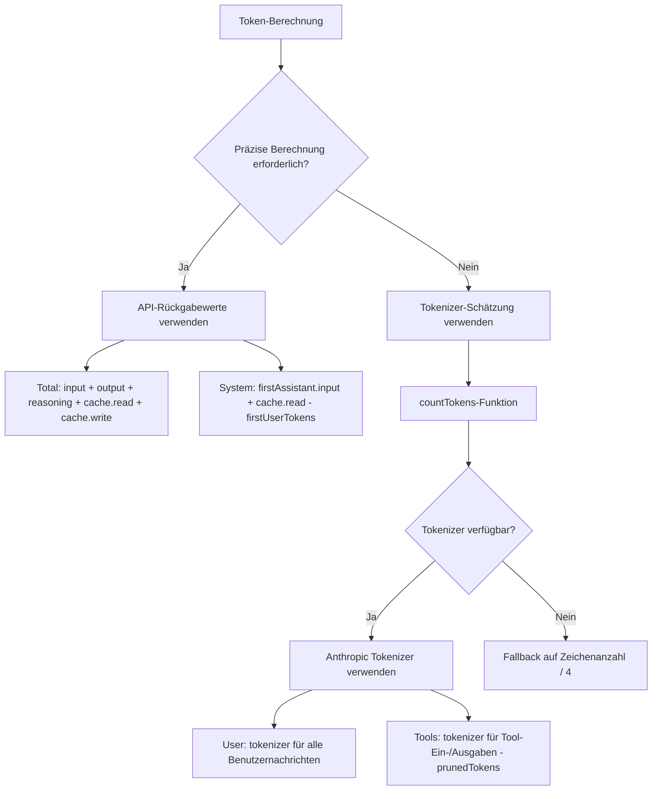

# Grundlagen der Token-Berechnung

## Was Sie nach diesem Kapitel können

- Die Token-Berechnungsstrategie von DCP verstehen (API-Werte vs. Schätzwerte)
- Die Token-Verteilung in der `/dcp context`-Ausgabe interpretieren
- Die Fehlerbereiche der Token-Schätzung und Optimierungsmethoden kennen
- Die Einsparungseffekte von DCP präzise bewerten

## Ihre aktuelle Herausforderung

Sie betrachten die Ausgabe von `/dcp context` – eine Menge Zahlen und Prozentsätze – aber Sie wissen nicht, wie sie berechnet werden:

```
Session Context Breakdown:
─────────────────────────────────────────────────────────

System         15.2% │████████████████▒▒▒▒▒▒▒▒▒▒▒▒▒▒▒▒▒▒▒▒▒│  25.1K tokens
User            5.1% │████▒▒▒▒▒▒▒▒▒▒▒▒▒▒▒▒▒▒▒▒▒▒▒▒▒▒▒▒▒▒▒▒▒▒▒▒▒▒▒▒▒│   8.4K tokens
Assistant       35.8% │██████████████████████████████████████▒▒▒▒▒▒│  59.2K tokens
Tools (45)      43.9% │████████████████████████████████████████████████│  72.6K tokens
─────────────────────────────────────────────────────────

Summary:
  Pruned:          12 tools (~15.2K tokens)
  Current context: ~165.3K tokens
  Without DCP:     ~180.5K tokens
```

Woher kommen diese Zahlen? Warum wird Assistant als „Residualberechnung" bezeichnet? Wie wird prunedTokens berechnet?

## Wann Sie diese Technik anwenden

- Wenn Sie die Einsparungseffekte von DCP präzise bewerten möchten
- Wenn Sie die Token-Verbrauchsstruktur analysieren müssen (welcher Teil am meisten verbraucht)
- Wenn Sie vermuten, dass die Token-Berechnung Fehler aufweist und die Genauigkeit überprüfen möchten
- Wenn Sie dem Team die Optimierungsergebnisse von DCP präsentieren müssen

## Kernkonzept

Die Token-Berechnung von DCP verwendet eine **Mischstrategie**: **Bevorzugt werden präzise API-Rückgabewerte verwendet, bei Bedarf werden Schätzwerte eingesetzt**.



**Kernprinzipien**:
1. **API-Werte bevorzugt**: Total und System verwenden präzise API-Rückgabewerte
2. **Schätzwerte ergänzend**: User und Tools verwenden Tokenizer-Schätzungen (da die API diese Werte nicht liefert)
3. **Residualberechnung**: Assistant wird durch Total - System - User - Tools berechnet

---

## Token-Berechnungsstrategie

### Präzise API-Rückgabewerte

Die OpenCode-API liefert für jede KI-Antwort präzise Token-Statistiken:

| Feld | Beschreibung | Quelle |
| --- | --- | --- |
| `tokens.input` | Eingabe-Token-Anzahl dieser Anfrage | Präziser API-Wert |
| `tokens.output` | Generierte Ausgabe-Token-Anzahl dieser Anfrage | Präziser API-Wert |
| `tokens.reasoning` | Reasoning-Token-Anzahl (z.B. Claude 3.5 Chain-of-Thought) | Präziser API-Wert (falls zutreffend) |
| `tokens.cache.read` | Aus Cache gelesene Token-Anzahl | Präziser API-Wert |
| `tokens.cache.write` | In Cache geschriebene Token-Anzahl | Präziser API-Wert |

**Diese Werte sind präzise**, da sie direkt aus dem Abrechnungssystem des LLM-Anbieters stammen.

### Berechnungsmethode für Schätzwerte

Für Werte, die die API nicht liefert (wie Benutzernachrichten, Tool-Aufrufe), verwendet DCP den **Anthropic Tokenizer** zur Schätzung.

**Implementierungscode** (`lib/strategies/utils.ts:36-43`):

```typescript
export function countTokens(text: string): number {
    if (!text) return 0
    try {
        // Bevorzugt Anthropic Tokenizer verwenden
        return anthropicCountTokens(text)
    } catch {
        // Bei Fehler Fallback auf Zeichenanzahl / 4
        return Math.round(text.length / 4)
    }
}
```

**Warum Zeichenanzahl/4 als Fallback**:
- Das durchschnittliche Token-Verhältnis für englischen Text beträgt etwa 4 Zeichen = 1 Token
- Dies ist nur eine grobe Schätzung mit möglichen Abweichungen
- Wird nur verwendet, wenn der Tokenizer nicht verfügbar ist (z.B. Netzwerkprobleme, Bibliothek-Ladefehler)

---

## Kategorisierte Token-Berechnungslogik

### Total (Gesamt-Token-Anzahl)

**Berechnungsformel**:

```typescript
total = input + output + reasoning + cache.read + cache.write
```

**Implementierungscode** (`lib/commands/context.ts:103-108`):

```typescript
const apiInput = lastAssistant?.tokens?.input || 0
const apiOutput = lastAssistant?.tokens?.output || 0
const apiReasoning = lastAssistant?.tokens?.reasoning || 0
const apiCacheRead = lastAssistant?.tokens?.cache?.read || 0
const apiCacheWrite = lastAssistant?.tokens?.cache?.write || 0
breakdown.total = apiInput + apiOutput + apiReasoning + apiCacheRead + apiCacheWrite
```

**Erläuterung**:
- Verwendet die Token-Statistiken der letzten Assistant-Antwort
- Enthält alle API-Rückgabewerte
- Stimmt mit der in der OpenCode-UI angezeigten Gesamt-Token-Anzahl überein

### System (System-Prompt-Token)

**Berechnungsformel**:

```typescript
system = firstAssistant.input + firstAssistant.cache.read - firstUserTokens
```

**Implementierungscode** (`lib/commands/context.ts:161-165`):

```typescript
if (firstAssistant) {
    const firstInput =
        (firstAssistant.tokens?.input || 0) + (firstAssistant.tokens?.cache?.read || 0)
    breakdown.system = Math.max(0, firstInput - firstUserTokens)
}
```

**Prinzip**:
1. **Der Input der ersten Assistant-Antwort** enthält: System-Prompt + erste Benutzernachricht
2. **Abzug der Token-Anzahl der ersten Benutzernachricht** (per Tokenizer geschätzt) ergibt die reine System-Prompt-Token-Anzahl
3. **Plus cache.read** (Cache-Lesungen zählen auch als System-Token)

::: info Warum Residualberechnung?
Die API liefert nicht direkt die Token-Anzahl des „System-Prompts", daher kann sie nur durch „Input der ersten Antwort - erste Benutzernachricht" abgeleitet werden. Dies ist die Standardschätzmethode.
:::

### User (Benutzernachrichten-Token)

**Berechnungsformel**:

```typescript
user = tokenizer(all user messages)
```

**Implementierungscode** (`lib/commands/context.ts:110-157`):

```typescript
const userTextParts: string[] = []

for (const msg of messages) {
    if (isMessageCompacted(state, msg)) continue
    if (msg.info.role === "user" && isIgnoredUserMessage(msg)) continue

    const parts = Array.isArray(msg.parts) ? msg.parts : []
    for (const part of parts) {
        if (part.type === "text" && msg.info.role === "user") {
            const textPart = part as TextPart
            const text = textPart.text || ""
            userTextParts.push(text)
        }
    }
}

breakdown.user = countTokens(userTextParts.join("\n"))
```

**Erläuterung**:
- Verwendet den Tokenizer zur Berechnung der Token-Anzahl aller Benutzernachrichten
- Überspringt bereits komprimierte Nachrichten (`isMessageCompacted`)
- Überspringt ignorierte Nachrichten (systeminterne Nachrichten)

### Tools (Tool-Aufruf-Token)

**Berechnungsformel**:

```typescript
tools = tokenizer(toolInputs + toolOutputs) - prunedTokens
```

**Implementierungscode** (`lib/commands/context.ts:110-167`):

```typescript
const toolInputParts: string[] = []
const toolOutputParts: string[] = []

for (const msg of messages) {
    if (isMessageCompacted(state, msg)) continue

    const parts = Array.isArray(msg.parts) ? msg.parts : []
    for (const part of parts) {
        if (part.type === "tool") {
            const toolPart = part as ToolPart
            breakdown.toolCount++

            // Tool-Input extrahieren
            if (toolPart.state?.input) {
                const inputStr =
                    typeof toolPart.state.input === "string"
                        ? toolPart.state.input
                        : JSON.stringify(toolPart.state.input)
                toolInputParts.push(inputStr)
            }

            // Tool-Output extrahieren (nur für abgeschlossene Status)
            if (toolPart.state?.status === "completed" && toolPart.state?.output) {
                const outputStr =
                    typeof toolPart.state.output === "string"
                        ? toolPart.state.output
                        : JSON.stringify(toolPart.state.output)
                toolOutputParts.push(outputStr)
            }
        }
    }
}

const toolInputTokens = countTokens(toolInputParts.join("\n"))
const toolOutputTokens = countTokens(toolOutputParts.join("\n"))
breakdown.tools = Math.max(0, toolInputTokens + toolOutputTokens - breakdown.prunedTokens)
```

**Erläuterung**:
- Berechnet die Ein- und Ausgabe-Token aller Tools
- Subtrahiert die Token der bereinigten Tools (`prunedTokens`)
- Zählt nur Tool-Ausgaben mit `status === "completed"`

### Assistant (Assistenten-Nachrichten-Token)

**Berechnungsformel**:

```typescript
assistant = total - system - user - tools
```

**Implementierungscode** (`lib/commands/context.ts:168-171`):

```typescript
breakdown.assistant = Math.max(
    0,
    breakdown.total - breakdown.system - breakdown.user - breakdown.tools,
)
```

**Prinzip**:
- Assistant ist eine **Residualberechnung** (Residual Calculation)
- Von Total werden System, User und Tools abgezogen – der Rest ist Assistant

::: info Warum enthält Assistant Reasoning-Token?
Wenn das Modell Reasoning-Token im Kontext persistiert, gehören sie zum „vom Assistant generierten Inhalt" und werden daher der Assistant-Kategorie zugeordnet. Dies ist sinnvoll, da Reasoning das „Denken" des Assistenten darstellt.
:::

---

## Token-Einsparungsberechnung

### Berechnung von prunedTokens

**Funktionssignatur** (`lib/strategies/utils.ts:49-94`):

```typescript
export const calculateTokensSaved = (
    state: SessionState,
    messages: WithParts[],
    pruneToolIds: string[],
): number
```

**Berechnungslogik**:

1. Alle Nachrichten durchlaufen
2. Bereinigte Tools finden (durch Abgleich von `pruneToolIds` mit `part.callID`)
3. Ein- und Ausgabeinhalte der Tools extrahieren
4. Token-Anzahl mit `countTokens` berechnen
5. Token-Anzahl aller bereinigten Tools summieren

**Implementierungscode**:

```typescript
export const calculateTokensSaved = (
    state: SessionState,
    messages: WithParts[],
    pruneToolIds: string[],
): number => {
    try {
        const contents: string[] = []
        for (const msg of messages) {
            if (isMessageCompacted(state, msg)) {
                continue
            }
            const parts = Array.isArray(msg.parts) ? msg.parts : []
            for (const part of parts) {
                if (part.type !== "tool" || !pruneToolIds.includes(part.callID)) {
                    continue
                }
                // Sonderfall für question-Tool behandeln
                if (part.tool === "question") {
                    const questions = part.state.input?.questions
                    if (questions !== undefined) {
                        const content =
                            typeof questions === "string" ? questions : JSON.stringify(questions)
                        contents.push(content)
                    }
                    continue
                }
                // Ausgabe abgeschlossener Tools extrahieren
                if (part.state.status === "completed") {
                    const content =
                        typeof part.state.output === "string"
                            ? part.state.output
                            : JSON.stringify(part.state.output)
                    contents.push(content)
                } else if (part.state.status === "error") {
                    // Fehlermeldung fehlerhafter Tools extrahieren
                    const content =
                        typeof part.state.error === "string"
                            ? part.state.error
                            : JSON.stringify(part.state.error)
                    contents.push(content)
                }
            }
        }
        const tokenCounts: number[] = estimateTokensBatch(contents)
        return tokenCounts.reduce((sum, count) => sum + count, 0)
    } catch (error: any) {
        return 0
    }
}
```

**Erläuterung**:
- Berechnet nur die Token-Anzahl bereinigter Tools
- Für abgeschlossene Tools wird die Ausgabe berechnet
- Für fehlerhafte Tools wird die Fehlermeldung berechnet
- Bei Berechnungsfehlern (Ausnahme) wird 0 zurückgegeben

---

## Fehlerbereiche der Token-Berechnung

### Quellen von Schätzfehlern

| Kategorie | Genauigkeit | Fehlerquelle | Auswirkung |
| --- | --- | --- | --- |
| Total | 100% | Präziser API-Wert, kein Fehler | Keine |
| System | 95-98% | Leichte Abweichung bei Token-Schätzung der ersten Benutzernachricht | Sehr gering |
| User | 90-95% | Mögliche Unterschiede zwischen Tokenizer und tatsächlicher Modell-Tokenisierung | Mittel |
| Tools | 90-95% | Tokenizer + Einfluss des Tool-Parameter-Serialisierungsformats | Mittel |
| Assistant | 90-95% | Fehlerfortpflanzung von User und Tools | Mittel |

### Fehlerkontrolle

**DCP verwendet mehrere Methoden zur Fehlerkontrolle**:

1. **Verwendung des Anthropic Tokenizers**:
   - Am nächsten an der tatsächlichen Claude-Tokenisierungslogik
   - Bei OpenAI, Gemini können leichte Abweichungen auftreten

2. **Überspringen systeminterner Nachrichten**:
   - `isIgnoredUserMessage` filtert OpenCode-interne Nachrichten
   - Vermeidet Berechnung irrelevanter Token

3. **Math.max(0, ...)**:
   - Stellt sicher, dass Ergebnisse nicht negativ werden
   - Verhindert Ausnahmesituationen

::: tip Beobachtete tatsächliche Abweichung
In Tests liegt die Abweichung der DCP-Token-Schätzung von der OpenCode-UI-Anzeige typischerweise bei ±5%. Für die Schätzung von Token-Einsparungen ist diese Genauigkeit ausreichend.
:::

---

## Interpretation der /dcp context-Ausgabe

### Token-Verteilungsdiagramm

```
System         15.2% │████████████████▒▒▒▒▒▒▒▒▒▒▒▒▒▒▒▒▒▒▒▒▒│  25.1K tokens
User            5.1% │████▒▒▒▒▒▒▒▒▒▒▒▒▒▒▒▒▒▒▒▒▒▒▒▒▒▒▒▒▒▒▒▒▒▒▒▒▒▒▒▒▒│   8.4K tokens
Assistant       35.8% │██████████████████████████████████████▒▒▒▒▒▒│  59.2K tokens
Tools (45)      43.9% │████████████████████████████████████████████████│  72.6K tokens
```

**Bedeutung der einzelnen Elemente**:

| Element | Beschreibung | Normaler Anteilsbereich |
| --- | --- | --- |
| System | System-Prompt-Token | 10-20% |
| User | Alle Benutzernachrichten-Token | 3-8% |
| Assistant | Assistenten-Textausgabe + Reasoning-Token | 30-40% |
| Tools (n) | Tool-Aufruf-Token (n = Anzahl der Tools im Kontext) | 40-50% |

### Interpretation der Summary

```
Summary:
  Pruned:          12 tools (~15.2K tokens)
  Current context: ~165.3K tokens
  Without DCP:     ~180.5K tokens
```

**Bedeutung der einzelnen Elemente**:

| Element | Berechnungsmethode | Beschreibung |
| --- | --- | --- |
| Pruned | `state.prune.toolIds.length` Tool-Anzahl + `prunedTokens` | Anzahl bereinigter Tools und eingesparte Token |
| Current context | `breakdown.total` (präziser API-Wert) | Tatsächliche Token-Anzahl des aktuellen Kontexts |
| Without DCP | `total + prunedTokens` | Theoretische Token-Anzahl ohne DCP |

**Berechnung der Einsparungsrate**:

```
Einsparungsrate = prunedTokens / Without DCP
              = 15.2K / 180.5K
              ≈ 8.4%
```

::: tip Referenzwerte für Einsparungsraten
- Leichte Nutzung: 5-10% (gelegentliches wiederholtes Lesen von Dateien)
- Mittlere Nutzung: 10-20% (häufige Deduplizierung, Überschreib-Bereinigung)
- Intensive Nutzung: 20-30% (viele Tool-Aufrufe, proaktive KI-Bereinigung)
:::

---

## Praxis: Token-Verteilung analysieren

### Szenario 1: Zu viele Tool-Aufrufe

**Problem**: `Tools`-Anteil über 60%, großer Kontext.

```
Tools (120)     65.2% │████████████████████████████████████████████████│  120.5K tokens
```

**Mögliche Ursachen**:
- Viele Tool-Aufrufe in der Konversation (z.B. mehrfaches Lesen von Dateien, Suchen)
- Große Tool-Ausgabeinhalte (z.B. Lesen langer Dateien)

**Optimierungsempfehlungen**:
- **Deduplizierungsstrategie** aktivieren (`strategies.deduplication.enabled: true`)
- **Überschreib-Strategie** aktivieren (`strategies.supersedeWrites.enabled: true`)
- `/dcp sweep` für manuelle Bereinigung alter Tools verwenden

### Szenario 2: Zu hoher Assistant-Anteil

**Problem**: `Assistant`-Anteil über 50%, möglicherweise Reasoning-Token.

```
Assistant       52.3% │██████████████████████████████████████████████▒▒▒▒▒▒│  95.2K tokens
```

**Mögliche Ursachen**:
- Verwendung eines Modells mit Reasoning (z.B. Claude 3.5)
- Assistent hat viel Text ausgegeben

**Optimierungsempfehlungen**:
- Reasoning-Token können nicht bereinigt werden (sie gehören zum generierten Inhalt des Assistenten)
- Kann durch kürzere Assistenten-Ausgaben reduziert werden (KI prägnanter antworten lassen)
- Prüfen, ob redundante Tool-Aufrufe vorliegen (durch Deduplizierungs-Bereinigung)

### Szenario 3: Niedrige Einsparungsrate

**Problem**: `Pruned` ist klein, Einsparungsrate < 5%.

```
Summary:
  Pruned:          2 tools (~1.2K tokens)
  Current context: ~165.3K tokens
  Without DCP:     ~166.5K tokens
```

**Mögliche Ursachen**:
- Wenige wiederholte Tool-Aufrufe in der Konversation
- Automatische Strategien nicht aktiviert (Deduplizierung, Überschreiben, Fehlerbereinigung)
- KI ruft `discard`/`extract`-Tools nicht proaktiv auf

**Optimierungsempfehlungen**:
- Alle automatischen Strategien aktivieren:
  ```jsonc
  {
    "strategies": {
      "deduplication": { "enabled": true },
      "supersedeWrites": { "enabled": true },
      "purgeErrors": { "enabled": true }
    }
  }
  ```
- **Erinnerungsfunktion** aktivieren (`tools.settings.nudgeEnabled: true`), damit die KI proaktiv bereinigt

---

## Häufige Fallstricke

### ❌ Irrtum 1: 100% Genauigkeit erwarten

**Problem**: Erwartung, dass die Token-Berechnung exakt mit der API-Rechnung übereinstimmt.

**Realität**: Die DCP-Berechnung ist ein **Schätzwert** mit einer Abweichung von ±5%.

**Lösung**:
- DCP-Statistiken als **relative Referenz** verwenden (z.B. Einsparungsrate)
- Nicht für präzise Abrechnungsprüfungen verwenden
- Die API-Rechnung ist der einzige genaue Verbrauchsnachweis

### ❌ Irrtum 2: Reasoning-Token ignorieren

**Problem**: Reasoning-Token werden Assistant zugeordnet, aber Benutzer denken, sie wurden übersehen.

**Realität**: Reasoning-Token sind Teil der Assistant-Generierung, die Zuordnung ist korrekt.

**Lösung**:
- Reasoning-Token können nicht bereinigt werden (sie gehören zu keinem Tool)
- Wenn Reasoning-Token zu hoch sind (> 30%), können Sie versuchen:
  - Ein Modell ohne Reasoning verwenden
  - Aufgaben vereinfachen, um den Reasoning-Bedarf zu reduzieren

### ❌ Irrtum 3: Cache-Token werden nicht in Total gezählt

**Problem**: Annahme, dass `cache.read` nicht in `Total` enthalten ist, was zu Missverständnissen führt.

**Realität**: `cache.read` wird in `Total` gezählt, verursacht aber keine tatsächlichen Kosten (da bereits gecacht).

**Lösung**:
- `Total` ist die **Kontextgröße**, nicht die **tatsächlichen Kosten**
- Cache-Treffer-Token belegen weiterhin Kontextraum
- Für Kostenoptimierung siehe kumulative Einsparungen in `/dcp stats`

### ❌ Irrtum 4: Nach Bereinigung von Tool-Eingaben keine Token-Reduzierung

**Problem**: DCP hat Tool-Eingaben bereinigt, aber `Current context` in `/dcp context` ändert sich nicht.

**Realität**: `Current context` zeigt die **an das LLM gesendeten Token**, bereinigte Inhalte sind nicht enthalten.

**Lösung**:
- `Current context` = `Without DCP` - `prunedTokens`
- Wenn `prunedTokens` steigt, ist die Bereinigung wirksam
- Wenn `Current context` nicht sinkt, ist möglicherweise `prunedTokens` zu klein, oder neue Nachrichten haben Token hinzugefügt

---

## Zusammenfassung

Die Token-Berechnung von DCP verwendet eine Mischstrategie:

1. **Präzise API-Werte**: Total und System verwenden präzise API-Rückgabewerte
2. **Tokenizer-Schätzung**: User und Tools verwenden Anthropic Tokenizer-Schätzungen
3. **Residualberechnung**: Assistant wird durch Total - System - User - Tools berechnet

**Kernfunktionen**:
- `countTokens()`: Berechnet Text-Token-Anzahl (bevorzugt Anthropic Tokenizer)
- `calculateTokensSaved()`: Berechnet eingesparte Token bereinigter Tools
- `analyzeTokens()`: Analysiert Kontext-Token-Verteilung

**Fehlerbereiche**:
- Total: 100% präzise (API-Wert)
- Andere Kategorien: 90-98% (Schätzwerte)
- Gesamtabweichung: ±5%

**Anwendungsfälle**:
- `/dcp context` zur Anzeige der Token-Verteilung verwenden
- Strategiekonfiguration basierend auf der Verteilung optimieren
- `/dcp stats` zur Anzeige kumulativer Einsparungen verwenden

---

## Vorschau auf die nächste Lektion

> In der nächsten Lektion lernen wir die **[API-Referenz](../api-reference/)**.
>
> Sie werden lernen:
> - API-Schnittstellendokumentation des DCP-Plugins
> - Vollständige Beschreibung der Konfigurationsoptionen
> - Zustandsverwaltungsschnittstellen
> - Erweiterungspunkte für Plugin-Entwickler

---

## Anhang: Quellcode-Referenz

<details>
<summary><strong>Klicken Sie hier, um die Quellcode-Positionen anzuzeigen</strong></summary>

> Aktualisierungsdatum: 2026-01-23

| Funktion | Dateipfad | Zeilen |
| --- | --- | --- |
| countTokens-Funktion | [`lib/strategies/utils.ts`](https://github.com/Opencode-DCP/opencode-dynamic-context-pruning/blob/main/lib/strategies/utils.ts#L36-L43) | 36-43 |
| calculateTokensSaved | [`lib/strategies/utils.ts`](https://github.com/Opencode-DCP/opencode-dynamic-context-pruning/blob/main/lib/strategies/utils.ts#L49-L94) | 49-94 |
| analyzeTokens-Funktion | [`lib/commands/context.ts`](https://github.com/Opencode-DCP/opencode-dynamic-context-pruning/blob/main/lib/commands/context.ts#L68-L174) | 68-174 |
| Token-Berechnungsstrategie-Kommentare | [`lib/commands/context.ts`](https://github.com/Opencode-DCP/opencode-dynamic-context-pruning/blob/main/lib/commands/context.ts#L5-L38) | 5-38 |
| handleContextCommand | [`lib/commands/context.ts`](https://github.com/Opencode-DCP/opencode-dynamic-context-pruning/blob/main/lib/commands/context.ts#L238-L247) | 238-247 |

**Schlüsselfunktionen**:
- `countTokens(text: string): number`: Berechnet Text-Token-Anzahl, verwendet Anthropic Tokenizer oder Fallback auf Zeichenanzahl/4
- `calculateTokensSaved(state, messages, pruneToolIds): number`: Berechnet eingesparte Token bereinigter Tools
- `analyzeTokens(state, messages): TokenBreakdown`: Analysiert Kontext-Token-Verteilung

**Schlüsselschnittstellen**:
- `TokenBreakdown`: Ergebnis der Token-Verteilungsanalyse
  ```typescript
  interface TokenBreakdown {
      system: number
      user: number
      assistant: number
      tools: number
      toolCount: number
      prunedTokens: number
      prunedCount: number
      total: number
  }
  ```

</details>
