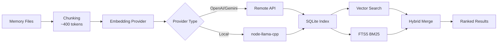

# Vollständiger Leitfaden für Speichersystem und Vektorsuche

## Was Sie erreichen können

Nach dieser Lektion werden Sie in der Lage sein:

- Die Dateistruktur und den Indizierungsmechanismus des Speichersystems von Clawdbot zu verstehen
- Vektorsuchanbieter zu konfigurieren (OpenAI, Gemini, lokal)
- Hybridsuche (BM25 + Vektor) zur Verbesserung der Abrufgenauigkeit zu nutzen
- Speicherindizes und Suchvorgänge über CLI zu verwalten
- Embedding-Cache und Indizierungsleistung anzupassen

## Ihr aktuelles Dilemma

Vielleicht befinden Sie sich in diesen Situationen:

- Die KI "vergisst" den Inhalt früherer Unterhaltungen in neuen Sitzungen
- Sie möchten, dass die KI sich an persistentes Wissen und Vorlieben erinnert
- Sie wissen nicht, wie die KI "lernen" und wichtige Informationen merken soll
- Beim Durchsuchen historischer Unterhaltungen finden Sie keinen relevanten Kontext

## Wann Sie diese Technik verwenden

Das **Speichersystem** ist für diese Szenarien geeignet:

| Szenario | Beispiel | Speicherort |
|------|--------|----------|
| Persistentes Wissen | "Ich bin Vegetarier, denk daran" | MEMORY.md |
| Tägliches Journaling | "Fortschritt der heutigen Arbeit und Aufgaben" | memory/YYYY-MM-DD.md |
| Sitzungsrückgewinnung | "Was war der API-Endpunkt, über den wir das letzte Mal gesprochen haben?" | Vektorindex |
| Konfigurationsinformationen | "Gateway läuft auf Port 18789" | MEMORY.md |

---

## Kernkonzepte

### Zweischichtige Struktur des Speichersystems

Clawdbot verwendet **zwei Datenschichten** zur Verwaltung des Langzeitgedächtnisses:

| Ebene | Dateipfad | Zweck | Ladezeitpunkt |
|------|----------|------|----------|
| **Langzeitgedächtnis** | `MEMORY.md` | Ausgewähltes Wissen, Vorlieben, wichtige Fakten | Wird beim Starten der Hauptsitzung geladen |
| **Tägliches Protokoll** | `memory/YYYY-MM-DD.md` | Tägliches Journaling, Ausführungskontext | Heutige + gestrige werden geladen |

::: info Warum zwei Ebenen?
`MEMORY.md` ist ähnlich einer "Wissensbasis" und wird nur in die Hauptsitzung geladen, um sicherzustellen, dass sensible Informationen nicht in Gruppenunterhaltungen durchsickern. `memory/*.md` ist ein "Tagebuch", das tägliche Abläufe aufzeichnet, um die spätere Rückschau zu erleichtern.
:::

### Arbeitsablauf der Vektorindizierung



### Hybridsuche: BM25 + Vektor

Die Vektorsuche ist gut in "semantischer Übereinstimmung", aber schwach in "exakter Übereinstimmung":

| Abfragetyp | Vektorsuche | BM25 Volltext | Hybridsuche |
|----------|----------|-----------|----------|
| "Server-IP-Adresse" | ❌ Schwach | ✅ Stark | ✅ Optimal |
| "Wie man Gateway bereitstellt" | ✅ Stark | ⚠️ Mittel | ✅ Optimal |
| "API-Endpunkt a828e60" | ❌ Schwach | ✅ Stark | ✅ Optimal |

**Fusionsformel**:
```javascript
finalScore = vectorWeight × vectorScore + textWeight × textScore
```

- `vectorWeight + textWeight` wird automatisch auf 1,0 normalisiert
- Standard: 70% Vektor + 30% Schlüsselwörter
- Über `agents.defaults.memorySearch.query.hybrid.*` anpassbar

---

## 🎒 Vorbereitung vor dem Start

Stellen Sie vor dem Beginn sicher:

::: warning Vorprüfung
- [ ] Gateway läuft ( [Gateway starten](../../start/gateway-startup/) )
- [ ] KI-Modell ist konfiguriert ( [KI-Modellkonfiguration](../models-auth/) )
- [ ] Sie können grundlegende Markdown-Dateien bearbeiten
:::

::: tip Empfohlene Konfiguration
- Verwenden Sie vorzugsweise OpenAI- oder Gemini-Embeddings (schnell und hochwertig)
- Lokale Embeddings benötigen `pnpm rebuild node-llama-cpp`
- Die erste Indizierung kann einige Minuten dauern, danach sind inkrementelle Updates schnell
:::

---

## Folgen Sie den Schritten

### Schritt 1: Speicherdateien erstellen

**Warum**: Die KI indiziert nur vorhandene Dateien, erstellen Sie zuerst den Speicherinhalt

Erstellen Sie Dateien im Arbeitsverzeichnis des Agents (Standard `~/clawd`):

```bash
# Langzeitgedächtnisdatei erstellen
cat > ~/clawd/MEMORY.md << 'EOF'
# Persönliche Vorlieben

- Ernährungsvorlieben: Vegetarier, kein scharfes Essen
- Arbeitszeit: 9 bis 18 Uhr
- Häufige Befehle: `clawdbot gateway status`

# Wichtige Konfiguration

- Gateway-Port: 18789
- Datenbank: PostgreSQL 15
EOF

# Heutiges Protokoll erstellen
cat > ~/clawd/memory/$(date +%Y-%m-%d).md << 'EOF'
# Fortschritt der heutigen Arbeit

- Gateway-Konfiguration abgeschlossen
- Speichersystem gelernt
- Aufgaben: Modellauthentifizierungsdokumentation lesen
EOF
```

**Was Sie sehen sollten**:

```bash
# Dateistruktur anzeigen
tree ~/clawd/
# oder
ls -la ~/clawd/
ls -la ~/clawd/memory/

# Beispielausgabe
~/clawd/
├── MEMORY.md
└── memory/
    └── 2026-01-27.md
```

### Schritt 2: Status des Speichersystems prüfen

**Warum**: Embedding-Anbieter und Indexstatus bestätigen

```bash
# Grundlegende Statusprüfung
clawdbot memory status

# Tiefenprüfung (Anbieter-Verfügbarkeit erkennen)
clawdbot memory status --deep

# Tiefenprüfung + erzwungene Neuindizierung
clawdbot memory status --deep --index
```

**Was Sie sehen sollten**:

```bash
✓ Memory Search enabled
  Store: ~/.clawdbot/memory/main.sqlite
  Provider: openai
  Model: text-embedding-3-small
  Fallback: openai
  Hybrid: enabled (vectorWeight: 0.7, textWeight: 0.3)
  Cache: enabled (maxEntries: 50000)
  Sources: memory
  Indexed: 2 files, 5 chunks
```

::: tip Tiefenprüfung
- `--deep` erkennt, ob OpenAI/Gemini/Local-Embeddings verfügbar sind
- `--index` indiziert automatisch neu, wenn ein "schmutziger" Index erkannt wird
- Bei der ersten Ausführung kann die Indizierung einige Minuten dauern
:::

### Schritt 3: Indizierung manuell auslösen

**Warum**: Sicherstellen, dass neu erstellte Speicherdateien indiziert werden

```bash
# Indizierung manuell auslösen
clawdbot memory index

# Mit detailliertem Protokoll
clawdbot memory index --verbose

# Nur für einen bestimmten Agenten
clawdbot memory index --agent main
```

**Was Sie sehen sollten**:

```bash
Indexing memory for agent: main
  Provider: openai (text-embedding-3-small)
  Sources: memory
  - MEMORY.md (2 chunks)
  - memory/2026-01-27.md (3 chunks)
✓ Indexed 2 files, 5 chunks
```

### Schritt 4: Semantische Suche testen

**Warum**: Überprüfen, ob Vektorsuche und Hybridsuche korrekt funktionieren

```bash
# Grundlegende Suche
clawdbot memory search "Vegetarier"

# Exakte Übereinstimmungssuche (BM25 testen)
clawdbot memory search "Gateway-Port"

# Unklare semantische Suche (Vektor testen)
clawdbot memory search "was ich gerne esse"

# Detaillierte Ergebnisse anzeigen
clawdbot memory search "Gateway" --verbose
```

**Was Sie sehen sollten**:

```bash
Searching memory for: "Vegetarier"

Results (2):

[1] MEMORY.md:3-5 (score: 0.842)
  - Ernährungsvorlieben: Vegetarier, kein scharfes Essen

[2] memory/2026-01-27.md:1-3 (score: 0.615)
  - Gateway-Konfiguration abgeschlossen
  - Speichersystem gelernt
```

### Schritt 5: Embedding-Anbieter konfigurieren

**Warum**: Den am besten geeigneten Anbieter nach Bedarf auswählen (entfernt vs lokal)

#### Option A: OpenAI embeddings (empfohlen)

Bearbeiten Sie die Konfigurationsdatei `~/.clawdbot/clawdbot.json`:

```json
{
  "agents": {
    "defaults": {
      "memorySearch": {
        "enabled": true,
        "provider": "openai",
        "model": "text-embedding-3-small",
        "fallback": "openai",
        "remote": {
          "apiKey": "YOUR_OPENAI_API_KEY",
          "batch": {
            "enabled": true,
            "concurrency": 2
          }
        }
      }
    }
  }
}
```

**Vorteile**:
- Schnell und hochwertig
- Unterstützt Batch-Indizierung (kostengünstig)
- Geeignet für massives Backfill

#### Option B: Gemini embeddings

```json
{
  "agents": {
    "defaults": {
      "memorySearch": {
        "provider": "gemini",
        "model": "gemini-embedding-001",
        "remote": {
          "apiKey": "YOUR_GEMINI_API_KEY"
        },
        "fallback": "openai"
      }
    }
  }
}
```

#### Option C: Lokale Embeddings (Datenschutzpriorität)

```json
{
  "agents": {
    "defaults": {
      "memorySearch": {
        "provider": "local",
        "local": {
          "modelPath": "hf:ggml-org/embeddinggemma-300M-GGUF/embeddinggemma-300M-Q8_0.gguf",
          "modelCacheDir": "~/.cache/embeddings"
        },
        "fallback": "none"
      }
    }
  }
}
```

**Vorsichtsmaßnahmen**:

```bash
# Erste Verwendung lokaler Embeddings erfordert Build
pnpm approve-builds
# node-llama-cpp auswählen
pnpm rebuild node-llama-cpp
```

**Was Sie sehen sollten**:

```bash
✓ node-llama-cpp installed
✓ Local embedding model ready
```

::: warning Lokale Embeddings
- Beim ersten Mal wird das Modell automatisch heruntergeladen (~600MB)
- Erfordert Kompilierung von node-llama-cpp (hängt von der Systemumgebung ab)
- Langsamer als entfernt, aber komplett offline und Datenschutzpriorität
:::

### Schritt 6: Hybrid-Suchgewichte konfigurieren

**Warum**: Verhältnis von semantischen und Schlüsselwortgewichten nach Anwendungsfall anpassen

Konfiguration bearbeiten:

```json
{
  "agents": {
    "defaults": {
      "memorySearch": {
        "query": {
          "hybrid": {
            "enabled": true,
            "vectorWeight": 0.7,
            "textWeight": 0.3,
            "candidateMultiplier": 4
          }
        }
      }
    }
  }
}
```

**Parameterbeschreibung**:

| Parameter | Standardwert | Beschreibung | Anpassungsvorschlag |
|------|---------|------|----------|
| `vectorWeight` | 0,7 | Semantische Suchgewichtung | Auf 0,8 erhöhen für "natürliche Sprache"-Abfragen |
| `textWeight` | 0,3 | Schlüsselwort-Suchgewichtung | Auf 0,5 erhöhen für "Code/ID"-Abfragen |
| `candidateMultiplier` | 4 | Kandidaten-Multiplikator | Auf 6 erhöhen zur Verbesserung des Recalls |

**Effektvergleich**:

```bash
# Semantische Abfrage testen
clawdbot memory search "Methode zum Bereitstellen von Gateway"
# vectorWeight: 0,7 → findet semantisch relevante Ergebnisse
# textWeight: 0,5 → findet Schlüsselwörter "bereitstellen", "Gateway"

# Exakte Abfrage testen
clawdbot memory search "API-Endpunkt a828e60"
# vectorWeight: 0,3 → ignoriert Semantik, priorisiert Übereinstimmung
# textWeight: 0,7 → exakte Übereinstimmung von "a828e60"
```

### Schritt 7: SQLite-vec-Beschleunigung aktivieren

**Warum**: Vektorabfragen an SQLite pushdown, um Laden aller Embeddings zu vermeiden

Konfiguration bearbeiten:

```json
{
  "agents": {
    "defaults": {
      "memorySearch": {
        "store": {
          "vector": {
            "enabled": true,
            "extensionPath": "/path/to/sqlite-vec"
          }
        }
      }
    }
  }
}
```

**Prüfen, ob sqlite-vec verfügbar ist**:

```bash
# Indexstatus anzeigen
clawdbot memory status --deep

# Wenn verfügbar, sehen Sie
✓ SQLite-vec extension loaded
  Vector table: chunks_vec
```

::: info SQLite-vec
- Versucht standardmäßig automatisch zu laden
- Bei Ladefehler automatisch auf JS-Berechnung zurückfallen (beeinflusst nicht die Funktionalität)
- Benutzerdefinierter Pfad wird nur für spezielle Builds oder nicht-standardmäßige Installationen verwendet
:::

---

## Checkpoint ✅

Nach Abschluss der obigen Schritte überprüfen Sie Folgendes:

| Prüfpunkt | Überprüfungsmethode | Erwartetes Ergebnis |
|---------|----------|----------|
| Speicherdateien vorhanden | `ls ~/clawd/` | MEMORY.md und Verzeichnis memory/ vorhanden |
| Index erstellt | `clawdbot memory status` | Zeigt Indexed > 0 chunks |
| Suche funktioniert | `clawdbot memory search "..."` | Gibt relevante Ergebnisse zurück |
| Provider funktioniert | `clawdbot memory status --deep` | Zeigt Provider-Typ |

---

## Häufige Probleme

### Problem 1: Embedding-Anbieter-Fehler

**Symptom**:

```bash
✗ Memory Search disabled
  Error: No API key found for provider
```

**Lösung**:

```bash
# Konfiguration prüfen
cat ~/.clawdbot/clawdbot.json | grep -A 5 "memorySearch"

# Bestätigen, dass apiKey existiert
# Oder Umgebungsvariablen setzen
export OPENAI_API_KEY="sk-..."
export GEMINI_API_KEY="..."
```

### Problem 2: Lokale Embeddings können nicht geladen werden

**Symptom**:

```bash
✗ Local embedding provider failed
  Error: Cannot find module 'node-llama-cpp'
```

**Lösung**:

```bash
# Build genehmigen
pnpm approve-builds

# Neu bauen
pnpm rebuild node-llama-cpp
```

### Problem 3: Index wird nicht aktualisiert

**Symptom**:

```bash
# MEMORY.md wurde geändert
# Aber Suchergebnisse sind noch alt
```

**Lösung**:

```bash
# Methode 1: Indizierung manuell auslösen
clawdbot memory index

# Methode 2: Gateway neu starten (löst onSessionStart-Indizierung aus)
clawdbot gateway restart

# Methode 3: Dateiüberwachung prüfen
clawdbot memory status --verbose
# "Watch: true" prüfen
```

### Problem 4: Suchergebnisse irrelevant

**Symptom**: Nach "Gateway" suchen, aber "Arbeitsfortschritt" zurückbekommen

**Mögliche Ursachen**:

1. **Unangemessene Hybridgewichte**:
   - Semantische Abfrage ("wie bereitstellen") → `vectorWeight` erhöhen
   - Schlüsselwort-Abfrage ("API-Endpunkt") → `textWeight` erhöhen

2. **Index nicht vollständig aktualisiert**:
   ```bash
   # Erzwungene Neuindizierung
   rm ~/.clawdbot/memory/main.sqlite
   clawdbot memory index
   ```

3. **Granularitätsproblem von Chunks**:
   - Standard 400 Tokens, kann Kontext abschneiden
   - `agents.defaults.memorySearch.chunking.tokens` anpassen

---

## Zusammenfassung der Lektion

In dieser Lektion haben wir gelernt:

1. **Architektur des Speichersystems**
   - Zweischichtige Datenstruktur (MEMORY.md + memory/*.md)
   - Vektorindex + FTS5-Volltextsuche
   - Hybrid-Rückgewinnung (BM25 + Vektor)

2. **Konfiguration des Embedding-Anbieters**
   - Drei Optionen: OpenAI/Gemini/lokal
   - Batch-Indizierungsbeschleunigung
   - Fallback-Mechanismus

3. **Verwendung von CLI-Tools**
   - `clawdbot memory status` Status prüfen
   - `clawdbot memory index` Indizierung auslösen
   - `clawdbot memory search` Suche testen

4. **Leistungsoptimierung**
   - SQLite-vec-Vektorbeschleunigung
   - Embedding-Cache
   - Hybrid-Gewichtsoptimierung

---

## Nächste Lektion

> In der nächsten Lektion lernen wir über **[Sicherheit und Sandbox-Isolierung](../security-sandbox/)**.
>
> Sie werden lernen:
> - Werkzeugberechtigungssteuerung und Allowlist
> - Sandbox-Sitzungsisolierung
> - Exec-Genehmigungsmechanismus
> - Docker-basierte Bereitstellung
> - Tailscale-Authentifizierung

---

## Anhang: Quellcode-Referenz

<details>
<summary><strong>Klicken, um Quellcodeposition anzuzeigen</strong></summary>

> Aktualisiert: 2026-01-27

| Funktion | Dateipfad | Zeilennummer |
|------|----------|------|
| Speicher-Manager | [`src/memory/manager.ts`](https://github.com/clawdbot/clawdbot/blob/main/src/memory/manager.ts) | 1-200 |
| Hybridsuche | [`src/memory/hybrid.ts`](https://github.com/clawdbot/clawdbot/blob/main/src/memory/hybrid.ts) | 1-112 |
| Embedding-Anbieter | [`src/memory/embeddings.ts`](https://github.com/clawdbot/clawdbot/blob/main/src/memory/embeddings.ts) | 1-80 |
| OpenAI embeddings | [`src/memory/embeddings-openai.ts`](https://github.com/clawdbot/clawdbot/blob/main/src/memory/embeddings-openai.ts) | Ganze Datei |
| Gemini embeddings | [`src/memory/embeddings-gemini.ts`](https://github.com/clawdbot/clawdbot/blob/main/src/memory/embeddings-gemini.ts) | Ganze Datei |
| Lokale Embeddings | [`src/memory/node-llama.ts`](https://github.com/clawdbot/clawdbot/blob/main/src/memory/node-llama.ts) | Ganze Datei |
| SQLite-vec | [`src/memory/sqlite-vec.ts`](https://github.com/clawdbot/clawdbot/blob/main/src/memory/sqlite-vec.ts) | Ganze Datei |
| Batch-Indizierung (OpenAI) | [`src/memory/batch-openai.ts`](https://github.com/clawdbot/clawdbot/blob/main/src/memory/batch-openai.ts) | Ganze Datei |
| Batch-Indizierung (Gemini) | [`src/memory/batch-gemini.ts`](https://github.com/clawdbot/clawdbot/blob/main/src/memory/batch-gemini.ts) | Ganze Datei |
| Such-Manager | [`src/memory/manager-search.ts`](https://github.com/clawdbot/clawdbot/blob/main/src/memory/manager-search.ts) | Ganze Datei |
| Memory Schema | [`src/memory/memory-schema.ts`](https://github.com/clawdbot/clawdbot/blob/main/src/memory/memory-schema.ts) | Ganze Datei |

**Wichtige Konfigurationen**:
- `agents.defaults.memorySearch.enabled`: Speichersuche aktivieren/deaktivieren
- `agents.defaults.memorySearch.provider`: Embedding-Anbieter ("openai", "gemini", "local")
- `agents.defaults.memorySearch.query.hybrid.vectorWeight`: Vektorsuchgewichtung (Standard 0,7)
- `agents.defaults.memorySearch.query.hybrid.textWeight`: BM25-Suchgewichtung (Standard 0,3)
- `agents.defaults.memorySearch.cache.enabled`: Embedding-Cache (Standard true)
- `agents.defaults.memorySearch.store.vector.enabled`: SQLite-vec-Beschleunigung (Standard true)

**Wichtige Funktionen**:
- `mergeHybridResults()`: Vektor- + BM25-Ergebnisse zusammenführen (`src/memory/hybrid.ts:39-111`)
- `bm25RankToScore()`: BM25-Rang in Punktzahl umwandeln (`src/memory/hybrid.ts:34-37`)
- `createEmbeddingProvider()`: Embedding-Anbieter erstellen (`src/memory/embeddings.ts`)
- `getMemorySearchManager()`: Speichersuch-Manager abrufen (`src/memory/search-manager.ts`)

**CLI-Befehle**:
- `clawdbot memory status`: Status prüfen (`src/cli/commands/memory-cli.ts`)
- `clawdbot memory index`: Indizierung auslösen (`src/cli/commands/memory-cli.ts`)
- `clawdbot memory search`: Speicher durchsuchen (`src/cli/commands/memory-cli.ts`)

</details>
