# Sicherheit und Sandbox-Isolierung: Schützen Sie Ihren KI-Assistenten

## Was Sie nach diesem Tutorial können

- Konfigurieren Sie mehrschichtige Sicherheitsrichtlinien von der Zugriffskontrolle bis zur Werkzeugberechtigung
- Verwenden Sie die Sandbox-Isolierung, um den Dateisystem- und Netzwerkzugriff des KI-Assistenten zu beschränken
- Führen Sie Sicherheitsaudits durch, um häufige Sicherheitslücken zu entdecken und zu beheben
- Passen Sie die Sicherheitsstufe je nach Szenario an (persönlich/Familie/öffentlich)

## Ihr aktuelles Dilemma

Clawdbot macht Ihren KI-Assistenten leistungsstark, bringt aber auch neue Sicherheitsrisiken mit sich:

- **Shell-Zugriff**: Der KI kann beliebige Befehle ausführen und Dateien lesen/schreiben
- **Netzwerkzugriff**: Der KI kann auf beliebige URLs und Dienste zugreifen
- **Nachrichtenversand**: Der KI kann an jeden Nachrichten senden (z. B. wenn WhatsApp konfiguriert ist)
- **Fernsteuerung**: Steuerung des lokalen Browsers über Browser-Tools
- **Datenexposition**: Der gesamte Gesprächsverlauf wird auf der Festplatte gespeichert

Ohne angemessenen Schutz könnte ein manipuliertes KI-Modell katastrophale Folgen haben.

## Wann sollten Sie dies verwenden

- ✅ Sie müssen einen KI-Assistenten auf Ihrem eigenen Gerät ausführen und sind besorgt über Sicherheitsrisiken
- ✅ Sie möchten den KI-Assistenten mehreren Benutzern zur Verfügung stellen (Familienmitglieder, Team)
- ✅ Sie müssen den KI-Zugriff auf bestimmte Dateien oder Verzeichnisse beschränken
- ✅ Sie möchten den Zugriffsbereich für verschiedene Benutzer/Sitzungen isolieren
- ✅ Sie müssen den KI-Assistenten in einer eingeschränkten Umgebung (Sandbox) ausführen

::: info
**Wichtiges Konzept**: Sicherheit ist geschichtet – von "wer kann zugreifen" über "was darf er tun" bis hin zur "Modellsicherheit".
::

## 🎒 Vorbereitungen

### Voraussetzungen prüfen

- [x] [Schnellstart](../../start/getting-started/) abgeschlossen, verstehen, wie Sie den Gateway starten
- [ ] Mindestens ein KI-Modell konfiguriert (Anthropic, OpenAI oder Ollama)
- [ ] Ihr Verwendungsszenario verstehen (persönliche Nutzung, Familienfreigabe, öffentlicher Dienst)
- [ ] Konzepte der Linux-Dateiberechtigungen verstehen (chmod)

### Empfohlene Tools

- Befehlszeilentools: Terminal oder SSH
- Editor: Ihr bevorzugter Code-Editor
- Docker: Zum Ausführen von Sandbox-Containern (optional)

---

## Kernkonzept

Das Sicherheitsmodell von Clawdbot basiert auf einer Kernphilosophie: **Zugriffskontrolle priorisieren, Sicherheit nachträglich einschränken**.

### Sicherheitsschichtung

```mermaid
graph TB
    A[Zugriffskontrolle] --> B[Berechtigungssteuerung]
    B --> C[Werkzeugeinschränkung]
    C --> D[Sandbox-Isolierung]
    D --> E[Audit und Behebung]
```



1. **Zugriffskontrolle**: Bestimmt, wer mit Ihrem KI-Assistenten sprechen darf
2. **Berechtigungssteuerung**: Bestimmt, welche Werkzeuge der KI-Assistent aufrufen darf
3. **Sandbox-Isolierung**: Bestimmt, in welcher Umgebung die Werkzeuge ausgeführt werden (Host oder Container)
4. **Audit und Behebung**: Kontinuierliche Überprüfung und Korrektur der Sicherheitskonfiguration

Diese geschichtete Architektur stellt sicher, dass selbst bei einer Manipulation des Modells der Angriffsumfang auf definierte Grenzen beschränkt bleibt.

### Drei Schutzschichten der Zugriffskontrolle

Clawdbot bietet drei Schichten der Zugriffskontrolle:

| Schicht | Geschützter Inhalt | Konfigurationsort |
| ----- | ----- | ----- |
| **Gateway-Authentifizierung** | WebSocket-Verbindungen | `gateway.auth` |
| **DM-Richtlinie** | Direktnachrichten | `channels.*.dmPolicy` |
| **Gruppenrichtlinie** | Gruppennachrichten | `channels.*.groupPolicy` / `channels.*.groups` |

Jede Schicht kann unabhängig konfiguriert werden, um eine tiefgreifende Verteidigung zu bilden.

---

## Sicherheitsaudit: Risiken entdecken

Clawdbot bietet integrierte Sicherheitsaudit-Tools, die häufige Sicherheitslücken schnell aufdecken können.

### Audit ausführen

```bash
# Basis-Audit
clawdbot security audit

# Tiefes Audit (einschließlich Gateway-Erkennung)
clawdbot security audit --deep

# Automatische Behebung von Sicherheitsempfehlungen
clawdbot security audit --fix
```

### Vom Audit geprüfte Inhalte

Das Audit-Tool prüft folgende Aspekte:

| Prüfkategorie | Spezifische Elemente | Risikostufe |
| --------- | ----- | ----- |
| **Eingehender Zugriff** | Gateway-Authentifizierung, DM-Richtlinie, Gruppenrichtlinie | Kritisch / Warnung |
| **Werkzeugzugriff** | Erlaubte Liste für erhöhte exec, Werkzeug allow/deny | Kritisch / Warnung |
| **Netzwerkexposition** | Gateway-Bindungsmodus, Tailscale Serve/Funnel | Kritisch / Info |
| **Browsersteuerung** | Authentifizierung für Remote-Browsersteuerung, URL-Protokoll | Kritisch / Warnung |
| **Dateiberechtigungen** | Konfigurationsdateiberechtigungen, Statusverzeichnisberechtigungen | Kritisch / Warnung |
| **Plugin-Vertrauen** | Nicht explizit zugelassene Plugins | Warnung |

### Audit-Ausgabe verstehen

Der Audit-Bericht wird nach Schweregrad klassifiziert:

- **Critical (Rot)**: Sofort beheben, kann zu Remote-Code-Ausführung oder Datenlecks führen
- **Warn (Gelb)**: Empfohlene Behebung, senkt die Sicherheitsgrenze
- **Info (Blau)**: Informationshinweis, kein Sicherheitsproblem

### Automatische Behebung

Bei Verwendung des Flags `--fix` wendet das Audit-Tool folgende Korrekturen sicher an:

- Ändert `groupPolicy="open"` in `allowlist`
- Ändert `logging.redactSensitive="off"` in `"tools"`
- Behebt Dateiberechtigungen (Konfigurationsdatei 600, Verzeichnis 700)

::: tip
**Best Practice**: Führen Sie Audits regelmäßig durch, insbesondere nach Änderungen an der Konfiguration oder Gateway-Updates.
::

---

## Zugriffskontrolle: Wer kann auf Ihren KI-Assistenten zugreifen

Die Zugriffskontrolle ist die erste Verteidigungslinie und bestimmt, wer mit Ihrem KI-Assistenten interagieren darf.

### Gateway-Authentifizierung

Standardmäßig erfordert der Gateway eine Authentifizierung, um WebSocket-Verbindungen anzunehmen.

#### Authentifizierungsmethode konfigurieren

```json5
{
  "gateway": {
    "auth": {
      "mode": "token",  // oder "password"
      "token": "your-long-random-token-please-change-me"
    }
  }
}
```

**Authentifizierungsmodi**:

| Modus | Zweck | Empfohlenes Szenario |
| ----- | ----- | ----- |
| `token` | Gemeinsam genutzter Bearer-Token | Die meisten Situationen, empfohlen |
| `password` | Passwort-Authentifizierung | Lokale Entwicklung, für schnelles Testen bequem |
| Tailscale Identity | Tailscale Serve | Remote-Zugriff über Tailscale |

::: warning
**Wichtig**: Wenn `gateway.bind` auf nicht-loopback (z. B. `lan`, `tailnet`) eingestellt ist, muss eine Authentifizierung konfiguriert werden, andernfalls werden Verbindungen abgelehnt.
::

### DM-Richtlinie: Schutz für Direktnachrichten

Die DM-Richtlinie steuert, ob unbekannte Benutzer direkt mit Ihrem KI-Assistenten sprechen können.

| Richtlinie | Verhalten | Empfohlenes Szenario |
| ----- | ----- | ----- |
| `pairing` (Standard) | Unbekannte Absender erhalten einen Pairing-Code, keine Verarbeitung vor dem Pairing | Persönliche Nutzung, empfohlen |
| `allowlist` | Unbekannte Absender werden abgelehnt | Umgebung mit mehreren vertrauenswürdigen Benutzern |
| `open` | Jede Person ist erlaubt | Öffentliche Dienste (erfordert, dass `allowFrom` `"*"` enthält) |
| `disabled` | Alle Direktnachrichten ignorieren | Nur Gruppenfunktionen verwenden |

#### Konfigurationsbeispiel

```json5
{
  "channels": {
    "whatsapp": {
      "dmPolicy": "pairing"
    },
    "telegram": {
      "dmPolicy": "allowlist",
      "allowFrom": ["user123", "user456"]
    }
  }
}
```

#### Pairing verwalten

```bash
# Ausstehende Pairing-Anfragen anzeigen
clawdbot pairing list whatsapp

# Pairing genehmigen
clawdbot pairing approve whatsapp <pairing-code>
```

::: tip
**Best Practice**: Der Standardmodus `pairing` bietet eine gute Balance zwischen Benutzerfreundlichkeit und Sicherheit. Verwenden Sie `allowlist` oder `open` nur, wenn Sie allen Benutzern explizit vertrauen.
::

### Gruppenrichtlinie: Kontrolle von Gruppennachrichten

Die Gruppenrichtlinie bestimmt, wie der KI-Assistent in Gruppen auf Nachrichten antwortet.

| Richtlinie | Verhalten | Konfigurationsort |
| ----- | ----- | ----- |
| `allowlist` | Nur Gruppen aus der Whitelist akzeptieren | `channels.whatsapp.groups` |
| `disabled` | Alle Gruppennachrichten ignorieren | `channels.telegram.groups` |
| `requireMention` | Nur antworten, wenn @ erwähnt oder durch Befehl ausgelöst | `channels.*.groups.*` |

#### Konfigurationsbeispiel

```json5
{
  "channels": {
    "whatsapp": {
      "groups": {
        "*": {
          "requireMention": true
        }
      }
    },
    "discord": {
      "guilds": {
        "your-guild-id": {
          "users": ["user1", "user2"]
        }
      }
    }
  }
}
```

::: tip
**Best Practice**: Aktivieren Sie `requireMention` in öffentlichen Gruppen, um zu verhindern, dass der KI-Assistent von bösartigen Benutzern manipuliert wird.
::

### Sitzungsisolierung: Verhinderung von Kontextlecks

Standardmäßig werden alle Direktnachrichten an dieselbe Hauptsitzung weitergeleitet. Wenn mehrere Benutzer auf den KI-Assistenten zugreifen können, kann dies zu Kontextlecks führen.

```json5
{
  "session": {
    "dmScope": "per-channel-peer"  // Erstellt separate Sitzungen für jeden Kanal-Absender
  }
}
```

---

## Werkzeugberechtigungssteuerung: Einschränkung der KI-Funktionalität

Die Werkzeugberechtigungssteuerung ist die zweite Verteidigungslinie und bestimmt, welche Werkzeuge der KI-Assistent aufrufen darf.

### Werkzeug Allow/Deny-Listen

Sie können Whitelists und Blacklists für Werkzeuge global oder pro Agent konfigurieren.

```json5
{
  "agents": {
    "defaults": {
      "tools": {
        "allow": ["read", "write", "web_search"],
        "deny": ["exec", "browser", "web_fetch"]
      }
    },
    "list": [
      {
        "id": "read-only",
        "tools": {
          "allow": ["read"],
          "deny": ["write", "edit", "apply_patch", "exec", "browser"]
        }
      }
    ]
  }
}
```

### Häufig verwendete Werkzeugkategorien

| Werkzeugkategorie | Spezifische Werkzeuge | Risikostufe |
| --------- | ----- | ----- |
| **Dateioperationen** | `read`, `write`, `edit`, `apply_patch` | Mittel |
| **Shell-Ausführung** | `exec`, `process` | Hoch |
| **Browsersteuerung** | `browser` | Hoch |
| **Netzwerkzugriff** | `web_search`, `web_fetch` | Mittel |
| **Canvas-Visualisierung** | `canvas` | Mittel |
| **Knotenoperationen** | `nodes_invoke` | Hoch |
| **Cron-Geplante Aufgaben** | `cron` | Mittel |
| **Nachrichtenversand** | `message`, `sessions_*` | Niedrig |

### Erhöhter Modus: Ausweg für Host-Ausführung

Elevated exec ist ein spezieller Ausweg, der es Werkzeugen ermöglicht, auf dem Host auszuführen und die Sandbox zu umgehen.

```json5
{
  "tools": {
    "elevated": {
      "enabled": true,
      "allowFrom": {
        "whatsapp": ["your-trusted-user-id"]
      },
      "security": "allowlist",
      "ask": "on"  // Vor jeder Ausführung nach Bestätigung fragen
    }
  }
}
```

::: danger
**Wichtige Warnung**: Elevated exec umgeht Sandbox-Einschränkungen. Aktivieren Sie dies nur, wenn Sie den zugelassenen Benutzern und Szenarien vollständig vertrauen.
::

::: tip
**Best Practice**: Für die meisten Szenarien deaktivieren Sie elevated exec und verlassen sich auf Sandbox-Isolierung und strikte Werkzeug-Whitelists.
::

---

## Sandbox-Isolierung: Ausführung in eingeschränkter Umgebung

Die Sandbox-Isolierung lässt Werkzeuge in Docker-Containern ausführen und schränkt den Dateisystem- und Netzwerkzugriff ein.

### Sandbox-Modi

| Modus | Verhalten | Empfohlenes Szenario |
| ----- | ----- | ----- |
| `off` | Alle Werkzeuge auf dem Host ausführen | Persönliche vertrauenswürdige Umgebung |
| `non-main` (empfohlen) | Hauptsitzung auf dem Host, andere Sitzungen in der Sandbox | Balance zwischen Leistung und Sicherheit |
| `all` | Alle Sitzungen in der Sandbox | Umgebung mit mehreren Benutzern, öffentliche Dienste |

```json5
{
  "agents": {
    "defaults": {
      "sandbox": {
        "mode": "non-main"
      }
    }
  }
}
```

### Arbeitsplatzzugriff

Der Arbeitsplatzzugriff bestimmt, welche Verzeichnisse des Hosts die Sandbox-Container sehen können.

| Zugriffsstufe | Verhalten | Empfohlenes Szenario |
| --------- | ----- | ----- |
| `none` (Standard) | Sandbox-Arbeitsplatz `~/.clawdbot/sandboxes` | Maximale Isolierung |
| `ro` | Agent-Arbeitsplatz schreibgeschützt unter `/agent` eingehängt | Dateien lesen, aber nicht schreiben |
| `rw` | Agent-Arbeitsplatz lese-schreibbar unter `/workspace` eingehängt | Agenten, die Dateien schreiben müssen |

```json5
{
  "agents": {
    "defaults": {
      "sandbox": {
        "workspaceAccess": "none"
      }
    }
  }
}
```

### Sandbox-Umfang

Der Sandbox-Umfang bestimmt die Granularität der Container-Isolierung.

| Umfang | Verhalten | Anzahl der Container |
| ----- | ----- | ----- |
| `session` (Standard) | Ein Container pro Sitzung | Mehrere Container, bessere Isolierung |
| `agent` | Ein Container pro Agent | Balance zwischen Isolierung und Ressourcen |
| `shared` | Alle Sitzungen teilen einen Container | Ressourcenschonend, geringste Isolierung |

### Docker-Konfiguration

```json5
{
  "agents": {
    "defaults": {
      "sandbox": {
        "docker": {
          "image": "clawdbot-sandbox:bookworm-slim",
          "containerPrefix": "clawdbot-sbx-"
        }
      }
    }
}
}
```

### Benutzerdefinierte Mounts

Sie können zusätzliche Verzeichnisse des Hosts in den Sandbox-Container einbinden.

```json5
{
  "agents": {
    "defaults": {
      "sandbox": {
        "docker": {
          "binds": [
            "/home/user/source:/source:ro",
            "/var/run/docker.sock:/var/run/docker.sock"
          ]
        }
      }
    }
  }
}
```

::: warning
**Sicherheitshinweis**: Mounts umgehen die Sandbox-Dateisystem-Isolierung. Sensible Mounts (z. B. docker.sock) sollten im Modus `:ro` (schreibgeschützt) verwendet werden.
::

### Sandbox-Browser

Der Sandbox-Browser führt Chrome-Instanzen in einem Container aus und isoliert Browseroperationen.

```json5
{
  "agents": {
    "defaults": {
      "sandbox": {
        "browser": {
          "enabled": true,
          "autoStart": true,
          "autoStartTimeoutMs": 10000
        }
      }
    }
  }
}
```

::: tip
**Best Practice**: Der Sandbox-Browser kann verhindern, dass der KI-Assistent auf die Anmeldesitzungen und sensiblen Daten Ihres alltäglichen Browsers zugreift.
::

---

## Multi-Agent-Sicherheitskonfiguration

Verschiedene Agents können unterschiedliche Sicherheitskonfigurationen haben.

### Szenario-Beispiele

#### Szenario 1: Persönlicher Agent (voll vertrauenswürdig)

```json5
{
  "agents": {
    "list": [
      {
        "id": "personal",
        "sandbox": { "mode": "off" },
        "tools": {
          "allow": ["*"],
          "deny": []
        }
      }
    ]
  }
}
```

#### Szenario 2: Familien-Agent (schreibgeschützt)

```json5
{
  "agents": {
    "list": [
      {
        "id": "family",
        "workspace": "~/clawd-family",
        "sandbox": {
          "mode": "all",
          "scope": "agent",
          "workspaceAccess": "ro"
        },
        "tools": {
          "allow": ["read"],
          "deny": ["write", "edit", "apply_patch", "exec", "browser"]
        }
      }
    ]
  }
}
```

#### Szenario 3: Öffentlicher Agent (Sandbox + strikte Einschränkungen)

```json5
{
  "agents": {
    "list": [
      {
        "id": "public",
        "workspace": "~/clawd-public",
        "sandbox": {
          "mode": "all",
          "scope": "agent",
          "workspaceAccess": "none"
        },
        "tools": {
          "allow": ["web_search", "sessions_list"],
          "deny": ["read", "write", "edit", "apply_patch", "exec", "browser", "web_fetch", "canvas", "nodes", "cron", "gateway", "image"]
        }
      }
    ]
  }
}
```

---

## Docker-Containerisierung: Vollständige Isolierung des Gateways

Neben der Werkzeug-Sandbox können Sie den gesamten Gateway in einem Docker-Container ausführen.

### Vorteile der vollständigen Docker-Containerisierung

- Vollständige Isolierung des Gateway-Prozesses
- Vermeidung der Installation von Abhängigkeiten auf dem Host
- Einfache Bereitstellung und Verwaltung
- Zusätzliche Sicherheitsgrenze

::: tip
Wann Docker-Containerisierung vs. Werkzeug-Sandbox verwenden:
- **Werkzeug-Sandbox**: Die meisten Szenarien, Balance zwischen Leistung und Sicherheit
- **Docker-Containerisierung**: Produktionsumgebungen, Multi-Tenant-Bereitstellung, vollständige Isolierung erforderlich
::

### Docker-Installationsreferenz

### Docker-Installationsreferenz

Ausführliche Docker-Installationsanweisungen finden Sie unter: [Bereitstellungsoptionen](../../appendix/deployment/).

---

## Häufige Fehler

### Häufige Fehler

#### ❌ Gateway-Authentifizierung vergessen

**Fehlerhafte Konfiguration**:
```json5
{
  "gateway": {
    "bind": "lan"  // Gefährlich!
    "auth": {}
  }
}
```

**Folgen**: Jeder, der eine Verbindung zu Ihrem lokalen Netzwerk herstellen kann, kann Ihren KI-Assistenten steuern.

**Korrekte Konfiguration**:
```json5
{
  "gateway": {
    "bind": "loopback",  // oder starke Authentifizierung konfigurieren
    "auth": {
      "mode": "token",
      "token": "your-secure-token"
    }
  }
}
```

#### ❌ `dmPolicy: "open"` verwenden, aber `allowFrom` vergessen

**Fehlerhafte Konfiguration**:
```json5
{
  "channels": {
    "whatsapp": {
      "dmPolicy": "open"  // Gefährlich!
    }
  }
}
```

**Folgen**: Jede Person kann Nachrichten an Ihren KI-Assistenten senden.

**Korrekte Konfiguration**:
```json5
{
  "channels": {
    "whatsapp": {
      "dmPolicy": "open",
      "allowFrom": ["*"]  // Muss explizit erlaubt werden
    }
  }
}
```

#### ❌ Elevated exec aktiviert, aber allowFrom nicht konfiguriert

**Fehlerhafte Konfiguration**:
```json5
{
  "tools": {
    "elevated": {
      "enabled": true  // Gefährlich!
    }
  }
}
```

**Folgen**: Jeder Benutzer kann Host-Befehle ausführen.

**Korrekte Konfiguration**:
```json5
{
  "tools": {
    "elevated": {
      "enabled": true,
      "allowFrom": {
        "discord": ["your-user-id"]  // Zugelassene Benutzer einschränken
      },
      "security": "allowlist",
      "ask": "on"  // Bestätigung anfordern
    }
  }
}
```

#### ❌ Sensible Mounts im Lese-Schreib-Modus

**Fehlerhafte Konfiguration**:
```json5
{
  "agents": {
    "defaults": {
      "sandbox": {
        "docker": {
          "binds": [
            "/var/run/docker.sock:/var/run/docker.sock"  // Gefährlich!
          ]
        }
      }
    }
  }
}
```

**Folgen**: Die Sandbox kann den Docker-Daemon steuern.

**Korrekte Konfiguration**:
```json5
{
  "agents": {
    "defaults": {
      "sandbox": {
        "docker": {
          "binds": [
            "/var/run/docker.sock:/var/run/docker.sock:ro"  // Schreibgeschützt
          ]
        }
      }
    }
}
```

### Zusammenfassung der Best Practices

| Praxis | Grund |
| ----- | ----- |
| Standardmäßig `pairing`-Modus verwenden | Balance zwischen Benutzerfreundlichkeit und Sicherheit |
| `requireMention` für Gruppennachrichten verwenden | Vermeidung von Manipulation |
| Werkzeug-Whitelist statt Blacklist verwenden | Prinzip der minimalen Berechtigung |
| Sandbox aktivieren, aber `workspaceAccess: "none"` festlegen | Isolierung des Arbeitsplatzzugriffs |
| Regelmäßige Sicherheitsaudits durchführen | Kontinuierliche Sicherheitsüberwachung |
| Sensible Schlüssel in Umgebungsvariablen oder Konfigurationsdateien speichern | Vermeidung von Code-Leaks |

---

## Zusammenfassung

Diese Lektion führte das Sicherheitsmodell und die Sandbox-Isolierungsfunktionen von Clawdbot ein:

**Kernpunkte**:

1. **Sicherheitsschichtung**: Zugriffskontrolle → Berechtigungssteuerung → Sandbox-Isolierung → Audit und Behebung
2. **Zugriffskontrolle**: Gateway-Authentifizierung, DM-Richtlinie, Gruppenrichtlinie
3. **Werkzeugberechtigungen**: Allow/Deny-Listen, Elevated-Modus
4. **Sandbox-Isolierung**: Modus, Umfang, Arbeitsplatzzugriff, Docker-Konfiguration
5. **Sicherheitsaudit**: `clawdbot security audit` zum Entdecken und Beheben von Problemen

**Sicherheits-First-Prinzip**:
- Beginnen Sie mit minimalen Berechtigungen, lockern Sie nur bei Bedarf
- Verwenden Sie die Sandbox-Isolierung, um den Angriffsumfang zu beschränken
- Führen Sie regelmäßige Audits durch und aktualisieren Sie die Konfiguration
- Seien Sie bei sensiblen Funktionen (z. B. Elevated exec) vorsichtig

---

## Vorschau auf die nächste Lektion

> In der nächsten Lektion lernen wir **[Remote-Gateway und Tailscale](../remote-gateway/)**.
>
> Sie werden lernen:
> - Gateway über Tailscale Serve in Ihr Tailnet freigeben
> - Öffentlichen Zugriff über Tailscale Funnel (Vorsicht geboten)
> - SSH-Tunnel und Reverse-Proxy-Konfiguration
> - Best Practices für sicheren Remote-Zugriff

---

## Anhang: Quellcode-Referenz

<details>
<summary><strong>Klicken, um Quellcodepositionen anzuzeigen</strong></summary>

> Aktualisiert am: 2026-01-27

| Funktion | Dateipfad | Zeilennummer |
| ----- | ----- | ----- |
| Sicherheitsaudit | [`src/security/audit.ts`](https://github.com/clawdbot/clawdbot/blob/main/src/security/audit.ts#L1-L910) | 1-910 |
| Sicherheitsbehebung | [`src/security/fix.ts`](https://github.com/clawdbot/clawdbot/blob/main/src/security/fix.ts#L1-L385) | 1-385 |
| Dateiberechtigungsprüfung | [`src/security/audit-fs.ts`](https://github.com/clawdbot/clawdbot/blob/main/src/security/audit-fs.ts) | Gesamte Datei |
| Gateway-Konfigurations-Schema | [`src/config/zod-schema.core.ts`](https://github.com/clawdbot/clawdbot/blob/main/src/config/zod-schema.core.ts) | Gesamte Datei |
| Agent-Defaults-Schema | [`src/config/zod-schema.agent-defaults.ts`](https://github.com/clawdbot/clawdbot/blob/main/src/config/zod-schema.agent-defaults.ts) | 1-172 |
| Sandbox-Schema | [`src/config/zod-schema.agent-runtime.ts`](https://github.com/clawdbot/clawdbot/blob/main/src/config/zod-schema.agent-runtime.ts) | 82-511 |
| Sandbox-Verwaltung | [`src/agents/sandbox.ts`](https://github.com/clawdbot/clawdbot/blob/main/src/agents/sandbox.ts) | Gesamte Datei |
| Sandbox-Konfigurationsanalyse | [`src/agents/sandbox/config.js`](https://github.com/clawdbot/clawdbot/blob/main/src/agents/sandbox/config.js) | Gesamte Datei |
| Docker-Setup | [`src/agents/sandbox/docker.js`](https://github.com/clawdbot/clawdbot/blob/main/src/agents/sandbox/docker.js) | Gesamte Datei |
| Sicherheitsdokumentation | [`docs/gateway/security.md`](https://github.com/clawdbot/clawdbot/blob/main/docs/gateway/security.md) | Gesamte Datei |
| Sandbox-Dokumentation | [`docs/gateway/sandboxing.md`](https://github.com/clawdbot/clawdbot/blob/main/docs/gateway/sandboxing.md) | Gesamte Datei |
| Sandbox-CLI | [`docs/cli/sandbox.md`](https://github.com/clawdbot/clawdbot/blob/main/docs/cli/sandbox.md) | Gesamte Datei |

**Wichtige Konfigurationsfelder**:

```typescript
// Sandbox-Konfiguration
sandbox: {
  mode: "off" | "non-main" | "all",  // Sandbox-Modus
  workspaceAccess: "none" | "ro" | "rw",  // Arbeitsplatzzugriff
  scope: "session" | "agent" | "shared",  // Sandbox-Umfang
  docker: {
    image: string,  // Docker-Image
    binds: string[],  // Host-Mounts
    network: "bridge" | "none" | "custom"  // Netzwerkmodus
  },
  browser: {
    enabled: boolean,  // Browser sandboxen?
    autoStart: boolean,  // Automatisch starten
  },
  prune: {
    idleHours: number,  // Automatisches Löschen nach Inaktivität
    maxAgeDays: number,  // Maximale Aufbewahrungstage
  }
}

// Werkzeugberechtigungen
tools: {
  allow: string[],  // Zugelassene Werkzeuge
  deny: string[],  // Abgelehnte Werkzeuge
  elevated: {
    enabled: boolean,  // Host-Ausführung aktivieren?
    allowFrom: {  // Zulassungsliste pro Kanal
      [provider: string]: string[] | number[]
    },
    security: "deny" | "allowlist" | "full",  // Sicherheitsrichtlinie
    ask: "off" | "on-miss" | "always",  // Bestätigungsrichtlinie
  }
}

// DM-Richtlinie
dmPolicy: "pairing" | "allowlist" | "open" | "disabled"

// Gruppenrichtlinie
groupPolicy: "allowlist" | "open" | "disabled"
```

**Wichtige Konstanten**:

- `DEFAULT_SANDBOX_IMAGE`: `"clawdbot-sandbox:bookworm-slim"` - Standard-Sandbox-Image
- `DEFAULT_SANDBOX_COMMON_IMAGE`: Standard-Allzweck-Sandbox-Image

**Wichtige Funktionen**:

- `runSecurityAudit()`: Sicherheitsaudit ausführen
- `fixSecurityFootguns()`: Sicherheitskorrekturen anwenden
- `resolveSandboxConfigForAgent()`: Sandbox-Konfiguration für Agent auflösen
- `buildSandboxCreateArgs()`: Parameter für Sandbox-Container-Erstellung erstellen

</details>
