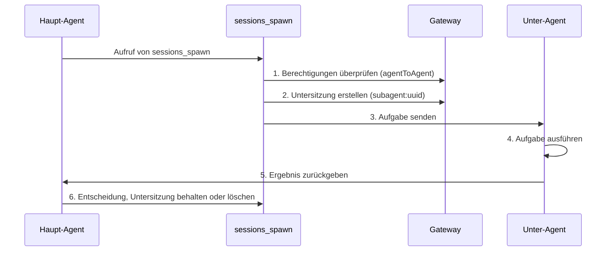

# Sitzungsverwaltung und Multi-Agent: Sitzungsisolierung, Unter-Agent-Kollaboration und Kontextkomprimierung

## Was Sie nach dem Lernen können

- Das Clawdbot-Sitzungsmodell und die Sitzungsschlüsselstruktur verstehen
- Die Sitzungsisolierung zwischen verschiedenen Agents konfigurieren
- Unter-Agents verwenden, um isolierte Aufgaben zu erledigen
- Das Kontextfenster verwalten, um das Überschreiten der Modellgrenzen zu vermeiden
- Best Practices für das Zurücksetzen und Komprimieren von Sitzungen meistern

## Ihre aktuelle Situation

Wenn Ihr KI-Assistent gleichzeitig mehrere Benutzer und mehrere Kanäle bedient, können Sie auf diese Probleme stoßen:

- **Sitzungsinterferenzen**: Nachrichten verschiedener Benutzer vermischen sich und die KI kann sich nicht an ihre jeweiligen Verläufe erinnern
- **Kontextexplosion**: Nach langen Gesprächen beginnt das Modell, das "Gedächtnis zu verlieren" oder Antworten werden langsamer
- **Verwirrung bei Unteraufgaben**: Wenn der Haupt-Agent Unteraufgaben aufruft, gibt es keine klaren Isolierungsgrenzen
- **Ressourcenverschwendung**: Alle Agents teilen sich denselben Satz von Sitzungen, was Speicher- und Rechenressourcen ineffizient macht

Das **Sitzungsverwaltungssystem von Clawdbot** ist darauf ausgelegt, diese Probleme zu lösen.

## Kernkonzept

Eine **Sitzung** ist die zentrale abstrakte Einheit von Clawdbot. Jede Sitzung repräsentiert einen unabhängigen Gesprächsverlauf mit eigenen Nachrichtenaufzeichnungen, Metadaten und einem Lebenszyklus.

Clawdbot verwendet **Sitzungsschlüssel (session key)**, um verschiedene Sitzungen zu identifizieren und zu isolieren. Sitzungsschlüssel unterscheiden nicht nur verschiedene Gesprächspartner (Benutzer, Gruppen, Kanäle), sondern auch verschiedene Agent-Instanzen.

::: info Was ist ein Sitzungsschlüssel?

Ein Sitzungsschlüssel ist ein Zeichenkettenbezeichner, der eine Sitzung eindeutig identifiziert. Formatbeispiele:
- `agent:main:main` (Hauptsitzung des Haupt-Agents)
- `agent:work:main` (Hauptsitzung des Arbeits-Agents)
- `agent:main:whatsapp:group:123` (WhatsApp-Gruppensitzung)
- `cron:job-id` (Geplante Aufgaben-Sitzung)

Clawdbot leitet Nachrichten basierend auf dem Sitzungsschlüssel an den richtigen Agent weiter und verwaltet unabhängige Gesprächsverläufe.
:::

## Sitzungsmodell

### Aufbau des Sitzungsschlüssels

Clawdbot verwendet strukturierte Sitzungsschlüssel, um verschiedene Sitzungstypen zu identifizieren:

| Sitzungstyp | Schlüsselformat | Beispiel | Beschreibung |
|---------|---------|-------|------|
| **Hauptsitzung** | `agent:<agentId>:<mainKey>` | `agent:main:main` | Standard-Hauptsitzung jedes Agents |
| **Direktnachricht** | `agent:<agentId>:dm:<peerId>` | `agent:main:dm:+15551234567` | Isoliert gemäß `dmScope`-Konfiguration |
| **Gruppe/Kanal** | `agent:<agentId>:<channel>:group:<id>` | `agent:main:whatsapp:group:123` | Gruppen und Kanäle automatisch isoliert |
| **Unter-Agent** | `agent:<agentId>:subagent:<uuid>` | `agent:main:subagent:a1b2c3d4` | Isolierte Sitzung des Unter-Agents |
| **Geplante Aufgabe** | `cron:<jobId>` | `cron:daily-report` | Dedizierte Sitzung für Cron-Aufgaben |
| **Webhook** | `hook:<uuid>` | `hook:xyz789` | Durch Webhook ausgelöste Sitzung |

### Sitzungsspeicherung

Sitzungsdaten werden an zwei Orten gespeichert:

```bash
# Sitzungsindex (Metadaten)
~/.clawdbot/agents/<agentId>/sessions/sessions.json

# Nachrichtenverlauf (eine Datei pro Sitzung)
~/.clawdbot/agents/<agentId>/sessions/<sessionId>.jsonl
```

**sessions.json** ist eine Zuordnungstabelle, die aufzeichnet:
- Sitzungsschlüssel → Sitzungsmetadaten (sessionId, updatedAt, model, tokens usw.)
- Das Löschen dieser Einträge ist sicher; sie werden bei Bedarf automatisch neu erstellt

**JSONL-Dateien** speichern den vollständigen Gesprächsverlauf mit einem Nachrichtenaufzeichnung pro Zeile.

::: tip Gateway ist die einzige Wahrheitsquelle

Alle Sitzungszustände gehören dem Gateway. UI-Clients (macOS-App, WebChat) müssen die Sitzungsliste und die Token-Anzahl vom Gateway abfragen, anstatt direkt lokale Dateien zu lesen.

Im Remote-Modus werden die Sitzungen, die Sie interessieren, auf dem Remote-Gateway-Host gespeichert, nicht auf Ihrem Mac.
:::

## Mechanismus der Sitzungsisolierung

### Einzelner Agent-Modus (Standard)

Wenn keine Konfiguration vorgenommen wird, führt Clawdbot einen einzelnen Agent aus:
- `agentId` ist standardmäßig `main`
- Alle DM-Sitzungen teilen sich den Hauptsitzungsschlüssel (`agent:main:main`)
- Dies bedeutet, dass **Nachrichten desselben Benutzers von verschiedenen Kanälen in dieselbe Sitzung gelangen**

### Multi-Agent-Modus

**Mehrere Agents = Mehrere isolierte Gehirne**

Jeder Agent verfügt über seinen eigenen unabhängigen Satz von:
- **Workspace** (Arbeitsbereichsdateien, AGENTS.md, SOUL.md)
- **State directory** (Authentifizierungskonfiguration, Modell-Registry)
- **Session store** (Chatverlauf und Routing-Status)

#### Warum mehrere Agents?

| Szenario | Lösung |
|--------|---------|
| **Mehrere Benutzer teilen sich einen Server** | Jeder Benutzer hat einen unabhängigen Agent, Sitzungen vollständig isoliert |
| **Verschiedene Persönlichkeiten auf verschiedenen Kanälen** | WhatsApp verwendet Alltags-Agent, Telegram verwendet tiefgehenden Arbeits-Agent |
| **Berechtigungstrennung** | Familien-Agent mit eingeschränkten Werkzeugen, persönlicher Agent mit vollem Zugriff |
| **Verschiedene Umgebungen** | Entwicklungs-Agent, Produktions-Agent vollständig isoliert |

#### Multi-Agent-Konfiguration

**Schritt 1: Neuen Agent hinzufügen**

```bash
clawdbot agents add work
```

Dadurch wird ein neues Agent-Verzeichnis in `~/.clawdbot/agents/work/` erstellt.

**Schritt 2: Routing-Regeln konfigurieren**

Fügen Sie `bindings` in `~/.clawdbot/clawdbot.json` hinzu:

```json5
{
  agents: {
    list: [
      { id: "home", workspace: "~/clawd-home", name: "Home" },
      { id: "work", workspace: "~/clawd-work", name: "Work" }
    ]
  },
  bindings: [
    { agentId: "home", match: { channel: "whatsapp", accountId: "personal" } },
    { agentId: "work", match: { channel: "whatsapp", accountId: "biz" } }
  ]
}
```

**Schritt 3: Konfiguration überprüfen**

```bash
clawdbot agents list --bindings
```

#### Routing-Regeln (Deterministische Übereinstimmung)

Wenn eine Nachricht eingeht, gleicht Clawdbot die Regeln in der Reihenfolge **am spezifischsten zuerst** ab:

1. **peer**-Übereinstimmung (genaue DM/group/channel ID)
2. **guildId** (Discord)
3. **teamId** (Slack)
4. **accountId**-Übereinstimmung
5. Kanal-ebene-Übereinstimmung (`accountId: "*"`)
6. Fallback zum Standard-Agent

::: warning Auf die Reihenfolge der Bindungen achten

Die Reihenfolge in der Liste der Bindungen ist wichtig! Spezifischere Regeln müssen zuerst stehen.

Wenn Sie beispielsweise einen bestimmten DM an den Agent `work` leiten und andere WhatsApp-DMs an den Agent `home` leiten möchten, müssen Sie die Peer-Regel zuerst schreiben:
```json5
{
  bindings: [
    { agentId: "work", match: { channel: "whatsapp", peer: { kind: "dm", id: "+15551234567" } } },
    { agentId: "home", match: { channel: "whatsapp" } }
  ]
}
```
:::

### DM-Bereichskontrolle

Verwenden Sie `session.dmScope`, um zu steuern, wie Direktnachrichten gruppiert werden:

| Option | Verhalten | Verwendungsszenario |
|------|-------|---------|
| `main` (Standard) | Alle DMs teilen sich die Hauptsitzung | Einzelner Benutzer, mehrere Kanäle |
| `per-peer` | Isoliert nach Absender-ID | Multi-Benutzer-Umgebung |
| `per-channel-peer` | Isoliert nach Kanal + Absender | Geteilter Posteingang |

Konfigurationsbeispiel:

```json5
{
  session: {
    dmScope: "per-channel-peer"  // Jeder Benutzer in jedem Kanal hat eine unabhängige Sitzung
  }
}
```

### Identitätslinks (Identity Links)

Wenn derselbe Benutzer mehrere Plattformen verwendet (wie WhatsApp und Telegram), können Sie sie mit `session.identityLinks` Sitzungen teilen lassen:

```json5
{
  session: {
    identityLinks: {
      alice: ["telegram:123456789", "discord:987654321012345678"]
    }
  }
}
```

Dadurch gelangen alle Nachrichten, die Alice von Telegram oder Discord sendet, in die Sitzung `agent:<agentId>:dm:alice`.

## Unter-Agent-Kollaboration

### Was ist ein Unter-Agent?

Ein **Unter-Agent** ist eine Agent-Instanz, die in einer isolierten Sitzung ausgeführt wird und verwendet wird, um bestimmte Aufgaben auszuführen, ohne den Kontext der Hauptsitzung zu beeinflussen.

Typische Verwendungsszenarien:
- **Code-Review**: Der Unter-Agent analysiert den Code und gibt eine Zusammenfassung zurück
- **Datenextraktion**: Der Unter-Agent extrahiert Informationen aus langen Dokumenten
- **Parallele Aufgaben**: Während der Haupt-Agent wartet, führt der Unter-Agent im Hintergrund Aufgaben aus
- **Sandbox-Isolierung**: Ausführen von nicht vertrauenswürdigen Aufgaben in einer eingeschränkten Umgebung

### sessions_spawn-Tool

Verwenden Sie das Tool `sessions_spawn`, um einen Unter-Agent zu erstellen:

```json
{
  "task": "Analysieren Sie dieses Dokument und extrahieren Sie die wichtigsten Punkte",
  "label": "Dokumentanalyse",
  "model": "anthropic/claude-opus-4-5",
  "thinking": "detailed",
  "runTimeoutSeconds": 300,
  "cleanup": "keep"
}
```

Parameterbeschreibung:

| Parameter | Typ | Erforderlich | Beschreibung |
|------|------|-------|------|
| `task` | string | ✅ | Aufgabenbeschreibung des Unter-Agents |
| `label` | string | ❌ | Lesbares Aufgabenetikett (für Nachverfolgung) |
| `agentId` | string | ❌ | Ziel-Agent-ID (Standard ist der aktuelle Agent) |
| `model` | string | ❌ | Modell-Override |
| `thinking` | string | ❌ | Denkebene (`minimal`/`standard`/`detailed`) |
| `runTimeoutSeconds` | number | ❌ | Zeitüberschreitung (Sekunden) |
| `cleanup` | string | ❌ | Bereinigungsstrategie nach Abschluss der Aufgabe (`keep`/`delete`) |

### Lebenszyklus des Unter-Agents



**Schritte des Lebenszyklus**:

1. **Berechtigungsprüfung**: Bei Agent-zu-Agent-Aufrufen wird die Konfiguration `tools.agentToAgent.allow` überprüft
2. **Untersitzungserstellung**: Generiert einen eindeutigen Schlüssel `agent:<agentId>:subagent:<uuid>`
3. **Aufgabenausführung**: Der Unter-Agent vervollständigt die Aufgabe in der isolierten Sitzung
4. **Ergebnisrückgabe**: Das Ergebnis wird per Streaming an den Haupt-Agent zurückgegeben
5. **Bereinigungsstrategie**:
   - `cleanup: "keep"`: Behält die Untersitzung für spätere Überprüfungen
   - `cleanup: "delete"`: Löscht die Untersitzung automatisch

### Konfiguration der Agent-zu-Agent-Kommunikation

Standardmäßig ist die Agent-zu-Agent-Kommunikation deaktiviert. Sie muss explizit aktiviert werden:

```json5
{
  tools: {
    agentToAgent: {
      enabled: true,
      allow: ["home", "work", "family"]
    }
  }
}
```

Berechtigungsbeschreibung:
- `enabled: false`: Deaktiviert die Agent-zu-Agent-Kommunikation vollständig
- `allow: ["*"]`: Erlaubt jeden Agent
- `allow: ["home", "work"]`: Erlaubt nur bestimmte Agents

::: danger Sicherheitshinweis

Unter-Agents erben einen Teil des Kontexts des übergeordneten Agents, erhalten aber **nicht** den vollständigen Sitzungsverlauf des übergeordneten Agents. Dies ist sowohl eine Funktion (Tokeneinsparung) als auch eine Einschränkung (Unter-Agents kennen nicht den vollständigen Kontext).

Für sensible Operationen sollten Sie deren Durchführung in der Hauptsitzung in Betracht ziehen, anstatt über Unter-Agents.
:::

## Kontextkomprimierung

### Was ist das Kontextfenster?

Jedes KI-Modell hat ein **Kontextfenster (context window)**: die maximale Anzahl von Token, die es in einer einzigen Inferenz sehen kann.

Lange Gespräche akkumulieren Nachrichten und Tool-Ergebnisse. Sobald die Modellgrenze erreicht ist, komprimiert Clawdbot den Verlauf, um Platz freizugeben.

### Automatische Komprimierung

Wenn eine Sitzung das Kontextfenster erreicht oder überschreitet, löst Clawdbot automatisch die Komprimierung aus:

- **Vor der Komprimierung**: Führt zuerst eine **stille Speicher-Aktualisierung** durch, bei der das Modell aufgefordert wird, persistente Notizen auf die Festplatte zu schreiben (wenn der Arbeitsbereich beschreibbar ist)
- **Komprimierungsprozess**: Fasst alte Gespräche in einer komprimierten Zusammenfassung zusammen, behält aber die neuesten Nachrichten
- **Persistenz**: Das Komprimierungsergebnis wird in die JSONL-Verlaufsdatei geschrieben
- **Wiederholung**: Wiederholt die ursprüngliche Anforderung mit dem komprimierten Kontext

Sie werden sehen:
- `🧹 Auto-compaction complete` (im ausführlichen Modus)
- `/status` zeigt `🧹 Compactions: <count>`

### Manuelle Komprimierung

Verwenden Sie den Befehl `/compact`, um die Komprimierung manuell auszulösen:

```
/compact
```

Sie können Komprimierungsanweisungen hinzufügen:

```
/compact Focus on decisions and open questions
```

Dies weist die KI an, sich bei der Zusammenfassung auf bestimmte Inhalte zu konzentrieren.

### Komprimierung vs. Beschneidung

| Operation | Zweck | Persistenz | Ort |
|------|-------|---------|------|
| **Komprimierung** | Alte Gespräche zusammenfassen | ✅ | In JSONL schreiben |
| **Beschneidung** | Alte Tool-Ergebnisse entfernen | ❌ | Nur im Arbeitsspeicher |

::: tip Empfehlungen zur Komprimierungsstrategie

- **Komprimierung**: Speichert Informationszusammenfassungen, geeignet zur Überprüfung des Verlaufs
- **Beschneidung**: Temporäre Bereinigung, geeignet zur Reduzierung der Token-Nutzung in einer einzigen Anforderung
- **/new**: Löscht die Sitzung vollständig, um ein neues Thema zu beginnen

Wählen Sie die geeignete Strategie je nach Ihren Nutzungsgewohnheiten.
:::

### Konfiguration der Komprimierung

Konfigurieren Sie das Komprimierungsverhalten in `~/.clawdbot/clawdbot.json`:

```json5
{
  agents: {
    defaults: {
      compaction: {
        enabled: true,
        threshold: 0.9,  // Auslösen, wenn die Kontextnutzung 90% beträgt
        trigger: "auto"  // auto/manual
      }
    }
  }
}
```

## Folgen Sie mir: Konfiguration der Sitzungsverwaltung

Konfigurieren wir die Sitzungsverwaltung anhand eines realen Szenarios.

### Szenario

Sie haben eine WhatsApp-Nummer und wünschen:
1. Persönliche Kontakte verwenden den Agent `home` (Alltagskonversation)
2. Arbeitsgruppen verwenden den Agent `work` (professionelle Antwort)
3. Unter-Agents für isolierte Aufgaben aktivieren

### Schritt 1: Zwei Agents hinzufügen

```bash
# Home-Agent hinzufügen
clawdbot agents add home

# Arbeits-Agent hinzufügen
clawdbot agents add work
```

**Sie sollten sehen**: Sie werden aufgefordert, den Arbeitsbereichspfad und andere Informationen einzugeben.

### Schritt 2: Konfigurationsdatei bearbeiten

Öffnen Sie `~/.clawdbot/clawdbot.json` und fügen Sie die Agent-Liste und Bindungsregeln hinzu:

```json5
{
  agents: {
    list: [
      {
        id: "home",
        name: "Home",
        workspace: "~/clawd-home",
        model: "anthropic/claude-sonnet-4-5"
      },
      {
        id: "work",
        name: "Work",
        workspace: "~/clawd-work",
        model: "anthropic/claude-opus-4-5"
      }
    ]
  },
  bindings: [
    // Persönliche Nachrichten werden an den Home-Agent weitergeleitet
    { agentId: "home", match: { channel: "whatsapp", peer: { kind: "dm", id: "+15551230001" } } },
    // Arbeitsgruppen werden an den Work-Agent weitergeleitet
    { agentId: "work", match: { channel: "whatsapp", peer: { kind: "group", id: "120363999999999999@g.us" } } },
    // Andere WhatsApp-Nachrichten werden an den Home-Agent weitergeleitet (Standard)
    { agentId: "home", match: { channel: "whatsapp" } }
  ],
  tools: {
    agentToAgent: {
      enabled: true,
      allow: ["home", "work"]
    }
  }
}
```

### Schritt 3: Gateway neu starten

```bash
clawdbot gateway restart
```

**Sie sollten sehen**: Gateway-Startprotokoll, das die geladenen Agents und Bindungsregeln anzeigt.

### Schritt 4: Unter-Agent-Aufruf testen

Senden Sie in der Sitzung des Agents `home`:

```
Bitte verwenden Sie einen Unter-Agent, um dieses PDF-Dokument zu analysieren und wichtige Informationen zu extrahieren: /path/to/file.pdf
```

Der Agent sollte automatisch das Tool `sessions_spawn` aufrufen, und Sie werden sehen:
- Benachrichtigung über die Unter-Agent-Erstellung
- Aufgabenausführungsprozess
- Ergebniszurückgabe

### Schritt 5: Sitzungsstatus überprüfen

Senden Sie im Chat:

```
/status
```

**Sie sollten sehen**:
- Token-Nutzung der aktuellen Sitzung
- Anzahl der Komprimierungen
- Modellinformationen

## Kontrollpunkt ✅

Nach Abschluss der Konfiguration überprüfen Sie die folgenden Punkte:

- [ ] `clawdbot agents list --bindings` zeigt die korrekten Bindungsregeln an
- [ ] Persönliche DMs werden an den Agent `home` weitergeleitet
- [ ] Arbeitsgruppen werden an den Agent `work` weitergeleitet
- [ ] Unter-Agent-Aufrufe funktionieren ordnungsgemäß
- [ ] `/status` zeigt die korrekten Sitzungsinformationen an

## Warnungen zu Problemen

### Häufige Fehler

| Fehler | Ursache | Lösung |
|------|------|---------|
| **Agent-zu-Agent-Aufruf verboten** | `tools.agentToAgent.enabled` ist nicht aktiviert oder die Liste `allow` enthält den Ziel-Agent nicht | Überprüfen Sie die Konfiguration, stellen Sie sicher, dass sie aktiviert ist und die Zulassungsliste hinzugefügt wurde |
| **Unter-Agent-Erstellung fehlgeschlagen** | Bei Agent-zu-Agent-Aufrufen ist der Ziel-Agent nicht in der Zulassungsliste | Überprüfen Sie die Konfiguration `tools.agentToAgent.allow` |
| **Sitzungsschlüsselkonflikt** | Falsche Reihenfolge der Bindungsregeln, spezifischere Regeln werden überschrieben | Platzieren Sie Peer-Regeln vor Kanalregeln |
| **Komprimierung fehlgeschlagen** | Kontext zu klein oder das Modell unterstützt keine Komprimierung | Überprüfen Sie das Kontextfenster des Modells und die Komprimierungskonfiguration |

### Konfigurationsempfehlungen

- **Einfach beginnen**: Testen Sie zuerst mit einem einzelnen Agent und bestätigen Sie, dass die Funktionen ordnungsgemäß funktionieren, bevor Sie mehrere Agents hinzufügen
- **Labels verwenden**: Fügen Sie klare `label` zu Unter-Agent-Aufgaben hinzu, um die Nachverfolgung zu erleichtern
- **Token-Nutzung überwachen**: Überprüfen Sie regelmäßig `/status`, um die Kontextnutzung zu verstehen
- **Konfigurationssicherung**: Erstellen Sie eine Sicherung, bevor Sie `clawdbot.json` ändern

## Zusammenfassung der Lektion

Diese Lektion stellte das Sitzungsverwaltungssystem von Clawdbot vor:

- **Sitzungsmodell**: Sitzungsschlüssel, Speicherorte, Lebenszyklus
- **Sitzungsisolierung**: Multi-Agent-Modus, DM-Bereichskontrolle, Identitätslinks
- **Unter-Agent-Kollaboration**: Tool `sessions_spawn`, Berechtigungssteuerung, Bereinigungsstrategie
- **Kontextkomprimierung**: Automatische/manuelle Komprimierung, Komprimierung vs. Beschneidung

Mit einer geeigneten Sitzungsverwaltungskonfiguration können Sie Clawdbot gleichzeitig mehrere Benutzer und Szenarien bedienen lassen, jeder mit seinem eigenen isolierten Kontext und Verlauf.

## Nächste Lektion

> In der nächsten Lektion lernen wir **[Browser-Automatisierungs-Tools](../tools-browser/)**.
>
> Sie werden lernen:
> - Wie Sie Browser-Tools konfigurieren und verwenden
> - Sicherheitsbeschränkungen der Browser-Automatisierung
> - Screenshots und Formularoperationen

---

## Anhang: Quellcode-Referenz

<details>
<summary><strong>Klicken, um Quellcodeorte anzuzeigen</strong></summary>

> Zuletzt aktualisiert: 2026-01-27

| Funktionalität | Dateipfad | Zeilennummer |
|------|---------|------|
| Sitzungsschlüssel-Analyse | [`src/routing/session-key.ts`](https://github.com/clawdbot/clawdbot/blob/main/src/routing/session-key.ts) | 1-100 |
| Sitzungskonfigurations-Schema | [`src/config/zod-schema.session.ts`](https://github.com/clawdbot/clawdbot/blob/main/src/config/zod-schema.session.ts) | 11-83 |
| Unter-Agent-Generierungs-Tool | [`src/agents/tools/sessions-spawn-tool.ts`](https://github.com/clawdbot/clawdbot/blob/main/src/agents/tools/sessions-spawn-tool.ts) | 28-269 |
| Sitzungs-Tool-Hilfsfunktionen | [`src/agents/tools/sessions-helpers.ts`](https://github.com/clawdbot/clawdbot/blob/main/src/agents/tools/sessions-helpers.ts) | 1-328 |
| Sitzungsverwaltungs-Dokumentation | [`docs/concepts/session.md`](https://github.com/clawdbot/clawdbot/blob/main/docs/concepts/session.md) | 1-151 |
| Multi-Agent-Routing-Dokumentation | [`docs/concepts/multi-agent.md`](https://github.com/clawdbot/clawdbot/blob/main/docs/concepts/multi-agent.md) | 1-355 |
| Kontextkomprimierungs-Dokumentation | [`docs/concepts/compaction.md`](https://github.com/clawdbot/clawdbot/blob/main/docs/concepts/compaction.md) | 1-50 |

**Wichtige Konstanten**:
- `SESSION_ID_RE = /^[0-9a-f]{8}-[0-9a-f]{4}-[0-9a-f]{4}-[0-9a-f]{4}-[0-9a-f]{12}$/i`: Regex der Sitzungs-ID (`sessions-helpers.ts:96`)

**Wichtige Typen**:
- `SessionKind = "main" | "group" | "cron" | "hook" | "node" | "other"`: Aufzählung der Sitzungstypen (`sessions-helpers.ts:11`)
- `SessionListRow`: Sitzungslisten-Zeilenstruktur (`sessions-helpers.ts:19-41`)

**Wichtige Funktionen**:
- `createSessionsSpawnTool()`: Unter-Agent-Generierungs-Tool erstellen (`sessions-spawn-tool.ts:60-269`)
- `resolveSessionReference()`: Sitzungsreferenz auflösen (`sessions-helpers.ts:215-253`)
- `classifySessionKind()`: Sitzungstyp klassifizieren (`sessions-helpers.ts:255-271`)
- `createAgentToAgentPolicy()`: Agent-zu-Agent-Kommunikationsrichtlinie erstellen (`sessions-helpers.ts:72-94`)

</details>
