# Google Chat-Kanal-Konfiguration

## Was du nach dem Lernen kannst

- 1:1-Privatchat mit deinem KI-Assistenten in Google Chat führen
- @Erwähnungen in Google Chat-Räumen verwenden, um den KI-Assistenten auszulösen
- Service Account-Authentifizierung und Webhook-Konfiguration meistern
- Tailscale Funnel zum sicheren Veröffentlichen von öffentlichen URLs verwenden

## Deine aktuelle Herausforderung

Du möchtest den KI-Assistenten in deinem Unternehmen oder Team über Google Chat nutzen, weißt aber nicht, wie du:

- Ein Google Cloud-Projekt erstellen und konfigurieren
- Service Account-Authentifizierung einrichten
- Webhook konfigurieren, damit Google Chat eine Verbindung zu deinem Gateway herstellen kann
- Das Gateway sicher im öffentlichen Netz verfügbar machen

## Wann diesen Ansatz verwenden

**Szenarien, die für den Google Chat-Kanal geeignet sind**:

- Dein Team nutzt hauptsächlich Google Chat für die Kommunikation
- Du benötigst den KI-Assistenten in einer Google Workspace-Umgebung
- Du möchtest über Google Chat Spaces zusammenarbeiten
- Du musst Google Chat-Nachrichten über einen öffentlichen Webhook empfangen

**Nicht geeignete Szenarien**:

- Persönliche Nutzung (empfohlen: WebChat, Telegram, WhatsApp)
- OAuth-Benutzerautorisierung erforderlich (Google Chat unterstützt nur Service Account)

## Kernkonzept

Der Arbeitsablauf des Google Chat-Kanals:

```mermaid
sequenceDiagram
    participant User as Benutzer
    participant GC as Google Chat
    participant Clawdbot as Clawdbot Gateway

    User->>GC: Nachricht senden
    GC->>Clawdbot: POST webhook (mit Bearer Token)
    Clawdbot->>Clawdbot: Audience verifizieren
    Clawdbot->>Clawdbot: Berechtigungen prüfen (DM/Gruppe)
    Clawdbot->>Clawdbot: Nachricht verarbeiten (Agent)
    Clawdbot->>GC: Antwort zurückgeben
    GC->>User: Antwort anzeigen
```



**Wichtige Konzepte**:

| Konzept | Beschreibung |
| ------- | ------------ |
| **Service Account** | Google Cloud-Authentifizierungsmethode für Bot-Identitätsverifizierung |
| **Webhook** | HTTP-Endpunkt, an den Google Chat Nachrichten an das Gateway POSTet |
| **Audience** | Ziel zur Verifizierung von Webhook-Anfragen (app-url oder project-number) |
| **DM-Pairing** | Standard-Sicherheitsmechanismus, Fremde müssen genehmigt werden |

::: tip
Der Google Chat-Kanal unterstützt nur Service Account-Authentifizierung, keine OAuth-Benutzerautorisierung. Wenn du Benutzerberechtigungen benötigst, erwäge die Verwendung eines anderen Kanals.
:::

## 🎒 Vorbereitung

Stelle sicher, dass du Folgendes getan hast:

- ✅ [Schnellstart](../../start/getting-started/) abgeschlossen und Clawdbot installiert
- ✅ Gateway läuft (`clawdbot gateway --port 18789`)
- ✅ Zugriff auf ein Google Cloud-Konto
- ✅ Grundlegendes Verständnis der Verwendung von Terminalbefehlen

::: warning
Der Google Chat Webhook benötigt einen öffentlichen HTTPS-Endpunkt. Dieses Tutorial erklärt, wie du Tailscale Funnel oder einen Reverse Proxy verwendest, um den Dienst sicher freizugeben.
:::

## Folge den Schritten

### Schritt 1: Google Cloud-Projekt erstellen und Chat API aktivieren

**Warum**
Du benötigst zunächst ein Google Cloud-Projekt, um die Chat-Anwendung und den Service Account zu hosten.

1. Besuche [Google Chat API Credentials](https://console.cloud.google.com/apis/api/chat.googleapis.com/credentials)
2. Wenn die API noch nicht aktiviert ist, klicke auf **Enable API**

**Du solltest sehen**:
- Die Chat API ist aktiviert und zeigt "API enabled"
- Du befindest dich auf der Seite "Credentials" (Anmeldeinformationen)

### Schritt 2: Service Account erstellen

**Warum**
Der Service Account ist die Bot-Identität, die zur Authentifizierung von Webhook-Anfragen verwendet wird.

1. Auf der Seite "Credentials" klicke auf **Create Credentials** > **Service Account**
2. Gib einen Namen ein (z. B. `clawdbot-chat`)
3. Klicke auf **Continue** (überspringe die Berechtigungseinstellungen)
4. Lass die Zugriffssteuerung leer und klicke auf **Done**

**Du solltest sehen**:
- Der neu erstellte Service Account wird in der Liste angezeigt

### Schritt 3: JSON Key erstellen und herunterladen

**Warum**
Der JSON Key enthält die Authentifizierungsdaten. Clawdbot benötigt diesen, um Google Chat-Anfragen zu verifizieren.

1. Klicke auf den gerade erstellten Service Account
2. Gehe zum Tab **Keys** (Schlüssel)
3. Klicke auf **Add Key** > **Create new key**
4. Wähle das Format **JSON** und klicke auf **Create**
5. Die heruntergeladene JSON-Datei wird automatisch gespeichert

**Du solltest sehen**:
- Der Browser lädt eine `.json`-Datei herunter

::: warning
⚠️ Wichtig: Der JSON Key wird nur einmal heruntergeladen. Bewahre ihn sorgfältig auf! Wenn er verloren geht, muss er neu erstellt werden.
:::

### Schritt 4: Service Account-Datei speichern

**Warum**
Clawdbot muss die Key-Datei lesen, um Google Chat-Anfragen zu verifizieren.

1. Verschiebe die heruntergeladene JSON-Datei an einen sicheren Ort:
   ```bash
   mv ~/Downloads/*.json ~/.clawdbot/googlechat-service-account.json
   ```
2. Setze die Dateiberechtigungen (optional, aber empfohlen):
   ```bash
   chmod 600 ~/.clawdbot/googlechat-service-account.json
   ```

**Du solltest sehen**:
- Die Datei ist im Verzeichnis `~/.clawdbot/` gespeichert
- Die Berechtigungen sind so gesetzt, dass nur der Eigentümer lesen und schreiben kann

### Schritt 5: Google Chat-Anwendung erstellen

**Warum**
Die Chat App definiert das Aussehen, Verhalten und die Webhook-URL des Bots.

1. Besuche [Google Cloud Console Chat Configuration](https://console.cloud.google.com/apis/api/chat.googleapis.com/hangouts-chat)
2. Fülle **Application info** aus:
   - **App name**: `Clawdbot` (oder ein anderer Name)
   - **Avatar URL**: `https://clawd.bot/logo.png` (optional)
   - **Description**: `Personal AI Assistant` (optional)
3. Aktiviere **Interactive features**
4. Unter **Functionality** wähle **Join spaces and group conversations**
5. Unter **Connection settings** wähle **HTTP endpoint URL**
6. Unter **Visibility** wähle **Make this Chat app available to specific people and groups in &lt;Your Domain&gt;**
7. Gib deine Google Workspace-E-Mail ein (z. B. `user@example.com`)
8. Klicke unten auf der Seite auf **Save**

**Du solltest sehen**:
- Die App-Konfiguration wurde gespeichert
- Die Seite zeigt den Abschnitt "App status" (App-Status)

### Schritt 6: Webhook Triggers konfigurieren

**Warum**
Triggers definieren, wann Google Chat Nachrichten an das Gateway sendet.

1. Aktualisiere die Seite nach dem Speichern
2. Suche den Abschnitt **App status** (oben oder unten)
3. Ändere den Status zu **Live - available to users**
4. Klicke erneut auf **Save**

**Du solltest sehen**:
- Der App-Status zeigt "Live - available to users"

::: info
💡 Tipp: Die Webhook-URL wird in Schritt 7 konfiguriert. Wenn du unsicher bist, kannst du vorerst den Platzhalter `https://example.com/googlechat` verwenden und ihn später aktualisieren.
:::

### Schritt 7: Öffentliche URL des Gateways abrufen

**Warum**
Google Chat benötigt eine öffentliche HTTPS-URL, um Webhook-Anfragen zu senden.

Führe den folgenden Befehl aus, um die öffentliche URL des Gateways anzuzeigen:

```bash
clawdbot status
```

**Du solltest sehen**:
- Die Ausgabe enthält die öffentliche URL (z. B. `https://your-node.tailnet.ts.net`)

::: warning
Wenn das Gateway nicht mit Tailscale oder einem Reverse Proxy konfiguriert ist, musst du zuerst den öffentlichen Zugriff einrichten (siehe nächsten Schritt).
:::

### Schritt 8: Webhook-Endpunkt öffentlich machen (eine Option auswählen)

::: tip
Tailscale Funnel wird empfohlen, da nur der Pfad `/googlechat` freigegeben wird und die anderen Endpunkte privat bleiben.
:::

#### Option A: Tailscale Funnel (empfohlen)

**Warum Tailscale Funnel**
- Nur bestimmte Pfade werden freigegeben, erhöhte Sicherheit
- Gateway im internen Netz bleibt privat, nur Webhook zugänglich
- Keine Notwendigkeit, eine Domain zu kaufen und SSL zu konfigurieren

1. **Gateway-Bindungsadresse prüfen**:
   ```bash
   ss -tlnp | grep 18789
   ```
   Notiere die IP-Adresse (z. B. `127.0.0.1`, `0.0.0.0` oder Tailscale-IP wie `100.x.x.x`)

2. **Nur Control Panel an Tailnet freigeben** (Port 8443):
   ```bash
   # Wenn an localhost gebunden (127.0.0.1 oder 0.0.0.0):
   tailscale serve --bg --https 8443 http://127.0.0.1:18789
   
   # Wenn an Tailscale-IP gebunden (z. B. 100.106.161.80):
   tailscale serve --bg --https 8443 http://100.106.161.80:18789
   ```

3. **Webhook-Pfad öffentlich freigeben**:
   ```bash
   # Wenn an localhost gebunden (127.0.0.1 oder 0.0.0.0):
   tailscale funnel --bg --set-path /googlechat http://127.0.0.1:18789/googlechat
   
   # Wenn an Tailscale-IP gebunden (z. B. 100.106.161.80):
   tailscale funnel --bg --set-path /googlechat http://100.106.161.80:18789/googlechat
   ```

4. **Knoten für Funnel autorisieren** (falls aufgefordert):
   - Besuche die in der Ausgabe angezeigte Autorisierungs-URL
   - Aktiviere Funnel für diesen Knoten im Tailscale-Admin-Panel

5. **Konfiguration verifizieren**:
   ```bash
   tailscale serve status
   tailscale funnel status
   ```

**Du solltest sehen**:
- Serve und Funnel laufen beide
- Öffentliche Webhook-URL: `https://<node-name>.<tailnet>.ts.net/googlechat`
- Privates Control Panel: `https://<node-name>.<tailnet>.ts.net:8443/`

#### Option B: Caddy Reverse Proxy

**Warum Caddy**
- Automatisches HTTPS unterstützt
- Flexible Pfad-Routing-Konfiguration

1. Caddyfile erstellen:
   ```txt
   your-domain.com {
       reverse_proxy /googlechat* localhost:18789
   }
   ```

2. Caddy starten:
   ```bash
   caddy run --config Caddyfile
   ```

**Du solltest sehen**:
- Caddy läuft und lauscht auf Port 443
- Nur der Pfad `your-domain.com/googlechat` wird an das Gateway geroutet

#### Option C: Cloudflare Tunnel

**Warum Cloudflare Tunnel**
- Kostenloses globales CDN
- Einfache Pfad-Regel-Konfiguration

1. Tunnel-Eingangsregeln konfigurieren:
   - **Path**: `/googlechat` -> `http://localhost:18789/googlechat`
   - **Default Rule**: HTTP 404 (Not Found)

### Schritt 9: Google Chat Webhook URL aktualisieren

**Warum**
Da du jetzt eine öffentliche URL hast, aktualisiere die Chat App-Konfiguration, um auf den richtigen Endpunkt zu verweisen.

1. Gehe zurück zur Google Cloud Console Chat Configuration Seite
2. Im Abschnitt **Triggers**:
   - Wähle **Use a common HTTP endpoint URL for all triggers**
   - Setze sie auf: `<deine öffentliche URL>/googlechat`
   - Beispiel: `https://your-node.tailnet.ts.net/googlechat`
3. Klicke auf **Save**

**Du solltest sehen**:
- Die Triggers wurden aktualisiert und gespeichert

### Schritt 10: Clawdbot konfigurieren

**Warum**
Clawdbot mitteilen, welchen Service Account und welchen Webhook-Pfad es verwenden soll.

**Methode A: Umgebungsvariablen**

```bash
export GOOGLE_CHAT_SERVICE_ACCOUNT_FILE="/path/to/service-account.json"
clawdbot gateway restart
```

**Methode B: Konfigurationsdatei**

Bearbeite `~/.clawdbot/clawdbot.json`:

```json5
{
  channels: {
    googlechat: {
      enabled: true,
      serviceAccountFile: "/Users/yourname/.clawdbot/googlechat-service-account.json",
      audienceType: "app-url",
      audience: "https://your-node.tailnet.ts.net/googlechat",
      webhookPath: "/googlechat",
      dm: {
        policy: "pairing",
        allowFrom: ["users/1234567890", "your-email@example.com"]
      },
      groupPolicy: "allowlist",
      groups: {
        "spaces/AAAA": {
          allow: true,
          requireMention: true,
          users: ["users/1234567890"],
          systemPrompt: "Short answers only."
        }
      }
    }
  }
}
```

**Gateway neu starten**:

```bash
clawdbot gateway restart
```

**Du solltest sehen**:
- Gateway startet und zeigt "Google Chat default: enabled, configured, ..."
- Keine Fehlerlogs

### Schritt 11: Bot zu Google Chat hinzufügen

**Warum**
Letzter Schritt: Finde und füge den Bot in Google Chat hinzu.

1. Besuche [Google Chat](https://chat.google.com/)
2. Klicke auf **+** (Plus) neben **Direct Messages**
3. Gib im Suchfeld (in der Regel dort, wo Kontakte hinzugefügt werden) den **App name** ein (den Namen, den du in Schritt 5 konfiguriert hast)
   - **Hinweis**: Der Bot wird nicht in der "Marketplace"-Liste angezeigt, da es sich um eine private Anwendung handelt. Du musst nach dem Namen suchen.
4. Wähle deinen Bot aus den Ergebnissen
5. Klicke auf **Add** oder **Chat**, um einen 1:1-Chat zu starten

**Du solltest sehen**:
- Der Bot erscheint in der Kontaktliste
- Das Chatfenster öffnet sich

### Schritt 12: Testnachricht senden

**Warum**
Verifiziere, ob die Konfiguration korrekt ist und Nachrichten ordnungsgemäß übermittelt werden.

Gib im Chatfenster ein:

```
Hello
```

**Du solltest sehen**:
- Der Bot antwortet mit einer Begrüßung oder Bestätigungsnachricht
- Gateway-Logs zeigen empfangene und verarbeitete Nachrichten an

## Kontrollpunkt ✅

Verifiziere, ob die Konfiguration erfolgreich war:

```bash
# Kanalstatus prüfen
clawdbot channels status

# Sollte anzeigen:
# Google Chat default: enabled, configured, webhook listening
```

::: info
Wenn du Fehler siehst, führe `clawdbot channels status --probe` aus, um detaillierte Diagnoseinformationen anzuzeigen.
:::

## Konfigurationsdetails

### Service Account-Authentifizierung

| Konfiguration | Typ | Standardwert | Beschreibung |
| -------------- | --- | ------------ | ------------ |
| `serviceAccountFile` | string | - | Pfad zur Service Account JSON-Datei |
| `serviceAccount` | string\|object | - | Inline-JSON-Zugangsdaten (ersetzt Dateipfad) |
| `audienceType` | "app-url"\|"project-number" | "app-url" | Verifizierungstyp: URL oder Projektnummer |
| `audience` | string | - | Audience-Wert (URL oder Projektnummer) |

### DM-Richtlinie

Standardmäßig benötigen fremde Absender Pairing:

| Konfiguration | Typ | Standardwert | Beschreibung |
| -------------- | --- | ------------ | ------------ |
| `dm.enabled` | boolean | undefiniert | DM-Empfang aktivieren |
| `dm.policy` | "pairing"|"open" | "pairing" | Zugriffsrichtlinie: Pairing oder offen |
| `dm.allowFrom` | array | [] | Liste der zulässigen Absender (Benutzer-IDs oder E-Mails) |

**Neue Absender paaren**:

```bash
clawdbot pairing approve googlechat <Pairing-Code>
```

### Gruppenrichtlinie

| Konfiguration | Typ | Standardwert | Beschreibung |
| -------------- | --- | ------------ | ------------ |
| `groupPolicy` | "allowlist"|"disabled" | "allowlist" | Gruppenrichtlinie: Whitelist oder deaktiviert |
| `requireMention` | boolean | true | @Erwähnung zum Auslösen erforderlich |
| `groups` | object | {} | Konfiguration nach Raum-ID |

**Bestimmte Gruppen zulassen**:

```json5
{
  channels: {
    googlechat: {
      groups: {
        "spaces/AAAA": {
          allow: true,
          requireMention: true,
          users: ["users/1234567890"],
          systemPrompt: "Short answers only."
        }
      }
    }
  }
}
```

### Andere Konfigurationen

| Konfiguration | Typ | Standardwert | Beschreibung |
| -------------- | --- | ------------ | ------------ |
| `webhookPath` | string | "/googlechat" | Webhook-Pfad |
| `botUser` | string | - | Bot-Benutzer-Ressourcenname (für Erwähnungserkennung) |
| `typingIndicator` | "none"|"message"|"reaction" | "message" | Tippindikator-Modus |
| `actions.reactions` | boolean | false | Emoji-Reaktionen unterstützen |
| `mediaMaxMb` | number | undefiniert | Maximale Mediendateigröße (MB) |

## Häufige Fehler

### 405 Method Not Allowed

**Symptom**: Google Cloud Logs Explorer zeigt `405 Method Not Allowed`

**Ursache**: Webhook-Handler nicht registriert

**Lösung**:

1. Bestätige, dass `channels.googlechat` in der Konfiguration vorhanden ist:
   ```bash
   clawdbot config get channels.googlechat
   ```

2. Plugin-Status prüfen:
   ```bash
   clawdbot plugins list | grep googlechat
   ```

3. Wenn "disabled" angezeigt wird, Konfiguration hinzufügen:
   ```json5
   {
     plugins: {
       entries: {
         googlechat: {
           enabled: true
         }
       }
     }
   }
   ```

4. Gateway neu starten:
   ```bash
   clawdbot gateway restart
   ```

### Nachrichten nicht empfangen

**Symptom**: Keine Antwort nach dem Senden einer Nachricht

**Fehlersuchschritte**:

1. Führe `clawdbot logs --follow` aus und sende eine Testnachricht
2. Bestätige die Webhook-URL und das Ereignis-Abonnement der Chat App
3. Prüfe, ob die `audience`-Konfiguration korrekt ist
4. Wenn @Erwähnung-Gating die Antwort blockiert, setze `botUser` und verifiziere `requireMention`

### Tailscale Funnel startet nicht

**Symptom**: `tailscale funnel` meldet einen Fehler

**Ursache**: Passwort-Authentifizierung nicht eingerichtet

**Lösung**:

Füge in `~/.clawdbot/clawdbot.json` Folgendes hinzu:

```json5
{
  gateway: {
    auth: {
      mode: "password"
    }
  }
}
```

## Zusammenfassung

- Google Cloud-Projekt und Service Account erstellt
- Google Chat App und Webhook konfiguriert
- Endpunkt mit Tailscale Funnel oder Reverse Proxy öffentlich freigegeben
- Clawdbot konfiguriert, Service Account-Authentifizierung zu verwenden
- DM-Pairing und Gruppen-@Erwähnungs-Mechanismen gelernt
- 1:1- und Gruppennachrichten getestet

## Nächste Lektion

> In der nächsten Lektion lernen wir den **[Signal-Kanal](../signal/)**.
>
> Du wirst lernen:
> - Wie du signal-cli installierst und konfigurierst
> - Berechtigungen und Zugriffskontrolle für den Signal-Kanal
> - Konfigurationsunterschiede zu Google Chat

---

## Anhang: Quellcode-Referenz

<details>
<summary><strong>Klicken, um Quellcodepositionen anzuzeigen</strong></summary>

> Aktualisierungszeit: 2026-01-27

| Funktion | Dateipfad | Zeilennummer |
| -------- | --------- | ------------ |
| Google Chat Konfigurationstyp-Definitionen | [`src/config/types.googlechat.ts`](https://github.com/clawdbot/clawdbot/blob/main/src/config/types.googlechat.ts) | 1-109 |
| Google Chat Zod Schema | [`src/config/zod-schema.providers-core.ts`](https://github.com/clawdbot/clawdbot/blob/main/src/config/zod-schema.providers-core.ts) | 273-341 |
| Kanal-Registrierung | [`src/channels/registry.ts`](https://github.com/clawdbot/clawdbot/blob/main/src/channels/registry.ts) | 61-67 |
| Gruppen-Erwähnungs-Parsing | [`src/channels/plugins/group-mentions.ts`](https://github.com/clawdbot/clawdbot/blob/main/src/channels/plugins/group-mentions.ts) | 158-175 |
| Google Chat Dokumentation | [`docs/channels/googlechat.md`](https://github.com/clawdbot/clawdbot/blob/main/docs/channels/googlechat.md) | 1-221 |

**Wichtige Typen**:
- `GoogleChatConfig`: Vollständige Google Chat-Konfigurationsschnittstelle
- `GoogleChatDmConfig`: DM-Zugriffsrichtlinienkonfiguration
- `GoogleChatGroupConfig`: Gruppenraumkonfiguration
- `GoogleChatActionConfig`: Aktionskonfiguration (z. B. Emoji-Reaktionen)

**Wichtige Konfigurationsfelder**:
- `audienceType`: "app-url" oder "project-number", zur Verifizierung von Webhook-Anfragen
- `audience`: Webhook-URL oder Projektnummer, gekoppelt mit `audienceType`
- `dm.policy`: Standard "pairing", steuert DM-Zugriff von Fremden
- `groupPolicy`: Gruppenzugriffsrichtlinie, "allowlist" oder "disabled"

**Authentifizierungsmechanismus**:
- Verwendet Google Service Account JSON-Zugangsdaten
- Webhook-Anfragen werden über `Authorization: Bearer <token>`-Header verifiziert
- Token wird mit `audience`-Konfiguration verglichen, um sicherzustellen, dass die Anfrage von einer legitimen Quelle stammt

</details>
