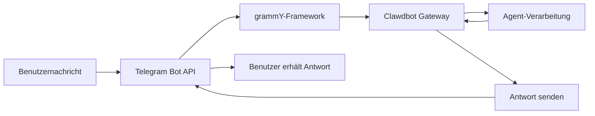

# Telegram-Kanalkonfiguration und -nutzung

## Was Sie nach diesem Tutorial können

- 🤖 Einen Bot in Telegram erstellen und Bot Token erhalten
- ⚙️ Den Telegram-Kanal mit Clawdbot verbinden
- 🔒 DM- und Gruppenzugriffsberechtigungen steuern (Pairing-Mechanismus und Whitelist)
- 📡 Gruppenerwähnungsregeln und Antwortstrategien einrichten
- 🔌 Webhook-Modus konfigurieren (optional)
- 🎯 Telegram Bot API-Funktionen nutzen (Inline-Buttons, Themen, Antworten)

## Ihre aktuelle Herausforderung

Sie verwenden Clawdbot bereits auf Telegram, stoßen aber auf diese Probleme:

- ❌ Sie wissen nicht, wie Sie Bot Token korrekt konfigurieren
- ❌ Fremde senden Nachrichten an den Bot, aber der Bot antwortet nicht
- ❌ In Gruppen antwortet der Bot nicht auf Nicht-Erwähnungsnachrichten
- ❌ Sie möchten präzise steuern, wer auf den Bot zugreifen kann, wissen aber nicht, wie
- ❌ Sie haben vom Unterschied zwischen Webhook und Long-polling gehört, wissen aber nicht, welchen Sie wählen sollen

Dieses Tutorial hilft Ihnen, diese Probleme Schritt für Schritt zu lösen.

## Wann Sie diese Lösung verwenden

Geeignete Szenarien für die Nutzung des Telegram-Kanals:

- ✅ Sie verwenden bereits Telegram und möchten mit dem KI-Assistenten auf dieser Plattform chatten
- ✅ Sie benötigen, dass der Bot in Gruppen auf bestimmte Benutzer oder Befehle reagiert
- ✅ Sie möchten spezielle Funktionen der Telegram Bot API nutzen (Inline-Buttons, Forum-Themen)
- ✅ Ihr Server-Netzwerkumfeld eignet sich für die Nutzung von Long-polling oder Webhook

**Wenn Sie hauptsächlich WhatsApp oder andere Kanäle verwenden**: Dieser Kurs kann übersprungen werden, konzentrieren Sie sich auf den von Ihnen verwendeten Kanal.

## 🎒 Vorbereitungen vor dem Start

Bevor Sie beginnen, stellen Sie sicher:

- [ ] Sie haben das Tutorial [Schnellstart](../../start/getting-started/) abgeschlossen, Clawdbot ist installiert und kann gestartet werden
- [ ] Sie haben ein Telegram-Konto (kein Premium-Konto erforderlich)
- [ ] Sie kennen grundlegende Telegram-Bot-Konzepte (Bot, Token, Privatsphärenmodus)

::: info Konfigurationsdateipfad
Standardmäßig befindet sich die Konfigurationsdatei von Clawdbot unter:
- **Linux/macOS**: `~/.clawdbot/clawdbot.json`
- **Windows**: `%USERPROFILE%\.clawdbot\clawdbot.json`
:::

## Kernkonzept

### Telegram Bot API vs. andere Kanäle

Im Gegensatz zu anderen Instant-Messaging-Plattformen verwendet Telegram die **Bot API**-Architektur:

| Merkmal | Telegram | WhatsApp | Slack |
| -------- | --------- | -------- | ------ |
| Verbindungsmethode | Bot API (HTTP) | Web Client | Bot API + WebSocket |
| Nachrichtenmodus | Push (Bot sendet aktiv) | Pull (Web Client überwachen) | Pull (WebSocket überwachen) |
| Privatsphärenmodus | **Unterstützt** (Bot kann wählen) | N/A | N/A |
| Gruppenunterstützung | SuperGroup + Forum | Gruppen | Channels + Workspace |
| Spezielle Funktionen | Forum-Themen, Inline-Buttons | - | - |

### Integrationsmethode von Clawdbot

Clawdbot nutzt das [grammY](https://grammy.dev/) Bot API-Framework zur Integration mit Telegram:



**Schlüsselpunkte**:
- **Long-polling**: Standardmodus, Clawdbot ruft Telegram-Updates aktiv ab
- **Webhook**: Optionaler Modus, Telegram sendet Updates an Ihren Server
- **DM-Pairing**: Standardmäßig aktiviert, Fremde müssen zuerst gepaart werden, um Nachrichten senden zu können
- **Gruppenerwähnung**: Standardmäßig aktiviert, Bot reagiert nur auf `@botname` oder konfigurierte Erwähnungsmuster

### Zugriffssteuerungsmechanismus

Clawdbot bietet drei Ebenen der Zugriffssteuerung:

1. **DM-Ebene** (`dmPolicy`)
   - `pairing`: Fremde Benutzer erhalten Pairing-Code, müssen zuerst genehmigt werden
   - `allowlist`: Nur Benutzer in der Whitelist sind erlaubt
   - `open`: Alle DMs zulassen (muss `allowFrom: ["*"]` konfigurieren)

2. **Gruppenebene** (`groups` + `groupPolicy`)
   - Liste, welche Gruppen auf den Bot zugreifen können
   - `requireMention`-Regel für jede Gruppe festlegen

3. **Sender-Ebene** (`allowFrom` + `groupAllowFrom`)
   - Innerhalb der zugelassenen DM/Gruppen weiter einschränken, wer Nachrichten senden kann

::: warning Sichere Standardeinstellungen
Die Standard-DM-Richtlinie ist `pairing`, der sicherste Standardwert. Nachrichten von Fremden werden ignoriert, bis Sie den Pairing-Code genehmigen.
:::

## Folgen Sie mir

### Schritt 1: Telegram-Bot erstellen und Token erhalten

**Warum**
Telegram-Bots benötigen einen Bot Token, um über die Bot API auf Nachrichten zugreifen und diese senden zu können. Dieser Token entspricht dem "Identitätsnachweis" des Bots.

**Vorgehensweise**

1. Suchen Sie in Telegram nach **@BotFather** und öffnen Sie diesen
2. Senden Sie den Befehl `/newbot`
3. Folgen Sie den Anweisungen:
   - Geben Sie Bot-Namen ein (z. B.: `My Clawdbot Assistant`)
   - Geben Sie Bot-Benutzernamen ein (muss mit `bot` enden, z. B.: `my_clawdbot_bot`)
4. BotFather gibt Bot Token zurück, Format wie: `123456:ABC-DEF123456`

**Was Sie sehen sollten**:
```
Done! Congratulations on your new bot.

You can find it at t.me/my_clawdbot_bot. You can now add a description,
about section and profile picture for it, see /help for a list of commands.

Use this token to access the HTTP API:
123456:ABC-DEF1234567890

Keep your token secure and store it safely, it can be used by anyone
to control your bot.
```

::: tip Sicherheitsempfehlung
- 🔐 Kopieren Sie Token sofort und speichern Sie ihn an einem sicheren Ort (z. B. Passwortmanager)
- ⚠️ **Teilen Sie Token niemals** in öffentlichen Repositorys, sozialen Medien oder mit anderen
- 🔄 Wenn Token geleakt wird, widerrufen Sie ihn sofort mit dem Befehl `/revoke` bei @BotFather
:::

**Optionale BotFather-Konfiguration** (empfohlen)

1. Gruppenberechtigungen einstellen:
   - `/setjoingroups` → Wählen Sie aus, ob der Bot zu Gruppen hinzugefügt werden darf
   - `/setprivacy` → Steuern Sie, ob alle Gruppennachrichten angezeigt werden

2. Bot-Informationen einstellen:
   - `/setdescription` → Beschreibung hinzufügen
   - `/setabouttext` → Über-Text hinzufügen
   - `/setuserpic` → Profilbild hochladen

### Schritt 2: Telegram-Kanal konfigurieren

**Warum**
Die Konfigurationsdatei sagt Clawdbot, wie es sich mit der Telegram Bot API verbinden soll und wie es Nachrichten und Berechtigungen verarbeitet.

**Vorgehensweise**

Erstellen oder bearbeiten Sie `~/.clawdbot/clawdbot.json`:

```json5
{
  "channels": {
    "telegram": {
      "enabled": true,
      "botToken": "123456:ABC-DEF1234567890",
      "dmPolicy": "pairing"
    }
  }
}
```

**Konfigurationsfelder-Erklärung**:

| Feld | Typ | Standard | Beschreibung |
| ---- | --- | -------- | ---- |
| `enabled` | boolean | `true` | Ob Telegram-Kanal gestartet werden soll |
| `botToken` | string | - | Bot Token (erforderlich) |
| `dmPolicy` | string | `"pairing"` | DM-Zugriffsrichtlinie |
| `allowFrom` | array | `[]` | DM-Whitelist (Benutzer-ID oder @Benutzername) |
| `groupPolicy` | string | `"allowlist"` | Gruppenzugriffsrichtlinie |
| `groupAllowFrom` | array | `[]` | Gruppen-Sender-Whitelist |
| `groups` | object | `{}` | Detaillierte Gruppenkonfiguration |

**Umgebungsvariablen-Methode** (optional)

Sie können auch Umgebungsvariablen verwenden (für Standardkonto):

```bash
export TELEGRAM_BOT_TOKEN="123456:ABC-DEF1234567890"
```

::: tip Priorität von Umgebungsvariablen
Wenn sowohl Umgebungsvariablen als auch Konfigurationsdatei konfiguriert sind:
- **Konfigurationsdatei hat Priorität** (`channels.telegram.botToken`)
- Umgebungsvariablen dienen als **Fallback für Standardkonto**
:::

### Schritt 3: Gateway starten und Verbindung überprüfen

**Warum**
Gateway starten, damit es sich basierend auf der Konfiguration mit der Telegram Bot API verbindet und mit dem Überwachen von Nachrichten beginnt.

**Vorgehensweise**

1. Gateway im Terminal starten:

```bash
# Methode 1: Direkter Start
clawdbot gateway --verbose

# Methode 2: Mit Daemon
clawdbot gateway --port 18789 --verbose
```

2. Gateway-Startprotokolle beobachten, nach Telegram-relevanten Informationen suchen

**Was Sie sehen sollten**:
```
[INFO] Starting Gateway...
[INFO] Loading config from ~/.clawdbot/clawdbot.json
[INFO] Starting channels...
[INFO] Starting Telegram channel...
[INFO] Telegram bot connected: @my_clawdbot_bot
[INFO] Listening for updates (long-polling)...
```

::: tip Detaillierte Protokolle anzeigen
Mit dem Flag `--verbose` können Sie detailliertere Protokolle sehen, einschließlich:
- Jede empfangene Nachricht
- Sitzungsrouting-Entscheidungen
- Berechtigungsprüfungsergebnisse
:::

**Kontrollpunkt ✅**

- [ ] Gateway erfolgreich gestartet ohne Fehler
- [ ] Protokolle zeigen "Telegram bot connected"
- [ ] Kein "Authentication failed" oder "Invalid token" Fehler

### Schritt 4: Bot in Telegram testen

**Warum**
Erste Nachricht senden, um zu überprüfen, ob Bot korrekt verbunden ist, Konfiguration wirksam ist, und Nachrichten empfangen und beantworten kann.

**Vorgehensweise**

1. Suchen Sie in Telegram nach Ihrem Bot-Benutzernamen (z. B. `@my_clawdbot_bot`)
2. Klicken Sie auf "Start"-Button oder senden Sie `/start`-Befehl
3. Wenn dies der erste DM-Kontakt ist, sollten Sie Pairing-Code erhalten

**Was Sie sehen sollten**:
```
👋 Hi! I'm your Clawdbot assistant.

To get started, please approve this pairing code:
CLAW-ABC123

Run this command in your terminal:
clawdbot pairing approve telegram CLAW-ABC123
```

**Wenn Bot nicht antwortet**:

| Problem | Mögliche Ursache | Lösung |
| ------- | ---------------- | ------ |
| Bot reagiert nicht | Bot Token falsch | Überprüfen Sie `botToken`-Wert in `clawdbot.json` |
| Bot reagiert nicht | Gateway nicht gestartet | `clawdbot gateway --verbose` ausführen, Fehler überprüfen |
| Bot reagiert nicht | Netzwerkprobleme | Überprüfen Sie, ob Server `api.telegram.org` erreichen kann |
| Bot reagiert nicht | Bot gesperrt | Bot-Status bei @BotFather überprüfen |

### Schritt 5: DM-Pairing genehmigen (falls zutreffend)

**Warum**
Standard-DM-Richtlinie ist `pairing`, Fremde benötigen Ihre Genehmigung, um Nachrichten an den Bot senden zu können. Dies garantiert Sicherheit.

**Vorgehensweise**

1. Pairing-Befehl im Terminal ausführen:

```bash
# Wartende Pairings auflisten
clawdbot pairing list telegram

# Pairing-Code genehmigen
clawdbot pairing approve telegram CLAW-ABC123
```

2. Nach erfolgreichem Pairing können Benutzer normale Nachrichten an den Bot senden

**Was Sie sehen sollten**:
```
✅ Pairing approved: telegram:user:123456789

User @username can now send messages to the bot.
```

::: tip Pairing-Code-Ablauf
Pairing-Codes laufen nach 1 Stunde ab. Benutzer müssen `/start`-Befehl erneut senden, um neuen Code zu erhalten.
:::

## Gruppenkonfiguration

### Gruppen-Chat-ID abrufen

Um Gruppenzugriffskontrolle zu konfigurieren, müssen Sie zuerst die Chat-ID der Gruppe kennen.

**Methode 1: Drittanbieter-Bot verwenden (schnell, aber nicht empfohlen)**

1. Fügen Sie Ihren Bot zur Gruppe hinzu
2. Leiten Sie eine beliebige Nachricht in der Gruppe an `@userinfobot` weiter
3. Bot gibt Gruppeninformationen zurück, einschließlich Chat-ID

**Methode 2: Gateway-Protokolle verwenden (empfohlen)**

1. Senden Sie eine beliebige Nachricht an den Bot in der Gruppe
2. Führen Sie aus:

```bash
clawdbot logs --follow
```

3. Suchen Sie nach `chat.id`-Feld in den Protokollen, Gruppen-ID ist normalerweise negativ (z. B. `-1001234567890`)

**Was Sie sehen sollten**:
```
[INFO] Received message from chat: -1001234567890
```

### Gruppenzugriff konfigurieren

**Methode 1: Alle Gruppen zulassen**

```json5
{
  "channels": {
    "telegram": {
      "groups": {
        "*": {
          "requireMention": true
        }
      }
    }
  }
}
```

**Methode 2: Nur bestimmte Gruppen zulassen**

```json5
{
  "channels": {
    "telegram": {
      "groups": {
        "-1001234567890": {
          "requireMention": false
        },
        "-1009876543210": {
          "requireMention": true
        }
      }
    }
  }
}
```

**Methode 3: Immer in Gruppen antworten (Erwähnung nicht erforderlich)**

```json5
{
  "channels": {
    "telegram": {
      "groups": {
        "-1001234567890": {
          "requireMention": false
        }
      }
    }
  }
}
```

### Telegram-Privatsphärenmodus-Einstellungen

Wenn der Bot in Gruppen **nicht auf Nicht-Erwähnungsnachrichten reagiert**, könnte dies durch Privatsphärenmodus-Einschränkungen verursacht sein.

**Überprüfungsschritte**:

1. Führen Sie `/setprivacy` bei @BotFather aus
2. Wählen Sie **Disable** (Privatsphärenmodus deaktivieren)
3. **Wichtig**: Telegram verlangt, dass Sie den Bot aus der Gruppe entfernen und erneut hinzufügen, damit die Einstellung wirksam wird
4. Fügen Sie den Bot erneut zur Gruppe hinzu

::: warning Auswirkungen des Privatsphärenmodus
- ✅ **Privatsphärenmodus AUS**: Bot kann alle Gruppennachrichten sehen (benötigt `requireMention: false`, um auf alle Nachrichten zu reagieren)
- ⚠️ **Privatsphärenmodus AN**: Bot sieht nur @Erwähnungen oder auf Bot antwortende Nachrichten (Standard)
- 🛡️ **Bot ist Administrator**: Administrator-Bot kann alle Nachrichten sehen, unabhängig vom Privatsphärenmodus
:::

### Sitzungsinterne Gruppenaktivierung

Sie können auch Befehle verwenden, um das Gruppenreaktionsverhalten dynamisch umzuschalten (Sitzungsebene, nach Neustart unwirksam):

- `/activation always` — Auf alle Nachrichten in Gruppen reagieren
- `/activation mention` — Nur auf Erwähnungen reagieren (Standard)

::: tip Konfiguration empfohlen
Für dauerhaftes Verhalten wird empfohlen, `groups.requireMention` in `clawdbot.json` zu konfigurieren, statt auf Befehle zu verlassen.
:::

## Erweiterte Konfiguration

### Webhook-Modus (optional)

Standardmäßig wird **Long-polling** (aktives Abrufen von Updates) verwendet. Wenn Sie einen öffentlichen Server haben, können Sie den Webhook-Modus verwenden.

**Webhook konfigurieren**:

```json5
{
  "channels": {
    "telegram": {
      "webhookUrl": "https://your-domain.com/telegram-webhook",
      "webhookSecret": "your-secret-token"
    }
  }
}
```

**Webhook vs. Long-polling**:

| Merkmal | Long-polling | Webhook |
| -------- | ------------ | ------- |
| Netzwerkanforderungen | Muss `api.telegram.org` aktiv erreichen | Öffentlicher HTTPS-Endpunkt erforderlich |
| Latenz | ~1-3 Sekunden Abrufintervall | Nahezu Echtzeit-Push |
| Serverressourcen | Höher (kontinuierliches Abrufen) | Geringer (passiver Empfang) |
| Geeignet für | Heimserver, keine öffentliche IP | VPS, Domain vorhanden |

::: tip Lokaler Webhook-Test
Wenn Sie Webhook lokal testen möchten:
- Verwenden Sie `ngrok` oder `localtunnel`, um temporären Tunnel zu erstellen
- Tunnel-URL als `webhookUrl` konfigurieren
- Gateway überwacht `/telegram-webhook` auf `0.0.0.0:8787`
:::

### Mediengrößenlimit

Steuerung der Größe von Mediendateien, die in Telegram gesendet und empfangen werden:

```json5
{
  "channels": {
    "telegram": {
      "mediaMaxMb": 10
    }
  }
}
```

- Standard: 5MB
- Medien über dem Limit werden abgelehnt

### Nachrichtenaufteilungskonfiguration

Telegram begrenzt die Textlänge einzelner Nachrichten (ca. 4096 Zeichen). Clawdbot teilt lange Nachrichten automatisch auf.

```json5
{
  "channels": {
    "telegram": {
      "textChunkLimit": 4000,
      "chunkMode": "length"
    }
  }
}
```

**Aufteilungsmodi**:

- `"length"`: Aufteilung nach Zeichenanzahl (Standard)
- `"newline"`: Zuerst nach Leerzeilen aufteilen (Absätze beibehalten), dann nach Länge aufteilen

### Forum-Themen-Unterstützung

Telegram-Forum-Supergruppen unterstützen Themen. Clawdbot erstellt für jedes Thema eine separate Sitzung.

```json5
{
  "channels": {
    "telegram": {
      "groups": {
        "-1001234567890": {
          "topics": {
            "12345": {
              "requireMention": false,
              "systemPrompt": "You are a specialist in this topic."
            }
          }
        }
      }
    }
  }
}
```

**Themen-Sitzungsschlüssel-Format**:
```
agent:main:telegram:group:-1001234567890:topic:12345
```

### Inline-Buttons

Telegram unterstützt interaktive Schaltflächen (Inline Buttons).

**Schaltflächen aktivieren**:

```json5
{
  "channels": {
    "telegram": {
      "capabilities": {
        "inlineButtons": "allowlist"
      }
    }
  }
}
```

**Schaltflächen-Geltungsbereich**:

- `"off"`: Schaltflächen deaktivieren
- `"dm"`: Nur in DMs zulassen
- `"group"`: Nur in Gruppen zulassen
- `"all"`: DM + Gruppe
- `"allowlist"`: DM + Gruppe, aber nur Sender in `allowFrom` zulassen

**Schaltflächen über Agent senden**:

Verwenden Sie die `sendMessage`-Aktion des `telegram`-Tools:

```json5
{
  "action": "send",
  "channel": "telegram",
  "to": "123456789",
  "message": "Choose an option:",
  "buttons": [
    [
      {"text": "Yes", "callback_data": "yes"},
      {"text": "No", "callback_data": "no"}
    ],
    [
      {"text": "Cancel", "callback_data": "cancel"}
    ]
  ]
}
```

**Schaltflächen-Rückrufverarbeitung**:

Wenn Benutzer auf eine Schaltfläche klicken, empfängt der Agent eine Nachricht im Format `callback_data: value`.

### Reaktionsbenachrichtigungen

Steuern, ob Agent Benutzerreaktionen (Emoji) auf Nachrichten empfängt.

```json5
{
  "channels": {
    "telegram": {
      "reactionNotifications": "all",
      "reactionLevel": "minimal"
    }
  }
}
```

**Reaktionsbenachrichtigungsmodi**:

- `"off"`: Alle Reaktionen ignorieren
- `"own"`: Nur Reaktionen auf Bot-Nachrichten benachrichtigen (Standard)
- `"all"`: Alle Reaktionen benachrichtigen

**Agent-Reaktionslevel**:

- `"off"`: Agent kann keine Reaktionen senden
- `"ack"`: Bestätigungsreaktion beim Verarbeiten senden 👀
- `"minimal"`: Reaktionen vorsichtig verwenden (einmal alle 5-10 Austausche, Standard)
- `"extensive"`: Reaktionen frei verwenden

## Häufige Fallstricke

### Häufige Konfigurationsfehler

| Fehler | Symptom | Ursache | Lösung |
| ------ | ------- | ------- | ------ |
| Token-Formatfehler | "Invalid token"-Fehler | Unvollständiger Token kopiert | Überprüfen Sie, ob Token vollständig ist (einschließlich Doppelpunkt) |
| Umgebungsvariablen-Konflikt | Bot verwendet anderen Token | Umgebungsvariable überschreibt Konfigurationsdatei | `channels.telegram.botToken` priorisieren |
| Gruppe reagiert nicht | Bot verarbeitet keine Gruppennachrichten | Privatsphärenmodus nicht deaktiviert | `/setprivacy` bei @BotFather ausführen |
| Webhook fehlgeschlagen | "Webhook setup failed" | URL nicht erreichbar oder HTTPS falsch | Server und Zertifikat überprüfen |

### Netzwerkprobleme

**IPv6-Routing-Problem**:

Einige Server verwenden bevorzugt IPv6 zum Auflösen von `api.telegram.org`, wenn IPv6-Netzwerkprobleme vorliegen, führt dies zu Anforderungsfehlern.

**Symptome**:
- Bot startet, hört aber bald auf zu reagieren
- Protokolle zeigen "HttpError: Network request failed"

**Lösung**:

1. DNS-Auflösung überprüfen:

```bash
dig +short api.telegram.org A    # IPv4
dig +short api.telegram.org AAAA # IPv6
```

2. IPv4 erzwingen (zu `/etc/hosts` hinzufügen oder DNS-Konfiguration ändern)

```bash
# /etc/hosts Beispiel
123.45.67.89 api.telegram.org
```

3. Gateway neu starten

### Privatsphärenmodus-Falle

**Problem**:
- Nach dem Deaktivieren des Privatsphärenmodus kann der Bot weiterhin keine Gruppennachrichten sehen

**Ursache**:
- Telegram verlangt, dass Sie den Bot aus der Gruppe **entfernen und erneut hinzufügen**

**Lösung**:
1. Bot aus der Gruppe entfernen
2. Bot erneut zur Gruppe hinzufügen
3. Nach 30 Sekunden testen

## Zusammenfassung

In diesem Lektion haben Sie gelernt:

- ✅ Bot in Telegram erstellen und Token erhalten
- ✅ Clawdbot mit Telegram Bot API verbinden
- ✅ DM-Pairing-Mechanismus verstehen und verwenden
- ✅ Gruppenzugriffskontrolle konfigurieren (Whitelist + Erwähnungsregeln)
- ✅ Unterschied zwischen Webhook und Long-polling verstehen
- ✅ Erweiterte Funktionen konfigurieren (Medienlimits, Aufteilung, Forum-Themen, Inline-Buttons)
- ✅ Häufige Netzwerk- und Konfigurationsprobleme lösen

**Wichtige Konfigurationsfelder im Überblick**:

| Feld | Empfohlener Wert | Beschreibung |
| ---- | --------------- | ---- |
| `dmPolicy` | `"pairing"` | Sicherste Standard-DM-Richtlinie |
| `groups.*.requireMention` | `true` | Gruppen erfordern standardmäßig Erwähnung |
| `reactionNotifications` | `"own"` | Nur Reaktionen auf Bot-Nachrichten |
| `streamMode` | `"partial"` | Entwurfs-Stream-Updates aktivieren |

## Vorschau auf nächste Lektion

> Die nächste Lektion ist **[Slack-Kanal](../../platforms/slack/)**.
>
> Sie werden lernen:
> - Wie Sie eine Slack App erstellen und Bot Token erhalten
> - Slack Bot Token und App Token konfigurieren
> - Slack-Konzepte von Workspace und Channel verstehen
> - Slack-spezifische Funktionen einrichten (Threads, Shortcuts, App Home)

---

## Anhang: Quellcode-Referenz

<details>
<summary><strong>Klicken zum Erweitern der Quellcode-Positionen</strong></summary>

> Aktualisierungszeit: 2026-01-27

| Funktion | Dateipfad | Zeilennummer |
| -------- | --------- | ------------ |
| Telegram-Bot-Erstellung | [`src/telegram/bot.ts`](https://github.com/clawdbot/clawdbot/blob/main/src/telegram/bot.ts) | 106-452 |
| Konfigurationstypdefinition | [`src/config/types.telegram.ts`](https://github.com/clawdbot/clawdbot/blob/main/src/config/types.telegram.ts) | 14-157 |
| Telegram-Dokumentation | [`docs/channels/telegram.md`](https://github.com/clawdbot/clawdbot/blob/main/docs/channels/telegram.md) | 1-547 |
| Bot-Nachrichten-Handler | [`src/telegram/bot-message.ts`](https://github.com/clawdbot/clawdbot/blob/main/src/telegram/bot-message.ts) | Gesamte Datei |
| Bot-Befehls-Handler | [`src/telegram/bot-handlers.ts`](https://github.com/clawdbot/clawdbot/blob/main/src/telegram/bot-handlers.ts) | Gesamte Datei |
| Native Befehlsregistrierung | [`src/telegram/bot-native-commands.ts`](https://github.com/clawdbot/clawdbot/blob/main/src/telegram/bot-native-commands.ts) | Gesamte Datei |

**Wichtige Konfigurationsfelder**:

- `dmPolicy`: DM-Zugriffsrichtlinie (`"pairing"` | `"allowlist"` | `"open"` | `"disabled"`)
- `groupPolicy`: Gruppenrichtlinie (`"open"` | `"allowlist"` | `"disabled"`)
- `requireMention`: Ob Gruppe Erwähnung erfordert (`boolean`)
- `reactionNotifications`: Reaktionsbenachrichtigungsmodus (`"off"` | `"own"` | `"all"`)
- `reactionLevel`: Agent-Reaktionslevel (`"off"` | `"ack"` | `"minimal"` | `"extensive"`)

**Wichtige Funktionen**:

- `createTelegramBot()`: Telegram-Bot-Instanz erstellen und grammY-Framework konfigurieren
- `createTelegramWebhookCallback()`: Webhook-Rückruf-Handler erstellen
- `getTelegramSequentialKey()`: Sitzungsschlüssel generieren, unterstützt Forum-Themen und normale Gruppen

**Abhängigkeiten**:

- [grammY](https://grammy.dev/): Telegram Bot API-Framework
- @grammyjs/runner: Sequentialisierte Update-Verarbeitung
- @grammyjs/transformer-throttler: API-Drosselungslimits

</details>
