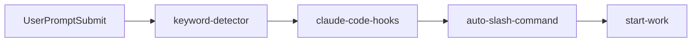
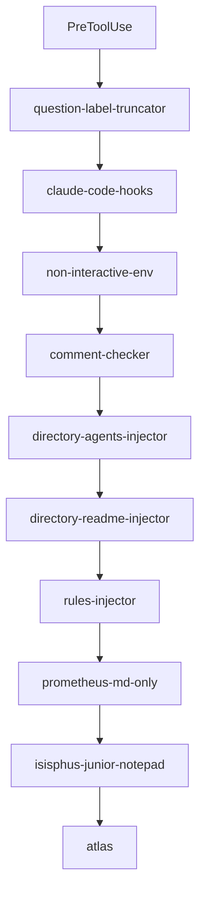
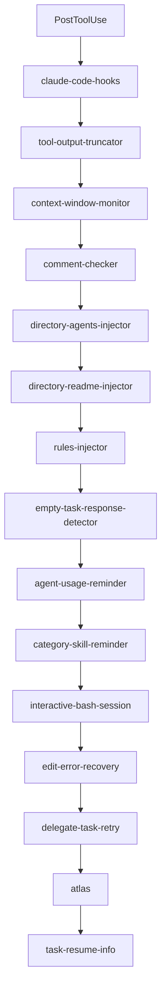
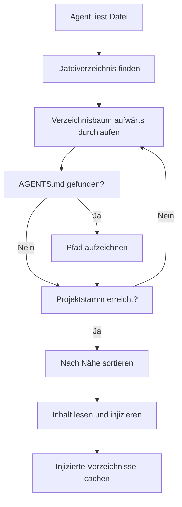
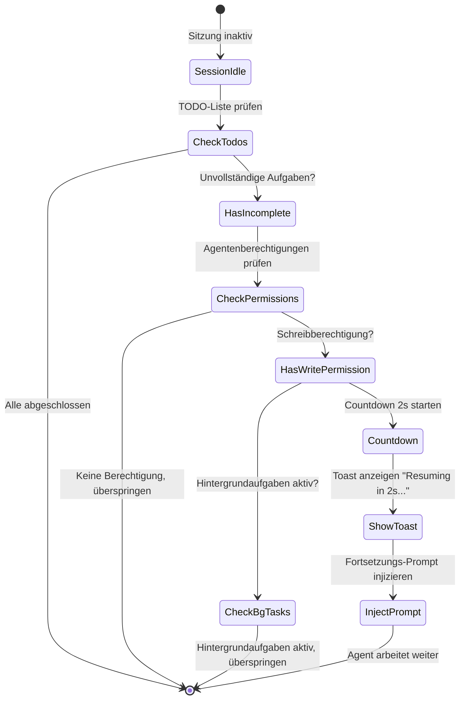
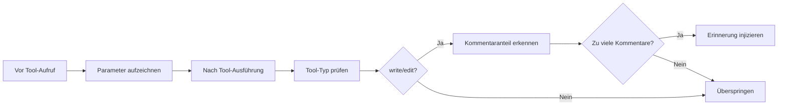

# Lifecycle-Hooks: Automatisierte Kontextsteuerung und Qualitätskontrolle

## Was Sie lernen werden

- Automatische Injektion von Projektkontext für KI-Agenten (AGENTS.md, README.md)
- Verhindern, dass Agenten vorzeitig aufhören, und Erzwingen der Fertigstellung von TODO-Listen
- Automatisches Kürzen zu großer Tool-Ausgaben zur Vermeidung von Kontextfenster-Überläufen
- Aktivierung des Ultrawork-Modus zur Einschaltung aller professionellen Agenten mit einem Klick
- Anpassung der Hook-Konfiguration und Deaktivierung nicht benötigter Funktionen

## Ihre aktuelle Herausforderung

Kennen Sie diese Probleme?

- KI-Agenten vergessen ständig Projektspezifikationen und machen wiederholt dieselben Fehler?
- Agenten hören mittendrin auf und lassen TODO-Listen unvollständig?
- Codebase-Suchergebnisse sind zu groß und sprengen das Kontextfenster?
- Sie müssen dem Agenten jedes Mal manuell mitteilen, in welchem Modus er arbeiten soll?

## Wann Sie diese Technik einsetzen sollten

Lifecycle-Hooks eignen sich für folgende Szenarien:

::: tip Typische Anwendungsfälle
- **Projektkontextverwaltung**: Automatische Injektion von AGENTS.md und README.md
- **Qualitätskontrolle**: Überprüfung von Code-Kommentaren, Validierung von Thinking-Blöcken
- **Aufgabenkontinuität**: Erzwingen der Fertigstellung aller TODO-Aufgaben durch Agenten
- **Leistungsoptimierung**: Dynamische Ausgabekürzung, Kontextfensterverwaltung
- **Workflow-Automatisierung**: Schlüsselwort-getriggerte Modi, automatische Befehlsausführung
:::

## Kernkonzept

### Was sind Lifecycle-Hooks?

**Lifecycle-Hooks** sind ein ereignisgesteuerter Mechanismus, der es Ihnen ermöglicht, benutzerdefinierte Logik an kritischen Punkten während der Agentenarbeit einzufügen. Beispiele sind die automatische Injektion von Projektdokumentation, das Erzwingen der Fertigstellung von TODO-Aufgaben oder das Kürzen zu großer Ausgaben. Diese Hooks überwachen 4 Ereignistypen: vor der Tool-Ausführung, nach der Tool-Ausführung, bei Benutzer-Prompt-Übermittlung und bei Sitzungsinaktivität. Durch sinnvolle Hook-Konfiguration können Sie KI-Agenten intelligenter machen und besser an Ihre Arbeitsgewohnheiten anpassen.

::: info Hooks vs. Middleware
Hooks ähneln der Middleware in Web-Frameworks – beide sind Mechanismen, die "zu bestimmten Zeitpunkten bestimmte Dinge tun". Der Unterschied liegt in:
- **Middleware**: Lineare Ausführung, kann Anfragen unterbrechen
- **Hooks**: Ereignisgesteuert, können nicht unterbrechen, nur Daten modifizieren
:::

### 32 Hooks in 7 Kategorien

oh-my-opencode bietet 32 integrierte Hooks in 7 Kategorien:

| Kategorie | Anzahl Hooks | Hauptfunktion |
| --- | --- | --- |
| **Kontextinjektion** | 4 | Automatische Injektion von Projektdokumentation und Regeln |
| **Produktivität & Kontrolle** | 6 | Schlüsselworterkennung, Moduswechsel, Schleifenverwaltung |
| **Qualität & Sicherheit** | 4 | Code-Kommentarprüfung, Thinking-Block-Validierung |
| **Wiederherstellung & Stabilität** | 3 | Sitzungswiederherstellung, Fehlerbehandlung |
| **Kürzung & Kontextverwaltung** | 2 | Ausgabekürzung, Fensterüberwachung |
| **Benachrichtigungen & UX** | 3 | Versionsupdates, Hintergrundaufgaben-Benachrichtigungen, Inaktivitätserinnerungen |
| **Aufgabenverwaltung** | 2 | Aufgabenwiederaufnahme, Delegierungswiederholung |

## Hook-Ereignistypen

Hooks überwachen die folgenden 4 Ereignistypen:

### 1. PreToolUse (Vor der Tool-Ausführung)

**Auslösezeitpunkt**: Bevor der Agent ein Tool aufruft

**Möglichkeiten**:
- Tool-Ausführung blockieren
- Tool-Parameter modifizieren
- Kontext injizieren

**Beispiel-Hooks**: `comment-checker`, `directory-agents-injector`

### 2. PostToolUse (Nach der Tool-Ausführung)

**Auslösezeitpunkt**: Nach Abschluss der Tool-Ausführung

**Möglichkeiten**:
- Tool-Ausgabe modifizieren
- Warnmeldungen hinzufügen
- Folgeanweisungen injizieren

**Beispiel-Hooks**: `tool-output-truncator`, `directory-readme-injector`

### 3. UserPromptSubmit (Bei Benutzer-Prompt-Übermittlung)

**Auslösezeitpunkt**: Wenn der Benutzer eine Nachricht an die Sitzung sendet

**Möglichkeiten**:
- Übermittlung blockieren (selten)
- Prompt-Inhalt modifizieren
- Systemnachrichten injizieren
- Arbeitsmodi aktivieren

**Beispiel-Hooks**: `keyword-detector`, `auto-slash-command`

### 4. Stop (Bei Sitzungsinaktivität)

**Auslösezeitpunkt**: Agent stoppt die Arbeit, Sitzung wird inaktiv

**Möglichkeiten**:
- Folge-Prompts injizieren
- Benachrichtigungen senden
- Aufgabenstatus prüfen

**Beispiel-Hooks**: `todo-continuation-enforcer`, `session-notification`

## Hook-Ausführungsreihenfolge

Hooks werden in fester Reihenfolge ausgeführt, um logische Korrektheit zu gewährleisten:

### UserPromptSubmit-Ereignis



**Reihenfolge-Erklärung**:
1. `keyword-detector`: Erkennt Schlüsselwörter (ultrawork, search, analyze)
2. `claude-code-hooks`: Führt Claude Code-Kompatibilitätsschicht-Hooks aus
3. `auto-slash-command`: Führt automatisch Slash-Befehle aus
4. `start-work`: Verarbeitet den `/start-work`-Befehl

### PreToolUse-Ereignis



**Reihenfolge-Erklärung**:
1. `question-label-truncator`: Kürzt Tool-Labels
2. `claude-code-hooks`: Claude Code-Kompatibilitätsschicht
3. `non-interactive-env`: Behandelt nicht-interaktive Umgebungen
4. `comment-checker`: Prüft Code-Kommentare
5. `directory-agents-injector`: Injiziert AGENTS.md
6. `directory-readme-injector`: Injiziert README.md
7. `rules-injector`: Injiziert Projektregeln
8. `prometheus-md-only`: Erzwingt Markdown-only-Ausgabe für Prometheus
9. `sisyphus-junior-notepad`: Injiziert Prompts für Sisyphus Junior
10. `atlas`: Atlas-Hauptorchestrierungslogik

### PostToolUse-Ereignis



**Reihenfolge-Erklärung**:
1. `claude-code-hooks`: Claude Code-Kompatibilitätsschicht
2. `tool-output-truncator`: Kürzt Tool-Ausgaben
3. `context-window-monitor`: Überwacht das Kontextfenster
4. `comment-checker`: Prüft Code-Kommentare
5. `directory-agents-injector`: Injiziert AGENTS.md
6. `directory-readme-injector`: Injiziert README.md
7. `rules-injector`: Injiziert Projektregeln
8. `empty-task-response-detector`: Erkennt leere Antworten
9. `agent-usage-reminder`: Erinnert an die Verwendung professioneller Agenten
10. `category-skill-reminder`: Erinnert an die Verwendung von Category/Skill
11. `interactive-bash-session`: Verwaltet interaktive Bash-Sitzungen
12. `edit-error-recovery`: Stellt Bearbeitungsfehler wieder her
13. `delegate-task-retry`: Wiederholt fehlgeschlagene delegierte Aufgaben
14. `atlas`: Atlas-Hauptorchestrierungslogik
15. `task-resume-info`: Liefert Informationen zur Aufgabenwiederaufnahme

## Detaillierte Erklärung der Kern-Hooks

### 1. directory-agents-injector (AGENTS.md-Injektion)

**Auslöseereignis**: PostToolUse

**Funktion**: Wenn der Agent eine Datei liest, durchläuft er automatisch vom Dateiverzeichnis aufwärts bis zum Projektstammverzeichnis, sammelt alle `AGENTS.md`-Dateien auf dem Pfad und injiziert sie in den Kontext des Agenten.

**Arbeitsablauf**:



**Beispiel**:

Projektstruktur:
```
project/
├── AGENTS.md              # Projektebenen-Kontext
├── src/
│   ├── AGENTS.md          # src-Ebenen-Kontext
│   └── components/
│       ├── AGENTS.md      # components-Ebenen-Kontext
│       └── Button.tsx
```

Wenn der Agent `Button.tsx` liest, wird automatisch injiziert:
1. `components/AGENTS.md` (zuerst injiziert)
2. `src/AGENTS.md`
3. `AGENTS.md` (Projektstamm)

::: tip Best Practice
- Erstellen Sie in jedem Hauptverzeichnis eine `AGENTS.md`, die die Verantwortlichkeiten und Spezifikationen dieses Verzeichnisses beschreibt
- AGENTS.md folgt dem "Näher-zuerst"-Prinzip: nähere Dateien haben höhere Priorität
- Bereits injizierte Verzeichnisse werden gecacht, um doppelte Injektion zu vermeiden
:::

**Quellcode-Speicherort**: `src/hooks/directory-agents-injector/index.ts` (183 Zeilen)

### 2. todo-continuation-enforcer (TODO-Fortsetzungszwang)

**Auslöseereignis**: Stop

**Funktion**: Erkennt die TODO-Liste des Agenten. Wenn unvollständige TODOs vorhanden sind, wird der Agent gezwungen, weiterzuarbeiten, um vorzeitiges Aufhören zu verhindern.

**Arbeitsablauf**:



**Countdown-Mechanismus**:
- Standard-Countdown: 2 Sekunden
- Zeigt Toast-Hinweis: "Resuming in 2s... (X tasks remaining)"
- Benutzer kann während des Countdowns manuell abbrechen

**Überspringbedingungen**:
1. Agent hat keine Schreibberechtigung (read-only Agent)
2. Agent ist auf der Überspringliste (prometheus, compaction)
3. Hintergrundaufgaben laufen
4. Sitzung wird gerade wiederhergestellt

**Quellcode-Speicherort**: `src/hooks/todo-continuation-enforcer.ts` (490 Zeilen)

### 3. keyword-detector (Schlüsselworterkennung)

**Auslöseereignis**: UserPromptSubmit

**Funktion**: Erkennt Schlüsselwörter im Benutzer-Prompt und aktiviert automatisch den entsprechenden Modus:

| Schlüsselwort | Aktivierter Modus | Beschreibung |
| --- | --- | --- |
| `ultrawork` / `ulw` | **Maximale Leistung** | Aktiviert alle professionellen Agenten und parallele Aufgaben |
| `search` / `find` | **Parallele Erkundung** | Startet explore/librarian parallel |
| `analyze` / `investigate` | **Tiefenanalyse** | Aktiviert tiefe Erkundung und Analyse |

**Anwendungsbeispiel**:

```
Benutzereingabe:
ultrawork Entwickle eine REST API mit Authentifizierung und Autorisierung

Systemantwort:
[✅ Ultrawork Mode Activated]
Maximum precision engaged. All agents at your disposal.
```

**Implementierungsdetails**:
- Schlüsselworterkennung unterstützt Varianten (ultrawork = ulw)
- Hauptsitzungen und Nicht-Hauptsitzungen werden unterschiedlich behandelt
- Moduseinstellungen werden über `message.variant` an den Agenten übergeben
- Hintergrundaufgaben-Sitzungen führen keine Schlüsselworterkennung durch

**Quellcode-Speicherort**: `src/hooks/keyword-detector/index.ts` (101 Zeilen)

### 4. tool-output-truncator (Tool-Ausgabekürzung)

**Auslöseereignis**: PostToolUse

**Funktion**: Kürzt dynamisch zu große Tool-Ausgaben, behält 50% Kontextfenster-Headroom bei, maximale Kürzung auf 50k Tokens.

**Unterstützte Tools**:

```typescript
const TRUNCATABLE_TOOLS = [
  "grep", "Grep", "safe_grep",
  "glob", "Glob", "safe_glob",
  "lsp_diagnostics",
  "ast_grep_search",
  "interactive_bash", "Interactive_bash",
  "skill_mcp",
  "webfetch", "WebFetch",
]
```

**Spezielle Limits**:
- `webfetch` maximal 10k Tokens (Webinhalte erfordern aggressivere Kürzung)
- Andere Tools maximal 50k Tokens

**Kürzungsstrategie**:
1. Berechnet den Kürzungspunkt dynamisch basierend auf dem verbleibenden Kontextfenster
2. Behält Anfang und Ende der Ausgabe bei, ersetzt die Mitte durch Auslassungspunkte
3. Fügt Kürzungshinweis hinzu: `[Note: Content was truncated to save context window space. For full context, please read file directly: {path}]`

::: warning Aggressivere Kürzung aktivieren
Konfigurieren Sie in `oh-my-opencode.json`:
```json
{
  "experimental": {
    "truncate_all_tool_outputs": true
  }
}
```
Dies kürzt alle Tool-Ausgaben, nicht nur die in der TRUNCATABLE_TOOLS-Liste.
:::

**Quellcode-Speicherort**: `src/hooks/tool-output-truncator.ts` (62 Zeilen)

### 5. comment-checker (Code-Kommentarprüfung)

**Auslöseereignis**: PreToolUse / PostToolUse

**Funktion**: Prüft, ob der Agent zu viele Kommentare schreibt, ignoriert intelligent BDD, Anweisungen und Docstrings.

**Arbeitsablauf**:



**Intelligente Ignorierregeln**:
- BDD (Behavior-Driven Development) Kommentare
- Anweisungskommentare (wie `// TODO`, `// FIXME`)
- Docstrings

**Konfigurationsmethode**:

```json
{
  "comment_checker": {
    "custom_prompt": "Ihr benutzerdefinierter Prompt"
  }
}
```

**Quellcode-Speicherort**: `src/hooks/comment-checker/index.ts` (172 Zeilen)

## Hook-Konfiguration

### Hooks aktivieren/deaktivieren

Konfigurieren Sie in `oh-my-opencode.json`:

```json
{
  "disabled_hooks": [
    "comment-checker",
    "auto-update-checker",
    "keyword-detector"
  ]
}
```

### Häufige Konfigurationsszenarien

#### Szenario 1: Kommentarprüfung deaktivieren

```json
{
  "disabled_hooks": ["comment-checker"]
}
```

#### Szenario 2: Schlüsselworterkennung deaktivieren

```json
{
  "disabled_hooks": ["keyword-detector"]
}
```

#### Szenario 3: TODO-Fortsetzungszwang deaktivieren

```json
{
  "disabled_hooks": ["todo-continuation-enforcer"]
}
```

#### Szenario 4: Aggressive Ausgabekürzung aktivieren

```json
{
  "experimental": {
    "truncate_all_tool_outputs": true
  }
}
```

## Zusammenfassung

Diese Lektion hat die 32 Lifecycle-Hooks von oh-my-opencode vorgestellt:

**Kernkonzepte**:
- Hooks sind ereignisgesteuerte Abfangmechanismen
- 4 Ereignistypen: PreToolUse, PostToolUse, UserPromptSubmit, Stop
- Ausführung in fester Reihenfolge zur Gewährleistung logischer Korrektheit

**Häufig verwendete Hooks**:
- `directory-agents-injector`: Automatische AGENTS.md-Injektion
- `todo-continuation-enforcer`: Erzwingt Fertigstellung der TODO-Liste
- `keyword-detector`: Schlüsselworterkennung zur Modusaktivierung
- `tool-output-truncator`: Dynamische Ausgabekürzung
- `comment-checker`: Code-Kommentarprüfung

**Konfigurationsmethoden**:
- Nicht benötigte Hooks über das `disabled_hooks`-Array deaktivieren
- Experimentelle Funktionen über `experimental`-Konfiguration aktivieren

## Vorschau auf die nächste Lektion

> In der nächsten Lektion lernen wir **[Slash-Befehle: Vordefinierte Workflows](../slash-commands/)**.
>
> Sie werden lernen:
> - Die Verwendung der 6 integrierten Slash-Befehle
> - `/ralph-loop` zur automatischen Arbeitsfertigstellung
> - `/refactor` für intelligentes Refactoring
> - `/start-work` zur Ausführung von Prometheus-Plänen
> - Wie Sie benutzerdefinierte Slash-Befehle erstellen

---

## Anhang: Quellcode-Referenz

<details>
<summary><strong>Klicken Sie hier, um die Quellcode-Speicherorte anzuzeigen</strong></summary>

> Aktualisierungsdatum: 2026-01-26

| Funktion | Dateipfad | Zeile |
| --- | --- | --- |
| --- | --- | --- |
| --- | --- | --- |
| --- | --- | --- |
| --- | --- | --- |
| --- | --- | --- |
| --- | --- | --- |
| --- | --- | --- |
| --- | --- | --- |

**Wichtige Konstanten**:
- `AGENTS_FILENAME = "AGENTS.md"`: Agenten-Kontextdateiname (`src/hooks/directory-agents-injector/constants.ts`)
- `DEFAULT_MAX_TOKENS = 50_000`: Standard-Maximum für Kürzungs-Tokens (`src/hooks/tool-output-truncator.ts`)
- `WEBFETCH_MAX_TOKENS = 10_000`: webfetch-Maximum für Kürzungs-Tokens (`src/hooks/tool-output-truncator.ts`)
- `COUNTDOWN_SECONDS = 2`: TODO-Fortsetzungs-Countdown in Sekunden (`src/hooks/todo-continuation-enforcer.ts`)

**Wichtige Funktionen**:
- `createDirectoryAgentsInjectorHook(ctx)`: Erstellt den AGENTS.md-Injektions-Hook
- `createTodoContinuationEnforcer(ctx, options)`: Erstellt den TODO-Fortsetzungszwang-Hook
- `createKeywordDetectorHook(ctx, collector)`: Erstellt den Schlüsselworterkennungs-Hook
- `createToolOutputTruncatorHook(ctx, options)`: Erstellt den Tool-Ausgabekürzungs-Hook
- `createCommentCheckerHooks(config)`: Erstellt die Code-Kommentarprüfungs-Hooks

</details>
