# LSP & AST-Grep: Code-Analyse und -Manipulation auf IDE-Niveau

## Was Sie nach diesem Tutorial können werden

- LSP-Tools verwenden, um in der Codebasis zu navigieren, Symbole zu finden und Diagnoseinformationen abzurufen
- AST-Grep für präzise Code-Pattern-Suche und -Ersetzung einsetzen
- Die Unterschiede zwischen LSP und AST-Grep verstehen sowie deren Anwendungsfälle kennen
- Agenten mit Code-Verständnis und -Manipulation auf IDE-Niveau ausstatten

## Ihr aktuelles Problem

Traditionelle Code-Such- und Refactoring-Tools haben offensichtliche Einschränkungen:

| Problem | Traditionelle Lösung | Tatsächlicher Bedarf |
| --- | --- | --- |
| **Ungenaue Symbol-Navigation** | Einfacher String-Matching | Semantisches Code-Verständnis erforderlich, Sprung zur echten Definition |
| **Unvollständige Referenzsuche** | Regex-Suche | Präzises Referenz-Tracking über Dateien und Scopes hinweg erforderlich |
| **Unsicheres Refactoring** | Manuelle Ersetzung + grep | Code-Struktur-Verständnis erforderlich, destruktive Änderungen vermeiden |
| **Umständliches Pattern-Matching** | Reguläre Ausdrücke | AST-basiertes strukturelles Pattern-Matching erforderlich |

::: info Schlüsselkonzepte
**LSP (Language Server Protocol)** ist ein Standardprotokoll zwischen IDE und Language-Server, das über eine einheitliche Schnittstelle Funktionen wie Code-Vervollständigung, Zur-Definition-Springen, Referenzen-Suche, Symbol-Umbenennung, Diagnoseinformationen und Symbol-Übersicht bereitstellt. Es verleiht Editoren leistungsstarke Code-Verständnis-Fähigkeiten und unterstützt erweiterte Features wie Typinformationen und Vererbungsbeziehungen. **AST-Grep** ist ein auf abstrakten Syntaxbäumen basierendes Code-Pattern-Matching-Tool, das Code-Strukturen versteht statt nur Text. Es unterstützt flexible Pattern-Matching und Massen-Refactoring mit Meta-Variablen (wie `$VAR` für einzelne Knoten, `$$$` für mehrere Knoten) und deckt 25 Programmiersprachen ab (einschließlich TypeScript, Python, Go, Rust usw.). Es ist ein mächtiges Werkzeug für Code-Refactoring, Konformitätsprüfungen und strukturelle Suche.
:::

## Wann Sie diese Technik einsetzen sollten

| Tool | Anwendungsfall | Beispiel |
| --- | --- | --- |
| **LSP-Tools** | Wenn IDE-Funktionen benötigt werden | Zur Definition springen, alle Referenzen finden, Fehlerliste abrufen, Symbole umbenennen |
| **AST-Grep** | Wenn Code-Pattern-Matching benötigt wird | Spezifische Code-Strukturen suchen, Massen-Refactoring, Code-Konformität prüfen |
| **Grep/Glob** | Einfache Textsuche | Funktionsnamen finden, Dateinamen-Matching |

## 🎒 Vorbereitung

Bevor Sie LSP- und AST-Grep-Tools verwenden, stellen Sie sicher:

1. **Language Server installiert**
   - TypeScript/JavaScript: `npm install -g typescript-language-server`
   - Python: `pip install basedpyright` oder `pip install ruff`
   - Go: `go install golang.org/x/tools/gopls@latest`
   - Rust: `rustup component add rust-analyzer`

2. **AST-Grep CLI installiert**
   ```bash
   bun add -D @ast-grep/cli
   ```

3. **LSP-Server konfiguriert**
   - LSP-Server werden in OpenCodes `opencode.json` konfiguriert
   - oh-my-opencode liest und verwendet diese Konfigurationen automatisch

::: tip Umgebung prüfen
Verwenden Sie folgende Befehle zur Umgebungsprüfung:
```bash
# LSP-Server prüfen
oh-my-opencode doctor

# AST-Grep prüfen
which sg
```
:::

## Kernkonzept

### LSP-Tools: Code-Verständnis auf IDE-Niveau

LSP-Tools verleihen KI-Agenten die gleichen Code-Verständnis-Fähigkeiten wie IDEs:


**Kernvorteile**:
- ✅ Semantisches Verständnis statt einfachem String-Matching
- ✅ Präzises Tracking über Dateien und Scopes hinweg
- ✅ Unterstützung für erweiterte Features wie Typinformationen und Vererbungsbeziehungen
- ✅ Vollständig konsistent mit Projektkonfiguration (verwendet denselben LSP-Server)

### AST-Grep: Strukturelles Code-Pattern-Matching

AST-Grep ermöglicht KI-Agenten präzises Code-Struktur-Matching:

```mermaid
graph LR
  A[AST-Grep Pattern] --> B[Code als AST parsen]
  B --> C[Strukturelles Matching]
  C --> D[Code-Knoten extrahieren/ersetzen]
  D --> E[Massen-Refactoring/Prüfung]
```



**Kernvorteile**:
- ✅ Basiert auf Code-Struktur statt Text
- ✅ Unterstützt Meta-Variablen (`$VAR`, `$$$`) für Pattern-Matching
- ✅ Unterstützt mehrere Sprachen (25)
- ✅ Verwendbar für Refactoring, Prüfungen und Code-Konformitäts-Validierung

## Schritt-für-Schritt-Anleitung

### Schritt 1: Mit LSP zur Definition springen

**Warum**
Wenn Sie die Definitionsstelle eines Symbols sehen möchten, bietet LSPs `goto_definition`-Tool präzise Navigation, zuverlässiger als String-Suche.

In OpenCode kann der Agent automatisch aufrufen:

```typescript
// Agent ruft automatisch auf
lsp_goto_definition({
  filePath: "src/utils.ts",
  line: 15,
  character: 10
})
```

**Was Sie sehen sollten**:
```
→ Definition found:
  File: src/types.ts
  Line: 45
  Text: export interface UserConfig {
```

::: tip Praktische Verwendung
Sie müssen diese Tools nicht manuell aufrufen, der KI-Agent verwendet sie automatisch zum Code-Verständnis. Sie können direkt fragen: "Spring zur Definition dieser Funktion" oder "Wo ist diese Variable definiert?"
:::

### Schritt 2: Alle Referenzen finden

**Warum**
Wenn Sie ein Symbol ändern möchten, stellt das vorherige Finden aller Referenzen sicher, dass die Änderung keine anderen Verwendungsstellen beschädigt.

Der Agent kann aufrufen:

```typescript
lsp_find_references({
  filePath: "src/api.ts",
  line: 10,
  character: 5,
  includeDeclaration: true  // Ob die Definition selbst eingeschlossen werden soll
})
```

**Was Sie sehen sollten**:
```
Found 15 references (showing first 200):
  src/api.ts:10:5  - [definition] fetchData
  src/components/List.tsx:23:12 - [usage] fetchData()
  src/pages/Home.tsx:45:8 - [usage] fetchData()
  ...
```

### Schritt 3: Datei-Symbole und Workspace-Symbole abrufen

**Warum**
Beim Verstehen der Dateistruktur oder beim Suchen bestimmter Symboltypen im gesamten Projekt ist das `lsp_symbols`-Tool sehr nützlich.

**Datei-Übersicht** (scope="document"):

```typescript
lsp_symbols({
  filePath: "src/app.tsx",
  scope: "document"
})
```

**Was Sie sehen sollten**:
```
Found 12 symbols:
  [Component] App (line: 10-150)
    [Function] useEffect (line: 25-35)
    [Function] handleClick (line: 40-55)
    [Variable] count (line: 15)
  ...
```

**Workspace-Suche** (scope="workspace"):

```typescript
lsp_symbols({
  filePath: "src/app.tsx",
  scope: "workspace",
  query: "fetchData"
})
```

### Schritt 4: Diagnoseinformationen abrufen

**Warum**
Vor dem Ausführen von Code kann LSPs Diagnose-Tool Fehler, Warnungen und Hinweise im Voraus erkennen.

```typescript
lsp_diagnostics({
  filePath: "src/utils.ts",
  severity: "error"  // Optional: "error", "warning", "information", "hint", "all"
})
```

**Was Sie sehen sollten**:
```
Found 3 diagnostics:
  [Error] src/utils.ts:23:5 - 'result' is used before being assigned
  [Warning] src/utils.ts:45:12 - Unused variable 'temp'
  [Hint] src/utils.ts:67:8 - This can be simplified to const x = value
```

::: tip Vorabprüfung
Lassen Sie den KI-Agenten vor dem Schreiben von Code `lsp_diagnostics` verwenden, um potenzielle Probleme zu prüfen und wiederholte Änderungen zu vermeiden.
:::

### Schritt 5: Symbole sicher umbenennen

**Warum**
Das Umbenennen von Symbolen ist eine häufige Refactoring-Operation, aber manuelle Ersetzung ist fehleranfällig. LSPs `lsp_rename`-Tool kann Symbole sicher im gesamten Workspace umbenennen.

**Schritt 1: Umbenennung validieren**

```typescript
lsp_prepare_rename({
  filePath: "src/api.ts",
  line: 10,
  character: 5
})
```

**Was Sie sehen sollten**:
```
Rename validation:
  Current name: fetchData
  Placeholder range: line 10, column 5-14
  Status: ✅ Valid
```

**Schritt 2: Umbenennung ausführen**

```typescript
lsp_rename({
  filePath: "src/api.ts",
  line: 10,
  character: 5,
  newName: "fetchUserData"
})
```

**Was Sie sehen sollten**:
```
Applied rename to 15 files:
  src/api.ts:10:5 - fetchData → fetchUserData
  src/components/List.tsx:23:12 - fetchData() → fetchUserData()
  src/pages/Home.tsx:45:8 - fetchData → fetchUserData()
  ...
```

### Schritt 6: Code-Patterns mit AST-Grep suchen

**Warum**
Wenn Sie spezifische Code-Strukturen finden müssen (wie alle Stellen mit `console.log`), ist AST-Grep präziser als grep.

**Basis-Pattern-Suche**:

```typescript
ast_grep_search({
  pattern: "console.log($MSG)",
  lang: "typescript",
  paths: ["src"],
  context: 2  // Anzahl der Kontextzeilen vor und nach dem Match anzeigen
})
```

**Was Sie sehen sollten**:
```
src/utils.ts:15:
  13 | function debug(message) {
  14 |   console.log(message)
  15 |   console.log("Debug mode")
  16 | }
  17 | }

src/components/App.tsx:23:
  21 | useEffect(() => {
  22 |   console.log("Component mounted")
  23 | }, [])
```

**Meta-Variablen verwenden**:

```typescript
// Alle Funktionsaufrufe matchen
ast_grep_search({
  pattern: "$FUNC($$$)",
  lang: "typescript",
  paths: ["src"]
})
```

```typescript
// Alle async-Funktionen matchen
ast_grep_search({
  pattern: "async function $NAME($$$) { $$$ }",
  lang: "typescript",
  paths: ["src"]
})
```

::: warning Wichtig: Pattern muss vollständiger AST-Knoten sein
❌ Falsch: `export async function $NAME`
✅ Richtig: `export async function $NAME($$$) { $$$ }`

Pattern muss ein gültiges Code-Fragment sein, einschließlich vollständiger Funktionssignatur und Funktionskörper.
:::

### Schritt 7: Massen-Ersetzung mit AST-Grep

**Warum**
Wenn Sie Code in großem Umfang refactoren müssen (z.B. alle `console.log` durch `logger.info` ersetzen), ist AST-Greps Ersetzungsfunktion sehr mächtig.

**Ersetzung vorschauen** (dry-run):

```typescript
ast_grep_replace({
  pattern: "console.log($MSG)",
  rewrite: "logger.info($MSG)",
  lang: "typescript",
  paths: ["src"],
  dryRun: true  // Standard ist true, nur Vorschau ohne Änderung
})
```

**Was Sie sehen sollten**:
```
Preview changes (dry-run):
  src/utils.ts:15:2 - console.log("Debug mode")
                 → logger.info("Debug mode")
  src/components/App.tsx:23:4 - console.log("Component mounted")
                              → logger.info("Component mounted")

Total: 2 changes
```

**Ersetzung anwenden**:

```typescript
ast_grep_replace({
  pattern: "console.log($MSG)",
  rewrite: "logger.info($MSG)",
  lang: "typescript",
  paths: ["src"],
  dryRun: false  // Auf false setzen, um Änderungen anzuwenden
})
```

**Was Sie sehen sollten**:
```
Applied 2 changes:
  src/utils.ts:15:2 - console.log("Debug mode")
                 → logger.info("Debug mode")
  src/components/App.tsx:23:4 - console.log("Component mounted")
                              → logger.info("Component mounted")
```

::: danger Destruktive Operation
`ast_grep_replace` mit `dryRun: false` ändert Dateien direkt. Empfehlung:
1. Zuerst mit `dryRun: true` vorschauen
2. Nach Bestätigung anwenden
3. Wenn das Projekt Git verwendet, aktuellen Zustand zuerst committen
:::

## Checkpoint ✅

**LSP-Tools validieren**:
- [ ] Können Sie zur Symbol-Definition springen?
- [ ] Können Sie alle Referenzen finden?
- [ ] Können Sie Diagnoseinformationen abrufen?
- [ ] Können Sie Symbole sicher umbenennen?

**AST-Grep-Tools validieren**:
- [ ] Können Sie Code-Patterns suchen?
- [ ] Können Sie Meta-Variablen-Matching verwenden?
- [ ] Können Sie Ersetzungen vorschauen und ausführen?

## Häufige Stolpersteine

### LSP-Tools häufige Probleme

| Problem | Ursache | Lösung |
| --- | --- | --- |
| **Definition nicht gefunden** | LSP-Server nicht gestartet oder falsch konfiguriert | `opencode.json` LSP-Konfiguration prüfen |
| **Unvollständige Referenzliste** | Code enthält Fehler, LSP-Server hat nicht vollständig analysiert | Fehler im Code zuerst beheben |
| **Umbenennung fehlgeschlagen** | Neuer Name kollidiert mit bestehendem Symbol | Spezifischeren Namen verwenden |

### AST-Grep häufige Probleme

| Problem | Ursache | Lösung |
| --- | --- | --- |
| **Pattern matcht nicht** | Pattern unvollständig oder Syntaxfehler | Sicherstellen, dass Pattern vollständiger AST-Knoten ist |
| **Python-Pattern nachgestellter Doppelpunkt** | Pythons `def` und `class` benötigen keinen Doppelpunkt | ❌ `def func():` → ✅ `def func($$$):` |
| **Zu viele Matches** | Pattern zu weit gefasst | Spezifischeren Kontext verwenden oder Pfad einschränken |

### Performance-Optimierungs-Empfehlungen

```typescript
// ✅ Gut: Suchbereich einschränken
ast_grep_search({
  pattern: "$FUNC($$$)",
  lang: "typescript",
  paths: ["src/api"],  // Nur bestimmtes Verzeichnis durchsuchen
  globs: ["*.ts"]      // Nur bestimmte Dateien matchen
})

// ❌ Schlecht: Gesamtes Projekt durchsuchen
ast_grep_search({
  pattern: "$FUNC($$$)",
  lang: "typescript",
  paths: ["./"]  // Alle Dateien durchsuchen
})
```

## Vollständige LSP-Tools-Liste

| Tool | Funktion | Parameter |
| --- | --- | --- |
| `lsp_goto_definition` | Zur Symbol-Definition springen | `filePath`, `line`, `character` |
| `lsp_find_references` | Alle Referenzen finden | `filePath`, `line`, `character`, `includeDeclaration?` |
| `lsp_symbols` | Datei-Übersicht oder Workspace-Symbole abrufen | `filePath`, `scope`, `query?`, `limit?` |
| `lsp_diagnostics` | Fehler und Warnungen abrufen | `filePath`, `severity?` |
| `lsp_prepare_rename` | Umbenennung validieren | `filePath`, `line`, `character` |
| `lsp_rename` | Umbenennung ausführen | `filePath`, `line`, `character`, `newName` |

**Einschränkungen**:
- Maximal 200 Symbole, Referenzen oder Diagnosen zurückgegeben (konfigurierbar)
- LSP-Server muss konfiguriert und laufend sein

## Vollständige AST-Grep-Tools-Liste

| Tool | Funktion | Parameter |
| --- | --- | --- |
| `ast_grep_search` | AST-Pattern-Suche | `pattern`, `lang`, `paths?`, `globs?`, `context?` |
| `ast_grep_replace` | AST-Pattern-Ersetzung | `pattern`, `rewrite`, `lang`, `paths?`, `globs?`, `dryRun?` |

**Unterstützte Sprachen** (25):
`bash`, `c`, `cpp`, `csharp`, `css`, `elixir`, `go`, `haskell`, `html`, `java`, `javascript`, `json`, `kotlin`, `lua`, `nix`, `php`, `python`, `ruby`, `rust`, `scala`, `solidity`, `swift`, `typescript`, `tsx`, `yaml`

**Meta-Variablen**:
- `$VAR` - Matcht einzelnen Knoten
- `$$$` - Matcht mehrere Knoten

## Praxisbeispiele

### Beispiel 1: API-Aufrufe refactoren

**Szenario**: Fehlerbehandlung zu allen `fetch`-Aufrufen hinzufügen

**Pattern mit AST-Grep finden**:

```typescript
ast_grep_search({
  pattern: "fetch($URL).then($RES => $BODY)",
  lang: "typescript",
  paths: ["src/api"]
})
```

**Mit AST-Grep ersetzen**:

```typescript
ast_grep_replace({
  pattern: "fetch($URL).then($RES => $BODY)",
  rewrite: "fetch($URL).then($RES => $BODY).catch(err => handleError(err))",
  lang: "typescript",
  paths: ["src/api"],
  dryRun: true  // Zuerst vorschauen
})
```

### Beispiel 2: Ungenutzte Imports finden

**Referenzen mit LSP finden**:

```typescript
// Für jeden Import
lsp_find_references({
  filePath: "src/utils.ts",
  line: 1,  // Zeile des Imports
  character: 10
})

// Wenn nur 1 Referenz zurückgegeben wird (der Import selbst), ist er ungenutzt
```

### Beispiel 3: Konfigurationsvariable umbenennen

**Schritt 1: Umbenennung validieren**

```typescript
lsp_prepare_rename({
  filePath: "src/config.ts",
  line: 10,
  character: 4
})
```

**Schritt 2: Umbenennung ausführen**

```typescript
lsp_rename({
  filePath: "src/config.ts",
  line: 10,
  character: 4,
  newName: "API_BASE_URL"
})
```

## Zusammenfassung

Dieses Tutorial stellte oh-my-opencodes LSP-Tools und AST-Grep-Tools vor:

**LSP-Tools**:
- Bieten Code-Verständnis und -Manipulation auf IDE-Niveau
- Unterstützen Zur-Definition-Springen, Referenzen-Suche, Diagnose-Abruf, Symbol-Umbenennung
- Verwenden projektspezifisch konfigurierte LSP-Server, konsistent mit IDE-Verhalten

**AST-Grep-Tools**:
- AST-basiertes strukturelles Code-Pattern-Matching
- Unterstützen Meta-Variablen für flexibles Matching
- Unterstützen Massen-Ersetzung und Refactoring

**Best Practices**:
- LSP für Szenarien verwenden, die semantisches Verständnis erfordern
- AST-Grep für strukturelles Code-Refactoring verwenden
- Vor Ersetzung zuerst mit dryRun vorschauen

## Vorschau auf die nächste Lektion

> In der nächsten Lektion lernen wir **[Categories und Skills: Dynamische Agent-Komposition](../categories-skills/)**.
>
> Sie werden lernen:
> - Wie man Categories verwendet, um automatisch das optimale Modell auszuwählen
> - Wie man verschiedene Skills kombiniert, um spezialisierte Agenten zu erstellen
> - Praktische Anwendungsfälle der v3.0-Features

---

## Anhang: Quellcode-Referenz

<details>
<summary><strong>Klicken Sie hier, um Quellcode-Positionen anzuzeigen</strong></summary>

> Aktualisiert am: 2026-01-26

### LSP-Tools

| Funktion | Dateipfad | Zeilen |
| --- | --- | --- |
| LSP-Tool-Definitionen | [`src/tools/lsp/tools.ts`](https://github.com/code-yeongyu/oh-my-opencode/blob/main/src/tools/lsp/tools.ts) | 29-261 |
| LSP-Client-Implementierung | [`src/tools/lsp/client.ts`](https://github.com/code-yeongyu/oh-my-opencode/blob/main/src/tools/lsp/client.ts) | 1-596 |
| LSP-Konstanten-Definitionen | [`src/tools/lsp/constants.ts`](https://github.com/code-yeongyu/oh-my-opencode/blob/main/src/tools/lsp/constants.ts) | 1-391 |
| LSP-Typ-Definitionen | [`src/tools/lsp/types.ts`](https://github.com/code-yeongyu/oh-my-opencode/blob/main/src/tools/lsp/types.ts) | 1-246 |

### AST-Grep-Tools

| Funktion | Dateipfad | Zeilen |
| --- | --- | --- |
| --- | --- | --- |
| --- | --- | --- |
| --- | --- | --- |
| --- | --- | --- |
| --- | --- | --- |

**Wichtige Konstanten**:
- `DEFAULT_MAX_REFERENCES = 200` - Maximale Anzahl zurückgegebener Referenzen
- `DEFAULT_MAX_SYMBOLS = 200` - Maximale Anzahl zurückgegebener Symbole
- `DEFAULT_MAX_DIAGNOSTICS = 200` - Maximale Anzahl zurückgegebener Diagnosen
- `CLI_LANGUAGES` - Liste der 25 unterstützten Sprachen
- `DEFAULT_MAX_MATCHES = 500` - AST-Grep maximale Match-Anzahl

**Wichtige Tool-Funktionen**:
- `withLspClient()` - LSP-Client abrufen und Operation ausführen
- `runSg()` - AST-Grep CLI-Befehl ausführen
- `formatLocation()` - Positionsinformationen formatieren
- `formatDiagnostic()` - Diagnoseinformationen formatieren

**Unterstützte LSP-Server** (Auswahl):
- TypeScript: `typescript-language-server`
- Python: `basedpyright`, `pyright`, `ty`, `ruff`
- Go: `gopls`
- Rust: `rust-analyzer`
- C/C++: `clangd`

</details>
