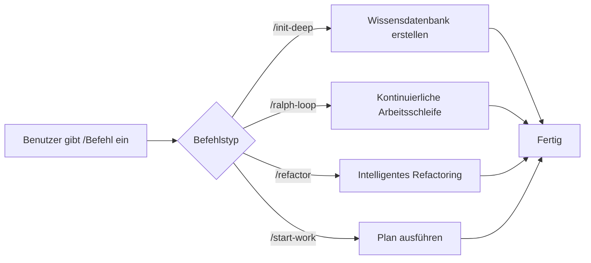

# Slash-Befehle: Voreingestellte Workflows, komplexe Aufgaben mit einem Klick auslösen

## Was Sie nach diesem Tutorial können

- Verwenden Sie `/init-deep`, um mit einem Klick eine Projekt-Wissensdatenbank zu erstellen
- Lassen Sie den Agenten mit `/ralph-loop` kontinuierlich arbeiten, bis die Aufgabe erledigt ist
- Führen Sie mit `/refactor` intelligente Refactorings durch und verifizieren Sie automatisch jeden Schritt
- Beginnen Sie mit `/start-work` die systematische Entwicklung ab einem Prometheus-Plan

## Ihr aktuelles Problem

Wenn Sie wiederholt dieselben komplexen Aufgaben ausführen, müssen Sie jedes Mal lange Befehle eingeben:

```
"Bitte helfen Sie mir, die Struktur dieses Projekts zu analysieren, alle wichtigen Module zu finden, für jedes Verzeichnis eine AGENTS.md zu erstellen und dann die Codebank-Muster parallel zu erkunden..."
```

Solche langen Befehle verschwenden Zeit und es passiert leicht, dass Schritte vergessen werden.

## Wann Sie diesen Ansatz verwenden

**Slash-Befehle** sind voreingestellte Workflow-Vorlagen, die mit einem Klick ausgelöst werden. Diese Befehle decken häufige Entwicklungsszenarien ab:

| Szenario | Befehl |
|----------|--------|
| Projekt-Wissensdatenbank initialisieren | `/init-deep` |
| AI kontinuierlich arbeiten lassen | `/ralph-loop` |
| Intelligentes Refactoring | `/refactor` |
| Ab einem Plan arbeiten | `/start-work` |

## Kernkonzept

**Slash-Befehle** sind vordefinierte Workflow-Vorlagen, die komplexe Aufgaben schnell über Trigger ausführen, die mit `/` beginnen.

**Funktionsweise**:



oh-my-opencode verfügt über 6 integrierte Slash-Befehle:

| Befehl | Funktion | Komplexität |
|--------|----------|-------------|
| `/init-deep` | Erstellt hierarchische AGENTS.md-Dateien | Mittel |
| `/ralph-loop` | Selbstreferenzielle Entwicklungsschleife | Hoch |
| `/ulw-loop` | Ultrawork-Version von ralph-loop | Hoch |
| `/cancel-ralph` | Bricht aktive Ralph-Schleife ab | Niedrig |
| `/refactor` | Intelligentes Refactoring, vollständige Toolkette | Hoch |
| `/start-work` | Beginnt Arbeit ab Prometheus-Plan | Mittel |

::: info Benutzerdefinierte Befehle
Neben den integrierten Befehlen können Sie im Verzeichnis `.opencode/command/` oder `.claude/commands/` benutzerdefinierte Befehle erstellen (Markdown-Dateien).
:::

## 🎒 Vorbereitungen

- ✅ oh-my-opencode installiert
- ✅ Mindestens ein AI Provider konfiguriert
- ✅ Grundlegendes Verständnis der Agenten-Nutzung (empfohlen: zuerst "Erste Schritte mit Sisyphus: Hauptorchestrator" lernen)

## Mitmachen

### Schritt 1: Projekt-Wissensdatenbank erstellen

**Warum**
AI-Agenten müssen die Projektstruktur und Konventionen kennen, um effizient zu arbeiten. Der Befehl `/init-deep` analysiert das Projekt automatisch und erstellt hierarchische AGENTS.md-Dateien.

**Geben Sie in OpenCode ein**:

```
/init-deep
```

**Sie sollten sehen**: Der Agent beginnt, die Projektstruktur parallel zu analysieren, Code-Muster zu erkunden und AGENTS.md-Dateien zu erstellen.

**Erweiterte Verwendung**:

```bash
# Alle Dateien neu erstellen (alte löschen)
/init-deep --create-new

# Erstellungstiefe begrenzen
/init-deep --max-depth=2
```

**Beispielausgabe**:

```
=== init-deep Complete ===

Mode: update

Files:
  [OK] ./AGENTS.md (root, 120 lines)
  [OK] ./src/hooks/AGENTS.md (45 lines)
  [OK] ./src/agents/AGENTS.md (38 lines)

Dirs Analyzed: 12
AGENTS.md Created: 3
```

### Schritt 2: AI kontinuierlich arbeiten lassen

**Warum**
Einige Aufgaben erfordern mehrere Iterationen, um abgeschlossen zu werden (z. B. Beheben komplexer Bugs). Der Befehl `/ralph-loop` lässt den Agenten kontinuierlich arbeiten, bis die Aufgabe erledigt ist, anstatt mittendrin abzubrechen.

**Geben Sie in OpenCode ein**:

```
/ralph-loop "Beheben Sie das Authentifizierungsproblem auf der Anmeldeseite und stellen Sie sicher, dass alle Fehlerfälle behandelt werden"
```

**Sie sollten sehen**: Der Agent beginnt zu arbeiten, setzt nach Abschluss automatisch fort, bis das Abschluss-Marker ausgegeben wird.

**Erweiterte Verwendung**:

```bash
# Benutzerdefiniertes Abschluss-Marker
/ralph-loop "Einheitentests schreiben" --completion-promise="TESTS_DONE"

# Maximale Iterationsanzahl begrenzen
/ralph-loop "Leistung optimieren" --max-iterations=50
```

**Ultrawork-Version** (aktiviert alle professionellen Agenten):

```bash
/ulw-loop "Entwickeln Sie eine REST-API mit Authentifizierung, Autorisierung und Rate-Limiting"
```

**Kontrollpunkt** ✅

- Setzt der Agent nach jeder Iteration automatisch fort?
- Sehen Sie nach Abschluss die Meldung "Ralph Loop Complete!"?

### Schritt 3: Schleife abbrechen

**Warum**
Wenn die Aufgabe in die falsche Richtung läuft oder Sie manuell eingreifen möchten, müssen Sie die Schleife abbrechen.

**Geben Sie in OpenCode ein**:

```
/cancel-ralph
```

**Sie sollten sehen**: Die Schleife stoppt und die Statusdateien werden bereinigt.

### Schritt 4: Intelligentes Refactoring

**Warum**
Beim Refactoring von Code führen blinde Änderungen zu Bugs. Der Befehl `/refactor` verwendet die vollständige Toolkette (LSP, AST-Grep, Testverifizierung), um sicheres Refactoring zu gewährleisten.

**Geben Sie in OpenCode ein**:

```bash
# Symbol umbenennen
/refactor "AuthService-Klasse zu UserService refactoren"

# Modul refactoren
/refactor src/auth --scope=module --strategy=safe

# Muster-Matching-Refactoring
/refactor "Alle Verwendungen der veralteten API zur neuen API migrieren"
```

**Sie sollten sehen**: Der Agent führt einen 6-Phasen-Refactoring-Prozess aus:

1. **Absichts-Gateway** - Bestätigt das Refactoring-Ziel
2. **Codebank-Analyse** - Erkundet Abhängigkeiten parallel
3. **Codemap-Erstellung** - Zeichnet den Einflussbereich auf
4. **Testbewertung** - Überprüft Testabdeckung
5. **Planerstellung** - Erstellt detaillierten Refactoring-Plan
6. **Refactoring ausführen** - Führt schrittweise aus und verifiziert

**Erweiterte Verwendung**:

```bash
# Aggressive Strategie (erlaubt größere Änderungen)
/refactor "Architektur-Refactoring" --strategy=aggressive

# Dateibereich
/refactor "Funktionen in utils.ts optimieren" --scope=file
```

::: warning Testabdeckungs-Anforderung
Wenn die Testabdeckung des Zielcodes unter 50% liegt, wird `/refactor` die Ausführung der aggressiven Strategie verweigern. Es wird empfohlen, zuerst Tests hinzuzufügen.
:::

### Schritt 5: Ab einem Plan arbeiten

**Warum**
Nach der Verwendung von Prometheus zur Planung müssen die Aufgaben im Plan systematisch ausgeführt werden. Der Befehl `/start-work` lädt den Plan automatisch und verwendet den Atlas-Agenten zur Ausführung.

**Geben Sie in OpenCode ein**:

```bash
# Einzelnen Plan automatisch auswählen
/start-work

# Spezifischen Plan auswählen
/start-work "auth-api-plan"
```

**Sie sollten sehen**:

- Wenn nur ein Plan vorhanden ist: automatisch ausgewählt und Ausführung beginnt
- Wenn mehrere Pläne vorhanden sind: alle Pläne werden zur Auswahl aufgelistet

**Beispielausgabe**:

```
Available Work Plans

Current Time: 2026-01-26T10:30:00Z
Session ID: abc123

1. [auth-api-plan.md] - Modified: 2026-01-25 - Progress: 3/10 tasks
2. [migration-plan.md] - Modified: 2026-01-26 - Progress: 0/5 tasks

Which plan would you like to work on? (Enter number or plan name)
```

**Kontrollpunkt** ✅

- Wird der Plan korrekt geladen?
- Werden die Aufgaben in der richtigen Reihenfolge ausgeführt?
- Werden abgeschlossene Aufgaben markiert?

## Häufige Fallstricke

### 1. `/init-deep` ignoriert vorhandene Dateien

**Problem**: Im Standardmodus behält `/init-deep` vorhandene AGENTS.md bei und aktualisiert oder erstellt nur fehlende Teile.

**Lösung**: Verwenden Sie den Parameter `--create-new`, um alle Dateien neu zu erstellen.

### 2. `/ralph-loop` Endlosschleife

**Problem**: Wenn der Agent die Aufgabe nicht erfüllen kann, läuft die Schleife bis zur maximalen Iterationsanzahl (Standard 100).

**Lösung**:
- Setzen Sie ein angemessenes `--max-iterations` (z. B. 20-30)
- Verwenden Sie `/cancel-ralph` zum manuellen Abbrechen
- Geben Sie eine klarere Aufgabenbeschreibung

### 3. `/refactor` Niedrige Testabdeckung

**Problem**: Der Zielcode hat keine Tests, das Refactoring schlägt fehl.

**Lösung**:
```bash
# Agenten bitten, zuerst Tests hinzuzufügen
"Bitte fügen Sie vollständige Einheitentests für AuthService hinzu, die alle Randfälle abdecken"

# Dann refactoren
/refactor "AuthService-Klasse refactoren"
```

### 4. `/start-work` Plan nicht gefunden

**Problem**: Der von Prometheus generierte Plan wurde nicht im Verzeichnis `.sisyphus/plans/` gespeichert.

**Lösung**:
- Überprüfen Sie, ob die Prometheus-Ausgabe den Pfad der Plan-Datei enthält
- Bestätigen Sie, dass die Dateiendung des Plans `.md` ist

### 5. Falsches Format der Befehlsparameter

**Problem**: Parameterposition oder Format ist falsch.

**Lösung**:
```bash
# ✅ Richtig
/ralph-loop "Aufgabenbeschreibung" --completion-promise=DONE

# ❌ Falsch
/ralph-loop --completion-promise=DONE "Aufgabenbeschreibung"
```

## Zusammenfassung

| Befehl | Kernfunktion | Verwendungshäufigkeit |
|--------|--------------|----------------------|
| `/init-deep` | Projekt-Wissensdatenbank automatisch erstellen | Ersteinrichtung |
| `/ralph-loop` | Kontinuierliche Arbeitsschleife | Hoch |
| `/ulw-loop` | Ultrawork-Version der Schleife | Mittel |
| `/cancel-ralph` | Schleife abbrechen | Niedrig |
| `/refactor` | Sicheres intelligentes Refactoring | Hoch |
| `/start-work` | Prometheus-Plan ausführen | Mittel |

**Best Practices**:
- Verwenden Sie `/init-deep` bei neuen Projekten, um eine Wissensdatenbank aufzubauen
- Verwenden Sie `/ralph-loop` für komplexe Aufgaben, um die AI kontinuierlich arbeiten zu lassen
- Bevorzugen Sie `/refactor` beim Refactoring von Code, um Sicherheit zu gewährleisten
- Verwenden Sie `/start-work` zusammen mit Prometheus für systematische Entwicklung

## Vorschau auf die nächste Lektion

In der nächsten Lektion lernen wir **[Erweiterte Konfiguration](../advanced-configuration/)** kennen.

Sie werden lernen:
- Wie Sie die Standardmodelle und Prompts der Agenten überschreiben
- Wie Sie Berechtigungen und Sicherheitsbeschränkungen konfigurieren
- Wie Sie benutzerdefinierte Categories und Skills erstellen
- Wie Sie die Parallelitätssteuerung von Hintergrundaufgaben anpassen

---

## Anhang: Quellcode-Referenz

<details>
<summary><strong>Klicken Sie, um Quellcode-Positionen anzuzeigen</strong></summary>

> Aktualisiert am: 2026-01-26

| Funktion | Dateipfad | Zeilennummer |
|----------|-----------|--------------|
| Befehlsdefinitionen | [`src/features/builtin-commands/commands.ts`](https://github.com/code-yeongyu/oh-my-opencode/blob/main/src/features/builtin-commands/commands.ts) | 8-73 |
| Befehlslader | [`src/features/builtin-commands/index.ts`](https://github.com/code-yeongyu/oh-my-opencode/blob/main/src/features/builtin-commands/index.ts) | 75-89 |
| init-deep Vorlage | [`src/features/builtin-commands/templates/init-deep.ts`](https://github.com/code-yeongyu/oh-my-opencode/blob/main/src/features/builtin-commands/templates/init-deep.ts) | Ganze Datei |
| ralph-loop Vorlage | [`src/features/builtin-commands/templates/ralph-loop.ts`](https://github.com/code-yeongyu/oh-my-opencode/blob/main/src/features/builtin-commands/templates/ralph-loop.ts) | Ganze Datei |
| refactor Vorlage | [`src/features/builtin-commands/templates/refactor.ts`](https://github.com/code-yeongyu/oh-my-opencode/blob/main/src/features/builtin-commands/templates/refactor.ts) | Ganze Datei |
| start-work Vorlage | [`src/features/builtin-commands/templates/start-work.ts`](https://github.com/code-yeongyu/oh-my-opencode/blob/main/src/features/builtin-commands/templates/start-work.ts) | Ganze Datei |
| Ralph Loop Hook Implementierung | [`src/hooks/ralph-loop/index.ts`](https://github.com/code-yeongyu/oh-my-opencode/blob/main/src/hooks/ralph-loop/index.ts) | Ganze Datei |
| Befehlstyp-Definitionen | [`src/features/builtin-commands/types.ts`](https://github.com/code-yeongyu/oh-my-opencode/blob/main/src/features/builtin-commands/types.ts) | Ganze Datei |

**Wichtige Funktionen**:
- `loadBuiltinCommands()`: Lädt integrierte Befehlsdefinitionen, unterstützt das Deaktivieren bestimmter Befehle
- `createRalphLoopHook()`: Erstellt Ralph Loop Lebenszyklus-Hooks
- `startLoop()`: Startet die Schleife, setzt Status und Parameter
- `cancelLoop()`: Bricht aktive Schleife ab, bereinigt Statusdateien

**Wichtige Konstanten**:
- `DEFAULT_MAX_ITERATIONS = 100`: Standardmäßige maximale Iterationsanzahl
- `DEFAULT_COMPLETION_PROMISE = "DONE"`: Standardmäßiges Abschluss-Marker

**Konfigurationsposition**:
- Befehle deaktivieren: Feld `disabled_commands` in `oh-my-opencode.json`
- Schleifenkonfiguration: Objekt `ralph_loop` in `oh-my-opencode.json`

</details>
