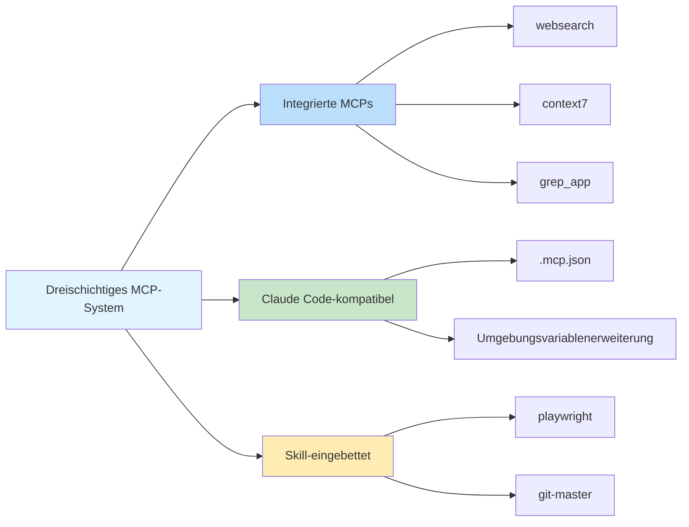

# Integrierte MCP-Server: Websuche, Dokumentationsabfrage und Codesuche

## Was Sie lernen werden

- ✅ Die 3 integrierten MCP-Server und ihre Anwendungsfälle verstehen
- ✅ Wissen, wie Sie den Exa-Websuche-API-Schlüssel konfigurieren
- ✅ Lernen, unnötige MCP-Dienste zu deaktivieren
- ✅ Die Architektur und Arbeitsprinzipien des dreischichtigen MCP-Systems verstehen

## Ihre aktuelle Herausforderung

KI-Agenten können nur auf lokale Dateien zugreifen und Netzwerkanfragen stellen, aber ihnen fehlen professionelle Such- und Dokumentationsabfragefähigkeiten. Sie möchten, dass Agenten Folgendes können können:
- Das Web in Echtzeit nach den neuesten Informationen durchsuchen
- Offizielle Dokumentationen für genaue API-Beschreibungen konsultieren
- GitHub-Repositories nach Implementierungsbeispielen durchsuchen

Aber die manuelle Implementierung dieser Funktionen erhöht die Entwicklungskomplexität.

## Wann dieser Ansatz verwendet werden sollte

Wenn Sie die Fähigkeiten von KI-Agenten erweitern müssen:

| Szenario | Empfohlenes MCP |
|----------|----------------|
| Neueste technische Informationen, Nachrichten oder Branchentrends abrufen | **websearch** (Exa) |
| Offizielle API-Dokumentation für Bibliotheken oder Frameworks abfragen | **context7** |
| Implementierungsbeispiele in GitHub-Repositories finden | **grep_app** (Grep.app) |

## Kernkonzepte: Was ist MCP?

**MCP (Model Context Protocol)** ist ein Standardprotokoll, das KI-Agenten den Zugriff auf externe Tools und Datenquellen ermöglicht. Einfach ausgedrückt:

::: info Was ist MCP?
MCP ist wie das Ausstatten eines KI-Agenten mit einem "Werkzeugkasten", der verschiedene professionelle Tools (Suche, Datenbanken, APIs usw.) enthält. Agenten können diese Tools bei Bedarf aufrufen, um auf Fähigkeiten zuzugreifen, die lokal nicht verfügbar sind.
:::

Oh-My-OpenCode bietet ein **dreischichtiges MCP-System**:



**Diese Lektion konzentriert sich auf die erste Schicht: integrierte MCP-Server.**

---

## Drei integrierte MCP-Server

Oh-My-OpenCode enthält 3 Remote-MCP-Server, die sofort einsatzbereit sind (einige erfordern die Konfiguration eines API-Schlüssels).

### 1. websearch (Exa AI)

**Funktion**: Echtzeit-Websuche, unterstützt von [Exa AI](https://exa.ai).

**Anwendungsfälle**:
- Nach den neuesten technischen Artikeln und Nachrichten suchen
- Lösungen für spezifische Probleme finden
- Branchentrends und Best Practices abrufen

**Konfigurationsanforderungen**:

Sie müssen die Umgebungsvariable `EXA_API_KEY` festlegen:

::: code-group

```bash [macOS/Linux]
export EXA_API_KEY="your-api-key-here"
```

```powershell [Windows]
setx EXA_API_KEY "your-api-key-here"
```

:::

::: tip Exa-API-Schlüssel erhalten
1. Besuchen Sie [Exa AI](https://exa.ai)
2. Registrieren Sie sich für ein Konto
3. Erstellen Sie einen API-Schlüssel im Dashboard
4. Fügen Sie den Schlüssel zu den Umgebungsvariablen hinzu
:::

**Quellcode-Speicherort**: `src/mcp/websearch.ts` (Zeilen 1-11)

---

### 2. context7

**Funktion**: Offizielle Dokumentationsabfrage, unterstützt jede Programmbibliothek oder jedes Framework.

**Anwendungsfälle**:
- API-Dokumentation für React, Vue, Next.js usw. abfragen
- Offizielle Dokumentation für Laufzeitumgebungen wie Node.js, Python abrufen
- Nutzungshandbücher für Open-Source-Projekte konsultieren

**Konfigurationsanforderungen**: Keine Konfiguration erforderlich, sofort einsatzbereit.

**Quellcode-Speicherort**: `src/mcp/context7.ts` (Zeilen 1-7)

---

### 3. grep_app (Grep.app)

**Funktion**: Ultraschnelle GitHub-Codesuche zum Finden von Implementierungsbeispielen.

**Anwendungsfälle**:
- Bestimmte Musterimplementierungen in Open-Source-Projekten finden
- Lernen, wie anderer Code geschrieben wird
- Codeschnipsel finden, um spezifische Probleme zu lösen

**Konfigurationsanforderungen**: Keine Konfiguration erforderlich, sofort einsatzbereit.

**Quellcode-Speicherort**: `src/mcp/grep-app.ts` (Zeilen 1-7)

---

## Konfiguration und Deaktivierung von MCPs

### Standardverhalten

Alle integrierten MCP-Server sind **standardmäßig aktiviert**. Oh-My-OpenCode registriert diese Dienste automatisch beim Start.

### Deaktivieren unnötiger MCPs

Wenn bestimmte MCP-Dienste nicht benötigt werden, können Sie sie in der Konfigurationsdatei deaktivieren:

```jsonc
// ~/.config/opencode/oh-my-opencode.json oder .opencode/oh-my-opencode.json
{
  "$schema": "./assets/oh-my-opencode.schema.json",

  // Unnötige MCP-Server deaktivieren
  "disabled_mcps": [
    "websearch",    // Websuche deaktivieren (wenn Sie keinen Exa-API-Schlüssel haben)
    "grep_app"      // GitHub-Codesuche deaktivieren
  ]
}
```

::: warning Warum MCPs deaktivieren?
Das Deaktivieren unnötiger MCPs kann:
1. **Ressourcen sparen**: Unnötige Verbindungen und Anfragen reduzieren
2. **Konfiguration vereinfachen**: Eingabeaufforderungen für nicht festgelegte API-Schlüssel vermeiden
3. **Stabilität verbessern**: Potenzielle Netzwerkausfallpunkte reduzieren
:::

### Konfigurationspriorität

Die Deaktivierungskonfigurationspriorität für integrierte MCPs:

| Konfigurationsspeicherort | Priorität |
|----------------------------|-----------|
| Benutzerkonfiguration `~/.config/opencode/oh-my-opencode.json` | Hoch (überschreibt Projektkonfiguration) |
| Projektkonfiguration `.opencode/oh-my-opencode.json` | Mittel |
| Code-Standard | Niedrig (alle aktiviert) |

---

## Funktionsweise: Remote-MCP-Konfiguration

Alle integrierten MCP-Server verwenden den **Remote-Modus (remote)** und verbinden sich über das HTTP/SSE-Protokoll mit externen Diensten.

**Konfigurationsmodus** (Quellcode-Definition):

```typescript
// src/mcp/websearch.ts
export const websearch = {
  type: "remote" as const,        // Fest auf "remote"
  url: "https://mcp.exa.ai/mcp?tools=web_search_exa",  // MCP-Server-Adresse
  enabled: true,                   // Aktivierungsstatus (durch disabled_mcps überschrieben)
  headers: process.env.EXA_API_KEY  // Optionale HTTP-Anforderungsheader (API-Schlüssel)
    ? { "x-api-key": process.env.EXA_API_KEY }
    : undefined,
  oauth: false as const,            // OAuth-Autoerkennung deaktivieren
}
```

**Konfigurationsfeldbeschreibungen**:

| Feld | Typ | Beschreibung |
|------|-----|-------------|
| `type` | `"remote"` | Festgelegter Wert, der Remote-MCP angibt |
| `url` | `string` | HTTP-Adresse des MCP-Servers |
| `enabled` | `boolean` | Ob aktiviert (im Code als `true` festgelegt, durch `disabled_mcps` gesteuert) |
| `headers` | `object` | Optionale HTTP-Anforderungsheader (für Authentifizierung) |
| `oauth` | `false` | OAuth-Autoerkennung deaktivieren (Exa verwendet API-Schlüssel) |

---

## Häufige Fallstricke

### Fallstrick 1: websearch erfordert API-Schlüssel

**Symptom**: Agent schlägt fehl, wenn versucht wird, websearch zu verwenden, und fordert fehlenden API-Schlüssel an.

**Lösung**:

```bash
# Prüfen, ob Umgebungsvariable festgelegt ist
echo $EXA_API_KEY

# Wenn leer, API-Schlüssel festlegen
export EXA_API_KEY="your-actual-api-key"

# Oder dauerhaft zur Shell-Konfiguration hinzufügen (~/.bashrc, ~/.zshrc usw.)
echo 'export EXA_API_KEY="your-actual-api-key"' >> ~/.zshrc
```

::: tip API-Schlüssel verifizieren
Nach dem Festlegen können Sie OpenCode neu starten oder den Diagnosebefehl ausführen, um zu verifizieren:
```bash
oh-my-opencode doctor --verbose
```
:::

### Fallstrick 2: MCP wird weiterhin angefordert nach Deaktivierung

**Symptom**: Auch nach dem Deaktivieren eines MCP versucht der Agent, es weiterhin zu verwenden.

**Lösung**:

1. Prüfen, ob der Konfigurationsdateipfad korrekt ist:
   - Benutzerkonfiguration: `~/.config/opencode/oh-my-opencode.json`
   - Projektkonfiguration: `.opencode/oh-my-opencode.json`

2. Bestätigen Sie, dass das JSON-Format korrekt ist (beachten Sie Kommas und Anführungszeichen):

```jsonc
{
  "disabled_mcps": ["websearch"]  // ✅ Korrekt
  // "disabled_mcps": ["websearch"],  // ❌ Fehler: kein nachgestelltes Komma erlaubt
}
```

3. Starten Sie OpenCode neu, damit die Konfiguration wirksam wird.

### Fallstrick 3: Grep.app-Ergebnisse ungenau

**Symptom**: grep_app gibt Ergebnisse zurück, die nicht den Erwartungen entsprechen.

**Mögliche Ursachen**:
- Suchbegriffe zu allgemein
- Ziel-Repository inaktiv oder gelöscht
- Falsche Suchsyntax

**Lösung**:
- Verwenden Sie spezifischere Suchbegriffe
- Geben Sie bei der Suche den Dateityp oder die Sprache an
- Besuchen Sie [Grep.app](https://grep.app) direkt, um manuell zu verifizieren

---

## Zusammenfassung

Diese Lektion hat die 3 integrierten MCP-Server von Oh-My-OpenCode vorgestellt:

| MCP | Funktion | Konfigurationsanforderungen | Hauptverwendung |
|-----|----------|---------------------------|------------------|
| **websearch** | Echtzeit-Websuche | EXA_API_KEY | Neueste Informationen abrufen |
| **context7** | Offizielle Dokumentationsabfrage | Keine | API-Dokumentation konsultieren |
| **grep_app** | GitHub-Codesuche | Keine | Implementierungsbeispiele finden |

**Wichtige Erkenntnisse**:

1. **Dreischichtiges MCP-System**: Integriert → Claude Code-kompatibel → Skill-eingebettet
2. **Standardmäßig aktiviert**: Alle integrierten MCPs sind standardmäßig aktiviert und können über `disabled_mcps` deaktiviert werden
3. **Remote-Modus**: Alle integrierten MCPs verwenden das HTTP/SSE-Protokoll, um sich mit externen Diensten zu verbinden
4. **Exa erfordert Schlüssel**: websearch erfordert die Umgebungsvariable `EXA_API_KEY`

Diese MCP-Server erweitern die Fähigkeiten von KI-Agenten erheblich und ermöglichen ihnen den Zugriff auf Echtzeitinformationen und professionelle Wissensbasen.

---

## Anhang: Quellcode-Referenz

<details>
<summary><strong>Klicken, um Quellcode-Speicherorte zu erweitern</strong></summary>

> Aktualisiert: 2026-01-26

| Funktion | Dateipfad | Zeilennummern |
|----------|-----------|--------------|
| MCP-Factory-Funktion | [`src/mcp/index.ts`](https://github.com/code-yeongyu/oh-my-opencode/blob/main/src/mcp/index.ts) | 22-32 |
| websearch-Konfiguration | [`src/mcp/websearch.ts`](https://github.com/code-yeongyu/oh-my-opencode/blob/main/src/mcp/websearch.ts) | 1-11 |
| context7-Konfiguration | [`src/mcp/context7.ts`](https://github.com/code-yeongyu/oh-my-opencode/blob/main/src/mcp/context7.ts) | 1-7 |
| grep_app-Konfiguration | [`src/mcp/grep-app.ts`](https://github.com/code-yeongyu/oh-my-opencode/blob/main/src/mcp/grep-app.ts) | 1-7 |
| McpNameSchema | [`src/mcp/types.ts`](https://github.com/code-yeongyu/oh-my-opencode/blob/main/src/mcp/types.ts) | 1-10 |
| disabled_mcps-Feld | [`src/config/schema.ts`](https://github.com/code-yeongyu/oh-my-opencode/blob/main/src/config/schema.ts) | 331 |

**Wichtige Konstanten**:
- `allBuiltinMcps`: Konfigurationsobjekt für integrierte MCPs, einschließlich websearch, context7, grep_app (`src/mcp/index.ts:16-20`)

**Wichtige Funktionen**:
- `createBuiltinMcps(disabledMcps)`: Liste der aktivierten MCPs erstellen, deaktivierte MCPs herausfiltern (`src/mcp/index.ts:22-32`)

</details>
