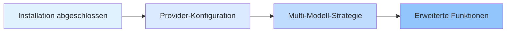

# Plattformen und Integrationen

Dieses Kapitel erklärt, wie du mehrere KI-Provider (Anthropic, OpenAI, Google, GitHub Copilot usw.) konfigurierst und verwaltest, sowie den automatischen Multi-Modell-Fallback-Mechanismus von oh-my-opencode.

Durch das Studium dieses Kapitels wirst du beherrschen, wie das System basierend auf dem Aufgabentyp und den verfügbaren Modellen intelligent das am besten geeignete KI-Modell auswählt, um effiziente und zuverlässige Multi-Modell-Orchestrierungs-Workflows zu erstellen.

## Was dieses Kapitel abdeckt

Dieses Kapitel ist in zwei Teile unterteilt:

### 1. [Provider-Konfiguration](provider-setup/)

Lerne, wie du verschiedene KI-Provider konfigurierst, einschließlich:
- Anthropic Claude (erste Wahl des Haupt-Orchestrators)
- OpenAI ChatGPT (spezialisiert auf Architektur-Reviews)
- Google Gemini (Frontend- und Medienanalyse)
- GitHub Copilot (Backup-Provider)
- Z.ai Coding Plan und OpenCode Zen (optionale Dienste)

**Was du lernen wirst**:
- ✅ 6 mainstream KI-Provider konfigurieren
- ✅ Den interaktiven Installer für schnelles Setup verwenden
- ✅ Die am besten geeigneten Modelle für verschiedene Agents angeben
- ✅ Den `doctor`-Befehl verwenden, um Konfigurationsprobleme zu diagnostizieren

**Geschätzte Zeit**: 25-30 Minuten
### 2. [Multi-Modell-Strategie](model-resolution/)

Vertiefe dich in den dreistufigen Prioritätsmechanismus des Modellauswahl-Systems:
- Benutzerüberschreibung (präzise Kontrolle)
- Provider-Fallback (automatische Fehlertoleranz)
- Systemstandard (Fallback-Lösung)

**Was du lernen wirst**:
- ✅ Den kompletten Workflow der Modellauswahl verstehen
- ✅ Basierend auf Aufgabenanforderungen manuell Modelle angeben
- ✅ Provider-Fallback nutzen, um die Systemrobustheit zu verbessern
- ✅ Modellauswahl-Probleme diagnostizieren und lösen

**Geschätzte Zeit**: 30-35 Minuten
## Empfohlener Lernpfad

Wir empfehlen, dieses Kapitel in der folgenden Reihenfolge zu studieren:

**Warum diese Reihenfolge?**

1. **Zuerst konfigurieren, dann verstehen**: Lerne zuerst, wie du jeden Provider konfigurierst, und verstehe dann den dahinterliegenden Auflösungsmechanismus
2. **Von einfach zu komplex**: Die Provider-Konfiguration ist eine grundlegende Operation, die Multi-Modell-Strategie ist ein fortgeschrittenes Konzept
3. **Praxis validiert Theorie**: Nach der Konfiguration der Provider kannst du den `doctor`-Befehl verwenden, um die Wirksamkeit der Multi-Modell-Strategie zu verifizieren

::: tip Schnellstart-Pfad
Wenn du nur schnell loslegen möchtest, kannst du die Schritte 1-4 der [Provider-Konfiguration](provider-setup/) abschließen (konfiguriere grundlegende Provider) und den Rest später bei Bedarf lernen.
:::
## Voraussetzungen

Bevor du dieses Kapitel studierst, stelle sicher, dass:

- ✅ [Installation und Erstkonfiguration](../installation/) abgeschlossen ist
- ✅ OpenCode installiert ist (Version >= 1.0.150)
- ✅ Du grundlegende JSON/JSONC-Konfigurationsdateiformate verstehst
- ✅ Du mindestens ein KI-Provider-Abonnement hast (Anthropic Claude empfohlen)

::: warning Was, wenn ich kein Provider-Konto habe?
Du kannst die Konfigurationsschritte zuerst lernen, ohne tatsächlich einen Provider zu verbinden. Das System verwendet das Standardmodell von OpenCode als Fallback.
:::
## Häufig gestellte Fragen

<strong>Muss ich alle Provider konfigurieren?</strong>

Nein. Du kannst nur die Provider konfigurieren, die du am häufigsten verwendest (zum Beispiel nur Anthropic Claude). Der Provider-Fallback-Mechanismus von oh-my-opencode verwendet automatisch verfügbare Provider.

Wenn du jedoch die Vorteile der Multi-Modell-Orchestrierung voll ausschöpfen möchtest, empfehlen wir, mindestens 2-3 Provider zu konfigurieren, damit das System basierend auf dem Aufgabentyp automatisch das am besten geeignete Modell auswählen kann.

<strong>Was ist der Unterschied zwischen Provider-Konfiguration und Modellauswahl?</strong>

- **Provider-Konfiguration**: Der "Installationsschritt", der dem System mitteilt, welche KI-Dienste verfügbar sind
- **Modellauswahl**: Die "Entscheidungslogik", wie das System auswählt, welcher Provider für jeden Agent verwendet werden soll

Analogie: Die Provider-Konfiguration ist "Teammitglieder einstellen", die Modellauswahl ist "Aufgaben zuweisen".

<strong>Kann ich die Konfiguration jederzeit ändern?</strong>

Du kannst die Konfigurationsdatei jederzeit ändern:
- Benutzerkonfiguration: `~/.config/opencode/oh-my-opencode.json`
- Projektkonfiguration: `.opencode/oh-my-opencode.json`

Änderungen werden beim nächsten Verwenden eines Agents automatisch wirksam. Wenn du die Provider-Authentifizierung geändert hast, musst du `opencode auth login` ausführen, um sich erneut zu authentifizieren.

## Nächste Schritte

Nach Abschluss dieses Kapitels kannst du:

### Empfohlener Pfad: KI-Agent-Team lernen

Fahre fort mit [KI-Agent-Team: 10 Experten-Übersicht](../../advanced/ai-agents-overview/), um zu verstehen, wie du verschiedene Agents für spezialisierte Aufgaben verwendest.

### Fortgeschrittener Pfad: Tiefgreifende Anpassung

Wenn du bereits mit der Grundkonfiguration vertraut bist, kannst du zu [Konfigurationstiefe: Agent- und Berechtigungsverwaltung](../../advanced/advanced-configuration/) springen, um zu lernen:
- Wie du Agent-Prompts anpasst
- Wie du Agent-Berechtigungen und Zugriffsbereiche einstellst
- Wie du benutzerdefinierte Agents und Kategorien erstellst

### Praktischer Pfad: Prometheus-Planung verwenden

Beginne mit der Verwendung von [Prometheus-Planung: Interview-basierte Anforderungsermittlung](../../advanced/prometheus-planning/), um die Leistungsfähigkeit der Multi-Modell-Orchestrierung durch tatsächliche Agent-Zusammenarbeit zu erleben.

---

**Loslegen**: Beginne deine Multi-Modell-Orchestrierungs-Reise mit der [Provider-Konfiguration](provider-setup/)!
