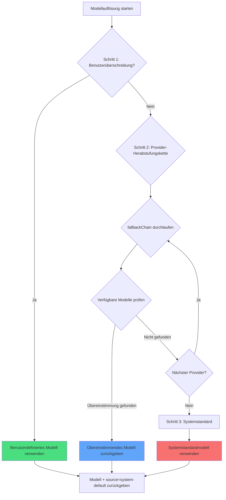

# Multi-Modell-Strategie: Automatische Herabstufung und Priorität

## Was Sie nach diesem Kurs können

- Verstehen, wie oh-my-opencode automatisch das am besten geeignete KI-Modell für jeden Agenten auswählt
- Den dreistufigen Modellauflösungsmechanismus beherrschen (Benutzerüberschreibung → Provider-Herabstufung → Systemstandard)
- Lernen, wie Sie Modellüberschreibungen für Agenten und Kategorien konfigurieren
- Verwenden Sie den `doctor`-Befehl, um die Modellauflösungsergebnisse zu überprüfen
- Manuell Modelle basierend auf Aufgabenanforderungen angeben, um Kosten und Leistung zu optimieren

## Ihr aktuelles Problem

Nachdem Sie mehrere KI-Provider (Anthropic, OpenAI, Google usw.) konfiguriert haben, stoßen Sie möglicherweise auf diese Probleme:

- **Unklare Modellauswahl**: Welche Modelle verwenden die Agenten Sisyphus, Oracle, Librarian usw.?
- **Manuelle Konfiguration ist mühsam**: Jeder Agent muss einzeln ein Modell angeben, bei Provider-Änderungen müssen alle angepasst werden
- **Unkontrollierbare Kosten**: Unbekannt ist, welche Aufgaben teure Modelle (wie Claude Opus) verwenden
- **Provider-Ausfälle beeinträchtigen die Erfahrung**: Wenn die API eines Providers ausfällt, funktioniert das gesamte System nicht mehr
- **Mehrfach-Modell-Zusammenarbeit ist intransparent**: Bei parallelen Aufgaben ist unklar, welche Modelle verschiedene Agenten verwenden

All dies hindert Sie daran, die wahre Leistung der Multi-Modell-Orchestrierung zu entfalten.

## Kernkonzept

Das **Modellauflösungssystem** ist der "intelligente Modellselektor" von oh-my-opencode. Es entscheidet dynamisch, welches Modell jeder Agent und jede Kategorie basierend auf Ihrer Konfiguration und den verfügbaren Modellen verwendet.

::: info Was ist Modellauflösung?
Modellauflösung (Model Resolution) ist der Prozess der Auswahl eines spezifischen KI-Modells für jeden Agenten oder jede Kategorie zur Laufzeit. Sie ist nicht fest codiert, sondern wird dynamisch basierend auf Ihrer Konfiguration, den verfügbaren Providern, Modellnamen usw. berechnet.
:::

### Dreistufiger Auflösungsprozess

Die Modellauflösung wird durch drei Prioritätsschritte realisiert:



**Schritt 1: User Override (Benutzerüberschreibung)**
- Wenn Sie in `oh-my-opencode.json` explizit ein `model` für einen Agenten oder eine Kategorie angeben, verwendet das System dieses Modell direkt
- Überspringt die Provider-Herabstufungskette
- Dies ist die höchste Priorität

**Schritt 2: Provider Fallback (Provider-Herabstufung)**
- Wenn keine Benutzerüberschreibung vorliegt, versucht das System gemäß einer vordefinierten Provider-Prioritätskette
- Für jeden Agenten oder jede Kategorie gibt es eine `fallbackChain`, die die bevorzugte Provider-Reihenfolge definiert
- Das System versucht jeden Provider nacheinander, bis ein verfügbares Modell gefunden wird

**Schritt 3: System Default (Systemstandard)**
- Wenn kein Provider ein verfügbares Modell hat, wird das Standardmodell von OpenCode verwendet
- Dies ist die letzte Rückfalloption

### Provider-Prioritätskette der Agenten

Jeder Agent hat seine eigene bevorzugte Provider-Reihenfolge, abhängig vom Aufgabentyp und den benötigten Fähigkeiten des Agenten:

| Agent | Empfohlenes Modell (ohne Präfix) | Provider-Prioritätskette | Variante |
|--- | --- | --- | ---|
| **Sisyphus** | `claude-opus-4-5` | anthropic → github-copilot → opencode → zai-coding-plan | max |
| **Oracle** | `gpt-5.2` | openai → anthropic → google | high |
| **Librarian** | `big-pickle` | zai-coding-plan → opencode → anthropic | - |
| **Explore** | `claude-haiku-4-5` | anthropic → opencode → github-copilot | - |
| **Multimodal Looker** | `gemini-3-flash` | google → openai → zai-coding-plan → anthropic → opencode | - |
| **Prometheus** | `claude-opus-4-5` | anthropic → github-copilot → opencode → google | max |
| **Metis** | `claude-opus-4-5` | anthropic → github-copilot → opencode → google | max |
| **Momus** | `gpt-5.2` | openai → anthropic → google | medium |
| **Atlas** | `claude-sonnet-4-5` | anthropic → github-copilot → opencode → google | - |

::: tip Warum bevorzugt Sisyphus Anthropic?
Sisyphus ist der Haupt-Orchestrator und benötigt starke推理fähigkeiten. Claude Opus ist das am besten geeignete Modell für komplexe Orchestrierungsaufgaben, daher steht Anthropic an erster Stelle in seiner Prioritätskette. Wenn Ihr Anthropic-Kontingent nicht ausreicht, stuf das System automatisch auf andere Provider herab.
:::

### Provider-Prioritätskette der Kategorien

Kategorien folgen der gleichen Auflösungslogik:

| Kategorie | Empfohlenes Modell (ohne Präfix) | Provider-Prioritätskette | Variante |
|--- | --- | --- | ---|
| **visual-engineering** | `gemini-3-pro` | google → anthropic → openai | - |
| **ultrabrain** | `gpt-5.2-codex` | openai → anthropic → google | xhigh |
| **artistry** | `gemini-3-pro` | google → anthropic → openai | max |
| **quick** | `claude-haiku-4-5` | anthropic → google → opencode | - |
| **unspecified-low** | `claude-sonnet-4-5` | anthropic → openai → google | - |
| **unspecified-high** | `claude-opus-4-5` | anthropic → openai → google | max |
| **writing** | `gemini-3-flash` | google → anthropic → zai-coding-plan → openai | - |

::: tip Vorteil von Kategorien
Wenn Sie Aufgaben über `delegate_task(category="quick", ...)` delegieren, verwendet das System automatisch die Provider-Prioritätskette der quick-Kategorie. Das bedeutet, dass Sie sich nicht an die Konfiguration jedes Agenten erinnern müssen, sondern nur die passende Kategorie basierend auf dem Aufgabentyp auswählen.
:::
## Machen Sie mit

### Schritt 1: Aktuellen Modellauflösungsstatus anzeigen

Verwenden Sie den `doctor`-Befehl, um die Modellauflösungsergebnisse für jeden Agenten und jede Kategorie anzuzeigen:

```bash
bunx oh-my-opencode doctor --verbose
```

**Sie sollten eine ähnliche Ausgabe sehen**:

```
✅ Model Resolution Check
━━━━━━━━━━━━━━━━━━━━━━━━━━━━━━━━━━━━━━━━━━━━━━━━━━━

Agent: sisyphus
  Requirement: claude-opus-4-5 (variant: max)
  Fallback Chain: anthropic → github-copilot → opencode → zai-coding-plan → openai → google
  User Override: (none)
  Resolved Model: anthropic/claude-opus-4-5
  Source: provider-fallback
  Variant: max

Agent: oracle
  Requirement: gpt-5.2 (variant: high)
  Fallback Chain: openai → anthropic → google
  User Override: (none)
  Resolved Model: openai/gpt-5.2
  Source: provider-fallback
  Variant: high

Category: quick
  Requirement: claude-haiku-4-5
  Fallback Chain: anthropic → google → opencode
  User Override: (none)
  Resolved Model: anthropic/claude-haiku-4-5
  Source: provider-fallback
```

Diese Ausgabe zeigt:
- Die Modellanforderungen jedes Agenten/jeder Kategorie
- Die Reihenfolge der Provider-Prioritätskette
- Ob eine Benutzerüberschreibungskonfiguration vorliegt
- Das endgültig aufgelöste Modell und seine Quelle (override/provider-fallback/system-default)

### Schritt 2: Agentenmodell manuell überschreiben

Angenommen, Sie möchten, dass Oracle das neueste Modell von OpenAI statt des standardmäßigen GPT-5.2 verwendet:

Bearbeiten Sie `~/.config/opencode/oh-my-opencode.json` oder `.opencode/oh-my-opencode.json`:

```jsonc
{
  "$schema": "https://raw.githubusercontent.com/code-yeongyu/oh-my-opencode/master/assets/oh-my-opencode.schema.json",

  "agents": {
    "oracle": {
      "model": "openai/o3"  // Überschreiben auf o3-Modell
    },
    "explore": {
      "model": "opencode/gpt-5-nano"  // Kostenloses Modell verwenden
    }
  }
}
```

::: info Schritt 1 Priorität
Wenn Sie `agents.oracle.model` festlegen, verwendet das System in Schritt 1 direkt dieses Modell und überspringt die Provider-Herabstufungskette. Selbst wenn Anthropic Claude Opus verfügbar ist, verwendet Oracle das von Ihnen angegebene OpenAI o3.
:::

**Sie sollten sehen**: Wenn Sie den `doctor`-Befehl erneut ausführen, ändert sich das Auflösungsergebnis für Oracle:

```
Agent: oracle
  Requirement: gpt-5.2 (variant: high)
  Fallback Chain: openai → anthropic → google
  User Override: openai/o3  // ← Benutzerüberschreibung wirksam
  Resolved Model: openai
  Source: override  // ← Quelle ändert sich zu override
  Variant: high
```

### Schritt 3: Kategorie-Modell manuell überschreiben

Angenommen, Sie möchten, dass die `quick`-Kategorie das kostenlose GPT-5 Nano verwendet:

```jsonc
{
  "$schema": "https://raw.githubusercontent.com/code-yeongyu/oh-my-opencode/master/assets/oh-my-opencode.schema.json",

  "categories": {
    "quick": {
      "model": "opencode/gpt-5-nano"  // Überschreiben auf kostenloses Modell
    },
    "visual-engineering": {
      "model": "anthropic/claude-opus-4-5"  // Erzwungene Verwendung von Opus
    }
  }
}
```

**Sie sollten sehen**: Wenn Sie `delegate_task(category="quick", ...)` verwenden, verwendet das System `opencode/gpt-5-nano`, selbst wenn Anthropic Haiku verfügbar ist.

### Schritt 4: Provider-Ausfall simulieren

Der beste Weg, den Provider-Herabstufungsmechanismus zu verstehen, ist die Simulation von Ausfallszenarien.

Angenommen, Sie haben nur OpenAI konfiguriert, möchten aber sehen, welches Modell Sisyphus (bevorzugt Anthropic) verwendet:

**Aktuelle Konfiguration**:
```jsonc
{
  // oh-my-opencode.json
  // Nur openai provider konfiguriert
}
```

**Doctor ausführen**:

```
Agent: sisyphus
  Requirement: claude-opus-4-5 (variant: max)
  Fallback Chain: anthropic → github-copilot → opencode → zai-coding-plan → openai → google
  User Override: (none)
  
  // 1. Versuch: anthropic/claude-opus-4-5
  // Ergebnis: Nicht verfügbar (nicht konfiguriert)
  
  // 2. Versuch: github-copilot/claude-opus-4-5
  // Ergebnis: Nicht verfügbar (nicht konfiguriert)
  
  // 3. Versuch: opencode/claude-opus-4-5
  // Ergebnis: Nicht verfügbar (nicht konfiguriert)
  
  // 4. Versuch: zai-coding-plan/glm-4.7
  // Ergebnis: Nicht verfügbar (nicht konfiguriert)
  
  // 5. Versuch: openai/gpt-5.2-codex (vom 5. Eintrag der fallbackChain)
  // Ergebnis: Gefunden!
  
  Resolved Model: openai/gpt-5.2-codex
  Source: provider-fallback
  Variant: medium
```

**Sie sollten sehen**: Obwohl Sisyphus Claude Opus bevorzugt, stuf das System auf GPT-5.2 Codex von OpenAI herab, da Anthropic nicht verfügbar ist.

::: tip Vorteil der automatischen Herabstufung
Der Provider-Herabstufungsmechanismus stellt die Robustheit des Systems sicher. Selbst wenn ein Provider ausfällt oder das Kontingent erschöpft ist, kann das System automatisch auf einen Backup-Provider umschalten, ohne dass Sie manuell eingreifen müssen.
:::

### Schritt 5: Systemstandard-Rückfalloption überprüfen

Angenommen, Sie haben keinen Provider konfiguriert oder alle Provider sind ausgefallen:

**Doctor ausführen**:

```
Agent: sisyphus
  Requirement: claude-opus-4-5
  Fallback Chain: anthropic → github-copilot → ...
  
  // Alle Provider-Versuche fehlgeschlagen
  
  Resolved Model: anthropic/claude-opus-4-5  // Systemstandard verwenden
  Source: system-default  // ← Quelle ist system-default
  Variant: max
```

**Sie sollten sehen**: Das System verwendet das von OpenCode konfigurierte Standardmodell. Dies ist das letzte Sicherheitsnetz.
## Kontrollpunkt ✅

Nach Abschluss der obigen Schritte bestätigen Sie:

- [ ] Durch Ausführen von `doctor --verbose` können Sie die Modellauflösungsergebnisse aller Agenten und Kategorien sehen
- [ ] Nach dem manuellen Überschreiben des Agentenmodells ändert sich `Source` zu `override`
- [ ] Nach dem manuellen Überschreiben des Kategorie-Modells verwendet `delegate_task` das angegebene Modell
- [ ] Bei simuliertem Provider-Ausfall stuf das System korrekt auf den nächsten verfügbaren Provider herab
- [ ] Wenn alle Provider nicht verfügbar sind, verwendet das System `system-default`

Wenn ein Punkt nicht bestanden wurde, überprüfen Sie:
- Ob der Pfad der Konfigurationsdatei korrekt ist (`~/.config/opencode/oh-my-opencode.json` oder `.opencode/oh-my-opencode.json`)
- Ob der Provider korrekt konfiguriert ist (API Key, Umgebungsvariablen usw.)
- Ob der Modellname korrekt ist (einschließlich Provider-Präfix wie `anthropic/claude-opus-4-5`)

## Wann Sie diesen Trick verwenden

| Szenario | Modell manuell überschreiben | Provider-Herabstufung verwenden |
|--- | --- | ---|
| **Kostenempfindliche Aufgaben** | ✅ Günstiges Modell angeben | ❌ Möglicherweise teures Modell ausgewählt |
| **Leistungsempfindliche Aufgaben** | ✅ Stärkstes Modell angeben | ❌ Möglicherweise auf schwächeres Modell herabgestuft |
| **Neue Modelle testen** | ✅ Experimentelles Modell angeben | ❌ Wird nicht automatisch ausgewählt |
| **Tägliche Entwicklung** | ❌ Übermäßige Konfiguration | ✅ Automatische Auswahl des besten |
| **Provider-Ausfall** | ❌ Manuelle Änderung erforderlich | ✅ Automatische Herabstufung |
| **Multi-Provider-Umgebung** | ❌ Übermäßige Konfiguration | ✅ Automatische Lastverteilung |

**Erfahrungsregel**:
- Verwenden Sie manuelle Überschreibungen nur, wenn Sie eine präzise Kontrolle über das Modell benötigen
- Lassen Sie das System in anderen Fällen automatisch auswählen und genießen Sie die Robustheit der Provider-Herabstufung
- Für kostenempfindliche Aufgaben können Sie auf die `quick`-Kategorie überschreiben oder ein günstiges Modell angeben
- Für Aufgaben, die die höchste Leistung erfordern, können Sie auf `claude-opus-4-5` oder `gpt-5.2` überschreiben

## Häufige Fehler

::: warning Häufige Fehler

**1. Modellname ohne Provider-Präfix**

```jsonc
// ❌ Falsch: Fehlendes Provider-Präfix
{
  "agents": {
    "oracle": {
      "model": "gpt-5.2"  // Fehlendes openai/-Präfix
    }
  }
}

// ✅ Richtig: Vollständiger Pfad
{
  "agents": {
    "oracle": {
      "model": "openai/gpt-5.2"  // Vollständiger Modellpfad
    }
  }
}
```

**2. Überschreiben eines nicht existierenden Modells**

```jsonc
// ❌ Falsch: Modellname falsch geschrieben
{
  "agents": {
    "oracle": {
      "model": "openai/gpt-6"  // GPT-6 existiert nicht
    }
  }
}

// ✅ Richtig: Echtes Modell verwenden
{
  "agents": {
    "oracle": {
      "model": "openai/gpt-5.2"  // Echtes Modell
    }
  }
}
```

**3. Ignorieren der Variant-Konfiguration**

Einige Agenten und Kategorien haben empfohlene Varianten (wie `max`, `high`, `medium`), die die推理fähigkeit des Modells beeinflussen. Beachten Sie dies beim manuellen Überschreiben:

```jsonc
// ✅ Empfohlen: Standard-Variant beibehalten
{
  "agents": {
    "oracle": {
      "model": "openai/gpt-5.2"
      // Variant wird von fallbackChain geerbt: high
    }
  }
}

// ✅ Optional: Variant manuell angeben
{
  "agents": {
    "oracle": {
      "model": "openai/gpt-5.2",
      "variant": "max"  // Standardwert überschreiben
    }
  }
}
```

**4. Abhängigkeit vom Systemstandard ohne Provider-Konfiguration**

Das Systemstandardmodell stammt aus der Konfiguration von OpenCode. Wenn Sie keinen Provider konfiguriert haben, verwendet OpenCode möglicherweise auch ein Standardmodell, aber dieses Modell ist möglicherweise nicht das, was Sie möchten.

**Empfehlung**:
- Konfigurieren Sie mindestens einen Provider (Anthropic, OpenAI, Google usw.)
- Verwenden Sie den `doctor`-Befehl regelmäßig, um die Modellauflösungsergebnisse zu überprüfen
:::
## Zusammenfassung dieser Lektion

Das Modellauflösungssystem realisiert eine intelligente Modellauswahl durch einen dreistufigen Prioritätsmechanismus:

- **Schritt 1: User Override**: Das von Ihnen angegebene Modell hat die höchste Priorität und ist vollständig kontrollierbar
- **Schritt 2: Provider Fallback**: Automatische Herabstufung gemäß vordefinierter Prioritätskette stellt Robustheit sicher
- **Schritt 3: System Default**: Die letzte Rückfalloption stellt sicher, dass das System immer ein Modell zur Verfügung hat

Jeder Agent und jede Kategorie hat seine eigene Provider-Prioritätskette, die basierend auf dem Aufgabentyp und den benötigten Fähigkeiten des Agenten entworfen wurde. Sisyphus bevorzugt Anthropic (komplexe推理), Oracle bevorzugt OpenAI (strategische Beratung), Librarian bevorzugt zai-coding-plan (Multi-Repository-Forschung).

Denken Sie daran:
- **Tägliche Entwicklung**: Lassen Sie das System automatisch auswählen und genießen Sie die Provider-Herabstufung
- **Präzise Kontrolle**: Überschreiben Sie Modelle manuell, um Kosten und Leistung zu optimieren
- **Fehlerwiederherstellung**: Provider-Herabstufung wird automatisch verarbeitet, ohne dass menschliches Eingreifen erforderlich ist
- **Überprüfungstools**: Verwenden Sie den `doctor`-Befehl, um die Modellauflösungsergebnisse zu überprüfen

## Vorschau auf die nächste Lektion

> In der nächsten Lektion lernen wir **[KI-Agententeams: Einführung in 10 Experten](../../advanced/ai-agents-overview/)**.
>
> Sie werden lernen:
> - über die Funktionen, Anwendungsszenarien und Berechtigungskonfiguration der 10 integrierten Agenten
> - wie Sie den geeigneten Agenten basierend auf dem Aufgabentyp auswählen
> - über die Zusammenarbeitsmodi und Best Practices zwischen Agenten

---

## Anhang: Quellcode-Referenz

<details>
<summary><strong>Klicken, um Quellcodepositionen anzuzeigen</strong></summary>

> Aktualisierungszeit: 2026-01-26

| Funktion | Dateipfad | Zeilennummer |
|--- | --- | ---|
| Kernfunktion der Modellauflösung | [`src/shared/model-resolver.ts`](https://github.com/code-yeongyu/oh-my-opencode/blob/main/src/shared/model-resolver.ts) | 43-98 |
| Definition der Agentenmodellanforderungen | [`src/shared/model-requirements.ts`](https://github.com/code-yeongyu/oh-my-opencode/blob/main/src/shared/model-requirements.ts) | 12-79 |
| Definition der Kategoriemodellanforderungen | [`src/shared/model-requirements.ts`](https://github.com/code-yeongyu/oh-my-opencode/blob/main/src/shared/model-requirements.ts) | 81-133 |
| Modellauflösung bei Agentenerstellung | [`src/agents/utils.ts`](https://github.com/code-yeongyu/oh-my-opencode/blob/main/src/agents/utils.ts) | 203-208, 245-250, 284-289 |
| Modellauflösung bei Kategoriedelegation | [`src/tools/delegate-task/tools.ts`](https://github.com/code-yeongyu/oh-my-opencode/blob/main/src/tools/delegate-task/tools.ts) | 532-540 |
|--- | --- | ---|

**Wichtige Typdefinitionen**:
- `ModelResolutionInput`: Eingabeparameter der Modellauflösung (`src/shared/model-resolver.ts:6-10`)
- `ExtendedModelResolutionInput`: Erweiterte Modellauflösungseingabe, einschließlich fallbackChain und availableModels (`src/shared/model-resolver.ts:23-28`)
- `ModelResolutionResult`: Ergebnis der Modellauflösung, einschließlich model, source, variant (`src/shared/model-resolver.ts:17-21`)
- `ModelSource`: Aufzählung der Modellquellen (`override`/`provider-fallback`/`system-default`) (`src/shared/model-resolver.ts:12-16`)
- `FallbackEntry`: Eintrag der Provider-Herabstufungskette, einschließlich providers, model, variant (`src/shared/model-requirements.ts:1-5`)
- `ModelRequirement`: Definition der Modellanforderung, einschließlich fallbackChain und Standard-Variant (`src/shared/model-requirements.ts:7-10`)

**Wichtige Konstanten**:
- `AGENT_MODEL_REQUIREMENTS`: Definition der Modellanforderungen aller Agenten, einschließlich fallbackChain (`src/shared/model-requirements.ts:12-79`)
- `CATEGORY_MODEL_REQUIREMENTS`: Definition der Modellanforderungen aller Kategorien (`src/shared/model-requirements.ts:81-133`)

**Wichtige Funktionen**:
- `resolveModelWithFallback()`: Kernfunktion der Modellauflösung, implementiert den dreistufigen Prioritätsmechanismus (`src/shared/model-resolver.ts:43-98`)
- `resolveModel()`: Einfache Modellauflösung, für Fälle ohne fallbackChain (`src/shared/model-resolver.ts:35-41`)
- `normalizeModel()`: Normalisiert den Modellnamen, entfernt führende und nachfolgende Leerzeichen (`src/shared/model-resolver.ts:30-33`)
- `createBuiltinAgents()`: Beim Erstellen aller integrierten Agenten wird der Modellauflöser aufgerufen, um das Modell zu bestimmen (`src/agents/utils.ts:143-313`)

**Geschäftsregeln**:
| Regel-ID | Regelbeschreibung | Markierung |
|--- | --- | ---|
| BR-4.1-7 | Priorität der Modellauflösung: Benutzerüberschreibung > Provider-Herabstufung > Systemstandard | 【Fakt】 |
| BR-4.1-7-1 | Bei Benutzerüberschreibung direkt zurückgeben, Provider-Herabstufungskette überspringen | 【Fakt】 |
| BR-4.1-7-2 | Bei Provider-Herabstufung jeden Provider gemäß Reihenfolge der fallbackChain versuchen | 【Fakt】 |
| BR-4.1-7-3 | Bei Provider-Herabstufung den availableModels-Cache prüfen, wenn leer, dann connectedProviders prüfen | 【Fakt】 |
| BR-4.1-7-4 | Wenn alle Provider nicht verfügbar sind, systemDefaultModel verwenden | 【Fakt】 |
| BR-4.1-7-5 | fallbackChain von Sisyphus: anthropic → github-copilot → opencode → zai-coding-plan → openai → google | 【Fakt】 |
| BR-4.1-7-6 | fallbackChain von Oracle: openai → anthropic → google | 【Fakt】 |
| BR-4.1-7-7 | fallbackChain von Librarian: zai-coding-plan → opencode → anthropic | 【Fakt】 |
| BR-4.1-7-8 | fallbackChain von Explore: anthropic → opencode → github-copilot | 【Fakt】 |
| BR-4.1-7-9 | fallbackChain von Multimodal Looker: google → openai → zai-coding-plan → anthropic → opencode | 【Fakt】 |

</details>
