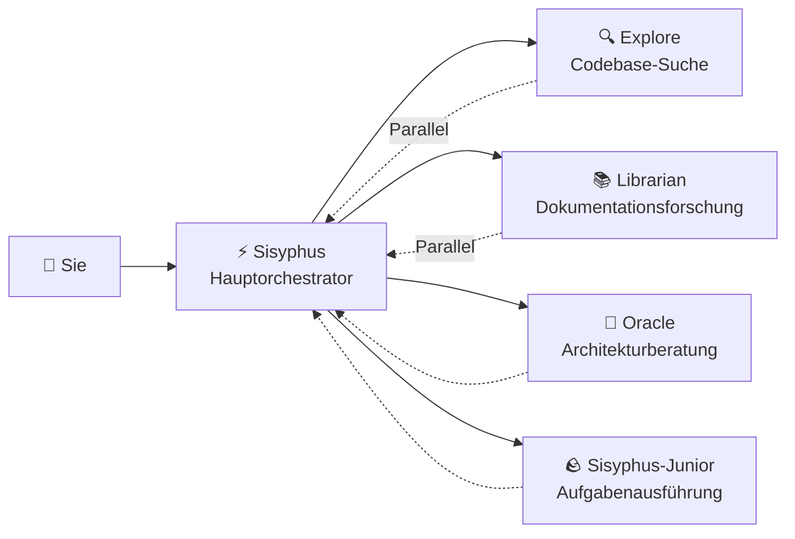

# Hauptorchestrator: Denken und Ausführen wie ein Senior-Ingenieur

## Was Sie lernen können

- Verstehen Sie, wie Sisyphus wie ein echtes Entwicklungsteam koordiniert
- Beherrschen Sie Best Practices für Aufgaben Delegation, damit verschiedene Experten-Agents gemeinsam komplexe Aufgaben erledigen
- Lernen Sie, die Entwicklungseffizienz durch parallele Hintergrundaufgaben erheblich zu steigern
- Wissen Sie, wann Sie Agents ihre Aufgaben selbst erledigen lassen sollten und wann Sie an Experten delegieren sollten

## Ihre aktuellen Herausforderungen

Vielleicht haben Sie diese Probleme bereits erlebt:

- KI-Agents "geben halb auf" und verlieren ihr Ziel beim Schreiben
- Dieselbe Datei wird immer wieder geändert, sodass jedes Mal der Kontext neu gelesen werden muss
- Sie möchten, dass die KI viele Aufgaben erledigt, aber Sie können sie nur nacheinander in die Warteschlange stellen
- Agents schreiben Code, aber Sie müssen immer noch selbst überprüfen, ob er korrekt ist und ob er andere Funktionen beschädigt

**Ursache**: Sie lassen einen "Allrounder" alle Arbeit erledigen, aber nur Experten verstehen professionelle Aufgaben.

## Wann Sie dies verwenden sollten

Sisyphus ist Ihr Hauptorchestrator und eignet sich für diese Szenarien:

| Szenario | Geeignet | Alternative |
|--- | --- | ---|
| Komplexe Feature-Entwicklung (3+ Schritte) | ✅ Stark empfohlen | Prometheus + Atlas (erfordert detaillierte Planung) |
| Schnelle Behebung bekannter Bugs | ✅ Geeignet | Lassen Sie Sisyphus es direkt erledigen |
| Erfordert Untersuchung mehrerer Repos/Dokumentationen | ✅ Stark empfohlen | Verwenden Sie Sisyphus parallele Delegation |
| Einfache Einzeldatei-Änderungen | ✅ Akzeptabel | Direktes Bearbeiten (einfacher) |
| Erfordert detaillierte Projektplanung | ⚠️ Nicht empfohlen | Verwenden Sie zuerst Prometheus, um einen Plan zu erstellen |

## Kernkonzepte

**Sisyphus** ist der Hauptorchestrator-Agent, der wie ein echtes Entwicklungsteam mehrere KI-Experten koordiniert. Durch Verantwortungstrennung und parallele Delegierungsmechanismen ermöglicht er professionellen Sub-Agents, ihre jeweiligen Stärken zu nutzen und eine effiziente Zusammenarbeit zu erreichen.

Sisyphus ist kein "schlauerer KI" – es ist ein **Orchestrierungssystem**.

### Verantwortungstrennung



**Sisyphus schreibt keinen Code**, es ist verantwortlich für:

1. **Verstehen Ihrer echten Bedürfnisse** (nicht nur Oberflächenanforderungen)
2. **Einschätzen, wer am besten für die Aufgabe geeignet ist** (nicht alles selbst erledigen)
3. **Parallele Delegation von Aufgaben** (mehrere Experten gleichzeitig arbeiten lassen)
4. **Überprüfen von Ergebnissen** (niemals blind vertrauen: "Ich bin fertig")

### Warum heißt es Sisyphus?

In der griechischen Mythologie wurde Sisyphus dazu verurteilt, ewig einen Fels einen Berg hinaufzuschieben.

Das Designphilosophie dieses Systems: **Agents müssen den Fels ganz nach oben schieben (alle TODOs abschließen), bevor sie aufhören können**.

::: info
Dies ist keine Strafe – es ist ein Qualitätssicherungsmechanismus. Sie möchten nicht, dass die KI halb aufgibt und ein Durcheinander hinterlässt.
:::

### 32k Thinking Budget

Sisyphus verwendet **Claude Opus 4.5 + 32k thinking budget**.

Wofür ist das gut?

| Geringes Budget (kein Thinking) | 32k thinking budget |
|--- | ---|
| Beginnt direkt mit dem Schreiben von Code | Analysiert zuerst tiefgehend Anforderungen, bewertet Komplexität, zerlegt Aufgaben |
| Anfällig für das Übersehen von Randfällen | Identifiziert proaktiv potenzielle Probleme und Risiken |
| Merkt zur Hälfte, dass es falsch läuft | Wählt von Anfang den optimalen Ansatz |

::: tip
Stark empfohlen, das **Opus 4.5** Modell für Sisyphus zu konfigurieren. Die Erfahrung wird mit anderen Modellen deutlich schlechter.
:::

## Folgen Sie mir

### Schritt 1: Erstellen Sie ein Testprojekt

**Warum**
Sie benötigen ein ausführbares Projekt, um das Verhalten von Sisyphus zu beobachten.

```bash
mkdir my-app && cd my-app
npm create next-app@latest . -- --typescript --tailwind --eslint --no-src-dir
npm install
```

**Sie sollten sehen**: Projektinitialisierung abgeschlossen, Sie können `npm run dev` starten.

### Schritt 2: Geben Sie Sisyphus eine komplexe Aufgabe

Öffnen Sie das Projekt in OpenCode und geben Sie ein:

```
Fügen Sie Benutzeranmeldefunktionen hinzu, einschließlich:
- E-Mail/Passwort-Anmeldung
- JWT-Token-Speicherung
- Geschützte Routen
- Anmeldestatusprüfung
```

Beobachten Sie die Reaktion von Sisyphus.

**Sie sollten sehen**:

1. Sisyphus beginnt nicht sofort mit dem Schreiben von Code
2. Es erstellt zuerst eine TODO-Liste (detaillierte Aufgabenaufteilung)
3. Bewertet Codebase-Muster (überprüft Konfiguration, Dateistruktur)
4. Kann Ihnen einige Klärungsfragen stellen

**Kontrollpunkt ✅**: Überprüfen Sie das TODO-Panel von OpenCode, Sie sollten etwas Ähnliches sehen:

```
□ Installieren Sie notwendige Abhängigkeiten (bcrypt, jsonwebtoken)
□ Erstellen Sie Benutzermodell und Typdefinitionen
□ Implementieren Sie Login-API-Endpunkt
□ Erstellen Sie JWT-Signier- und Verifizierungstools
□ Fügen Sie geschützte Routen-Middleware hinzu
□ Implementieren Sie Frontend-Login-Formular
□ Fügen Sie Anmeldestatus-Verwaltung hinzu
```

### Schritt 3: Beobachten Sie parallele Delegation (kritischer Moment)

Während der Implementierung kann Sisyphus:

```
[Background Task Started]
- Task ID: bg_abc123
- Agent: explore
- Prompt: "Find existing auth patterns in this codebase..."

[Background Task Started]
- Task ID: bg_def456
- Agent: librarian
- Prompt: "Research JWT best practices for Next.js..."
```

**Das ist entscheidend**: Sisyphus **wartet nicht**, bis diese Aufgaben abgeschlossen sind – es arbeitet weiter.

Wenn Sie Ergebnisse benötigen, ruft es `background_output(task_id="...")` ab, um sie zu erhalten.

**Warum ist das schneller?**

| Serieller Ansatz (traditionell) | Paralleler Ansatz (Sisyphus) |
|--- | ---|
|--- | ---|
| Warten... | Warten... | ⏳ Dokumentationsforschung (2 Minuten, gleichzeitig) |
| Dokumentationsforschung (2 Minuten) | Start der Implementierung (insgesamt 2 Minuten) |
| Start der Implementierung (2 Minuten) |  |
| **Insgesamt: 6 Minuten** | **Insgesamt: 4 Minuten (33% gespart)** |

### Schritt 4: Überprüfungsmechanismus

Wenn Sisyphus behauptet "Aufgabe abgeschlossen", wird es:

1. `lsp_diagnostics` ausführen, um Fehler zu überprüfen
2. `npm run build` ausführen, um sicherzustellen, dass der Build erfolgreich ist
3. Testsuite ausführen, wenn Tests vorhanden sind
4. TODO als `completed` markieren

**Kontrollpunkt ✅**: Überprüfen Sie die Terminalausgabe, Sie sollten etwas Ähnliches sehen:

```
✓ Running diagnostics on changed files...
✓ No errors found
✓ Build passed (exit code 0)
✓ All tests passed
```

Wenn eine Überprüfung fehlschlägt, wird Sisyphus sie sofort beheben – niemals ein Durcheinander hinterlassen.

### Schritt 5: Häufige Fallstricke

#### ❌ Falsche Vorgehensweise: Unterbrechen Sie die TODO-Verfolgung von Sisyphus

Sie sehen, dass Sisyphus Aufgaben erledigt, und Sie sind ungeduldig:

```
Schnell den Code schreiben! Aufhören zu planen!
```

**Problem**: Sisyphus wird TODOs überspringen und direkt Code schreiben, aber möglicherweise Randfälle übersehen.

**Richtige Vorgehensweise**:

```
Warten Sie, bis Sisyphus die Planung abgeschlossen hat. Wenn Sie denken, dass der Plan falsch ist, geben Sie konkrete Verbesserungsvorschläge:
"Schritt 3 im TODO sollte zuerst den Datenbankmigrationsplan berücksichtigen."
```

#### ❌ Falsche Vorgehensweise: Sisyphus nicht delegieren lassen

Sie deaktivieren alle Experten-Agents in der Konfiguration und lassen nur Sisyphus.

**Problem**: Sisyphus wird versuchen, alles selbst zu erledigen, aber möglicherweise nicht professionell genug sein.

**Richtige Vorgehensweise**:

Behalten Sie die Standardkonfiguration bei und lassen Sie Sisyphus automatisch an Experten delegieren:

| Aufgabe | Sisyphus selbst | An Experten delegieren |
|--- | --- | ---|
| Einfache Einzeldatei-Änderung | ✅ OK | Nicht erforderlich |
| Codebase-Suche | ⚠️ Langsam | ✅ Explore (schneller) |
| Dokumentationsforschung | ⚠️ Möglicherweise ungenau | ✅ Librarian (professioneller) |
| Architekturentscheidungen | ❌ Nicht empfohlen | ✅ Oracle (autoritärer) |

## Zusammenfassung

Die Stärke von Sisyphus liegt nicht darin, "schlauer" zu sein, sondern in:

1. **Verantwortungstrennung**: Hauptorchestrator + professionelles Team, nicht alleine arbeiten
2. **Tiefes Denken**: 32k thinking budget stellt sicher, dass keine Details übersehen werden
3. **Parallele Ausführung**: Hintergrundaufgaben lassen mehrere Experten gleichzeitig arbeiten
4. **Verpflichtende Überprüfung**: Keine Beweise = Aufgabe nicht abgeschlossen
5. **TODO-Verfolgung**: Halbaufgeben ist nicht erlaubt

**Kernprinzipien**:

::: tip
**Standardmäßig delegieren**: Es sei denn, die Aufgabe ist extrem einfach (Einzeldatei, bekannter Standort), delegieren Sie vorrangig an Experten oder verwenden Sie Category+Skill.
:::

## Vorschau der nächsten Lektion

> In der nächsten Lektion lernen wir **[Ultrawork-Modus](../ultrawork-mode/)** kennen, um alle Funktionen mit einem Klick zu aktivieren und Sisyphus alleine komplexe Aufgaben erledigen zu lassen.
>
> Sie werden lernen:
> - Wie Sie Aufgaben schnell mit dem `ultrawork`-Schlüsselwort starten
> - Welche zusätzlichen Fähigkeiten der Ultrawork-Modus aktiviert
> - Wann Sie Ultrawork verwenden sollten und wann Sie Prometheus verwenden sollten

---

## Anhang: Quellcode-Referenz

<details>
<summary><strong>Klicken Sie, um Quellcodepositionen anzuzeigen</strong></summary>

> Aktualisiert am: 2026-01-26

| Funktion | Dateipfad | Zeilen |
|--- | --- | ---|
|--- | --- | ---|
|--- | --- | ---|
|--- | --- | ---|
|--- | --- | ---|

**Wichtige Konfiguration**:
- **Thinking Budget**: 32k tokens (nur Anthropic-Modelle)
- **Temperature**: 0.1 (Code-Agents haben feste niedrige Temperatur)
- **Max Tokens**: 64000
- **Empfohlenes Modell**: anthropic/claude-opus-4-5

**Kern-Workflow** (aus Quellcode):
- **Phase 0**: Intent Gate (Intent-Klassifizierung, Zeilen 53-103)
- **Phase 1**: Codebase Assessment (Codebase-Bewertung, Zeilen 107-130)
- **Phase 2A**: Exploration & Research (Zeilen 132-172)
- **Phase 2B**: Implementation (Zeilen 176-263)
- **Phase 2C**: Failure Recovery (Zeilen 266-283)
- **Phase 3**: Completion (Zeilen 286-302)

**Wichtige Einschränkungen**:
- **Nicht-triviale Aufgaben müssen TODO erstellen** (Zeile 311)
- **Hintergrundaufgaben müssen parallel sein** (Zeilen 144-162)
- **Muss Ergebnisse überprüfen** (Zeilen 254-262)

</details>
