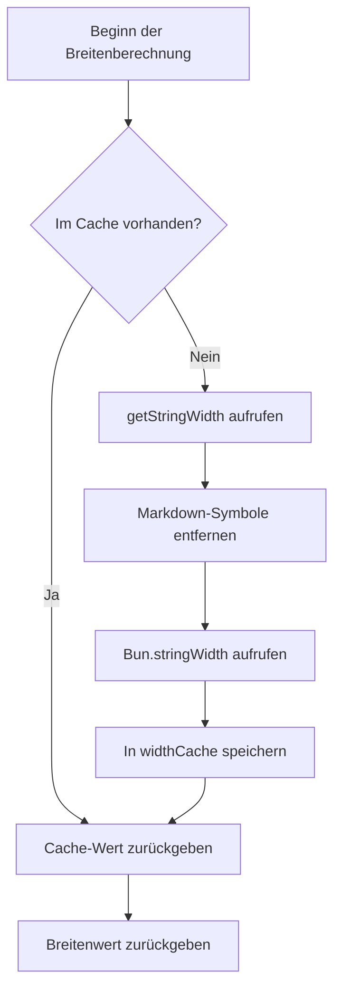

# Technische Details: Caching-Mechanismus und Leistungsoptimierung

## Was Sie nach diesem Kurs können

- Verstehen, wie der Caching-Mechanismus des Plugins die Leistung verbessert
- Die Datenstruktur und Verwendung von widthCache beherrschen
- Die Auslösebedingungen für die automatische Cache-Bereinigung kennen
- Wissen, wie Sie die Wirkung der Leistungsoptimierung analysieren

## Ihr aktuelles Problem

Sie fragen sich vielleicht:

> Wie berechnet das Plugin Tabellenbreiten so schnell? Warum ist die Verarbeitung großer Tabellen immer noch flüssig? Wie ist der Caching-Mechanismus konzipiert?

Diese Lektion analysiert die interne Implementierung des Plugins im Detail und führt Sie durch die Designideen und Leistungsoptimierungsstrategien des Caching-Mechanismus.

## Kernidee

### Warum Caching verwenden?

Bei der Formatierung von Markdown-Tabellen muss das Plugin die **Anzeigebreite** (display width) jeder Zelle berechnen. Diese Berechnung umfasst:

1. **Entfernen von Markdown-Symbolen**: wie `**fett**`, `*kursiv*`, `~~durchgestrichen~~`
2. **Schützen von Inline-Code**: Markdown-Symbole in `` `Code` `` bleiben unverändert
3. **Aufrufen von `Bun.stringWidth()`**: Berechnen der Anzeigebreite von Unicode-Zeichen (einschließlich Emoji, chinesischen Zeichen)

**Das Problem**: Der gleiche Zelleninhalt kann mehrfach auftreten (z. B. Tabellenüberschriften), und jedes Mal diese Logik neu zu berechnen ist langsam.

**Lösung**: Verwenden Sie einen Cache (Map), um die Zuordnung "Textinhalt → Anzeigebreite" zu speichern und wiederholte Berechnungen zu vermeiden.

## Cache-Datenstruktur

Das Plugin verwendet zwei globale Variablen zur Verwaltung des Caches:

### widthCache

```typescript
const widthCache = new Map<string, number>()
```

**Zweck**: Cache der Ergebnisse der Anzeigebreitenberechnung von Zeichenfolgen

**Struktur**:
- **Key**: Der ursprüngliche Textinhalt der Zelle (einschließlich aller Markdown-Syntax)
- **Value**: Die berechnete Anzeigebreite (Anzahl der Zeichen)

**Beispiel**:

| Ursprünglicher Text (Key) | Anzeigebreite (Value) | Erklärung |
| ------------------------- | --------------------- | --------- |
| `**Name**` | 4 | Breite nach Entfernen von `**` ist 4 |
| `*Alter*` | 4 | Breite nach Entfernen von `*` ist 4 |
| `` `status` `` | 8 | Codeblock-Symbole werden ebenfalls in die Breite einbezogen |
| `张三` | 4 | Breite chinesischer Zeichen ist 1 |

### cacheOperationCount

```typescript
let cacheOperationCount = 0
```

**Zweck**: Aufzeichnen der Anzahl der Cache-Operationen, um die automatische Bereinigung auszulösen

**Bereinigungsschwellenwerte**:
- Anzahl der Operationen > 100 oder
- Cache-Einträge > 1000

## Cache-Suchprozess

### calculateDisplayWidth-Funktion

Wenn die Zellenbreite berechnet werden muss, ruft das Plugin die Funktion `calculateDisplayWidth()` auf und führt den folgenden Prozess aus:

<details>
<summary><strong>📖 Vollständigen Code anzeigen</strong></summary>

```typescript
function calculateDisplayWidth(text: string): number {
  if (widthCache.has(text)) {
    return widthCache.get(text)!  // Cache-Treffer, direkt zurückgeben
  }

  const width = getStringWidth(text)  // Tatsächliche Breite berechnen
  widthCache.set(text, width)          // Im Cache speichern
  return width
}
```

</details>

**Flussdiagramm**:



**Schrittanalyse**:

| Schritt | Operation | Zeitkomplexität |
| ------- | --------- | --------------- |
| 1 | Prüfen `widthCache.has(text)` | O(1) |
| 2 | Cache-Treffer → Direkt zurückgeben | O(1) |
| 3 | Cache-Fehltreffer → Breite berechnen | O(n) |
| 4 | Im Cache speichern | O(1) |

**Schlüsselpunkte**:
- **Bei Cache-Treffer**: Direkt zurückgeben, ohne Berechnung (O(1))
- **Bei Cache-Fehltreffer**: Vollständige Breitenberechnungslogik ausführen (O(n))
- **Ursprünglichen Text speichern**: Key ist der vollständige Markdown-Text, um eine genaue Übereinstimmung zu gewährleisten

## Cache-Bereinigungsmechanismus

### Warum den Cache bereinigen?

Caching kann zwar die Leistung verbessern, verbraucht aber Speicher. Wenn nicht bereinigt:
- **Speicherverbrauch wächst kontinuierlich**: Jeder neue Zelleninhalt wird zwischengespeichert
- **Kann nutzlose Daten enthalten**: Alter Tabelleninhalt wird möglicherweise nicht mehr benötigt

### Auslösebedingungen für automatische Bereinigung

Nach Abschluss jeder Formatierung ruft das Plugin `incrementOperationCount()` auf, um den Operationszähler zu aktualisieren:

<details>
<summary><strong>📖 Bereinigungscode anzeigen</strong></summary>

```typescript
function incrementOperationCount() {
  cacheOperationCount++

  if (cacheOperationCount > 100 || widthCache.size > 1000) {
    cleanupCache()
  }
}

function cleanupCache() {
  widthCache.clear()
  cacheOperationCount = 0
}
```

</details>

**Auslösebedingungen** (wird ausgelöst, wenn eine davon erfüllt ist):

| Bedingung | Schwellenwert | Erklärung |
| --------- | ------------- | --------- |
| Anzahl der Operationen | > 100 Formatierungsvorgänge | Vermeidet häufiges Auslösen der Bereinigung |
| Cache-Einträge | > 1000 Zellen | Verhindert zu hohen Speicherverbrauch |

**Bereinigungsstrategie**:
- **Vollständig leeren**: `widthCache.clear()` löscht alle Caches
- **Zähler zurücksetzen**: `cacheOperationCount = 0`

::: info Bereinigungszeitpunkt

Die Cache-Bereinigung erfolgt **nach Abschluss jeder Formatierung**, nicht während der Formatierung. Dies unterbricht keine laufenden Formatierungsvorgänge.

:::

## Leistungsoptimierungseffekt

### Cache-Trefferratenanalyse

Nehmen wir eine Tabelle mit 5 Spalten × 10 Zeilen an, wobei:

- **Wiederholter Inhalt**: Tabellenüberschriften erscheinen 11-mal in der Trennzeile und den Datenzeilen
- **Eindeutiger Inhalt**: Der Inhalt jeder Zelle ist unterschiedlich

**Cache-Effekt**:

| Szenario | Ohne Cache | Mit Cache | Leistungssteigerung |
| -------- | ---------- | --------- | ------------------- |
| 5 Spalten × 10 Zeilen (keine Wiederholungen) | 50 Berechnungen | 50 Berechnungen | Keine |
| 5 Spalten × 10 Zeilen (wiederholte Überschriften) | 50 Berechnungen | 10 Berechnungen + 40 Cache-Treffer | ~80% |

### Tatsächliche Auswirkungen

**Vorteile durch Caching**:

1. **Berechnungsaufwand reduzieren**: Vermeidet wiederholtes Entfernen von Markdown-Symbolen und Aufrufen von `Bun.stringWidth()`
2. **CPU-Auslastung senken**: `getStringWidth()` beinhaltet Regex-Ersetzung und Unicode-Berechnung, was einen hohen Aufwand verursacht
3. **Reaktionsgeschwindigkeit verbessern**: Besonders deutlich bei Tabellen mit vielen wiederholten Zellen

**Beispielszenarien**:

| Szenario | Cache-Effekt |
| -------- | ------------ |
| KI-generierte Vergleichstabellen | ✅ Deutlich (wiederholter Inhalt in mehreren Spalten) |
| Einfache einzeilige Tabellen | ⚪ Mäßig (eindeutiger Inhalt) |
| Tabellen mit verschachteltem Markdown | ✅ Deutlich (hoher Aufwand beim Entfernen von Symbolen) |

## Leistungsoptimierungsempfehlungen

::: tip Empfehlungen für Entwickler

Wenn Sie die Leistung weiter optimieren müssen, können Sie Folgendes in Betracht ziehen:

1. **Cache-Schwellenwerte anpassen**: Passen Sie die Schwellenwerte von `100` Operationen und `1000` Einträgen je nach tatsächlicher Tabellengröße an
2. **LRU-Cache**: Verwenden Sie den Least Recently Used (LRU)-Algorithmus anstelle der Strategie zum vollständigen Leeren
3. **Leistungsüberwachung**: Fügen Sie Protokolle hinzu, um die Cache-Trefferrate zu statistisieren und die tatsächliche Wirkung zu analysieren

:::

## Zusammenfassung dieser Lektion

Das Plugin verwendet den `widthCache`-Caching-Mechanismus zur Leistungsoptimierung:

- **Speicherstruktur**: `Map<string, number>` bildet ursprünglichen Text auf Anzeigebreite ab
- **Suchprozess**: Zuerst Cache prüfen → Bei Fehltreffer berechnen und speichern
- **Bereinigungsmechanismus**: Automatische Bereinigung bei Operationen > 100 oder Einträgen > 1000
- **Leistungssteigerung**: Reduziert wiederholte Berechnungen und senkt die CPU-Auslastung

Dieser Mechanismus sorgt dafür, dass das Plugin auch bei der Verarbeitung komplexer Tabellen flüssig bleibt und ist die Kernimplementierung der Leistungsoptimierung.

## Vorschau auf die nächste Lektion

> In der nächsten Lektion lernen wir **[Änderungsprotokoll: Versionsverlauf und Änderungsprotokoll](../../changelog/release-notes/)**.
>
> Sie werden lernen:
> - Die Versionsentwicklung des Plugins
> - Neue Funktionen und Korrekturen
> - Wie Sie Plugin-Updates verfolgen

---

## Anhang: Quellcode-Referenz

<details>
<summary><strong>Klicken, um Quellcodepositionen anzuzeigen</strong></summary>

> Aktualisierungszeit: 2026-01-26

| Funktion | Dateipfad | Zeilennummer |
| --- | --- | --- |
| widthCache-Definition | [`source/franlol/opencode-md-table-formatter/index.ts`](https://github.com/franlol/opencode-md-table-formatter/blob/main/index.ts#L6) | 6 |
| cacheOperationCount-Definition | [`source/franlol/opencode-md-table-formatter/index.ts`](https://github.com/franlol/opencode-md-table-formatter/blob/main/index.ts#L7) | 7 |
| calculateDisplayWidth-Funktion | [`source/franlol/opencode-md-table-formatter/index.ts`](https://github.com/franlol/opencode-md-table-formatter/blob/main/index.ts#L151-L159) | 151-159 |
| incrementOperationCount-Funktion | [`source/franlol/opencode-md-table-formatter/index.ts`](https://github.com/franlol/opencode-md-table-formatter/blob/main/index.ts#L219-L225) | 219-225 |
| cleanupCache-Funktion | [`source/franlol/opencode-md-table-formatter/index.ts`](https://github.com/franlol/opencode-md-table-formatter/blob/main/index.ts#L227-L230) | 227-230 |

**Schlüsselkonstanten**:
- `widthCache = new Map<string, number>()`: Map-Struktur zum Caching der Anzeigebreite von Zeichenfolgen
- `cacheOperationCount = 0`: Cache-Operationszähler

**Schlüsselfunktionen**:
- `calculateDisplayWidth(text: string): number`: Berechnet die Anzeigebreite (mit Cache), prüft zuerst den Cache und berechnet dann
- `incrementOperationCount(): void`: Erhöht den Operationszähler, löst bedingte Bereinigung aus
- `cleanupCache(): void`: Leert widthCache und setzt den Zähler zurück

</details>
