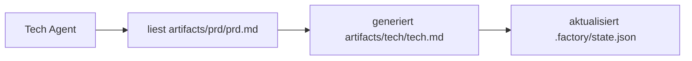

# Kontextoptimierung: Sitzungsbasierte Ausführung

## Was Sie nach diesem Tutorial können

- Den Befehl `factory continue` verwenden, um die Pipeline in einer neuen Sitzung fortzusetzen
- Die Vorteile verstehen, die jede Phase mit einem sauberen, exklusiven Kontext bietet
- Methoden zur erheblichen Reduzierung des Token-Verbrauchs beherrschen
- Unterbrechungswiederherstellung unterstützen – jederzeit pausieren und fortsetzen

## Ihre aktuelle Herausforderung

Wenn Sie eine vollständige 7-Phasen-Pipeline in einem KI-Assistenten (wie Claude Code) ausführen, können folgende Probleme auftreten:

- **Immer mehr Token**: Mit der fortschreitenden Konversation wird der Kontext länger, und jede Phase muss den Inhalt aller vorherigen Phasen laden
- **Steigende Kosten**: Lange Konversationen bedeuten mehr Eingabe-Tokens, und die Kosten steigen rapide an
- **Langsamere Antworten**: Ein zu langer Kontext kann zu längeren Antwortzeiten führen
- **Schwierige Wiederherstellung**: Wenn eine Phase fehlschlägt, erfordert ein Neustart das erneute Laden großer Mengen an Kontext

::: tip Kernproblem
Die Kontextakkumulation bei langen Konversationen ist eine inhärente Eigenschaft von KI-Assistenten, aber wir können dieses Problem durch "sitzungsbasierte Ausführung" umgehen.
:::

## Wann Sie diese Technik verwenden sollten

| Szenario | Sitzungsbasierte Ausführung verwenden? | Grund |
| ------------------------ | -------------- | ------------------------------ |
| Vollständige Ausführung der 7-Phasen-Pipeline | ✅ Stark empfohlen | Jedes Token ist wertvoll |
| Nur 1-2 Phasen ausführen | ⚠️ Optional | Kontext ist kurz, nicht unbedingt erforderlich |
| Eine Phase debuggen | ⚠️ Optional | Häufige Wiederholungen können die Kosten für Sitzungswechsel erhöhen |
| Nach langer Unterbrechung fortsetzen | ✅ Muss verwendet werden | Vermeidung des Ladens veralteter Kontexte |

## Kernkonzept

Agent App Factory unterstützt **sitzungsbasierte Ausführung**. Die Kernidee ist:

**Nach Abschluss jeder Phase wird die nächste Phase in einer neuen Sitzung ausgeführt.**

Die Vorteile davon:

1. **Sauberer Kontext**: Jede Phase lädt nur die notwendigen Eingabedateien, ohne auf den Konversationsverlauf angewiesen zu sein
2. **Token-Einsparung**: Vermeidet die wiederholte Übergabe aller Inhalte vorheriger Phasen an die KI
3. **Wiederherstellbarkeit**: Jederzeit unterbrechen und später in einer neuen Sitzung fortsetzen, ohne Fortschritt zu verlieren
4. **Plattformübergreifende Kompatibilität**: Geeignet für alle KI-Assistenten (Claude Code, OpenCode, Cursor usw.)

### Kontextisolierungsstrategie

Um sitzungsbasierte Ausführung zu ermöglichen, verwendet Agent App Factory eine **Kontextisolierungsstrategie**:

::: info Was ist Kontextisolierung?
Kontextisolierung bedeutet, dass jeder Agent nur auf Dateieingaben angewiesen ist, nicht auf den Konversationsverlauf. Egal was zuvor passiert ist, der Agent liest Informationen nur aus den angegebenen Eingabedateien.
:::

Bei der Ausführung jedes Agents:

- ✅ **Nur lesen** der in `pipeline.yaml` definierten `inputs`-Dateien
- ❌ **Nicht verwenden** irgendwelcher "Erinnerungen" aus dem Konversationsverlauf
- ❌ **Nicht annehmen**, dass er weiß, was in vorherigen Phasen passiert ist

Zum Beispiel beim Ausführen des Tech Agents:



Der Tech Agent kümmert sich nur um `artifacts/prd/prd.md` und denkt nicht darüber nach, "was der Benutzer zuvor gesagt hat, was für eine App er erstellen möchte". Alle Informationen kommen aus den Eingabedateien.

### Statuswiederherstellungsmechanismus

Wenn Sie `factory continue` ausführen, wird das System:

1. `.factory/state.json` lesen, um den aktuellen Fortschritt zu erhalten
2. `.factory/pipeline.yaml` lesen, um die nächste Phase zu bestimmen
3. **Nur die für diese Phase erforderlichen Eingabedateien laden**
4. Ein neues KI-Assistenten-Fenster starten, um die Ausführung fortzusetzen

Die Statusdatei (`.factory/state.json`) ist das "Gedächtniszentrum" des gesamten Systems:

```json
{
  "version": 1,
  "status": "waiting_for_confirmation",
  "current_stage": "tech",
  "completed_stages": ["bootstrap", "prd"],
  "last_updated": "2026-01-29T12:00:00Z"
}
```

Nach Abschluss jeder Phase wird der Status in dieser Datei aktualisiert. Wenn eine neue Sitzung startet, muss nur diese Datei gelesen werden, um zu wissen, wo wir gerade sind.

## 🎒 Vorbereitung vor dem Start

::: warning Voraussetzungsprüfung
Bevor Sie mit diesem Tutorial beginnen, stellen Sie sicher, dass:

- [ ] Sie [Schnellstart](../../start/getting-started/) abgeschlossen haben und ein Factory-Projekt initialisiert haben
- [ ] Sie die [Übersicht über die 7-Phasen-Pipeline](../../start/pipeline-overview/) kennen
- [ ] Claude Code (oder einen anderen KI-Assistenten) installiert haben

Falls noch nicht erledigt, schließen Sie bitte zuerst diese Voraussetzungen ab.
:::

## Schritt für Schritt

Lassen Sie uns anhand eines praktischen Szenarios lernen, wie Sie den Befehl `factory continue` verwenden.

### Szenario

Angenommen, Sie führen eine 7-Phasen-Pipeline aus und haben bereits die Phasen `bootstrap` und `prd` abgeschlossen. Sie befinden sich in der Phase `ui` und warten auf Bestätigung.

### Schritt 1: "In neuer Sitzung fortsetzen" am Checkpoint auswählen

Wenn eine Phase abgeschlossen ist, zeigt der Sisyphus-Scheduler eine Optionstabelle an:

```
✓ ui abgeschlossen!

Generierte Artefakte:
- artifacts/ui/ui.schema.yaml
- artifacts/ui/preview.web/index.html
- artifacts/ui/preview.web/styles.css
- artifacts/ui/preview.web/app.js

┌─────────────────────────────────────────────────────────────┐
│ 📋 Bitte wählen Sie die nächste Aktion                      │
│ Geben Sie eine Optionsnummer (1-5) ein und drücken Sie Enter│
└─────────────────────────────────────────────────────────────┘

┌──────┬──────────────────────────────────────────────────────┐
│ Option │ Beschreibung                                       │
├──────┼──────────────────────────────────────────────────────┤
│ 1    │ Nächste Phase fortsetzen (gleiche Sitzung)           │
│      │ Ich werde die tech-Phase fortsetzen                  │
├──────┼──────────────────────────────────────────────────────┤
│ 2    │ In neuer Sitzung fortsetzen ⭐ Empfohlene Option, spart Token │
│      │ Führen Sie in einem neuen Terminal-Fenster aus: factory continue │
│      │ (Startet automatisch ein neues Claude Code-Fenster und setzt die Pipeline fort) │
├──────┼──────────────────────────────────────────────────────┤
│ 3    │ Diese Phase wiederholen                              │
│      │ ui-Phase erneut ausführen                            │
├──────┼──────────────────────────────────────────────────────┤
│ 4    │ Nach Änderung der Artefakte erneut ausführen         │
│      │ Ändern Sie artifacts/prd/prd.md und führen Sie erneut aus │
├──────┼──────────────────────────────────────────────────────┤
│ 5    │ Pipeline pausieren                                   │
│      │ Aktuellen Fortschritt speichern, später fortsetzen   │
└──────┴──────────────────────────────────────────────────────┘

💡 Tipp: Geben Sie eine Zahl zwischen 1-5 ein und drücken Sie Enter zur Bestätigung
```

**Sie sollten sehen**:
- Option 2 ist mit "⭐ Empfohlene Option, spart Token" markiert

In der aktuellen Sitzung können wir Option 5 (Pipeline pausieren) wählen und dann in einem neuen Terminal-Fenster `factory continue` ausführen.

**Warum**
- Option 1 ist "Nächste Phase fortsetzen (gleiche Sitzung)", was in der aktuellen Sitzung fortsetzt und den Kontext akkumuliert
- Option 2 ist "In neuer Sitzung fortsetzen", was die nächste Phase mit einem neuen, sauberen Kontext ausführt, **spart Token**
- Option 5 ist "Pipeline pausieren", was den aktuellen Fortschritt speichert, den Sie später mit `factory continue` wiederherstellen können

### Schritt 2: `factory continue` in einem neuen Terminal-Fenster ausführen

Öffnen Sie ein neues Terminal-Fenster (oder einen neuen Tab), wechseln Sie in Ihr Projektverzeichnis und führen Sie aus:

```bash
factory continue
```

**Sie sollten sehen**:

```
Agent Factory - Continue in New Session

Pipeline Status:
────────────────────────────────────────
Projekt: my-awesome-app
Status: Wartend
Aktuelle Phase: tech
Abgeschlossen: bootstrap, prd

Starte neue Claude Code Sitzung...
✓ Neues Claude Code Fenster gestartet
(Bitte warten Sie, bis das Fenster geöffnet wird)
```

**Was passiert ist**:

1. Der Befehl `factory continue` liest `.factory/state.json` und kennt den aktuellen Status
2. Zeigt die Statusinformationen des aktuellen Projekts an
3. Startet automatisch ein neues Claude Code Fenster und übergibt den Befehl "Bitte setzen Sie die Pipeline fort"
4. Das neue Fenster setzt automatisch ab der Phase `tech` fort

### Schritt 3: In der neuen Sitzung fortsetzen

Nachdem das neue Claude Code Fenster gestartet ist, sehen Sie eine neue Konversation, aber der Status wird vom zuvor gespeicherten Checkpoint wiederhergestellt.

In der neuen Sitzung wird der Agent:

1. `.factory/state.json` lesen, um die aktuelle Phase zu erhalten
2. `.factory/pipeline.yaml` lesen, um die Eingaben und Ausgaben dieser Phase zu bestimmen
3. **Nur die für diese Phase erforderlichen Eingabedateien laden** (z.B. `artifacts/prd/prd.md`)
4. Die Aufgaben dieser Phase ausführen

**Wichtige Punkte**:
- In der neuen Sitzung gibt es keinen Konversationsverlauf vorheriger Phasen
- Der Agent liest Informationen nur aus Eingabedateien, nicht aus "Erinnerungen"
- Das ist die Umsetzung der **Kontextisolierung**

### Schritt 4: Kontextisolierung überprüfen

Um zu überprüfen, ob die Kontextisolierung funktioniert, können Sie den Agent in der neuen Sitzung fragen:

"Wissen Sie, was in der Bootstrap-Phase gemacht wurde?"

Wenn die Kontextisolierung funktioniert, wird der Agent etwa so antworten:

"Ich muss zuerst die relevanten Dateien überprüfen, um die vorherige Arbeit zu verstehen. Lassen Sie mich lesen..."

Dann wird er versuchen, `input/idea.md` oder andere Dateien zu lesen, um Informationen zu erhalten, anstatt sie direkt aus dem Konversationsverlauf "abzurufen".

**Checkpoint ✅**
- Neue Sitzung erfolgreich gestartet
- Zeigt den korrekten Projektstatus an
- Der Agent ist nur auf Eingabedateien angewiesen, nicht auf den Konversationsverlauf

### Schritt 5: Die verbleibenden Phasen fortsetzen

Nach Abschluss jeder Phase können Sie wählen:

- In der aktuellen Sitzung fortsetzen (Option 1) – geeignet für kurze Workflows
- **In neuer Sitzung fortsetzen (Option 2)** – **Empfohlen, spart Token**
- Pipeline pausieren (Option 5) – Später `factory continue` ausführen

Für eine vollständige 7-Phasen-Pipeline wird empfohlen, für jede Phase "In neuer Sitzung fortsetzen" zu verwenden:

```
bootstrap (Sitzung 1) → prd (Sitzung 2) → ui (Sitzung 3) → tech (Sitzung 4)
→ code (Sitzung 5) → validation (Sitzung 6) → preview (Sitzung 7)
```

Jede Sitzung ist sauber und muss nicht den Inhalt aller vorherigen Phasen laden.

## Fallstricke

### Fallstrick 1: Vergessen, `factory continue` auszuführen

**Falsche Vorgehensweise**:
- Direkt in der alten Sitzung mit der nächsten Phase beginnen
- Oder Claude Code in einem neuen Fenster öffnen, ohne `factory continue` auszuführen

**Richtige Vorgehensweise**:
- Verwenden Sie immer den Befehl `factory continue`, um eine neue Sitzung zu starten
- Dieser Befehl liest automatisch den Status und übergibt die korrekten Anweisungen

### Fallstrick 2: Historische Dateien in der neuen Sitzung wiederholt laden

**Falsche Vorgehensweise**:
- In der neuen Sitzung manuell verlangen, dass die KI Artefakte vorheriger Phasen liest
- Denken, dass die KI "wissen" sollte, was zuvor passiert ist

**Richtige Vorgehensweise**:
- Vertrauen Sie dem Kontextisolierungsmechanismus, der Agent liest automatisch Informationen aus den Eingabedateien
- Stellen Sie nur die für diese Phase benötigten Eingabedateien bereit

### Fallstrick 3: `factory continue` projektübergreifend verwenden

**Falsche Vorgehensweise**:
- `factory continue` in Projekt A ausführen, aber sich im Verzeichnis von Projekt B befinden

**Richtige Vorgehensweise**:
- `factory continue` prüft, ob das aktuelle Verzeichnis ein Factory-Projekt ist
- Falls nicht, wird angezeigt, dass zuerst `factory init` ausgeführt werden muss

### Fallstrick 4: Nach Änderung von Artefakten `factory continue` nicht verwenden

**Szenario**:
- Sie haben nach Abschluss einer Phase manuell Artefakte geändert (z.B. die PRD geändert)
- Möchten mit der nächsten Phase fortfahren

**Richtige Vorgehensweise**:
- Führen Sie `factory run` aus (startet ab der angegebenen Phase neu)
- Oder führen Sie `factory continue` aus (setzt am aktuellen Checkpoint fort)
- Setzen Sie nicht direkt in der alten Sitzung fort, da der Kontext möglicherweise inkonsistent ist

## Zusammenfassung dieser Lektion

In dieser Lektion haben wir gelernt, wie man den Befehl `factory continue` für sitzungsbasierte Ausführung verwendet:

### Kernpunkte

1. **Sitzungsbasierte Ausführung**: Nach Abschluss jeder Phase wird die nächste Phase in einer neuen Sitzung ausgeführt
2. **Kontextisolierung**: Der Agent ist nur auf Eingabedateien angewiesen, nicht auf den Konversationsverlauf
3. **Statuswiederherstellung**: `.factory/state.json` zeichnet den aktuellen Fortschritt auf, neue Sitzungen können wiederherstellen
4. **Token-Einsparung**: Vermeidet das Laden zu langer Kontexte, senkt die Kosten erheblich

### Befehlsübersicht

| Befehl | Funktion | Anwendungsszenario |
| ---------------- | ---------------------------- | ------------------ |
| `factory continue` | Pipeline in neuer Sitzung fortsetzen | Nach Abschluss jeder Phase |
| `factory run` | Pipeline in aktueller Sitzung ausführen | Erstausführung oder Debugging |
| `factory status` | Aktuellen Projektstatus anzeigen | Fortschritt verstehen |

### Best Practices

- ✅ Bei vollständiger Ausführung der 7-Phasen-Pipeline verwenden Sie für jede Phase `factory continue`
- ✅ Wählen Sie am Checkpoint "In neuer Sitzung fortsetzen" (Option 2)
- ✅ Vertrauen Sie dem Kontextisolierungsmechanismus, laden Sie keine historischen Dateien manuell
- ✅ Verwenden Sie `factory status`, um den Projektfortschritt zu überprüfen

## Vorschau auf die nächste Lektion

> In der nächsten Lektion lernen wir **[Berechtigungen und Sicherheitsmechanismen](../security-permissions/)**.
>
> Sie werden lernen:
> - Wie die Capability Boundary Matrix verhindert, dass Agents ihre Befugnisse überschreiten
> - Überschreitungsbehandlungsmechanismen und Isolierung nicht vertrauenswürdiger Artefakte
> - Sicherheitscheckpoints und Berechtigungsprüfungsabläufe
> - Wie Sie die Berechtigungsdatei von Claude Code konfigurieren

Diese Lektion hilft Ihnen, die Sicherheitsmechanismen von Agent App Factory zu verstehen und sicherzustellen, dass jeder Agent nur in autorisierten Verzeichnissen Dateien liest und schreibt.

---

## Anhang: Quellcode-Referenz

<details>
<summary><strong>Klicken Sie hier, um Quellcode-Positionen anzuzeigen</strong></summary>

> Aktualisiert am: 2026-01-29

| Funktion | Dateipfad | Zeilennummer |
| -------------------- | -------------------------------------------------------------------------------------------------------------- | ------- |
| factory continue Befehl | [`cli/commands/continue.js`](https://github.com/hyz1992/agent-app-factory/blob/main/cli/commands/continue.js) | 1-144 |
| Scheduler-Kontextoptimierung | [`agents/orchestrator.checkpoint.md`](https://github.com/hyz1992/agent-app-factory/blob/main/agents/orchestrator.checkpoint.md) | 113-154 |
| Kontextisolierungsstrategie | [`policies/context-isolation.md`](https://github.com/hyz1992/agent-app-factory/blob/main/policies/context-isolation.md) | 1-64 |

**Wichtige Funktionen**:
- `launchClaudeCode(projectDir, nextStage, completedStages)`: Startet ein neues Claude Code Fenster
- `commandExists(cmd)`: Prüft, ob ein Befehl verfügbar ist
- `module.exports(projectDir)`: Hauptfunktion des Befehls `factory continue`

**Wichtige Konstanten**:
- `state.json`: Pfad zur Statusdatei (`.factory/state.json`)
- `pipeline.yaml`: Pfad zur Pipeline-Definitionsdatei (`.factory/pipeline.yaml`)
- `config.yaml`: Pfad zur Projektkonfigurationsdatei (`.factory/config.yaml`)

**Wichtige Geschäftsregeln**:
- BR-6-1: Jede Phase hat einen exklusiven, sauberen Kontext
- BR-6-2: Verwendung des Befehls `factory continue` zum Fortsetzen
- BR-6-3: Nur Dateien laden, die für die aktuelle Phase benötigt werden

</details>
