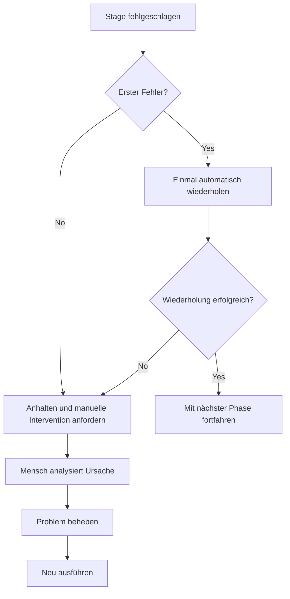
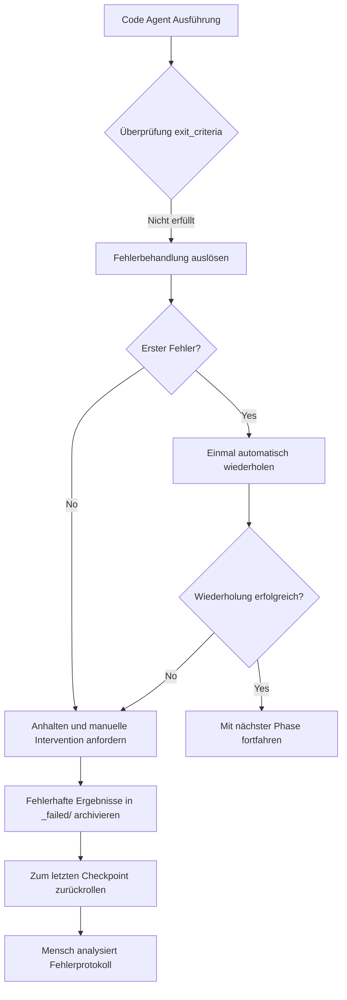
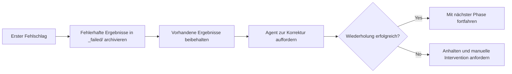
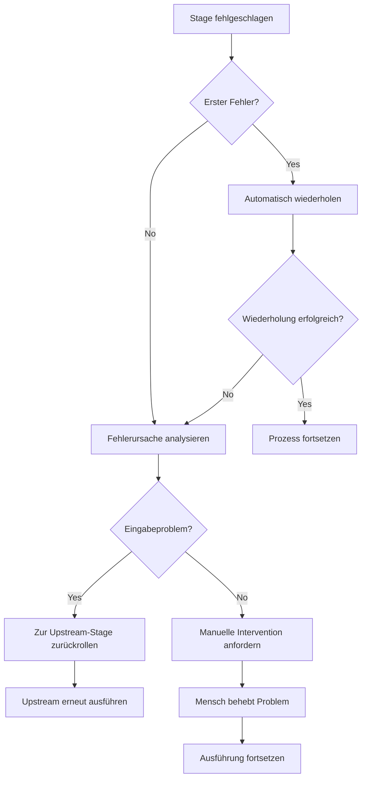

# Fehlerbehandlung und Rollback: Intelligente Fehlertoleranz und Fehlerwiederherstellung

## Was Sie nach dieser Lektion können

- **Fehlerarten erkennen**: Schnelles Identifizieren von Ursachen wie fehlender Ausgabe, inkonsistentem Inhalt oder unbefugtem Schreiben
- **Wiederholungsmechanismus verstehen**: Beherrschung der automatischen einmaligen Wiederholungsstrategie und der Archivierungsregeln bei Fehlschlägen
- **Rollback-Operationen ausführen**: Rückkehr zum letzten erfolgreichen Checkpoint und Wiederherstellung eines stabilen Zustands
- **Manuelle Intervention durchführen**: Wissen, wann menschliches Eingreifen erforderlich ist, und wie man Fehler analysiert und behebt
- **Fehlerprotokolle interpretieren**: Verstehen der Fehlerberichte in `pipeline/error.log` und schnelles Lokalisieren von Problemen

## Ihre aktuelle Situation

Bei der Pipeline-Ausführung machen Sie sich am meisten Sorgen über:

- **Was passiert bei Fehlern**: Eine Phase hat einen Fehler gemeldet – soll erneut versucht oder von vorne begonnen werden?
- **Datenverunreinigung**: Beeinflussen fehlerhafte Ergebnisse nachfolgende Phasen? Werden sie bereinigt?
- **Wie führt man einen Rollback durch**: Wie kommt man zum vorherigen erfolgreichen Zustand zurück?
- **Menschliche Intervention**: Nach aufeinanderfolgenden Fehlschlägen – was muss ich tun? Wie sehe ich die Protokolle?

Der Fehlerbehandlungsmechanismus wurde entwickelt, um genau diese Probleme zu lösen – er definiert den vollständigen Ablauf der Fehlererkennung, automatischen Wiederholung, Archivierung fehlerhafter Ergebnisse, Rollback zu Checkpoints und manueller Intervention.

## Wann Sie diesen Ansatz verwenden

Verwenden Sie diese Mechanismen, wenn die Pipeline folgende Situationen aufweist:

- **Phasenfehler**: Agent-Ausführung fehlgeschlagen, Ausgabedateien fehlen oder entsprechen nicht den Erwartungen
- **Unbefugte Operationen**: Agent hat in nicht autorisierte Verzeichnisse geschrieben und hat die Sicherheitsprüfung ausgelöst
- **Aufeinanderfolgende Fehler**: Dieselbe Phase ist zweimal fehlgeschlagen und erfordert eine manuelle Analyse
- **Rollback erforderlich**: Rückkehr zum vorherigen erfolgreichen Zustand für einen Neustart
- **Protokollanalyse**: Detaillierte Fehlerberichte und Stack-Informationen müssen angezeigt werden

## Grundlegender Ansatz

Die Fehlerbehandlungsstrategie wird vom Sisyphus-Scheduler einheitlich ausgeführt. Er fungiert als **Fehlertoleranz-Ingenieur**, der Fehler in der Pipeline automatisch behandelt oder eine manuelle Intervention anfordert.

### Fehlerdefinition

Folgende Situationen gelten als Stage-Fehler:

| Fehlertyp | Symptome | Code-Position |
|---------|----------|---------------|
| **Fehlende Ausgabe | In `pipeline.yaml` angegebene Ausgabedateien fehlen oder haben falsche Namen | `failure.policy.md:9` |
| **Nicht erfüllte exit_criteria** | Ausgabe erfüllt die Exit-Bedingungen in `pipeline.yaml` nicht | `failure.policy.md:10` |
| **Unbefugtes Schreiben** | Agent schreibt in nicht autorisierte Verzeichnisse oder Dateien | `failure.policy.md:11` |
| **Andere Ausnahmen** | Skriptfehler, fehlende Eingabe-Lesbarkeit etc. verhindern Aufgabenerfüllung | `failure.policy.md:12` |

### Wiederholungsmechanismus



**Wiederholungsregeln** (`failure.policy.md:16-18`):

- Jede Stage erlaubt standardmäßig **einmal automatische Wiederholung**
- Bei der Wiederholung fordert der Scheduler den Agenten auf, das Problem unter Beibehaltung der vorhandenen Ergebnisse zu beheben, nicht komplett neu zu beginnen
- Wenn der zweite Versuch ebenfalls fehlschlägt, muss der Scheduler die Pipeline anhalten und in den Prozess der manuellen Intervention übergehen

### Rollback und Archivierung

**Fehlerarchivierung** (`failure.policy.md:22-23`):

```bash
# Fehlgeschlagene Ergebnisse in _failed/-Verzeichnis verschieben
mv artifacts/<stage>/ artifacts/_failed/<stage-id>/attempt-1/
mv artifacts/<stage>/ artifacts/_failed/<stage-id>/attempt-2/
```

**Rollback-Strategie** (`failure.policy.md:23`):

- Der Scheduler rollt zum letzten erfolgreichen Checkpoint zurück
- Beginnt die erneute Ausführung ab dieser Stage
- Stellt sicher, dass Up- und Downstream-Ergebnisse konsistent sind, um Datenverunreinigung zu vermeiden

### Manuelle Intervention

**Interventionszeitpunkt** (`failure.policy.md:27`):

- Nach zweimaligem Fehlschlagen derselben Stage
- Bei Erkennung unbefugter Schreibvorgänge

**Interventionsprozess** (`failure.policy.md:27-29`):

1. Scheduler hält die Ausführung an und meldet die Fehlerursache
2. Menschliche Person prüft Eingabe, Konfiguration oder Skills auf Probleme
3. Menschliche Person ändert Eingabedateien, passt Skills an oder modifiziert Parameter
4. Setzt die Ausführung der verbleibenden Prozesse fort

::: warning Scheduler-Einschränkung
Der Scheduler darf ohne menschliche Bestätigung keine fehlerhafte Phase überspringen oder Ausgaben ändern.
:::

## Lernen Sie durch praktische Ausführung

### Schritt 1: Den Fehlerbehandlungsprozess verstehen

Wenn Sie die Pipeline ausführen, startet der Sisyphus-Scheduler automatisch den Fehlerbehandlungsprozess, wenn eine Phase fehlschlägt.

**Beispielszenario**: Code-Stage fehlschlagen



### Schritt 2: Fehlerprotokolle anzeigen

Bei einem Fehler protokolliert der Scheduler detaillierte Fehlerinformationen in `pipeline/error.log`.

**Fehlerprotokollformat** (`failure.policy.md:166-200`):

```bash
cat pipeline/error.log
```

**Sie sollten Folgendes sehen**:

```log
============================================
ERROR REPORT
============================================
Timestamp: 2026-01-29T10:30:00Z
Stage: code
Attempt: 2/2
Status: FAILED

Error Type: TypeScript Compilation Error
Error Message: Cannot find module '@prisma/client'

Stack Trace:
  at Object.<anonymous> (src/lib/prisma.ts:1:1)
  at Module._compile (node:internal/modules/cjs/loader:1198:14)

Exit Criteria Failed:
  - [ ] Backend startfähig und ohne kritische Fehler (FAILED)
  - [x] Client renderbar und erreichbar
  - [x] Keine zusätzliche Authentifizierung oder irrelevante Funktionen eingeführt

Failed Artifacts Moved To:
  artifacts/_failed/code/attempt-2/

Recommended Action:
  1. Prüfen, ob package.json @prisma/client enthält
  2. npx prisma generate ausführen, um Client zu generieren
  3. Code-Stage wiederholen

============================================
```

**Interpretation des Fehlerprotokolls**:

| Feld | Beschreibung | Beispiel |
|------|--------------|----------|
| **Timestamp** | Zeitpunkt des Fehlers | 2026-01-29T10:30:00Z |
| **Stage** | Fehlgeschlagene Phase | code |
| **Attempt** | Wiederholungsversuche | 2/2 (zweiter Fehlschlag) |
| **Status** | Aktueller Status | FAILED |
| **Error Type** | Fehlertyp | TypeScript Compilation Error |
| **Error Message** | Fehlerbeschreibung | Cannot find module '@prisma/client' |
| **Stack Trace** | Stack-Informationen | src/lib/prisma.ts:1:1 |
| **Exit Criteria Failed** | Nicht erfüllte Exit-Kriterien | Backend startfähig und ohne kritische Fehler (FAILED) |
| **Failed Artifacts Moved To** | Archivierungsort fehlerhafter Ergebnisse | artifacts/_failed/code/attempt-2/ |
| **Recommended Action** | Empfohlene Korrekturschritte | 1. Prüfen, ob package.json... |

### Schritt 3: Den Wiederholungsmechanismus verstehen

Beim ersten Fehlschlag löst Sisyphus automatisch eine Wiederholung aus.

**Wiederholungsprozess** (`failure.policy.md:16-18`):



**Wichtige Eigenschaften**:

- **Inkrementelle Korrektur**: Bei der Wiederholung fordert der Scheduler den Agenten auf, das Problem unter Beibehaltung der vorhandenen Ergebnisse zu beheben, nicht komplett neu zu beginnen
- **Fehlerarchivierung**: Jedes fehlerhafte Ergebnis wird nach `artifacts/_failed/<stage-id>/attempt-N/` verschoben, um die Vergleichsanalyse zu erleichtern
- **Einmal maximal**: Standardmäßig ist nur eine automatische Wiederholung erlaubt, um Endlosschleifen zu vermeiden

### Schritt 4: Fehlerarchivierung anzeigen

Wenn eine Phase fehlschlägt, werden alle fehlerhaften Ergebnisse im Verzeichnis `artifacts/_failed/` archiviert.

**Verzeichnisstruktur**:

```bash
artifacts/
├── _failed/
│   ├── code/
│   │   ├── attempt-1/
│   │   │   ├── backend/
│   │   │   └── client/
│   │   └── attempt-2/
│   │       ├── backend/
│   │       └── client/
│   ├── ui/
│   │   └── attempt-1/
│   └── prd/
│       └── attempt-1/
```

**Benennungsregeln für Archivierungsverzeichnisse**:

- `artifacts/_failed/<stage-id>/attempt-N/`
  - `<stage-id>`: Name der fehlgeschlagenen Phase (z. B. `code`, `ui`, `prd`)
  - `attempt-N`: Nummer des Versuchs (1 bedeutet erster Fehlschlag, 2 bedeutet zweiter Fehlschlag)

**Warum ist Archivierung notwendig**:

- **Vermeidung von Verunreinigung**: Fehlgeschlagene Ergebnisse beeinflussen nachfolgende Phasen nicht
- **Einfache Analyse**: Unterschiede zwischen verschiedenen Versuchen können verglichen werden, um die Fehlerursache zu finden
- **Nachweisbewahrung**: Fehlgeschlagene Ergebnisse werden für spätere Debugging-Zwecke aufbewahrt

### Schritt 5: Rollback-Operationen ausführen

Wenn Sie zum vorherigen Zustand zurückkehren müssen, können Sie die Rollback-Funktion verwenden.

**Rollback-Prozess** (`failure.policy.md:23`):

```bash
# Manuelles Rollback zum letzten Checkpoint
factory run <stage-id>

# Beispiel: Rollback zur tech-Phase für erneute Ausführung
factory run tech
```

**Rollback-Regeln**:

- **Rollback-Ziel**: Rückkehr zum letzten erfolgreichen Checkpoint
- **Zurücksetzen**: Löschen der Ergebnisse und Fehlerarchivierung der aktuellen Phase
- **Neu ausführen**: Erneuter Start ab der Zielphase

**Rollback-Beispiel**:

Nehmen wir an, Sie sind zweimal in der Code-Phase fehlgeschlagen und möchten zur tech-Phase zurückkehren, um die Architektur neu zu entwerfen:

```bash
# 1. Rollback zur tech-Phase
factory run tech

# 2. Der AI-Assistent führt den Tech Agent erneut aus
# 3. Erneute Generierung von artifacts/tech/ und artifacts/backend/prisma/
# 4. Dann wird die Code-Phase fortgesetzt
```

### Schritt 6: Manuelle Intervention durchführen

Nach zweimaligem aufeinanderfolgendem Fehlschlag hält Sisyphus die Pipeline an und fordert eine manuelle Intervention an.

**Interventionsentscheidungsbaum** (`failure.policy.md:204-236`):



**Checkliste für manuelle Intervention** (`failure.policy.md:240-263`):

#### Umgebungsprüfung

- [ ] Node.js-Version >= 18
- [ ] npm-Version >= 9
- [ ] Ausreichender Speicherplatz
- [ ] Netzwerkverbindung funktional (npm-Download)

#### Statusprüfung

- [ ] `.factory/state.json`-Status korrekt
- [ ] Upstream-Stage-Ergebnisse vollständig
- [ ] Fehlgeschlagene Ergebnisse in `_failed/` archiviert

#### Korrekturbestätigung

- [ ] Fehlerursache geklärt
- [ ] Korrekturmaßnahmen umgesetzt
- [ ] Relevante Konfigurationen aktualisiert

#### Wiederherstellungsausführung

- [ ] Neu starten ab der fehlgeschlagenen Stage
- [ ] Ausführungsprotokolle überwachen
- [ ] Ausgabeergebnisse validieren

### Schritt 7: Häufige Fehlerszenarien behandeln

Verschiedene Phasen haben unterschiedliche häufige Fehlerszenarien, im Folgenden finden Sie die Lösungsmöglichkeiten.

#### 7.1 Bootstrap-Phase fehlgeschlagen

**Häufige Fehler** (`failure.policy.md:35-48`):

| Fehlertyp | Symptome | Ursache | Lösung |
|---------|----------|---------|--------|
| **Fehlende Ausgabe** | `input/idea.md` existiert nicht | Agent hat Datei nicht korrekt geschrieben | Wiederholen, Schreibpfad prüfen |
| **Inhalt unvollständig** | idea.md fehlen Schlüsselkapitel | Unzureichende Benutzereingaben | Anhalten, Benutzer um Ergänzung bitten |
| **Formatfehler** | Entspricht nicht der Vorlagenstruktur | Agent hat Vorlage nicht befolgt | Wiederholen, Vorlagenanforderungen betonen |

**Behandlungsprozess**:

```bash
# 1. Prüfen, ob das input/-Verzeichnis existiert
ls -la input/

# 2. Wenn nicht vorhanden, Verzeichnis erstellen
mkdir -p input/

# 3. Bootstrap-Phase wiederholen
factory run bootstrap
```

#### 7.2 PRD-Phase fehlgeschlagen

**Häufige Fehler** (`failure.policy.md:50-65`):

| Fehlertyp | Symptome | Ursache | Lösung |
|---------|----------|---------|--------|
| **Technische Details enthalten** | PRD enthält Tech-Stack-Beschreibung | Agent hat Grenzen überschritten | Wiederholen, Verantwortungsgrenzen betonen |
| **Zu viele Funktionen** | Must Have > 7 | Scope Creep | Wiederholen, auf MVP vereinfachen |
| **Benutzerbeschreibung vage** | "Alle", "die meisten Benutzer" | Nicht konkretisiert | Wiederholen, spezifische User-Personas fordern |
| **Nicht-Ziele fehlen** | Non-Goals leer | Grenzen nicht definiert | Wiederholen, Auflistung von Nicht-Zielen fordern |

**Behandlungsprozess**:

```bash
# 1. Validieren, dass PRD keine technischen Schlüsselwörter enthält
grep -E "(React|API|Datenbank)" artifacts/prd/prd.md

# 2. Validieren, dass Anzahl der Must Have-Funktionen ≤ 7
grep -A 100 "Must Have" artifacts/prd/prd.md | wc -l

# 3. Wiederholen mit konkreten Korrekturanforderungen
factory run prd
```

#### 7.3 UI-Phase fehlgeschlagen

**Häufige Fehler** (`failure.policy.md:67-82`):

| Fehlertyp | Symptome | Ursache | Lösung |
|---------|----------|---------|--------|
| **Seiten überschritten** | Seitenanzahl > 8 | Scope Creep | Wiederholen, Seiten reduzieren |
| **Vorschau kann nicht geöffnet werden** | HTML-Datei beschädigt | Generierungsfehler | Wiederholen, HTML-Syntax prüfen |
| **KI-Stil verwendet** | Inter-Schriftart + lila Verlauf | Richtlinien nicht befolgt | Wiederholen, klaren Stil fordern |
| **Schema ungültig** | YAML-Parsing fehlgeschlagen | Syntaxfehler | Wiederholen, YAML-Syntax validieren |

**Behandlungsprozess**:

```bash
# 1. Anzahl der Seiten in ui.schema.yaml zählen
grep -c "page:" artifacts/ui/ui.schema.yaml

# 2. Vorschau im Browser öffnen versuchen
open artifacts/ui/preview.web/index.html

# 3. YAML-Syntax validieren
npx js-yaml artifacts/ui/ui.schema.yaml

# 4. Prüfen, ob verbotene KI-Stil-Elemente verwendet werden
grep -E "(Inter|lila|gradient)" artifacts/ui/ui.schema.yaml
```

#### 7.4 Tech-Phase fehlgeschlagen

**Häufige Fehler** (`failure.policy.md:84-99`):

| Fehlertyp | Symptome | Ursache | Lösung |
|---------|----------|---------|--------|
| **Prisma-Syntaxfehler** | schema.prisma ungültig | Syntaxproblem | Wiederholen, prisma validate ausführen |
| **Over-Engineering** | Mikroservices/Caching eingeführt | MVP-Prinzip verletzt | Wiederholen, Architektur vereinfachen |
| **Zu viele Datenmodelle** | Tabellenanzahl > 10 | Scope Creep | Wiederholen, Datenmodelle reduzieren |
| **API-Definition fehlt** | tech.md ohne Endpunkteliste | Inhalt unvollständig | Wiederholen, API ergänzen |

**Behandlungsprozess**:

```bash
# 1. Prisma-Validierung ausführen
cd artifacts/backend
npx prisma validate

# 2. Prüfen, ob tech.md die erforderlichen Kapitel enthält
grep -E "(API|Endpunkte|Routen)" artifacts/tech/tech.md

# 3. Anzahl der Datenmodelle zählen
grep -c "model " artifacts/backend/prisma/schema.prisma

# 4. Prüfen, ob unnötige komplexe Technologien eingeführt wurden
grep -E "(Mikroservices|Cache|Warteschlange)" artifacts/tech/tech.md
```

#### 7.5 Code-Phase fehlgeschlagen

**Häufige Fehler** (`failure.policy.md:101-131`):

| Fehlertyp | Symptome | Ursache | Lösung |
|---------|----------|---------|--------|
| **Abhängigkeitsinstallation fehlgeschlagen** | npm install-Fehler | Paketversionskonflikt | package.json prüfen, Version aktualisieren |
| **TypeScript-Fehler** | tsc-Kompilierung fehlgeschlagen | Typenproblem | Typfehler korrigieren, wiederholen |
| **Erforderliche Dateien fehlen** | Verzeichnisstruktur unvollständig | Generierung vergessen | Wiederholen, Dateiliste prüfen |
| **Tests fehlgeschlagen** | npm test fehlgeschlagen | Logikfehler im Code | Tests korrigieren, wiederholen |
| **API kann nicht gestartet werden** | Port-Listening fehlgeschlagen | Konfigurationsproblem | Umgebungsvariablen prüfen |

**Behandlungsprozess**:

```bash
# 1. Abhängigkeitsprüfung ausführen
cd artifacts/backend
npm install --dry-run

# 2. Typprüfung ausführen
npx tsc --noEmit

# 3. Verzeichnisstruktur gegen Dateiliste prüfen
ls -la src/

# 4. Tests ausführen
npm test

# 5. Wenn alles bestanden, Service starten versuchen
npm run dev
```

**Häufige Abhängigkeitsprobleme korrigieren** (`failure.policy.md:120-131`):

```bash
# Versionskonflikt
rm -rf node_modules package-lock.json
npm install

# Prisma-Versionskonflikt
npm install @prisma/client@latest prisma@latest

# React Native-Abhängigkeitsprobleme
cd artifacts/client
npx expo install --fix
```

#### 7.6 Validierungsphase fehlgeschlagen

**Häufige Fehler** (`failure.policy.md:133-147`):

| Fehlertyp | Symptome | Ursache | Lösung |
|---------|----------|---------|--------|
| **Validierungsbericht unvollständig** | report.md fehlen Kapitel | Agent nicht abgeschlossen | Wiederholen |
| **Zu viele kritische Probleme** | Fehleranzahl > 10 | Schlechte Qualität der Code-Phase | Zurückrollen zur Code-Phase |
| **Sicherheitsprobleme** | Hartcodierte Schlüssel erkannt | Sicherheitsverletzung | Rollback, Sicherheitsprobleme beheben |

**Behandlungsprozess**:

```bash
# 1. report.md parsen, um sicherzustellen, dass alle Kapitel vorhanden sind
grep -E "(## Zusammenfassung|## Backend|## Frontend|## Probleme)" artifacts/validation/report.md

# 2. Anzahl kritischer Probleme zählen
grep -c "Kritische Probleme" artifacts/validation/report.md

# 3. Wenn kritische Probleme > 10, Rollback zur Code-Phase empfehlen
factory run code

# 4. Sicherheitsüberprüfungsergebnisse prüfen
grep -E "(Schlüssel|Passwort|token)" artifacts/validation/report.md
```

#### 7.7 Vorschau-Phase fehlgeschlagen

**Häufige Fehler** (`failure.policy.md:149-162`):

| Fehlertyp | Symptome | Ursache | Lösung |
|---------|----------|---------|--------|
| **README unvollständig** | Installationsschritte fehlen | Inhalt vergessen | Wiederholen, Schritte ergänzen |
| **Docker-Build fehlgeschlagen** | Dockerfile-Fehler | Konfigurationsproblem | Dockerfile korrigieren |
| **Deploy-Konfiguration fehlt** | Kein docker-compose | Nicht generiert | Wiederholen, Konfiguration generieren lassen |

**Behandlungsprozess**:

```bash
# 1. Prüfen, ob README.md alle erforderlichen Kapitel enthält
grep -E "(## Schnellstart|## Installation|## Ausführung)" artifacts/preview/README.md

# 2. docker build ausführen, um Dockerfile zu validieren
cd artifacts/preview
docker build -t test-app .

# 3. Prüfen, ob Deploy-Konfigurationsdateien existieren
ls -la docker-compose.yml .github/workflows/
```

## Checkpoint ✅

Nach Abschluss dieser Lektion sollten Sie:

- [ ] Die 4 Fehlerarten verstehen (fehlende Ausgabe, inkonsistenter Inhalt, unbefugtes Schreiben, Ausnahmen)
- [ ] Den einmaligen automatischen Wiederholungsmechanismus beherrschen
- [ ] Wissen, dass fehlerhafte Ergebnisse in `artifacts/_failed/` archiviert werden
- [ ] Die Fehlerberichte in `pipeline/error.log` interpretieren können
- [ ] Den Rollback-Prozess zu Checkpoints verstehen
- [ ] Wann eine manuelle Intervention erforderlich ist
- [ ] Die Lösungsmöglichkeiten für häufige Fehlerszenarien beherrschen

## Häufige Stolpersteine

### Problem 1: Ergebnisse bei Wiederholung komplett neu erstellt

**Symptom**: Bei der zweiten Wiederholung werden alle Ergebnisse neu generiert, anstatt auf der Basis der vorhandenen korrigiert zu werden.

**Ursache**: Der Agent hat die Regel "Korrektur auf Basis vorhandener Ergebnisse" nicht befolgt.

**Lösung**:

Geben Sie dem Agenten bei der Wiederholung klare Anweisungen:

```markdown
Bitte korrigieren Sie das Problem auf Basis der vorhandenen Ergebnisse, erstellen Sie nicht komplett neu.
Behalten Sie die bereits korrekten Teile bei und ändern Sie nur die Teile, die nicht den exit_criteria entsprechen.
```

### Problem 2: Fehlgeschlagene Ergebnisse verunreinigen nachfolgende Phasen

**Symptom**: Fehlgeschlagene Ergebnisse wurden nicht archiviert und beeinflussen die Ausführung nachfolgender Phasen.

**Ursache**: Der Schritt zum Archivieren fehlerhafter Ergebnisse wurde nicht ausgeführt.

**Lösung**:

Archivieren Sie fehlerhafte Ergebnisse manuell:

```bash
# Fehlgeschlagene Ergebnisse in das _failed/-Verzeichnis verschieben
mv artifacts/<stage-id> artifacts/_failed/<stage-id>/attempt-1/

# Dann die Phase erneut ausführen
factory run <stage-id>
```

### Problem 3: Inkonsistente Ergebnisse nach Rollback

**Symptom**: Nach einem Rollback zur Upstream-Phase sind die Ergebnisse nicht mit den vorherigen konsistent.

**Ursache**: Beim Rollback wurde nur die aktuelle Phase zurückgesetzt, aber die abhängigen Downstream-Ergebnisse nicht geleert.

**Lösung**:

Vollständiger Rollback-Prozess:

```bash
# 1. Rollback zur Zielphase
factory run <target-stage>

# 2. Alle Downstream-Phasenergebnisse leeren
rm -rf artifacts/<downstream-stage-1>/
rm -rf artifacts/<downstream-stage-2>/

# 3. Neu ausführen
factory run
```

### Problem 4: Fortsetzung nach manueller Intervention scheitert

**Symptom**: Nach dem Beheben des Problems wird die Ausführung fortgesetzt, scheitert aber erneut.

**Ursache**: Die Korrekturmaßnahme ist unvollständig oder Änderungen wurden nicht gespeichert.

**Lösung**:

Checkliste für manuelle Intervention:

```bash
# 1. Bestätigen, dass die Fehlerursache geklärt ist
cat pipeline/error.log

# 2. Bestätigen, dass die Korrekturmaßnahme umgesetzt wurde
# Geänderte Dateien prüfen

# 3. Bestätigen, dass relevante Konfigurationen aktualisiert wurden
cat .factory/state.json

# 4. Neu ausführen
factory run <failed-stage>
```

### Problem 5: Fehlerprotokoll unvollständig

**Symptom**: In `pipeline/error.log` fehlen wichtige Informationen.

**Ursache**: Der Scheduler hat das Fehlerprotokoll nicht korrekt protokolliert.

**Lösung**:

Prüfen, ob die Protokolldatei existiert:

```bash
# Falls nicht vorhanden, manuell erstellen
mkdir -p pipeline
cat > pipeline/error.log << 'EOF'
ERROR REPORT
============================================
Timestamp: $(date -u +"%Y-%m-%dT%H:%M:%SZ")
Stage: <stage-id>
Attempt: 1/1
Status: FAILED

Error Type: Manual Debug
Error Message: Debug information needed

Stack Trace:
  (add stack trace if available)

Exit Criteria Failed:
  - [ ] exit-criteria-1
  - [ ] exit-criteria-2

Failed Artifacts Moved To:
  artifacts/_failed/<stage-id>/attempt-1/

Recommended Action:
  1. Describe the issue
  2. Provide fix steps
  3. Retry the stage

============================================
EOF
```

## Best Practices

### 1. Early Failure

**Prinzip**: Probleme so früh wie möglich erkennen, um Zeitverschwendung in nachfolgenden Phasen zu vermeiden.

**Praxis**:

- In der Bootstrap-Phase prüfen, ob Benutzereingaben vollständig sind
- In der PRD-Phase prüfen, ob technische Details enthalten sind (Verletzung der Verantwortungsgrenzen)
- In der UI-Phase prüfen, ob die Anzahl der Seiten angemessen ist

### 2. Detaillierte Protokollierung

**Prinzip**: Ausreichende Kontextinformationen protokollieren, um die Problemlösung zu erleichtern.

**Praxis**:

- Fehlerprotokolle enthalten Zeitstempel, Phase, Anzahl der Versuche, Fehlertyp, Stack-Informationen
- Empfohlene Korrekturschritte sind spezifisch bis zu Dateinamen und Zeilennummern
- Archivierung fehlerhafter Ergebnisse erleichtert die Vergleichsanalyse

### 3. Atomare Operationen

**Prinzip**: Die Ausgabe jeder Phase sollte atomar sein, um einen einfachen Rollback zu ermöglichen.

**Praxis**:

- Alle Ergebnisdateien auf einmal generieren, nicht schrittweise schreiben
- Bei einem Abbruch keine unvollständigen Ergebnisse behalten
- Die gesamten Phasenergebnisse archivieren, nicht nur teilweise Dateien

### 4. Beweisaufbewahrung

**Prinzip**: Fehlgeschlagene Ergebnisse archivieren, bevor wiederholt wird, um die Vergleichsanalyse zu erleichtern.

**Praxis**:

- Jeden Fehlschlag in einem `attempt-N/`-Unterverzeichnis archivieren
- Ergebnisse mehrerer Versuche aufbewahren, um Unterschiede zu vergleichen
- `git diff` verwenden, um Unterschiede zwischen verschiedenen Versuchen zu vergleichen

### 5. Progressive Wiederholung

**Prinzip**: Bei der Wiederholung spezifischere Anleitungen geben, anstatt einfach zu wiederholen.

**Praxis**:

```markdown
# Erster Fehlschlag
Bitte generieren Sie das PRD-Dokument.

# Zweite Wiederholung (spezifische Anleitung geben)
Bitte korrigieren Sie auf Basis des vorhandenen PRD folgende Probleme:
1. Löschen Sie alle technischen Details (wie React, API usw.)
2. Reduzieren Sie die Anzahl der Must-Have-Funktionen von 10 auf 7
3. Fügen Sie konkrete Personas für die Zielbenutzer hinzu
4. Ergänzen Sie das Kapitel Non-Goals und definieren Sie die Grenzen
```

## Zusammenfassung

Der Fehlerbehandlungsmechanismus ist die Fehlertoleranzsicherung von AI App Factory und stellt sicher, dass die Pipeline bei Fehlern automatisch wiederhergestellt werden kann oder eine manuelle Intervention anfordert.

**Wichtige Punkte**:

1. **Fehlerdefinition**: Fehlende Ausgabe, inkonsistenter Inhalt, unbefugtes Schreiben, andere Ausnahmen
2. **Wiederholungsmechanismus**: Jede Phase erlaubt einmal automatische Wiederholung, nach dem zweiten Fehlschlag wird eine manuelle Intervention angefordert
3. **Fehlerarchivierung**: Fehlgeschlagene Ergebnisse werden nach `artifacts/_failed/<stage-id>/attempt-N/` verschoben
4. **Rollback-Strategie**: Rollback zum letzten erfolgreichen Checkpoint, sicherzustellen, dass Up- und Downstream-Ergebnisse konsistent sind
5. **Manuelle Intervention**: Nach zweimaligem Fehlschlag, Ursache analysieren, Problem beheben, neu ausführen
6. **Fehlerprotokolle**: Detaillierte Fehlerberichte enthalten Zeitstempel, Phase, Fehlertyp, Stack-Informationen, empfohlene Korrekturschritte
7. **Häufige Szenarien**: Jede Phase hat spezifische häufige Fehler und Lösungsmöglichkeiten

## Vorschau der nächsten Lektion

> In der nächsten Lektion lernen wir **[Häufige Fragen und Fehlerbehebung](../../faq/troubleshooting/)**.
>
> Sie werden lernen:
> - Häufige Probleme in der Initialisierungsphase
> - Fehlerbehebung während der Ausführung
> - Bereitstellungsbezogene Probleme

---

## Anhang: Quellcode-Referenz

<details>
<summary><strong>Klicken, um Quellcodepositionen anzuzeigen</strong></summary>

> Aktualisiert am: 2026-01-29

| Funktion | Dateipfad | Zeilennummer |
|---------|-----------|--------------|
| Fehlerstrategie-Definition | [`source/hyz1992/agent-app-factory/policies/failure.policy.md`](https://github.com/hyz1992/agent-app-factory/blob/main/policies/failure.policy.md) | 1-276 |
| Scheduler-Fehlerbehandlung | [`source/hyz1992/agent-app-factory/agents/orchestrator.checkpoint.md`](https://github.com/hyz1992/agent-app-factory/blob/main/agents/orchestrator.checkpoint.md) | 38-46 |
| Fähigkeitsgrenzen-Matrix | [`source/hyz1992/agent-app-factory/policies/capability.matrix.md`](https://github.com/hyz1992/agent-app-factory/blob/main/policies/capability.matrix.md) | 1-40 |

**Fehlerdefinition** (`failure.policy.md:5-13`):
- Fehlende Ausgabe: In `pipeline.yaml` angegebene Ausgabedateien fehlen oder haben falsche Namen
- Nicht erfüllte exit_criteria: Ausgabe erfüllt die `exit_criteria` dieser Stage in `pipeline.yaml` nicht
- Unbefugtes Schreiben: Agent schreibt in nicht autorisierte Verzeichnisse oder Dateien
- Andere Ausnahmen: Skriptfehler, fehlende Eingabe-Lesbarkeit etc. verhindern Aufgabenerfüllung

**Wiederholungsmechanismus** (`failure.policy.md:16-18`):
- Jede Stage erlaubt standardmäßig einmal automatische Wiederholung
- Der Scheduler sollte den Agenten auffordern, das Problem unter Beibehaltung der vorhandenen Ergebnisse zu beheben, nicht komplett neu zu beginnen
- Wenn der zweite Versuch ebenfalls fehlschlägt, muss der Scheduler die Pipeline anhalten und in den Prozess der manuellen Intervention übergehen

**Rollback und Archivierung** (`failure.policy.md:22-23`):
- Fehlgeschlagene Ergebnisse werden in das Verzeichnis `artifacts/_failed/<stage-id>/` verschoben
- Rollback zum letzten erfolgreichen Checkpoint, erneute Ausführung ab dieser Stage

**Manuelle Intervention** (`failure.policy.md:27-29`):
- Wenn dieselbe Stage zweimal hintereinander fehlschlägt, muss der Scheduler die Ausführung anhalten und die Fehlerursache melden
- Nach menschlicher Intervention können Eingabedateien geändert, Skills angepasst oder Parameter modifiziert werden, bevor die Ausführung der verbleibenden Prozesse fortgesetzt wird
- Der Scheduler darf ohne menschliche Bestätigung keine fehlerhafte Phase überspringen oder Ausgaben ändern

**Fehlerprotokollformat** (`failure.policy.md:166-200`):
- Timestamp, Stage, Attempt, Status
- Error Type, Error Message, Stack Trace
- Exit Criteria Failed
- Failed Artifacts Moved To
- Recommended Action

**Häufige Fehlerszenarien** (`failure.policy.md:33-162`):
- Bootstrap-Phase: Fehlende Ausgabe, unvollständiger Inhalt, Formatfehler
- PRD-Phase: Technische Details enthalten, zu viele Funktionen, vage Benutzerbeschreibung, Nicht-Ziele fehlen
- UI-Phase: Seiten überschritten, Vorschau kann nicht geöffnet werden, KI-Stil verwendet, Schema ungültig
- Tech-Phase: Prisma-Syntaxfehler, Over-Engineering, zu viele Datenmodelle, API-Definition fehlt
- Code-Phase: Abhängigkeitsinstallation fehlgeschlagen, TypeScript-Fehler, erforderliche Dateien fehlen, Tests fehlgeschlagen, API kann nicht gestartet werden
- Validierungsphase: Validierungsbericht unvollständig, zu viele kritische Probleme, Sicherheitsprobleme
- Vorschau-Phase: README unvollständig, Docker-Build fehlgeschlagen, Deploy-Konfiguration fehlt

**Scheduler-Fehlerbehandlungsprozess** (`orchestrator.checkpoint.md:38-46`):
- `policies/failure.policy.md` lesen und nach der Strategie ausführen
- Den Agenten auffordern, das Problem unter Beibehaltung der vorhandenen Ergebnisse zu beheben und erneut zu versuchen
- Fehlgeschlagene Ergebnisse in das Verzeichnis `artifacts/_failed/<stage-id>/` verschieben
- Nach zweimaligem Fehlschlag die Pipeline anhalten, die Fehlerursache melden und auf menschliche Intervention warten

**Unbefugte Operationen behandeln** (`orchestrator.checkpoint.md:48-52`):
- Prüfen, ob der Ausgabepfad auf autorisierte Verzeichnisse beschränkt ist
- Wenn unbefugtes Schreiben entdeckt wird, dieses Ergebnis nach `artifacts/_untrusted/<stage-id>/` verschieben
- Ausführung anhalten und melden

**Interventionsentscheidungsbaum für manuelle Intervention** (`failure.policy.md:204-236`):
- Erster Fehler → Automatisch wiederholen → Wiederholung erfolgreich? → Weiter / Zweiter Fehler
- Zweiter Fehler → Fehlerursache analysieren → Eingabeproblem? → Zur Upstream-Stage zurückrollen / Manuelle Intervention anfordern

**Checkliste für Fehlerwiederherstellung** (`failure.policy.md:240-263`):
- Umgebungsprüfung: Node.js-Version, npm-Version, Speicherplatz, Netzwerkverbindung
- Statusprüfung: `.factory/state.json`, Upstream-Stage-Ergebnisse, Archivierung fehlerhafter Ergebnisse
- Korrekturbestätigung: Fehlerursache, Korrekturmaßnahme, relevante Konfigurationen
- Wiederherstellungsausführung: Neu starten ab der fehlgeschlagenen Stage, Protokolle überwachen, Ergebnisse validieren

**Best Practices** (`failure.policy.md:267-274`):
- Early Failure: Probleme so früh wie möglich erkennen, um Zeitverschwendung in nachfolgenden Stages zu vermeiden
- Detaillierte Protokollierung: Ausreichende Kontextinformationen protokollieren, um die Problemlösung zu erleichtern
- Atomare Operationen: Die Ausgabe jeder Stage sollte atomar sein, um einen einfachen Rollback zu ermöglichen
- Beweisaufbewahrung: Fehlgeschlagene Ergebnisse archivieren, bevor wiederholt wird, um die Vergleichsanalyse zu erleichtern
- Progressive Wiederholung: Bei der Wiederholung spezifischere Anleitungen geben, anstatt einfach zu wiederholen

</details>
