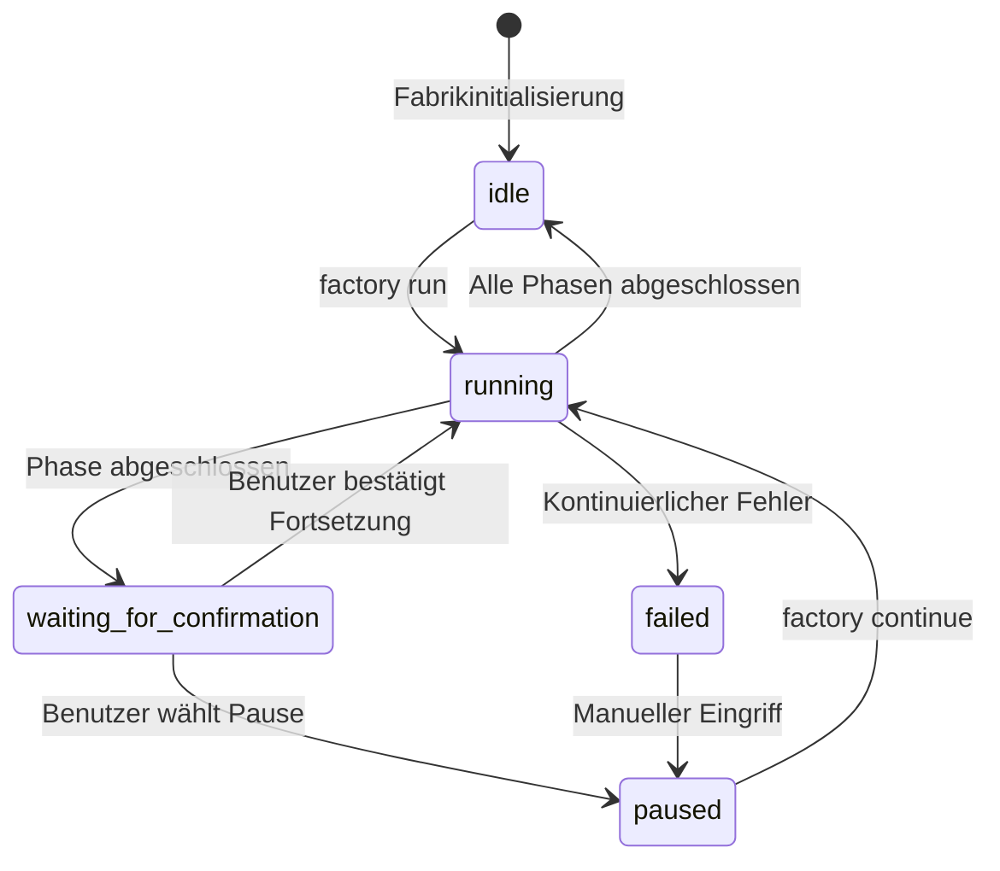
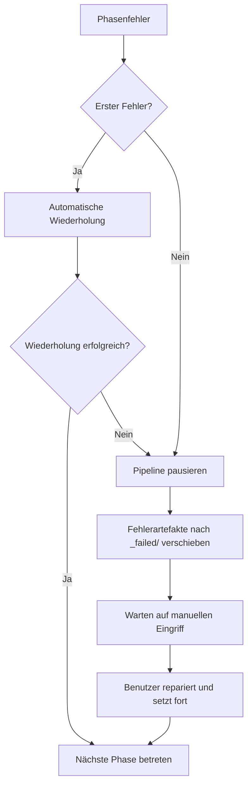

# Sisyphus-Orchestrator im Detail: Pipeline-Koordination und Zustandsverwaltung

## Was Sie nach diesem Tutorial können

- Verstehen, wie der Orchestrator die Ausführung der 7-Phasen-Pipeline koordiniert
- Die Funktionsweise der Zustandsmaschine und die Zustandsübergangsregeln begreifen
- Den Berechtigungsprüfmechanismus der Fähigkeitsgrenzenmatrix beherrschen
- Umgang mit Fehlerszenarien lernen (Wiederholung, Rollback, manueller Eingriff)
- Den Befehl `factory continue` zur Optimierung des Token-Verbrauchs nutzen

## Ihre aktuelle Situation

Sie haben bereits einige Pipelines ausgeführt, aber diese Fragen sind Ihnen vielleicht noch unklar:

- Was macht Sisyphus eigentlich genau? Was unterscheidet ihn von anderen Agenten?
- Warum können Agenten nur in bestimmten Verzeichnissen lesen und schreiben? Was passiert bei Berechtigungsüberschreitung?
- Wie behandelt der Orchestrator Fehler? Warum wird manchmal automatisch wiederholt und manchmal manueller Eingriff benötigt?
- Warum kann der Befehl `factory continue` Token sparen? Was steckt dahinter?

Wenn Sie diese Fragen interessieren, wird Ihnen dieses Kapitel helfen, sie vollständig zu verstehen.

## Wann Sie diese Technik anwenden

Wenn Sie:

- **Pipeline-Probleme debuggen** müssen: Verstehen, was der Orchestrator in einer bestimmten Phase tut und warum es fehlschlägt
- **Token-Verbrauch optimieren** möchten: Verwendung von `factory continue` zur Erstellung neuer Sitzungen pro Phase
- **Die Pipeline erweitern** wollen: Hinzufügen neuer Agenten oder Modifizieren bestehender Logik
- **Fehlerszenarien behandeln** müssen: Verstehen, warum eine Phase fehlschlägt und wie man sie wiederherstellt
- **Berechtigungsprobleme prüfen** wollen: Bestätigen, warum ein Agent nicht auf bestimmte Dateien zugreifen kann

## Kernkonzept

Der Sisyphus-Orchestrator ist der "Kommandant" der gesamten AI App Factory.

**Merken Sie sich diese Analogie**:

- Andere Agenten (bootstrap, prd, ui, tech, code, validation, preview) sind wie Arbeiter, die Aufgaben ausführen
- Sisyphus ist der Vorarbeiter, der Arbeiter koordiniert, die Arbeitsqualität prüft und Ausnahmen behandelt

**Die Besonderheiten von Sisyphus**:

| Eigenschaft | Sisyphus | Andere Agenten |
| --- | --- | --- |
| **Verantwortung** | Koordination, Validierung, Zustandsverwaltung | Generierung konkreter Artefakte |
| **Ausgabe** | Aktualisierung von state.json | Generierung von PRD, Code, Dokumentation etc. |
| **Berechtigungen** | Lesen und Schreiben von state.json | Lesen und Schreiben in bestimmte artifacts/-Unterverzeichnisse |
| **Generierter Inhalt** | Keine Geschäftsinhalte | Generierung konkreter Geschäftsartefakte |

**Wichtige Prinzipien**:

1. **Strikte Reihenfolge**: Muss gemäß pipeline.yaml-Definition ausgeführt werden, keine Überspringung oder Parallelisierung
2. **Einzelphasenausführung**: Zu jedem Zeitpunkt kann nur ein Agent aktiv sein
3. **Trennung der Verantwortlichkeiten**: Sisyphus modifiziert keine Geschäftsartefakte, sondern koordiniert und validiert nur
4. **Qualitätskontrolle**: Nach Abschluss jeder Phase müssen die Artefakte die exit_criteria erfüllen

## Zustandsmaschinenmodell

Sisyphus führt den gesamten Prozess als Zustandsmaschine aus. Das Verständnis der Zustandsmaschine ist der Schlüssel zur Beherrschung des Orchestrators.

### 5 Zustände



### Zustandsdetails

| Zustand | Beschreibung | Auslöser |
| --- | --- | --- |
| **idle** | Warten auf Start | Projektinitialisierung abgeschlossen oder Pipeline vollständig abgeschlossen |
| **running** | Führt gerade eine Stage aus | Nach factory run oder factory continue gestartet |
| **waiting_for_confirmation** | Warten auf manuelle Bestätigung | Nach Abschluss der aktuellen Stage, wartet auf Benutzerentscheidung für nächsten Schritt |
| **paused** | Manuell pausiert | Benutzer wählt Pause oder Pause nach kontinuierlichem Fehler |
| **failed** | Unbehandelter Fehler erkannt | Agent zweimal hintereinander fehlgeschlagen oder Berechtigungsüberschreitung beim Schreiben |

::: info Zustandsdatei
Alle Zustände werden in der Datei \`.factory/state.json\` gespeichert, Sisyphus hat die alleinige Aktualisierungsberechtigung.
:::

### Zustandsübergangsbeispiele

**Szenario 1: Normale Ausführung**

```
idle → running (factory run)
   ↓
waiting_for_confirmation (bootstrap abgeschlossen)
   ↓
running (Benutzer wählt Fortsetzung)
   ↓
waiting_for_confirmation (prd abgeschlossen)
   ↓
... (wiederholen bis alle Phasen abgeschlossen)
   ↓
idle
```

**Szenario 2: Fehlerwiederherstellung**

```
running → failed (code-Phase zweimal hintereinander fehlgeschlagen)
   ↓
paused (Manueller Eingriff zur Code-Korrektur)
   ↓
running (factory continue wiederholt code)
   ↓
waiting_for_confirmation
```

## Fähigkeitsgrenzenmatrix

### Warum wird Berechtigungskontrolle benötigt?

Stellen Sie sich vor:

- Was passiert, wenn der PRD-Agent Dateien modifiziert, die vom UI-Agenten generiert wurden?
- Was sind die Konsequenzen, wenn der Tech-Agent den vom Code-Agenten generierten Code liest?

**Antwort**: Verantwortungsverwirrung, nicht nachvollziehbare Artefakte, nicht garantierbare Qualität.

Die Fähigkeitsgrenzenmatrix gewährleistet die Trennung der Verantwortlichkeiten durch Einschränkung der Lese- und Schreibberechtigungen jedes Agenten.

### Berechtigungsmatrix

| Agent | Lesbare Verzeichnisse | Beschreibbare Verzeichnisse | Beschreibung |
| --- | --- | --- | --- |
| **bootstrap** | Keine | \`input/\` | Erstellt oder modifiziert nur \`idea.md\` im Verzeichnis \`input/\` |
| **prd** | \`input/\` | \`artifacts/prd/\` | Liest Ideendatei, generiert PRD |
| **ui** | \`artifacts/prd/\` | \`artifacts/ui/\` | Liest PRD, generiert UI-Schema und Vorschau |
| **tech** | \`artifacts/prd/\` | \`artifacts/tech/\`, \`artifacts/backend/prisma/\` | Liest PRD, generiert Technikdesign und Datenmodell |
| **code** | \`artifacts/ui/\`, \`artifacts/tech/\`, \`artifacts/backend/prisma/\` | \`artifacts/backend/\`, \`artifacts/client/\` | Generiert Code basierend auf UI und Technikdesign |
| **validation** | \`artifacts/backend/\`, \`artifacts/client/\` | \`artifacts/validation/\` | Validiert Codequalität, generiert Validierungsbericht |
| **preview** | \`artifacts/backend/\`, \`artifacts/client/\` | \`artifacts/preview/\` | Liest generierten Code, schreibt Demo-Anleitung |

### Berechtigungsprüfungsablauf

**Vor der Ausführung**:

1. Sisyphus liest capability.matrix.md
2. Teilt dem Agenten die erlaubten Lese- und Schreibverzeichnisse mit
3. Agent muss innerhalb des Berechtigungsbereichs operieren

**Nach der Ausführung**:

1. Sisyphus scannt neu erstellte oder modifizierte Dateien
2. Prüft, ob sie im autorisierten Verzeichnisbereich liegen
3. Bei Berechtigungsüberschreitung sofortige Behandlung

### Berechtigungsüberschreitungsbehandlungsmechanismus

Wenn ein Agent in ein nicht autorisiertes Verzeichnis schreibt:

1. **Artefaktisolation**: Verschiebt Berechtigungsüberschreitungsdateien nach `artifacts/_untrusted/&lt;stage-id&gt;/`
2. **Fehleraufzeichnung**: Markiert das Ereignis als fehlgeschlagen
3. **Pipeline-Pause**: Wartet auf manuellen Eingriff
4. **Bereitstellung von Reparaturvorschlägen**: Teilt dem Benutzer mit, wie mit nicht vertrauenswürdigen Dateien umzugehen ist

**Beispiel**:

```
⚠️  Unauthorized writes detected for stage "prd":
   - artifacts/ui/ui.schema.yaml

Files moved to quarantine: artifacts/_untrusted/prd

Please review these files before proceeding.
```

## Checkpoint-Mechanismus

Nach Abschluss jeder Phase pausiert Sisyphus und wartet auf manuelle Bestätigung. Dies ist der Checkpoint-Mechanismus.

### Wert der Checkpoints

- **Qualitätskontrolle**: Manuelle Validierung der Artefakte jeder Phase
- **Flexible Kontrolle**: Jederzeit Pausieren, Wiederholen oder Überspringen möglich
- **Einfaches Debugging**: Probleme können früh erkannt werden, ohne sich bis zum Ende anzuhäufen

### Checkpoint-Ausgabevorlage

Nach Abschluss jeder Phase zeigt Sisyphus Optionen im folgenden Format an:

```
✓ prd abgeschlossen!

Generierte Artefakte:
- artifacts/prd/prd.md

┌─────────────────────────────────────────────────────────────┐
│  📋 Bitte wählen Sie den nächsten Schritt aus                                         │
│  Geben Sie die Optionsnummer (1-5) ein und drücken Sie Enter zur Bestätigung                        │
└─────────────────────────────────────────────────────────────┘

┌──────┬──────────────────────────────────────────────────────┐
│ Option │ Beschreibung                                                  │
├──────┼──────────────────────────────────────────────────────┤
│  1   │ Nächste Phase fortsetzen (gleiche Sitzung)                               │
│      │ Ich werde die ui-Phase ausführen                                   │
├──────┼──────────────────────────────────────────────────────┤
│  2   │ Neue Sitzung fortsetzen ⭐ Empfohlene Option, spart Token                   │
│      │ Führen Sie in einem neuen Terminalfenster aus: factory continue               │
│      │ (Startet automatisch ein neues Claude Code-Fenster und setzt die Pipeline fort)        │
├──────┼──────────────────────────────────────────────────────┤
│  3   │ Diese Phase wiederholen                                             │
│      │ prd-Phase erneut ausführen                                      │
├──────┼──────────────────────────────────────────────────────┤
│  4   │ Nach Artefaktmodifikation erneut ausführen                                     │
│      │ Nach Modifikation von input/idea.md erneut ausführen                          │
├──────┼──────────────────────────────────────────────────────┤
│  5   │ Pipeline pausieren                                             │
│      │ Aktuellen Fortschritt speichern, später fortsetzen                                 │
└──────┴──────────────────────────────────────────────────────┘

💡 Tipp: Geben Sie eine Zahl zwischen 1-5 ein und drücken Sie Enter zur Bestätigung Ihrer Auswahl
```

::: tip Empfohlene Vorgehensweise
**Option 2 (Neue Sitzung fortsetzen) ist die beste Praxis**, siehe nächster Abschnitt "Kontextoptimierung".
:::

## Fehlerbehandlungsstrategien

Wenn eine Phase fehlschlägt, behandelt Sisyphus sie gemäß vordefinierter Strategie.

### Fehlerdefinition

**Von Sisyphus als Fehler betrachtete Situationen**:

- Ausgabedateien fehlen (erforderliche generierte Dateien existieren nicht)
- Ausgabeinhalt entspricht nicht exit_criteria (z.B. PRD ohne User Stories)
- Agent-Berechtigungsüberschreitung beim Schreiben (Schreiben in nicht autorisiertes Verzeichnis)
- Kontinuierliche Ausführungsfehler des Agenten (Skriptfehler, kann Eingabe nicht lesen)

### Fehlerbehandlungsablauf



### Automatischer Wiederholungsmechanismus

- **Standardregel**: Jede Phase erlaubt eine automatische Wiederholung
- **Wiederholungsstrategie**: Problemkorrektur basierend auf bestehenden Artefakten
- **Fehlerarchivierung**: Nach Wiederholungsfehler werden Artefakte nach `artifacts/_failed/&lt;stage-id&gt;/attempt-2/` verschoben

### Szenarien für manuellen Eingriff

**Situationen, die manuellen Eingriff erfordern**:

1. **Zweimaliger kontinuierlicher Fehler**: Nach automatischer Wiederholung immer noch fehlgeschlagen
2. **Berechtigungsüberschreitung**: Agent hat in nicht autorisiertes Verzeichnis geschrieben
3. **Skriptfehler**: Ausnahme während der Agentenausführung

**Ablauf des manuellen Eingriffs**:

1. Sisyphus pausiert die Pipeline
2. Zeigt Fehlerursache und Fehlermeldung an
3. Bietet Reparaturvorschläge:
   - Eingabedateien modifizieren
   - Agentendefinition anpassen
   - Skill-Dateien aktualisieren
4. Nach Benutzerreparatur \`factory continue\` ausführen, um fortzusetzen

## Kontextoptimierung (Token sparen)

### Problembeschreibung

Wenn Sie alle 7 Phasen in derselben Sitzung ausführen, stehen Sie vor folgenden Problemen:

- **Kontextakkumulation**: Die KI muss sich an alle historischen Konversationen erinnern
- **Token-Verschwendung**: Wiederholtes Lesen historischer Artefakte
- **Kostensteigerung**: Längere Sitzungen verbrauchen mehr Token

### Lösung: Sitzungsbasierte Ausführung

**Kernkonzept**: Jede Phase in einer neuen Sitzung ausführen.

```
Sitzung 1: bootstrap
  ├─ Generiert input/idea.md
  ├─ Aktualisiert state.json
  └─ Beendet Sitzung

Sitzung 2: prd
  ├─ Liest state.json (lädt nur aktuellen Zustand)
  ├─ Liest input/idea.md (liest nur Eingabedatei)
  ├─ Generiert artifacts/prd/prd.md
  ├─ Aktualisiert state.json
  └─ Beendet Sitzung

Sitzung 3: ui
  ├─ Liest state.json
  ├─ Liest artifacts/prd/prd.md
  ├─ Generiert artifacts/ui/ui.schema.yaml
  ├─ Aktualisiert state.json
  └─ Beendet Sitzung
```

### Verwendung

**Schritt 1**: Nach Abschluss einer Phase in der aktuellen Sitzung "Neue Sitzung fortsetzen" wählen

```
┌──────┬──────────────────────────────────────────────────────┐
│ Option │ Beschreibung                                                  │
├──────┼──────────────────────────────────────────────────────┤
│  2   │ Neue Sitzung fortsetzen ⭐ Empfohlene Option, spart Token                   │
│      │ Führen Sie in einem neuen Terminalfenster aus: factory continue               │
│      │ (Startet automatisch ein neues Claude Code-Fenster und setzt die Pipeline fort)        │
└──────┴──────────────────────────────────────────────────────┘
```

**Schritt 2**: Neues Terminalfenster öffnen und ausführen:

```bash
factory continue
```

Dieser Befehl führt automatisch aus:
1. Liest \`.factory/state.json\` für aktuellen Fortschritt
2. Startet neues Claude Code-Fenster
3. Setzt von der nächsten auszuführenden Phase fort

### Vorteile der Kontextisolation

| Vorteil | Beschreibung |
| --- | --- |
| **Token sparen** | Kein Laden historischer Konversationen und Artefakte erforderlich |
| **Stabilitätsverbesserung** | Vermeidung von Kontextexplosion, die die KI vom Ziel ablenken könnte |
| **Einfaches Debugging** | Jede Phase ist unabhängig, Probleme leichter zu lokalisieren |
| **Unterbrechungswiederherstellung** | Kann nach jedem Checkpoint unterbrochen und wiederhergestellt werden |

## Pflicht-Skill-Verwendungsvalidierung

Bestimmte Phasen erfordern die Verwendung spezifischer Skills zur Gewährleistung der Ausgabequalität. Sisyphus validiert die Verwendung dieser Skills.

### bootstrap-Phase

**Pflichtanforderung**: Muss den Skill \`superpowers:brainstorm\` verwenden

**Validierungsmethode**:

1. Prüft, ob in der Agentenausgabemeldung explizit angegeben ist, dass dieser Skill verwendet wurde
2. Falls nicht erwähnt, Ablehnung der Artefakte
3. Aufforderung zur erneuten Ausführung mit expliziter Betonung der Skill-Verwendung

**Fehlermeldung**:

```
❌ Nicht-Verwendung von superpowers:brainstorm Skill erkannt
Bitte verwenden Sie diesen Skill, um die Benutzeridee gründlich zu erforschen, bevor Sie idea.md generieren
```

### ui-Phase

**Pflichtanforderung**: Muss den Skill \`ui-ux-pro-max\` verwenden

**Validierungsmethode**:

1. Prüft, ob in der Agentenausgabemeldung explizit angegeben ist, dass dieser Skill verwendet wurde
2. Prüft die Designsystemkonfiguration in \`ui.schema.yaml\`
3. Falls die Designsystemkonfiguration nicht professionell empfohlen wird, Ablehnung der Artefakte

**Fehlermeldung**:

```
❌ Nicht-Verwendung von ui-ux-pro-max Skill erkannt
Bitte verwenden Sie diesen Skill, um ein professionelles Designsystem und UI-Prototyp zu generieren
```

### Kontinuierliche Fehlerbehandlung

Wenn eine Phase zweimal hintereinander wegen Skill-Validierungsfehler fehlschlägt:

1. Pipeline pausieren
2. Manuellen Eingriff anfordern
3. Agentendefinition und Skill-Konfiguration prüfen

## Praxisübung: Debuggen einer fehlgeschlagenen Phase

Nehmen wir an, die code-Phase ist fehlgeschlagen, wir zeigen Ihnen, wie Sie debuggen.

### Schritt 1: state.json anzeigen

```bash
cat .factory/state.json
```

**Beispielausgabe**:

```json
{
  "version": "1.0",
  "status": "failed",
  "currentStage": "code",
  "completedStages": ["bootstrap", "prd", "ui", "tech"],
  "failedStages": ["code"],
  "stageHistory": [
    {
      "stageId": "code",
      "status": "failed",
      "startTime": "2026-01-29T10:00:00Z",
      "endTime": "2026-01-29T10:15:00Z",
      "attempts": 2,
      "error": "Exit criteria not met: Missing package.json"
    }
  ],
  "lastCheckpoint": "tech",
  "createdAt": "2026-01-29T09:00:00Z",
  "updatedAt": "2026-01-29T10:15:00Z"
}
```

**Wichtige Informationen**:

- \`status: failed\` - Pipeline fehlgeschlagen
- \`currentStage: code\` - Aktuelle fehlgeschlagene Phase
- \`completedStages\` - 4 Phasen abgeschlossen
- \`error: "Exit criteria not met: Missing package.json"\` - Fehlerursache

### Schritt 2: Fehlerartefakte prüfen

```bash
ls -la artifacts/_failed/code/attempt-2/
```

**Beispielausgabe**:

```
drwxr-xr-x  5 user  staff  160 Jan 29 10:15 .
drwxr-xr-x  3 user  staff   96 Jan 29 10:15 ..
-rw-r--r--  1 user  staff 2.1K Jan 29 10:15 server.ts
-rw-r--r--  1 user  staff 1.5K Jan 29 10:15 client.ts
```

**Problemerkennung**: \`package.json\`-Datei fehlt!

### Schritt 3: exit_criteria anzeigen

```bash
cat .factory/pipeline.yaml | grep -A 10 'code:'
```

**Beispielausgabe**:

```yaml
code:
  agent: agents/code.agent.md
  inputs:
    - artifacts/ui/ui.schema.yaml
    - artifacts/tech/tech.md
    - artifacts/backend/prisma/schema.prisma
  outputs:
    - artifacts/backend/package.json
    - artifacts/backend/server.ts
    - artifacts/client/package.json
    - artifacts/client/app.ts
  exit_criteria:
    - package.json existiert
    - Enthält korrekte Abhängigkeiten
    - Code besteht Typprüfung
```

**Problembestätigung**: Code-Agent hat \`package.json\` nicht generiert, verletzt exit_criteria.

### Schritt 4: Problem beheben

**Option 1**: Code-Agentendefinition modifizieren

```bash
nano .factory/agents/code.agent.md
```

Fordern Sie in der Agentendefinition explizit die Generierung von \`package.json\`:

```markdown
## Erforderliche Dateien

Sie müssen folgende Dateien generieren:
- artifacts/backend/package.json (enthält korrekte Abhängigkeiten)
- artifacts/backend/server.ts
- artifacts/client/package.json
- artifacts/client/app.ts
```

**Option 2**: Eingabedateien modifizieren

Wenn das Problem in der Tech-Design-Phase liegt, können Sie das Technikdesign modifizieren:

```bash
nano artifacts/tech/tech.md
```

Ergänzen Sie explizite Abhängigkeitsbeschreibungen.

### Schritt 5: Pipeline fortsetzen

Nach Problemlösung erneut ausführen:

```bash
factory continue
```

Sisyphus wird:
1. state.json lesen (Status failed)
2. Von lastCheckpoint (tech) fortsetzen
3. code-Phase erneut ausführen
4. Artefakte auf Übereinstimmung mit exit_criteria validieren

## Zusammenfassung dieser Lektion

Der Sisyphus-Orchestrator ist der "Kommandant" der AI App Factory, verantwortlich für:

- **Pipeline-Koordination**: Sequentielle Ausführung der 7 Phasen
- **Zustandsverwaltung**: Pflege von state.json, Fortschrittsverfolgung
- **Berechtigungsprüfung**: Sicherstellung, dass Agenten nur in autorisierten Verzeichnissen lesen und schreiben
- **Fehlerbehandlung**: Automatische Wiederholung, Archivierung fehlgeschlagener Artefakte, Warten auf manuellen Eingriff
- **Qualitätskontrolle**: Validierung, ob Artefakte jeder Phase die exit_criteria erfüllen

**Kernprinzipien**:

1. Strikte sequentielle Ausführung, keine Überspringung oder Parallelisierung
2. Zu jedem Zeitpunkt kann nur ein Agent aktiv sein
3. Alle Artefakte müssen in das Verzeichnis artifacts/ geschrieben werden
4. Nach Abschluss jeder Phase ist manuelle Bestätigung erforderlich
5. Empfohlene Verwendung von \`factory continue\` zum Token-Sparen

**Merken Sie sich dieses Flussdiagramm**:

```
factory run → pipeline.yaml lesen → Phase ausführen → Artefakte validieren → Checkpoint-Bestätigung
     ↑                                                                      │
     └──────────────────── factory continue (neue Sitzung) ←──────────────────────┘
```

## Vorschau auf die nächste Lektion

> In der nächsten Lektion lernen Sie **[Kontextoptimierung: Sitzungsbasierte Ausführung](../context-optimization/)** kennen.
>
> Sie werden lernen:
> - Verwendung des Befehls \`factory continue\`
> - Warum sitzungsbasierte Ausführung Token spart
> - Wie man den Orchestrator in der Entwicklungsumgebung testet
> - Häufige Debugging-Techniken und Log-Analyse

## Anhang: Quellcode-Referenz

<details>
<summary><strong>Klicken Sie zum Anzeigen der Quellcode-Positionen</strong></summary>

> Aktualisierungszeit: 2026-01-29

| Funktion | Dateipfad | Zeilennummer |
| --- | --- | --- |
| Orchestrator-Kerndefinition | [\`source/hyz1992/agent-app-factory/agents/orchestrator.checkpoint.md\`](https://github.com/hyz1992/agent-app-factory/blob/main/agents/orchestrator.checkpoint.md) | Volltext |
| Orchestrator-Implementierungsleitfaden | [\`source/hyz1992/agent-app-factory/agents/orchestrator-implementation.md\`](https://github.com/hyz1992/agent-app-factory/blob/main/agents/orchestrator-implementation.md) | Volltext |
| Fähigkeitsgrenzenmatrix | [\`source/hyz1992/agent-app-factory/policies/capability.matrix.md\`](https://github.com/hyz1992/agent-app-factory/blob/main/policies/capability.matrix.md) | Volltext |
| Fehlerbehandlungsstrategien | [\`source/hyz1992/agent-app-factory/policies/failure.policy.md\`](https://github.com/hyz1992/agent-app-factory/blob/main/policies/failure.policy.md) | Volltext |
| Pipeline-Definition | [\`source/hyz1992/agent-app-factory/pipeline.yaml\`](https://github.com/hyz1992/agent-app-factory/blob/main/pipeline.yaml) | Volltext |

**Wichtige Funktionen**:

- \`executeStage()\` - Führt eine einzelne Phase aus (Zeilen 117-189)
- \`waitForCheckpointConfirmation()\` - Wartet auf Checkpoint-Bestätigung (Zeilen 195-236)
- \`handleStageFailure()\` - Behandelt Phasenfehler (Zeilen 242-289)
- \`checkUnauthorizedWrites()\` - Prüft Berechtigungsüberschreitungen beim Schreiben (Zeilen 295-315)
- \`getPermissions()\` - Ruft Berechtigungsmatrix ab (Zeilen 429-467)

**Wichtige Konstanten**:

- Zustands-Enumerationen: \`idle\`, \`running\`, \`waiting_for_confirmation\`, \`paused\`, \`failed\`
- Maximale Wiederholungsanzahl: 2 (Zeile 269)
- Pfadauflösungspriorität: \`.factory/\` → Root-Verzeichnis (Zeilen 31-33)

</details>
