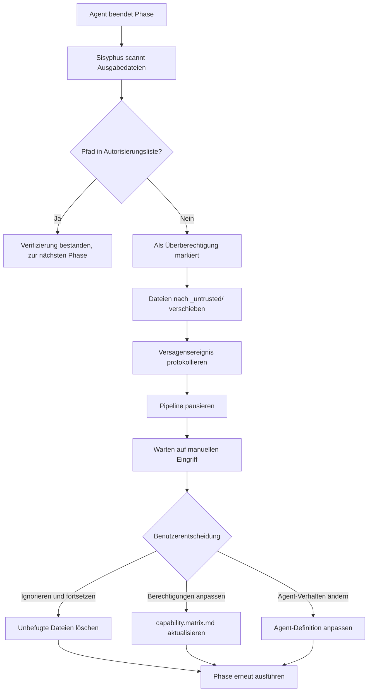

# Berechtigungen und Sicherheitsmechanismen: Capability-Boundary-Matrix und Überberechtigungsprävention

## Was Sie nach Abschluss können

- Das Designprinzip der Capability-Boundary-Matrix und der Berechtigungsisolationsmechanismen verstehen
- Die Konfiguration von Claude Code-Berechtigungsdateien erlernen und die Verwendung von `--dangerously-skip-permissions` vermeiden
- Den Verarbeitungsablauf und die Wiederherstellungsmethoden für Überberechtigungsoperationen beherrschen
- Den Mechanismus der erzwungenen Fähigkeitsnutzungsverifizierung verstehen
- Berechtigungsbezogene Sicherheitsprobleme identifizieren und beheben können

## Ihre derzeitigen Herausforderungen

Möglicherweise sind Sie auf folgende Situationen gestoßen:

- Unklar, warum ein Agent nicht auf bestimmte Dateien zugreifen kann
- Bei der Ausführung von `factory run` werden Sie immer wieder zur Erlaubnis aufgefordert, und Sie haben direkt `--dangerously-skip-permissions` zum Überspringen verwendet
- Unklare Berechtigungsgrenzen zwischen Agents, mit der Sorge, dass Überberechtigungsoperationen zu Datenverunreinigungen führen
- Nach Auftreten von Überberechtigungen wissen Sie nicht, wie Sie diese verarbeiten und wiederherstellen sollen

Wenn diese Probleme Sie belasten, wird dieses Kapitel Ihnen helfen, ein vollständiges Verständnis von Berechtigungen und Sicherheit aufzubauen.

## Wann verwenden Sie diese Methode

Wenn Sie Folgendes benötigen:

- **Claude Code konfigurieren**: Richten Sie die richtige Berechtigungsdatei für ein Factory-Projekt ein
- **Berechtigungsprobleme debuggen**: Untersuchen Sie, warum ein Agent nicht auf bestimmte Dateien lesen oder schreiben kann
- **Überberechtigungs-Ausnahmen verarbeiten**: Wiederherstellen unterbrochener Pipelines durch Überberechtigungsoperationen
- **Agenten erweitern**: Definieren Sie die Berechtigungsgrenzen beim Hinzufügen neuer Agents
- **Sicherheitsaudit**: Überprüfen Sie, ob die Berechtigungskonfiguration bestehender Projekte angemessen ist

## Kernkonzept

Der Sicherheitsmechanismus von AI App Factory basiert auf der **Capability-Boundary-Matrix**, um sicherzustellen, dass jeder Agent nur in autorisierten Verzeichnissen arbeiten kann.

**Merken Sie sich diese Analogie**:

- Ein Agent ist wie ein **Facharbeiter in einer Fabrik**
- Die Capability-Boundary-Matrix ist wie eine **Arbeitserlaubnis**, die ausdrücklich regelt, welche Werkhallen ein Facharbeiter betreten darf und welche Geräte er bedienen kann
- Der Sisyphus-Scheduler ist wie ein **Sicherheitsbeauftragter**, der bei Ein- und Austritt aus Werkhallen die Erlaubnis prüft, um sicherzustellen, dass keine Überberechtigungen erfolgen

**Dreischichtiger Schutzmechanismus**:

| Ebene | Verantwortung | Prüfungszeitpunkt |
| --- | --- | --- |
| **Claude Code-Berechtigungen** | Dateisystem-Lese-/Schreibberechtigungen | Beim Start des KI-Assistenten |
| **Capability-Boundary-Matrix** | Agent-Verzeichnisszugriffsberechtigungen | Vor und nach der Phasenausführung |
| **Erzwungene Fähigkeitsverifizierung** | Anforderung an die Nutzung bestimmter Fähigkeiten in bestimmten Phasen | Bootstrap- und UI-Phasen |

## Detaillierte Erläuterung der Capability-Boundary-Matrix

### Warum ist eine Berechtigungsisolierung erforderlich?

Stellen Sie sich vor, was ohne Berechtigungseinschränkungen passieren würde:

- **Ein PRD-Agent hat UI-Dateien geändert**: Das UI-Design wurde verwüstet und kann nicht zurückverfolgt werden
- **Ein Tech-Agent hat Code-Dateien gelesen**: Die technische Architektur wird durch die Code-Implementierung beeinflusst und weicht vom MVP-Prinzip ab
- **Ein Code-Agent hat das PRD geändert**: Das Anforderungsdokument wird durch Codelogik "verunreinigt", was zu unklaren Zuständigkeiten führt

**Antwort**: Unklare Zuständigkeitsgrenzen, nicht rückverfolgbare Artefakte, ungarantierte Qualität.

Die Capability-Boundary-Matrix gewährleistet die Trennung von Zuständigkeiten, indem sie die Lese-/Schreibberechtigungen jedes Agents einschränkt.

### Berechtigungsmatrix-Tabelle

| Agent | Lesbare Verzeichnisse | Beschreibbare Verzeichnisse | Beschreibung |
| --- | --- | --- | --- |
| **bootstrap** | Keine | `input/` | Erstellt oder ändert nur `idea.md` im `input/`-Verzeichnis |
| **prd** | `input/` | `artifacts/prd/` | Liest Ideendatei, generiert PRD; Schreibzugriff auf andere Verzeichnisse verboten |
| **ui** | `artifacts/prd/` | `artifacts/ui/` | Liest PRD, generiert UI-Schema und Vorschau |
| **tech** | `artifacts/prd/` | `artifacts/tech/`, `artifacts/backend/prisma/` | Liest PRD, generiert technisches Design und Datenmodell |
| **code** | `artifacts/ui/`, `artifacts/tech/`, `artifacts/backend/prisma/` | `artifacts/backend/`, `artifacts/client/` | Generiert Backend- und Clientcode basierend auf UI und technischem Design; Änderungen an Upstream-Artefakten verboten |
| **validation** | `artifacts/backend/`, `artifacts/client/` | `artifacts/validation/` | Überprüft Codequalität, generiert Validierungsbericht; schreibgeschützt ohne Codeänderungen |
| **preview** | `artifacts/backend/`, `artifacts/client/` | `artifacts/preview/` | Liest generierte Dienste und Clients, erstellt Demo-Dokumentation |

::: tip Kernprinzip
- **Unidirektionale Abhängigkeit**: Ein Agent kann nur Artefakte aus Upstream-Phasen lesen, nicht aus Downstream- oder gleichrangigen Phasen
- **Unabhängige Zuständigkeiten**: Jeder Agent kann nur in sein eigenes Output-Verzeichnis schreiben
- **Überberechtigungsverbot**: Unautorisierte Lese-/Schreiboperationen gelten als Sicherheitsverstoß
:::

### Berechtigungsprüfungsprozess

Der Sisyphus-Scheduler führt vor und nach der Ausführung jeder Phase Berechtigungsprüfungen durch:

**Vor der Ausführung (Informieren über Berechtigungen)**:

```
1. Sisyphus liest capability.matrix.md
2. Übermittelt die lesbaren und beschreibbaren Verzeichnisse des aktuellen Agents an den KI-Assistenten
3. Der KI-Assistent muss diese Einschränkungen bei der Ausführung einhalten
```

**Nach der Ausführung (Überprüfen der Ausgabe)**:

```
1. Sisyphus scannt neu erstellte oder geänderte Dateien
2. Überprüft, ob Dateipfade im autorisierten Verzeichnisbereich des Agents liegen
3. Wenn eine Überberechtigung festgestellt wird, wird diese sofort behandelt (siehe Überberechtigungsverarbeitungsmechanismus)
```

::: info Automatisierung vs. manuell
Die Berechtigungsprüfung wird hauptsächlich automatisch durch das Berechtigungssystem des KI-Assistenten (Claude Code) und die Verifizierungslogik von Sisyphus durchgeführt. Nur in Ausnahmesituationen wie Überberechtigungen ist ein manueller Eingriff erforderlich.
:::

## Claude Code-Berechtigungen konfigurieren

### Warum wird --dangerously-skip-permissions nicht empfohlen?

Möglicherweise haben Sie folgenden Befehl gesehen:

```bash
claude --dangerously-skip-permissions
```

**Das Problem mit dieser Option**:

| Problem | Beschreibung | Risiko |
| --- | --- | --- |
| **Alle Prüfungen überspringen** | Claude Code verifiziert keine Dateioperationen mehr | KI kann Systemdateien versehentlich löschen oder ändern |
| **Sicherheitslücke** | Agent kann beliebige Verzeichnisse lesen und schreiben | Überberechtigungsoperationen können nicht abgefangen werden |
| **Nicht rückverfolgbar** | Keine Berechtigungsgrenzen, Probleme schwer zu lokalisieren | Debugging und Wartung erschwert |

### Factory generiert automatisch Berechtigungskonfigurationen

Die Factory-CLI generiert bei der Projektinitialisierung automatisch `.claude/settings.local.json` mit präzisen Berechtigungskonfigurationen:

**Generierungszeitpunkt**: Bei der Ausführung des Befehls `factory init`

**Konfigurationsinhalt** (Quellcodeposition: `cli/utils/claude-settings.js:41-91`):

```json
{
  "permissions": {
    "allow": [
      // ========== Dateioperationsberechtigungen ==========
      "Read(/path/to/project/**)",
      "Write(/path/to/project/**)",
      "Glob(/path/to/project/**)",
      "Edit(/path/to/project/*,**)",
      
      // ========== Git-Operationsberechtigungen ==========
      "Bash(git add:*)",
      "Bash(git commit:*)",
      "Bash(git push:*)",
      // ... mehr git-Befehle
      
      // ========== Build-Tool-Berechtigungen ==========
      "Bash(npm install:*)",
      "Bash(npm run:*)",
      "Bash(npx:*)",
      
      // ========== TypeScript-Berechtigungen ==========
      "Bash(tsc:*)",
      "Bash(npx type-check:*)",
      
      // ========== Datenbank (Prisma) Berechtigungen ==========
      "Bash(npx prisma validate:*)",
      "Bash(npx prisma generate:*)",
      "Bash(npx prisma migrate dev:*)",
      
      // ========== Factory-CLI-Berechtigungen ==========
      "Bash(factory init:*)",
      "Bash(factory run:*)",
      "Bash(factory continue:*)",
      
      // ========== Docker-Berechtigungen ==========
      "Bash(docker compose:*)",
      "Bash(docker build:*)",
      
      // ========== Fähigkeiten (Plugins) Berechtigungen ==========
      "Skill(superpowers:brainstorming)",
      "Skill(superpowers:writing-plans)",
      "Skill(ui-ux-pro-max)",
      "Skill(*)"),
      
      // ========== Web-Operationsberechtigungen ==========
      "WebFetch(domain:github.com)",
      "WebFetch(domain:npmjs.org)",
      
      // ========== Allgemeine Tool-Berechtigungen ==========
      "Bash(curl:*)",
      "Bash(grep:*)",
      "Bash(find:*)"
    ]
  },
  "features": {
    "autoSave": true,
    "telemetry": false
  }
}
```

**Merkmale der Berechtigungskonfiguration**:

| Merkmal | Beschreibung | Beispiel |
| --- | --- | --- |
| **Projektspezifische Einschränkungen** | Nur Lese-/Schreibzugriff auf das aktuelle Projektverzeichnis | `Read(/Users/xxx/my-app/**)` |
| **Befehlsseitige präzise Steuerung** | Jeder Befehl hat ein explizites Berechtigungsmuster | `Bash(npm install:*)` erlaubt nicht `npm install --global` |
| **Plattformübergreifende Unterstützung** | Automatische Anpassung an Windows- und Unix-Pfade | Windows verwendet `//d/**`, Unix verwendet `/path/**` |
| **Fähigkeits-Whitelist** | Explizite Liste der erlaubten Fähigkeiten | `Skill(superpowers:brainstorming)` |

**Überprüfen, ob die Konfiguration wirksam ist**:

```bash
# Generierte Berechtigungskonfiguration anzeigen
cat .claude/settings.local.json

# Überprüfen, ob Datei existiert
ls -la .claude/settings.local.json
```

::: warning Plattformunterschiede
Die Pfadformate von Windows und Unix/macOS unterscheiden sich:
- Windows: `//C/**` oder `//d/**` (Laufwerksbuchstaben)
- Unix/macOS: `/Users/username/project/**`

Factory erkennt automatisch die aktuelle Plattform und generiert das korrekte Pfadformat.
:::

## Überberechtigungsverarbeitungsmechanismus

### Was ist eine Überberechtigungsoperation?

**Überberechtigungsdefinition**: Ein Agent hat in ein Verzeichnis geschrieben, das nicht in seiner Autorisierungsliste enthalten ist.

**Typische Szenarien**:

| Agent | Autorisiertes Schreibverzeichnis | Überberechtigtes Schreibverzeichnis | Problem |
| --- | --- | --- | --- |
| **prd** | `artifacts/prd/` | `artifacts/ui/` | PRD-Agent hat UI-Dateien unrechtmäßig geändert |
| **tech** | `artifacts/tech/` | `artifacts/prd/` | Tech-Agent hat das Anforderungsdokument geändert |
| **code** | `artifacts/backend/` | `artifacts/prd/` | Code-Agent hat rückwirkend Upstream-Artefakte geändert |

### Überbereitigungsverarbeitungsprozess

Wenn Sisyphus eine überberechtigte Schreiboperation erkennt:



### Überbereitigungsartefakt-Isolierung

Überberechtigte Dateien werden in das Verzeichnis `artifacts/_untrusted/<stage-id>/` verschoben:

**Beispiel**: PRD-Agent schreibt überberechtigt nach `artifacts/ui/`

```
artifacts/
├── prd/
│   └── prd.md
├── ui/
│   └── ui.schema.yaml  ← Sollte hier sein, wurde aber vom PRD-Agenten geschrieben
└── _untrusted/
    └── prd/
        └── ui/
            └── ui.schema.yaml  ← Überberechtigte Datei wurde hierher verschoben
```

**Fehlermeldung**:

```
⚠️  Unauthorized writes detected for stage "prd":

Untrusted files:
  - artifacts/ui/ui.schema.yaml

Files moved to quarantine: artifacts/_untrusted/prd/artifacts/ui/ui.schema.yaml

Pipeline paused. Please review these files before proceeding.

Choose action:
  1. Delete untrusted files and retry
  2. Adjust permissions in capability.matrix.md
  3. Modify Agent behavior in .factory/agents/prd.agent.md
  4. Continue (accept untrusted files) - Not recommended
```

### Manueller Eingriff

**Option 1: Unbefugte Dateien löschen und erneut ausführen** (empfohlen)

```bash
# Unbefugte Dateien anzeigen
ls -la artifacts/_untrusted/prd/

# Unbefugte Dateien löschen
rm -rf artifacts/_untrusted/prd/

# Phase erneut ausführen
factory continue
```

**Option 2: Berechtigungsmatrix anpassen**

Wenn die Überberechtigung berechtigt ist (z. B. ein Agent muss tatsächlich in ein zusätzliches Verzeichnis schreiben):

```bash
# Berechtigungsmatrix bearbeiten
nano .factory/policies/capability.matrix.md

# Schreibverzeichnisse des Agents anpassen
# Beispiel: Hinzufügen von Schreibberechtigung `artifacts/ui/` für den prd-Agenten

# Erneut ausführen
factory continue
```

**Option 3: Agent-Verhalten ändern**

Wenn die Überberechtigung ein Agent-Fehler ist:

```bash
# Agent-Definition bearbeiten
nano .factory/agents/prd.agent.md

# Explizites Verbot des Schreibens in nicht autorisierte Verzeichnisse
# Hinzufügen der Anweisung: "Schreiben in artifacts/ui/ oder andere nicht autorisierte Verzeichnisse verboten"

# Erneut ausführen
factory continue
```

::: danger Warnung
Option 4 (Unbefugte Dateien akzeptieren) ist **äußerst nicht empfehlenswert**, da:
- Dies gegen das Designprinzip der Berechtigungsisolierung verstößt
- Dies zu unklaren Zuständigkeiten führt, die nicht rückverfolgbar sind
- Nachfolgende Phasen aufgrund falscher Artefakte fehlschlagen können
:::

## Erzwungene Fähigkeitsnutzungsverifizierung

Bestimmte Phasen erfordern die Verwendung bestimmter Fähigkeiten, um die Ausgabequalität zu gewährleisten. Sisyphus verifiziert die Nutzung dieser Fähigkeiten.

### Bootstrap-Phasenverifizierung

**Erzwungene Anforderung**: Muss die Fähigkeit `superpowers:brainstorm` verwenden

**Warum?**

- Die Brainstorming-Fähigkeit bietet einen strukturierten Denkrahmen
- Stellt sicher, dass Produktideen tiefgründig ausgegraben werden, nicht nur oberflächlich beschrieben
- Verhindert, dass der Agent wichtige Analyseschritte überspringt

**Verifizierungsmethode**:

1. Überprüfen, ob der Agent in seinen Ausgabemeldungen explizit angibt, dass er die Fähigkeit verwendet hat
2. Wenn nicht erwähnt, Annahme des Artefakts ablehnen
3. Erneute Ausführung anfordern, mit ausdrücklichem Hinweis, dass die Fähigkeit verwendet werden muss

**Fehlermeldung**:

```
❌ Nicht verwendete superpowers:brainstorm-Fähigkeit erkannt

Der Bootstrap-Agent muss die superpowers:brainstorm-Fähigkeit verwenden, um Benutzerideen tiefgründig auszugraben.

Bitte führen Sie die Bootstrap-Phase erneut aus und geben Sie in der Ausgabe explizit an:
"Ich habe die superpowers:brainstorm-Fähigkeit verwendet, um Benutzerideen zu analysieren..."
```

**Korrektes Beispiel**:

```
Ich habe die superpowers:brainstorm-Fähigkeit verwendet, um Benutzerideen tiefgründig zu analysieren.

Durch die Brainstorming-Fähigkeit habe ich folgende Schlüsselpunkte identifiziert:
- Kernproblem: [Problembeschreibung]
- Zielbenutzer: [Benutzerprofil]
- Wertversprechen: [Wertpunkte]
- Schlüsselannahmen: [Annahmenliste]

Generierte Ideendatei: input/idea.md
```

### UI-Phasenverifizierung

**Erzwungene Anforderung**: Muss die Fähigkeit `ui-ux-pro-max` verwenden

**Warum?**

- Die UI/UX Pro Max-Fähigkeit bietet einen professionellen Design-System-Rahmen
- Vermeidet "AI-Standard-Stil" (Inter-Schriftart, lila Farbverläufe usw.)
- Gewährleistet Konsistenz und Wartbarkeit des Designentwurfs

**Verifizierungsmethode**:

1. Überprüfen, ob der Agent in seinen Ausgabemeldungen explizit angibt, dass er die Fähigkeit verwendet hat
2. Überprüfen, ob die Design-System-Konfiguration in `ui.schema.yaml` professionell ist
3. Wenn die Design-System-Konfiguration nicht professionell empfohlen ist, Annahme des Artefakts ablehnen

**Fehlermeldung**:

```
❌ Nicht verwendete ui-ux-pro-max-Fähigkeit erkannt

Der UI-Agent muss die ui-ux-pro-max-Fähigkeit verwenden, um ein professionelles Design-System und UI-Prototypen zu generieren.

Bitte führen Sie die UI-Phase erneut aus und geben Sie in der Ausgabe explizit an:
"Ich habe die ui-ux-pro-max-Fähigkeit verwendet, um das UI-System zu entwerfen..."
```

**Korrektes Beispiel**:

```
Ich habe die ui-ux-pro-max-Fähigkeit verwendet, um das UI-System und Prototypen zu entwerfen.

Durch die ui-ux-pro-max-Fähigkeit habe ich gewählt:
- Designrichtung: [konkreter Stil, z. B.: Minimalismus / Cyberpunk]
- Farbsystem: [Farbschema]
- Schriftsystem: [Schriftartenauswahl]
- Komponentenbibliothek: [Komponentenspezifikation]

Generierte UI-Artefakte:
- artifacts/ui/ui.schema.yaml
- artifacts/ui/preview.web/index.html
```

### Behandlung wiederholter Fehler

Wenn eine Phase zweimal hintereinander aufgrund von Fähigkeitsverifizierung fehlschlägt:

1. Pipeline pausieren
2. Manuellen Eingriff anfordern
3. Überprüfen Sie folgende mögliche Probleme:
   - Ob der KI-Assistent die entsprechende Fähigkeit (Plugin) installiert hat
   - Ob die Agent-Definition explizit die Verwendung dieser Fähigkeit anfordert
   - Ob der Skill-Dateipfad korrekt ist

## Praxisübung: Behandlung von Überbereitigungsausnahmen

Angenommen, der PRD-Agent hat überberechtigt in das UI-Verzeichnis geschrieben, wir schauen uns den vollständigen Verarbeitungsprozess an.

### Schritt 1: Überberechtigung identifizieren

Nach Abschluss der PRD-Phase meldet Sisyphus:

```
⚠️  Unauthorized writes detected for stage "prd":

Untrusted files:
  - artifacts/ui/ui.schema.yaml

Files moved to quarantine: artifacts/_untrusted/prd/artifacts/ui/ui.schema.yaml

Pipeline paused.
```

### Schritt 2: Unbefugte Dateien anzeigen

```bash
# Inhalt der unbefugten Dateien anzeigen
cat artifacts/_untrusted/prd/artifacts/ui/ui.schema.yaml

# Beispielausgabe:
```
```yaml
# PRD-Agent generiertes UI-Schema (Überbereitigungsartefakt)
pages:
  - name: Home
    components:
      - Hero
      - Features
```

### Schritt 3: Ursachenanalyse

**Mögliche Ursachen**:

| Ursache | Beschreibung | Nachweis |
| --- | --- | --- |
| **Agent-Fehler** | PRD-Agent hat fälschlicherweise UI-Dateien generiert | Dateiinhalt enthält tatsächlich UI-Struktur |
| **Unklarer Prompt** | Agent-Definition verbietet das Schreiben in andere Verzeichnisse nicht | Muss `.factory/agents/prd.agent.md` überprüfen |
| **Fehlerhafte Berechtigungskonfiguration** | Schreibberechtigung des PRD-Agenten zu groß | Muss `capability.matrix.md` überprüfen |

**Agent-Definition überprüfen**:

```bash
cat .factory/agents/prd.agent.md
```

**Berechtigungsmatrix überprüfen**:

```bash
cat .factory/policies/capability.matrix.md | grep -A 1 "prd"
```

**Ausgabe**:

```
| **prd** | `input/` | `artifacts/prd/` | Liest Ideendatei, generiert PRD; Schreibzugriff auf andere Verzeichnisse verboten |
```

Die Berechtigungsmatrix ist korrekt, das Problem liegt im Agent-Verhalten.

### Schritt 4: Agent-Definition korrigieren

Agent-Definition bearbeiten, explizites Verbot hinzufügen:

```bash
nano .factory/agents/prd.agent.md
```

**Hinzuzufügender Inhalt**:

```markdown
## Verbotene Aktionen

- ❌ **Schreiben in das Verzeichnis `artifacts/ui/` verboten**: UI-Design wird vom UI-Agenten übernommen
- ❌ **Schreiben in das Verzeichnis `artifacts/tech/` verboten**: Technische Architektur wird vom Tech-Agenten übernommen
- ❌ **Schreiben in `artifacts/backend/` oder `artifacts/client/` verboten**: Codegenerierung wird vom Code-Agenten übernommen
- ✅ **Nur in das Verzeichnis `artifacts/prd/` schreiben**: PRD-Dokument generieren
```

### Schritt 5: Unbefugte Dateien löschen, erneut ausführen

```bash
# Unbefugte Dateien löschen
rm -rf artifacts/_untrusted/prd/

# PRD-Phase erneut ausführen
factory continue
```

### Schritt 6: Reparatur verifizieren

Überprüfen, ob die PRD-Phase erneut überberechtigt:

```bash
# Generierte Artefakte anzeigen
ls -la artifacts/prd/

# Bestätigen, dass keine anderen Verzeichnisse beschrieben wurden
ls -la artifacts/_untrusted/prd/

# Die Ausgabe sollte leer sein, was bedeutet, dass keine neuen Überberechtigungen vorliegen
```

**Erfolgsanzeige**:

```
✓ prd abgeschlossen!

Generierte Artefakte:
- artifacts/prd/prd.md

... (Prüfpunktoptionen)

Keine Überberechtigungswarnungen aufgetreten
```

## Sicherheitsbewährte Verfahren

### 1. Berechtigungskonfiguration bei der Initialisierung überprüfen

```bash
# Sofort nach der Ausführung von factory init überprüfen
cat .claude/settings.local.json

# Überprüfen Sie folgende Inhalte:
# ✅ permissions.allow-Array vorhanden
# ✅ Projektpfad korrekt (Windows: //d/**, Unix: /path/**)
# ✅ Enthält erforderliche Befehlsberechtigungen (npm, git, factory, docker usw.)
# ✅ Enthält Skill-Berechtigungen (superpowers, ui-ux-pro-max)
```

### 2. Berechtigungsmatrix regelmäßig überprüfen

```bash
# Berechtigungsmatrix überprüfen
cat .factory/policies/capability.matrix.md

# Bestätigen Sie:
# ✅ Lese-/Schreibberechtigungen jedes Agents angemessen sind
# ✅ Keine übermäßige Autorisierung (z. B. sollte Code-Agent nicht in PRD schreiben)
# ✅ Überbereitigungsverarbeitungsmechanismus klar definiert ist
```

### 3. Überbereitigungsereignisse überwachen

```bash
# Überprüfen, ob unbefugte Dateien vorhanden sind
ls -la artifacts/_untrusted/

# Wenn unbefugte Dateien vorhanden sind, Ursachen analysieren:
# - Ist es ein Agent-Fehler?
# - Ist die Berechtigungskonfiguration unangemessen?
# - Müssen Agent-Definitionen angepasst werden?
```

### 4. Versionskontrolle zum Schutz von Konfigurationsdateien verwenden

```bash
# Wichtige Konfigurationsdateien in Git aufnehmen
git add .claude/settings.local.json
git add .factory/policies/capability.matrix.md
git commit -m "chore: Sicherheitskonfigurationsdateien hinzufügen"
```

**Grund**:

- Verhindert versehentliches Löschen oder Ändern von Konfigurationen
- Unterstützt die versionsbezogene Rückverfolgung von Berechtigungskonfigurationen
- Behält konsistente Berechtigungen bei der Teamarbeit

::: warning Sollte settings.local.json übergeben werden?
Obwohl der Name `local` enthält, ist die von Factory generierte `.claude/settings.local.json` eine projektspezifische Berechtigungskonfiguration, die in die Versionskontrolle aufgenommen werden sollte. Alle Teammitglieder sollten die gleiche Berechtigungskonfiguration verwenden.
:::

### 5. Berechtigungskonfiguration regelmäßig aktualisieren

Wenn folgende Situationen auftreten, muss die Berechtigungskonfiguration aktualisiert werden:

| Auslösende Bedingung | Zu aktualisierende Konfiguration |
| --- | --- |
| Neuen Agent hinzufügen | `capability.matrix.md` aktualisieren |
| Neue Build-Tools einführen | Bash-Berechtigungen in `settings.local.json` aktualisieren |
| Neue Fähigkeiten (Plugins) hinzufügen | Skill-Berechtigungen in `settings.local.json` aktualisieren |
| Agent-Zuständigkeiten anpassen | `capability.matrix.md` aktualisieren |

**Aktualisierungsprozess**:

```bash
# 1. Konfigurationsdateien bearbeiten
nano .claude/settings.local.json
# oder
nano .factory/policies/capability.matrix.md

# 2. Änderungen übergeben
git add .claude/settings.local.json
git add .factory/policies/capability.matrix.md
git commit -m "security: Berechtigungen für neuen Agent/Tool aktualisiert"

# 3. Berechtigungen neu initialisieren (optional)
# Wenn capability.matrix.md geändert wurde, sind keine zusätzlichen Operationen erforderlich, Sisyphus liest automatisch
# Wenn settings.local.json geändert wurde, ist möglicherweise ein Neustart von Claude Code erforderlich
```

## Häufige Sicherheitsprobleme beheben

### Problem 1: Agent kann Datei nicht lesen

**Symptom**:

```
❌ Error: Cannot read file: artifacts/prd/prd.md
```

**Schritte zur Fehlerbehebung**:

1. Überprüfen, ob Datei existiert
   ```bash
   ls -la artifacts/prd/prd.md
   ```

2. Leseberechtigungen des Agents überprüfen
   ```bash
   cat .factory/policies/capability.matrix.md | grep -A 1 "prd"
   ```
   Bestätigen Sie, dass das lesbare Verzeichnis des Agents das Verzeichnis enthält, in dem die Datei liegt.

3. Claude Code-Berechtigungskonfiguration überprüfen
   ```bash
   cat .claude/settings.local.json | grep "Read"
   ```
   Bestätigen Sie, dass die Leseberechtigung für das Projektverzeichnis vorhanden ist.

### Problem 2: Agent kann Datei nicht schreiben

**Symptom**:

```
❌ Error: Cannot write file: artifacts/prd/prd.md
```

**Schritte zur Fehlerbehebung**:

1. Schreibberechtigungen des Agents überprüfen
   ```bash
   cat .factory/policies/capability.matrix.md | grep -A 1 "prd"
   ```
   Bestätigen Sie, dass das beschreibbare Verzeichnis des Agents das Zielverzeichnis enthält.

2. Claude Code-Berechtigungskonfiguration überprüfen
   ```bash
   cat .claude/settings.local.json | grep "Write"
   ```
   Bestätigen Sie, dass die Schreibberechtigung für das Projektverzeichnis vorhanden ist.

3. Überprüfen, ob Verzeichnis existiert
   ```bash
   ls -la artifacts/prd/
   ```
   Wenn das Verzeichnis nicht existiert, erstellt der Agent es automatisch, benötigt jedoch Schreibberechtigung.

### Problem 3: Überberechtigungswarnungen treten häufig auf

**Symptom**:

Derselbe Agent hat häufig Überberechtigungswarnungen.

**Schritte zur Fehlerbehebung**:

1. Überberechtigungsmuster analysieren
   ```bash
   ls -la artifacts/_untrusted/<stage-id>/
   ```
   Sehen Sie, in welche Verzeichnisse der Agent immer schreibt.

2. Agent-Definition überprüfen
   ```bash
   cat .factory/agents/<stage>.agent.md
   ```
   Bestätigen Sie, ob es explizite Verbotsanweisungen gibt.

3. Überlegen Sie, ob Berechtigungen angepasst werden müssen
   - Wenn die Überberechtigung berechtigt ist → `capability.matrix.md` aktualisieren
   - Wenn die Überberechtigung ein Fehler ist → Agent-Definition ändern

### Problem 4: Fähigkeitsverifizierung fehlerhaft

**Symptom**:

```
❌ Nicht verwendete superpowers:brainstorm-Fähigkeit erkannt
```

**Schritte zur Fehlerbehebung**:

1. Bestätigen Sie, dass die Fähigkeit installiert ist
   - Überprüfen Sie, ob der KI-Assistent das entsprechende Plugin installiert hat
   - Claude Code: Überprüfen Sie die Skill-Berechtigungen in `settings.local.json`
   - OpenCode: Überprüfen Sie die Plugin-Liste

2. Agent-Definition überprüfen
   ```bash
   cat .factory/agents/<stage>.agent.md
   ```
   Bestätigen Sie, dass der Agent explizit die Verwendung dieser Fähigkeit anfordert.

3. Skill-Dateipfad überprüfen
   ```bash
   ls -la .factory/skills/<stage>/skill.md
   ```
   Bestätigen Sie, dass die Skill-Datei existiert und der Pfad korrekt ist.

## Zusammenfassung dieser Lektion

Berechtigungs- und Sicherheitsmechanismen sind das zentrale Schutzsystem von AI App Factory, einschließlich:

**Dreischichtiger Schutz**:

1. **Claude Code-Berechtigungen**: Dateisystem-Lese-/Schreibberechtigungen, konfiguriert durch `settings.local.json`
2. **Capability-Boundary-Matrix**: Agent-Verzeichnisszugriffsberechtigungen, definiert durch `capability.matrix.md`
3. **Erzwungene Fähigkeitsverifizierung**: Anforderungen an die Fähigkeitsnutzung in bestimmten Phasen, verifiziert durch Sisyphus

**Kernprinzipien**:

- Zuständigkeitsentrennung: Jeder Agent kann nur autorisierte Verzeichnisse lesen und schreiben
- Unidirektionale Abhängigkeit: Ein Agent kann nur Upstream-Artefakte lesen, nicht Downstream- oder gleichrangige Artefakte
- Überbereitigungs-Isolierung: Überberechtigte Dateien werden automatisch nach `_untrusted/` verschoben und warten auf manuelle Bearbeitung
- Fähigkeitsgarantie: Bootstrap- und UI-Phasen müssen angegebene Fähigkeiten verwenden

**Praxispunkte**:

- Überprüfen Sie bei der Initialisierung, ob die Berechtigungskonfiguration korrekt generiert wurde
- Überprüfen Sie regelmäßig die Capability-Boundary-Matrix, um sicherzustellen, dass Berechtigungen angemessen sind
- Überwachen Sie Überbereitigungsereignisse und beheben Sie Agent-Verhalten rechtzeitig
- Verwenden Sie Versionskontrolle, um Konfigurationsdateien zu schützen
- Wenn Probleme auftreten, lokalisieren Sie die Ursache gemäß dem Fehlerbehebungsprozess

**Merken Sie diesen Prozess**:

```
factory init → Berechtigungskonfiguration generieren → Pipeline ausführen → Sisyphus überprüft Berechtigungen
       ↓                                                      │
       └── Überberechtigung? → Nach _untrusted/ verschieben → Manueller Eingriff → Reparatur → Fortsetzen ──┘
```

## Vorschau auf die nächste Lektion

> In der nächsten Lektion lernen wir **[Fehlerbehandlung und Rollback](../failure-handling/)**.
>
> Sie werden lernen:
> - Fehleridentifikationsmechanismen (fehlende Ausgabe, Inhalt stimmt nicht überein, Überberechtigungen)
> - Automatische Wiederholungsstrategien und Fehlerarchivierungsprozesse
> - Rollback-Mechanismen und manuelle Eingriffsprozesse
> - Wie Sie eine Pipeline nach einem Fehler wiederherstellen

## Anhang: Quellcode-Referenz

<details>
<summary><strong>Klicken zum Anzeigen von Quellcodepositionen</strong></summary>

> Aktualisierungszeit: 2026-01-29

| Funktion | Dateipfad | Zeilennummer |
| --- | --- | --- |
| Definition der Capability-Boundary-Matrix | [`source/hyz1992/agent-app-factory/policies/capability.matrix.md`](https://github.com/hyz1992/agent-app-factory/blob/main/policies/capability.matrix.md) | Ganzer Text (1-23 Zeilen) |
| Claude Code-Berechtigungsgenerierung | [`source/hyz1992/agent-app-factory/cli/utils/claude-settings.js`](https://github.com/hyz1992/agent-app-factory/blob/main/cli/utils/claude-settings.js) | Zeilen 38-91 |
| Berechtigungsprüfungslogik | [`source/hyz1992/agent-app-factory/agents/orchestrator.checkpoint.md`](https://github.com/hyz1992/agent-app-factory/blob/main/agents/orchestrator.checkpoint.md) | Zeilen 47-53 |
| Überbereitigungsverarbeitungsstrategie | [`source/hyz1992/agent-app-factory/agents/orchestrator.checkpoint.md`](https://github.com/hyz1992/agent-app-factory/blob/main/agents/orchestrator.checkpoint.md) | Zeilen 19-21 |
| Bootstrap-Fähigkeitsverifizierung | [`source/hyz1992/agent-app-factory/agents/orchestrator.checkpoint.md`](https://github.com/hyz1992/agent-app-factory/blob/main/agents/orchestrator.checkpoint.md) | Zeilen 58-70 |
| UI-Fähigkeitsverifizierung | [`source/hyz1992/agent-app-factory/agents/orchestrator.checkpoint.md`](https://github.com/hyz1992/agent-app-factory/blob/main/agents/orchestrator.checkpoint.md) | Zeilen 72-84 |

**Wichtige Funktionen**:

- `generatePermissions(projectDir)` - Generiert Claude Code-Berechtigungskonfiguration (Zeilen 41-91)
- `generateClaudeSettings(projectDir)` - Generiert und schreibt `settings.local.json` (Zeilen 256-275)
- `getPathPatterns()` - Ruft plattformspezifische Pfadmuster ab (Zeilen 14-36)

**Wichtige Konstanten**:

- Überbereitigungs-Isolierungsverzeichnis: `artifacts/_untrusted/<stage-id>/`
- Fähigkeitsnamen:
  - Bootstrap: `superpowers:brainstorm`
  - UI: `ui-ux-pro-max`
- Plattform-Pfadformate:
  - Windows: `//{drive}/**`
  - Unix/macOS: `/path/to/project/**`

</details>
